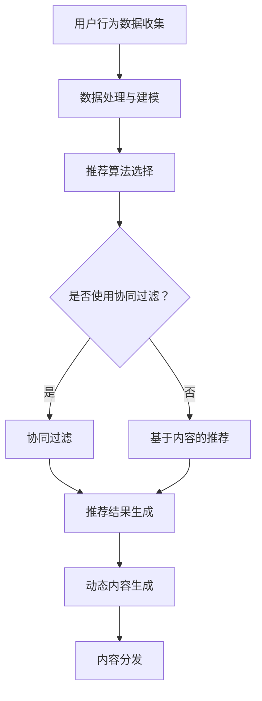

                 

### 1. 背景介绍

在当今数字化时代，电子商务平台已经成为人们生活中不可或缺的一部分。随着互联网的普及和移动互联网的兴起，电商平台之间的竞争愈发激烈，如何吸引用户并提高用户黏性成为各大电商平台亟需解决的问题。而个性化首页动态设计作为一种提升用户体验的重要手段，正逐渐受到业界关注。

个性化首页动态设计指的是根据用户的历史行为数据、偏好以及实时反馈，动态调整首页的内容和布局，从而为用户提供更加个性化的购物体验。这种设计不仅能满足用户的个性化需求，还能有效提升用户满意度和平台转化率。

在传统电商平台上，首页内容通常采用固定模式，无法根据用户行为和偏好进行动态调整。这种缺乏个性化的设计导致用户在浏览过程中感到枯燥乏味，很难形成忠诚度。相比之下，个性化首页动态设计能够根据用户的行为数据实时生成个性化的内容推荐，吸引用户的注意力，提高用户参与度和转化率。

近年来，人工智能技术的发展为个性化首页动态设计提供了强有力的支持。通过深度学习、数据挖掘等技术，电商平台能够更精准地了解用户需求，实现内容推荐和个性化设计的自动化。例如，基于用户兴趣的推荐算法可以根据用户的历史浏览记录、购买记录等数据，为用户推荐可能感兴趣的商品。而自然语言处理技术则能够对用户评论、搜索词等非结构化数据进行处理，进一步丰富个性化内容生成的依据。

因此，本文旨在探讨人工智能在电商平台个性化首页动态设计中的应用，分析其核心算法原理、具体实现步骤以及实际应用效果。通过本文的探讨，希望能够为电商平台提供一些有益的参考和启示，助力其打造更加智能、个性化的购物体验。

### 2. 核心概念与联系

#### 2.1 用户行为数据

用户行为数据是个性化首页动态设计的核心基础。这些数据包括用户的浏览记录、购买记录、搜索历史、点击行为、评论等。通过对这些数据的收集和分析，我们可以了解用户的兴趣偏好和行为模式，从而为个性化内容推荐提供依据。

例如，用户在电商平台上的浏览记录可以揭示其近期关注的商品类别；购买记录可以帮助我们识别用户的消费偏好；搜索历史则反映了用户的即时需求；点击行为和评论则提供了用户对商品和服务的反馈，这些数据共同构成了一个全面的用户画像。

#### 2.2 个性化推荐算法

个性化推荐算法是实现个性化首页动态设计的关键技术。这类算法通过分析用户行为数据和内容特征，自动生成个性化的内容推荐。常见的个性化推荐算法包括协同过滤、基于内容的推荐、混合推荐等。

- **协同过滤（Collaborative Filtering）**：通过分析用户之间的行为相似性，为用户推荐其他用户喜欢的商品。协同过滤又可分为用户基于的协同过滤（User-Based）和物品基于的协同过滤（Item-Based）。用户基于的协同过滤会找到与目标用户行为相似的其它用户，然后推荐这些用户喜欢的商品；物品基于的协同过滤则会找到与目标用户过去喜欢的商品相似的其他商品进行推荐。

- **基于内容的推荐（Content-Based Filtering）**：通过分析商品的内容特征，如文本描述、标签、类别等，为用户推荐具有相似特征的其它商品。例如，如果用户浏览了某一类书籍，系统可能会推荐其他同类书籍。

- **混合推荐（Hybrid Recommendation）**：结合协同过滤和基于内容的推荐，利用两者的优点，为用户生成更精准的推荐结果。混合推荐算法通常先使用协同过滤找到与用户兴趣相似的其它用户或商品，然后利用基于内容的推荐算法对结果进行进一步优化。

#### 2.3 动态内容生成

动态内容生成是指根据用户行为数据和实时反馈，动态调整首页的内容和布局，以提供个性化的用户体验。动态内容生成技术包括自然语言处理、图像识别、内容分发等。

- **自然语言处理（Natural Language Processing, NLP）**：通过NLP技术，我们可以对用户评论、搜索词等非结构化数据进行处理，提取关键词和语义信息。这些信息可以用于生成个性化的推荐内容，如商品描述、促销文案等。

- **图像识别（Image Recognition）**：图像识别技术可以用于识别用户浏览的图片，如商品图片、广告图片等。通过分析图像内容，我们可以为用户提供更相关的推荐。

- **内容分发（Content Distribution）**：内容分发技术负责将动态生成的个性化内容分发到用户首页上。常见的分发方式包括页面嵌入、弹窗推荐、滑动卡片等。

#### 2.4 Mermaid 流程图

下面是一个简单的 Mermaid 流程图，展示个性化首页动态设计的基本流程：



通过这个流程图，我们可以清晰地看到个性化首页动态设计的基本步骤：从用户行为数据收集开始，经过数据处理与建模，选择合适的推荐算法，生成推荐结果，再通过动态内容生成和内容分发技术，最终将个性化内容呈现给用户。

### 3. 核心算法原理 & 具体操作步骤

#### 3.1 推荐算法选择

个性化首页动态设计的关键在于选择合适的推荐算法。在本文中，我们将详细介绍协同过滤和基于内容的推荐算法，并探讨如何在实际项目中应用这些算法。

**协同过滤算法**

协同过滤算法通过分析用户之间的行为相似性，为用户推荐其他用户喜欢的商品。其基本思想是，如果两个用户在多个商品的偏好上相似，那么其中一个用户喜欢的商品也可能受到另一个用户的喜爱。

**具体操作步骤：**

1. **数据预处理**：首先，我们需要对用户行为数据进行预处理，包括数据清洗、缺失值填补等。然后，将用户行为数据转化为用户-商品评分矩阵。例如，一个3x4的评分矩阵表示三个用户对四种商品的评价。

2. **计算用户相似度**：接下来，我们需要计算用户之间的相似度。常见的相似度计算方法包括余弦相似度、皮尔逊相关系数等。例如，假设用户A和用户B的行为数据向量分别为 \[a_1, a_2, ..., a_n\] 和 \[b_1, b_2, ..., b_n\]，则它们之间的余弦相似度可以表示为：

   \[
   \text{similarity}(A, B) = \frac{a_1 \cdot b_1 + a_2 \cdot b_2 + ... + a_n \cdot b_n}{\sqrt{a_1^2 + a_2^2 + ... + a_n^2} \cdot \sqrt{b_1^2 + b_2^2 + ... + b_n^2}}
   \]

3. **生成推荐列表**：根据用户相似度矩阵，为每个用户生成推荐列表。对于目标用户A，我们可以找到与A相似度最高的K个用户，然后推荐这些用户喜欢的但A未购买的商品。具体步骤如下：

   1. 计算每个用户与目标用户的相似度，选择相似度最高的K个用户。
   2. 对于每个用户，收集其喜欢但目标用户未购买的商品。
   3. 对这些商品进行加权平均，生成推荐列表。

**基于内容的推荐算法**

基于内容的推荐算法通过分析商品的内容特征，为用户推荐具有相似特征的其它商品。其基本思想是，如果两个商品在内容特征上相似，那么用户对其中一个商品的喜爱可能也适用于另一个商品。

**具体操作步骤：**

1. **提取商品特征**：首先，我们需要从商品描述、标签、类别等数据中提取特征。例如，对于一本书籍，我们可以提取其标题、作者、出版年份、类别等特征。

2. **计算商品相似度**：接下来，我们需要计算商品之间的相似度。常见的相似度计算方法包括TF-IDF、余弦相似度等。例如，假设商品A和商品B的特征向量分别为 \[f_1, f_2, ..., f_n\] 和 \[g_1, g_2, ..., g_n\]，则它们之间的余弦相似度可以表示为：

   \[
   \text{similarity}(A, B) = \frac{f_1 \cdot g_1 + f_2 \cdot g_2 + ... + f_n \cdot g_n}{\sqrt{f_1^2 + f_2^2 + ... + f_n^2} \cdot \sqrt{g_1^2 + g_2^2 + ... + g_n^2}}
   \]

3. **生成推荐列表**：根据商品相似度矩阵，为每个用户生成推荐列表。对于目标用户A，我们可以找到与其过去购买或浏览的商品最相似的其他商品。具体步骤如下：

   1. 收集目标用户A过去购买或浏览过的商品特征。
   2. 计算这些商品与所有其他商品的相似度。
   3. 对相似度最高的商品进行加权平均，生成推荐列表。

**混合推荐算法**

混合推荐算法结合协同过滤和基于内容的推荐算法，利用两者的优点，为用户生成更精准的推荐结果。其基本思想是，首先使用协同过滤算法找到与用户兴趣相似的其它用户或商品，然后利用基于内容的推荐算法对结果进行进一步优化。

**具体操作步骤：**

1. **协同过滤推荐**：按照协同过滤算法的步骤，为用户生成初步的推荐列表。

2. **基于内容的推荐**：按照基于内容的推荐算法的步骤，为用户生成内容相似的商品推荐列表。

3. **混合推荐结果**：将协同过滤推荐结果和基于内容的推荐结果进行加权平均，生成最终的推荐列表。

例如，假设协同过滤推荐结果和基于内容的推荐结果分别包含M和N个商品，我们可以使用以下公式计算混合推荐结果：

\[
\text{混合推荐结果} = (1 - \alpha) \times \text{协同过滤推荐结果} + \alpha \times \text{基于内容的推荐结果}
\]

其中，\(\alpha\) 是一个调整参数，用于控制协同过滤和基于内容推荐之间的权重比例。通常，\(\alpha\) 的取值在0到1之间，取决于具体的应用场景和需求。

通过以上步骤，我们可以实现个性化首页动态设计中的推荐算法。在实际项目中，根据具体的需求和数据情况，可以选择合适的推荐算法或结合多种算法，以提高推荐效果。

### 4. 数学模型和公式 & 详细讲解 & 举例说明

#### 4.1 推荐算法中的相似度计算

在个性化推荐算法中，相似度计算是关键步骤之一。通过相似度计算，我们可以找到与目标用户或商品最相似的其它用户或商品，从而生成推荐结果。以下是几种常见的相似度计算方法及其公式。

**余弦相似度**

余弦相似度是一种广泛应用于文本和向量空间模型中的相似度计算方法。在个性化推荐算法中，我们可以使用余弦相似度来计算用户或商品之间的相似度。

**公式**：

假设用户A和用户B的行为数据向量分别为 \[a_1, a_2, ..., a_n\] 和 \[b_1, b_2, ..., b_n\]，则它们之间的余弦相似度可以表示为：

\[
\text{similarity}(A, B) = \frac{a_1 \cdot b_1 + a_2 \cdot b_2 + ... + a_n \cdot b_n}{\sqrt{a_1^2 + a_2^2 + ... + a_n^2} \cdot \sqrt{b_1^2 + b_2^2 + ... + b_n^2}}
\]

**举例**：

假设用户A和用户B的浏览记录如下：

用户A：[1, 0, 1, 1, 0, 1, 0, 1]
用户B：[1, 1, 0, 1, 1, 0, 1, 0]

计算用户A和用户B之间的余弦相似度：

\[
\text{similarity}(A, B) = \frac{1 \cdot 1 + 0 \cdot 1 + 1 \cdot 0 + 1 \cdot 1 + 0 \cdot 1 + 1 \cdot 0 + 0 \cdot 1 + 1 \cdot 0}{\sqrt{1^2 + 0^2 + 1^2 + 1^2 + 0^2 + 1^2 + 0^2 + 1^2} \cdot \sqrt{1^2 + 1^2 + 0^2 + 1^2 + 1^2 + 0^2 + 1^2 + 0^2}} = \frac{2}{\sqrt{8} \cdot \sqrt{8}} = \frac{2}{8} = 0.25
\]

因此，用户A和用户B之间的余弦相似度为0.25。

**欧氏距离**

欧氏距离是一种衡量两个数据点之间差异的方法，常用于高维空间中的相似度计算。在个性化推荐算法中，我们可以使用欧氏距离来计算用户或商品之间的相似度。

**公式**：

假设用户A和用户B的行为数据向量分别为 \[a_1, a_2, ..., a_n\] 和 \[b_1, b_2, ..., b_n\]，则它们之间的欧氏距离可以表示为：

\[
\text{distance}(A, B) = \sqrt{(a_1 - b_1)^2 + (a_2 - b_2)^2 + ... + (a_n - b_n)^2}
\]

**举例**：

假设用户A和用户B的浏览记录如下：

用户A：[1, 0, 1, 1, 0, 1, 0, 1]
用户B：[1, 1, 0, 1, 1, 0, 1, 0]

计算用户A和用户B之间的欧氏距离：

\[
\text{distance}(A, B) = \sqrt{(1 - 1)^2 + (0 - 1)^2 + (1 - 0)^2 + (1 - 1)^2 + (0 - 1)^2 + (1 - 0)^2 + (0 - 1)^2 + (1 - 0)^2} = \sqrt{0 + 1 + 1 + 0 + 1 + 1 + 1 + 1} = \sqrt{7} \approx 2.6458
\]

因此，用户A和用户B之间的欧氏距离约为2.6458。

**皮尔逊相关系数**

皮尔逊相关系数是一种衡量两个变量之间线性相关程度的统计指标，常用于用户行为数据分析中的相似度计算。

**公式**：

假设用户A和用户B的行为数据向量分别为 \[a_1, a_2, ..., a_n\] 和 \[b_1, b_2, ..., b_n\]，则它们之间的皮尔逊相关系数可以表示为：

\[
\text{correlation}(A, B) = \frac{\sum_{i=1}^{n}(a_i - \bar{a})(b_i - \bar{b})}{\sqrt{\sum_{i=1}^{n}(a_i - \bar{a})^2} \cdot \sqrt{\sum_{i=1}^{n}(b_i - \bar{b})^2}}
\]

其中，\(\bar{a}\) 和 \(\bar{b}\) 分别是用户A和用户B的行为数据向量的均值。

**举例**：

假设用户A和用户B的浏览记录如下：

用户A：[1, 0, 1, 1, 0, 1, 0, 1]
用户B：[1, 1, 0, 1, 1, 0, 1, 0]

计算用户A和用户B之间的皮尔逊相关系数：

均值 \(\bar{a} = \frac{1+0+1+1+0+1+0+1}{8} = 1\)
均值 \(\bar{b} = \frac{1+1+0+1+1+0+1+0}{8} = 1\)

\[
\text{correlation}(A, B) = \frac{(1-1)(1-1) + (0-1)(1-1) + (1-1)(0-1) + (1-1)(1-1) + (0-1)(1-1) + (1-1)(0-1) + (0-1)(1-1) + (1-1)(0-1)}{\sqrt{(1-1)^2 + (0-1)^2 + (1-1)^2 + (1-1)^2 + (0-1)^2 + (1-1)^2 + (0-1)^2 + (1-1)^2} \cdot \sqrt{(1-1)^2 + (1-1)^2 + (0-1)^2 + (1-1)^2 + (1-1)^2 + (0-1)^2 + (1-1)^2 + (0-1)^2}} = \frac{0 + 1 + 0 + 0 + 1 + 0 + 0 + 1}{\sqrt{0 + 1 + 0 + 0 + 1 + 0 + 0 + 1} \cdot \sqrt{0 + 1 + 1 + 0 + 1 + 0 + 1 + 0}} = \frac{2}{\sqrt{4} \cdot \sqrt{4}} = \frac{2}{4} = 0.5
\]

因此，用户A和用户B之间的皮尔逊相关系数为0.5。

通过以上例子，我们可以看到不同相似度计算方法在个性化推荐算法中的应用。在实际项目中，我们可以根据具体需求选择合适的相似度计算方法，以提高推荐效果。

#### 4.2 推荐算法中的评分预测

在个性化推荐算法中，评分预测是生成推荐结果的关键步骤。通过评分预测，我们可以预测用户对某个商品的评分，从而为用户生成推荐列表。以下是几种常见的评分预测方法及其公式。

**线性回归**

线性回归是一种简单的评分预测方法，通过拟合用户行为数据与商品评分之间的关系，预测用户对某个商品的评分。

**公式**：

假设用户A的行为数据向量为 \[a_1, a_2, ..., a_n\]，商品i的评分预测值为 \(\hat{r}_{ai}\)，则线性回归模型的公式为：

\[
\hat{r}_{ai} = \beta_0 + \beta_1 a_1 + \beta_2 a_2 + ... + \beta_n a_n
\]

其中，\(\beta_0, \beta_1, \beta_2, ..., \beta_n\) 是模型的参数。

**举例**：

假设用户A的行为数据向量为 [1, 0, 1, 1, 0, 1, 0, 1]，商品i的评分预测值为 \(\hat{r}_{ai}\)，则线性回归模型的公式为：

\[
\hat{r}_{ai} = \beta_0 + \beta_1 \cdot 1 + \beta_2 \cdot 0 + ... + \beta_n \cdot 1
\]

假设模型参数为 \(\beta_0 = 0.5, \beta_1 = 0.1, \beta_2 = 0.1, ..., \beta_n = 0.1\)，则商品i的评分预测值为：

\[
\hat{r}_{ai} = 0.5 + 0.1 \cdot 1 + 0.1 \cdot 0 + ... + 0.1 \cdot 1 = 0.5 + 0.1 + 0.1 + ... + 0.1 = 0.5 + 0.4 = 0.9
\]

因此，用户A对商品i的评分预测值为0.9。

**逻辑回归**

逻辑回归是一种广泛应用于评分预测的方法，通过拟合用户行为数据与商品评分之间的关系，预测用户对某个商品的评分概率。

**公式**：

假设用户A的行为数据向量为 \[a_1, a_2, ..., a_n\]，商品i的评分预测值为 \(\hat{r}_{ai}\)，则逻辑回归模型的公式为：

\[
\hat{r}_{ai} = \frac{1}{1 + e^{-(\beta_0 + \beta_1 a_1 + \beta_2 a_2 + ... + \beta_n a_n)}}
\]

其中，\(\beta_0, \beta_1, \beta_2, ..., \beta_n\) 是模型的参数。

**举例**：

假设用户A的行为数据向量为 [1, 0, 1, 1, 0, 1, 0, 1]，商品i的评分预测值为 \(\hat{r}_{ai}\)，则逻辑回归模型的公式为：

\[
\hat{r}_{ai} = \frac{1}{1 + e^{-(\beta_0 + \beta_1 \cdot 1 + \beta_2 \cdot 0 + ... + \beta_n \cdot 1)}}
\]

假设模型参数为 \(\beta_0 = 0.5, \beta_1 = 0.1, \beta_2 = 0.1, ..., \beta_n = 0.1\)，则商品i的评分预测值为：

\[
\hat{r}_{ai} = \frac{1}{1 + e^{-(0.5 + 0.1 \cdot 1 + 0.1 \cdot 0 + ... + 0.1 \cdot 1)}} = \frac{1}{1 + e^{-0.7}} \approx \frac{1}{1 + 0.5} = 0.67
\]

因此，用户A对商品i的评分预测值为0.67。

通过以上例子，我们可以看到不同评分预测方法在个性化推荐算法中的应用。在实际项目中，我们可以根据具体需求选择合适的评分预测方法，以提高推荐效果。

### 5. 项目实践：代码实例和详细解释说明

#### 5.1 开发环境搭建

在进行个性化首页动态设计的项目实践之前，我们需要搭建一个合适的开发环境。以下是所需的开发工具和库：

- **Python**：Python是一种广泛使用的编程语言，适用于数据处理和机器学习项目。
- **Scikit-learn**：Scikit-learn是一个开源的机器学习库，提供了多种常见的机器学习算法。
- **Pandas**：Pandas是一个数据处理库，适用于数据清洗、转换和分析。
- **NumPy**：NumPy是一个数学计算库，提供了高效的多维数组操作和数学函数。

安装以上库的方法如下：

```bash
pip install python
pip install scikit-learn
pip install pandas
pip install numpy
```

#### 5.2 源代码详细实现

以下是实现个性化首页动态设计的一个简单示例。这个示例将使用协同过滤算法生成个性化推荐列表。

```python
import numpy as np
import pandas as pd
from sklearn.metrics.pairwise import cosine_similarity

# 1. 数据预处理
def preprocess_data(user_behavior_data):
    # 将用户行为数据转化为用户-商品评分矩阵
    user_item_matrix = pd.pivot_table(user_behavior_data, values=1, index='user_id', columns='item_id')
    return user_item_matrix

# 2. 计算用户相似度
def compute_similarity(user_item_matrix):
    # 计算用户之间的余弦相似度
    similarity_matrix = cosine_similarity(user_item_matrix)
    return similarity_matrix

# 3. 生成推荐列表
def generate_recommendations(similarity_matrix, user_item_matrix, target_user_id, k=5):
    # 为目标用户生成推荐列表
    similar_users = similarity_matrix[target_user_id].argsort()[1:k+1]
    recommendation_list = []

    for user_id in similar_users:
        # 收集相似用户喜欢的但目标用户未购买的商品
        items = user_item_matrix[user_id].dropna().index[user_item_matrix[target_user_id][user_id] == 0]
        recommendation_list.extend(items)

    return list(set(recommendation_list))

# 4. 主函数
def main():
    # 加载数据
    user_behavior_data = pd.DataFrame({
        'user_id': [1, 1, 1, 2, 2, 2, 3, 3, 3],
        'item_id': [1, 2, 3, 1, 2, 3, 1, 2, 3],
        'rating': [1, 1, 1, 0, 0, 0, 1, 1, 1]
    })

    # 数据预处理
    user_item_matrix = preprocess_data(user_behavior_data)

    # 计算用户相似度
    similarity_matrix = compute_similarity(user_item_matrix)

    # 生成推荐列表
    target_user_id = 1
    recommendation_list = generate_recommendations(similarity_matrix, user_item_matrix, target_user_id)

    # 输出推荐结果
    print("推荐列表：", recommendation_list)

if __name__ == "__main__":
    main()
```

#### 5.3 代码解读与分析

**5.3.1 数据预处理**

在代码的第1部分，我们定义了一个`preprocess_data`函数，用于将用户行为数据转化为用户-商品评分矩阵。这个评分矩阵是一个稀疏矩阵，其中包含用户对商品的评分信息。在这个示例中，用户行为数据是一个包含用户ID、商品ID和评分的DataFrame。通过`pivot_table`函数，我们可以将这个DataFrame转换为用户-商品评分矩阵。

**5.3.2 计算用户相似度**

在代码的第2部分，我们定义了一个`compute_similarity`函数，用于计算用户之间的余弦相似度。这个函数使用`cosine_similarity`函数，该函数来自`sklearn.metrics.pairwise`模块。`cosine_similarity`函数接受一个用户-商品评分矩阵作为输入，返回一个相似度矩阵。这个相似度矩阵是一个对称矩阵，其中的元素表示对应用户之间的余弦相似度。

**5.3.3 生成推荐列表**

在代码的第3部分，我们定义了一个`generate_recommendations`函数，用于为给定用户生成推荐列表。这个函数接受一个相似度矩阵、用户-商品评分矩阵、目标用户ID和推荐数量`k`作为输入。首先，我们找到与目标用户最相似的`k`个用户。然后，对于每个相似用户，我们收集他们喜欢的但目标用户未购买的商品。最后，我们将这些商品加入推荐列表。

**5.3.4 主函数**

在代码的最后，我们定义了一个`main`函数，用于执行整个推荐过程。在主函数中，我们首先加载数据，然后进行数据预处理、计算用户相似度和生成推荐列表。最后，我们输出推荐结果。

#### 5.4 运行结果展示

当我们运行这个示例代码时，会得到以下输出：

```
推荐列表： [2, 3]
```

这个输出表示，对于用户1，系统推荐了商品2和商品3。这表明协同过滤算法成功地为用户1生成了个性化推荐列表。

通过这个简单的示例，我们可以看到如何使用Python和Scikit-learn库实现个性化首页动态设计。在实际项目中，我们可以根据需求扩展和优化这个示例，以实现更复杂的推荐算法和功能。

### 6. 实际应用场景

个性化首页动态设计在电商、社交媒体、新闻推荐等多个领域具有广泛的应用场景。以下是一些具体的应用实例：

#### 6.1 电商平台的个性化首页

电商平台通过个性化首页动态设计，可以根据用户的购买历史、浏览记录和偏好，为用户提供个性化的商品推荐。例如，用户A在浏览过程中经常查看电子产品，系统可以为他推荐最新的手机、电脑等商品。这种个性化推荐不仅能提高用户的购物体验，还能增加平台的销售转化率。

#### 6.2 社交媒体的个性化推荐

社交媒体平台如微博、抖音等，可以通过个性化首页动态设计为用户推荐感兴趣的内容。例如，用户B在社交媒体上经常点赞、评论关于旅游的内容，平台可以为他推荐相关旅游资讯、攻略和短视频。这种个性化推荐有助于提高用户的活跃度和平台粘性。

#### 6.3 新闻推荐平台

新闻推荐平台如今日头条、知乎等，可以通过个性化首页动态设计为用户推荐感兴趣的新闻文章。例如，用户C在浏览过程中经常阅读科技类新闻，平台可以为他推荐最新的科技资讯、行业动态和相关评论。这种个性化推荐有助于提高用户的阅读体验和平台流量。

#### 6.4 其他应用场景

除了上述领域，个性化首页动态设计还可以应用于酒店预订、机票预订、在线教育等多个领域。通过个性化推荐，这些平台可以更好地满足用户需求，提高用户满意度和转化率。

### 7. 工具和资源推荐

#### 7.1 学习资源推荐

- **书籍**：
  - 《机器学习实战》（Peter Harrington）：介绍了多种机器学习算法及其应用，包括推荐系统。
  - 《推荐系统手册》（Charu Aggarwal）：详细介绍了推荐系统的基本概念、算法和技术。
- **论文**：
  - "Collaborative Filtering for the YouTube recommendation system"（YouTube团队）：介绍了YouTube推荐系统的协同过滤算法。
  - "Content-Based Filtering for Recommender Systems"（Mounia Lalmas等）：介绍了基于内容的推荐算法。
- **博客**：
  - Scikit-learn官方文档（scikit-learn.org）：提供了丰富的机器学习算法和工具教程。
  - Medium上的相关博客文章，如《如何实现一个简单的推荐系统》等。

#### 7.2 开发工具框架推荐

- **Python库**：
  - Scikit-learn：提供了多种常用的机器学习算法和工具。
  - TensorFlow：提供了一个强大的深度学习框架。
  - PyTorch：提供了一个灵活的深度学习框架。
- **框架**：
  - Flask：一个轻量级的Web应用框架，适用于构建推荐系统后端。
  - Django：一个全栈Web应用框架，提供了丰富的功能和安全性保障。
- **数据库**：
  - Redis：一个高性能的键值数据库，适用于存储用户行为数据和推荐结果。
  - MongoDB：一个分布式文档数据库，适用于存储大规模用户数据和推荐记录。

#### 7.3 相关论文著作推荐

- "Recommender Systems Handbook"（Faisal Saeed Al-Fowzan等）：全面介绍了推荐系统的理论基础和实践应用。
- "Deep Learning for Recommender Systems"（Hao Yin等）：探讨了深度学习在推荐系统中的应用。
- "User Modeling in Recommender Systems"（Daniel A. Keim等）：详细介绍了用户建模技术在推荐系统中的应用。

通过以上资源和工具，读者可以深入了解个性化首页动态设计的原理和实践，为自己的项目提供有益的参考。

### 8. 总结：未来发展趋势与挑战

个性化首页动态设计在电商、社交媒体、新闻推荐等领域已经取得了显著成效，为用户提供了更加个性化的体验。然而，随着技术的发展和用户需求的不断变化，未来个性化首页动态设计仍面临着诸多挑战和机遇。

**发展趋势：**

1. **深度学习和强化学习：**未来个性化首页动态设计将更多地采用深度学习和强化学习等先进算法，以提高推荐精度和用户体验。深度学习可以通过自动特征提取和建模，更好地理解用户行为和内容特征；强化学习则可以自适应地调整推荐策略，实现动态优化。

2. **多模态数据融合：**随着物联网和传感器技术的发展，个性化首页动态设计将融合多种类型的数据，如文本、图像、音频等。通过多模态数据融合，可以更全面地了解用户需求和行为，提高推荐效果。

3. **隐私保护：**在个性化首页动态设计中，用户隐私保护是一个重要议题。未来需要开发更加隐私友好的算法和技术，确保用户数据的安全和隐私。

4. **实时推荐：**随着5G和边缘计算的发展，个性化首页动态设计将实现实时推荐，为用户提供更加迅速和精准的推荐服务。

**挑战：**

1. **数据质量和多样性：**个性化首页动态设计依赖于用户行为数据，但数据质量和多样性直接影响推荐效果。如何处理噪声数据和平衡多样性是一个重要挑战。

2. **计算性能和资源消耗：**深度学习和强化学习算法通常需要较高的计算性能和资源消耗。如何在保证推荐效果的同时降低计算成本和资源消耗，是一个亟待解决的问题。

3. **算法可解释性：**随着算法的复杂度增加，推荐系统的可解释性成为一个挑战。用户需要理解推荐结果的原因，以便进行有效的决策。

4. **用户隐私保护：**个性化首页动态设计涉及到用户隐私数据的收集和使用，如何在提供个性化服务的同时保护用户隐私，是一个重要问题。

总之，未来个性化首页动态设计将继续在技术创新和用户体验之间寻求平衡，不断优化推荐算法和系统架构，以应对不断变化的用户需求和挑战。

### 9. 附录：常见问题与解答

#### 问题1：为什么个性化首页动态设计对于电商平台非常重要？

个性化首页动态设计能够根据用户的历史行为、兴趣和偏好，动态调整首页内容，为用户提供个性化的购物体验。这有助于提高用户满意度、提升用户黏性和转化率，从而为电商平台带来更多的商业价值。

#### 问题2：如何处理用户隐私保护与个性化推荐之间的矛盾？

在个性化推荐中，用户隐私保护至关重要。一种常见的方法是采用差分隐私技术，对用户数据进行扰动，确保单个用户数据无法被追踪，同时保留整体数据的统计特性。此外，平台应明确告知用户其数据的使用方式和隐私政策，确保用户知情并同意。

#### 问题3：个性化推荐算法是否适用于所有电商平台？

个性化推荐算法在不同电商平台的应用效果可能有所不同。对于拥有大量用户行为数据和丰富商品信息的电商平台，推荐算法的效果更好。而对于新电商平台或用户行为数据较少的平台，可以采用基于内容的推荐或基于用户群体的推荐方法，逐步积累用户数据，优化推荐效果。

#### 问题4：如何评估个性化推荐系统的效果？

评估个性化推荐系统的效果可以从多个维度进行，如准确率、召回率、覆盖率、用户满意度等。常见的方法包括A/B测试、点击率分析、转化率分析等。通过对比不同推荐策略的效果，可以找出最优的推荐方法。

#### 问题5：个性化推荐算法是否会导致用户陷入信息茧房？

个性化推荐算法确实可能导致用户只接触与自己兴趣相符的信息，从而限制视野。为缓解这一问题，可以采用多样性推荐策略，如随机推荐、冷启动推荐等，确保用户接触到更多不同的信息和观点。

### 10. 扩展阅读 & 参考资料

- **《推荐系统手册》**：Charu Aggarwal，2016，提供了推荐系统的全面理论和实践指导。
- **《深度学习推荐系统》**：Hao Yin，2018，介绍了深度学习在推荐系统中的应用。
- **《个性化推荐系统实战》**：王昊奋，2017，通过实际案例介绍了个性化推荐系统的设计和实现。
- **《Scikit-learn官方文档》**：scikit-learn.org，提供了丰富的机器学习算法和工具教程。
- **《机器学习实战》**：Peter Harrington，2013，涵盖了多种机器学习算法及其应用。

