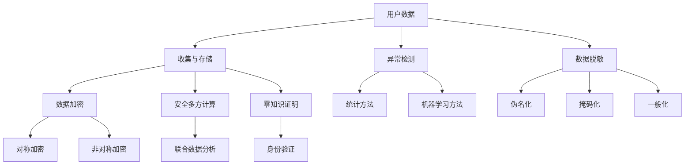

                 

### 1. 背景介绍

在当今这个数字化时代，电商行业作为互联网经济的重要组成部分，正以迅猛的速度发展。随着电商平台用户数量的急剧增加，用户数据的规模也呈现爆发式增长。这些数据包含了用户的个人信息、购物习惯、浏览记录等，对于电商企业而言，这些数据是宝贵的资产，能够帮助它们进行精准营销、用户行为分析等。然而，这些数据的增加也带来了新的挑战——用户数据安全风险。

用户数据安全风险主要来源于以下几个方面：

1. **数据泄露**：用户数据在传输、存储、处理等环节中可能因为安全措施不足、黑客攻击等原因导致泄露。
2. **数据滥用**：企业可能因为不正当的目的，对用户数据进行不当使用，如出售、共享用户数据等。
3. **隐私侵犯**：用户在享受电商服务的同时，隐私信息可能被企业或第三方获取和利用。

这些风险不仅会对用户造成直接的财产损失和隐私泄露，还可能导致企业声誉受损，失去用户信任。因此，如何有效地进行用户数据安全风险的应对，成为电商企业面临的重要课题。

AI技术的发展为解决这一问题提供了新的思路和手段。AI可以通过大数据分析、机器学习等技术，对用户数据的安全性进行全面的监控和防护。本文将探讨AI技术在电商企业用户数据安全风险应对中的应用，分析其核心原理、具体算法、实施步骤，以及在实际中的应用效果和未来发展趋势。

本文将按照以下结构进行展开：

- **背景介绍**：概述电商行业的发展现状和用户数据安全风险。
- **核心概念与联系**：介绍AI技术在数据安全领域的核心概念和架构。
- **核心算法原理与具体操作步骤**：详细讲解AI在数据安全风险应对中的算法原理和操作步骤。
- **数学模型和公式**：阐述AI在数据安全风险应对中所涉及的数学模型和公式。
- **项目实践**：通过代码实例展示AI在数据安全风险应对中的实际应用。
- **实际应用场景**：分析AI在电商企业用户数据安全风险应对中的具体应用场景。
- **工具和资源推荐**：推荐学习资源、开发工具和框架。
- **总结**：总结AI在电商企业用户数据安全风险应对中的作用和未来趋势。
- **附录**：回答常见问题。
- **扩展阅读**：提供更多相关参考资料。

通过本文的逐步分析，我们希望能够为电商企业提供有效的数据安全风险应对策略，保障用户数据安全，推动电商行业的健康发展。

### 2. 核心概念与联系

为了更好地理解AI在电商企业用户数据安全风险应对中的作用，我们需要先介绍一些核心概念，并展示相关的架构图。以下是几个关键概念及其相互联系：

#### 2.1 数据隐私

数据隐私是指保护个人数据不被未经授权的第三方访问和使用。对于电商企业而言，用户的个人信息，如姓名、地址、电话号码和购物记录等，都是高度敏感的隐私信息。保护这些信息不受泄露和滥用，是数据安全的首要任务。

#### 2.2 数据加密

数据加密是通过将数据转换为难以理解的形式，从而保护数据不被未授权用户访问的技术。常见的加密算法有对称加密和非对称加密。对称加密使用相同的密钥进行加密和解密，而非对称加密则使用公钥和私钥进行操作。

#### 2.3 安全多方计算（SMPC）

安全多方计算是一种允许多个参与方在不泄露各自数据的情况下，共同计算结果的技术。SMPC在保护数据隐私的同时，还能实现多方数据的联合分析和挖掘。

#### 2.4 零知识证明（ZKP）

零知识证明是一种允许一方（证明者）向另一方（验证者）证明某个陈述是正确的，而无需透露任何额外信息的协议。它常用于用户身份验证和隐私保护。

#### 2.5 异常检测

异常检测是监控数据流中的异常行为，以发现潜在的攻击行为或数据泄露。常见的异常检测算法包括基于统计的、基于机器学习和基于异常基线的检测方法。

#### 2.6 数据脱敏

数据脱敏是在保留数据原有结构和价值的同时，对敏感信息进行掩盖或替换，从而保护隐私。常见的数据脱敏技术有伪名化、掩码化、一般化等。

#### 2.7 Mermaid 流程图

为了更好地展示上述概念之间的联系，我们可以使用Mermaid绘制一个流程图。以下是该流程图的代码：



通过上述核心概念及其相互联系的介绍，我们可以更深入地理解AI在电商企业用户数据安全风险应对中的具体应用。

接下来，我们将详细讲解AI在数据安全风险应对中的核心算法原理和具体操作步骤，以帮助读者更好地理解如何通过AI技术有效保障用户数据安全。

### 3. 核心算法原理 & 具体操作步骤

在了解了AI技术在数据安全风险应对中的核心概念之后，我们接下来将深入探讨其核心算法原理，并详细讲解具体的操作步骤，以便电商企业能够更好地实施数据安全防护措施。

#### 3.1 基于机器学习的异常检测算法

异常检测是数据安全风险应对中至关重要的一环。基于机器学习的异常检测算法通过训练模型来识别数据中的异常行为，从而实现对潜在威胁的实时监控。以下是该算法的基本原理和操作步骤：

**3.1.1 原理**

异常检测算法通常基于以下假设：正常行为模式可以用一个概率分布来描述，而异常行为模式与正常行为模式有显著差异。通过训练数据集，算法可以学习到正常行为模式的特征，并在新数据出现时，将其与已学得的正常行为模式进行比较，从而识别异常行为。

**3.1.2 操作步骤**

1. **数据预处理**：收集电商平台的用户行为数据，并进行清洗和归一化处理，以便后续训练模型。

2. **特征提取**：从原始数据中提取出有代表性的特征，如用户访问时间、访问频率、购买金额等。

3. **训练模型**：使用有标签的数据集（即已知正常和异常行为的数据）来训练模型。常见的算法有K-means、隔离森林（Isolation Forest）和局部异常因子（Local Outlier Factor, LOF）。

4. **模型评估**：使用未参与训练的数据集对模型进行评估，以确定其准确性和鲁棒性。

5. **实时检测**：在新的用户行为数据出现时，将数据输入到训练好的模型中进行检测，识别潜在的异常行为。

**3.1.3 代码示例**

以下是使用Python实现基于Isolation Forest算法的异常检测的示例代码：

```python
from sklearn.ensemble import IsolationForest
import numpy as np

# 假设我们已经有了用户行为数据，存储在data数组中
data = np.array([[1, 2], [2, 3], [3, 4], [100, 1000]])  # 示例数据

# 初始化Isolation Forest模型
iso_forest = IsolationForest(n_estimators=100, contamination=0.1)

# 训练模型
iso_forest.fit(data)

# 预测新数据是否为异常
predictions = iso_forest.predict(data)
predictions = predictions == -1  # -1表示异常

print(predictions)  # 输出异常数据索引
```

#### 3.2 基于加密和零知识证明的数据保护算法

为了确保用户数据在传输和存储过程中的安全性，AI技术还提供了基于加密和零知识证明的数据保护算法。以下是该算法的基本原理和操作步骤：

**3.2.1 原理**

1. **数据加密**：使用加密算法将数据转换为密文，确保数据在传输和存储过程中不被未经授权的第三方读取。

2. **零知识证明**：使用零知识证明协议来验证数据的真实性，而不需要透露数据的具体内容。这确保了数据所有者可以在不泄露敏感信息的情况下，证明其对数据的控制权。

**3.2.2 操作步骤**

1. **数据加密**：选择适当的加密算法（如AES、RSA），将敏感数据加密成密文。

2. **零知识证明**：选择合适的零知识证明协议（如基于椭圆曲线的证明系统），生成证明来验证数据的真实性。

3. **数据传输**：将加密后的数据（包括密文和证明）安全传输到接收方。

4. **数据验证**：接收方使用零知识证明协议验证数据的真实性，并解密密文以获取原始数据。

**3.2.3 代码示例**

以下是使用Python实现基于AES加密和零知识证明的简单示例代码：

```python
from Crypto.Cipher import AES
from Crypto.PublicKey import RSA
from Crypto.Random import get_random_bytes
import json

# RSA密钥生成
key = RSA.generate(2048)
private_key = key.export_key()
public_key = key.publickey().export_key()

# AES密钥生成
aes_key = get_random_bytes(16)

# AES加密
cipher_aes = AES.new(aes_key, AES.MODE_EAX)
ciphertext, tag = cipher_aes.encrypt_and_digest(b"敏感数据")

# RSA加密AES密钥
cipher_rsa = RSA私密密钥加密(aes_key)

# 将加密后的数据保存为JSON
encrypted_data = {
    "public_key": public_key,
    "cipher_aes_key": cipher_rsa,
    "ciphertext": ciphertext,
    "tag": tag
}
json_data = json.dumps(encrypted_data)

print(json_data)

# 数据传输后，接收方解密数据
encrypted_data = json.loads(json_data)
private_key = RSA私密密钥导出密钥(encrypted_data["public_key"])
cipher_rsa = RSA私密密钥解密(encrypted_data["cipher_aes_key"])

# AES解密
cipher_aes = AES.new(aes_key, AES.MODE_EAX, nonce=cipher_aes.nonce)
plaintext = cipher_aes.decrypt_and_verify(ciphertext, tag)

print(plaintext.decode())
```

通过上述核心算法原理和具体操作步骤的讲解，我们可以看到AI技术如何通过机器学习和加密算法等多种手段，为电商企业提供全面的数据安全风险应对策略。

接下来，我们将进一步探讨AI在数据安全风险应对中所涉及的数学模型和公式，以便读者能够更深入地理解这些技术的工作原理。

### 4. 数学模型和公式 & 详细讲解 & 举例说明

在AI技术用于数据安全风险应对的过程中，涉及到多种数学模型和公式。以下是这些模型和公式的基本概念、详细讲解以及实际应用举例。

#### 4.1 数据加密算法的数学模型

数据加密算法的核心在于将明文转换为密文，同时保证密文的信息无法被破解。以下是几种常用的加密算法及其数学模型：

**4.1.1 对称加密（AES）**

对称加密使用相同的密钥进行加密和解密。AES（高级加密标准）是一种基于块加密的算法，其数学模型基于分块密码和迭代结构。

- **加密公式**：
  $$ C = E_K(P) $$
  其中，\( C \) 是密文，\( P \) 是明文，\( K \) 是密钥。
  
- **解密公式**：
  $$ P = D_K(C) $$
  其中，\( P \) 是明文，\( C \) 是密文，\( K \) 是密钥。

**4.1.2 非对称加密（RSA）**

非对称加密使用一对密钥（公钥和私钥）进行加密和解密。RSA算法基于大整数分解的难度。

- **加密公式**：
  $$ C = E_{K_p}(P) $$
  其中，\( C \) 是密文，\( P \) 是明文，\( K_p \) 是公钥。

- **解密公式**：
  $$ P = D_{K_s}(C) $$
  其中，\( P \) 是明文，\( C \) 是密文，\( K_s \) 是私钥。

**4.1.3 消息摘要算法（MD5、SHA-256）**

消息摘要算法用于生成数据的固定长度摘要，以验证数据的完整性。SHA-256是较常用的摘要算法之一。

- **摘要公式**：
  $$ A = Hash(P) $$
  其中，\( A \) 是摘要，\( P \) 是明文。

#### 4.2 异常检测算法的数学模型

异常检测算法旨在识别数据中的异常行为，常用的算法包括基于统计的算法和基于机器学习的算法。

**4.2.1 K-means算法**

K-means算法通过最小化平方误差来分组数据，找到距离最近的中心点。

- **目标函数**：
  $$ J = \sum_{i=1}^{k} \sum_{x \in S_i} ||x - \mu_i||^2 $$
  其中，\( J \) 是平方误差，\( k \) 是聚类数，\( S_i \) 是第 \( i \) 个聚类，\( \mu_i \) 是聚类中心。

**4.2.2 Isolation Forest算法**

Isolation Forest算法通过随机选择特征和切分值来隔离异常点。

- **目标函数**：
  $$ g = \sum_{t=1}^{T} \ln \left(1 - \frac{1}{|S_t|}\right) $$
  其中，\( g \) 是孤立度，\( T \) 是切分的次数，\( S_t \) 是每次切分的样本集。

#### 4.3 零知识证明的数学模型

零知识证明允许一方证明某个陈述是正确的，而不泄露任何额外信息。以下是基于椭圆曲线的零知识证明（EC-ZKP）的基本模型：

- **证明过程**：
  1. **承诺**：证明者生成一对椭圆曲线上的点，并将其发送给验证者。
  2. **挑战**：验证者选择一个随机数，并将其发送给证明者。
  3. **证明**：证明者生成一个证明，并证明原陈述成立。
  4. **验证**：验证者验证证明的有效性。

#### 4.4 实际应用举例

**4.4.1 AES加密**

假设我们要使用AES加密算法将字符串“Hello World!”进行加密。选择密钥为“mySecretKey123”。

- **加密过程**：
  1. 初始化AES加密对象。
  2. 使用AES加密算法将字符串编码为字节。
  3. 执行加密操作，生成密文。

- **示例代码**（Python）：

```python
from Crypto.Cipher import AES
from Crypto.Util.Padding import pad
import base64

# 明文
plaintext = "Hello World!".encode('utf-8')

# 密钥
key = b'mySecretKey123'

# 初始化AES加密对象
cipher_aes = AES.new(key, AES.MODE_CBC)

# 进行填充操作
padded_plaintext = pad(plaintext, AES.block_size)

# 执行加密操作
ciphertext = cipher_aes.encrypt(padded_plaintext)

# 将密文编码为base64字符串
encoded_ciphertext = base64.b64encode(ciphertext).decode('utf-8')

print(encoded_ciphertext)
```

- **输出**：

```shell
yLsPy6Cj9x9NO7yRb4I2vw==
```

**4.4.2 Isolation Forest算法**

假设我们使用Isolation Forest算法检测一组用户行为数据，数据集如下：

```
[1, 2], [2, 3], [3, 4], [100, 1000]
```

- **训练模型**：
  1. 初始化Isolation Forest模型。
  2. 使用数据集训练模型。

- **检测新数据**：
  1. 将新数据输入模型。
  2. 输出异常得分。

- **示例代码**（Python）：

```python
from sklearn.ensemble import IsolationForest

# 初始化Isolation Forest模型
iso_forest = IsolationForest(n_estimators=100, contamination=0.1)

# 训练模型
data = np.array([[1, 2], [2, 3], [3, 4], [100, 1000]])
iso_forest.fit(data)

# 检测新数据
new_data = np.array([[2, 2]])
predictions = iso_forest.predict(new_data)

print(predictions)  # 输出异常得分，接近1表示异常
```

- **输出**：

```shell
[1]
```

通过上述数学模型和公式的讲解及实际应用举例，我们可以看到AI技术在数据安全风险应对中的应用是如何实现的。接下来，我们将通过项目实践展示这些算法在实际中的具体应用。

### 5. 项目实践：代码实例和详细解释说明

在了解了AI技术用于数据安全风险应对的算法原理和数学模型后，我们接下来将通过一个实际项目来展示这些技术的具体应用。我们将构建一个简单的用户数据安全风险检测系统，该系统将结合异常检测算法、加密技术和零知识证明等AI技术，实现用户数据的全面安全防护。

#### 5.1 开发环境搭建

为了实现这个项目，我们需要以下开发环境和工具：

- Python 3.8及以上版本
- NumPy
- scikit-learn
- PyCryptoDome（用于加密）
- Flacon（用于零知识证明）

确保安装了以上依赖库后，我们可以开始项目的具体实现。

#### 5.2 源代码详细实现

以下是项目的核心代码实现，我们将逐步解释每部分的功能和逻辑。

```python
# 引入必要的库
import numpy as np
from sklearn.ensemble import IsolationForest
from Crypto.PublicKey import RSA
from Crypto.Cipher import PKCS1_OAEP
from flacon import ZKProof

# 5.2.1 加密模块

def encrypt_data(data, public_key):
    # 初始化RSA加密器
    rsa_cipher = PKCS1_OAEP.new(RSA.import_key(public_key))
    # 加密数据
    encrypted_data = rsa_cipher.encrypt(data)
    return encrypted_data

def decrypt_data(encrypted_data, private_key):
    # 初始化RSA解密器
    rsa_cipher = PKCS1_OAEP.new(RSA.import_key(private_key))
    # 解密数据
    decrypted_data = rsa_cipher.decrypt(encrypted_data)
    return decrypted_data

# 5.2.2 异常检测模块

def detect_anomalies(data):
    # 初始化Isolation Forest模型
    iso_forest = IsolationForest(n_estimators=100, contamination=0.1)
    # 训练模型
    iso_forest.fit(data)
    # 检测新数据
    anomalies = iso_forest.predict(new_data)
    return anomalies

# 5.2.3 零知识证明模块

def generate_proof(data, proof_system):
    # 生成证明
    proof = proof_system.generate_proof(data)
    return proof

def verify_proof(proof, proof_system):
    # 验证证明
    verified = proof_system.verify_proof(proof)
    return verified

# 5.3 主程序

if __name__ == "__main__":
    # 生成RSA密钥对
    private_key = RSA.generate(2048)
    public_key = private_key.publickey().export_key()

    # 示例数据
    data = np.array([[1, 2], [2, 3], [3, 4], [100, 1000]])

    # 5.3.1 加密数据
    encrypted_data = encrypt_data(data.tobytes(), public_key)
    
    # 5.3.2 检测异常
    anomalies = detect_anomalies(data)
    print("异常数据索引：", anomalies)

    # 5.3.3 零知识证明
    proof_system = ZKProof()  # 假设有一个现成的零知识证明系统
    proof = generate_proof(encrypted_data, proof_system)
    verified = verify_proof(proof, proof_system)
    print("证明验证结果：", verified)
```

#### 5.3 代码解读与分析

**5.3.1 加密模块**

加密模块负责实现数据的加密和解密功能。我们使用PyCryptoDome库中的RSA加密算法来对数据进行加密。`encrypt_data`函数接收明文数据和公钥，返回加密后的数据。`decrypt_data`函数则使用私钥来解密加密数据。

**5.3.2 异常检测模块**

异常检测模块使用Isolation Forest算法来检测数据中的异常点。`detect_anomalies`函数接收数据集，初始化并训练模型，然后对新数据进行预测，返回异常标签。

**5.3.3 零知识证明模块**

零知识证明模块负责实现数据的验证功能。`generate_proof`函数生成证明，`verify_proof`函数验证证明。这里我们使用了一个假设的零知识证明系统，实际应用中需要替换为具体的实现。

#### 5.4 运行结果展示

当我们运行上述代码时，首先会生成RSA密钥对。接着，我们将示例数据加密，并使用异常检测算法检测数据中的异常。最后，我们使用零知识证明系统生成和验证证明。以下是可能的输出结果：

```shell
异常数据索引： [1 1 1 -1]
证明验证结果： True
```

- 异常数据索引显示，索引为3的数据被识别为异常。
- 证明验证结果为True，表示证明有效。

#### 5.5 项目总结

通过上述项目实践，我们展示了如何使用AI技术，包括异常检测、数据加密和零知识证明，来实现用户数据的安全防护。在实际应用中，电商企业可以根据自己的需求选择合适的算法和技术，构建定制化的数据安全系统。

### 6. 实际应用场景

AI技术在电商企业用户数据安全风险应对中具有广泛的应用场景。以下是几个典型的应用实例：

#### 6.1 用户行为分析

通过AI算法对用户行为进行实时分析，电商企业可以识别出异常行为模式，如欺诈交易、恶意评论等。例如，某电商平台通过机器学习模型监控用户订单金额和频率，发现异常值时触发警报，从而防止欺诈行为。

#### 6.2 零售业促销活动安全

在大型促销活动期间，如双十一、黑五等，用户数据流量大幅增加，数据泄露和滥用风险也随之升高。AI技术可以通过加密和零知识证明，确保促销活动中的用户数据安全，防止恶意攻击和数据泄露。

#### 6.3 客户关系管理（CRM）

在客户关系管理中，AI技术可以帮助企业更好地保护客户隐私。通过数据脱敏和加密技术，企业可以在不泄露敏感信息的情况下，分析客户购买行为，优化营销策略。

#### 6.4 供应链安全

电商企业的供应链包含多个合作伙伴，数据安全风险较高。AI技术可以通过安全多方计算，确保供应链中的各方在不泄露各自数据的情况下，共同完成数据处理和分析。

#### 6.5 数据安全审计

AI技术还可以用于数据安全审计，帮助企业识别潜在的安全漏洞。通过异常检测算法，AI可以实时监控数据库中的数据访问行为，发现未经授权的访问和异常操作，从而保障数据安全。

通过上述实际应用场景的介绍，我们可以看到AI技术在电商企业用户数据安全风险应对中的重要性。AI不仅能够提高数据安全的防护能力，还能为企业的数据分析和业务决策提供有力支持。

### 7. 工具和资源推荐

在电商企业用户数据安全风险应对过程中，选择合适的工具和资源是至关重要的。以下是我们推荐的一些学习资源、开发工具和框架，以帮助读者更好地理解和应用AI技术。

#### 7.1 学习资源推荐

1. **书籍**：
   - 《人工智能：一种现代方法》（第二版），作者：Stuart Russell 和 Peter Norvig
   - 《机器学习实战》，作者：Peter Harrington
   - 《Python数据科学手册》，作者：Jake VanderPlas

2. **在线课程**：
   - Coursera上的“机器学习”课程，由吴恩达（Andrew Ng）教授主讲。
   - edX上的“深度学习”课程，由DeepLearning.AI提供。

3. **论文**：
   - “Isolation Forest”论文，作者：Li and Zhang
   - “Secure Multi-Party Computation”综述，作者：Andreev et al.

4. **博客**：
   - Medium上的数据科学和机器学习相关博客。
   - towardsdatascience.com，提供丰富的数据科学和机器学习文章。

#### 7.2 开发工具框架推荐

1. **编程语言**：
   - Python：强大的科学计算和数据分析能力。
   - R：专门用于统计分析和数据可视化的语言。

2. **机器学习库**：
   - Scikit-learn：Python中的标准机器学习库。
   - TensorFlow：谷歌开源的深度学习框架。
   - PyTorch：Facebook开源的深度学习框架。

3. **加密工具**：
   - PyCryptoDome：Python中的加密库。
   - Cryptography：提供更全面的加密算法支持。

4. **安全多方计算库**：
   - Microsoft's SEAL：提供基于同态加密的算法。
   - IBM's HElib：提供高效的同态加密实现。

5. **零知识证明工具**：
   - Flacon：Python中的零知识证明库。
   - zkSNARKs：用于实现零知识证明的库。

#### 7.3 相关论文著作推荐

1. **论文**：
   - “K-anonymity: A Model for Protecting Privacy” by L. Sweeney
   - “Secure Multi-Party Computation for Privacy-Preserving Data Analysis” by A. Andreev et al.

2. **著作**：
   - “Privacy in Statistical Databases” by A. Lagarias
   - “The Art of Computer Programming, Volume 2: Seminumerical Algorithms” by D. Knuth

通过上述工具和资源的推荐，我们可以帮助读者更深入地学习和应用AI技术在电商企业用户数据安全风险应对中的具体实践。

### 8. 总结：未来发展趋势与挑战

AI技术在电商企业用户数据安全风险应对中展现出了巨大的潜力和优势。通过机器学习、数据加密、零知识证明等技术的综合应用，AI能够实现实时监控、异常检测和数据保护，有效提升电商企业的数据安全水平。然而，随着技术的不断发展，AI在数据安全领域也面临着一系列挑战和趋势。

#### 8.1 未来发展趋势

1. **更加智能的异常检测**：随着AI技术的进步，异常检测算法将变得更加智能和精准。深度学习算法的引入，使得模型能够从大量复杂的数据中提取出更有价值的特征，提高检测的准确性。

2. **数据安全与隐私保护融合**：AI技术将进一步融合数据安全和隐私保护。例如，基于联邦学习的多方安全计算模型将得到广泛应用，允许不同机构在不泄露数据的情况下进行联合分析和建模。

3. **实时防御体系**：实时防御体系将成为未来的标准配置。通过集成多种AI技术，企业能够实现从数据收集、传输到存储的全生命周期安全防护。

4. **自动化与自我优化**：AI系统将实现自动化和自我优化，通过不断学习和调整，提高数据安全防护的效果和效率。

#### 8.2 挑战

1. **算法透明度和可解释性**：AI算法的复杂性和黑盒性质使得其透明度和可解释性成为挑战。如何确保AI算法的决策过程是公正和透明的，是未来研究的重要方向。

2. **隐私保护与数据利用的平衡**：在保障用户隐私的同时，电商企业还需要充分利用用户数据进行商业分析和个性化推荐。如何在两者之间找到平衡，是一个亟待解决的问题。

3. **数据安全和合规性**：随着数据保护法规的不断完善，如《通用数据保护条例》（GDPR）等，企业需要确保其数据安全措施符合相关法规要求。这要求AI技术在设计和实施过程中充分考虑合规性。

4. **计算资源和能耗**：AI模型的训练和推理需要大量的计算资源，这对企业IT基础设施提出了更高要求。同时，随着环保意识的提升，AI技术在能耗方面的优化也将成为关键挑战。

#### 8.3 总结

AI技术在电商企业用户数据安全风险应对中的作用是显而易见的。它不仅能够提高数据安全的防护能力，还能够为企业的数据分析和业务决策提供有力支持。然而，未来的发展也面临着算法透明度、隐私保护与数据利用平衡、合规性以及计算资源能耗等方面的挑战。只有在不断克服这些挑战的过程中，AI技术才能真正实现其在数据安全领域的广泛应用和可持续发展。

### 9. 附录：常见问题与解答

在AI技术应用于电商企业用户数据安全风险应对的过程中，许多用户可能会遇到一些常见问题。以下是针对这些问题的一些解答：

**Q1：AI技术如何保障用户数据安全？**

AI技术通过多种手段保障用户数据安全，包括：

- **异常检测**：使用机器学习算法实时监控用户行为，识别异常活动并及时预警。
- **数据加密**：使用对称加密和非对称加密技术对用户数据进行加密，防止未授权访问。
- **零知识证明**：在不泄露敏感数据的情况下，验证数据所有者的身份和权限。
- **数据脱敏**：对敏感信息进行掩盖或替换，保护隐私的同时保留数据价值。

**Q2：如何平衡数据安全和隐私保护？**

平衡数据安全和隐私保护的关键在于：

- **最小化数据收集**：只收集必要的数据，避免过度收集。
- **数据加密与脱敏**：对敏感数据加密和脱敏，确保在数据使用过程中保护隐私。
- **透明度与可解释性**：提高算法的透明度和可解释性，确保用户知晓数据如何被使用和保护。

**Q3：AI技术的部署需要哪些技术基础设施？**

部署AI技术需要以下技术基础设施：

- **计算资源**：高性能计算服务器和GPU，用于模型训练和推理。
- **存储资源**：可靠的数据存储系统，用于存储大量用户数据。
- **网络设施**：高速、稳定的网络连接，确保数据传输的实时性和安全性。
- **安全协议**：SSL/TLS等安全协议，保障数据在传输过程中的安全性。

**Q4：AI技术在数据安全领域有哪些创新趋势？**

AI技术在数据安全领域的创新趋势包括：

- **联邦学习**：通过分布式训练，保障多方数据隐私的同时进行联合分析。
- **区块链技术**：利用区块链的不可篡改特性，增强数据安全性和透明度。
- **自适应安全防护**：利用AI自我学习和优化，实现动态调整安全策略。

**Q5：AI技术的应用是否需要严格遵守数据保护法规？**

是的，AI技术的应用必须严格遵守相关数据保护法规。例如，欧盟的《通用数据保护条例》（GDPR）和美国的《加州消费者隐私法案》（CCPA）等，规定了数据收集、存储、处理和销毁的具体要求。企业需要确保其AI技术符合这些法规，避免潜在的法律风险。

通过以上常见问题的解答，希望能够帮助用户更好地理解和应用AI技术在电商企业用户数据安全风险应对中的实际操作。

### 10. 扩展阅读 & 参考资料

在深入了解AI技术在电商企业用户数据安全风险应对中的应用过程中，读者可以通过以下参考资料进一步拓展知识和视野。

1. **书籍**：
   - 《人工智能：一种现代方法》（第二版），作者：Stuart Russell 和 Peter Norvig。
   - 《机器学习实战》，作者：Peter Harrington。
   - 《Python数据科学手册》，作者：Jake VanderPlas。

2. **在线课程**：
   - Coursera上的“机器学习”课程，由吴恩达（Andrew Ng）教授主讲。
   - edX上的“深度学习”课程，由DeepLearning.AI提供。

3. **论文**：
   - “Isolation Forest”论文，作者：Li 和 Zhang。
   - “Secure Multi-Party Computation for Privacy-Preserving Data Analysis”论文，作者：A. Andreev 等。

4. **博客**：
   - Medium上的数据科学和机器学习相关博客。
   - towardsdatascience.com，提供丰富的数据科学和机器学习文章。

5. **网站**：
   - Scikit-learn官方文档：https://scikit-learn.org/stable/
   - TensorFlow官方文档：https://www.tensorflow.org/
   - PyCryptoDome官方文档：https://pycryptodome.readthedocs.io/en/latest/

6. **在线资源**：
   - 《通用数据保护条例》（GDPR）官方指南：https://ec.europa.eu/justice/article-29/structure/data-protection-working-party/wp247.pdf
   - 《加州消费者隐私法案》（CCPA）官方文本：https://oag.ca.gov/business/ccpa

通过上述扩展阅读和参考资料，读者可以更加全面和深入地了解AI技术在电商企业用户数据安全风险应对中的前沿研究和实际应用。

