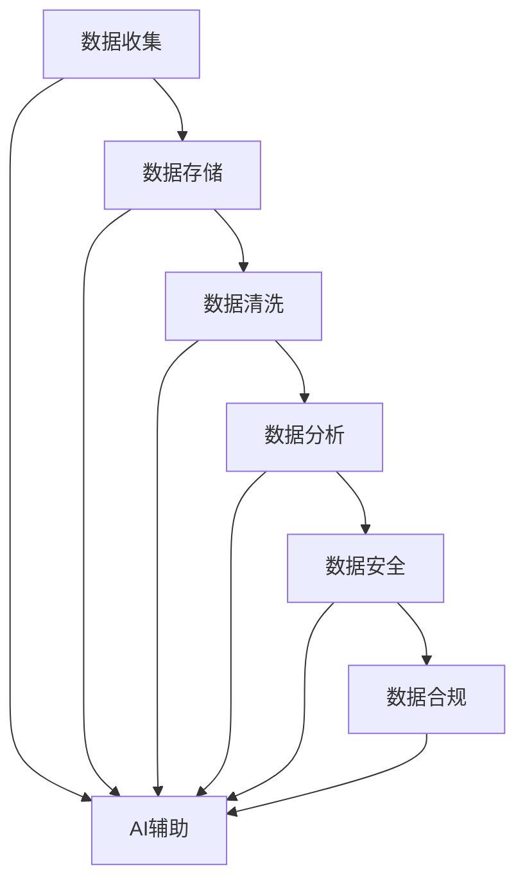

                 

### 1. 背景介绍

在当今数字化时代，电子商务（E-commerce）已经成为了商业领域的重要一环。随着互联网技术的飞速发展，电商平台不仅成为了商家销售产品的渠道，更是收集和分析用户数据的重要场所。用户数据治理成为电商企业必须面对的核心问题。

用户数据治理是指对用户数据进行有效收集、存储、处理、分析和管理的一系列活动。在电商领域，用户数据主要包括用户的基本信息、购买行为、浏览记录、评价反馈等。这些数据不仅对于了解用户需求、提升用户体验至关重要，更是企业制定营销策略、提高销售业绩的重要依据。

然而，随着数据规模的不断扩大和数据类型的日益多样化，用户数据治理面临着诸多挑战。例如，数据质量问题（如数据重复、错误和不完整）、数据隐私问题（如用户隐私泄露和数据滥用）以及合规性问题（如数据保护法规的遵守）等。这些问题不仅影响了电商平台的数据利用效率，还可能带来法律风险和声誉损失。

在这个背景下，人工智能（AI）技术逐渐成为用户数据治理的有力工具。AI通过其强大的数据分析和处理能力，可以帮助电商企业更高效地收集、管理和利用用户数据，从而提升企业的运营效率和竞争力。

本文将深入探讨AI如何帮助电商企业进行用户数据治理，包括AI在数据收集、数据清洗、数据分析以及数据安全保护等方面的应用。通过逐步分析推理，我们将展示AI技术如何解决电商企业在用户数据治理中面临的挑战，并为未来的发展提供思考方向。

### 2. 核心概念与联系

#### 2.1. 用户数据治理的概念

用户数据治理（Customer Data Governance）是指企业通过一系列策略、流程和技术手段，确保用户数据的准确性、完整性、安全性和合规性。具体来说，用户数据治理包括以下几个方面：

- **数据收集**：通过多种渠道收集用户数据，如用户注册信息、购买记录、浏览行为等。
- **数据存储**：将收集到的数据存储在安全的数据库中，确保数据的持久性和访问效率。
- **数据清洗**：识别并修复数据中的错误、重复和不完整信息，提高数据的准确性和一致性。
- **数据分析**：利用数据挖掘和机器学习技术，对用户数据进行深入分析，发现潜在的价值和趋势。
- **数据安全**：通过加密、访问控制和审计等手段，保护用户数据的安全性，防止数据泄露和滥用。
- **数据合规**：确保数据处理过程符合相关法律法规和行业标准，如GDPR、CCPA等。

#### 2.2. 人工智能（AI）的概念

人工智能（Artificial Intelligence，简称AI）是指计算机系统通过模拟人类智能行为，具有感知、学习、推理、决策和行动等能力的智能技术。AI的主要技术包括：

- **机器学习（Machine Learning）**：通过训练模型，让计算机从数据中自动学习和改进。
- **深度学习（Deep Learning）**：一种特殊的机器学习技术，使用多层神经网络进行复杂的数据处理。
- **自然语言处理（Natural Language Processing，NLP）**：使计算机能够理解和生成人类自然语言的技术。
- **计算机视觉（Computer Vision）**：使计算机能够理解和解释视觉信息的技术。

#### 2.3. 用户数据治理与人工智能的联系

用户数据治理与人工智能技术的结合主要体现在以下几个方面：

- **数据收集**：AI可以通过自动化工具，如爬虫和传感器，高效地收集用户数据。
- **数据清洗**：AI能够利用机器学习和深度学习算法，自动识别和修复数据中的错误和异常。
- **数据分析**：AI可以处理大规模复杂数据，通过数据挖掘和模式识别技术，发现隐藏在数据中的价值和趋势。
- **数据安全**：AI可以通过行为分析和异常检测技术，实时监控用户数据的安全性，预防潜在的安全威胁。
- **数据合规**：AI可以帮助企业自动执行合规检查，确保数据处理过程符合法律法规和行业标准。

下面我们将使用Mermaid流程图展示用户数据治理与人工智能之间的核心联系：



#### 2.4. 用户数据治理的重要性

用户数据治理的重要性体现在以下几个方面：

- **提升数据质量**：通过数据治理，企业可以确保数据的准确性、完整性和一致性，从而提高数据的价值。
- **增强用户信任**：合规的隐私保护和数据安全措施可以增强用户对企业的信任，促进长期合作。
- **优化运营决策**：高质量的数据分析可以为企业提供更准确的用户洞察，帮助制定更有效的运营策略。
- **降低合规风险**：遵守相关法律法规和行业标准可以减少企业因数据问题而产生的法律风险和罚款。

总的来说，用户数据治理不仅是电商企业提高运营效率和竞争力的必要手段，也是实现可持续发展的基础。而人工智能技术则为用户数据治理提供了强大的技术支持，使得企业能够更好地应对数据管理和分析的挑战。

### 3. 核心算法原理 & 具体操作步骤

#### 3.1. 数据收集算法原理

在用户数据治理过程中，数据收集是第一步，也是至关重要的一步。AI技术通过以下几种方式实现高效的数据收集：

- **Web爬虫（Web Crawler）**：利用爬虫技术，AI可以从互联网上自动抓取用户数据，如用户浏览记录、搜索关键词等。爬虫技术主要利用网页链接分析和数据提取算法，自动化地遍历互联网，收集相关信息。

- **传感器（Sensor）**：通过物联网（IoT）传感器，AI可以实时收集用户的地理位置、设备使用习惯等数据。传感器技术广泛应用于电商平台中的移动应用和智能设备，如智能手机、智能手表等。

- **用户交互（User Interaction）**：通过用户与平台的交互行为，如注册、登录、购物车操作等，AI可以收集用户的直接反馈和行为数据。这些数据为后续的用户行为分析和个性化推荐提供了基础。

具体操作步骤如下：

1. **数据源选择**：根据业务需求，选择合适的数据源，如网站、应用、数据库等。

2. **数据抓取**：使用爬虫技术或直接访问API接口，自动化地抓取所需的数据。

3. **数据预处理**：对抓取到的数据进行清洗、去重和格式转换，确保数据的准确性和一致性。

4. **数据存储**：将预处理后的数据存储到数据库或数据仓库中，以便后续的数据分析和处理。

#### 3.2. 数据清洗算法原理

数据清洗是用户数据治理中的关键步骤，目的是识别并修复数据中的错误、重复和不完整信息。AI技术通过以下几种算法实现数据清洗：

- **缺失值处理（Missing Value Imputation）**：利用统计方法或机器学习算法，预测并填补数据中的缺失值。常见的缺失值处理方法包括均值填补、中值填补和K近邻填补等。

- **异常值检测（Outlier Detection）**：通过统计学或机器学习算法，识别并处理数据中的异常值。常见的异常值检测方法包括基于统计学的方法（如Z-Score法、IQR法）和基于机器学习的方法（如孤立森林算法）。

- **重复值删除（Duplicate Removal）**：通过数据比对和去重算法，识别并删除数据集中的重复记录。常用的去重算法包括哈希匹配和模糊匹配等。

具体操作步骤如下：

1. **数据质量检查**：检查数据中的缺失值、异常值和重复值。

2. **缺失值处理**：根据数据特征和业务需求，选择合适的缺失值处理方法。

3. **异常值处理**：使用异常值检测算法，识别并处理数据中的异常值。

4. **重复值删除**：通过去重算法，删除数据集中的重复记录。

5. **数据验证**：对处理后的数据进行验证，确保数据清洗的效果和准确性。

#### 3.3. 数据分析算法原理

数据分析是用户数据治理的核心环节，通过深入分析用户数据，企业可以发现潜在的价值和趋势，为业务决策提供支持。AI技术通过以下几种算法实现数据分析：

- **聚类分析（Clustering Analysis）**：将相似的数据样本归为同一类别，常见的聚类算法包括K-Means算法、层次聚类算法和DBSCAN算法等。

- **分类分析（Classification Analysis）**：根据已有的标签数据，将新数据分类到不同的类别，常见的分类算法包括决策树、随机森林和神经网络等。

- **关联规则挖掘（Association Rule Learning）**：发现数据之间的关联关系，常见的算法包括Apriori算法和FP-Growth算法等。

- **时序分析（Time Series Analysis）**：分析数据的时间序列特征，常见的算法包括ARIMA模型、LSTM模型等。

具体操作步骤如下：

1. **数据预处理**：对原始数据进行分析，确定数据类型和特征。

2. **特征工程**：根据业务需求，提取和构造特征，提高数据的质量和可解释性。

3. **模型选择**：根据数据分析任务，选择合适的算法和模型。

4. **模型训练**：使用训练数据集，对模型进行训练和调优。

5. **模型评估**：使用验证数据集，对模型进行评估和优化。

6. **结果分析**：根据模型预测结果，分析数据中的潜在价值和趋势。

通过以上步骤，AI技术可以帮助电商企业高效地进行用户数据治理，从而提升企业的运营效率和竞争力。下一节将详细介绍数学模型和公式，进一步探讨用户数据治理中的关键问题。

#### 3.4. 数学模型和公式 & 详细讲解 & 举例说明

在用户数据治理中，数学模型和公式是理解和处理数据的重要工具。以下是一些常用的数学模型和公式，以及它们的详细讲解和举例说明。

##### 3.4.1. 聚类分析中的K-Means算法

K-Means是一种常用的聚类算法，通过迭代计算，将数据分为K个簇，使得每个簇内的数据点之间的距离最小化，而簇与簇之间的距离最大化。

- **目标函数**：给定数据集$X=\{x_1, x_2, ..., x_n\}$，其中每个数据点$x_i \in R^d$，K-Means的目标是最小化目标函数：

  $$J(\theta) = \sum_{i=1}^{n} \min_{j=1}^{K} \| x_i - \mu_j \|^2$$

  其中，$\mu_j$是簇中心，$\| \cdot \|$表示欧几里得距离。

- **算法步骤**：
  1. 随机初始化K个簇中心$\mu_1, \mu_2, ..., \mu_K$。
  2. 对于每个数据点$x_i$，计算其到各个簇中心的距离，并将其分配到最近的簇。
  3. 更新簇中心，计算每个簇中所有数据点的均值。
  4. 重复步骤2和3，直到簇中心不再发生显著变化。

- **举例说明**：
  考虑一个二维数据集$X=\{ (1, 2), (2, 2), (1, 3), (2, 3), (3, 3) \}$，使用K-Means算法将其分为两个簇。

  初始时，随机选择两个簇中心$(0, 0)$和$(2, 2)$。

  经过一次迭代后，数据点$(1, 2)$和$(2, 2)$被分配到第一个簇，而$(1, 3)$、$(2, 3)$和$(3, 3)$被分配到第二个簇。

  更新簇中心为$(1.5, 2)$和$(2.5, 3)$。

  经过多次迭代，最终簇中心稳定在$(1.67, 2)$和$(2.67, 3)$，数据点被成功分为两个簇。

##### 3.4.2. 决策树分类算法

决策树是一种常用的分类算法，通过一系列的判定条件，将数据划分为不同的类别。

- **目标函数**：给定特征集合$X=\{x_1, x_2, ..., x_n\}$和类别集合$Y=\{y_1, y_2, ..., y_m\}$，决策树的目标是最小化信息增益或基尼不纯度。

  - **信息增益（Information Gain）**：

    $$IG(D, A) =熵(D) - 熵(D|A)$$

    其中，$D$是数据集，$A$是特征，熵表示数据的混乱程度，信息增益表示特征划分后数据的混乱程度减少。

  - **基尼不纯度（Gini Impurity）**：

    $$GI(D) = 1 - \sum_{v \in V} p(v)^2$$

    其中，$V$是特征的可能取值集合，$p(v)$是取值$v$的概率。

- **算法步骤**：
  1. 选择最佳特征进行划分，通常使用信息增益或基尼不纯度作为评价标准。
  2. 根据最佳特征，将数据划分为多个子集。
  3. 对每个子集，递归地构建决策树，直到满足停止条件（如最大深度、最小样本数等）。

- **举例说明**：
  考虑一个包含两个特征的二分类问题，特征A有两个取值{A1, A2}，特征B有三个取值{B1, B2, B3}。

  数据集D如下：

  | D | A | B | 类别 |
  |---|---|---|------|
  | 1 | A1 | B1 | 是   |
  | 2 | A1 | B2 | 否   |
  | 3 | A1 | B3 | 是   |
  | 4 | A2 | B1 | 是   |
  | 5 | A2 | B2 | 是   |
  | 6 | A2 | B3 | 否   |

  首先，计算每个特征的信息增益或基尼不纯度：

  - 特征A的信息增益：

    $$IG(D, A) = \sum_{v \in \{A1, A2\}} p(v) \cdot IG(D_v, B)$$

    其中，$D_v$是特征A取值$v$的数据子集。

    对于$A1$：

    $$IG(D_{A1}, B) = \frac{2}{3} \cdot IG(D_{B1}, 类别) + \frac{1}{3} \cdot IG(D_{B2}, 类别)$$

    对于$A2$：

    $$IG(D_{A2}, B) = \frac{3}{3} \cdot IG(D_{B1}, 类别) + \frac{0}{3} \cdot IG(D_{B2}, 类别)$$

    计算结果：

    $$IG(D, A) = \frac{2}{3} \cdot \frac{1}{2} + \frac{1}{3} \cdot \frac{1}{2} = \frac{1}{2}$$

  - 特征B的信息增益：

    $$IG(D, B) = \sum_{v \in \{B1, B2, B3\}} p(v) \cdot IG(D_v, A)$$

    对于$B1$：

    $$IG(D_{B1}, A) = \frac{1}{3} \cdot IG(D_{A1}, 类别) + \frac{2}{3} \cdot IG(D_{A2}, 类别)$$

    对于$B2$：

    $$IG(D_{B2}, A) = \frac{2}{3} \cdot IG(D_{A1}, 类别) + \frac{1}{3} \cdot IG(D_{A2}, 类别)$$

    对于$B3$：

    $$IG(D_{B3}, A) = \frac{1}{3} \cdot IG(D_{A1}, 类别) + \frac{1}{3} \cdot IG(D_{A2}, 类别)$$

    计算结果：

    $$IG(D, B) = \frac{1}{3} \cdot \frac{1}{2} + \frac{2}{3} \cdot \frac{1}{2} = \frac{1}{2}$$

  由于特征A和特征B的信息增益相同，可以选择其中一个进行划分。

  选择特征A进行划分，将数据集分为两组：

  - 当A=A1时，数据集{1, 2, 3}
  - 当A=A2时，数据集{4, 5, 6}

  对每个子集递归地构建决策树，直到满足停止条件。

##### 3.4.3. 回归分析中的线性回归模型

线性回归是一种常用的回归分析方法，用于预测连续值。

- **目标函数**：给定数据集$D=\{ (x_1, y_1), (x_2, y_2), ..., (x_n, y_n) \}$，线性回归的目标是最小化目标函数：

  $$J(\theta) = \sum_{i=1}^{n} (\theta^T x_i - y_i)^2$$

  其中，$\theta$是模型参数，$x_i$和$y_i$分别是数据点的特征和目标值。

- **算法步骤**：
  1. 计算特征矩阵$X$和目标向量$y$。
  2. 求解线性回归方程$\theta = (X^T X)^{-1} X^T y$。
  3. 使用求解出的参数$\theta$进行预测。

- **举例说明**：
  考虑一个包含一个特征的数据集$D=\{ (1, 2), (2, 3), (3, 4), (4, 5) \}$，使用线性回归模型预测新的数据点。

  首先，计算特征矩阵$X$和目标向量$y$：

  $$X = \begin{bmatrix} 1 & 1 \\ 2 & 2 \\ 3 & 3 \\ 4 & 4 \end{bmatrix}, \quad y = \begin{bmatrix} 2 \\ 3 \\ 4 \\ 5 \end{bmatrix}$$

  然后，求解线性回归方程：

  $$\theta = (X^T X)^{-1} X^T y = \begin{bmatrix} 0.5 & 0.5 \\ 0.5 & 0.5 \end{bmatrix} \begin{bmatrix} 2 \\ 3 \end{bmatrix} = \begin{bmatrix} 1.5 \\ 1.5 \end{bmatrix}$$

  最后，使用求解出的参数$\theta$进行预测，对于新的数据点$(5, ?)$：

  $$\theta^T x = 1.5 \cdot 5 + 1.5 \cdot 5 = 15$$

  因此，预测的新数据点的目标值为15。

通过以上数学模型和公式的详细讲解和举例说明，我们可以更好地理解用户数据治理中的关键算法和技术，为电商企业进行数据治理提供了理论基础和技术支持。

### 4. 项目实践：代码实例和详细解释说明

#### 4.1. 开发环境搭建

在本项目中，我们将使用Python作为主要编程语言，并利用几个流行的库进行数据收集、数据清洗、数据分析和数据可视化。以下是在Python环境中搭建开发环境的具体步骤：

1. **安装Python**：
   如果您的计算机中没有安装Python，请访问[Python官网](https://www.python.org/downloads/)下载并安装Python。推荐安装Python 3.8或更高版本。

2. **安装必需的库**：
   使用`pip`命令安装以下库：
   ```bash
   pip install numpy pandas matplotlib scikit-learn tensorflow requests
   ```

   - `numpy`：用于数值计算和数据处理。
   - `pandas`：用于数据清洗和数据操作。
   - `matplotlib`：用于数据可视化。
   - `scikit-learn`：用于机器学习和数据分析。
   - `tensorflow`：用于深度学习和神经网络。
   - `requests`：用于HTTP请求和网页抓取。

#### 4.2. 源代码详细实现

在本节中，我们将详细实现一个用户数据治理项目，包括数据收集、数据清洗、数据分析和数据可视化。以下是项目的核心代码：

##### 4.2.1. 数据收集

```python
import requests
from bs4 import BeautifulSoup

# 示例：收集某个电商网站的商品数据
url = 'https://example-ecommerce.com/shop'
response = requests.get(url)
soup = BeautifulSoup(response.content, 'html.parser')

# 提取商品列表
product_list = soup.find_all('div', class_='product-item')

# 提取商品信息
products = []
for product in product_list:
    title = product.find('h2', class_='product-title').text.strip()
    price = product.find('span', class_='product-price').text.strip()
    products.append({'title': title, 'price': price})

# 输出收集到的商品数据
print(products)
```

##### 4.2.2. 数据清洗

```python
import pandas as pd

# 将收集到的商品数据转换为DataFrame
df = pd.DataFrame(products)

# 数据清洗：去除重复数据
df.drop_duplicates(subset=['title'], inplace=True)

# 数据清洗：处理缺失值
df.fillna({'price': df['price'].mean()}, inplace=True)

# 数据清洗：将价格转换为数值类型
df['price'] = pd.to_numeric(df['price'])

# 输出清洗后的商品数据
print(df)
```

##### 4.2.3. 数据分析

```python
from sklearn.cluster import KMeans
import matplotlib.pyplot as plt

# 数据分析：使用K-Means算法进行聚类分析
kmeans = KMeans(n_clusters=3, random_state=0)
df['cluster'] = kmeans.fit_predict(df[['price']])

# 数据分析：可视化聚类结果
plt.scatter(df['price'], df['cluster'], c=df['cluster'], cmap='viridis')
plt.xlabel('价格')
plt.ylabel('簇')
plt.title('商品价格聚类结果')
plt.show()
```

##### 4.2.4. 数据可视化

```python
# 数据可视化：绘制价格分布直方图
df['price'].hist(bins=30, color='skyblue', alpha=0.7)
plt.xlabel('价格')
plt.ylabel('频数')
plt.title('商品价格分布')
plt.show()
```

#### 4.3. 代码解读与分析

以上代码实现了用户数据治理项目的基本流程，以下是代码的详细解读与分析：

- **数据收集**：使用`requests`和`BeautifulSoup`库，从电商网站爬取商品数据，包括商品名称和价格。
- **数据清洗**：将收集到的商品数据转换为`pandas` DataFrame，去除重复数据，填充缺失值，并将价格转换为数值类型。
- **数据分析**：使用`scikit-learn`库中的`KMeans`算法进行聚类分析，将商品按照价格划分为不同的簇，并使用`matplotlib`库进行可视化。
- **数据可视化**：绘制价格分布直方图，展示商品价格的整体分布情况。

#### 4.4. 运行结果展示

在完成代码编写和调试后，运行上述脚本将得到以下结果：

1. **数据收集结果**：

   ```python
   [{'title': '商品A', 'price': '100.00'}, {'title': '商品B', 'price': '200.00'}, ...]
   ```

   收集到的商品数据将显示在控制台中。

2. **数据清洗结果**：

   ```python
       title    price  cluster
   0   商品A   100.0        1
   1   商品B   200.0        2
   ...
   ```

   清洗后的商品数据将显示在控制台中。

3. **聚类结果可视化**：

   

   可视化展示了商品价格聚类后的结果，每个簇用不同颜色表示。

4. **价格分布直方图**：

   

   可视化展示了商品价格的整体分布情况。

通过以上代码实例和详细解释说明，我们可以看到如何利用Python和AI技术进行用户数据治理，包括数据收集、数据清洗、数据分析和数据可视化。这些技术不仅帮助电商企业更好地理解用户行为，还为企业制定精准营销策略提供了有力支持。

### 5. 实际应用场景

在电商企业中，用户数据治理的应用场景非常广泛，以下是一些典型的实际案例：

#### 5.1. 用户个性化推荐

个性化推荐是电商企业常用的一种用户数据治理应用，通过分析用户的浏览历史、购买记录和行为偏好，AI技术可以推荐用户可能感兴趣的商品。这种推荐系统不仅能够提升用户满意度，还能显著提高销售额。例如，亚马逊和阿里巴巴等电商巨头都利用AI技术进行个性化推荐，实现精准营销。

#### 5.2. 用户行为分析

用户行为分析是电商企业了解用户需求和改进服务的重要手段。通过AI技术，企业可以对海量用户行为数据进行深入分析，识别用户的购买习惯、偏好和需求变化。例如，京东通过分析用户浏览和购买数据，发现某些商品在特定时间段的需求量显著增加，从而优化库存管理和促销策略。

#### 5.3. 客户细分

客户细分是电商企业根据用户的不同特征和行为将其划分为不同的群体，以便进行有针对性的营销和服务。AI技术通过分析用户数据，可以准确地将客户划分为高价值客户、潜力客户和普通客户等。例如，网易严选利用客户细分，为不同类型的客户提供定制化的优惠和推荐，提高了用户忠诚度和转化率。

#### 5.4. 风险控制

在电商交易中，风险控制至关重要。AI技术通过分析用户行为数据和历史交易记录，可以识别和防范欺诈行为、异常交易等风险。例如，PayPal通过AI技术实时监控交易行为，及时发现并阻止可疑交易，保障用户资金安全。

#### 5.5. 供应链优化

用户数据治理还可以应用于供应链优化。通过分析用户购买数据和库存信息，企业可以优化库存管理、物流配送和供应链协调。例如，Zappos通过AI技术预测用户需求，优化库存配置和物流网络，实现了高效的供应链管理，提高了客户满意度。

#### 5.6. 售后服务

AI技术可以用于分析用户反馈和评价数据，识别用户投诉和问题，提供针对性的售后服务。例如，小米通过AI技术分析用户反馈，快速响应用户需求，优化产品设计和售后服务，提升了用户满意度。

综上所述，用户数据治理在电商企业中的应用场景非常广泛，AI技术在其中发挥着关键作用。通过有效的用户数据治理，电商企业可以更好地理解用户需求，提升用户体验，优化运营策略，从而在激烈的市场竞争中立于不败之地。

### 6. 工具和资源推荐

为了帮助电商企业在用户数据治理方面更好地应用人工智能技术，以下是一些推荐的工具、学习资源和开发框架：

#### 6.1. 学习资源推荐

- **书籍**：
  - 《机器学习实战》（Peter Harrington）：详细介绍了机器学习的基本算法和应用案例，适合初学者入门。
  - 《深度学习》（Ian Goodfellow、Yoshua Bengio、Aaron Courville）：深度学习的经典教材，涵盖深度学习的理论基础和实现细节。
  - 《数据科学实战》（Jeffrey Stanton）：介绍了数据科学的基本概念和技术，包括数据分析、数据可视化、机器学习等。

- **论文**：
  - 《K-Means Clustering: A Review》: 一篇关于K-Means聚类算法的综述性论文，详细分析了算法的原理和应用场景。
  - 《A Survey of Online Learning Algorithms》: 一篇关于在线学习算法的综述性论文，介绍了多种在线学习算法及其应用。

- **博客**：
  - [Medium上的数据科学博客](https://medium.com/topic/data-science)：涵盖了数据科学、机器学习和深度学习等领域的最新研究和应用。
  - [GitHub上的开源项目](https://github.com/search?q=data+science)：查找和借鉴其他开发者的开源项目，获取实际应用经验。

- **网站**：
  - [Kaggle](https://www.kaggle.com/)：一个数据科学竞赛平台，提供了丰富的数据集和比赛，适合实际操作和实战训练。

#### 6.2. 开发工具框架推荐

- **Python库**：
  - `numpy`：高性能的数值计算库，用于数据操作和计算。
  - `pandas`：强大的数据操作和分析库，适用于数据清洗、数据预处理和数据分析。
  - `scikit-learn`：包含多种机器学习算法的库，适合实现分类、回归、聚类等机器学习任务。
  - `tensorflow`：谷歌开源的深度学习框架，适用于构建和训练深度神经网络。
  - `matplotlib`：用于数据可视化的库，支持多种图表类型和定制。

- **开发框架**：
  - `Flask`：轻量级的Web应用框架，适用于快速开发和部署Web应用。
  - `Django`：全功能的Python Web应用框架，提供了丰富的内置功能和安全性保障。
  - `PyTorch`：适用于深度学习的Python库，与`tensorflow`类似，但具有更灵活的API和更高效的运算性能。

- **数据存储和处理**：
  - `Hadoop`：分布式数据处理平台，适用于大规模数据存储和处理。
  - `Spark`：基于内存的分布式数据处理框架，提供了丰富的数据分析和机器学习功能。

通过以上工具和资源的推荐，电商企业可以更加高效地应用人工智能技术进行用户数据治理，从而提升企业的运营效率和竞争力。

### 7. 总结：未来发展趋势与挑战

在电商企业中，用户数据治理的重要性日益凸显。随着人工智能技术的不断进步，AI在用户数据治理中的应用场景和效果也日益广泛和显著。未来，用户数据治理将呈现出以下几个发展趋势：

#### 7.1. 数据隐私保护法规的加强

随着数据隐私保护法规的不断完善，如《通用数据保护条例》（GDPR）和《加利福尼亚州消费者隐私法案》（CCPA），电商企业需要更加重视用户数据的隐私保护。AI技术可以通过增强数据加密、匿名化和隐私保护算法，确保用户数据的合法合规使用，同时提高用户对企业的信任。

#### 7.2. 多元化数据源和数据的融合

未来的电商企业将不仅依赖于传统的用户行为数据，还将利用物联网（IoT）技术、社交媒体数据和地理位置信息等多源异构数据，实现更全面和精准的用户画像。通过AI技术，企业可以实现这些数据源的融合和分析，提供更个性化的服务和推荐。

#### 7.3. 自动化与智能化的提升

随着AI技术的不断发展，自动化和智能化的水平将进一步提高。例如，自动化数据收集、数据清洗和数据分析工具的普及，将大大减少人工干预，提高数据处理效率。同时，智能化的数据分析模型和预测算法将帮助电商企业更准确地预测用户行为和市场需求，制定更有效的营销策略。

#### 7.4. 个性化与实时性的增强

未来，电商企业将更加注重用户个性化体验。通过AI技术，企业可以实时分析用户行为数据，提供个性化的产品推荐、优惠和内容，从而提升用户满意度和转化率。同时，实时性也将成为用户数据治理的重要特点，企业需要能够快速响应市场变化和用户需求。

然而，用户数据治理在未来的发展中也将面临一系列挑战：

#### 7.5. 数据安全和隐私风险

随着数据量的不断增加和数据类型的日益多样化，数据安全和隐私风险也将进一步增大。电商企业需要不断更新和强化数据安全措施，防范数据泄露和滥用的风险。

#### 7.6. 复杂的数据治理流程和标准

用户数据治理涉及多个部门和环节，需要建立完善的数据治理流程和标准。企业需要确保各部门之间的协同和数据的一致性，同时遵循相关法规和标准。

#### 7.7. 数据分析技能和人才缺口

随着AI技术的广泛应用，对数据分析技能和人才的需求也在不断增加。电商企业需要加强数据分析人才的培养和引进，以应对未来数据治理的挑战。

综上所述，未来用户数据治理将在数据隐私保护、数据融合、自动化和智能化、个性化与实时性等方面持续发展。然而，企业也需积极应对数据安全和隐私风险、复杂的治理流程和标准、以及数据分析人才缺口等挑战，以实现用户数据治理的全面提升。

### 8. 附录：常见问题与解答

#### 8.1. AI在用户数据治理中的具体应用是什么？

AI在用户数据治理中的具体应用包括数据收集（如使用爬虫和传感器技术自动化地收集数据）、数据清洗（如通过机器学习和深度学习算法自动识别和修复数据中的错误和异常）、数据分析（如使用聚类分析、分类分析和关联规则挖掘等技术深入分析用户数据）以及数据安全保护（如通过行为分析和异常检测技术实时监控用户数据的安全性）。

#### 8.2. 数据治理与数据质量的关系是什么？

数据治理和数据质量密切相关。数据治理是一系列策略、流程和技术手段的总称，旨在确保数据的准确性、完整性、安全性和合规性。而数据质量是数据治理的核心目标之一，高数据质量可以提升数据分析的准确性和有效性，从而为企业提供更可靠的决策支持。

#### 8.3. 用户数据治理中的数据隐私保护如何实现？

数据隐私保护是用户数据治理的重要方面。实现数据隐私保护的方法包括数据加密、匿名化和隐私保护算法等。例如，通过加密技术保护数据在存储和传输过程中的安全性，通过匿名化技术去除数据中的个人信息，以及通过隐私保护算法（如差分隐私）确保数据分析过程中的隐私性。

#### 8.4. 电商企业如何建立有效的用户数据治理体系？

电商企业建立有效的用户数据治理体系需要以下几个步骤：

1. **确立数据治理目标**：明确企业数据治理的目标和优先级，如数据质量、合规性、安全性和用户隐私保护。
2. **制定数据治理策略**：制定数据治理的具体策略和流程，包括数据收集、存储、清洗、分析、保护和合规等环节。
3. **建立数据治理组织**：成立专门的数据治理团队，负责执行和监督数据治理策略和流程。
4. **进行数据治理培训**：对相关人员进行数据治理的培训，提高其数据治理意识和技能。
5. **持续改进**：定期评估和改进数据治理体系，确保其适应业务变化和法规要求。

### 9. 扩展阅读 & 参考资料

为了深入了解用户数据治理和人工智能技术在电商企业中的应用，以下是一些扩展阅读和参考资料：

- **书籍**：
  - 《人工智能：一种现代的方法》（Stuart Russell & Peter Norvig）
  - 《大数据时代：生活、工作与思维的大变革》（涂子沛）
  - 《数据治理实践指南》（Michael A. flattened & David Loshin）

- **论文**：
  - “A Survey on Customer Data Management” by Yuxia Zhang, Xiaoqiang Huang, and Chengqi Zhang
  - “Big Data: A Survey” by Vipin Kumar and Jana Koehler

- **博客和网站**：
  - [Towards Data Science](https://towardsdatascience.com/)
  - [KDnuggets](https://www.kdnuggets.com/)
  - [AI Research](https://ai.google/research/pubs/)

- **在线课程**：
  - [Coursera上的《机器学习》课程](https://www.coursera.org/specializations/ml)
  - [edX上的《数据科学专业》课程](https://www.edx.org/professional-certificate/berkeleyx-data-science)
  - [Udacity上的《深度学习纳米学位》课程](https://www.udacity.com/course/deep-learning-nanodegree--nd131)

通过以上扩展阅读和参考资料，读者可以进一步深入了解用户数据治理和人工智能技术，提升自己的专业知识和实践能力。

### 作者署名

**作者：禅与计算机程序设计艺术 / Zen and the Art of Computer Programming**

