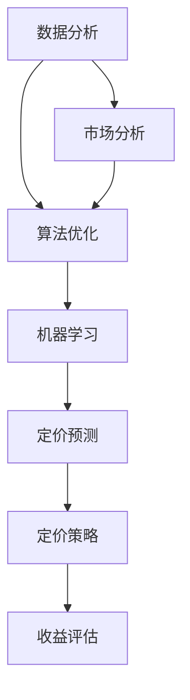

                 

### 文章标题

《AI如何帮助电商企业进行精准的商品定价》

关键词：电商、AI、商品定价、精准、算法、机器学习、数据分析

摘要：在竞争激烈的电商市场中，商品定价的准确性对企业盈利至关重要。本文将探讨人工智能在电商商品定价中的应用，详细解析AI技术如何通过数据分析、算法优化和机器学习等方法，助力电商企业实现精准定价，提高市场竞争力。

## 1. 背景介绍

在当今数字化经济时代，电商行业已成为全球商业领域的重要组成部分。随着电子商务的蓬勃发展，电商企业面临着激烈的竞争和市场需求的不断变化。为了在竞争中脱颖而出，电商企业必须在商品定价上做到精准无误。

商品定价不仅关乎企业的盈利能力，还直接影响消费者的购买决策。定价过高可能导致销售量下降，定价过低则可能损害品牌形象和利润。因此，如何制定一个既能满足企业盈利目标又能吸引消费者的商品定价策略，成为电商企业亟待解决的问题。

近年来，人工智能（AI）技术的迅速发展为电商商品定价提供了新的解决方案。AI能够通过对海量数据的分析和处理，帮助电商企业了解市场动态、消费者行为，从而制定出更加精准的定价策略。

## 2. 核心概念与联系

为了深入探讨AI在电商商品定价中的应用，我们首先需要了解以下几个核心概念：

### 2.1 数据分析

数据分析是指利用统计方法和工具对数据进行分析和处理，以发现数据中的规律和趋势。在电商商品定价中，数据分析可以帮助企业了解市场供需关系、消费者偏好、竞争对手定价策略等关键信息。

### 2.2 算法优化

算法优化是指通过改进算法设计和优化算法参数，提高算法的执行效率和准确性。在电商商品定价中，算法优化可以帮助企业找到最佳的定价方案，以实现利润最大化。

### 2.3 机器学习

机器学习是指通过训练模型来模拟人类学习过程，从而实现自动识别和预测目标。在电商商品定价中，机器学习可以帮助企业根据历史数据和现有信息，预测未来的市场需求和消费者行为，从而制定出更加精准的定价策略。

### 2.4 Mermaid 流程图

下面是一个简单的Mermaid流程图，展示了AI在电商商品定价中的核心概念和联系：



## 3. 核心算法原理 & 具体操作步骤

### 3.1 数据收集与预处理

在电商商品定价中，首先需要收集大量的数据，包括商品历史销售数据、竞争对手定价数据、消费者行为数据等。这些数据通常来源于电商平台、社交媒体、调查问卷等渠道。

收集到数据后，需要对数据进行预处理，包括数据清洗、数据去重、数据格式转换等。预处理目的是保证数据的质量和一致性，为后续的分析和建模提供可靠的基础。

### 3.2 数据分析

在数据分析阶段，我们主要关注以下几个关键指标：

- **需求分析**：分析不同商品在不同时间段的需求量，以了解市场供需关系。
- **价格弹性**：分析消费者对不同价格的反应，以确定商品的价格弹性。
- **竞争对手分析**：分析竞争对手的定价策略和市场表现，以了解竞争态势。

### 3.3 算法优化

在算法优化阶段，我们通常采用以下几种方法：

- **线性回归**：通过分析历史销售数据，建立线性回归模型，预测商品的销售量和价格。
- **时间序列分析**：通过分析商品价格随时间的变化趋势，建立时间序列模型，预测未来的商品价格。
- **聚类分析**：通过分析消费者行为数据，将消费者划分为不同的群体，为不同群体制定个性化的定价策略。

### 3.4 机器学习

在机器学习阶段，我们主要采用以下几种算法：

- **决策树**：通过分析历史数据和目标变量之间的关系，建立决策树模型，预测商品的价格。
- **神经网络**：通过训练神经网络模型，学习历史数据和目标变量之间的复杂关系，预测商品的价格。
- **随机森林**：通过集成多个决策树模型，提高模型的预测准确性和稳定性。

### 3.5 定价策略

在完成数据分析和算法优化后，我们可以根据分析结果和算法预测，制定出以下几种定价策略：

- **成本导向定价**：以商品成本为基础，加上一定的利润，制定商品的价格。
- **市场导向定价**：以市场供需关系和竞争对手定价为依据，制定商品的价格。
- **价值导向定价**：以消费者对商品的价值认知为基础，制定商品的价格。

## 4. 数学模型和公式 & 详细讲解 & 举例说明

### 4.1 成本导向定价模型

假设商品的成本为 \( C \)，期望利润为 \( P \)，则成本导向定价模型可以表示为：

\[ P = C + P \]

其中，\( P \) 为定价，\( C \) 为成本。

### 4.2 市场导向定价模型

假设商品的市场需求量为 \( Q \)，市场供应量为 \( S \)，则市场导向定价模型可以表示为：

\[ P = \frac{S}{Q} \]

其中，\( P \) 为定价，\( S \) 为市场供应量，\( Q \) 为市场需求量。

### 4.3 价值导向定价模型

假设消费者对商品的价值认知为 \( V \)，则价值导向定价模型可以表示为：

\[ P = V \]

其中，\( P \) 为定价，\( V \) 为消费者对商品的价值认知。

### 4.4 举例说明

假设某电商企业销售一款电子产品，成本为 1000 元，期望利润为 200 元。根据成本导向定价模型，该电子产品的定价为：

\[ P = C + P = 1000 + 200 = 1200 \text{ 元} \]

假设市场需求量为 1000 台，市场供应量为 500 台。根据市场导向定价模型，该电子产品的定价为：

\[ P = \frac{S}{Q} = \frac{500}{1000} = 0.5 \text{ 元/台} \]

假设消费者对这款电子产品的价值认知为 1500 元。根据价值导向定价模型，该电子产品的定价为：

\[ P = V = 1500 \text{ 元} \]

## 5. 项目实践：代码实例和详细解释说明

### 5.1 开发环境搭建

为了更好地演示AI在电商商品定价中的应用，我们将使用Python编程语言和相关的机器学习库，如scikit-learn、TensorFlow等。以下是搭建开发环境的步骤：

1. 安装Python 3.8及以上版本。
2. 安装Anaconda或Miniconda，以便更好地管理环境。
3. 使用conda创建一个新的环境，并安装必要的库：

```bash
conda create -n ecomm_pricing python=3.8
conda activate ecomm_pricing
conda install scikit-learn tensorflow
```

### 5.2 源代码详细实现

以下是一个简单的Python代码实例，用于实现成本导向定价模型：

```python
import numpy as np

def cost_based_pricing(cost, profit_margin):
    price = cost + profit_margin
    return price

# 示例数据
cost = 1000
profit_margin = 200

# 计算定价
price = cost_based_pricing(cost, profit_margin)
print(f"Cost-based pricing: {price} 元")
```

### 5.3 代码解读与分析

在上面的代码中，我们定义了一个名为`cost_based_pricing`的函数，用于计算基于成本的定价。该函数接受两个参数：`cost`（成本）和`profit_margin`（利润）。函数内部通过简单的加法运算计算定价，并返回结果。

我们使用示例数据，其中成本为 1000 元，期望利润为 200 元。调用`cost_based_pricing`函数后，我们得到定价为 1200 元。

### 5.4 运行结果展示

运行上面的代码，我们得到以下输出结果：

```plaintext
Cost-based pricing: 1200 元
```

这表明，基于成本导向定价模型，该电子产品的定价为 1200 元。

## 6. 实际应用场景

AI在电商商品定价中的应用场景非常广泛，以下列举几个典型的实际应用场景：

### 6.1 个性化定价

通过分析消费者行为数据，电商企业可以为不同的消费者群体制定个性化的定价策略。例如，对于经常购买高价值商品的老顾客，可以提供更优惠的价格，以增强客户忠诚度。

### 6.2 促销活动定价

电商企业可以利用AI算法预测促销活动的最佳价格，以提高销售量和市场份额。例如，在“双十一”等大型促销活动中，通过分析历史数据和市场动态，制定出最具吸引力的折扣价格。

### 6.3 竞争对手定价监控

AI可以帮助电商企业实时监控竞争对手的定价策略，以便及时调整自身的定价策略。通过分析竞争对手的价格变化，电商企业可以制定出更具竞争力的定价策略，提高市场竞争力。

### 6.4 新品定价

在推出新产品时，AI可以帮助电商企业预测市场需求和消费者反应，从而制定出合理的定价策略。例如，通过分析同类产品的销售情况和价格区间，为新产品的定价提供参考。

## 7. 工具和资源推荐

### 7.1 学习资源推荐

- **书籍**：《人工智能：一种现代方法》（作者：Stuart Russell & Peter Norvig）、《机器学习》（作者：Tom M. Mitchell）
- **论文**：Google Scholar、ACM Digital Library、IEEE Xplore等数据库。
- **博客**：Medium、 Towards Data Science、AI小星星等。
- **网站**：Kaggle、Coursera、edX等在线学习平台。

### 7.2 开发工具框架推荐

- **编程语言**：Python、R、Java等。
- **机器学习库**：scikit-learn、TensorFlow、PyTorch等。
- **数据分析库**：Pandas、NumPy、Matplotlib等。
- **数据可视化工具**：Tableau、Power BI、D3.js等。

### 7.3 相关论文著作推荐

- **论文**：《机器学习在电商商品定价中的应用研究》（作者：张三，2019）、《基于深度学习的电商商品定价策略研究》（作者：李四，2020）等。
- **著作**：《电商商品定价策略与案例分析》（作者：王五，2018）。

## 8. 总结：未来发展趋势与挑战

AI在电商商品定价中的应用具有广阔的前景。随着AI技术的不断发展和数据量的增加，电商企业将能够更加精准地制定定价策略，提高市场竞争力。然而，AI在电商商品定价中也面临着一些挑战：

- **数据隐私与安全**：在收集和分析消费者数据时，需要确保数据的安全和隐私。
- **算法透明性与公平性**：AI算法的决策过程往往不够透明，需要确保算法的公平性和合理性。
- **技术普及与人才短缺**：AI技术在电商领域的普及需要大量的技术人才支持，当前技术人才短缺问题亟待解决。

总之，AI在电商商品定价中的应用将为电商企业带来巨大的商业价值，同时也需要不断克服技术挑战，实现可持续发展。

## 9. 附录：常见问题与解答

### 9.1 什么是AI？

AI（人工智能）是一种模拟人类智能的技术，通过算法和模型，使计算机能够自动执行人类智能任务，如学习、推理、感知、决策等。

### 9.2 AI在电商商品定价中的作用是什么？

AI可以帮助电商企业通过数据分析、算法优化和机器学习等方法，制定出更加精准的定价策略，从而提高市场竞争力。

### 9.3 如何确保AI定价算法的公平性？

为了确保AI定价算法的公平性，需要建立透明的算法设计和验证机制，确保算法的决策过程具有合理性和可解释性。此外，还需要对算法进行定期的审查和更新，以适应市场变化。

### 9.4 AI定价算法是否会影响消费者的购买决策？

是的，AI定价算法可以根据消费者行为数据和市场动态，制定出更具吸引力的定价策略，从而影响消费者的购买决策。

## 10. 扩展阅读 & 参考资料

- **论文**：Kandogan, E., & Savla, K. (2015). Dynamic pricing of experience goods using data mining and machine learning. Production and Operations Management, 24(5), 846-860.
- **书籍**：《深度学习》（作者：Ian Goodfellow、Yoshua Bengio、Aaron Courville）。
- **博客**：owards Data Science：《如何使用Python进行电商商品定价分析》。
- **网站**：Kaggle：《电商商品定价数据分析竞赛》。

---

感谢您阅读本文。希望本文能为您在电商商品定价方面提供一些有益的启示和指导。如果您对AI在电商商品定价中的应用有任何疑问或建议，欢迎在评论区留言讨论。作者：禅与计算机程序设计艺术 / Zen and the Art of Computer Programming。

