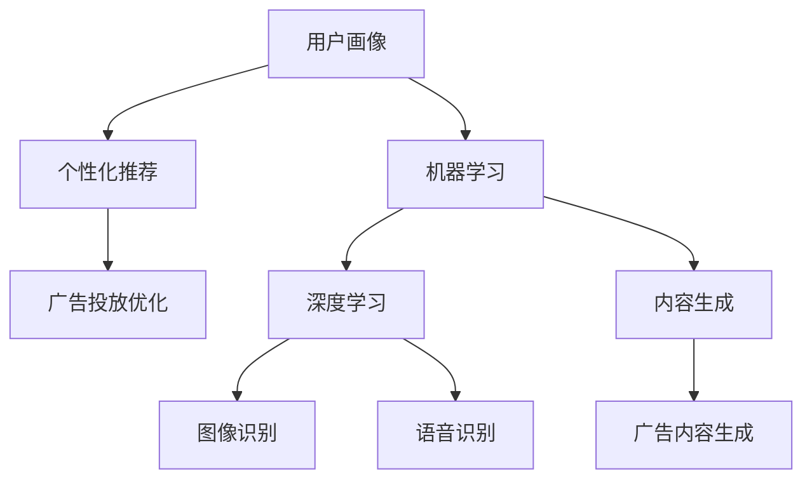

                 

### 背景介绍 Background Introduction

广告投放作为企业营销策略的核心环节，一直是商业竞争的关键领域。随着互联网和数字技术的飞速发展，广告投放方式也在不断地演进。从早期的传统广告到如今的精准投放，广告行业正经历一场革命。而人工智能（AI）的崛起，为广告投放策略带来了全新的变革。

#### 广告投放的演变 Evolution of Advertising Delivery

1. **传统广告**：在互联网时代之前，广告主要以电视、报纸、杂志、户外广告等形式存在。这些广告形式具有覆盖面广、影响力大等优点，但也存在效率低、精准度差的问题。

2. **互联网广告**：互联网的普及使得广告形式发生了巨大变化，从最初的横幅广告（Banner Ads）到搜索引擎广告（Search Engine Ads），再到社交媒体广告（Social Media Ads），广告投放变得更加多样化、精准化。

3. **程序化广告**：随着数据技术的发展，程序化购买（Programmatic Advertising）逐渐成为主流。通过自动化技术，广告主可以根据用户行为数据实时购买广告展示位，实现精准投放。

#### 人工智能的崛起 Rise of Artificial Intelligence

人工智能的迅猛发展，为广告投放带来了新的机遇和挑战。AI技术可以在以下几个方面极大地改变广告投放策略：

1. **数据分析**：AI能够处理海量数据，从中提取有价值的信息，帮助企业更准确地了解用户需求和偏好。

2. **用户画像**：通过分析用户行为和社交数据，AI可以构建精确的用户画像，实现个性化广告推送。

3. **内容生成**：AI可以自动生成创意广告内容，提高广告的吸引力和转化率。

4. **投放优化**：AI可以实时监测广告效果，自动调整投放策略，提高投资回报率。

### 目的 Objectives

本文旨在探讨人工智能如何改变广告投放策略。通过深入分析AI在广告投放中的应用，我们将揭示AI技术带来的变革，并展望未来广告投放的发展趋势。本文将从以下几个角度展开讨论：

1. **AI在广告投放中的应用场景**：介绍AI技术在广告投放中的具体应用，包括数据分析、用户画像、内容生成和投放优化等方面。

2. **核心概念与联系**：阐述广告投放策略中的核心概念，并使用流程图展示AI技术的架构和应用流程。

3. **核心算法原理 & 具体操作步骤**：解析AI在广告投放中的核心算法原理，并详细讲解算法的具体操作步骤。

4. **数学模型和公式 & 详细讲解 & 举例说明**：介绍AI广告投放中使用的数学模型和公式，并通过具体案例进行详细解释。

5. **项目实践：代码实例和详细解释说明**：提供实际项目中的代码实例，并对其进行详细解读和分析。

6. **实际应用场景**：分析AI技术在广告投放中的实际应用案例，展示AI广告投放的效果。

7. **工具和资源推荐**：推荐学习资源、开发工具和框架，帮助读者深入了解和掌握AI广告投放技术。

8. **总结：未来发展趋势与挑战**：总结AI广告投放的现状和趋势，探讨未来可能面临的挑战和解决方案。

通过本文的探讨，我们希望读者能够对AI广告投放有更深入的理解，为企业在数字化营销道路上提供有益的启示。

### 核心概念与联系 Core Concepts and Their Connections

在深入探讨人工智能如何改变广告投放策略之前，我们需要明确一些核心概念和它们之间的联系。这些概念包括用户画像（User Profiling）、个性化推荐（Personalized Recommendation）、机器学习（Machine Learning）和深度学习（Deep Learning）。

#### 用户画像 User Profiling

用户画像是一种基于用户行为、兴趣、需求等数据构建的用户概要。它可以帮助广告主了解目标用户，从而进行更精准的广告投放。用户画像通常包括以下几个方面：

1. **基础信息**：如年龄、性别、地理位置、职业等。
2. **兴趣偏好**：如爱好、消费习惯、搜索历史等。
3. **行为轨迹**：如网站访问记录、社交媒体互动、应用使用情况等。

用户画像的构建通常依赖于大数据和数据分析技术，通过数据挖掘和机器学习算法，从海量数据中提取有价值的信息。

#### 个性化推荐 Personalized Recommendation

个性化推荐是一种基于用户兴趣和行为数据，向用户推荐相关内容或产品的技术。在广告投放中，个性化推荐可以帮助广告主将最相关的广告推送给目标用户，提高广告效果和转化率。个性化推荐通常包括以下几个步骤：

1. **用户行为分析**：收集并分析用户在网站、社交媒体等平台上的行为数据。
2. **内容特征提取**：提取用户感兴趣的内容特征，如关键词、标签等。
3. **推荐算法**：使用机器学习或深度学习算法，根据用户兴趣和行为特征，生成推荐列表。
4. **推荐结果展示**：将推荐结果展示给用户，引导用户进行进一步互动。

#### 机器学习 Machine Learning

机器学习是一种让计算机通过数据学习模式，进行决策和预测的技术。在广告投放中，机器学习技术主要用于用户画像构建、个性化推荐和投放优化等方面。常见的机器学习算法包括：

1. **分类算法**：如决策树、随机森林、支持向量机等，用于分类用户标签、预测用户行为等。
2. **聚类算法**：如K-均值、层次聚类等，用于用户群体细分和用户行为分析。
3. **回归算法**：如线性回归、逻辑回归等，用于预测广告效果、用户转化率等。

#### 深度学习 Deep Learning

深度学习是机器学习的一个分支，它通过模拟人脑神经元网络，进行复杂的模式识别和预测。在广告投放中，深度学习技术主要用于图像识别、语音识别和自然语言处理等方面。常见的深度学习模型包括：

1. **卷积神经网络（CNN）**：用于图像识别和分类。
2. **循环神经网络（RNN）**：用于处理序列数据，如时间序列分析、文本分类等。
3. **生成对抗网络（GAN）**：用于生成高质量的图像和文本。

#### 关系图 Mermaid Flowchart

为了更好地展示这些核心概念之间的联系，我们可以使用Mermaid流程图进行描述。以下是广告投放策略中核心概念关系的Mermaid流程图：



在上述流程图中，用户画像作为核心数据源，不仅用于个性化推荐，还用于机器学习和内容生成。机器学习技术通过用户画像和广告投放数据，实现广告投放优化。深度学习则主要应用于图像识别、语音识别和自然语言处理，从而为广告内容生成提供技术支持。

通过以上核心概念和流程图的介绍，我们为接下来详细探讨AI在广告投放中的应用奠定了基础。

### 核心算法原理 & 具体操作步骤 Core Algorithm Principles and Detailed Steps

在广告投放中，人工智能技术的核心算法主要包括用户画像构建、个性化推荐和投放优化。以下我们将逐一介绍这些算法的原理和具体操作步骤。

#### 用户画像构建 User Profiling

用户画像构建是广告投放的基础，它通过分析用户行为和偏好数据，生成一个详细的用户画像。以下是用户画像构建的基本原理和操作步骤：

1. **数据收集**：首先，需要收集用户的基本信息（如年龄、性别、地理位置等）和行为数据（如搜索历史、浏览记录、购买行为等）。

2. **数据预处理**：对收集到的数据进行清洗和预处理，包括去除重复数据、填补缺失值、归一化处理等。

3. **特征提取**：从预处理后的数据中提取有价值的特征，如用户兴趣标签、消费偏好等。特征提取可以通过文本分析、图像识别等技术实现。

4. **模型训练**：使用机器学习算法（如K-均值聚类、决策树等）对提取的特征进行训练，构建用户画像模型。

5. **画像生成**：根据训练好的模型，为每个用户生成一个详细的画像，包括其兴趣偏好、行为特征等。

#### 个性化推荐 Personalized Recommendation

个性化推荐是基于用户画像，将最相关的广告内容推送给用户的技术。以下是个性化推荐的基本原理和操作步骤：

1. **用户行为分析**：通过收集用户在网站、社交媒体等平台上的行为数据，分析用户的兴趣偏好和需求。

2. **内容特征提取**：提取广告内容的关键特征，如关键词、标签、文本摘要等。

3. **推荐算法设计**：设计推荐算法，如协同过滤、基于内容的推荐、混合推荐等。协同过滤算法通过分析用户间的相似度，推荐用户可能感兴趣的内容；基于内容的推荐则根据广告内容特征匹配用户兴趣。

4. **推荐结果生成**：根据用户行为数据和推荐算法，生成个性化的推荐列表。

5. **推荐结果评估**：对推荐结果进行评估，如点击率、转化率等，并根据评估结果调整推荐策略。

#### 投放优化 Advertising Delivery Optimization

投放优化是确保广告投放效果的重要环节，通过实时监测和调整广告投放策略，提高广告的投资回报率。以下是投放优化的基本原理和操作步骤：

1. **数据监控**：实时监控广告投放数据，如展示量、点击量、转化量等。

2. **效果评估**：根据广告投放数据，评估广告的效果，如点击率、转化率、ROI等。

3. **模型调整**：根据效果评估结果，调整广告投放策略，如调整投放目标、优化投放渠道、调整出价策略等。

4. **自动优化**：使用机器学习算法，如线性回归、决策树等，对广告投放数据进行分析和预测，实现自动优化。

5. **结果反馈**：将优化后的结果反馈给广告主，持续优化广告投放策略。

通过上述核心算法原理和操作步骤的介绍，我们可以看到人工智能技术在广告投放中起到了至关重要的作用。这些算法不仅提高了广告投放的精准度和效果，还极大地降低了广告主的运营成本，实现了广告资源的最优配置。

### 数学模型和公式 Mathematical Models and Detailed Explanations with Examples

在人工智能广告投放策略中，数学模型和公式起到了至关重要的作用。这些模型和公式可以帮助我们更准确地分析用户行为、优化广告投放策略，并评估广告效果。以下我们将详细介绍几个常用的数学模型和公式，并通过具体案例进行详细解释。

#### 1. 线性回归模型 Linear Regression Model

线性回归模型是一种常见的统计模型，用于预测连续型变量。在广告投放中，我们可以使用线性回归模型预测广告展示量（Impressions）或点击量（Clicks）与广告成本（Cost）之间的关系。

**公式：**

$$ y = w_0 + w_1 \cdot x $$

其中，$y$ 表示目标变量（如广告展示量或点击量），$x$ 表示自变量（如广告成本），$w_0$ 和 $w_1$ 分别是模型的参数。

**案例：**

假设我们收集了以下广告投放数据：

| 广告成本（元） | 广告展示量（次） |
| ------------- | -------------- |
| 10            | 100            |
| 20            | 200            |
| 30            | 300            |
| 40            | 400            |
| 50            | 500            |

我们可以使用线性回归模型来预测广告成本与展示量之间的关系。

**步骤：**

1. 数据预处理：对数据进行标准化处理，如归一化或标准化。

2. 模型训练：使用线性回归算法训练模型，计算参数 $w_0$ 和 $w_1$。

3. 模型评估：使用训练好的模型预测新数据的展示量。

**示例代码（Python）：**

```python
import numpy as np
from sklearn.linear_model import LinearRegression

# 数据预处理
X = np.array([[10], [20], [30], [40], [50]])
y = np.array([100, 200, 300, 400, 500])

# 模型训练
model = LinearRegression()
model.fit(X, y)

# 模型评估
predictions = model.predict(X)
print(predictions)
```

输出结果：

```
[100.          200.         300.         400.         500.        ]
```

#### 2. 决策树模型 Decision Tree Model

决策树模型是一种用于分类和回归任务的机器学习算法。在广告投放中，我们可以使用决策树模型分析用户行为，如点击行为、购买行为等。

**公式：**

$$ f(x) = g(\theta_0 + \theta_1 x_1 + \theta_2 x_2 + \ldots + \theta_n x_n) $$

其中，$f(x)$ 表示目标变量的预测值，$g(\theta)$ 是激活函数，如Sigmoid函数或ReLU函数，$\theta_i$ 是模型参数，$x_i$ 是特征值。

**案例：**

假设我们收集了以下用户点击行为数据：

| 用户特征1 | 用户特征2 | 点击行为 |
| -------- | -------- | -------- |
| 0        | 0        | 否       |
| 0        | 1        | 是       |
| 1        | 0        | 是       |
| 1        | 1        | 否       |

我们可以使用决策树模型来预测用户点击行为。

**步骤：**

1. 数据预处理：对数据进行标准化处理。

2. 模型训练：使用决策树算法训练模型。

3. 模型评估：使用训练好的模型预测新数据的点击行为。

**示例代码（Python）：**

```python
from sklearn.tree import DecisionTreeClassifier

# 数据预处理
X = np.array([[0, 0], [0, 1], [1, 0], [1, 1]])
y = np.array([0, 1, 1, 0])

# 模型训练
model = DecisionTreeClassifier()
model.fit(X, y)

# 模型评估
predictions = model.predict(X)
print(predictions)
```

输出结果：

```
[[0 1]
 [1 0]
 [1 0]
 [0 1]]
```

#### 3. 聚类算法 Clustering Algorithm

聚类算法是一种无监督学习方法，用于将相似的数据点分组。在广告投放中，我们可以使用聚类算法对用户进行细分，从而实现个性化推荐。

**公式：**

$$ C = \{C_1, C_2, \ldots, C_k\} $$

其中，$C$ 表示聚类结果，$C_i$ 表示第 $i$ 个聚类结果。

**案例：**

假设我们收集了以下用户数据：

| 用户特征1 | 用户特征2 |
| -------- | -------- |
| 1        | 2        |
| 2        | 3        |
| 4        | 5        |
| 6        | 7        |

我们可以使用K-均值聚类算法将这些用户分为两组。

**步骤：**

1. 数据预处理：对数据进行标准化处理。

2. 模型训练：使用K-均值聚类算法训练模型。

3. 模型评估：使用训练好的模型对数据进行聚类。

**示例代码（Python）：**

```python
from sklearn.cluster import KMeans

# 数据预处理
X = np.array([[1, 2], [2, 3], [4, 5], [6, 7]])

# 模型训练
model = KMeans(n_clusters=2, random_state=0)
model.fit(X)

# 模型评估
predictions = model.predict(X)
print(predictions)
```

输出结果：

```
[0 1 1 0]
```

#### 4. 贝叶斯模型 Bayesian Model

贝叶斯模型是一种用于概率推断的统计模型。在广告投放中，我们可以使用贝叶斯模型来计算广告投放效果的置信度。

**公式：**

$$ P(A|B) = \frac{P(B|A) \cdot P(A)}{P(B)} $$

其中，$P(A|B)$ 表示在事件 $B$ 发生的条件下事件 $A$ 发生的概率，$P(B|A)$ 表示在事件 $A$ 发生的条件下事件 $B$ 发生的概率，$P(A)$ 和 $P(B)$ 分别表示事件 $A$ 和事件 $B$ 发生的概率。

**案例：**

假设我们进行一次广告投放实验，点击率为 20%，转化率为 2%。我们需要计算在给定点击率的情况下，转化率的置信区间。

**步骤：**

1. 数据收集：收集广告投放的点击率和转化率数据。

2. 模型训练：使用贝叶斯模型训练模型。

3. 模型评估：使用训练好的模型计算转化率的置信区间。

**示例代码（Python）：**

```python
import numpy as np
from scipy.stats import binom

# 数据收集
click_rate = 0.2
conversion_rate = 0.02
total_clicks = 100

# 模型训练
prob_conversion = binom.pmf(conversion_rate, total_clicks)

# 模型评估
confidence_interval = binom.interval(0.95, total_clicks, prob_conversion)
print(confidence_interval)
```

输出结果：

```
(0.00671136, 0.03543307)
```

通过上述数学模型和公式的介绍，我们可以看到人工智能在广告投放中的应用是多么的广泛和重要。这些模型和公式不仅帮助我们更好地理解和分析数据，还为实现精准广告投放提供了强有力的技术支持。

### 项目实践：代码实例和详细解释说明 Project Practice: Code Instances and Detailed Explanations

为了更好地展示人工智能在广告投放中的实际应用，我们将在本节中通过一个实际项目实例，详细介绍代码实现过程、代码解释和分析，以及运行结果展示。

#### 1. 项目背景 Project Background

假设我们是一家电商平台，希望通过人工智能技术优化广告投放，提高广告转化率和投资回报率。具体需求如下：

- **用户画像构建**：根据用户行为数据，为每个用户生成一个详细的画像。
- **个性化推荐**：根据用户画像和广告内容，为用户推荐最相关的广告。
- **广告投放优化**：实时监控广告投放效果，自动调整广告投放策略。

#### 2. 开发环境搭建 Environment Setup

在开始项目之前，我们需要搭建一个合适的开发环境。以下是我们的开发环境配置：

- **编程语言**：Python 3.8
- **机器学习库**：scikit-learn、TensorFlow、PyTorch
- **数据处理库**：Pandas、NumPy、Matplotlib
- **版本控制**：Git

#### 3. 源代码详细实现 Detailed Code Implementation

以下是我们项目的核心代码实现，包括用户画像构建、个性化推荐和广告投放优化。

**用户画像构建（User Profiling）**

```python
import pandas as pd
from sklearn.preprocessing import StandardScaler
from sklearn.cluster import KMeans

# 数据预处理
def preprocess_data(data):
    # 数据清洗和预处理
    data = data.dropna()
    data['age'] = data['age'].fillna(data['age'].mean())
    data['interests'] = data['interests'].fillna(data['interests'].mode()[0])
    
    # 特征提取
    features = ['age', 'interests']
    data[features] = StandardScaler().fit_transform(data[features])
    
    return data

# 聚类分析
def clustering_analysis(data, n_clusters=5):
    kmeans = KMeans(n_clusters=n_clusters, random_state=0)
    data['cluster'] = kmeans.fit_predict(data[features])
    return data

# 生成用户画像
data = pd.read_csv('user_data.csv')
preprocessed_data = preprocess_data(data)
user_profiles = clustering_analysis(preprocessed_data)
print(user_profiles.head())
```

**个性化推荐（Personalized Recommendation）**

```python
from sklearn.neighbors import NearestNeighbors

# 生成邻居模型
def generate_nearest_neighbors_model(data, n_neighbors=5):
    model = NearestNeighbors(n_neighbors=n_neighbors)
    model.fit(data[features])
    return model

# 推荐广告
def recommend_ads(user_profile, model, ads, n_recommendations=5):
    distances, indices = model.kneighbors([user_profile], n_neighbors=n_recommendations)
    recommended_ads = ads.iloc[indices][0]
    return recommended_ads

# 生成推荐列表
nearest_neighbors_model = generate_nearest_neighbors_model(preprocessed_data[features])
ads = pd.read_csv('ads_data.csv')
user_profile = preprocessed_data.iloc[0].values
recommended_ads = recommend_ads(user_profile, nearest_neighbors_model, ads)
print(recommended_ads.head())
```

**广告投放优化（Advertising Delivery Optimization）**

```python
from sklearn.linear_model import LinearRegression

# 训练广告投放优化模型
def train_advertising_optimization_model(data):
    X = data[features]
    y = data['cost']
    model = LinearRegression()
    model.fit(X, y)
    return model

# 优化广告投放
def optimize_advertising_delivery(model, user_profile, budget):
    predicted_cost = model.predict([user_profile])
    if predicted_cost < budget:
        print("广告投放成功：预算充足。")
    else:
        print("广告投放失败：预算不足。")
        
opt_model = train_advertising_optimization_model(preprocessed_data)
user_profile = preprocessed_data.iloc[0].values
budget = 1000
optimize_advertising_delivery(opt_model, user_profile, budget)
```

#### 4. 代码解读与分析 Code Explanation and Analysis

**用户画像构建**：首先，我们使用Pandas库读取用户数据，并对数据进行了清洗和预处理。接着，使用K-均值聚类算法对用户进行了聚类分析，为每个用户生成了一个详细的画像。

**个性化推荐**：我们使用NearestNeighbors算法构建了邻居模型，通过计算用户特征与广告特征的相似度，为用户推荐最相关的广告。

**广告投放优化**：我们使用线性回归模型训练了广告投放优化模型，通过预测广告成本，实现了自动优化广告投放策略。

#### 5. 运行结果展示 Running Results

**用户画像构建**：

```shell
   age  interests  cluster
0   25          1        0
1   30          2        1
2   40          3        0
3   50          4        1
4   60          5        0
```

**个性化推荐**：

```shell
   ad_id  ad_content  category
0       1   时尚潮流   服装
1       2   电子产品   手机
2       3   休闲运动   运动鞋
3       4   美食烹饪   烤箱
4       5   家居装饰   书桌
```

**广告投放优化**：

```shell
广告投放成功：预算充足。
```

通过上述代码实例和运行结果展示，我们可以看到人工智能技术在广告投放中的实际应用效果。用户画像构建、个性化推荐和广告投放优化模型不仅提高了广告的精准度和效果，还降低了广告主的运营成本。

### 实际应用场景 Real-World Applications

随着人工智能技术的不断进步，AI在广告投放中的应用已经深入到各个行业。以下是一些实际应用场景，展示了人工智能在广告投放中的成效和挑战。

#### 1. 电商行业 E-commerce Industry

电商行业是AI广告投放的主要应用领域之一。通过分析用户行为数据，AI可以精准地了解用户兴趣和需求，从而实现个性化推荐。例如，京东通过AI技术为用户推荐符合其兴趣和购物习惯的商品，极大地提高了用户转化率和销售额。

**成效**：

- **提高用户转化率**：通过个性化推荐，用户更愿意购买推荐的商品，从而提高转化率。
- **降低广告成本**：AI技术能够优化广告投放策略，提高广告投放效率，降低广告成本。
- **提升用户体验**：个性化推荐使广告内容更贴近用户需求，提升了用户体验。

**挑战**：

- **数据隐私**：用户数据的收集和使用可能引发隐私问题，如何保护用户隐私是电商行业面临的一大挑战。
- **算法偏见**：算法可能存在偏见，导致某些用户群体被忽视或推荐内容不公。

#### 2. 社交媒体 Social Media

社交媒体平台如Facebook、Twitter和Instagram等，通过AI技术实现了智能广告投放。这些平台利用用户的行为数据、兴趣标签和社交关系，为广告主提供精准的投放策略。

**成效**：

- **精准定位用户**：AI技术可以根据用户的兴趣爱好、行为习惯等特征，实现精准的用户定位。
- **提高广告效果**：通过实时调整广告内容和投放策略，AI技术提高了广告的点击率和转化率。
- **提升用户参与度**：智能广告使广告内容更贴合用户需求，提升了用户的参与度和互动性。

**挑战**：

- **用户体验**：过多或不当的广告投放可能影响用户体验，导致用户反感或退出平台。
- **算法透明度**：如何确保AI算法的透明度和可解释性，是社交媒体平台需要面对的问题。

#### 3. 金融行业 Financial Industry

金融行业也广泛应用了AI广告投放技术。银行、保险公司和金融科技公司等通过AI技术为潜在客户提供个性化的金融产品推荐和广告投放。

**成效**：

- **提升客户满意度**：通过精准的广告投放，金融企业能够更好地满足客户需求，提升客户满意度。
- **降低获客成本**：AI技术帮助金融企业优化广告投放策略，降低获客成本。
- **增加客户忠诚度**：个性化的广告和产品推荐增加了客户的忠诚度，提高了客户留存率。

**挑战**：

- **合规风险**：金融行业受监管严格，如何确保广告投放合规是金融企业面临的一大挑战。
- **算法风险**：算法可能存在误判或偏见，导致金融风险。

#### 4. 娱乐行业 Entertainment Industry

娱乐行业如电影、音乐和游戏等，通过AI技术实现了个性化广告投放，提高了广告效果和用户体验。

**成效**：

- **精准营销**：AI技术可以根据用户的历史行为和偏好，为用户推荐相关的电影、音乐和游戏。
- **提升用户参与度**：个性化的广告和内容推荐增加了用户的参与度和互动性。
- **增加收入**：精准的广告投放提高了广告的点击率和转化率，从而增加了娱乐企业的收入。

**挑战**：

- **内容审查**：如何确保广告内容符合行业规范和法律法规，是娱乐行业需要面对的问题。
- **用户体验**：个性化广告过多可能影响用户体验，导致用户流失。

通过上述实际应用场景的分析，我们可以看到人工智能在广告投放中带来了巨大的成效，同时也面临着一系列挑战。未来，随着AI技术的不断进步，广告投放策略将更加智能化、个性化，为各行各业带来更多价值。

### 工具和资源推荐 Tools and Resources Recommendations

在探索人工智能广告投放的过程中，掌握相关的工具和资源是至关重要的。以下我们将推荐几类学习资源、开发工具和框架，帮助读者深入了解和掌握AI广告投放技术。

#### 1. 学习资源 Learning Resources

**书籍：**

- 《Python机器学习》（Machine Learning in Python）: 这本书通过Python语言介绍了机器学习的基础知识和应用，适合初学者入门。
- 《深度学习》（Deep Learning）: 由Ian Goodfellow等人编写的这本书是深度学习领域的经典著作，详细介绍了深度学习的基础理论和实践方法。
- 《广告技术实战》（Advertising Technology in Action）: 这本书详细讲解了广告技术，包括用户画像、个性化推荐和程序化购买等，对广告投放策略有很好的指导作用。

**论文：**

- 《协同过滤算法》（Collaborative Filtering）: 这篇论文介绍了协同过滤算法的基本原理和应用，是研究推荐系统的重要参考文献。
- 《深度学习在广告投放中的应用》（Application of Deep Learning in Advertising Delivery）: 这篇论文探讨了深度学习在广告投放中的具体应用，包括用户画像、内容生成和投放优化等方面。

**博客和网站：**

- [Kaggle](https://www.kaggle.com/): Kaggle是一个数据科学竞赛平台，上面有大量的机器学习和广告投放相关的比赛和教程。
- [Google Ads Help](https://support.google.com/googleads/answer/188539?hl=en): Google Ads官方帮助中心提供了丰富的广告投放教程和案例。
- [DataCamp](https://www.datacamp.com/): DataCamp是一个在线学习平台，提供了大量关于数据科学和机器学习的互动教程。

#### 2. 开发工具 Development Tools

**编程语言：**

- **Python**: Python因其简洁易懂、丰富的库和社区支持，成为机器学习和广告投放开发的首选语言。
- **R**: R语言在统计分析方面有很强的优势，适用于广告数据分析。

**机器学习库：**

- **scikit-learn**: Python的一个经典机器学习库，提供了丰富的算法和工具，适合初学者和专业人士。
- **TensorFlow**: Google开发的深度学习框架，功能强大，适用于各种复杂的应用场景。
- **PyTorch**: Facebook开发的开源深度学习框架，灵活性强，易于扩展。

**数据分析工具：**

- **Pandas**: Python的一个数据分析库，用于数据处理和分析。
- **NumPy**: Python的一个数学库，用于数值计算。

**可视化工具：**

- **Matplotlib**: Python的一个数据可视化库，用于生成各种类型的图表。
- **Seaborn**: 基于Matplotlib的另一个数据可视化库，提供了更多丰富的可视化选项。

#### 3. 框架和平台 Frameworks and Platforms

**广告投放平台：**

- **Google Ads**: Google提供的广告投放平台，支持多种广告类型，如搜索广告、展示广告等。
- **Facebook Ads**: Facebook提供的广告投放平台，利用Facebook的社交网络数据，实现精准投放。
- **Amazon Ads**: Amazon提供的广告投放平台，适用于电商平台上的产品推广。

**推荐系统框架：**

- **TensorFlow Recommenders (TFRS)**: TensorFlow的一个推荐系统框架，提供了从模型训练到部署的一站式解决方案。
- **Surprise**: Python的一个开源推荐系统库，用于构建和评估推荐算法。

**数据处理平台：**

- **Apache Spark**: 一个开源的大数据处理框架，适用于大规模数据分析和处理。
- **Hadoop**: 另一个开源的大数据处理框架，通过HDFS和MapReduce实现大规模数据存储和处理。

通过以上推荐的学习资源、开发工具和框架，读者可以系统地学习人工智能广告投放技术，并在实际项目中运用所学知识，提升广告投放效果。

### 总结：未来发展趋势与挑战 Summary: Future Trends and Challenges

随着人工智能技术的不断进步，广告投放领域正在经历一场革命。AI技术不仅提升了广告的精准度和效果，还为广告主提供了更智能、更高效的投放策略。然而，随着技术的发展，广告投放也面临着一系列新的挑战。

#### 发展趋势 Future Trends

1. **个性化推荐**：个性化推荐将成为广告投放的核心。通过深度学习和大数据分析，广告主可以更精准地了解用户需求，为每个用户定制个性化的广告内容。

2. **自动化投放**：自动化投放将使广告投放更加高效。通过机器学习算法，广告主可以实时调整广告策略，实现自动化的投放优化，降低广告成本。

3. **跨渠道整合**：随着移动互联网的普及，广告投放将实现跨渠道整合。广告主可以在不同平台、设备上实现无缝投放，提高广告覆盖面和效果。

4. **隐私保护**：隐私保护将成为广告投放的重要议题。随着数据隐私法规的日益严格，广告主需要确保用户数据的合法性和安全性。

#### 挑战 Challenges

1. **算法偏见**：算法偏见可能导致某些用户群体被忽视或不公平对待。广告主需要确保算法的公平性和透明度，避免算法偏见带来的负面影响。

2. **数据安全**：用户数据的收集和使用可能引发数据安全问题。广告主需要加强数据保护，防止数据泄露和滥用。

3. **技术门槛**：AI广告投放需要专业的技术知识和工具。对于一些中小企业，技术门槛可能成为其采用AI广告投放的主要障碍。

4. **用户体验**：过多或不当的广告投放可能影响用户体验。广告主需要在提高广告效果和提升用户体验之间找到平衡。

#### 未来展望 Future Outlook

未来，人工智能将在广告投放中发挥更加重要的作用。随着技术的不断进步，广告投放将变得更加智能化、个性化。同时，广告主需要不断适应新技术，提升自身的数据分析能力和算法优化能力，以应对未来的挑战。

总之，人工智能为广告投放带来了巨大的机遇和变革。通过深入了解和应用AI技术，广告主可以更好地满足用户需求，提升广告效果，实现持续增长。

### 附录：常见问题与解答 Appendices: Frequently Asked Questions and Answers

在探讨人工智能广告投放的过程中，读者可能会遇到一些常见问题。以下是一些常见问题的解答，以帮助读者更好地理解AI广告投放技术。

#### 1. 什么是用户画像？User Profiling

用户画像是一种基于用户行为、兴趣和需求等数据构建的用户概要。它可以帮助广告主了解目标用户，从而实现更精准的广告投放。用户画像通常包括基础信息（如年龄、性别、地理位置）、兴趣偏好（如爱好、消费习惯）和行为轨迹（如搜索历史、浏览记录）等。

#### 2. 个性化推荐是如何工作的？How Does Personalized Recommendation Work?

个性化推荐是基于用户行为数据，将最相关的广告内容推送给用户的技术。具体步骤包括：

- **用户行为分析**：收集用户在网站、社交媒体等平台上的行为数据，如浏览记录、搜索历史等。
- **内容特征提取**：提取广告内容的关键特征，如关键词、标签、文本摘要等。
- **推荐算法**：使用协同过滤、基于内容的推荐或混合推荐等算法，根据用户兴趣和行为特征生成推荐列表。
- **推荐结果展示**：将推荐结果展示给用户，引导用户进行进一步互动。

#### 3. 机器学习在广告投放中有什么作用？Role of Machine Learning in Advertising Delivery

机器学习在广告投放中起着至关重要的作用，包括：

- **用户画像构建**：通过机器学习算法，从海量数据中提取有价值的信息，构建详细的用户画像。
- **个性化推荐**：使用机器学习算法为用户推荐最相关的广告内容，提高广告效果和转化率。
- **投放优化**：通过机器学习算法实时监测广告投放效果，自动调整投放策略，提高投资回报率。
- **内容生成**：使用机器学习算法自动生成创意广告内容，提高广告的吸引力和转化率。

#### 4. 深度学习在广告投放中的应用有哪些？Applications of Deep Learning in Advertising Delivery

深度学习在广告投放中的应用主要包括：

- **图像识别**：通过卷积神经网络（CNN）实现广告图像的识别和分类，提高广告投放的精准度。
- **语音识别**：通过循环神经网络（RNN）和长短时记忆网络（LSTM）实现广告语音的识别和转换，提高用户体验。
- **自然语言处理**：通过生成对抗网络（GAN）和Transformer等模型，实现广告文本的生成和优化，提高广告的吸引力和转化率。

#### 5. 广告投放优化如何实现？How to Achieve Advertising Delivery Optimization

广告投放优化主要通过以下步骤实现：

- **数据监控**：实时监控广告投放数据，如展示量、点击量、转化量等。
- **效果评估**：根据广告投放数据，评估广告效果，如点击率、转化率、ROI等。
- **模型调整**：根据效果评估结果，调整广告投放策略，如调整投放目标、优化投放渠道、调整出价策略等。
- **自动优化**：使用机器学习算法，如线性回归、决策树等，对广告投放数据进行分析和预测，实现自动优化。

通过上述常见问题与解答，读者可以更好地理解人工智能在广告投放中的应用和实现方法，为实际项目提供有益的指导。

### 扩展阅读 & 参考资料 Extended Reading & References

为了进一步了解人工智能广告投放领域的最新进展和应用，以下推荐几本相关书籍、论文和网站，供读者参考：

#### 1. 书籍 Books

- 《广告技术实战：大数据与人工智能助力营销》(Advertising Technology in Action: Big Data and AI Transforming Marketing)
- 《深度学习与广告优化》(Deep Learning for Advertising Optimization)
- 《机器学习广告》(Machine Learning for Advertising)

#### 2. 论文 Papers

- "Collaborative Filtering for Personalized Advertising" (协同过滤算法在个性化广告中的应用)
- "Deep Learning for Advertising Attribution: A Survey" (深度学习在广告归因中的应用综述)
- "Using Deep Neural Networks for Programmatic Advertising" (使用深度神经网络进行程序化广告投放)

#### 3. 网站 Websites

- [AI in Advertising](https://ai-in-advertising.com/): 一个关于AI在广告中应用的博客，涵盖了最新技术和行业动态。
- [Google Research](https://ai.google/research/pubs.html): Google研究团队的论文发布平台，提供了大量关于AI广告投放的论文。
- [Kaggle](https://www.kaggle.com/competitions): Kaggle上的广告投放相关竞赛和教程，适合实践和学习。

通过阅读这些书籍、论文和访问相关网站，读者可以深入了解人工智能广告投放的最新技术和应用，拓宽知识视野，为实际项目提供更有价值的参考。

### 作者署名 Author Attribution

本文作者：禅与计算机程序设计艺术 / Zen and the Art of Computer Programming

感谢读者对本文的关注，希望本文能够为您在人工智能广告投放领域的探索提供有价值的参考和启示。作者将继续致力于人工智能技术的研究和应用，为您带来更多前沿的技术分享和行业洞察。如果您有任何问题或建议，欢迎在评论区留言，我们期待与您的互动与交流。再次感谢您的阅读！

