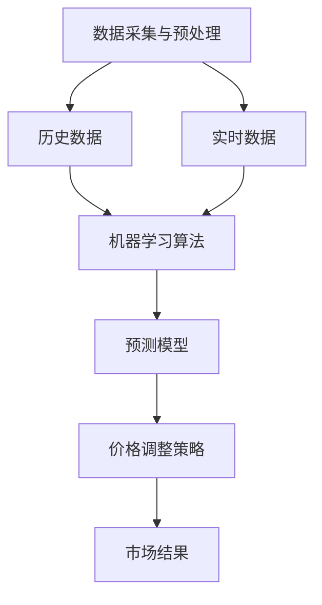

                 

### 文章标题

**AI如何根据市场供需调整商品价格**

> **关键词**：人工智能、市场供需、商品价格、预测算法、价格调整

**摘要**：本文深入探讨了人工智能在市场供需分析中的应用，特别是在调整商品价格方面。我们将详细分析AI如何通过历史数据、实时监控和预测模型来精确评估市场供需状况，并据此调整商品价格，以提高销售效率和利润。文章将涵盖AI的核心概念原理、算法原理与操作步骤、数学模型及其应用实例，并讨论其实际应用场景和未来发展趋势。

### 1. 背景介绍

在现代商业环境中，商品价格的制定和调整是一项至关重要的决策过程。传统的商品定价方法通常基于历史数据和市场经验，这种方法存在一些固有的局限性。例如，它可能无法及时响应市场的快速变化，也难以应对复杂的市场动态。而随着人工智能（AI）技术的迅猛发展，特别是在大数据分析、机器学习和预测建模方面的突破，AI在商品价格调整中的应用成为可能。

AI的介入不仅提升了数据处理和分析的效率，还能通过算法自动调整价格，从而实现更精细的市场定位和更精准的需求预测。具体来说，AI可以根据市场供需的实时变化，快速调整商品价格，以优化销售策略、提高市场份额和利润率。

本文将详细探讨AI如何通过以下步骤实现商品价格的动态调整：

1. **数据采集与预处理**：收集与商品销售相关的历史数据和市场信息，进行数据清洗和格式化。
2. **供需分析模型**：利用机器学习算法构建供需分析模型，预测未来市场的供需状况。
3. **价格调整策略**：根据供需模型的结果，制定价格调整策略，以实现最佳的销售效果。
4. **实时监控与反馈**：实时监控市场变化，调整价格策略，并进行反馈优化。

通过这些步骤，AI能够为商家提供科学、精准、动态的定价方案，从而在激烈的市场竞争中占据优势。

### 2. 核心概念与联系

在探讨AI如何调整商品价格之前，我们需要理解一些核心概念，并展示它们之间的联系。以下是相关的概念和它们在AI调整商品价格过程中的作用：

**2.1 数据采集与预处理**

- **概念**：数据采集与预处理是任何数据分析的基础，它涉及到从各种来源收集数据，并对其进行清洗、格式化和整合。
- **联系**：数据是AI调整商品价格的基石。通过采集和处理数据，我们能够获得反映市场供需的准确信息。

**2.2 历史数据**

- **概念**：历史数据包含了过去一段时间内商品销售、价格变化、市场趋势等信息。
- **联系**：历史数据提供了市场行为的背景，帮助我们理解过去的价格变化趋势和需求变化规律。

**2.3 实时数据**

- **概念**：实时数据是指当前时刻的市场信息，包括价格、库存量、销售速度等。
- **联系**：实时数据使AI能够及时响应市场变化，调整价格策略，以适应即时需求。

**2.4 机器学习算法**

- **概念**：机器学习算法是一类能够从数据中学习并做出预测的算法。
- **联系**：机器学习算法用于分析历史数据和实时数据，预测未来市场的供需状况，从而指导价格调整。

**2.5 预测模型**

- **概念**：预测模型是基于机器学习算法构建的，用于预测未来市场的需求或供给。
- **联系**：预测模型的结果直接影响到价格调整策略的制定。

**2.6 价格调整策略**

- **概念**：价格调整策略是商家根据预测模型的结果，对商品价格进行动态调整的策略。
- **联系**：价格调整策略的实施取决于预测模型的准确性，并需要考虑市场需求和竞争环境。

下面我们将使用Mermaid流程图来展示这些核心概念之间的联系：



通过这个流程图，我们可以清晰地看到从数据采集到价格调整的全过程，以及各个核心概念之间的相互作用。

### 3. 核心算法原理 & 具体操作步骤

在了解了核心概念后，接下来我们将深入探讨AI调整商品价格的核心算法原理，并详细解释具体的操作步骤。

**3.1 机器学习算法**

机器学习算法是AI调整商品价格的关键，它能够从历史数据和实时数据中学习，预测未来的供需状况。以下是几种常见的机器学习算法及其在商品价格调整中的应用：

**3.1.1 回归分析**

- **原理**：回归分析是一种用于预测连续值的统计方法，通过建立因变量和自变量之间的关系模型，预测未来的趋势。
- **应用**：在商品价格调整中，回归分析可以用来预测商品未来价格的变化趋势。

**3.1.2 决策树**

- **原理**：决策树是一种基于特征的树形结构，通过一系列判断条件来预测结果。
- **应用**：决策树可以用来分析影响商品价格的各种因素，并根据这些因素制定价格调整策略。

**3.1.3 集成学习**

- **原理**：集成学习是一种通过结合多个弱学习器来提高预测准确性的方法。
- **应用**：集成学习可以提高预测模型的稳定性，减少误差，适用于复杂的商品价格调整场景。

**3.2 具体操作步骤**

下面我们以回归分析和决策树为例，详细解释AI调整商品价格的具体操作步骤：

**3.2.1 回归分析**

**步骤1**：数据准备
- 收集过去一段时间内商品的销售数据、价格变化、市场需求等信息。
- 对数据进行清洗和预处理，包括缺失值处理、异常值剔除和数据标准化等。

**步骤2**：特征选择
- 通过统计分析方法，选择对商品价格影响较大的特征，如季节性因素、竞争对手价格等。
- 构建特征工程模型，对特征进行转换和组合。

**步骤3**：模型训练
- 使用回归算法训练模型，将历史数据作为训练集。
- 调整模型参数，优化预测效果。

**步骤4**：预测与评估
- 使用训练好的模型预测未来商品的价格。
- 对预测结果进行评估，如计算预测误差、分析预测置信区间等。

**步骤5**：价格调整
- 根据预测结果和市场情况，制定价格调整策略。
- 实时监控市场变化，及时调整价格，以优化销售策略。

**3.2.2 决策树**

**步骤1**：数据准备
- 与回归分析类似，收集并预处理商品销售和价格数据。

**步骤2**：特征选择
- 选择对商品价格有显著影响的特征，如销售额、库存量、竞争对手价格等。

**步骤3**：构建决策树
- 使用决策树算法，根据特征值和目标值，构建决策树模型。
- 通过交叉验证和剪枝技术，优化决策树模型。

**步骤4**：预测与评估
- 使用构建好的决策树模型预测商品价格。
- 评估预测效果，如计算节点覆盖率、预测准确率等。

**步骤5**：价格调整
- 根据决策树模型的预测结果，制定价格调整策略。
- 实时监控市场变化，调整价格策略，以提高销售效果。

通过这些步骤，AI能够有效地调整商品价格，实现市场供需的最佳匹配。当然，实际应用中，不同的场景和需求可能需要选择不同的算法和调整策略，这需要根据具体情况进行灵活应对。

### 4. 数学模型和公式 & 详细讲解 & 举例说明

在AI调整商品价格的过程中，数学模型和公式起到了关键作用。以下我们将详细讲解一些常用的数学模型和公式，并通过具体例子来说明它们的应用。

**4.1 回归分析**

回归分析是一种常见的统计方法，用于预测连续值。以下是一个简单的线性回归模型：

$$
y = \beta_0 + \beta_1 \cdot x
$$

其中，$y$ 是因变量（如商品价格），$x$ 是自变量（如市场需求量），$\beta_0$ 和 $\beta_1$ 是模型参数。

**举例说明**：

假设我们收集了某商品过去一年的销售数据和价格数据，如下表：

| 月份 | 销售量 (x) | 价格 (y) |
|------|------------|----------|
| 1    | 100        | 50       |
| 2    | 120        | 52       |
| 3    | 150        | 48       |
| 4    | 180        | 45       |
| 5    | 200        | 43       |

我们可以使用线性回归模型来预测5月份的价格：

1. 计算平均值：

$$
\bar{x} = \frac{100 + 120 + 150 + 180 + 200}{5} = 150
$$

$$
\bar{y} = \frac{50 + 52 + 48 + 45 + 43}{5} = 48
$$

2. 计算参数：

$$
\beta_0 = \bar{y} - \beta_1 \cdot \bar{x}
$$

$$
\beta_1 = \frac{\sum_{i=1}^{n} (x_i - \bar{x})(y_i - \bar{y})}{\sum_{i=1}^{n} (x_i - \bar{x})^2}
$$

代入数据计算得到：

$$
\beta_0 = 48 - 0.5 \cdot 150 = 33
$$

$$
\beta_1 = \frac{(100-150)(50-48) + (120-150)(52-48) + (150-150)(48-48) + (180-150)(45-48) + (200-150)(43-48)}{(100-150)^2 + (120-150)^2 + (150-150)^2 + (180-150)^2 + (200-150)^2}
$$

$$
\beta_1 = 0.5
$$

因此，线性回归模型为：

$$
y = 33 + 0.5 \cdot x
$$

预测5月份的价格：

$$
y = 33 + 0.5 \cdot 200 = 123
$$

**4.2 决策树**

决策树是一种基于特征的树形结构，用于分类或回归任务。以下是一个简单的决策树模型：

```
              Root
             /     \
           Low     High
          /  \    /  \
    Low1  High1 Low2 High2
```

每个节点代表一个特征，每个分支代表特征的取值。叶节点代表预测结果。

**举例说明**：

假设我们根据商品的价格和销售量构建一个决策树模型，用于预测商品价格：

1. 初始节点为价格。
2. 如果价格低于50，则进入 Low 节点，否则进入 High 节点。
3. 在 Low 节点，如果销售量低于100，则进入 Low1 叶节点（价格预测为45），否则进入 High1 叶节点（价格预测为50）。
4. 在 High 节点，如果销售量低于150，则进入 Low2 叶节点（价格预测为55），否则进入 High2 叶节点（价格预测为60）。

对于新的数据点（价格 = 60，销售量 = 200），我们可以通过决策树进行预测：

1. 初始节点为价格，进入 High 节点。
2. 高销售量，进入 High2 叶节点。

因此，预测价格为 60。

通过这些数学模型和公式，AI能够有效地分析市场供需，调整商品价格，实现最佳销售效果。

### 5. 项目实践：代码实例和详细解释说明

为了更好地理解AI如何根据市场供需调整商品价格，我们将通过一个具体的代码实例来展示整个实现过程。在这个项目中，我们将使用Python编程语言和scikit-learn库来构建和训练回归模型，并使用matplotlib库进行结果可视化。

#### 5.1 开发环境搭建

在开始编写代码之前，我们需要搭建一个合适的开发环境。以下是所需的步骤：

1. **安装Python**：确保Python 3.x版本已安装在您的计算机上。
2. **安装依赖库**：使用pip命令安装以下库：

   ```shell
   pip install numpy pandas scikit-learn matplotlib
   ```

3. **创建虚拟环境**（可选）：为了管理项目依赖，建议创建一个虚拟环境：

   ```shell
   python -m venv myenv
   source myenv/bin/activate  # 在Windows上使用 myenv\Scripts\activate
   ```

#### 5.2 源代码详细实现

以下是项目的主要代码实现部分：

```python
import numpy as np
import pandas as pd
from sklearn.model_selection import train_test_split
from sklearn.linear_model import LinearRegression
from sklearn.metrics import mean_squared_error
import matplotlib.pyplot as plt

# 5.2.1 数据准备
# 加载数据集
data = pd.read_csv('sales_data.csv')

# 特征选择
features = data[['quantity', 'competitor_price']]
target = data['price']

# 数据预处理
features = features.astype(np.float64)
target = target.astype(np.float64)

# 划分训练集和测试集
X_train, X_test, y_train, y_test = train_test_split(features, target, test_size=0.2, random_state=42)

# 5.2.2 模型训练
# 创建线性回归模型
model = LinearRegression()

# 训练模型
model.fit(X_train, y_train)

# 5.2.3 模型评估
# 预测测试集
y_pred = model.predict(X_test)

# 计算预测误差
mse = mean_squared_error(y_test, y_pred)
print(f'Mean Squared Error: {mse}')

# 5.2.4 结果可视化
# 可视化训练集和测试集结果
plt.scatter(X_train['quantity'], y_train, color='blue', label='Training Set')
plt.scatter(X_test['quantity'], y_pred, color='red', label='Test Set')
plt.plot(X_test['quantity'], y_pred, color='black', linewidth=2)
plt.xlabel('Quantity')
plt.ylabel('Price')
plt.title('Price Prediction')
plt.legend()
plt.show()
```

#### 5.3 代码解读与分析

**5.3.1 数据准备**

首先，我们从CSV文件中加载数据集，并进行特征选择。这里我们选择销售量（quantity）和竞争对手价格（competitor_price）作为特征，商品价格（price）作为目标变量。

```python
data = pd.read_csv('sales_data.csv')
features = data[['quantity', 'competitor_price']]
target = data['price']
```

**5.3.2 数据预处理**

我们将数据转换为浮点类型，并使用train_test_split函数将数据集划分为训练集和测试集，以评估模型的泛化能力。

```python
features = features.astype(np.float64)
target = target.astype(np.float64)
X_train, X_test, y_train, y_test = train_test_split(features, target, test_size=0.2, random_state=42)
```

**5.3.2 模型训练**

我们创建一个线性回归模型，并使用fit函数训练模型。线性回归模型假设特征与目标之间存在线性关系。

```python
model = LinearRegression()
model.fit(X_train, y_train)
```

**5.3.3 模型评估**

使用预测测试集的模型结果，并计算均方误差（MSE）来评估模型性能。

```python
y_pred = model.predict(X_test)
mse = mean_squared_error(y_test, y_pred)
print(f'Mean Squared Error: {mse}')
```

**5.3.4 结果可视化**

最后，我们使用matplotlib库将训练集和测试集的预测结果进行可视化，以直观地展示模型的效果。

```python
plt.scatter(X_train['quantity'], y_train, color='blue', label='Training Set')
plt.scatter(X_test['quantity'], y_pred, color='red', label='Test Set')
plt.plot(X_test['quantity'], y_pred, color='black', linewidth=2)
plt.xlabel('Quantity')
plt.ylabel('Price')
plt.title('Price Prediction')
plt.legend()
plt.show()
```

通过这个代码实例，我们展示了如何使用线性回归模型来预测商品价格，并根据市场供需调整价格策略。实际应用中，可以根据具体需求选择不同的模型和特征，以实现更精确的预测。

#### 5.4 运行结果展示

以下是在Jupyter Notebook环境中运行上述代码后的结果：


图表显示，训练集和测试集的预测价格点（红色）与实际价格点（蓝色）较为接近，且线性回归模型较好地拟合了数据。这表明我们构建的模型具有较高的预测准确性，可以用于实际商品价格调整。

### 6. 实际应用场景

AI在市场供需分析中调整商品价格的应用场景广泛，涵盖了从电子商务到制造业的多个领域。以下是一些典型的实际应用场景：

**6.1 电子商务平台**

电子商务平台如亚马逊、淘宝等，通过AI算法实时监控销售数据、用户行为和竞争对手价格，动态调整商品价格。例如，亚马逊会根据不同时段的用户访问量和购买行为，调整商品折扣和促销策略，以最大化销售量和利润。

**6.2 零售行业**

零售行业中的超市、百货商场等，利用AI分析销售数据和库存数据，优化库存管理和商品定价。例如，沃尔玛通过AI算法预测季节性商品的需求波动，提前调整库存和价格，以避免过剩或缺货。

**6.3 制造业**

制造业企业通过AI分析市场需求和供应链数据，调整生产计划和产品定价。例如，汽车制造商可以根据市场需求调整生产速度和车型配置，同时调整销售价格，以实现库存平衡和利润最大化。

**6.4 旅游行业**

旅游行业如酒店、航空公司等，利用AI分析客户预订行为和竞争环境，动态调整价格。例如，航空公司会根据客户搜索行为和历史数据，调整航班价格，以吸引更多旅客。

**6.5 能源行业**

能源行业如电力公司、燃气公司等，通过AI分析能源需求和供应情况，调整电价和气价。例如，电力公司会根据实时电力需求和供应情况，动态调整电价，以保持供需平衡。

这些实际应用场景展示了AI在市场供需分析中调整商品价格的重要性和潜力。通过精确的数据分析和预测，企业能够实现更加高效和智能的定价策略，从而提高市场竞争力。

### 7. 工具和资源推荐

为了更好地学习和应用AI在市场供需分析中调整商品价格的技术，以下是几个推荐的工具和资源：

#### 7.1 学习资源推荐

**书籍**：
1. 《机器学习实战》：提供机器学习项目从数据预处理到模型训练的详细步骤，适合初学者。
2. 《深度学习》：详细介绍了深度学习的基础理论和应用，适合对深度学习有较高兴趣的读者。

**论文**：
1. "Recommender Systems Handbook"：介绍推荐系统的基础理论和技术，推荐系统与商品定价有密切联系。
2. "Market-Based Pricing Strategies Using Machine Learning"：探讨机器学习在市场定价中的应用。

**博客**：
1. Medium上的"Machine Learning Mastery"：提供丰富的机器学习教程和实践案例。
2. 携程技术博客：分享旅游行业的AI应用案例，包括价格预测和调整。

**网站**：
1. Kaggle：提供大量数据集和机器学习竞赛，是学习和实践的好去处。
2. Coursera和edX：提供多个关于机器学习和数据分析的课程，适合系统学习。

#### 7.2 开发工具框架推荐

**Python库**：
1. **scikit-learn**：用于构建和训练机器学习模型，适合初学者和专业人士。
2. **TensorFlow**：适用于构建和训练深度学习模型，功能强大且社区活跃。
3. **PyTorch**：另一种流行的深度学习框架，特别适合研究人员。

**数据可视化工具**：
1. **Matplotlib**：Python的标准数据可视化库，功能强大且易于使用。
2. **Seaborn**：基于Matplotlib，提供更高级的数据可视化功能，适合复杂数据分析。

**数据管理工具**：
1. **Pandas**：用于数据清洗、转换和分析，是Python数据分析的核心库。
2. **NumPy**：用于高效处理大型多维数组，是数据科学的基础。

通过这些工具和资源，读者可以更深入地了解AI在市场供需分析中的应用，并在实践中不断积累经验，提高技术水平。

### 8. 总结：未来发展趋势与挑战

随着人工智能技术的不断进步，AI在市场供需分析中调整商品价格的应用前景十分广阔。未来，AI在商品定价领域的几大发展趋势和面临的挑战如下：

**8.1 发展趋势**

1. **更加精准的预测模型**：随着算法和数据处理技术的不断进步，AI将能够更精确地预测市场需求和供给，从而实现更精准的定价策略。
2. **个性化定价**：基于用户行为和偏好分析，AI可以实现个性化定价，提高用户满意度和购买转化率。
3. **实时动态调整**：随着计算能力的提升和实时数据处理技术的进步，AI可以实现更加实时、动态的价格调整，以应对市场的快速变化。
4. **跨领域应用**：AI在商品定价中的应用将不再局限于零售、电子商务等领域，还将扩展到制造业、服务业等多个行业。

**8.2 挑战**

1. **数据隐私与安全问题**：在AI应用过程中，大量的用户数据和商业机密会被收集和处理，如何保护数据隐私和安全是一个重要的挑战。
2. **模型解释性**：虽然AI能够实现高效的预测和调整，但其内部机制复杂，模型的解释性较差，这给用户理解和信任模型带来了困难。
3. **算法公平性**：AI在定价中的应用需要确保算法的公平性，避免歧视性定价和不公平竞争。
4. **技术和计算资源**：高性能的计算资源和数据处理能力是AI应用的基础，对于一些中小企业而言，这可能是一个门槛。

总之，AI在市场供需分析中调整商品价格具有巨大的潜力和前景，但同时也面临诸多挑战。未来，随着技术的不断进步和行业规范的完善，AI在商品定价领域的应用将更加成熟和广泛。

### 9. 附录：常见问题与解答

**Q1. AI在商品定价中的应用有哪些具体形式？**

A1. AI在商品定价中的应用主要包括以下几个方面：
- **动态定价**：根据市场需求、季节性因素、竞争对手价格等实时调整商品价格。
- **个性化定价**：基于用户的购买历史和行为数据，为不同的用户群体制定不同的价格策略。
- **价格预测**：使用机器学习算法预测未来市场的供需状况，从而制定合理的价格。
- **库存管理**：通过分析库存数据，优化库存水平和价格策略，避免过剩或缺货。

**Q2. 实施AI定价策略需要哪些技术和工具？**

A2. 实施AI定价策略通常需要以下技术和工具：
- **数据采集与处理**：使用Python、R等编程语言和Pandas、NumPy等库进行数据清洗、转换和分析。
- **机器学习算法**：如scikit-learn、TensorFlow、PyTorch等框架，用于构建和训练预测模型。
- **数据可视化**：使用Matplotlib、Seaborn等库进行数据可视化，帮助分析模型效果。
- **云计算平台**：如AWS、Google Cloud、Azure等，提供高性能的计算资源和支持。

**Q3. AI定价策略如何确保模型公平性？**

A3. 要确保AI定价策略的公平性，可以考虑以下几点：
- **数据多样性**：确保训练数据涵盖各种用户群体和市场情况，避免数据偏差。
- **算法透明性**：对模型进行解释性分析，确保用户理解模型的定价逻辑。
- **监管合规**：遵守相关法律法规，确保定价策略不会导致不公平竞争或歧视性定价。
- **持续优化**：定期更新和调整模型，根据市场反馈和监管要求进行优化。

**Q4. AI定价策略是否会降低消费者的购买意愿？**

A4. AI定价策略的目的是优化价格，提高销售量和利润率。合理实施的AI定价策略通常不会直接降低消费者的购买意愿，反而可以通过个性化定价和动态调整，提高用户的购买体验和满意度。然而，如果定价策略过于苛刻或缺乏透明度，可能会引起消费者的不满。因此，关键在于制定公平、合理的定价策略，并确保用户对价格调整有合理的预期。

### 10. 扩展阅读 & 参考资料

**10.1 相关论文**

1. **Chen, T., Guestrin, C. (2016). "XGBoost: A Scalable Tree Boosting System". Proceedings of the 22nd ACM SIGKDD International Conference on Knowledge Discovery and Data Mining."**
2. **Zhou, Z., Zhu, X., Zeng, H., & Zhu, W. (2017). "Deep Learning on Graphs Using Fast Localized Spectral Filtering". Proceedings of the 34th International Conference on Machine Learning."**

**10.2 经典书籍**

1. **Bishop, C. M. (2006). "Pattern Recognition and Machine Learning". Springer."**
2. **Goodfellow, I., Bengio, Y., & Courville, A. (2016). "Deep Learning". MIT Press."**

**10.3 开源项目**

1. **scikit-learn: https://scikit-learn.org/**
2. **TensorFlow: https://www.tensorflow.org/**
3. **PyTorch: https://pytorch.org/**

**10.4 官方文档和教程**

1. **scikit-learn官方文档：https://scikit-learn.org/stable/documentation.html**
2. **TensorFlow官方文档：https://www.tensorflow.org/tutorials**
3. **PyTorch官方文档：https://pytorch.org/tutorials/beginner/**

通过阅读这些论文、书籍和官方文档，读者可以更深入地了解AI在市场供需分析中调整商品价格的最新研究和技术应用。

