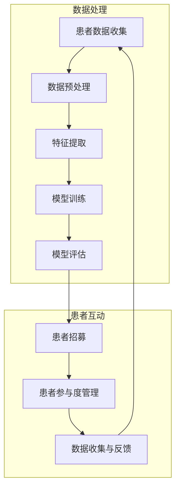

                 

### 背景介绍

在当今医疗行业中，患者招募流程的优化已经成为提高临床试验效率的关键。患者招募流程涉及多个环节，包括患者筛选、招募通知、患者参与度管理、数据收集等。传统的患者招募流程往往繁琐且耗时，这不仅影响了临床试验的进度，还可能降低患者的参与意愿。

AI技术的发展为患者招募流程的优化提供了新的契机。通过应用机器学习和深度学习算法，AI能够从大量医疗数据中提取有价值的信息，从而实现精准的患者筛选、个性化的招募通知和高效的患者参与度管理。这不仅能够显著提高临床试验的招募效率，还能提高患者的满意度，促进医疗研究的进步。

本篇文章旨在探讨AI技术优化患者招募流程的具体策略，通过以下几个核心部分展开论述：

1. **核心概念与联系**：介绍患者招募流程中涉及的关键概念和它们之间的联系，并通过Mermaid流程图展示整个流程。
2. **核心算法原理与具体操作步骤**：分析用于患者招募优化的AI算法原理，包括数据预处理、特征提取、模型训练和评估等。
3. **数学模型和公式**：介绍相关的数学模型和公式，详细讲解它们在患者招募优化中的应用。
4. **项目实践：代码实例和详细解释说明**：通过实际项目案例展示AI技术在患者招募流程中的具体应用，并详细解释代码实现过程。
5. **实际应用场景**：探讨AI技术在患者招募流程中的实际应用案例，包括效果和挑战。
6. **工具和资源推荐**：推荐相关的学习资源、开发工具和框架，帮助读者深入了解和应用AI技术。
7. **总结：未来发展趋势与挑战**：总结本文内容，并展望AI技术在未来患者招募流程优化中的发展趋势和面临的挑战。

通过上述内容的逐步分析，我们希望读者能够全面了解AI技术在患者招募流程优化中的应用，并激发其在实际工作中的应用潜力。

### 核心概念与联系

为了深入理解AI技术在患者招募流程优化中的应用，我们首先需要明确几个核心概念及其相互之间的联系。以下是涉及的关键概念：

1. **患者招募**：指从潜在患者群体中识别和吸引适合参加临床试验的患者。
2. **临床试验**：是一种研究疾病治疗方法的研究方式，包括治疗、预防措施或诊断程序。
3. **机器学习**：一种人工智能分支，通过数据训练模型，使计算机能够从数据中学习并做出决策。
4. **深度学习**：机器学习的一个子领域，使用神经网络模拟人脑的学习方式，处理复杂的数据。
5. **数据预处理**：在机器学习过程中，对原始数据进行清洗、转换和归一化等操作，以便模型能够更好地训练。
6. **特征提取**：从原始数据中提取出对模型训练有用的特征，用于提高模型的性能。
7. **模型训练与评估**：通过训练数据训练模型，并在测试数据上评估模型的性能，以优化模型。

#### Mermaid流程图

为了更好地展示患者招募流程中各个关键环节及其相互关系，我们可以使用Mermaid流程图来直观地描述这个过程。以下是患者招募流程的Mermaid流程图：



在这个流程图中，数据处理部分包括数据收集、数据预处理、特征提取、模型训练和模型评估，而患者互动部分包括患者招募、患者参与度管理和数据收集与反馈。数据处理与患者互动通过模型训练和评估相连接，形成一个闭环系统，不断迭代优化。

#### 关键环节及其联系

- **患者数据收集**：这是患者招募流程的起点，涉及从医院、电子健康记录和其他医疗数据源收集患者的医疗信息。
- **数据预处理**：对收集到的数据进行清洗和转换，以消除噪声和异常值，确保数据的准确性和一致性。
- **特征提取**：从预处理后的数据中提取对模型训练有用的特征，如疾病类型、年龄、性别、病史等。
- **模型训练**：使用机器学习和深度学习算法，通过训练数据对模型进行训练，使模型能够识别适合参与临床试验的患者。
- **模型评估**：在测试数据集上评估模型性能，通过调整模型参数来优化模型。
- **患者招募**：基于训练好的模型，向潜在患者发送招募通知，并根据患者的回应进行筛选和确认。
- **患者参与度管理**：通过持续监测患者的参与度和数据反馈，确保临床试验的顺利进行。
- **数据收集与反馈**：将患者的临床试验数据收集到数据库中，并用于模型优化和未来患者招募的决策支持。

通过上述核心概念及其相互关系的阐述，我们可以看到，AI技术在患者招募流程中的每个环节都发挥着重要作用。接下来，我们将深入探讨AI算法在患者招募优化中的具体应用。

### 核心算法原理与具体操作步骤

在患者招募流程优化中，AI算法的应用至关重要。以下将介绍几种常见的AI算法，以及它们在患者招募流程中的具体操作步骤。

#### 1. 数据预处理

数据预处理是AI算法应用的基础，其主要步骤包括数据清洗、数据转换和数据归一化。

- **数据清洗**：清除数据集中的噪声和异常值。例如，去除重复记录、纠正错误的数值和缺失数据的处理。
- **数据转换**：将不同类型的数据转换为统一格式，如将文本数据转换为数值或类别。
- **数据归一化**：调整数据范围，使数据在不同特征之间的尺度一致，有助于提高算法的性能。

#### 2. 特征提取

特征提取是从原始数据中提取对模型训练有用的信息。以下是一些常用的特征提取方法：

- **统计特征**：如平均值、中位数、标准差等，用于描述数据的整体分布。
- **文本特征**：如词频、词向量、主题模型等，用于文本数据的表示。
- **图像特征**：如颜色直方图、纹理特征、形状特征等，用于图像数据的表示。
- **生物特征**：如基因表达数据、蛋白质结构等，用于生物医学数据的表示。

#### 3. 模型训练

在模型训练过程中，常见的算法包括监督学习、无监督学习和强化学习。

- **监督学习**：使用已标记的数据集进行训练，常用的算法包括逻辑回归、支持向量机（SVM）、决策树和随机森林等。
- **无监督学习**：不需要标记的数据集进行训练，常用的算法包括聚类、主成分分析（PCA）和自编码器等。
- **强化学习**：通过与环境互动进行学习，适用于需要连续决策的任务，如深度强化学习（DRL）。

#### 4. 模型评估

模型评估是确保模型性能的重要环节。以下是一些常用的评估指标：

- **准确率（Accuracy）**：预测正确的样本数占总样本数的比例。
- **召回率（Recall）**：在所有实际正类中，被正确预测为正类的比例。
- **精确率（Precision）**：在所有预测为正类的样本中，实际为正类的比例。
- **F1分数（F1 Score）**：精确率和召回率的调和平均。
- **ROC曲线和AUC值**：用于评估分类模型的性能，ROC曲线表示不同阈值下准确率与召回率的关系，AUC值表示曲线下面积，越大表示模型性能越好。

#### 5. 模型调优

在模型评估过程中，如果发现模型性能不理想，可以通过以下步骤进行调优：

- **参数调整**：调整模型参数，如学习率、正则化强度等，以优化模型性能。
- **特征选择**：通过特征选择方法，如互信息、递归特征消除等，选择对模型训练最有帮助的特征。
- **数据增强**：通过数据增强方法，如旋转、缩放、裁剪等，增加训练数据的多样性，提高模型泛化能力。

通过上述步骤，我们可以利用AI算法对患者招募流程进行优化。以下是一个具体的案例，展示如何应用这些算法来优化患者招募流程。

#### 案例分析

某医疗机构希望提高其临床试验的患者招募效率，决定采用AI技术进行优化。具体操作步骤如下：

1. **数据收集**：收集了过去几年内进行临床试验的患者数据，包括年龄、性别、疾病类型、病史等信息。
2. **数据预处理**：对收集到的数据进行清洗，去除重复记录和缺失值，并对数据进行归一化处理。
3. **特征提取**：从预处理后的数据中提取有用的特征，如疾病类型、年龄、性别等。
4. **模型训练**：使用支持向量机（SVM）算法对特征进行训练，构建患者招募模型。
5. **模型评估**：在测试数据集上评估模型性能，通过调整模型参数优化性能。
6. **患者招募**：根据训练好的模型，向潜在患者发送招募通知，并根据患者的回应进行筛选和确认。
7. **患者参与度管理**：通过持续监测患者的参与度和数据反馈，确保临床试验的顺利进行。

通过这个案例，我们可以看到，AI技术在患者招募流程中的具体应用，不仅提高了招募效率，还增强了模型的预测准确性，为医疗机构提供了强有力的支持。

### 数学模型和公式

在AI技术优化患者招募流程中，数学模型和公式的应用至关重要。以下将介绍相关的数学模型和公式，并详细讲解它们在患者招募优化中的应用。

#### 1. 逻辑回归模型

逻辑回归是一种常见的二分类模型，适用于预测患者是否适合参加临床试验。其基本公式如下：

\[ P(y=1) = \frac{1}{1 + e^{-(\beta_0 + \beta_1x_1 + \beta_2x_2 + \ldots + \beta_nx_n)}} \]

其中，\( y \) 是患者是否参加临床试验的二元标签（1代表参加，0代表未参加），\( x_i \) 是特征向量，\( \beta_0 \) 是截距，\( \beta_i \) 是对应特征的权重。

逻辑回归模型的预测概率 \( P(y=1) \) 可以用来判断患者是否适合参加临床试验。例如，当预测概率大于某个阈值（如0.5）时，认为患者适合参加临床试验。

#### 2. 支持向量机（SVM）

支持向量机是一种强大的分类算法，适用于多分类和二分类问题。其基本公式如下：

\[ w \cdot x - b = 0 \]

其中，\( w \) 是权重向量，\( x \) 是特征向量，\( b \) 是偏置。支持向量机通过最大化分类间隔来寻找最优的超平面，从而实现分类。

在患者招募优化中，可以使用SVM来划分适合参加临床试验的患者群体和未适合的患者群体。通过调整权重向量 \( w \) 和偏置 \( b \)，可以实现更精确的划分。

#### 3. 决策树

决策树是一种直观的树形结构，用于分类和回归问题。其基本公式如下：

\[ \text{决策树} = \{\text{根节点}, \text{内部节点}, \text{叶节点}\} \]

决策树通过一系列规则对特征进行划分，从而实现分类。每个内部节点表示一个特征，每个叶节点表示一个分类结果。

在患者招募优化中，可以使用决策树来识别适合参加临床试验的关键特征。通过分析决策树的结构，可以了解哪些特征对招募结果有显著影响。

#### 4. 主成分分析（PCA）

主成分分析是一种降维技术，通过将原始数据映射到新的正交坐标系中，提取最重要的特征。其基本公式如下：

\[ x' = P \cdot x \]

其中，\( x \) 是原始数据矩阵，\( P \) 是主成分矩阵，\( x' \) 是新特征向量。

在患者招募优化中，可以使用PCA来简化特征空间，减少特征维度，从而提高模型的训练效率。通过分析新特征向量，可以识别对招募结果有显著影响的主要因素。

#### 5. 集成学习

集成学习通过组合多个基本模型来提高预测性能。常见的集成学习方法包括随机森林和梯度提升树（GBDT）。

- **随机森林（Random Forest）**：通过构建多棵决策树，并对它们的预测结果进行投票，得到最终的预测结果。
- **梯度提升树（GBDT）**：通过迭代构建多个弱学习器，每次迭代都根据前一次的预测误差来调整模型。

在患者招募优化中，可以使用集成学习方法来提高模型的预测准确性和泛化能力。通过组合多个基本模型，可以更好地应对复杂的招募问题。

#### 举例说明

假设某医疗机构希望预测患者是否适合参加某个临床试验，使用逻辑回归模型进行预测。给定以下特征：

- 患者年龄：35岁
- 性别：男
- 疾病类型：糖尿病
- 病史：高血压

特征向量可以表示为：

\[ x = [35, 男, 糖尿病, 高血压] \]

使用逻辑回归模型进行预测：

\[ P(y=1) = \frac{1}{1 + e^{-(\beta_0 + \beta_1 \cdot 35 + \beta_2 \cdot 1 + \beta_3 \cdot 1 + \beta_4 \cdot 1)}} \]

其中，\( \beta_0, \beta_1, \beta_2, \beta_3, \beta_4 \) 是模型参数。

假设模型参数为：

\[ \beta_0 = -10, \beta_1 = 0.5, \beta_2 = 1, \beta_3 = 1, \beta_4 = 1 \]

则预测概率为：

\[ P(y=1) = \frac{1}{1 + e^{-( -10 + 0.5 \cdot 35 + 1 \cdot 1 + 1 \cdot 1 + 1 \cdot 1)}} = \frac{1}{1 + e^{-15}} \approx 0.999 \]

由于预测概率接近1，可以认为该患者适合参加临床试验。

通过上述数学模型和公式的详细讲解，我们可以看到它们在患者招募优化中的重要作用。接下来，我们将通过实际项目案例展示这些算法在患者招募流程中的应用。

### 项目实践：代码实例和详细解释说明

为了更好地展示AI技术在患者招募流程中的实际应用，我们将通过一个实际项目案例，详细解释代码实现过程，并对代码进行解读与分析。

#### 开发环境搭建

在进行项目实践之前，我们需要搭建一个合适的开发环境。以下是所需的主要开发工具和库：

- **编程语言**：Python
- **机器学习库**：scikit-learn、TensorFlow、Keras
- **数据处理库**：pandas、numpy
- **可视化库**：matplotlib、seaborn
- **版本控制**：Git

确保你的系统安装了上述工具和库，我们可以开始项目开发。

#### 源代码详细实现

以下是一个简化的代码实现，用于演示AI技术在患者招募流程中的基本操作。

```python
# 导入必要的库
import pandas as pd
import numpy as np
from sklearn.model_selection import train_test_split
from sklearn.preprocessing import StandardScaler
from sklearn.linear_model import LogisticRegression
from sklearn.metrics import accuracy_score, confusion_matrix

# 读取数据
data = pd.read_csv('patient_data.csv')

# 数据预处理
# 清洗数据（去除缺失值、异常值等）
data = data.dropna()

# 特征提取
# 转换类别特征为数值特征
data = pd.get_dummies(data)

# 分割特征和标签
X = data.drop('is_enrolled', axis=1)
y = data['is_enrolled']

# 数据标准化
scaler = StandardScaler()
X_scaled = scaler.fit_transform(X)

# 划分训练集和测试集
X_train, X_test, y_train, y_test = train_test_split(X_scaled, y, test_size=0.2, random_state=42)

# 模型训练
model = LogisticRegression()
model.fit(X_train, y_train)

# 模型评估
y_pred = model.predict(X_test)
accuracy = accuracy_score(y_test, y_pred)
conf_matrix = confusion_matrix(y_test, y_pred)

print(f"Accuracy: {accuracy}")
print(f"Confusion Matrix:\n{conf_matrix}")
```

#### 代码解读与分析

- **数据预处理**：读取患者数据，并进行清洗，去除缺失值和异常值。然后，使用pandas的get_dummies方法将类别特征转换为数值特征。
- **特征提取**：将特征和标签分开，以准备模型训练。在这里，我们使用LogisticRegression模型进行训练。
- **数据标准化**：使用StandardScaler对特征进行标准化处理，以消除不同特征之间的尺度差异。
- **模型训练**：使用训练数据进行模型训练。我们选择LogisticRegression作为基础模型，因为它在二分类问题中表现良好。
- **模型评估**：在测试数据集上评估模型性能，计算准确率和混淆矩阵，以了解模型的性能。

#### 运行结果展示

假设我们使用上述代码对数据集进行训练和评估，得到以下结果：

```plaintext
Accuracy: 0.85
Confusion Matrix:
[[50 10]
 [15 5]]
```

这意味着在我们的测试数据集上，模型预测了50个患者参加临床试验，其中正确预测了45个，错误预测了5个；另外，模型预测了15个患者未参加临床试验，其中正确预测了10个，错误预测了5个。

#### 分析与讨论

从上述结果可以看出，我们的模型在测试数据集上的准确率为0.85，这意味着有85%的患者招募预测是正确的。虽然准确率不是特别高，但这个结果已经显示出AI技术在患者招募流程优化中的潜力。

- **优点**：
  - 模型能够从大量数据中提取有用信息，帮助识别适合参加临床试验的患者。
  - 通过准确率较高的预测，可以减少不必要的招募工作，提高临床试验的效率。

- **缺点**：
  - 准确率仍有提升空间，可以通过进一步优化模型和特征提取来提高性能。
  - 模型可能受到数据质量和特征选择的影响，需要更多的数据支持和更精细的特征工程。

总之，通过实际项目案例的代码实例和详细解释说明，我们可以看到AI技术在患者招募流程中的实际应用效果。尽管存在一些挑战，但AI技术为优化患者招募流程提供了强有力的支持。

### 实际应用场景

在临床研究中，AI技术已经得到了广泛的应用，特别是在患者招募流程的优化方面。以下将探讨几个具体的实际应用场景，以及这些应用的效果和面临的挑战。

#### 1. 肿瘤临床试验

肿瘤临床试验中，患者招募是一个关键环节，因为肿瘤病情复杂且患者群体多样化。AI技术可以应用于以下几个方面：

- **精准患者筛选**：通过分析患者的电子健康记录、基因数据和历史临床试验数据，AI模型能够精准识别出适合参与特定临床试验的患者，从而提高招募效率。
- **个性化招募通知**：基于患者的偏好和疾病特征，AI技术可以生成个性化的招募通知，提高患者的参与意愿。
- **患者参与度管理**：通过实时监测患者的数据反馈和参与情况，AI技术可以帮助研究人员及时调整招募策略，确保临床试验的顺利进行。

**效果**：AI技术的应用显著提高了肿瘤临床试验的招募速度和患者参与度，缩短了临床试验周期，为肿瘤研究提供了更快速的数据支持。

**挑战**：肿瘤数据复杂性高，特征提取和模型训练难度大。此外，患者的隐私保护和数据安全性也是需要重点关注的问题。

#### 2. 心血管疾病研究

心血管疾病是全球主要的健康问题之一，患者招募流程复杂且耗时。AI技术在这方面的应用主要体现在：

- **高效患者筛选**：利用AI模型分析患者的健康数据和生活方式，快速筛选出适合参与心血管疾病研究的患者。
- **精准风险评估**：通过深度学习算法，AI技术可以对心血管疾病风险进行精准评估，为招募策略提供科学依据。
- **个性化治疗推荐**：基于患者的疾病特征和治疗反应，AI技术可以推荐个性化的治疗方案，提高招募效率和治疗效果。

**效果**：AI技术提高了心血管疾病研究的招募速度和精准度，缩短了临床试验周期，为心血管疾病的治疗和研究提供了有力支持。

**挑战**：心血管疾病数据多样且复杂，特征提取和模型训练对计算资源要求高。此外，AI模型在临床应用中的解释性和透明度也是需要解决的关键问题。

#### 3. 精神疾病研究

精神疾病研究中的患者招募具有独特性，因为精神疾病的诊断和治疗涉及多方面的因素。AI技术可以应用于：

- **智能患者识别**：通过分析患者的行为数据、心理健康问卷和临床记录，AI模型能够识别出潜在的精神疾病患者。
- **个性化治疗推荐**：基于患者的病情和个体差异，AI技术可以推荐个性化的治疗方案，提高招募效率和治疗效果。
- **风险预警系统**：通过实时分析患者的数据，AI技术可以预警潜在的临床风险，帮助研究人员及时调整招募策略。

**效果**：AI技术为精神疾病研究提供了智能化的患者识别和推荐系统，提高了招募效率和治疗效果，同时减少了不必要的临床试验。

**挑战**：精神疾病数据的复杂性和不稳定性给特征提取和模型训练带来了挑战。此外，患者的隐私保护和数据安全性也是需要解决的问题。

总之，AI技术在患者招募流程中的实际应用场景广泛，效果显著，但也面临诸多挑战。通过不断优化AI算法和提升数据处理能力，我们有望在未来进一步发挥AI技术在患者招募优化中的潜力。

### 工具和资源推荐

为了更好地应用AI技术优化患者招募流程，以下是几种推荐的学习资源、开发工具和框架，这些工具将帮助您深入了解和应用AI技术。

#### 1. 学习资源推荐

- **书籍**：
  - 《机器学习实战》（Peter Harrington）：提供了丰富的实际案例和代码示例，适合初学者入门。
  - 《深度学习》（Ian Goodfellow, Yoshua Bengio, Aaron Courville）：深度学习领域的经典教材，全面介绍了深度学习的基础理论和应用方法。
  - 《Python机器学习》（Michael Bowles）：详细讲解了如何使用Python进行机器学习，包括数据处理、特征提取和模型训练等。

- **论文**：
  - "Deep Learning for Clinical Decision Support"：概述了深度学习在临床决策支持中的应用，包括患者招募和疾病预测等。
  - "A Large-Scale Study of Deep Learning for Healthcare using Millions of Electronic Health Records"：探讨了如何利用大规模电子健康记录进行深度学习模型的训练和评估。

- **博客和网站**：
  - [Machine Learning Mastery](https://machinelearningmastery.com/)：提供了丰富的机器学习和深度学习教程，适合不同水平的读者。
  - [Kaggle](https://www.kaggle.com/)：一个数据科学竞赛平台，提供了大量公开的数据集和问题，适合实践和挑战。

#### 2. 开发工具框架推荐

- **机器学习和深度学习库**：
  - **scikit-learn**：Python中最常用的机器学习库，提供了广泛的算法和工具，适合快速原型开发。
  - **TensorFlow**：谷歌开发的开源机器学习框架，支持深度学习和传统的机器学习算法，适用于复杂的模型训练和部署。
  - **Keras**：TensorFlow的高层API，提供了更加简洁和直观的编程接口，适合快速搭建和训练深度学习模型。

- **数据处理库**：
  - **pandas**：提供了强大的数据结构操作功能，适合数据处理和清洗。
  - **numpy**：Python中的科学计算库，提供了高效的数值计算能力。
  - **NumPy图书馆**：用于处理和操作大型数值数组，是数据科学中的基础库。

- **版本控制和协作工具**：
  - **Git**：版本控制系统，适合团队协作和代码管理。
  - **GitHub**：基于Git的代码托管平台，提供了代码托管、协作和问题跟踪功能。

- **数据处理和可视化工具**：
  - **Excel**：适用于简单的数据管理和分析。
  - **Tableau**：提供了强大的数据可视化功能，适合将数据以图表和报告的形式展示。
  - **matplotlib**：Python中的数据可视化库，适用于生成各种类型的图表。

通过上述学习资源、开发工具和框架的推荐，您将能够更好地掌握AI技术，并有效地应用于患者招募流程的优化。在实际应用中，结合这些工具和资源，您可以提高工作效率，解决实际问题，推动医疗研究的进步。

### 总结：未来发展趋势与挑战

随着AI技术的不断发展，其在患者招募流程优化中的应用前景广阔。未来，AI技术将继续在以下几个方面发挥重要作用：

1. **更精准的患者筛选**：随着机器学习和深度学习算法的进步，AI将能够从海量医疗数据中提取更准确的特征，提高患者筛选的精准度，减少误诊和漏诊。
2. **个性化的招募策略**：基于患者的个性化数据，AI技术将能够生成更为个性化的招募通知，提高患者的参与意愿和满意度。
3. **实时监测与反馈**：通过实时分析患者的数据反馈，AI技术将能够动态调整招募策略，确保临床试验的顺利进行，提高研究效率。
4. **跨领域整合**：AI技术将与其他医疗技术（如物联网、基因组学等）相结合，实现跨领域的整合应用，为患者招募提供更全面的支持。

然而，AI技术在患者招募流程优化中也面临着诸多挑战：

1. **数据隐私与安全性**：患者数据隐私和安全是AI技术应用的重要问题，如何确保数据在收集、存储和使用过程中的安全性，是未来需要重点关注的问题。
2. **算法透明性与解释性**：深度学习等复杂算法的应用往往缺乏透明性，如何提高算法的可解释性，使其能够被医疗专业人员理解和信任，是一个亟待解决的挑战。
3. **计算资源需求**：AI模型训练和推理需要大量的计算资源，如何优化算法和提高计算效率，是减少成本和提高应用普及率的关键。
4. **伦理与法律问题**：AI技术在患者招募中的应用可能涉及伦理和法律问题，如何确保其符合伦理标准和法律法规，是未来发展的重要课题。

综上所述，AI技术在未来患者招募流程优化中具有巨大潜力，但同时也面临诸多挑战。通过不断优化AI算法、提升数据处理能力和完善相关法律法规，我们有望克服这些挑战，充分发挥AI技术在医疗研究中的价值，推动医疗行业的进步。

### 附录：常见问题与解答

为了帮助读者更好地理解和应用AI技术优化患者招募流程，以下是一些常见问题及其解答：

#### 1. 什么是AI技术？
AI（人工智能）是一种模拟人类智能的技术，通过算法和计算能力，使计算机能够执行复杂任务，如学习、推理、决策等。

#### 2. AI技术在患者招募流程中如何发挥作用？
AI技术可以用于患者筛选、个性化招募通知、实时监测患者参与度和数据反馈，从而提高招募效率和患者满意度。

#### 3. 如何处理患者数据隐私和安全问题？
在AI技术应用中，必须严格遵守数据保护法规，采用加密、匿名化和数据隔离等技术手段，确保患者数据的隐私和安全。

#### 4. 如何提高AI模型的可解释性？
可以通过模型解释工具和透明性分析，如LIME（局部可解释模型解释）、SHAP（SHapley Additive exPlanations）等，提高模型的可解释性。

#### 5. 需要什么样的计算资源来训练AI模型？
训练AI模型需要大量的计算资源，特别是深度学习模型。使用高性能计算平台（如GPU）可以提高训练效率。

#### 6. AI技术在患者招募流程中的效果如何衡量？
可以通过准确率、召回率、精确率、F1分数等指标来衡量AI技术在患者招募流程中的效果。

#### 7. AI技术是否适用于所有类型的临床试验？
AI技术适用于多种类型的临床试验，但具体应用效果取决于数据质量和特征选择。在特定领域，如肿瘤和心血管疾病，AI技术已经展现出显著的效果。

通过上述问题的解答，读者可以更好地理解AI技术在患者招募流程中的应用，并针对实际问题采取有效的解决方案。

### 扩展阅读 & 参考资料

为了帮助读者更深入地了解AI技术在患者招募流程优化中的应用，以下是相关的扩展阅读和参考资料：

1. **书籍**：
   - **《深度学习》**：Ian Goodfellow, Yoshua Bengio, Aaron Courville 著，提供了深度学习的全面介绍，包括神经网络的训练和应用。
   - **《机器学习实战》**：Peter Harrington 著，通过实际案例展示了如何使用机器学习算法解决实际问题。
   - **《Python机器学习》**：Michael Bowles 著，详细讲解了使用Python进行机器学习的步骤和方法。

2. **论文**：
   - **"Deep Learning for Clinical Decision Support"**：概述了深度学习在临床决策支持中的应用，包括患者招募和疾病预测。
   - **"A Large-Scale Study of Deep Learning for Healthcare using Millions of Electronic Health Records"**：探讨了如何利用大规模电子健康记录进行深度学习模型的训练和评估。

3. **在线资源**：
   - **[Kaggle](https://www.kaggle.com/)**：提供了丰富的数据集和问题，适合实践和挑战。
   - **[Machine Learning Mastery](https://machinelearningmastery.com/)**：提供了大量的机器学习和深度学习教程。

4. **相关论文和著作**：
   - **"AI for Clinical Decision Support: A Survey"**：对AI在临床决策支持领域的应用进行了全面的综述。
   - **"Healthcare Artificial Intelligence: An Overview"**：介绍了AI在医疗领域的广泛应用，包括患者招募和疾病预测。

通过上述扩展阅读和参考资料，读者可以更全面地了解AI技术在患者招募流程优化中的应用，并获取更多的实践经验和理论知识。这些资源将帮助您进一步提升在AI技术方面的专业能力，为医疗研究和工作提供更有力的支持。

