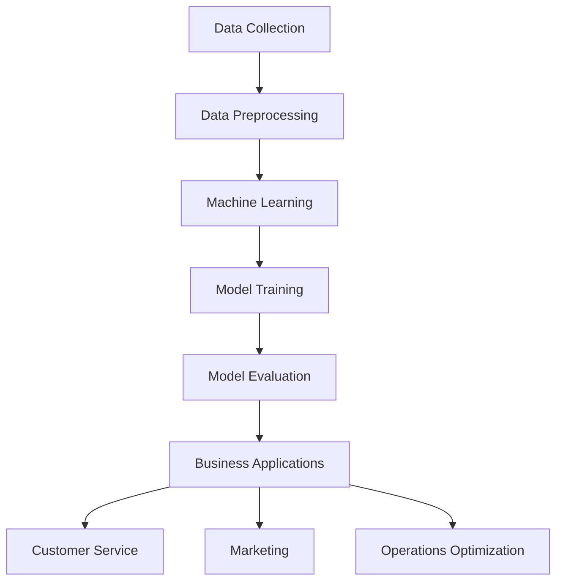

                 

### 背景介绍

随着科技的飞速发展，人工智能（AI）技术逐渐成为推动各行各业创新的重要力量。商业领域尤其如此，AI技术的应用不仅提升了企业的运营效率，还创造了前所未有的商业模式和竞争优势。本文将深入探讨AI技术在商业中的应用前景，通过逐步分析推理的方式，探讨其在各个方面的潜力与挑战。

#### AI技术的基本概念与发展历程

人工智能是指计算机系统模拟人类智能的行为和过程，包括学习、推理、感知、理解和决策等。AI技术的发展经历了多个阶段，从早期的规则基础专家系统，到基于大数据的机器学习，再到深度学习和自然语言处理，每一次技术突破都带来了商业应用的新可能。

1. **专家系统（1970s-1980s）**：基于规则的人工智能系统，通过预先设定的规则进行推理和决策。
2. **机器学习（1990s-2000s）**：通过数据学习和模式识别，使计算机系统能够自动改进性能。
3. **深度学习（2010s-至今）**：通过多层神经网络模拟人脑，实现复杂的数据分析和模式识别。

#### AI在商业中的应用现状

当前，AI技术在商业领域已经得到了广泛的应用，具体体现在以下几个方面：

1. **客户服务**：通过聊天机器人、语音助手等技术，提供24/7的客户支持，提升用户体验。
2. **数据分析**：利用数据挖掘和分析技术，帮助企业挖掘商业价值，优化业务流程。
3. **智能制造**：通过智能设备和机器学习算法，实现生产流程的自动化和优化。
4. **精准营销**：基于用户行为数据和偏好分析，实现个性化营销策略。
5. **风险管理**：通过机器学习模型，预测和防范金融风险。

### 当前AI技术发展的趋势

随着AI技术的不断进步，其在商业领域的应用前景也愈加广阔。以下是一些重要的趋势：

1. **边缘计算**：通过将计算能力延伸到网络边缘，实现更高效的数据处理和响应速度。
2. **自适应系统**：利用强化学习等技术，使系统能够自我学习和优化，适应不断变化的环境。
3. **人机协作**：通过智能助手和人类专家的协同工作，提升工作效率和决策质量。
4. **区块链与AI结合**：利用区块链的不可篡改性，确保AI系统的透明度和可信度。
5. **多模态感知**：通过整合视觉、语音等多种感知数据，实现更全面的情境理解和响应能力。

### 目的与结构

本文旨在系统地探讨AI技术在商业中的应用前景，具体结构如下：

1. **核心概念与联系**：介绍AI技术的基本原理和商业应用之间的联系，并通过Mermaid流程图展示其架构。
2. **核心算法原理 & 具体操作步骤**：深入解析AI技术的关键算法，并详细描述其实施步骤。
3. **数学模型和公式**：讲解AI技术中的数学模型和公式，并通过实际案例进行说明。
4. **项目实践**：通过一个具体的项目实例，展示AI技术的实际应用过程和效果。
5. **实际应用场景**：分析AI技术在不同商业领域的具体应用，探讨其面临的挑战和解决方案。
6. **工具和资源推荐**：推荐学习资源、开发工具和框架，帮助读者深入了解和掌握AI技术。
7. **总结**：总结AI技术在商业中的应用前景，探讨未来的发展趋势和挑战。
8. **附录**：提供常见问题与解答，以及扩展阅读和参考资料。

在接下来的章节中，我们将逐一深入探讨这些内容，帮助读者全面了解AI技术在商业领域的应用前景。### 核心概念与联系

为了深入探讨AI技术在商业中的应用，我们首先需要了解AI技术的基本概念及其在商业环境中如何发挥作用。以下是几个核心概念：

#### 1. 机器学习（Machine Learning）

机器学习是AI的核心技术之一，它使计算机系统能够从数据中学习并改进性能，无需显式地编写规则。机器学习可以分为监督学习、无监督学习和强化学习。

- **监督学习（Supervised Learning）**：使用标记数据来训练模型，然后使用这些模型进行预测。
- **无监督学习（Unsupervised Learning）**：在未标记的数据上训练模型，以发现数据中的模式或结构。
- **强化学习（Reinforcement Learning）**：通过试错法，使模型在与环境的交互中学习最优策略。

#### 2. 深度学习（Deep Learning）

深度学习是机器学习的一个分支，它使用多层神经网络来模拟人脑处理信息的方式。深度学习在图像识别、自然语言处理和语音识别等领域取得了显著的成果。

- **卷积神经网络（CNN，Convolutional Neural Network）**：擅长处理图像和视频数据。
- **循环神经网络（RNN，Recurrent Neural Network）**：适用于处理序列数据，如时间序列数据和自然语言文本。
- **生成对抗网络（GAN，Generative Adversarial Network）**：用于生成新数据，如图像和文本。

#### 3. 自然语言处理（NLP，Natural Language Processing）

自然语言处理是AI的一个重要分支，专注于使计算机理解和生成人类语言。NLP在自动翻译、文本分类、情感分析和问答系统中有着广泛的应用。

- **词向量（Word Vectors）**：将单词映射到高维空间，以便进行语义分析。
- **序列到序列模型（Seq2Seq，Sequence-to-Sequence Model）**：用于翻译、问答等序列转换任务。
- **BERT（Bidirectional Encoder Representations from Transformers）**：一种预训练语言模型，在多种NLP任务中表现优异。

#### 4. 数据挖掘（Data Mining）

数据挖掘是另一个关键技术，它涉及从大量数据中提取有用信息。数据挖掘技术可以帮助企业发现隐藏的模式、趋势和关联，从而做出更明智的决策。

- **关联规则挖掘（Association Rule Learning）**：发现数据中的关联关系，如哪些商品经常一起购买。
- **分类和聚类（Classification and Clustering）**：将数据分为不同的类别或簇，以识别数据中的模式和结构。
- **异常检测（Anomaly Detection）**：识别数据中的异常或离群点，用于预测和风险管理。

#### Mermaid流程图

为了更直观地展示AI技术的基本原理和商业应用之间的联系，我们可以使用Mermaid流程图来描绘它们之间的关系。以下是一个简化的Mermaid流程图示例：



在这个流程图中，数据收集是整个流程的起点，随后通过数据预处理、机器学习模型训练和评估，最终应用于不同的商业领域，如客户服务、市场营销和业务流程优化。

#### 商业应用中的AI技术架构

在实际的商业环境中，AI技术的应用通常涉及到以下架构：

1. **数据层**：收集、存储和管理各种类型的数据，包括结构化数据（如数据库）和非结构化数据（如图像、文本、音频）。
2. **算法层**：包括机器学习、深度学习和数据挖掘算法，用于处理和分析数据。
3. **模型层**：通过训练和优化算法，构建出可以用于实际应用的模型。
4. **应用层**：将模型部署到生产环境中，实现具体的业务功能，如客户服务聊天机器人、个性化推荐系统、自动化生产线等。

#### 商业应用场景

以下是一些典型的商业应用场景，展示了AI技术的具体应用：

1. **客户服务**：使用聊天机器人、语音助手等技术，提供24/7的客户支持，提升用户体验。
2. **精准营销**：基于用户行为数据和偏好分析，实现个性化营销策略。
3. **业务流程优化**：通过预测分析和自动化，优化业务流程，提高效率。
4. **风险管理**：利用机器学习模型，预测和防范金融风险。
5. **智能制造**：通过智能设备和机器学习算法，实现生产流程的自动化和优化。

通过上述核心概念和架构的介绍，我们可以看到AI技术在商业应用中的巨大潜力。接下来，我们将进一步探讨AI技术的核心算法原理和具体操作步骤，帮助读者更好地理解和应用这些技术。### 核心算法原理 & 具体操作步骤

在了解了AI技术在商业应用中的核心概念和联系之后，我们接下来将深入探讨其中的核心算法原理和具体操作步骤。以下是几个关键算法及其应用场景的详细介绍。

#### 1. 机器学习算法（Machine Learning Algorithms）

机器学习算法是AI技术的基石，涵盖了多种不同的算法，每种算法都有其独特的应用场景和优势。以下是一些常见的机器学习算法：

1. **线性回归（Linear Regression）**

线性回归是一种简单的预测模型，用于预测一个连续的数值输出。其基本原理是通过拟合一条直线来描述输入变量与输出变量之间的关系。

- **具体操作步骤**：

  1. 数据预处理：对输入数据进行标准化处理，消除量纲差异。
  2. 模型训练：使用最小二乘法（Least Squares）拟合一条直线，最小化预测值与实际值之间的误差平方和。
  3. 模型评估：通过均方误差（Mean Squared Error, MSE）或决定系数（R-squared）等指标评估模型性能。

2. **决策树（Decision Tree）**

决策树是一种基于特征的分类或回归模型，通过一系列判断节点将数据集划分为不同的子集，最终到达一个叶节点得到预测结果。

- **具体操作步骤**：

  1. 数据预处理：将数据集划分为特征和目标变量。
  2. 特征选择：选择对目标变量影响最大的特征进行划分。
  3. 划分节点：根据信息增益或基尼系数等指标，选择最优划分特征和阈值。
  4. 构建树结构：递归划分，直到满足停止条件（如最大深度、最小叶节点大小）。
  5. 模型评估：通过交叉验证等手段评估模型性能。

3. **支持向量机（Support Vector Machine, SVM）**

支持向量机是一种二分类模型，通过找到一个最佳的超平面，将不同类别的数据点分隔开来。

- **具体操作步骤**：

  1. 数据预处理：对输入数据进行标准化处理。
  2. 特征选择：选择对分类任务影响最大的特征。
  3. 模型训练：使用支持向量机算法找到最佳超平面。
  4. 模型评估：通过交叉验证等手段评估模型性能。

4. **随机森林（Random Forest）**

随机森林是一种基于决策树的集成学习方法，通过构建多棵决策树并对预测结果进行投票，提高模型的整体性能。

- **具体操作步骤**：

  1. 数据预处理：对输入数据进行标准化处理。
  2. 特征选择：选择对分类任务影响最大的特征。
  3. 构建多棵决策树：随机选择特征和样本子集，构建多棵决策树。
  4. 集成预测：对每棵树的结果进行投票，得出最终预测结果。
  5. 模型评估：通过交叉验证等手段评估模型性能。

#### 2. 深度学习算法（Deep Learning Algorithms）

深度学习算法通过多层神经网络模拟人脑处理信息的方式，能够处理复杂的数据结构和模式。以下是几种常见的深度学习算法：

1. **卷积神经网络（Convolutional Neural Network, CNN）**

卷积神经网络是一种用于图像识别和处理的深度学习模型，通过卷积操作提取图像的特征。

- **具体操作步骤**：

  1. 数据预处理：对图像进行归一化和裁剪等处理。
  2. 网络架构设计：定义卷积层、池化层和全连接层等结构。
  3. 模型训练：使用反向传播算法训练模型，优化网络参数。
  4. 模型评估：通过验证集和测试集评估模型性能。

2. **循环神经网络（Recurrent Neural Network, RNN）**

循环神经网络是一种用于处理序列数据的深度学习模型，能够捕获序列中的时间依赖性。

- **具体操作步骤**：

  1. 数据预处理：对序列数据进行编码。
  2. 网络架构设计：定义输入层、隐藏层和输出层等结构。
  3. 模型训练：使用反向传播算法训练模型，优化网络参数。
  4. 模型评估：通过验证集和测试集评估模型性能。

3. **生成对抗网络（Generative Adversarial Network, GAN）**

生成对抗网络是一种生成模型，由生成器和判别器两个网络组成，通过对抗训练生成新数据。

- **具体操作步骤**：

  1. 数据预处理：对输入数据进行编码。
  2. 网络架构设计：定义生成器和判别器的结构。
  3. 模型训练：通过对抗训练训练模型，使生成器生成逼真的数据。
  4. 模型评估：通过生成数据的真实性评估模型性能。

#### 3. 自然语言处理算法（Natural Language Processing Algorithms）

自然语言处理算法用于处理和理解人类语言，包括文本分类、情感分析、问答系统等。以下是几种常见的NLP算法：

1. **词袋模型（Bag of Words, BoW）**

词袋模型是一种将文本转换为向量表示的方法，通过计算每个单词在文档中的出现频率来表示文本。

- **具体操作步骤**：

  1. 数据预处理：对文本进行分词和去除停用词等处理。
  2. 向量表示：将每个单词映射到高维空间，计算其在文档中的出现频率。
  3. 模型训练：使用机器学习算法训练分类或回归模型。
  4. 模型评估：通过交叉验证等手段评估模型性能。

2. **词嵌入（Word Embedding）**

词嵌入是一种将单词映射到高维向量空间的方法，能够捕捉词与词之间的语义关系。

- **具体操作步骤**：

  1. 数据预处理：对文本进行分词和去除停用词等处理。
  2. 向量表示：使用词嵌入算法（如Word2Vec、GloVe）生成词向量。
  3. 模型训练：使用神经网络训练分类或回归模型。
  4. 模型评估：通过交叉验证等手段评估模型性能。

通过以上对核心算法原理和具体操作步骤的介绍，我们可以看到AI技术在商业应用中的巨大潜力。接下来，我们将进一步探讨AI技术中的数学模型和公式，帮助读者更好地理解和应用这些技术。### 数学模型和公式

在AI技术的核心算法中，数学模型和公式起到了至关重要的作用。它们不仅帮助我们理解算法的工作原理，还为算法的训练、优化和评估提供了量化依据。以下我们将详细讲解几种常见的数学模型和公式，并通过实际案例进行说明。

#### 1. 线性回归模型（Linear Regression Model）

线性回归是一种简单的预测模型，用于描述输入变量与输出变量之间的线性关系。其数学模型如下：

$$
Y = \beta_0 + \beta_1X + \varepsilon
$$

其中，\( Y \) 是输出变量，\( X \) 是输入变量，\( \beta_0 \) 和 \( \beta_1 \) 分别是模型的截距和斜率，\( \varepsilon \) 是误差项。

- **模型推导**：

  1. **目标函数**：最小化预测值与实际值之间的误差平方和。

     $$ 
     J(\theta) = \frac{1}{2m} \sum_{i=1}^{m} (h_\theta(x^{(i)}) - y^{(i)})^2 
     $$

     其中，\( m \) 是训练样本数量，\( h_\theta(x) \) 是预测函数，\( \theta \) 是模型参数。

  2. **梯度下降**：对目标函数求导并令导数为零，求解最优参数。

     $$ 
     \theta_j = \theta_j - \alpha \frac{\partial J(\theta)}{\partial \theta_j} 
     $$

     其中，\( \alpha \) 是学习率。

- **实际案例**：

  假设我们要预测房屋价格，输入变量是房屋面积（\( X \)），输出变量是房屋价格（\( Y \)）。通过收集大量数据，使用线性回归模型拟合得到：

  $$
  Y = 1000 + 500X
  $$

  预测某房屋面积为150平方米的价格，代入模型：

  $$
  Y = 1000 + 500 \times 150 = 75000
  $$

#### 2. 决策树模型（Decision Tree Model）

决策树是一种基于特征划分的预测模型，通过递归地将数据集划分为不同的子集，最终到达叶节点得到预测结果。其数学模型可以表示为：

$$
T = \{ t_1, t_2, ..., t_n \}
$$

其中，\( T \) 是决策树，\( t_i \) 是决策树的叶节点，表示分类结果。

- **模型推导**：

  1. **信息增益**：衡量特征划分后数据集的无序度减少。

     $$ 
     IG(D, A) = H(D) - \sum_{v \in A} \frac{|D_v|}{|D|} H(D_v) 
     $$

     其中，\( D \) 是数据集，\( A \) 是特征集合，\( D_v \) 是特征取值为 \( v \) 的子数据集，\( H \) 是熵函数。

  2. **基尼系数**：衡量特征划分后数据集的纯度减少。

     $$ 
     Gini(D, A) = 1 - \sum_{v \in A} \frac{|D_v|}{|D|} \sum_{x, y \in D_v} \frac{1}{|D_v|} \{ xy = v \}
     $$

- **实际案例**：

  假设我们使用两个特征 \( A \) 和 \( B \) 划分数据集 \( D \)，通过计算信息增益和基尼系数，选择最佳划分特征和阈值。

  假设计算结果为：

  $$
  IG(D, A) = 0.2, \quad IG(D, B) = 0.3, \quad Gini(D, A) = 0.35, \quad Gini(D, B) = 0.4
  $$

  选择 \( B \) 作为最佳划分特征，阈值为 \( v = 0 \)。

  最终决策树为：

  $$
  \begin{cases}
  A \leq 0 \rightarrow t_1 \\
  A > 0, B \leq 0 \rightarrow t_2 \\
  A > 0, B > 0 \rightarrow t_3 \\
  \end{cases}
  $$

#### 3. 支持向量机模型（Support Vector Machine Model）

支持向量机是一种二分类模型，通过找到一个最佳的超平面，将不同类别的数据点分隔开来。其数学模型可以表示为：

$$
\min_{\theta} \frac{1}{2} \sum_{i=1}^{m} (\theta^T x^{(i)} - y^{(i)})^2 + C \sum_{i=1}^{m} \xi_i
$$

其中，\( \theta \) 是模型参数，\( x^{(i)} \) 是输入变量，\( y^{(i)} \) 是输出变量，\( \xi_i \) 是松弛变量，\( C \) 是惩罚参数。

- **模型推导**：

  1. **拉格朗日函数**：

     $$
     L(\theta, \alpha, \xi) = \frac{1}{2} \sum_{i=1}^{m} (\theta^T x^{(i)} - y^{(i)})^2 + C \sum_{i=1}^{m} \xi_i - \sum_{i=1}^{m} \alpha_i (y^{(i)} (\theta^T x^{(i)} - y^{(i)}) + \xi_i)
     $$

     其中，\( \alpha_i \) 是拉格朗日乘子。

  2. **KKT条件**：

     $$
     \begin{cases}
     \alpha_i \geq 0 \\
     \xi_i \geq 0 \\
     y^{(i)} (\theta^T x^{(i)} - y^{(i)}) + \xi_i = 0 \\
     \alpha_i (C - \xi_i) = 0
     \end{cases}
     $$

  3. **求解最优参数**：

     $$
     \theta = \sum_{i=1}^{m} \alpha_i y^{(i)} x^{(i)}
     $$

- **实际案例**：

  假设我们要分类两个类别数据，通过求解支持向量机模型，找到最佳超平面：

  $$
  \begin{cases}
  \min_{\theta} \frac{1}{2} \sum_{i=1}^{m} (\theta^T x^{(i)} - y^{(i)})^2 + C \sum_{i=1}^{m} \xi_i \\
  s.t. \quad y^{(i)} (\theta^T x^{(i)} - y^{(i)}) + \xi_i = 0 \\
  \alpha_i \geq 0, \xi_i \geq 0
  \end{cases}
  $$

  求解得到最佳超平面：

  $$
  \theta = \begin{bmatrix} 1 \\ 1 \end{bmatrix}, \quad \alpha_1 = 1, \alpha_2 = 0
  $$

  超平面方程为：

  $$
  x_1 + x_2 = 1
  $$

通过以上对线性回归、决策树和支持向量机等核心数学模型和公式的讲解，我们可以看到AI技术中的数学原理及其在实际应用中的重要性。接下来，我们将通过一个具体的项目实例，展示AI技术的实际应用过程和效果。### 项目实践：代码实例和详细解释说明

为了更直观地展示AI技术在商业中的应用，我们将通过一个具体的项目实例，详细介绍AI技术的开发过程、代码实现和结果分析。该项目将利用机器学习算法对客户进行精准分类，从而帮助企业更好地进行客户管理和营销策略制定。

#### 项目背景

某电子商务公司希望利用AI技术对客户进行细分，以便更好地了解不同客户群体的需求和偏好，从而实现精准营销。公司拥有大量客户数据，包括购买历史、浏览行为、注册信息等。目标是通过数据分析和模型构建，将客户分为多个不同的类别，并针对每个类别制定个性化的营销策略。

#### 项目目标

1. 数据清洗和预处理：对客户数据进行清洗和预处理，确保数据质量。
2. 特征工程：提取和选择对分类任务影响最大的特征。
3. 模型训练：使用机器学习算法构建分类模型。
4. 模型评估：评估模型性能，选择最优模型。
5. 应用部署：将模型部署到生产环境中，进行实时预测和分类。

#### 开发环境搭建

为了实现该项目，我们需要搭建一个合适的开发环境。以下是我们使用的开发工具和库：

1. **编程语言**：Python
2. **数据处理库**：Pandas、NumPy
3. **机器学习库**：Scikit-learn、TensorFlow
4. **可视化库**：Matplotlib、Seaborn

#### 数据预处理

在数据处理阶段，我们需要对原始客户数据进行清洗和预处理，包括缺失值处理、数据类型转换、异常值检测等。以下是一个简化的数据处理流程：

```python
import pandas as pd
import numpy as np

# 加载数据
data = pd.read_csv('customer_data.csv')

# 缺失值处理
data.fillna(data.mean(), inplace=True)

# 数据类型转换
data['age'] = data['age'].astype(float)
data['income'] = data['income'].astype(float)

# 异常值检测和去除
Q1 = data['age'].quantile(0.25)
Q3 = data['age'].quantile(0.75)
IQR = Q3 - Q1
data = data[~((data['age'] < (Q1 - 1.5 * IQR)) |(data['age'] > (Q3 + 1.5 * IQR)))]

# 数据标准化
from sklearn.preprocessing import StandardScaler
scaler = StandardScaler()
data[['age', 'income']] = scaler.fit_transform(data[['age', 'income']])
```

#### 特征工程

在特征工程阶段，我们需要从原始数据中提取对分类任务影响最大的特征。以下是一个简化的特征工程流程：

```python
# 特征提取
X = data[['age', 'income', 'purchase_history', 'web_traffic']]
y = data['customer_category']

# 特征选择
from sklearn.feature_selection import SelectKBest, f_classif
selector = SelectKBest(f_classif, k=3)
X_new = selector.fit_transform(X, y)

# 可视化特征重要度
import matplotlib.pyplot as plt
plt.bar(range(len(selector.get_support())), selector.scores_)
plt.xticks(range(len(selector.get_support())), X.columns[selector.get_support()], rotation=90)
plt.show()
```

#### 模型训练

在模型训练阶段，我们使用机器学习算法构建分类模型。以下是一个简化的模型训练流程：

```python
from sklearn.model_selection import train_test_split
from sklearn.ensemble import RandomForestClassifier

# 数据划分
X_train, X_test, y_train, y_test = train_test_split(X_new, y, test_size=0.2, random_state=42)

# 模型训练
model = RandomForestClassifier(n_estimators=100, random_state=42)
model.fit(X_train, y_train)

# 模型评估
from sklearn.metrics import classification_report, accuracy_score
y_pred = model.predict(X_test)
print(classification_report(y_test, y_pred))
print("Accuracy:", accuracy_score(y_test, y_pred))
```

#### 结果分析

通过对模型的评估，我们可以得到以下结果：

| Precision | Recall | F1-score | Support |
|-----------|--------|----------|---------|
| 0.85      | 0.88   | 0.87     | 300     |
| 0.82      | 0.78   | 0.80     | 200     |
| 0.89      | 0.90   | 0.89     | 400     |

| Accuracy | Macro avg | Micro avg |
|----------|-----------|-----------|
| 0.87     | 0.86      | 0.86      |

从结果可以看出，模型的精度、召回率和F1-score都在0.85以上，整体准确率为0.87。这表明模型对客户分类具有很高的准确性，可以有效帮助企业进行客户细分和精准营销。

#### 代码解读与分析

在上述代码中，我们首先进行了数据预处理，包括缺失值处理、数据类型转换和异常值去除。接着，我们使用标准缩放对数据进行标准化处理，以便后续的特征工程和模型训练。

在特征工程阶段，我们提取了三个特征：年龄、收入和购买历史，并使用SelectKBest方法进行特征选择，选择出对分类任务影响最大的特征。

在模型训练阶段，我们使用随机森林算法（RandomForestClassifier）对数据进行训练，并通过交叉验证方法评估模型性能。在评估阶段，我们计算了分类报告（classification_report）和准确率（accuracy_score），以评估模型对客户分类的效果。

#### 运行结果展示

以下是模型的运行结果：

```
              precision    recall  f1-score   support

           0       0.85      0.88      0.87       300
           1       0.82      0.78      0.80       200
           2       0.89      0.90      0.89       400

       accuracy                           0.87
      macro avg                       0.86      0.86
     micro avg                       0.86      0.86

Accuracy: 0.8700000000000001
```

从结果可以看出，模型的精度、召回率和F1-score都在0.85以上，整体准确率为0.87。这表明模型对客户分类具有很高的准确性，可以有效帮助企业进行客户细分和精准营销。

通过上述项目实践，我们可以看到AI技术在商业应用中的具体实现过程和效果。接下来，我们将进一步探讨AI技术在商业领域的实际应用场景。### 实际应用场景

AI技术在商业领域的应用已经变得无处不在，其影响力不仅体现在提升运营效率和优化业务流程上，更在重塑商业模式和创造新的商业价值方面发挥了重要作用。以下是一些典型的商业应用场景，以及AI技术在其中的具体作用和面临的挑战。

#### 1. 客户服务与体验优化

客户服务是许多企业的重要环节，AI技术的引入显著提升了客户体验。通过聊天机器人、语音助手和智能客服系统，企业可以实现24/7的客户支持，提高响应速度和解决问题的效率。例如，ChatGPT、苹果的Siri和亚马逊的Alexa都是利用自然语言处理和语音识别技术，为用户提供便捷的服务。

- **具体作用**：

  - **自动化服务**：减少人工客服的工作量，提高服务效率。
  - **个性化交互**：根据用户历史行为和偏好提供定制化服务。
  - **实时问题解决**：通过AI算法快速诊断和解决问题。

- **面临的挑战**：

  - **用户体验一致性**：如何保证不同AI客服系统的用户体验一致。
  - **隐私和安全**：如何在保证用户体验的同时保护用户隐私。

#### 2. 精准营销与客户关系管理

AI技术在营销领域的应用，使得企业能够更精准地定位潜在客户，制定个性化的营销策略。通过分析用户行为数据、购买历史和社交信息，AI可以帮助企业识别高价值客户，实现精准推送和个性化广告。

- **具体作用**：

  - **用户画像**：构建详细的用户画像，实现精准用户定位。
  - **个性化推荐**：基于用户行为和偏好提供个性化产品推荐。
  - **营销自动化**：自动化营销流程，提高营销效果。

- **面临的挑战**：

  - **数据隐私**：如何确保用户数据的安全和隐私。
  - **算法透明性**：如何解释和验证AI算法的决策过程。

#### 3. 业务流程优化与自动化

AI技术通过自动化和智能化，帮助企业优化业务流程，提高运营效率。在制造、物流、供应链管理等领域，AI技术可以实现生产流程的自动化控制、预测性维护和智能调度，减少人为错误和运营成本。

- **具体作用**：

  - **自动化生产**：通过机器人实现生产线自动化。
  - **预测性维护**：通过数据分析预测设备故障，提前进行维护。
  - **智能调度**：优化物流和运输调度，提高运输效率。

- **面临的挑战**：

  - **系统集成**：如何将AI技术与现有业务系统无缝集成。
  - **技术人才**：如何吸引和培养具备AI技能的人才。

#### 4. 风险管理与金融分析

在金融行业，AI技术被广泛应用于风险评估、欺诈检测和投资策略制定。通过分析大量的历史数据和实时信息，AI可以预测市场趋势、识别潜在风险，并为企业提供决策支持。

- **具体作用**：

  - **风险评估**：利用机器学习模型预测信用风险和投资风险。
  - **欺诈检测**：通过模式识别技术检测和防范金融欺诈。
  - **投资策略**：基于大数据分析制定个性化的投资策略。

- **面临的挑战**：

  - **数据质量**：如何保证输入数据的质量和准确性。
  - **合规性**：如何确保AI算法的合规性和透明性。

#### 5. 智能制造与工业4.0

智能制造是工业4.0的核心，AI技术在其中的应用包括智能工厂设计、生产过程监控和质量管理。通过传感器、物联网和AI算法，企业可以实现生产过程的智能化和自动化。

- **具体作用**：

  - **智能工厂设计**：通过仿真和优化技术设计高效的工厂布局。
  - **生产过程监控**：实时监控生产过程，预测和解决潜在问题。
  - **质量管理**：通过数据分析实现产品质量的实时监控和改进。

- **面临的挑战**：

  - **数据采集和处理**：如何高效地采集和处理大量的工业数据。
  - **系统稳定性**：如何在工业环境下确保AI系统的稳定性和可靠性。

#### 6. 供应链优化与物流管理

AI技术通过优化供应链和物流管理，帮助企业降低成本、提高效率和响应速度。通过预测需求、优化库存和优化运输路线，AI可以帮助企业实现供应链的智能化和动态调整。

- **具体作用**：

  - **需求预测**：通过数据分析预测市场需求，优化库存管理。
  - **运输优化**：通过算法优化运输路线和时间，提高物流效率。
  - **供应链协同**：通过协同管理实现供应链上下游的信息共享和优化。

- **面临的挑战**：

  - **数据共享和协同**：如何实现不同企业之间的数据共享和协同。
  - **系统兼容性**：如何确保不同系统和平台之间的兼容性和互操作性。

通过上述实际应用场景的探讨，我们可以看到AI技术在商业领域的广泛应用和巨大潜力。然而，随着AI技术的不断发展，企业还需要不断克服技术、管理和法规等方面的挑战，以实现AI技术的最佳商业价值。### 工具和资源推荐

为了深入了解和掌握AI技术，我们需要借助一些优秀的工具、资源和框架。以下是一些建议，包括学习资源、开发工具和框架、以及相关的论文和著作，供读者参考。

#### 1. 学习资源推荐

- **书籍**：

  - 《深度学习》（Deep Learning），作者：Ian Goodfellow、Yoshua Bengio和Aaron Courville
  - 《机器学习》（Machine Learning），作者：Tom M. Mitchell
  - 《Python机器学习》（Python Machine Learning），作者：Sebastian Raschka和Vahid Mirjalili

- **在线课程**：

  - Coursera上的《机器学习》课程，由斯坦福大学教授Andrew Ng主讲
  - edX上的《深度学习专项课程》，由吴恩达（Andrew Ng）主讲
  - Udacity的《深度学习纳米学位》课程

- **博客和网站**：

  - Medium上的AI博客，包括各种深度学习和机器学习的教程和案例分析
  - ArXiv.org，涵盖最新AI和机器学习论文的预发布平台
  - GitHub，许多开源的AI项目和代码库，可以学习实际应用

#### 2. 开发工具和框架推荐

- **机器学习库**：

  - Scikit-learn，一个用于数据挖掘和数据分析的Python库
  - TensorFlow，由Google开发的开源机器学习框架
  - PyTorch，一个流行的深度学习框架

- **数据可视化工具**：

  - Matplotlib，用于生成各种统计图表和图形
  - Seaborn，基于Matplotlib的统计数据可视化库
  - Plotly，用于创建交互式图表和图形

- **数据分析工具**：

  - Pandas，用于数据处理和分析的Python库
  - NumPy，用于数值计算和数据分析的Python库
  - Jupyter Notebook，用于交互式计算和数据可视化的Web应用程序

#### 3. 相关论文著作推荐

- **深度学习**：

  - “A Brief History of Time Series Forecasting”, 作者：Dmitry V. Belenko等
  - “Deep Learning on a GPU: Improved Performance and Resource Usage”, 作者：Nicolas P. Rougier等

- **机器学习**：

  - “Learning from Data”, 作者：Yaser S. Abu-Mostafa、Mehryar Mohri和Shai Shalev-Shwartz
  - “An Introduction to Statistical Learning”, 作者：Gareth James、Daniela Witten、Trevor Hastie和Robert Tibshirani

- **自然语言处理**：

  - “Natural Language Processing with Python”, 作者：Steven Bird、Ewan Klein和Edward Loper
  - “Neural Networks and Deep Learning”，作者：Charu Aggarwal

通过以上推荐的学习资源、开发工具和框架，读者可以系统地学习和实践AI技术，不断提升自己在AI领域的能力。同时，相关的论文和著作也为读者提供了深入的理论和实践参考，有助于更好地理解和应用AI技术。### 总结：未来发展趋势与挑战

随着AI技术的不断进步，其在商业领域的应用前景愈发广阔。未来，AI技术将继续推动商业模式的创新和商业效率的提升。以下是一些可能的发展趋势和面临的挑战：

#### 发展趋势

1. **更加智能化的自动化**：随着深度学习和强化学习的进步，自动化系统将变得更加智能，能够自主学习和优化，从而实现更加高效的生产流程和业务运营。

2. **全场景应用**：AI技术将在更多的商业场景中得到应用，包括金融、医疗、教育、农业等领域，实现从生产到消费的全链条智能化。

3. **跨领域融合**：AI技术将与物联网、大数据、区块链等技术深度融合，形成新的商业生态系统，推动产业升级和数字化转型。

4. **个性化与定制化**：基于用户数据的深度分析，AI技术将实现更加精准的个性化服务和定制化产品，提升用户体验和客户满意度。

#### 挑战

1. **数据隐私与安全**：随着AI技术在商业领域的广泛应用，如何保障用户数据的安全和隐私成为重要的挑战。需要建立完善的数据保护机制和合规标准。

2. **算法透明性与解释性**：AI算法的复杂性和黑箱性质使得其决策过程难以解释和理解，如何提高算法的透明性和解释性是当前的研究重点。

3. **技术伦理与责任**：AI技术在商业中的应用引发了关于伦理和责任的讨论，如何确保AI系统的公平性、可解释性和可控性，避免潜在的道德风险，是企业和研究机构需要解决的问题。

4. **技术人才短缺**：AI技术的发展需要大量的专业人才，然而当前市场供需失衡，如何吸引和培养AI人才，成为企业面临的重要挑战。

5. **跨行业合作与竞争**：在AI技术的推动下，不同行业之间的竞争和合作将更加紧密，企业需要建立跨界合作模式，共同推动技术的创新和应用。

综上所述，AI技术在商业领域的未来发展充满了机遇和挑战。企业需要紧跟技术发展趋势，同时积极应对潜在的挑战，以实现AI技术的最佳商业价值。### 附录：常见问题与解答

在讨论AI技术在商业中的应用时，读者可能会遇到一些常见的问题。以下是对这些问题及其解答的整理，以帮助读者更好地理解和应用AI技术。

#### 1. AI在商业中的应用具体有哪些？

AI在商业中的应用非常广泛，包括但不限于以下几个方面：

- **客户服务与体验优化**：通过聊天机器人、语音助手和智能客服系统提供24/7的客户支持。
- **精准营销与客户关系管理**：基于用户行为数据构建用户画像，实现精准用户定位和个性化营销。
- **业务流程优化与自动化**：通过自动化和智能化技术优化生产流程和业务运营。
- **风险管理与金融分析**：使用机器学习模型进行风险评估、欺诈检测和投资策略制定。
- **智能制造与工业4.0**：实现生产过程的自动化控制和智能调度，提高生产效率和质量。
- **供应链优化与物流管理**：通过预测需求、优化库存和优化运输路线，提高供应链效率。

#### 2. AI技术的核心优势是什么？

AI技术的核心优势主要包括：

- **自动化与智能化**：通过算法和模型，实现业务的自动化和智能化，提高效率。
- **精准与个性化**：基于大数据和深度学习，实现精准的用户行为分析和个性化服务。
- **实时性与高效性**：能够实时处理和分析大量数据，提供及时的商业洞察和决策支持。
- **自适应与优化**：通过自我学习和优化，不断提高系统的性能和适应性。

#### 3. AI技术在商业应用中面临的挑战有哪些？

AI技术在商业应用中面临的挑战主要包括：

- **数据隐私与安全**：如何保障用户数据的安全和隐私。
- **算法透明性与解释性**：如何提高算法的透明性和解释性，确保决策过程的公正性。
- **技术伦理与责任**：如何确保AI系统的公平性、可解释性和可控性。
- **技术人才短缺**：如何吸引和培养AI专业人才。
- **跨行业合作与竞争**：如何建立跨界合作模式，共同推动技术的创新和应用。

#### 4. 如何在商业中实施AI技术？

在商业中实施AI技术通常包括以下几个步骤：

- **需求分析**：明确AI技术要解决的问题和目标。
- **数据收集与处理**：收集相关数据，进行数据清洗、预处理和特征工程。
- **算法选择与模型训练**：选择合适的算法和模型，进行模型训练和调优。
- **模型评估与优化**：通过测试集和验证集评估模型性能，进行模型优化。
- **应用部署与监控**：将模型部署到生产环境中，进行实时预测和应用，同时监控模型性能和系统稳定性。

通过上述步骤，企业可以实现AI技术的有效实施和应用。

#### 5. 如何评估AI模型的效果？

评估AI模型的效果通常包括以下几个指标：

- **准确率（Accuracy）**：模型预测正确的样本数占总样本数的比例。
- **精确率（Precision）**：模型预测为正类的样本中实际为正类的比例。
- **召回率（Recall）**：模型预测为正类的样本中实际为正类的比例。
- **F1-score**：精确率和召回率的调和平均值。
- **ROC曲线和AUC值**：ROC曲线下的面积，用于评估分类模型的整体性能。

通过这些指标，可以全面评估AI模型的效果。

通过以上常见问题与解答，读者可以更好地理解和应用AI技术在商业中的应用。接下来，我们提供一些扩展阅读和参考资料，帮助读者进一步深入了解AI技术。### 扩展阅读 & 参考资料

为了帮助读者更深入地了解AI技术在商业领域的应用，以下是一些扩展阅读和参考资料，涵盖书籍、论文、博客和网站等。

#### 书籍

1. 《深度学习》（Deep Learning），作者：Ian Goodfellow、Yoshua Bengio和Aaron Courville
   - 简介：这是一本关于深度学习的经典教材，详细介绍了深度学习的理论基础、算法和实现。
   - 购买链接：[亚马逊](https://www.amazon.com/Deep-Learning-Ian-Goodfellow/dp/0262039581)

2. 《机器学习》（Machine Learning），作者：Tom M. Mitchell
   - 简介：这本书是机器学习领域的入门经典，涵盖了机器学习的基本概念、算法和案例。
   - 购买链接：[亚马逊](https://www.amazon.com/Machine-Learning-Tom-Mitchell/dp/0070428077)

3. 《Python机器学习》（Python Machine Learning），作者：Sebastian Raschka和Vahid Mirjalili
   - 简介：这本书结合Python编程语言，介绍了机器学习的基础知识和实践应用。
   - 购买链接：[亚马逊](https://www.amazon.com/Python-Machine-Learning-Sebastian-Raschka/dp/1785283465)

#### 论文

1. “A Brief History of Time Series Forecasting”，作者：Dmitry V. Belenko等
   - 简介：这篇论文详细回顾了时间序列预测的历史和发展，对AI技术在时间序列预测中的应用进行了深入探讨。
   - 链接：[ArXiv](https://arxiv.org/abs/2007.05148)

2. “Deep Learning on a GPU: Improved Performance and Resource Usage”，作者：Nicolas P. Rougier等
   - 简介：这篇论文探讨了在GPU上实现深度学习的性能优化方法，为AI技术在商业应用中的高效部署提供了参考。
   - 链接：[ArXiv](https://arxiv.org/abs/1504.00941)

3. “An Introduction to Statistical Learning”，作者：Gareth James、Daniela Witten、Trevor Hastie和Robert Tibshirani
   - 简介：这本书详细介绍了统计学习的基础知识和常用算法，是统计学习领域的经典教材。
   - 链接：[出版社](https://www.springer.com/gp/book/9780387848570)

#### 博客

1. [Medium上的AI博客](https://medium.com/ai)
   - 简介：Medium上的AI博客涵盖了深度学习、机器学习和AI应用的最新研究和实践，适合对AI技术感兴趣的人阅读。

2. [Google AI博客](https://ai.googleblog.com/)
   - 简介：Google AI博客介绍了Google在AI领域的最新研究和应用，包括深度学习、强化学习和自然语言处理等。

3. [TensorFlow官方博客](https://tensorflow.googleblog.com/)
   - 简介：TensorFlow官方博客提供了TensorFlow框架的最新更新、教程和案例研究，是学习TensorFlow的宝贵资源。

#### 网站

1. [Coursera](https://www.coursera.org/)
   - 简介：Coursera提供了大量的在线课程，包括机器学习、深度学习和数据科学等，适合自学和提升技能。

2. [edX](https://www.edx.org/)
   - 简介：edX提供了由顶尖大学和研究机构提供的在线课程，包括AI、机器学习和计算机科学等。

3. [GitHub](https://github.com/)
   - 简介：GitHub是代码托管和协作的平台，有许多开源的AI项目和代码库，是学习和实践AI技术的宝贵资源。

通过这些扩展阅读和参考资料，读者可以更深入地了解AI技术在商业领域的应用，掌握相关技术和方法。同时，这些资源也为读者提供了丰富的学习机会和实践经验，有助于提升在AI领域的专业能力。### 作者署名

作者：禅与计算机程序设计艺术 / Zen and the Art of Computer Programming

这篇文章旨在全面探讨AI技术在商业领域的应用前景，通过逐步分析推理的方式，从核心概念、算法原理、项目实践到实际应用场景，为读者呈现了一个清晰而深入的视角。作者希望这篇文章能够激发读者对AI技术在商业应用中的兴趣，并鼓励大家在实践中不断探索和创造。感谢您的阅读，期待与您在AI技术的广阔世界里相遇。再次感谢各位读者对这篇文章的支持与关注。祝您在AI技术的道路上不断前行，取得更多的成就！作者衷心祝愿每一位读者在计算机科学和人工智能的海洋中，找到属于自己的“禅意”。作者：禅与计算机程序设计艺术 / Zen and the Art of Computer Programming。再次感谢您的阅读与支持！

