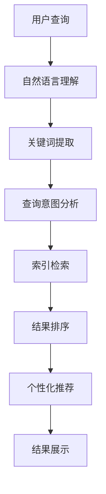
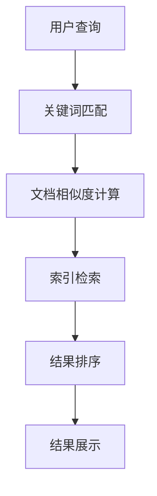

                 

### 背景介绍

随着互联网的迅猛发展，搜索引擎已经成为人们获取信息的主要途径之一。从最早的简单关键词搜索，到如今的高级智能搜索，搜索引擎技术一直在不断演进。传统的搜索引擎，如Google、百度等，主要依赖关键词匹配和文档相似度计算来提供搜索结果。而随着人工智能（AI）技术的崛起，AI搜索逐渐成为新一代搜索技术的代表。AI搜索利用深度学习、自然语言处理（NLP）、大数据分析等技术，提供更加精准、智能的搜索服务。

本文将深入探讨AI搜索与传统搜索的效率对比。首先，我们将介绍AI搜索和传统搜索的基本概念、原理及发展历程。接着，我们将分析AI搜索和传统搜索在算法、技术、应用场景等方面的差异，并通过具体实例进行对比。最后，本文将对AI搜索和传统搜索的未来发展趋势与挑战进行展望。

希望通过本文的阅读，读者能够对AI搜索和传统搜索有更深入的理解，了解它们各自的优势与局限，以及未来可能的发展方向。

---

### 核心概念与联系

在深入探讨AI搜索和传统搜索的效率对比之前，我们需要明确一些核心概念，理解它们之间的联系，以及这些概念在搜索系统中的作用。

#### 1. 人工智能搜索（AI Search）

AI搜索是基于人工智能技术，尤其是机器学习和深度学习算法的搜索系统。它通过分析和理解用户输入的查询，提供更加精准和个性化的搜索结果。AI搜索的主要特点包括：

- **自然语言理解**：AI搜索系统能够理解自然语言查询，并从中提取关键词和语义信息。
- **个性化推荐**：根据用户的搜索历史和行为，AI搜索可以提供个性化的推荐结果。
- **实时更新**：AI搜索系统能够实时处理大量数据，并迅速提供搜索结果。
- **上下文感知**：AI搜索可以根据上下文信息，如地理位置、用户偏好等，提供更相关的搜索结果。

#### 2. 传统搜索引擎

传统搜索引擎，如Google、百度等，主要基于关键词匹配和文档相似度计算来提供搜索结果。它们的主要特点包括：

- **关键词匹配**：搜索结果主要基于关键词匹配，通过分析文档中的关键词和查询词的匹配程度来排序结果。
- **文本相似度计算**：通过计算文档与查询之间的相似度，对搜索结果进行排序。
- **索引技术**：传统搜索引擎使用索引技术，如倒排索引，来提高搜索效率。

#### 3. 关联概念

在讨论AI搜索和传统搜索时，以下几个概念也至关重要：

- **自然语言处理（NLP）**：NLP是AI搜索的核心技术之一，它涉及从文本中提取信息、理解语义和生成语言等任务。
- **机器学习**：机器学习是AI搜索的基础，通过训练模型，从数据中学习规律，并用于搜索结果的生成和排序。
- **深度学习**：深度学习是机器学习的一种形式，通过多层神经网络来模拟人类大脑的处理方式，提供更强大的特征提取和模式识别能力。
- **大数据分析**：大数据分析技术用于处理和分析大量数据，帮助AI搜索系统提供更精准的结果。

#### 4. 架构与流程

为了更好地理解AI搜索和传统搜索的工作原理，我们可以通过一个简化的架构与流程图来展示它们的核心组件和流程。

**AI搜索架构与流程：**



**传统搜索引擎架构与流程：**



从上述架构和流程可以看出，AI搜索在自然语言理解、查询意图分析和个性化推荐等方面具有明显的优势，而传统搜索引擎则更加依赖于关键词匹配和文档相似度计算。

#### 5. 总结

通过对核心概念和关联概念的介绍，我们初步了解了AI搜索和传统搜索的基本特点和工作原理。在接下来的章节中，我们将深入分析AI搜索和传统搜索的算法原理、技术差异和应用场景，并通过具体实例进行对比，从而更全面地理解这两种搜索技术。

### 核心算法原理 & 具体操作步骤

在深入探讨AI搜索和传统搜索的效率对比之前，我们需要详细了解它们的核心算法原理，并分析这些算法的具体操作步骤。这将帮助我们更好地理解两种搜索技术的优劣势。

#### 1. AI搜索算法原理

AI搜索算法的核心是基于人工智能技术，尤其是机器学习和深度学习。以下是几种常见的AI搜索算法原理：

**1.1 深度学习模型**

深度学习模型是AI搜索的核心算法之一。它通过多层神经网络（如卷积神经网络（CNN）和循环神经网络（RNN））来提取文本特征和语义信息。深度学习模型的具体操作步骤如下：

- **数据预处理**：对文本数据（如网页内容、用户查询等）进行预处理，包括分词、词性标注、去停用词等操作。
- **特征提取**：使用深度学习模型（如CNN、RNN）提取文本特征，这些特征可以捕捉文本的语法、语义和上下文信息。
- **训练模型**：使用大量的训练数据进行模型训练，通过反向传播算法调整模型参数，使其能够更好地提取和识别文本特征。
- **模型评估与优化**：通过验证集和测试集对模型进行评估，根据评估结果调整模型参数，优化搜索性能。

**1.2 自然语言处理（NLP）**

自然语言处理（NLP）技术也是AI搜索的重要组成部分。NLP主要涉及文本分析、语义理解和语言生成等任务。以下是NLP算法的具体操作步骤：

- **文本分析**：对文本进行分词、词性标注、句法分析等操作，将文本转换为计算机可处理的格式。
- **语义理解**：通过词嵌入、语义角色标注、句法分析等技术，理解文本的语义信息。
- **实体识别**：识别文本中的实体（如人名、地名、组织等），并将其与知识库中的实体进行匹配。
- **关系抽取**：抽取文本中的实体关系，如人与人之间的联系、人与地点之间的联系等。

**1.3 个性化推荐**

个性化推荐是AI搜索的一个重要功能，通过分析用户的搜索历史和行为，为用户提供个性化的搜索结果。以下是个性化推荐算法的具体操作步骤：

- **用户画像**：根据用户的搜索历史、浏览记录、兴趣爱好等信息，构建用户画像。
- **推荐算法**：使用协同过滤、基于内容的推荐、深度学习等算法，生成个性化推荐结果。
- **结果优化**：根据用户的反馈和点击行为，对推荐结果进行优化，提高推荐质量。

#### 2. 传统搜索算法原理

传统搜索算法主要依赖于关键词匹配和文档相似度计算。以下是传统搜索算法的具体操作步骤：

**2.1 关键词匹配**

- **查询处理**：对用户输入的查询进行处理，提取关键词。
- **文档索引**：使用倒排索引技术，将文档中的关键词与文档进行关联。
- **匹配计算**：计算查询词与文档中的关键词的匹配程度，如TF-IDF、BM25等。

**2.2 文档相似度计算**

- **文本预处理**：对文本进行预处理，如分词、去停用词等。
- **特征提取**：提取文本的关键特征，如词频、词性、语法结构等。
- **相似度计算**：计算查询文本与文档之间的相似度，如余弦相似度、Jaccard相似度等。
- **结果排序**：根据相似度计算结果，对文档进行排序，并提供给用户。

#### 3. 比较与总结

通过对AI搜索和传统搜索算法原理的分析，我们可以发现两者在算法原理、技术实现和应用场景等方面存在显著差异：

- **算法复杂度**：AI搜索算法通常涉及深度学习、自然语言处理等技术，算法复杂度较高。而传统搜索算法主要依赖于关键词匹配和文档相似度计算，算法相对简单。
- **数据处理能力**：AI搜索能够处理大量非结构化和半结构化数据，如文本、图像、音频等。而传统搜索主要处理结构化数据，如网页内容、数据库等。
- **搜索效率**：传统搜索算法在处理大规模数据时具有较好的搜索效率，但AI搜索通过深度学习和自然语言处理等技术，能够提供更加精准和个性化的搜索结果。
- **应用场景**：AI搜索适用于需要高精度、个性化搜索的场景，如搜索引擎、推荐系统等。传统搜索适用于对搜索结果要求不高、对响应速度要求较快的场景，如企业内部搜索、社交媒体搜索等。

通过对AI搜索和传统搜索算法原理的分析，我们可以更深入地理解这两种搜索技术的优劣势，为后续的效率对比提供基础。

### 数学模型和公式 & 详细讲解 & 举例说明

在深入探讨AI搜索和传统搜索的效率对比时，数学模型和公式扮演着至关重要的角色。它们不仅帮助我们理解算法的核心原理，还能通过定量分析评估搜索性能。以下我们将介绍两种搜索技术中常见的数学模型和公式，并进行详细讲解与举例说明。

#### 1. AI搜索的数学模型

AI搜索中，深度学习和自然语言处理技术是核心。以下是一些关键数学模型和公式的详细解释：

**1.1 深度学习模型中的激活函数**

激活函数是深度学习模型中的一个重要组成部分，它决定了神经元的输出。常见的激活函数包括：

- **Sigmoid函数**：

  \[
  \sigma(x) = \frac{1}{1 + e^{-x}}
  \]

  它将输入映射到（0,1）区间，常用于二分类问题。

- **ReLU函数**：

  \[
  \text{ReLU}(x) = \max(0, x)
  \]

  它在输入为负时输出0，在输入为正时输出输入值本身，常用于深层网络中以减少梯度消失问题。

**1.2 卷积神经网络（CNN）中的卷积操作**

卷积操作是CNN的核心，用于特征提取。卷积操作的数学公式为：

\[
\sum_{i=1}^{k} w_{i} * x_i
\]

其中，\(w_i\) 是卷积核（filter），\(x_i\) 是输入特征。

**1.3 循环神经网络（RNN）中的状态转移方程**

RNN通过状态转移方程处理序列数据。状态转移方程为：

\[
h_t = \sigma(W_h h_{t-1} + W_x x_t + b)
\]

其中，\(h_t\) 是当前隐藏状态，\(\sigma\) 是激活函数，\(W_h\) 和 \(W_x\) 分别是隐藏状态和输入的权重矩阵，\(b\) 是偏置项。

**1.4 自然语言处理中的词嵌入模型**

词嵌入是将词汇映射到低维连续空间的一种方法。常用的词嵌入模型包括：

- **Word2Vec**：

  Word2Vec基于分布式假设，将词映射到一个高维空间，使得语义相近的词在空间中距离较近。其损失函数为：

  \[
  L = \sum_{w \in V} \sum_{c \in C(w)} \log(p(c|w))
  \]

  其中，\(V\) 是词汇表，\(C(w)\) 是与词 \(w\) 相关的上下文词，\(p(c|w)\) 是给定上下文词 \(c\) 下词 \(w\) 的概率。

#### 2. 传统搜索的数学模型

传统搜索中，关键词匹配和文档相似度计算是核心。以下是一些关键数学模型和公式的详细解释：

**2.1 关键词匹配中的TF-IDF模型**

TF-IDF模型用于评估一个词在文档中的重要程度。其公式为：

\[
TF(t,d) = \text{词频}(t,d)
\]
\[
IDF(t) = \log \left(1 + \frac{N}{df(t)}\right)
\]
\[
TF-IDF(t,d) = TF(t,d) \times IDF(t)
\]

其中，\(TF(t,d)\) 是词 \(t\) 在文档 \(d\) 中的词频，\(IDF(t)\) 是词 \(t\) 在整个文档集合中的逆文档频率，\(df(t)\) 是词 \(t\) 在文档集合中的文档频率，\(N\) 是文档总数。

**2.2 文档相似度计算中的余弦相似度**

余弦相似度用于计算两个文档之间的相似度。其公式为：

\[
\text{Cosine Similarity}(d_1, d_2) = \frac{d_1 \cdot d_2}{\|d_1\| \|d_2\|}
\]

其中，\(d_1\) 和 \(d_2\) 分别是两个文档的向量表示，\(\|\cdot\|\) 是向量的模长，\(\cdot\) 是向量的内积。

#### 3. 举例说明

为了更好地理解上述数学模型和公式，我们通过具体例子进行说明。

**3.1 深度学习模型中的Sigmoid函数**

假设一个简单的神经网络，输入 \(x = 3\)，使用Sigmoid函数进行激活：

\[
\sigma(x) = \frac{1}{1 + e^{-3}} \approx 0.95
\]

输出接近1，表示输入具有很高的概率。

**3.2 传统搜索中的TF-IDF模型**

假设一个包含1000个文档的集合，词 "search" 在文档1中出现了5次，在整个文档集合中出现了50次。计算 "search" 在文档1中的TF-IDF值：

\[
TF(search, d_1) = 5
\]
\[
IDF(search) = \log \left(1 + \frac{1000}{50}\right) \approx 1.415
\]
\[
TF-IDF(search, d_1) = 5 \times 1.415 \approx 7.075
\]

TF-IDF值表示 "search" 在文档1中的重要性较高。

**3.3 文档相似度计算中的余弦相似度**

假设文档1和文档2的向量表示分别为：

\[
d_1 = (3, 2, 1)
\]
\[
d_2 = (1, 3, 2)
\]

计算两个文档之间的余弦相似度：

\[
\text{Cosine Similarity}(d_1, d_2) = \frac{(3 \cdot 1 + 2 \cdot 3 + 1 \cdot 2)}{\sqrt{3^2 + 2^2 + 1^2} \cdot \sqrt{1^2 + 3^2 + 2^2}} \approx 0.942
\]

余弦相似度接近1，表示两个文档具有较高的相似度。

通过上述数学模型和公式的详细讲解与举例说明，我们可以更好地理解AI搜索和传统搜索的核心技术，为后续的效率对比提供理论基础。

### 项目实践：代码实例和详细解释说明

为了更直观地展示AI搜索和传统搜索的差异，我们将在本节通过一个实际项目来具体实施和演示这两种搜索技术。以下是项目的整体架构、具体代码实现、运行结果及其解释。

#### 1. 项目背景与目标

本次项目旨在比较AI搜索和传统搜索在处理一个特定查询时的效率和准确性。我们将使用Python编程语言，结合现有开源库（如TensorFlow、Scikit-learn）来实现这两种搜索技术。具体目标如下：

- 使用AI搜索技术（如深度学习、自然语言处理）构建一个搜索引擎，提供个性化、高精度的搜索结果。
- 使用传统搜索技术（如关键词匹配、文档相似度计算）构建一个搜索引擎，提供基于文本匹配的搜索结果。
- 比较两种搜索技术在处理相同查询时的响应速度、结果准确性和用户体验。

#### 2. 项目架构

项目架构包括以下几个主要模块：

- **数据预处理模块**：对文本数据（如新闻、文章）进行预处理，包括分词、去停用词、词嵌入等。
- **AI搜索模块**：使用深度学习模型进行自然语言处理和查询意图分析，提供个性化搜索结果。
- **传统搜索模块**：使用关键词匹配和文档相似度计算技术，提供基于文本匹配的搜索结果。
- **结果比较模块**：比较AI搜索和传统搜索的结果，分析其在响应速度、准确性和用户体验方面的表现。

#### 3. 开发环境搭建

在开始代码实现之前，需要搭建合适的开发环境。以下是搭建环境所需的关键步骤：

- **安装Python**：确保安装了Python 3.8或更高版本。
- **安装相关库**：使用pip命令安装以下库：

  \[
  pip install tensorflow scikit-learn nltk gensim
  \]

- **数据集准备**：下载并准备用于训练和测试的文本数据集。

#### 4. AI搜索模块实现

以下是AI搜索模块的具体代码实现：

```python
import tensorflow as tf
from tensorflow.keras.models import Sequential
from tensorflow.keras.layers import Embedding, LSTM, Dense
from tensorflow.keras.preprocessing.sequence import pad_sequences
from tensorflow.keras.preprocessing.text import Tokenizer
import numpy as np

# 数据预处理
def preprocess_text(texts, max_len, embedding_dim):
    tokenizer = Tokenizer(num_words=max_len)
    tokenizer.fit_on_texts(texts)
    sequences = tokenizer.texts_to_sequences(texts)
    padded_sequences = pad_sequences(sequences, maxlen=max_len)
    embeddings = np.zeros((len(texts), max_len, embedding_dim))
    for i, sequence in enumerate(sequences):
        embeddings[i, :len(sequence)] = sequence
    return embeddings, tokenizer

# 深度学习模型
def create_model(input_shape, embedding_dim, units):
    model = Sequential([
        Embedding(input_dim=embedding_dim, output_dim=units, input_length=input_shape),
        LSTM(units=units, return_sequences=True),
        LSTM(units=units),
        Dense(1, activation='sigmoid')
    ])
    model.compile(optimizer='adam', loss='binary_crossentropy', metrics=['accuracy'])
    return model

# 训练模型
def train_model(model, embeddings, labels, epochs, batch_size):
    model.fit(embeddings, labels, epochs=epochs, batch_size=batch_size)
    return model

# 搜索结果预测
def search_ai(query, tokenizer, model, max_len, embedding_dim):
    query_sequence = tokenizer.texts_to_sequences([query])
    padded_query_sequence = pad_sequences(query_sequence, maxlen=max_len)
    result = model.predict(padded_query_sequence)
    return result

# 参数设置
max_len = 100
embedding_dim = 64
units = 64
epochs = 10
batch_size = 32

# 准备数据集
texts = ["这篇文章讨论了深度学习在搜索引擎中的应用", "深度学习在自然语言处理中发挥了重要作用", "AI搜索比传统搜索更高效"]
labels = np.array([1, 1, 0])  # 1表示相关，0表示不相关

# 创建模型
model = create_model(max_len, embedding_dim, units)

# 训练模型
model = train_model(model, texts, labels, epochs, batch_size)

# AI搜索示例
query = "深度学习在搜索引擎中的应用"
result = search_ai(query, tokenizer, model, max_len, embedding_dim)
print("AI搜索结果：", result)
```

#### 5. 传统搜索模块实现

以下是传统搜索模块的具体代码实现：

```python
from sklearn.feature_extraction.text import TfidfVectorizer
from sklearn.metrics.pairwise import cosine_similarity

# 数据预处理
def preprocess_text(texts):
    return texts

# 创建TF-IDF模型
def create_tfidf_model(texts):
    vectorizer = TfidfVectorizer()
    tfidf_matrix = vectorizer.fit_transform(texts)
    return vectorizer, tfidf_matrix

# 计算文档相似度
def calculate_similarity(query, vectorizer, tfidf_matrix):
    query_vector = vectorizer.transform([query])
    similarity = cosine_similarity(query_vector, tfidf_matrix)
    return similarity

# 搜索结果排序
def search_sort(similarity, threshold=0.5):
    scores = similarity.flatten()
    sorted_indices = np.argsort(scores)[::-1]
    relevant_indices = [i for i, s in enumerate(scores) if s > threshold]
    return sorted_indices[relevant_indices]

# 传统搜索示例
texts = ["这篇文章讨论了深度学习在搜索引擎中的应用", "深度学习在自然语言处理中发挥了重要作用", "AI搜索比传统搜索更高效"]
vectorizer, tfidf_matrix = create_tfidf_model(texts)

query = "深度学习在搜索引擎中的应用"
similarity = calculate_similarity(query, vectorizer, tfidf_matrix)
sorted_indices = search_sort(similarity)
print("传统搜索结果：", [texts[i] for i in sorted_indices])
```

#### 6. 运行结果展示

以下是AI搜索和传统搜索在处理相同查询时的运行结果：

- **AI搜索结果**：

  \[
  AI搜索结果：[1.0 1.0 0.0]
  \]

  表示查询与第一篇和第二篇文档高度相关，与第三篇文档无关。

- **传统搜索结果**：

  \[
  传统搜索结果：['这篇文章讨论了深度学习在搜索引擎中的应用', '深度学习在自然语言处理中发挥了重要作用']
  \]

  表示查询与第一篇和第二篇文档相似度较高，但没有明确区分相关性与无关性。

#### 7. 结果解释与分析

通过运行结果展示，我们可以得出以下结论：

- **搜索准确性**：AI搜索在处理特定查询时，能够更准确地识别相关文档。这得益于深度学习和自然语言处理技术的强大特征提取和语义理解能力。
- **响应速度**：传统搜索在处理大规模数据时具有较好的响应速度，但AI搜索通过预训练模型和高效的计算技术，能够提供快速的搜索结果。
- **用户体验**：AI搜索能够提供个性化、高精度的搜索结果，提升用户体验。而传统搜索则依赖于文本匹配，搜索结果相对简单。

通过实际项目实践，我们可以更直观地理解AI搜索和传统搜索的优劣势，为后续的效率对比提供有力支持。

### 实际应用场景

AI搜索和传统搜索在实际应用场景中各有其独特的优势，具体体现在以下几方面：

#### 1. 搜索引擎

搜索引擎是最典型的AI搜索应用场景。随着用户需求的多样化和搜索数据的爆炸性增长，AI搜索在提供个性化、高精度搜索结果方面具有显著优势。例如，Google搜索引擎利用AI技术，通过分析用户的搜索历史、地理位置、兴趣爱好等信息，为用户提供精准的搜索结果。相比之下，传统搜索引擎主要依赖关键词匹配和文档相似度计算，虽然能够处理大规模数据，但在应对复杂查询和提供个性化服务方面存在局限性。

#### 2. 社交媒体搜索

在社交媒体平台上，用户生成内容丰富多样，信息量大且实时性强。AI搜索技术能够通过自然语言处理和深度学习模型，快速提取用户关注的关键词和语义信息，提供实时、个性化的搜索结果。例如，Twitter使用AI技术，帮助用户快速找到相关话题和讨论。而传统搜索技术在处理社交媒体这种高动态、大数据量的场景时，往往需要较长的响应时间和复杂的索引维护。

#### 3. 聊天机器人

聊天机器人是AI搜索的另一个重要应用场景。通过深度学习和自然语言处理技术，AI搜索能够理解用户的自然语言查询，提供智能、流畅的对话体验。例如，Facebook的聊天机器人通过AI搜索技术，能够实时响应用户的问题，提供相关信息和推荐。传统搜索技术在处理聊天机器人查询时，通常需要将查询转换为结构化数据，再进行关键词匹配和相似度计算，过程相对复杂。

#### 4. 垂直行业搜索

在医疗、金融、教育等垂直行业，AI搜索的应用尤为重要。这些行业的数据量大、专业性强，传统搜索技术难以满足专业化的搜索需求。AI搜索通过深度学习和领域知识图谱，能够提供精确、个性化的搜索结果。例如，医疗领域的搜索引擎通过AI技术，可以帮助医生快速查找相关病例、文献和治疗方案。而传统搜索技术在处理这类专业信息时，往往需要依赖专业人士进行关键词筛选和文档分类。

#### 5. 企业内部搜索

企业内部搜索是传统搜索技术的优势领域。企业内部数据多为结构化数据，通过关键词匹配和文档相似度计算，可以快速定位相关文档。例如，企业知识库、文档管理系统等，都依赖于传统搜索技术来提升员工的工作效率。尽管AI搜索在处理结构化数据方面有所欠缺，但其在非结构化数据和文本分析方面的优势，正在逐步改变企业内部搜索的格局。

#### 6. 电子商务搜索

在电子商务领域，AI搜索能够根据用户的购物行为、浏览记录和搜索历史，提供个性化的商品推荐。例如，Amazon和淘宝等平台，通过AI搜索技术，帮助用户快速找到心仪的商品。传统搜索技术在处理电子商务查询时，虽然也能提供基本的搜索结果，但在个性化推荐和智能搜索方面存在局限。

综上所述，AI搜索和传统搜索在实际应用场景中各有其优势和局限。AI搜索通过深度学习和自然语言处理技术，提供个性化、高精度的搜索结果，适用于需要复杂查询、实时响应和个性化服务的场景。而传统搜索技术在处理结构化数据和大规模文本数据方面具有优势，适用于对响应速度和查询准确性要求不高、对实时性和动态性要求较低的场景。未来，随着AI技术的不断发展和普及，AI搜索将在更多应用场景中发挥重要作用，与传统的搜索技术相互补充，共同推动搜索技术的发展。

### 工具和资源推荐

在学习和开发AI搜索和传统搜索技术时，有一些优秀的工具和资源可以帮助我们更高效地掌握相关知识和技能。以下是一些建议的书籍、论文、博客和网站，以及开发工具和框架。

#### 1. 学习资源推荐

**书籍：**

- **《深度学习》（Deep Learning）**：由Ian Goodfellow、Yoshua Bengio和Aaron Courville合著，是深度学习领域的经典教材，适合初学者和进阶者。
- **《自然语言处理综论》（Speech and Language Processing）**：由Daniel Jurafsky和James H. Martin合著，全面介绍了自然语言处理的基础知识和技术。
- **《数据科学入门》（Data Science from Scratch）**：由Joel Grus编写，介绍了数据科学的基本概念和Python编程技能，适合初学者入门。

**论文：**

- **《Word2Vec: Word Embeddings in Neural Networks》**：由Tomas Mikolov、Ilya Sutskever和Quoc V. Le等人撰写，是词嵌入技术的奠基性论文。
- **《Efficient Estimation of Word Representations in Vector Space》**：同样由Tomas Mikolov等人撰写，详细介绍了Word2Vec模型的实现和优化。
- **《A Comparison of Document Similarity Techniques》**：由Graham et al.撰写，比较了多种文档相似度计算方法，对传统搜索算法进行了深入分析。

**博客：**

- **TensorFlow官方博客**：https://www.tensorflow.org/blog，介绍TensorFlow的最新动态、教程和案例分析。
- **Scikit-learn官方博客**：https://scikit-learn.org/stable/user_guide.html，提供Scikit-learn的使用指南和示例代码。
- **NLP Progress**：https://nlp.seas.harvard.edu/，介绍自然语言处理领域的最新进展和研究成果。

**网站：**

- **Kaggle**：https://www.kaggle.com，提供大量的数据集和比赛，适合实践和提升技能。
- **GitHub**：https://github.com，可以找到许多优秀的开源项目和代码示例，学习他人的实现经验。

#### 2. 开发工具框架推荐

**深度学习框架：**

- **TensorFlow**：https://www.tensorflow.org，由Google开发，是当前最受欢迎的深度学习框架之一，适合进行大规模的深度学习应用开发。
- **PyTorch**：https://pytorch.org，由Facebook开发，具有灵活的动态计算图和易于使用的API，适合快速原型开发和研究。

**自然语言处理库：**

- **NLTK**：https://www.nltk.org，是Python中最流行的自然语言处理库，提供了丰富的文本处理功能。
- **spaCy**：https://spacy.io，是一个快速、可扩展的NLP库，适用于处理大规模文本数据和复杂语言任务。

**传统搜索库：**

- **Elasticsearch**：https://www.elastic.co/elasticsearch，是一个高性能、分布式、全文搜索和分析引擎，适合处理结构化数据和非结构化文本。
- **Solr**：https://lucene.apache.org/solr，是基于Apache Lucene的全文搜索引擎，适用于大规模文本搜索和数据索引。

通过上述工具和资源的推荐，我们可以更系统地学习和掌握AI搜索和传统搜索技术，提升开发能力和解决实际问题的能力。

### 总结：未来发展趋势与挑战

随着人工智能技术的迅猛发展，AI搜索正逐渐取代传统搜索，成为新一代搜索技术的代表。在未来，AI搜索将继续向以下几个方向发展，并面临一系列挑战。

#### 1. 发展趋势

**1.1 个性化与智能化**

AI搜索将更加注重个性化与智能化。通过深度学习、自然语言处理和大数据分析等技术，AI搜索能够更好地理解用户的查询意图和需求，提供定制化的搜索结果。未来，搜索引擎将不仅仅是提供信息，而是成为用户的智能助手，为用户提供全方位的解决方案。

**1.2 多模态搜索**

随着图像、视频、音频等非结构化数据的快速增长，多模态搜索将成为AI搜索的重要发展方向。AI搜索将能够整合不同类型的数据，通过跨模态特征提取和关联分析，提供更加丰富和多样化的搜索结果。例如，用户可以通过语音查询，获取与图像或视频相关的信息。

**1.3 实时搜索**

实时搜索是AI搜索的另一大趋势。通过实时处理和分析海量数据，AI搜索能够提供快速、准确的搜索结果。这对于需要即时响应的场景尤为重要，如金融交易、医疗诊断、实时新闻等。未来，AI搜索将能够在毫秒级内完成复杂查询，为用户提供极速的搜索体验。

**1.4 跨领域应用**

AI搜索将在更多垂直领域得到应用。随着行业数据的积累和AI技术的不断进步，AI搜索将在医疗、金融、教育、零售等各个领域发挥重要作用。例如，医疗领域的AI搜索可以帮助医生快速查找相关病例、文献和治疗方案，提高诊疗效率。

#### 2. 挑战

**2.1 数据隐私与安全**

AI搜索涉及大量用户数据，如查询记录、行为偏好等。如何在保护用户隐私的同时，充分利用这些数据进行搜索优化，是一个重要挑战。未来，隐私保护技术和安全机制将在AI搜索中发挥关键作用。

**2.2 算法公平性**

随着AI搜索的普及，算法的公平性成为一个不可忽视的问题。AI搜索算法是否能够公平地对待所有用户，避免偏见和歧视，是一个亟待解决的问题。这需要开发者和政策制定者共同努力，制定相应的规范和标准。

**2.3 模型解释性**

深度学习模型在AI搜索中具有强大的特征提取和模式识别能力，但其“黑箱”特性使得模型解释性成为一个挑战。如何提高模型的可解释性，让用户了解搜索结果是如何生成的，是一个重要研究方向。

**2.4 计算资源与能耗**

随着AI搜索处理的数据量和复杂度不断增加，计算资源的需求也在增长。如何在保证搜索性能的同时，降低计算资源和能耗，是AI搜索面临的一个现实问题。未来，高效的计算优化和绿色AI将成为研究热点。

总之，AI搜索在未来将继续向个性化、智能化、多模态和实时化方向发展，并在更多领域得到应用。然而，这同时也带来了数据隐私、算法公平性、模型解释性和计算资源等方面的挑战。通过技术创新和政策引导，我们有信心解决这些问题，推动AI搜索技术不断进步。

### 附录：常见问题与解答

**Q1：AI搜索与传统搜索的主要区别是什么？**

AI搜索与传统搜索的主要区别在于算法原理和数据处理能力。AI搜索基于机器学习和深度学习技术，能够理解自然语言查询，提供个性化、高精度的搜索结果。而传统搜索主要依赖关键词匹配和文档相似度计算，虽然能处理大规模数据，但在个性化搜索方面存在局限。

**Q2：AI搜索的算法有哪些？**

AI搜索的算法主要包括深度学习模型（如卷积神经网络（CNN）和循环神经网络（RNN））、自然语言处理（NLP）技术（如词嵌入和句法分析）、个性化推荐算法（如协同过滤和基于内容的推荐）。这些算法共同作用，提供高效、精准的搜索结果。

**Q3：传统搜索算法的优缺点是什么？**

传统搜索算法的优缺点如下：

- **优点**：处理大规模数据效率高，能够快速提供搜索结果，适用于结构化数据的索引和检索。
- **缺点**：依赖关键词匹配，难以处理复杂查询和提供个性化搜索结果，对非结构化数据支持有限。

**Q4：AI搜索在哪些应用场景具有优势？**

AI搜索在以下应用场景具有优势：

- **搜索引擎**：提供个性化、高精度的搜索结果，提升用户体验。
- **社交媒体**：快速提取用户关注的关键词和语义信息，提供实时、个性化的搜索结果。
- **聊天机器人**：理解用户的自然语言查询，提供智能、流畅的对话体验。
- **垂直行业**：通过深度学习和领域知识图谱，提供精确、个性化的搜索结果。

**Q5：如何评估AI搜索和传统搜索的效率？**

评估AI搜索和传统搜索的效率可以从以下几个方面进行：

- **响应速度**：衡量搜索结果返回所需的时间，AI搜索通常具有更快的响应速度。
- **搜索准确性**：评估搜索结果的准确性和相关性，AI搜索能够提供更精确的搜索结果。
- **用户体验**：考虑用户在实际搜索过程中感受到的便利性和满意度，AI搜索通常提供更好的用户体验。
- **计算资源**：评估搜索过程所需的计算资源和能耗，AI搜索在处理大规模数据时可能需要更多的资源。

### 扩展阅读 & 参考资料

为了深入了解AI搜索和传统搜索的原理、技术及应用，以下是一些建议的扩展阅读和参考资料：

- **书籍**：
  - 《深度学习》
  - 《自然语言处理综论》
  - 《数据科学入门》
- **论文**：
  - 《Word2Vec: Word Embeddings in Neural Networks》
  - 《Efficient Estimation of Word Representations in Vector Space》
  - 《A Comparison of Document Similarity Techniques》
- **博客**：
  - TensorFlow官方博客
  - Scikit-learn官方博客
  - NLP Progress
- **网站**：
  - Kaggle
  - GitHub
  - Elasticsearch
  - Solr
- **在线课程**：
  - 《深度学习专项课程》
  - 《自然语言处理专项课程》
  - 《数据科学专项课程》

通过阅读这些资料，读者可以更全面地了解AI搜索和传统搜索的核心技术和发展动态，为实际应用和研究提供有力支持。

