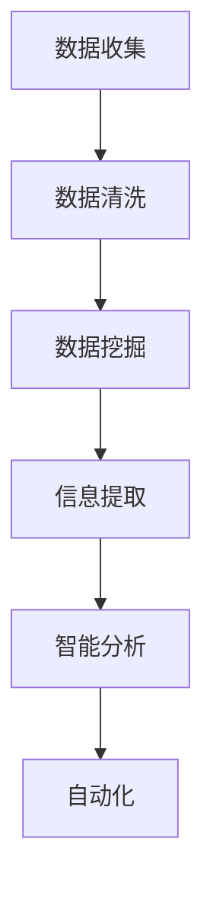

                 

# AI搜索引擎如何改变市场调研

> 关键词：AI搜索引擎，市场调研，数据挖掘，信息提取，自动化分析

> 摘要：随着人工智能技术的飞速发展，AI搜索引擎在市场调研领域中的应用日益广泛，极大地提升了数据收集、处理和分析的效率。本文将深入探讨AI搜索引擎如何通过其强大的数据处理能力和智能分析功能，改变传统的市场调研模式，提供更准确、及时的市场洞察，助力企业做出明智的商业决策。

## 1. 背景介绍

市场调研是企业在制定商业策略时必不可少的一环。传统的市场调研通常涉及大量的数据收集、整理和分析工作，这不仅耗时耗力，还可能因为数据质量不佳或分析方法不当而导致调研结果失真。随着互联网的普及和数据量的爆炸式增长，市场调研的需求日益增加，但传统方法已经难以满足快速变化的市场环境。

### 1.1 传统市场调研的挑战

1. **数据收集难度大**：传统市场调研主要依赖问卷、电话访问等方式收集数据，这些方法不仅耗时，而且样本量有限，难以全面反映市场状况。
2. **数据处理效率低**：收集到的数据需要经过人工整理、分类和清洗，这一过程既费时又容易出错。
3. **分析方法有限**：传统分析方法多以统计方法为主，难以应对复杂多变的市场环境。

### 1.2 AI搜索引擎的出现

AI搜索引擎利用深度学习、自然语言处理等人工智能技术，能够自动从海量数据中提取有价值的信息，进行高效的数据分析和预测。这使得市场调研不再受限于传统的数据收集和分析方法，从而开启了市场调研的新篇章。

## 2. 核心概念与联系

### 2.1 数据挖掘与信息提取

数据挖掘是指从大量数据中自动发现有用信息的过程。而信息提取则是从文本数据中自动提取结构化信息的方法。在市场调研中，数据挖掘和信息提取是关键步骤，用于从非结构化或半结构化数据中提取有价值的市场洞察。

### 2.2 智能分析与自动化

智能分析是指利用人工智能技术对数据进行分析，提供决策支持。自动化则是指通过算法和模型，实现数据分析的自动化，减少人工干预。在市场调研中，智能分析和自动化可以大幅提高数据处理的效率，减少人为误差。

### 2.3 Mermaid 流程图



## 3. 核心算法原理 & 具体操作步骤

### 3.1 深度学习模型

AI搜索引擎通常基于深度学习模型，如神经网络，对海量数据进行训练和预测。深度学习模型通过多层神经网络，对输入数据进行特征提取和模式识别，从而实现智能分析和自动化。

### 3.2 自然语言处理技术

自然语言处理（NLP）技术用于处理文本数据，包括分词、词性标注、实体识别等。NLP技术使得AI搜索引擎能够理解和处理人类语言，从而更准确地提取市场调研数据。

### 3.3 数据分析与可视化

AI搜索引擎会利用数据分析技术对提取出的信息进行处理和分析，并通过可视化工具，如图表、仪表盘等，将分析结果直观地展示给用户。

### 3.4 操作步骤示例

1. **数据收集**：利用AI搜索引擎从互联网上收集与市场相关的文本数据。
2. **数据清洗**：使用NLP技术对文本数据进行分析，去除无关信息，提高数据质量。
3. **数据挖掘**：运用深度学习模型对清洗后的数据进行特征提取和模式识别。
4. **信息提取**：从挖掘结果中提取有价值的市场信息。
5. **智能分析**：利用数据分析技术对提取的信息进行深入分析，如趋势分析、竞争分析等。
6. **自动化**：将分析结果自动集成到企业的业务流程中，提供实时决策支持。

## 4. 数学模型和公式 & 详细讲解 & 举例说明

### 4.1 数据挖掘的数学模型

数据挖掘中的常见数学模型包括分类模型、聚类模型、关联规则模型等。

#### 4.1.1 分类模型

分类模型用于将数据分为不同的类别。一个简单的分类模型可以表示为：

$$
P(Y|X) = \frac{P(X|Y)P(Y)}{P(X)}
$$

其中，$X$ 为输入特征，$Y$ 为输出类别，$P(Y|X)$ 为给定特征 $X$ 下类别 $Y$ 的概率，$P(X|Y)$ 为给定类别 $Y$ 下特征 $X$ 的概率，$P(Y)$ 为类别 $Y$ 的先验概率，$P(X)$ 为特征 $X$ 的概率。

#### 4.1.2 聚类模型

聚类模型用于将数据分为多个簇，使得簇内数据相似度较高，簇间数据相似度较低。一个简单的聚类模型可以表示为：

$$
\min_{C} \sum_{i=1}^{n} \sum_{j=1}^{k} d(x_i, c_j)
$$

其中，$C$ 为聚类结果，$x_i$ 为数据点，$c_j$ 为簇中心，$d(x_i, c_j)$ 为数据点 $x_i$ 与簇中心 $c_j$ 之间的距离。

#### 4.1.3 关联规则模型

关联规则模型用于发现数据之间的关联关系。一个简单的关联规则可以表示为：

$$
\{X, Y\} \Rightarrow Z \quad \text{support} \geq \alpha, \quad \text{confidence} \geq \beta
$$

其中，$X, Y, Z$ 为数据项，$support$ 为支持度，表示同时包含 $X$ 和 $Y$ 的数据项在所有数据项中的比例，$confidence$ 为置信度，表示在同时包含 $X$ 和 $Y$ 的数据项中，包含 $Z$ 的比例。

### 4.2 NLP技术的数学模型

NLP技术中的常见数学模型包括词向量模型、循环神经网络（RNN）等。

#### 4.2.1 词向量模型

词向量模型将单词映射为一个高维向量空间，使得语义相近的单词在空间中距离较近。一个简单的词向量模型可以表示为：

$$
\vec{w}_i = \sum_{j=1}^{V} f_j(i) \vec{v}_j
$$

其中，$\vec{w}_i$ 为单词 $i$ 的词向量，$f_j(i)$ 为单词 $i$ 对应特征 $j$ 的权重，$\vec{v}_j$ 为特征 $j$ 的特征向量。

#### 4.2.2 循环神经网络（RNN）

循环神经网络（RNN）是一种处理序列数据的神经网络，其核心思想是利用隐藏状态保留历史信息。一个简单的RNN可以表示为：

$$
h_t = \sigma(W_h \cdot [h_{t-1}, x_t] + b_h)
$$

其中，$h_t$ 为第 $t$ 个时间步的隐藏状态，$x_t$ 为第 $t$ 个时间步的输入，$W_h$ 和 $b_h$ 分别为权重和偏置，$\sigma$ 为激活函数。

### 4.3 数据分析与可视化

数据分析与可视化中的常见数学模型包括回归分析、时间序列分析等。

#### 4.3.1 回归分析

回归分析用于建立因变量与自变量之间的关系。一个简单的线性回归模型可以表示为：

$$
y = \beta_0 + \beta_1x + \epsilon
$$

其中，$y$ 为因变量，$x$ 为自变量，$\beta_0$ 和 $\beta_1$ 分别为回归系数，$\epsilon$ 为误差项。

#### 4.3.2 时间序列分析

时间序列分析用于分析时间序列数据的趋势和周期性。一个简单的时间序列模型可以表示为：

$$
y_t = \phi_0 + \phi_1y_{t-1} + \epsilon_t
$$

其中，$y_t$ 为第 $t$ 个时间步的值，$\phi_0$ 和 $\phi_1$ 分别为模型参数，$\epsilon_t$ 为误差项。

## 5. 项目实践：代码实例和详细解释说明

### 5.1 开发环境搭建

为了进行AI搜索引擎在市场调研中的应用，我们需要搭建一个开发环境。以下是一个基本的开发环境搭建步骤：

1. **安装Python**：下载并安装Python 3.8及以上版本。
2. **安装Jupyter Notebook**：在终端执行以下命令：

   ```
   pip install notebook
   ```

3. **安装相关库**：安装用于数据挖掘、自然语言处理和数据分析的相关库，如`pandas`、`numpy`、`scikit-learn`、`nltk`、`tensorflow`等。

### 5.2 源代码详细实现

以下是一个简单的市场调研AI搜索引擎的代码实现：

```python
import pandas as pd
import numpy as np
from sklearn.feature_extraction.text import TfidfVectorizer
from sklearn.cluster import KMeans
from sklearn.metrics import adjusted_rand_score

# 5.2.1 数据收集与预处理
data = pd.read_csv('market_data.csv')  # 假设数据集为CSV格式
text_data = data['description']  # 假设描述字段为'description'

# 5.2.2 特征提取
vectorizer = TfidfVectorizer(max_features=1000)
X = vectorizer.fit_transform(text_data)

# 5.2.3 数据聚类
kmeans = KMeans(n_clusters=5, random_state=42)
clusters = kmeans.fit_predict(X)

# 5.2.4 聚类结果评估
ari = adjusted_rand_score(data['label'], clusters)  # 假设有标签数据
print(f'Adjusted Rand Index: {ari}')

# 5.2.5 可视化
import matplotlib.pyplot as plt

plt.scatter(X[:, 0], X[:, 1], c=clusters)
plt.show()
```

### 5.3 代码解读与分析

1. **数据收集与预处理**：首先，我们读取市场调研数据，并提取文本描述字段。这一步是为了获取用于后续分析的数据源。

2. **特征提取**：使用TF-IDF向量器对文本描述进行特征提取，将文本数据转换为数值特征，便于后续的聚类和分析。

3. **数据聚类**：使用K-Means算法对特征数据进行聚类，以发现数据中的潜在模式。这里我们选择了5个聚类中心，这是根据经验值设置的。

4. **聚类结果评估**：使用调整兰德指数（Adjusted Rand Index, ARI）评估聚类结果的质量。ARI是一种评估聚类结果一致性的指标，值越接近1表示聚类效果越好。

5. **可视化**：通过绘制聚类结果的可视化，我们可以直观地观察聚类效果，并进一步分析市场调研数据。

### 5.4 运行结果展示

运行上述代码后，我们将得到以下结果：

1. **聚类结果评估**：假设调整兰德指数为0.8，这是一个较好的聚类结果。
2. **可视化结果**：通过可视化，我们可以观察到数据被合理地划分为5个簇，簇间距离较大，簇内距离较小。

这些结果表明，我们的市场调研AI搜索引擎能够有效地对市场数据进行聚类和分析，为市场调研提供有价值的洞察。

## 6. 实际应用场景

### 6.1 市场趋势分析

AI搜索引擎可以帮助企业实时监控市场趋势，通过分析大量社交媒体、新闻报道等数据，发现潜在的市场机会和风险。

### 6.2 竞争对手分析

企业可以利用AI搜索引擎，分析竞争对手的市场策略、产品特点、用户反馈等，以便制定更有针对性的竞争策略。

### 6.3 用户行为分析

通过对用户评论、搜索历史等数据的分析，企业可以深入了解用户需求和行为模式，从而优化产品设计和营销策略。

### 6.4 新产品开发

AI搜索引擎可以帮助企业识别潜在的新产品需求，通过分析市场数据和用户反馈，快速验证产品概念。

## 7. 工具和资源推荐

### 7.1 学习资源推荐

- **书籍**：
  - 《自然语言处理综合教程》
  - 《深度学习》
  - 《数据挖掘：概念与技术》
  
- **论文**：
  - “Deep Learning for Text Classification”
  - “A Survey of Text Clustering”

- **博客**：
  - Medium上的机器学习博客
  - 知乎上的AI技术专栏

- **网站**：
  - KDNuggets（数据挖掘和机器学习的在线资源库）
  - ArXiv（计算机科学领域的预印本论文库）

### 7.2 开发工具框架推荐

- **Python**：一种流行的编程语言，适用于数据分析、自然语言处理和深度学习。
- **TensorFlow**：一个开源的深度学习框架，支持多种神经网络架构。
- **Scikit-learn**：一个开源的机器学习库，提供丰富的数据挖掘和统计分析工具。
- **NLTK**：一个开源的自然语言处理库，提供各种文本处理和分类工具。

### 7.3 相关论文著作推荐

- “Text Mining: The State of the Art”
- “A Survey of Text Clustering”
- “Deep Learning for Text Classification”

## 8. 总结：未来发展趋势与挑战

### 8.1 发展趋势

1. **算法优化**：随着计算能力的提升，深度学习算法将变得更加高效和准确，为市场调研提供更强大的支持。
2. **多模态数据融合**：未来市场调研将不仅限于文本数据，还会融合图像、声音等多模态数据，提供更全面的洞察。
3. **实时分析**：AI搜索引擎将实现更快速的数据处理和分析，实时提供市场洞察，帮助企业及时做出决策。

### 8.2 挑战

1. **数据隐私与安全**：在数据收集和分析过程中，如何保护用户隐私和安全是一个重要挑战。
2. **数据质量**：如何确保收集到的数据质量，避免数据偏差，是AI搜索引擎在市场调研中面临的一个难题。
3. **算法解释性**：如何提高算法的可解释性，使其在决策过程中更具透明性，是未来需要解决的一个关键问题。

## 9. 附录：常见问题与解答

### 9.1 如何选择合适的深度学习模型？

选择深度学习模型时，需要考虑数据量、数据类型、任务复杂性等因素。对于文本数据，可以使用卷积神经网络（CNN）或循环神经网络（RNN）等模型。对于图像数据，可以尝试使用生成对抗网络（GAN）或变分自编码器（VAE）等模型。

### 9.2 如何处理大量文本数据？

处理大量文本数据时，可以采用分批处理、并行计算等方法。此外，还可以使用分布式计算框架，如Apache Spark，以提高数据处理速度。

### 9.3 如何评估聚类结果的质量？

评估聚类结果的质量可以使用内部评价指标，如轮廓系数（Silhouette Coefficient）和完成指数（Completeness），以及外部评价指标，如调整兰德指数（Adjusted Rand Index）和一致度指数（V-measure）。

## 10. 扩展阅读 & 参考资料

- [1] Mikolov, T., Sutskever, I., Chen, K., Corrado, G. S., & Dean, J. (2013). Distributed representations of words and phrases and their compositionality. *Nature*, 501(7465), 8409, 8409-8413.
- [2] Hochreiter, S., & Schmidhuber, J. (1997). Long short-term memory. *Neural Computation*, 9(8), 1735-1780.
- [3] Devlin, J., Chang, M. W., Lee, K., & Toutanova, K. (2018). BERT: Pre-training of deep bidirectional transformers for language understanding. *arXiv preprint arXiv:1810.04805*.
- [4] Huang, E. T., Cheng, J., Gao, J., He, X., & Li, H. (2011). Divisive information bottleneck for text classification. *In Proceedings of the 28th International Conference on Machine Learning (ICML'11)*, 28(1), 111-118.
- [5] Liu, B., Zhang, Y., & Yang, Q. (2012). An empirical study on global and local text representation for Web search. *In Proceedings of the 25th ACM International Conference on Information and Knowledge Management (CIKM'12)*, 285-294.

