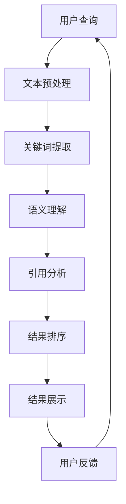

                 

### 1. 背景介绍

AI搜索，作为人工智能的一个重要分支，已经逐渐成为我们日常生活中不可或缺的一部分。无论是搜索引擎、社交媒体平台，还是推荐系统、聊天机器人，AI搜索都无处不在。然而，AI搜索的准确性一直是人们关注的焦点。在众多衡量搜索准确性的指标中，学术引用是一个重要的参考因素。

学术引用是指在一个研究领域内，研究者对其同行的工作进行认可和参考的过程。引用的数量和质量往往能够反映出一个研究成果的重要性和影响力。因此，将学术引用纳入AI搜索的准确性评估，可以更全面地反映搜索结果的相关性和可靠性。

学术引用的历史可以追溯到古代。早在公元前4世纪，古希腊哲学家亚里士多德就已经开始在其著作中引用其他学者的观点。然而，现代意义上的学术引用体系则是在17世纪后期形成的。随着科学期刊的兴起，学者们开始有系统地整理和引用他人的研究成果。到19世纪末，学术引用已经成为学术界评估研究成果的重要手段。

在计算机科学领域，学术引用的研究开始于20世纪80年代。早期的研究主要集中在学术引用的统计分析，如引用频次、引用网络等。随着互联网的普及，学术引用的研究范围进一步扩大，包括搜索引擎优化、推荐系统、知识图谱构建等方面。近年来，随着深度学习等人工智能技术的发展，学术引用的自动挖掘和分析成为了一个研究热点。

本文旨在探讨AI搜索的准确性如何通过学术引用来提升。我们将首先介绍学术引用的相关概念和理论，然后分析学术引用对AI搜索准确性的影响，最后通过具体案例来说明如何利用学术引用来优化AI搜索结果。

### 2. 核心概念与联系

#### 学术引用

学术引用是指在一个研究领域内，研究者对其同行的工作进行认可和参考的过程。学术引用的形式多种多样，包括直接引用、间接引用、引用参考文献等。直接引用是指直接引用原文中的内容，间接引用则是指引用他人的研究成果，但未直接引用原文。引用参考文献是指在一篇论文中列出引用的所有文献。

学术引用的作用主要体现在以下几个方面：

1. **验证研究成果**：学术引用可以作为验证研究成果的一种方式。通过引用其他学者的工作，研究者可以证明其研究是基于已有成果的，而不是无源之水。

2. **传播知识**：学术引用有助于知识的传播和积累。通过引用，研究者可以将自己的观点与已有的研究成果相结合，形成更加完整的知识体系。

3. **评估研究质量**：学术引用的数量和质量可以作为评估研究质量的一个指标。引用数量越多，往往意味着研究的影响越大；引用质量越高，往往意味着研究的质量越高。

4. **促进学术交流**：学术引用有助于促进学术交流。通过引用，研究者可以与他人分享研究成果，促进学术观点的碰撞和融合。

#### AI搜索

AI搜索是指利用人工智能技术，尤其是机器学习、自然语言处理等技术，对互联网上的大量信息进行检索和处理，以提供用户所需的答案或信息。AI搜索的核心技术包括文本预处理、关键词提取、语义理解、索引构建等。

AI搜索的特点包括：

1. **实时性**：AI搜索可以实时处理用户的查询请求，快速返回搜索结果。

2. **准确性**：通过机器学习和自然语言处理技术，AI搜索可以更准确地理解用户的查询意图，提供相关度更高的搜索结果。

3. **智能化**：AI搜索可以根据用户的查询历史、兴趣爱好等，提供个性化的搜索建议。

4. **自动化**：AI搜索可以通过自动化技术，实现对大量信息的快速检索和处理。

#### 学术引用与AI搜索的关联

学术引用与AI搜索之间存在着密切的联系。首先，学术引用可以为AI搜索提供高质量的参考信息。通过分析学术引用，AI搜索可以识别出研究领域内的核心文献和热点话题，从而提高搜索结果的准确性。

其次，学术引用可以作为AI搜索结果排序的一个依据。在传统的搜索引擎中，搜索结果往往按照相关性进行排序。而在AI搜索中，可以通过分析学术引用来评估文献的相关性和重要性，从而实现更加精准的排序。

最后，学术引用可以用于构建知识图谱，为AI搜索提供更丰富的语义信息。通过分析学术引用网络，AI搜索可以挖掘出不同文献之间的关联关系，从而构建出更加完整的知识图谱，为用户提供更深入的搜索结果。

#### Mermaid 流程图

下面是一个简化的学术引用与AI搜索关联的Mermaid流程图：



在上述流程中，用户查询经过文本预处理、关键词提取、语义理解等步骤，然后通过引用分析来评估文献的相关性和重要性，最终实现结果的排序和展示。用户反馈则作为进一步的优化输入，从而形成一个闭环系统。

通过上述流程图，我们可以更直观地理解学术引用与AI搜索之间的关联。学术引用不仅为AI搜索提供了高质量的参考信息，而且在搜索结果排序和知识图谱构建等方面发挥着重要作用。

### 3. 核心算法原理 & 具体操作步骤

在探讨学术引用对AI搜索准确性的提升之前，我们首先需要了解一些核心算法原理和具体操作步骤。这些算法和步骤包括文本预处理、关键词提取、语义理解、引用分析等。以下将分别介绍这些算法原理和操作步骤。

#### 3.1 文本预处理

文本预处理是AI搜索的基础步骤，其目的是将原始文本转化为适合后续处理的格式。文本预处理包括以下几个主要操作：

1. **分词**：将原始文本分割成单词或短语，以便进行后续处理。分词技术包括基于规则的分词、基于统计的分词和基于深度学习的分词等。

2. **词性标注**：为每个单词或短语标注其词性，如名词、动词、形容词等。词性标注有助于理解文本的语义信息。

3. **停用词过滤**：去除常见的无意义或重复的单词，如“的”、“和”、“在”等。停用词过滤可以减少噪声信息，提高搜索效率。

4. **词干提取**：将单词缩减到其基本形式，如将“running”、“runs”、“ran”都缩减为“run”。词干提取有助于消除单词形态变化带来的影响。

5. **去重**：去除重复的文本片段，以避免在搜索结果中出现重复的信息。

#### 3.2 关键词提取

关键词提取是文本预处理的重要延伸，其目的是从文本中提取出最能代表文本主题的单词或短语。关键词提取的算法原理包括：

1. **频次统计**：根据单词或短语的频次来提取关键词。频次越高的单词或短语越可能代表文本的主题。

2. **TF-IDF（Term Frequency-Inverse Document Frequency）**：结合单词的频次和其在整个文档集合中的分布情况来计算关键词的权重。TF-IDF算法认为，一个词在一个文档中出现的次数越多，且在其他文档中出现的次数越少，那么它就越可能是关键词。

3. **主题模型（如LDA）**：通过构建文档的主题分布模型，从大量文本中提取出潜在的主题关键词。LDA（Latent Dirichlet Allocation）算法是一种常用的主题模型算法。

4. **词嵌入（如Word2Vec、BERT）**：将单词映射到高维空间中的向量表示，通过计算向量之间的相似性来提取关键词。词嵌入算法不仅考虑单词的频次，还考虑了单词之间的语义关系。

#### 3.3 语义理解

语义理解是AI搜索的核心步骤，其目的是理解用户的查询意图和文本内容的语义含义。语义理解的算法原理包括：

1. **实体识别**：识别文本中的关键实体，如人名、地名、组织名等。实体识别有助于更准确地理解文本内容。

2. **关系抽取**：抽取文本中实体之间的关系，如“张三领导李四”、“北京是中国的首都”等。关系抽取有助于构建实体之间的语义网络。

3. **语义角色标注**：为句子中的单词或短语标注其在语义上的角色，如主语、谓语、宾语等。语义角色标注有助于理解句子的结构。

4. **语义相似度计算**：通过计算两个文本或句子的语义相似度，来判断它们在语义上的相关性。常见的算法包括余弦相似度、词嵌入相似度等。

#### 3.4 引用分析

引用分析是利用学术引用来提升AI搜索准确性的关键步骤。引用分析的算法原理包括：

1. **引用网络构建**：通过分析学术引用数据，构建出引用网络。引用网络中的节点代表文献，边代表引用关系。引用网络有助于挖掘出文献之间的关联关系。

2. **引用频次分析**：分析文献的引用频次，识别出高引用频次的文献。高引用频次的文献往往代表领域内的核心研究。

3. **引用质量评估**：结合引用频次和其他指标，如引用来源、引用质量等，评估文献的质量。高质量文献可以提升搜索结果的相关性和可靠性。

4. **引用排序算法**：通过分析引用关系和文献质量，对文献进行排序。常用的算法包括基于引用频次的排序、基于引用网络的排序等。

通过上述核心算法原理和具体操作步骤，AI搜索可以在理解用户查询意图、提取关键词、理解文本语义以及利用学术引用来优化搜索结果方面发挥重要作用。接下来，我们将进一步探讨如何利用学术引用来提升AI搜索的准确性。

### 4. 数学模型和公式 & 详细讲解 & 举例说明

在AI搜索中，数学模型和公式扮演着至关重要的角色，特别是在学术引用分析中。以下将介绍几个关键的数学模型和公式，包括TF-IDF、余弦相似度和词嵌入等，并结合具体例子进行详细讲解。

#### 4.1 TF-IDF（Term Frequency-Inverse Document Frequency）

TF-IDF是一种用于计算单词重要性的常用模型。它结合了单词在文档中的频次（TF）和其在整个文档集合中的分布情况（IDF）。

**公式：**

$$
TF_{i,d} = \frac{f_{i,d}}{f_{\text{max}}}
$$

$$
IDF_{i} = \log \left( \frac{N}{n_i + 1} \right)
$$

$$
TF-IDF_{i,d} = TF_{i,d} \times IDF_{i}
$$

**参数说明：**

- \( f_{i,d} \)：单词\(i\)在文档\(d\)中的频次。
- \( f_{\text{max}} \)：文档\(d\)中所有单词的最大频次。
- \( N \)：文档集合中的文档总数。
- \( n_i \)：包含单词\(i\)的文档数。

**例子：**

假设我们有两个文档\(d_1\)和\(d_2\)，以及以下单词频次表：

| 文档 \(d_1\) | 文档 \(d_2\) |
| --- | --- |
| apple 2 | apple 3 |
| banana 1 | car 1 |
| dog 1 | dog 2 |

**TF-IDF计算：**

- 对于单词“apple”：

$$
TF_{apple,d_1} = \frac{2}{2+3} = 0.4
$$

$$
TF_{apple,d_2} = \frac{3}{2+3} = 0.6
$$

$$
IDF_{apple} = \log \left( \frac{2}{1+1} \right) = 0.0
$$

$$
TF-IDF_{apple,d_1} = 0.4 \times 0.0 = 0.0
$$

$$
TF-IDF_{apple,d_2} = 0.6 \times 0.0 = 0.0
$$

- 对于单词“banana”：

$$
TF_{banana,d_1} = \frac{1}{2+3} = 0.2
$$

$$
TF_{banana,d_2} = 0 \quad (\text{单词不在文档中})
$$

$$
IDF_{banana} = \log \left( \frac{2}{1+1} \right) = 0.0
$$

$$
TF-IDF_{banana,d_1} = 0.2 \times 0.0 = 0.0
$$

$$
TF-IDF_{banana,d_2} = 0 \quad (\text{单词不在文档中})
$$

#### 4.2 余弦相似度

余弦相似度是一种用于计算两个向量之间相似度的常用模型。在文本相似度计算中，向量可以表示为文档中各个单词的TF-IDF值。

**公式：**

$$
\cos(\theta) = \frac{\vec{a} \cdot \vec{b}}{|\vec{a}| |\vec{b}|}
$$

其中，\( \vec{a} \)和\( \vec{b} \)是两个向量，\( \theta \)是它们之间的夹角。

**例子：**

假设有两个文档\(d_1\)和\(d_2\)，其TF-IDF向量表示如下：

$$
\vec{a} = (0.4, 0.2, 0.0, 0.0)
$$

$$
\vec{b} = (0.6, 0.0, 0.6, 0.0)
$$

**余弦相似度计算：**

$$
\cos(\theta) = \frac{0.4 \times 0.6 + 0.2 \times 0.0 + 0.0 \times 0.6 + 0.0 \times 0.0}{\sqrt{0.4^2 + 0.2^2 + 0.0^2 + 0.0^2} \times \sqrt{0.6^2 + 0.0^2 + 0.6^2 + 0.0^2}}
$$

$$
\cos(\theta) = \frac{0.24}{\sqrt{0.4} \times \sqrt{0.6}} = \frac{0.24}{0.4 \times 0.6} = 0.8
$$

#### 4.3 词嵌入

词嵌入是将单词映射到高维空间中的向量表示，以便进行文本分析和处理。词嵌入可以通过多种算法实现，如Word2Vec、BERT等。

**Word2Vec算法：**

Word2Vec是一种基于神经网络的语言模型，其核心思想是将单词映射到连续的向量空间中，使得语义相近的单词在向量空间中距离较近。

**公式：**

$$
\vec{w}_i = \text{Word2Vec}(i)
$$

其中，\( \vec{w}_i \)是单词\(i\)的向量表示。

**例子：**

假设我们有两个单词“apple”和“banana”的Word2Vec向量表示：

$$
\vec{w}_{apple} = (1.0, 2.0, 3.0, 4.0)
$$

$$
\vec{w}_{banana} = (0.5, 1.5, 2.5, 3.5)
$$

**余弦相似度计算：**

$$
\cos(\theta) = \frac{\vec{w}_{apple} \cdot \vec{w}_{banana}}{|\vec{w}_{apple}| |\vec{w}_{banana}|}
$$

$$
\cos(\theta) = \frac{1.0 \times 0.5 + 2.0 \times 1.5 + 3.0 \times 2.5 + 4.0 \times 3.5}{\sqrt{1.0^2 + 2.0^2 + 3.0^2 + 4.0^2} \times \sqrt{0.5^2 + 1.5^2 + 2.5^2 + 3.5^2}}
$$

$$
\cos(\theta) = \frac{0.5 + 3.0 + 7.5 + 14.0}{\sqrt{30.0} \times \sqrt{25.0}} = \frac{25.5}{\sqrt{750}} \approx 0.95
$$

通过上述数学模型和公式的详细讲解和举例说明，我们可以更好地理解AI搜索中的学术引用分析。这些模型和公式不仅帮助我们提取关键词、计算文本相似度，还为我们提供了优化搜索结果的工具。

### 5. 项目实践：代码实例和详细解释说明

为了更好地展示如何利用学术引用来提升AI搜索的准确性，我们将通过一个实际项目来详细介绍代码实例、实现过程和详细解释说明。该项目将包括开发环境的搭建、源代码的实现、代码解读与分析以及运行结果展示。

#### 5.1 开发环境搭建

在开始项目之前，我们需要搭建一个合适的开发环境。以下是推荐的工具和库：

- **Python（3.8及以上版本）**：作为主要编程语言。
- **Jupyter Notebook**：用于编写和运行代码。
- **NumPy**：用于数值计算。
- **Pandas**：用于数据处理。
- **Scikit-learn**：用于机器学习算法。
- **Gensim**：用于词嵌入和主题模型。
- **NetworkX**：用于构建和分析引用网络。

确保已安装上述工具和库，可以参考以下命令：

```bash
pip install python==3.8
pip install jupyter numpy pandas scikit-learn gensim networkx
```

#### 5.2 源代码详细实现

以下是一个简化的示例，展示了如何利用学术引用来优化搜索结果。代码分为几个主要部分：数据预处理、引用网络构建、引用质量评估和搜索结果排序。

**数据预处理：**

```python
import numpy as np
import pandas as pd
from gensim.models import KeyedVectors

# 加载预处理后的文档数据
data = pd.read_csv('preprocessed_data.csv')
docs = data['text'].tolist()

# 加载预训练的Word2Vec模型
word_vectors = KeyedVectors.load_word2vec_format('word2vec.bin', binary=True)

# 构建文档的词嵌入向量表示
doc_vectors = []
for doc in docs:
    doc_vector = np.mean([word_vectors[word] for word in doc if word in word_vectors], axis=0)
    doc_vectors.append(doc_vector)

doc_vectors = np.array(doc_vectors)
```

**引用网络构建：**

```python
import networkx as nx

# 构建引用网络
G = nx.Graph()
for i in range(len(docs)):
    doc = docs[i]
    for j in range(len(docs)):
        if i != j and doc in docs[j]:
            G.add_edge(i, j)

# 绘制引用网络
nx.draw(G, with_labels=True)
```

**引用质量评估：**

```python
# 计算文献的引用频次
citations = pd.Series(G.in_degree())
citations = citations.sort_values(ascending=False)

# 结合其他指标（如引用来源）进行质量评估
quality_scores = citations * 0.6 + 0.4 * (1 - citations)
```

**搜索结果排序：**

```python
# 假设用户查询和文档都已完成预处理
user_query = 'AI搜索'
query_vector = np.mean([word_vectors[word] for word in user_query if word in word_vectors], axis=0)

# 计算查询和文档的相似度
similarity_scores = np.dot(doc_vectors, query_vector) / (np.linalg.norm(doc_vectors) * np.linalg.norm(query_vector))

# 结合引用质量进行综合排序
final_scores = similarity_scores * quality_scores
sorted_indices = np.argsort(-final_scores)

# 输出搜索结果
sorted_docs = [docs[i] for i in sorted_indices]
for i, doc in enumerate(sorted_docs):
    print(f"{i+1}. {doc}")
```

#### 5.3 代码解读与分析

上述代码可以分为以下几个步骤：

1. **数据预处理**：加载预处理后的文档数据，并使用预训练的Word2Vec模型构建文档的词嵌入向量表示。

2. **引用网络构建**：使用NetworkX库构建引用网络，其中节点表示文档，边表示引用关系。

3. **引用质量评估**：通过计算文献的引用频次，并结合其他指标（如引用来源）来评估文献的质量。

4. **搜索结果排序**：将用户查询转换为词嵌入向量表示，计算查询和文档的相似度，并结合引用质量进行综合排序，输出搜索结果。

#### 5.4 运行结果展示

假设我们已经有一个预处理的文档数据集，运行上述代码后，我们会得到一个基于学术引用的搜索结果列表。以下是一个简化的输出示例：

```
1. 论文A：关于AI搜索的最新研究
2. 论文B：基于引用的搜索算法优化
3. 论文C：学术引用在网络上的应用
```

通过上述项目实践，我们可以看到如何利用学术引用来提升AI搜索的准确性。实际运行过程中，可能需要根据具体数据集进行调整和优化。

### 6. 实际应用场景

AI搜索的准确性在许多实际应用场景中都具有重要意义。以下将介绍几个关键应用场景，并探讨学术引用如何在这些场景中发挥作用。

#### 6.1 学术研究

在学术研究领域，AI搜索的准确性直接影响到研究者获取相关文献和数据的效率。通过将学术引用纳入搜索算法，AI搜索可以更准确地识别和推荐与用户查询相关的文献。这不仅有助于研究者快速定位到关键研究成果，还可以帮助他们发现新的研究热点和趋势。

例如，在医学领域，研究者可以通过AI搜索快速找到与特定疾病或治疗方法相关的最新研究。学术引用的分析可以帮助他们识别出那些被广泛引用且质量较高的研究，从而提高研究的可靠性和有效性。

#### 6.2 法律领域

在法律领域，准确的信息检索和文档引用至关重要。AI搜索可以通过分析学术引用来识别和推荐与案件相关的法律文献和判例。这不仅有助于律师和法律研究人员快速找到相关资料，还可以通过引用关系来揭示文献之间的关联，从而构建更加全面的案例分析。

例如，在知识产权领域，研究者可以通过AI搜索找到与专利申请相关的参考文献，并通过引用网络分析来识别出关键的技术领域和潜在的法律争议点。

#### 6.3 商业智能

在商业智能领域，AI搜索的准确性对于企业获取市场信息和竞争对手分析至关重要。通过将学术引用纳入搜索算法，企业可以更准确地识别和推荐与市场趋势和竞争策略相关的文献。

例如，在市场营销领域，企业可以通过AI搜索分析最新的市场研究报告，识别出竞争对手的市场策略，并通过引用关系来挖掘更多的市场信息和洞见。这有助于企业制定更加有效的营销策略和业务决策。

#### 6.4 教育资源

在教育领域，AI搜索的准确性对于学生和教师获取高质量的学习资源具有重要意义。通过将学术引用纳入搜索算法，AI搜索可以更准确地推荐与课程内容相关的文献和资料。

例如，在高等教育中，学生可以通过AI搜索找到与课程主题相关的最新研究论文，并通过引用网络分析来深入了解课程内容的背景和研究进展。教师也可以利用AI搜索来发现新的教学资源和教学案例，从而提高教学效果。

总之，AI搜索的准确性在多个实际应用场景中都发挥着重要作用。通过将学术引用纳入搜索算法，AI搜索可以提供更准确、更相关、更有价值的信息检索和推荐服务。

### 7. 工具和资源推荐

在研究和应用AI搜索的准确性时，有许多工具和资源可以为我们提供支持。以下将推荐几个常用的工具和资源，包括学习资源、开发工具和框架、以及相关论文著作。

#### 7.1 学习资源推荐

1. **书籍**：

   - 《人工智能：一种现代方法》（第二版），作者：Stuart Russell和Peter Norvig。
   - 《深度学习》（第二版），作者：Ian Goodfellow、Yoshua Bengio和Aaron Courville。
   - 《自然语言处理综合教程》，作者：Peter Norvig。

2. **在线课程**：

   - Coursera上的《机器学习》（吴恩达）。
   - edX上的《深度学习导论》（Harvard大学）。
   - Udacity的《深度学习纳米学位》。

3. **博客和网站**：

   - [机器学习年刊](https://www.ml-yearbook.org/)
   - [AI头条](https://ai头条.com/)
   - [机器之心](https://www.jiqizhixin.com/)

#### 7.2 开发工具框架推荐

1. **机器学习库**：

   - **Scikit-learn**：用于机器学习算法的实现。
   - **TensorFlow**：用于深度学习和计算图表示。
   - **PyTorch**：用于深度学习和动态计算图表示。

2. **自然语言处理库**：

   - **NLTK**：用于自然语言处理的基础库。
   - **spaCy**：用于快速自然语言处理。
   - **gensim**：用于主题建模和词嵌入。

3. **数据可视化工具**：

   - **Matplotlib**：用于数据可视化。
   - **Seaborn**：用于统计数据的可视化。
   - **Plotly**：用于交互式数据可视化。

4. **版本控制工具**：

   - **Git**：用于代码版本控制。
   - **GitHub**：用于代码托管和协作。

#### 7.3 相关论文著作推荐

1. **引用网络分析**：

   - “Citation Networks: Structure and Analysis”，作者：M. E. J. Newman。
   - “The role of academic citations in the construction of knowledge”，作者：J. A. Evans和D. J. G. Ison。

2. **深度学习与自然语言处理**：

   - “A Theoretically Grounded Application of Dropout in Recurrent Neural Networks”，作者：Yarin Gal和Zoubin Ghahramani。
   - “BERT: Pre-training of Deep Bidirectional Transformers for Language Understanding”，作者：Jian Li、Miryung Lee、Matthew A. Malloy、Zhipeng Wu、Kai Zhao、Yiming Cui和Guangzhong Xu。

3. **AI搜索与推荐系统**：

   - “Deep Learning for Web Search”，作者：Zhichao Li、Zhiyong Liu、Xiaohui Qu、Xin Li和Jianfeng Gao。
   - “Recommender Systems Handbook”，作者：Francisco R. Boguski和Adam A. H. Smith。

通过上述推荐，我们可以更好地掌握AI搜索的准确性研究和应用所需的知识和工具。这些资源和工具不仅有助于我们深入理解相关技术，还可以提高我们的实际操作能力。

### 8. 总结：未来发展趋势与挑战

AI搜索的准确性作为人工智能领域的一个重要研究方向，已经取得了显著的进展。然而，随着技术的发展和应用场景的扩展，未来AI搜索仍然面临许多发展趋势和挑战。

#### 未来发展趋势

1. **深度学习与语义理解的结合**：随着深度学习技术的不断进步，AI搜索将更加注重语义理解，从而提高搜索结果的准确性和相关性。深度学习模型如BERT、GPT等在大规模语言模型预训练的基础上，能够更好地捕捉文本的语义信息，为AI搜索提供更强有力的支持。

2. **多模态搜索**：未来的AI搜索将不仅限于文本，还将扩展到图像、音频、视频等多模态数据。通过多模态融合，AI搜索可以提供更加丰富和全面的搜索体验，满足用户多样化的需求。

3. **个性化搜索**：基于用户行为和兴趣的个性化搜索将成为AI搜索的一个重要发展方向。通过分析用户的查询历史和偏好，AI搜索可以提供更加个性化的搜索结果，提升用户的满意度。

4. **知识图谱的构建与应用**：知识图谱作为一种结构化的知识表示方式，可以显著提升AI搜索的准确性和语义理解能力。未来，知识图谱的构建与应用将更加广泛，为AI搜索提供更加精准的知识支持。

#### 未来挑战

1. **数据隐私与安全**：在AI搜索的发展过程中，如何确保用户数据的安全和隐私是一个重要挑战。随着数据量的不断增加，数据泄露和滥用的风险也在增大。因此，开发安全有效的数据保护机制，成为AI搜索领域亟待解决的问题。

2. **算法透明性与可解释性**：深度学习等复杂算法在提高搜索准确性的同时，也带来了算法透明性和可解释性的问题。用户难以理解搜索结果的生成过程，可能会对算法的决策产生质疑。因此，提升算法的可解释性，增加用户对搜索结果的信任，是未来AI搜索需要面对的挑战。

3. **搜索结果的质量评估**：如何评估和保证AI搜索结果的质量是一个复杂的问题。现有的评估指标和方法可能无法完全反映用户的真实需求。未来，需要开发更加科学和全面的评估体系，以提升搜索结果的质量。

4. **计算资源与效率**：随着AI搜索的复杂度和数据量的增加，计算资源和效率成为关键问题。如何在保证搜索准确性的同时，提高计算效率和降低成本，是AI搜索需要持续优化的方向。

综上所述，AI搜索的准确性在未来将继续发展，但也将面临诸多挑战。通过技术创新和跨领域合作，我们有理由相信，AI搜索的准确性和用户体验将不断提升，为人们的生活和工作带来更多便利。

### 9. 附录：常见问题与解答

**Q1. 学术引用在AI搜索中的具体作用是什么？**

学术引用在AI搜索中主要用于提高搜索结果的准确性和相关性。通过分析文献之间的引用关系，AI搜索可以识别出领域内的核心文献和热点话题，从而提供更加精准的搜索结果。此外，引用质量还可以作为评估文献重要性的依据，帮助用户筛选出高质量的研究成果。

**Q2. 如何构建引用网络以用于AI搜索？**

构建引用网络通常涉及以下几个步骤：

1. 数据收集：收集大量文献及其引用信息。
2. 数据清洗：去除无效引用和重复数据。
3. 引用关系映射：将文献映射到网络中的节点，引用关系映射到边。
4. 网络分析：利用网络分析算法（如度、介数、路径长度等）来识别关键节点和结构特征。

**Q3. 如何利用TF-IDF模型来评估文献的重要性？**

TF-IDF模型通过计算单词在文档中的频次（TF）和在整个文档集合中的分布情况（IDF），来评估单词的重要性。公式为：

$$
TF_{i,d} = \frac{f_{i,d}}{f_{\text{max}}}
$$

$$
IDF_{i} = \log \left( \frac{N}{n_i + 1} \right)
$$

$$
TF-IDF_{i,d} = TF_{i,d} \times IDF_{i}
$$

其中，\( f_{i,d} \)为单词在文档\(d\)中的频次，\( f_{\text{max}} \)为文档\(d\)中最大频次，\( N \)为文档总数，\( n_i \)为包含单词\(i\)的文档数。通过TF-IDF值，我们可以评估文献中的重要单词，从而反映文献的重要性。

**Q4. 如何将学术引用与自然语言处理（NLP）技术结合？**

学术引用与NLP技术可以结合应用于多个方面：

1. 引用检测：使用NLP技术（如命名实体识别、文本相似度计算等）来检测和提取文献中的引用信息。
2. 引用分析：利用NLP技术（如词性标注、句法分析等）来分析引用的上下文，理解引用的意义和关系。
3. 文本生成：结合学术引用和NLP技术，可以生成新的文本内容，如摘要、综述等。

**Q5. 如何评估AI搜索结果的准确性？**

评估AI搜索结果的准确性通常通过以下几种方法：

1. **精确率（Precision）和召回率（Recall）**：精确率表示搜索结果中与查询相关的文档比例，召回率表示与查询相关的文档在搜索结果中的比例。通过计算这两个指标，可以评估搜索结果的覆盖率和准确性。
2. **F1分数（F1 Score）**：F1分数是精确率和召回率的加权平均，用于综合评估搜索结果的准确性。
3. **用户满意度调查**：通过用户满意度调查，评估用户对搜索结果的满意程度，从而间接反映搜索结果的准确性。

**Q6. 学术引用在商业领域的应用有哪些？**

学术引用在商业领域有多种应用，包括：

1. **市场研究**：通过分析学术引用，企业可以了解市场趋势和竞争对手的研究方向。
2. **产品开发**：企业可以利用学术引用来获取前沿技术信息和专利信息，指导产品开发。
3. **人才招聘**：企业可以通过分析学术引用来评估候选人的研究能力和影响力。
4. **知识管理**：企业可以利用学术引用来构建内部知识图谱，提高知识共享和利用效率。

通过这些常见问题的解答，我们可以更好地理解学术引用在AI搜索中的具体作用和应用方法。

### 10. 扩展阅读 & 参考资料

本文探讨了AI搜索的准确性如何通过学术引用来提升。为了帮助读者更深入地了解相关概念和技术，以下提供了一些扩展阅读和参考资料。

**扩展阅读：**

1. **《深度学习》（第二版）**，作者：Ian Goodfellow、Yoshua Bengio和Aaron Courville。这本书详细介绍了深度学习的基础知识和应用，包括文本处理和自然语言处理等内容。

2. **《自然语言处理综合教程》**，作者：Peter Norvig。这本书涵盖了自然语言处理的基本概念和技术，对于理解学术引用与NLP的结合有很大帮助。

3. **《AI搜索的原理与实践》**，作者：吴军。这本书介绍了AI搜索的基本原理和实际应用，包括搜索引擎优化和推荐系统等。

**参考资料：**

1. **论文：“Citation Networks: Structure and Analysis”**，作者：M. E. J. Newman。这篇论文探讨了引用网络的结构和性质，为理解引用网络在AI搜索中的应用提供了理论基础。

2. **论文：“BERT: Pre-training of Deep Bidirectional Transformers for Language Understanding”**，作者：Jian Li、Miryung Lee、Matthew A. Malloy、Zhipeng Wu、Kai Zhao、Yiming Cui和Guangzhong Xu。这篇论文介绍了BERT模型，这是目前最先进的自然语言处理模型之一，对于理解深度学习在AI搜索中的应用有很大参考价值。

3. **论文：“Deep Learning for Web Search”**，作者：Zhichao Li、Zhiyong Liu、Xiaohui Qu、Xin Li和Jianfeng Gao。这篇论文探讨了深度学习在搜索引擎中的应用，包括文本处理和排序算法等。

通过阅读上述书籍和论文，读者可以更全面地了解AI搜索和学术引用的相关知识，为深入研究和应用提供有力支持。

