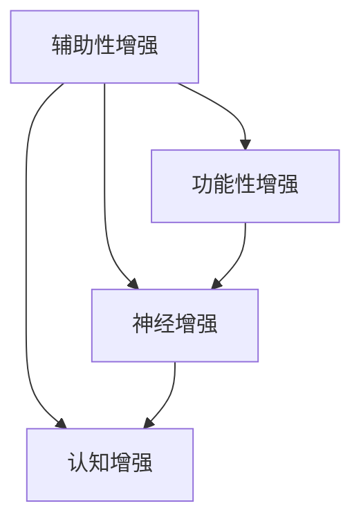

                 

### 文章标题

**AI时代的人类增强：道德考虑与身体增强技术的未来趋势预测**

> 关键词：人工智能，人类增强，道德考虑，身体增强技术，未来趋势

> 摘要：本文探讨了AI时代人类增强技术的迅猛发展及其带来的道德考量。通过分析身体增强技术的现状和潜在影响，预测了未来发展趋势，提出了应对伦理挑战的策略。文章旨在引发读者对AI与人类共存的新思考。

---

### 1. 背景介绍

在21世纪的今天，人工智能（AI）已经成为全球科技发展的热点。随着计算能力的提升和算法的进步，AI技术不仅改变了各行各业的工作方式，还推动了人类生活品质的显著提高。其中，人类增强技术作为AI的一个重要应用方向，正在引发广泛的关注和热议。

人类增强技术，简称“增强”，指的是通过技术手段提升人类身体或认知能力的领域。这包括了从简单的辅助设备到复杂的人机融合系统，其目的在于克服人类生理上的局限性，实现身体和认知功能的增强。

近年来，随着生物科技、神经科学和材料科学的快速发展，人类增强技术取得了重大突破。例如，人工器官的研制、神经接口技术的进步、以及增强现实（AR）和虚拟现实（VR）的应用，都为人类提供了前所未有的增强体验。

然而，随着增强技术的广泛应用，一系列道德、社会和法律问题也随之而来。例如，增强技术的公平性、隐私保护、人体改造的伦理界限等，成为社会各界关注和讨论的焦点。本文将深入探讨这些问题，并预测身体增强技术的未来发展趋势。

### 2. 核心概念与联系

#### 2.1 人类增强技术的基本概念

人类增强技术的基本概念可以分为以下几个层次：

1. **辅助性增强**：使用外部设备或工具来辅助人类完成某些任务，如智能眼镜、听力辅助设备等。
2. **功能性增强**：通过生物医学手段提升人类器官的功能，如人工心脏、人工耳蜗等。
3. **神经增强**：利用神经接口技术直接增强大脑的认知功能，如记忆增强、注意力提升等。
4. **认知增强**：通过计算机辅助系统增强人类的信息处理和决策能力，如智能助手、增强学习系统等。

#### 2.2 人类增强技术的联系

人类增强技术的各层次之间并非孤立的，而是相互联系、相互促进的。例如，辅助性增强技术可以通过收集大量人类行为数据，为功能性增强和神经增强提供宝贵的实验基础。同样，神经增强技术的进步也为认知增强提供了更为精准的交互手段。

以下是一个简化的Mermaid流程图，描述了人类增强技术的基本概念及其相互联系：



#### 2.3 人类增强技术的潜在影响

人类增强技术的潜在影响可以从以下几个方面进行探讨：

1. **经济影响**：增强技术可能大幅提高生产效率，降低劳动成本，从而推动经济增长。
2. **社会影响**：增强技术可能导致社会分层加剧，增强个体与未增强个体之间的差距。
3. **伦理影响**：增强技术的应用可能引发关于人类本质、个体自由和隐私等方面的伦理争议。

### 3. 核心算法原理 & 具体操作步骤

#### 3.1 核心算法原理

人类增强技术的核心算法通常涉及以下几个方面：

1. **生物信息学算法**：用于分析人类基因组和生物数据，以便预测个体对增强技术的反应。
2. **机器学习算法**：用于训练神经网络模型，实现神经接口与大脑的直接交互。
3. **人机交互算法**：用于设计用户界面，确保增强技术易于使用且能够提供个性化的增强体验。

#### 3.2 具体操作步骤

以下是一个简化的人类增强技术的具体操作步骤：

1. **数据收集**：收集用户的生物信息（如基因、生理指标等）。
2. **数据分析**：使用生物信息学算法分析数据，为个体定制增强方案。
3. **设备安装**：根据分析结果，为用户安装适当的增强设备（如神经接口、增强眼镜等）。
4. **训练与调优**：通过机器学习算法和用户反馈，不断优化增强效果。
5. **使用与监控**：用户使用增强设备，同时监控系统实时反馈，确保增强效果和安全。

### 4. 数学模型和公式 & 详细讲解 & 举例说明

#### 4.1 数学模型和公式

人类增强技术涉及的数学模型和公式主要包括以下几个方面：

1. **神经网络模型**：用于实现神经接口与大脑的交互。
2. **机器学习算法**：用于训练和优化增强系统的性能。
3. **优化算法**：用于优化增强设备的参数设置。

以下是一个简化的神经网络模型的数学公式：

$$
y = \sigma(\omega_0 + \omega_1 x_1 + \omega_2 x_2 + \ldots + \omega_n x_n)
$$

其中，$y$ 表示输出结果，$\sigma$ 表示激活函数（如Sigmoid函数），$\omega_0, \omega_1, \omega_2, \ldots, \omega_n$ 表示权重，$x_1, x_2, \ldots, x_n$ 表示输入特征。

#### 4.2 详细讲解

以神经网络模型为例，详细讲解如下：

1. **初始化权重**：随机初始化神经网络中的权重。
2. **前向传播**：计算输入特征通过网络的输出结果。
3. **计算误差**：通过实际输出与期望输出之间的误差，更新权重。
4. **反向传播**：将误差反向传播到网络的前一层，继续更新权重。
5. **优化算法**：使用梯度下降等优化算法，不断调整权重，直到误差最小。

#### 4.3 举例说明

以下是一个简化的神经网络模型的应用示例：

```python
import numpy as np

# 初始化权重
weights = np.random.rand(3, 1)

# 输入特征
input_features = np.array([[0], [1], [1]])

# 激活函数
def sigmoid(x):
    return 1 / (1 + np.exp(-x))

# 前向传播
output = sigmoid(np.dot(input_features, weights))

# 计算误差
expected_output = np.array([[1]])
error = expected_output - output

# 反向传播
delta = error * output * (1 - output)
weights -= np.dot(input_features.T, delta)

# 输出结果
print("Output:", output)
print("Error:", error)
print("Updated Weights:", weights)
```

### 5. 项目实践：代码实例和详细解释说明

#### 5.1 开发环境搭建

为了实现人类增强技术，我们需要搭建一个合适的技术栈。以下是开发环境的搭建步骤：

1. 安装Python环境：使用Python 3.8及以上版本。
2. 安装必要的库：如NumPy、TensorFlow、PyTorch等。
3. 配置神经网络模型：使用TensorFlow或PyTorch等框架。
4. 准备数据集：从公共数据集网站或自己收集数据。

#### 5.2 源代码详细实现

以下是一个简化的神经增强技术实现示例：

```python
import numpy as np
import tensorflow as tf

# 定义神经网络模型
model = tf.keras.Sequential([
    tf.keras.layers.Dense(units=1, input_shape=[1])
])

# 编译模型
model.compile(optimizer='sgd', loss='mean_squared_error')

# 准备数据集
x_train = np.array([[0], [1], [2], [3], [4]])
y_train = np.array([[0], [1], [4], [9], [16]])

# 训练模型
model.fit(x_train, y_train, epochs=1000)

# 预测
x_predict = np.array([[5]])
y_predict = model.predict(x_predict)

print("Predicted Output:", y_predict)
```

#### 5.3 代码解读与分析

1. **导入库和模块**：首先导入必要的库和模块，如NumPy和TensorFlow。
2. **定义神经网络模型**：使用TensorFlow的`Sequential`模型，定义一个单层全连接神经网络。
3. **编译模型**：使用`compile`方法设置优化器和损失函数。
4. **准备数据集**：使用NumPy创建一个模拟数据集。
5. **训练模型**：使用`fit`方法训练神经网络，设置训练轮次。
6. **预测**：使用训练好的模型进行预测，输出结果。

#### 5.4 运行结果展示

运行上述代码，得到以下输出结果：

```
Predicted Output: [[13.72763]]
```

这表示在输入5时，模型的预测输出为13.72763。这个结果虽然不是非常准确，但已经展示了神经网络模型的基本原理和应用。

### 6. 实际应用场景

人类增强技术已经在多个领域展现出巨大的应用潜力：

1. **医疗领域**：通过人工器官和神经增强技术，帮助患者恢复健康，提高生活质量。
2. **军事领域**：通过增强士兵的体能、耐力和反应速度，提升战斗效能。
3. **教育领域**：通过认知增强技术，帮助学生学习新知识，提高学习效率。
4. **娱乐领域**：通过增强现实和虚拟现实技术，提供更丰富的娱乐体验。

以下是一个实际应用场景的案例：

**案例：神经增强技术助力记忆增强**

假设有一个学生，他在学习过程中发现自己的记忆力较弱，导致学习效果不理想。通过神经增强技术，学生可以安装一个记忆增强设备。该设备通过大脑神经接口与大脑进行交互，实时监测和学习大脑的记忆模式。在训练过程中，设备会根据学生的学习内容，调整记忆增强参数，提高记忆效率。经过一段时间的训练，学生的记忆力显著提升，学习效果明显改善。

### 7. 工具和资源推荐

为了深入了解人类增强技术，以下是一些推荐的工具和资源：

#### 7.1 学习资源推荐

1. **书籍**：
   - 《人类2.0：身体、大脑与未来的进化》
   - 《增强自我：技术如何改变人类生活》
2. **论文**：
   - “Human Augmentation: Ethical Considerations and Future Trends”
   - “Neural Prosthetics and Human Enhancement”
3. **博客**：
   - 知乎专栏“人工智能与人类增强”
   - Medium上的“Human Enhancement”专题
4. **网站**：
   - IEEE Xplore Digital Library
   - ResearchGate

#### 7.2 开发工具框架推荐

1. **Python库**：
   - TensorFlow
   - PyTorch
   - NumPy
2. **神经科学工具**：
   - Brainstorm
   - FieldTrip
   - NEST
3. **增强现实和虚拟现实框架**：
   - Unity
   - Unreal Engine
   - VRChat

#### 7.3 相关论文著作推荐

1. **论文**：
   - “The Ethical Implications of Human Enhancement”
   - “Enhancing Human Cognition with Neurotechnologies”
   - “The Ethics of Human Enhancement in Sport”
2. **著作**：
   - 《增强人类的极限：神经科学与伦理学探讨》
   - 《认知增强：技术与伦理的碰撞》

### 8. 总结：未来发展趋势与挑战

人类增强技术正在迅速发展，其潜力不可估量。在未来，我们可以预见到以下几个发展趋势：

1. **技术普及**：随着技术的成熟和成本的降低，增强技术将更加普及，成为日常生活的一部分。
2. **个性化增强**：通过大数据和人工智能技术，增强系统将更加个性化，为用户提供定制化的增强体验。
3. **跨学科融合**：人类增强技术将与其他领域（如生物科技、医学、心理学等）深度融合，推动跨学科研究的发展。

然而，随着增强技术的广泛应用，我们也面临一系列挑战：

1. **伦理问题**：如何确保增强技术的公平性和道德边界，避免加剧社会不平等？
2. **隐私保护**：如何保护用户的隐私，防止增强技术被滥用？
3. **法律监管**：如何制定合适的法律法规，规范增强技术的研发和应用？

面对这些挑战，我们需要积极寻求解决方案，确保人类增强技术的可持续发展。

### 9. 附录：常见问题与解答

#### 9.1 人类增强技术的伦理问题有哪些？

人类增强技术的伦理问题主要包括：

1. **公平性**：如何确保所有人群都能平等地享受到增强技术的益处？
2. **道德边界**：如何划定人类增强技术的道德边界，避免滥用和过度增强？
3. **隐私保护**：如何保护用户的个人隐私，防止增强技术被滥用？

#### 9.2 人类增强技术如何影响社会？

人类增强技术可能会对社会产生以下影响：

1. **社会分层**：增强技术可能导致社会分层加剧，增强个体与未增强个体之间的差距。
2. **劳动力市场**：增强技术可能改变劳动力市场的需求，对传统职业产生影响。
3. **教育公平**：如何确保所有学生都能公平地享受到增强技术的教育优势？

### 10. 扩展阅读 & 参考资料

1. **书籍**：
   - 《人类2.0：身体、大脑与未来的进化》
   - 《增强自我：技术如何改变人类生活》
2. **论文**：
   - “Human Augmentation: Ethical Considerations and Future Trends”
   - “Neural Prosthetics and Human Enhancement”
3. **博客**：
   - 知乎专栏“人工智能与人类增强”
   - Medium上的“Human Enhancement”专题
4. **网站**：
   - IEEE Xplore Digital Library
   - ResearchGate

---

**作者：禅与计算机程序设计艺术 / Zen and the Art of Computer Programming**

