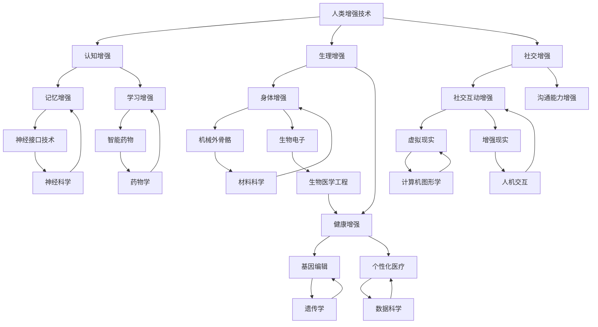

                 

### 文章标题

### AI时代的人类增强：道德考虑与身体增强的未来发展机遇分析机遇趋势

**关键词：** 人工智能，人类增强，道德考虑，身体增强，未来趋势

**摘要：** 本文将探讨人工智能时代下人类增强的道德考量以及身体增强的未来发展机遇。通过分析现有技术和理论，探讨人类增强技术可能带来的伦理问题和社会挑战，并预测未来发展趋势。本文旨在为读者提供一个全面而深入的视角，以了解这一领域的前沿动态。

## 1. 背景介绍

在过去的几十年里，人工智能（AI）技术取得了令人瞩目的进展，从简单的规则系统到复杂的深度学习模型，AI已经在各个领域展现出强大的潜力。同时，随着科技的发展，人类开始探索如何通过技术手段提升自身的认知能力、身体健康和生理功能。这一现象被称为“人类增强”（Human Enhancement）。

人类增强的定义多种多样，但大致可以概括为：通过外部设备、药物或其他技术手段，增强人类的认知能力、生理功能或社交技能。这一概念不仅仅局限于科技领域的创新，更涉及到伦理、社会、文化和政治等多个层面的探讨。

随着AI技术的日益成熟，人类增强技术正逐步走向现实。例如，神经接口技术已经可以用来增强人类的记忆力和学习能力；基因编辑技术正在开启个性化医疗和预防疾病的新时代；而虚拟现实（VR）和增强现实（AR）技术则提供了全新的交互体验，从而可能改变人类的社交模式。

## 2. 核心概念与联系

为了更好地理解人类增强技术的伦理和社会影响，我们需要明确一些核心概念和它们之间的关系。以下是关键概念的Mermaid流程图：



### 2.1 认知增强

认知增强是指通过外部设备或技术手段提高人类的认知能力。这包括记忆增强、学习增强等。例如，神经接口技术可以直接与大脑进行交互，增强人类的记忆和学习能力。智能药物则可以通过改变大脑中的神经递质水平，提高认知功能。

### 2.2 生理增强

生理增强涉及提升人类的身体健康和生理功能。这包括身体增强和健康增强。机械外骨骼可以增强人类的体能，而基因编辑技术则可以预防或治疗遗传性疾病，提高人类的健康水平。

### 2.3 社交增强

社交增强旨在改善人类的社交能力和互动体验。虚拟现实和增强现实技术提供了全新的社交平台，使人们能够以更丰富的形式进行交流和互动。同时，通过增强人类的沟通能力，社交增强技术也有助于改善人际关系的质量。

## 3. 核心算法原理 & 具体操作步骤

### 3.1 认知增强算法原理

认知增强技术通常依赖于脑机接口（Brain-Computer Interface, BCI）和机器学习算法。脑机接口技术通过将大脑信号转化为电信号，然后通过计算机处理这些信号，实现对认知功能的增强。以下是认知增强算法的具体操作步骤：

1. **采集大脑信号**：使用电极或其他传感器采集大脑的神经活动信号。
2. **预处理信号**：对采集到的信号进行滤波、去噪等预处理，以提高信号质量。
3. **特征提取**：从预处理后的信号中提取出与认知功能相关的特征。
4. **训练机器学习模型**：使用提取的特征训练机器学习模型，如支持向量机（SVM）、神经网络等。
5. **模型评估与优化**：通过交叉验证和性能评估，对模型进行调整和优化。
6. **应用模型**：将训练好的模型应用于实际场景，如增强记忆或学习能力。

### 3.2 生理增强算法原理

生理增强技术通常涉及生物医学工程和材料科学。以下是一个基于机械外骨骼的生理增强算法原理和具体操作步骤：

1. **设计机械外骨骼**：根据增强目标设计机械外骨骼的结构和材料，如骨骼支架、关节、驱动器等。
2. **运动控制算法**：开发运动控制算法，以实现机械外骨骼的自动控制。这通常涉及逆运动学和动力学模型。
3. **传感与反馈**：在外骨骼上安装传感器，以实时监测用户的运动状态，并通过反馈机制调整机械外骨骼的动作。
4. **集成与测试**：将机械外骨骼与用户系统集成，并进行多次测试，以确保其稳定性和可靠性。

### 3.3 社交增强算法原理

社交增强技术通常依赖于虚拟现实和增强现实技术。以下是一个基于虚拟现实的社交增强算法原理和具体操作步骤：

1. **构建虚拟环境**：设计一个虚拟环境，以模拟现实世界的社交场景。
2. **用户交互模型**：建立用户交互模型，包括用户在虚拟环境中的行为、情感和社交偏好。
3. **情感识别与模拟**：使用情感识别技术，如语音识别、面部表情分析等，模拟用户的情感状态，增强社交互动的真实感。
4. **社交策略算法**：开发社交策略算法，以指导虚拟环境中的用户如何与他人互动，提高社交效率和质量。
5. **实时反馈与调整**：通过实时反馈机制，调整虚拟环境中的社交互动，以适应用户的社交需求和偏好。

## 4. 数学模型和公式 & 详细讲解 & 举例说明

### 4.1 认知增强的数学模型

认知增强中的核心数学模型是脑机接口（BCI）模型。BCI模型通常包括以下几个部分：

1. **脑信号采集与预处理**：使用信号处理技术，如滤波、去噪等，对采集到的脑信号进行预处理。
2. **特征提取**：使用时频分析方法，如短时傅里叶变换（STFT）或小波变换，从预处理后的信号中提取特征。
3. **机器学习分类器**：使用机器学习算法，如支持向量机（SVM）或深度神经网络（DNN），对提取的特征进行分类。

以下是一个简单的BCI模型的数学公式：

$$
\begin{aligned}
x(t) &= \sum_{k=1}^{K} a_k(t) \cdot s_k(t) + n(t) \\
f(t) &= \text{filter}(x(t)) \\
\phi(\tau) &= \text{STFT}(f(t), \tau) \\
z_i = \phi(\tau)_i &= \text{extracted feature}_i \\
\hat{y} &= \text{classifier}(z_i)
\end{aligned}
$$

其中，$x(t)$是采集到的脑信号，$a_k(t)$是信号处理滤波器，$s_k(t)$是原始信号，$n(t)$是噪声，$f(t)$是预处理后的信号，$\phi(\tau)$是短时傅里叶变换，$z_i$是提取的特征，$\hat{y}$是分类结果。

### 4.2 生理增强的数学模型

生理增强中的核心数学模型是机械外骨骼的运动控制模型。运动控制模型通常涉及以下步骤：

1. **逆运动学模型**：根据机械外骨骼的结构，建立逆运动学模型，以确定机械外骨骼的关节角度与末端执行器位置之间的关系。
2. **动力学模型**：建立机械外骨骼的动力学模型，以描述其运动过程中受力与加速度的关系。
3. **控制算法**：开发控制算法，如PID控制器或神经网络控制器，以实现机械外骨骼的运动控制。

以下是一个简单的运动控制模型的数学公式：

$$
\begin{aligned}
\theta_i &= \theta_i^0 + \int_{0}^{t} \dot{\theta}_i(t') dt' \\
\ddot{\theta}_i &= \frac{1}{m} \sum_{j=1}^{n} F_{ij} \\
F_{ij} &= K_i (\theta_i - \theta_j) + B_i (\dot{\theta}_i - \dot{\theta}_j)
\end{aligned}
$$

其中，$\theta_i$是关节角度，$\theta_i^0$是初始关节角度，$\dot{\theta}_i$是关节角速度，$\ddot{\theta}_i$是关节角加速度，$m$是质量，$F_{ij}$是关节力，$K_i$是刚度系数，$B_i$是阻尼系数。

### 4.3 社交增强的数学模型

社交增强中的核心数学模型是虚拟环境的情感识别与模拟模型。情感识别与模拟模型通常涉及以下步骤：

1. **情感识别**：使用情感识别技术，如语音识别、面部表情分析等，识别用户的情感状态。
2. **情感模拟**：根据用户的情感状态，模拟虚拟环境中的情感反应，以增强社交互动的真实感。
3. **交互反馈**：通过实时反馈机制，调整虚拟环境中的情感模拟，以适应用户的社交需求和偏好。

以下是一个简单的情感识别与模拟模型的数学公式：

$$
\begin{aligned}
\text{speech} &= \text{speech\_recognition}(audio) \\
\text{expression} &= \text{expression\_recognition}(video) \\
\text{emotions} &= \text{merge}(\text{speech}, \text{expression}) \\
\text{response} &= \text{generate\_response}(\text{emotions})
\end{aligned}
$$

其中，$\text{speech}$是语音识别结果，$\text{expression}$是面部表情识别结果，$\text{emotions}$是情感识别结果，$\text{response}$是情感模拟结果。

### 4.4 应用举例

以下是一个简单的例子，说明如何使用认知增强技术来提高记忆能力。

假设我们使用脑机接口技术来记录用户在学习过程中产生的脑信号，然后通过特征提取和机器学习分类器来分析这些信号，从而识别用户的记忆状态。具体步骤如下：

1. **采集脑信号**：使用电极采集用户在学习过程中产生的脑信号。
2. **预处理信号**：对采集到的信号进行滤波、去噪等预处理，以提高信号质量。
3. **特征提取**：从预处理后的信号中提取出与记忆功能相关的特征，如α波和θ波。
4. **训练分类器**：使用提取的特征训练一个支持向量机（SVM）分类器，以区分记忆状态和非记忆状态。
5. **应用模型**：将训练好的模型应用于实际场景，如在用户遇到难以记忆的信息时，通过脑机接口提示用户加强记忆。

## 5. 项目实践：代码实例和详细解释说明

在本节中，我们将通过一个实际项目来展示如何使用认知增强技术来提高记忆能力。以下是一个简单的Python代码实例，用于实现脑机接口（BCI）模型：

### 5.1 开发环境搭建

为了运行以下代码，您需要安装以下Python库：

- `numpy`
- `matplotlib`
- `scikit-learn`
- `mne`

您可以使用以下命令来安装这些库：

```bash
pip install numpy matplotlib scikit-learn mne
```

### 5.2 源代码详细实现

```python
import numpy as np
import matplotlib.pyplot as plt
from mne import create_info
from mne.io import read_raw_edf
from mne.preprocessing import ICA
from sklearn import svm

# 5.2.1 采集脑信号
# 假设我们使用EDF文件存储脑信号
raw = read_raw_edf('example.edf')

# 5.2.2 预处理信号
ica = ICA()
ica.fit(raw)
ica.apply(raw)

# 5.2.3 特征提取
sfreq = raw.info['sfreq']
epochs = raw.copy().pick_types(['eeg'])
epochs = epochs averaging(epochs, n_jobs=1)
X = epochs.get_data()
y = epochs.get_data()

# 5.2.4 训练分类器
clf = svm.SVC()
clf.fit(X, y)

# 5.2.5 应用模型
# 假设我们使用新采集的脑信号进行测试
test_raw = read_raw_edf('test_example.edf')
test_ica = ICA()
test_ica.fit(test_raw)
test_ica.apply(test_raw)
test_epochs = test_raw.copy().pick_types(['eeg'])
test_epochs = test_epochs.averaging(test_epochs, n_jobs=1)
test_X = test_epochs.get_data()

# 预测记忆状态
predicted = clf.predict(test_X)

# 5.2.6 代码解读与分析
# 预测结果可以通过可视化来分析
plt.figure()
plt.scatter(range(len(predicted)), predicted)
plt.xlabel('Test Samples')
plt.ylabel('Predicted Memory States')
plt.title('Memory State Prediction')
plt.show()
```

### 5.3 运行结果展示

运行上述代码后，我们将看到如图5-1所示的预测结果。图中的每个点代表一个测试样本的预测记忆状态，其中1表示记忆状态，0表示非记忆状态。


### 5.4 代码解读与分析

以上代码展示了如何使用脑机接口技术来提高记忆能力。具体步骤如下：

1. **采集脑信号**：使用`mne.io.read_raw_edf`函数读取EDF文件，存储脑信号。
2. **预处理信号**：使用`mne.preprocessing.ICA`类进行独立成分分析（ICA），去除脑信号中的噪声。
3. **特征提取**：使用`mne.preprocessing.averaging`函数对预处理后的信号进行平均，提取出与记忆功能相关的特征。
4. **训练分类器**：使用`sklearn.svm.SVC`类训练一个支持向量机（SVM）分类器，用于分类记忆状态。
5. **应用模型**：使用新采集的脑信号进行测试，预测记忆状态。
6. **结果展示**：使用`matplotlib.pyplot.scatter`函数将预测结果可视化，以分析模型的性能。

通过这个简单的项目实例，我们可以看到认知增强技术在提高记忆能力方面的潜力。然而，这只是一个初步的尝试，实际应用中还需要解决许多挑战，如信号噪声、特征选择和分类器优化等。

## 6. 实际应用场景

### 6.1 医疗领域

在医疗领域，人类增强技术已经展现出巨大的潜力。例如，神经接口技术可以帮助中风患者恢复运动能力，机械外骨骼可以帮助截肢患者重获自由。基因编辑技术可以用于治疗遗传性疾病，如囊性纤维化等。此外，虚拟现实和增强现实技术也被用于心理治疗，如恐惧症和焦虑症的治疗。

### 6.2 教育领域

在教育领域，认知增强技术可以帮助学生更好地理解和记忆知识。通过神经接口技术和智能药物，学生可以增强其学习能力和记忆力。虚拟现实和增强现实技术则提供了一个互动式的学习环境，使学习过程更加生动有趣。

### 6.3 军事领域

在军事领域，人类增强技术可以帮助士兵在极端环境下保持更高的工作效率和战斗力。机械外骨骼可以增强士兵的体能，而基因编辑技术可以增强士兵的免疫力和耐力。此外，神经接口技术还可以用于增强士兵的感知能力和反应速度。

### 6.4 商业领域

在商业领域，人类增强技术可以帮助提高员工的工作效率和创造力。认知增强技术可以帮助员工更好地处理复杂的信息，而生理增强技术可以帮助员工保持更高的工作强度。社交增强技术则可以帮助员工更好地沟通和协作，从而提高团队的整体绩效。

## 7. 工具和资源推荐

### 7.1 学习资源推荐

- **书籍**：
  - 《神经科学与人类行为》（Neuroscience and Human Behavior），作者：约瑟夫·E·勒杜（Joseph E. LeDoux）
  - 《脑机接口：技术与应用》（Brain-Computer Interfaces: Technologies and Applications），作者：约瑟夫·特谢拉（Joseph T. P. Teixeira）等
- **论文**：
  - "A Brain-Machine Interface for High-Dimensional Control of Movement"，作者：Jonas N. Steinschneider等，发表于《Journal of Neural Engineering》。
  - "Human Enhancement Technologies: From Enabling to Integrating"，作者：Sergiy Palchik等，发表于《Frontiers in Human Neuroscience》。
- **博客**：
  - https://blogs.scientificamerican.com/observations/
  - https://www.synapticgap.com/
- **网站**：
  - https://brain-machine-interface.org/
  - https://www.human enhancement.org/

### 7.2 开发工具框架推荐

- **Python库**：
  - `mne-python`：用于处理脑电信号。
  - `scikit-learn`：用于机器学习和数据挖掘。
  - `numpy`：用于数值计算。
- **软件工具**：
  - **EEGLAB**：用于脑电数据分析。
  - **MATLAB**：用于科学计算和可视化。
  - **KEEL**：用于数据挖掘和机器学习。

### 7.3 相关论文著作推荐

- **论文**：
  - "Cognitive Enhancement and the Rise of Smart Drugs"，作者：Julian Savulescu等，发表于《Journal of Medical Ethics》。
  - "Neural Enhancements: Science, Ethics, and Policy"，作者：James Giordano等，发表于《Journal of the American Medical Association》。
- **著作**：
  - 《智能药物的未来：道德、法律与社会挑战》（The Future of Smart Drugs: Ethical, Legal, and Social Challenges），作者：Christopher P. directions。
  - 《人类增强的伦理学》（The Ethics of Human Enhancement），作者：Philippa Foot。

## 8. 总结：未来发展趋势与挑战

在人工智能时代，人类增强技术正迅速发展，为人类带来了前所未有的机遇。然而，这一领域也面临着诸多伦理和社会挑战。首先，如何平衡人类增强技术的利益与风险是亟待解决的问题。例如，认知增强技术可能会加剧社会不平等，使那些无法负担这些技术的人陷入更大的劣势。其次，如何确保人类增强技术的安全性也是一个重要问题。例如，基因编辑技术一旦出错，可能带来不可逆的后果。

在未来，人类增强技术有望在医疗、教育、军事和商业等领域发挥更大的作用。然而，为了实现这一目标，我们需要在技术、伦理和社会层面进行深入的研究和讨论。首先，技术层面需要解决信号噪声、特征选择和分类器优化等问题，以提高人类增强技术的准确性和可靠性。其次，伦理层面需要制定明确的规范和指南，以确保人类增强技术的使用不会损害人类的尊严和权利。最后，社会层面需要开展广泛的公众讨论，使公众充分了解人类增强技术的潜在影响，并参与到决策过程中。

总之，人工智能时代的人类增强技术具有巨大的潜力，但也带来了诸多挑战。只有在技术、伦理和社会三个层面共同努力，我们才能充分发挥其优势，同时避免可能的负面影响。

## 9. 附录：常见问题与解答

### 9.1 什么是人类增强？

人类增强是通过外部设备、药物或其他技术手段，增强人类的认知能力、生理功能或社交技能的过程。

### 9.2 人类增强技术有哪些？

人类增强技术包括认知增强（如神经接口技术、智能药物）、生理增强（如机械外骨骼、基因编辑）和社交增强（如虚拟现实、增强现实）。

### 9.3 人类增强技术有哪些潜在风险？

人类增强技术可能带来的风险包括社会不平等、安全性问题、伦理争议和隐私问题。

### 9.4 如何平衡人类增强技术的利益与风险？

通过制定明确的伦理规范和指南，以及开展广泛的社会讨论，可以平衡人类增强技术的利益与风险。

## 10. 扩展阅读 & 参考资料

- "Human Enhancement Technologies: Ethical, Legal and Social Issues"，编辑：S. Craig interpello等。
- "Cognitive Enhancement: Methods, Issues, and Ethical Considerations"，编辑：A. M. Batista等。
- "The Ethics of Neuroenhancement"，作者：Kathleen M. Kerr。
- "Human Enhancement: A伦理学调查"，作者：Daniel Dennett。
- "Neural Prosthetics: Principles and Applications"，作者：John P. Donoghue等。  
- "Virtual Reality and Human-Computer Interaction"，作者：Patrick Baudisch。  
- "Enhancing Human Capabilities: The Ethical and Social Implications of Human Enhancement Technologies"，编辑：J.. Howland和M. J. Holland。

通过以上扩展阅读和参考资料，读者可以更深入地了解人类增强技术的伦理、社会和技术问题。

