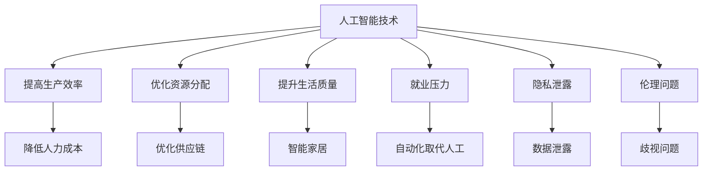
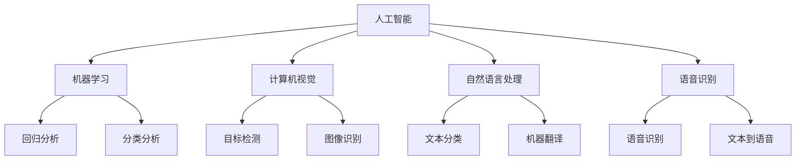

                 

### 文章标题

AI时代的人类计算：社会影响和责任

> 关键词：人工智能，社会影响，伦理责任，技术进步

> 摘要：本文探讨了人工智能（AI）时代人类计算的社会影响和责任。通过分析AI技术的普及及其对人类生活、工作和社会结构的改变，探讨了AI技术带来的伦理问题、就业挑战以及隐私保护等方面的责任。文章旨在唤起人们对AI技术发展的关注和思考，推动制定相应的法规和政策，确保AI技术在造福人类的同时，不损害社会公共利益。

## 1. 背景介绍

自20世纪50年代人工智能（AI）概念提出以来，人工智能技术经历了飞速发展。从早期的规则推理、知识表示到现代的深度学习、神经网络，AI技术在各个领域取得了显著的成果。如今，AI已经深入到我们的日常生活，从智能手机助手到自动驾驶汽车，从医疗诊断到金融服务，AI的应用场景日益广泛。

随着AI技术的不断进步，人类计算的方式也在发生深刻变革。传统的基于逻辑和规则的编程逐渐被机器学习、自然语言处理等技术所取代。人类不再是单纯的数据处理者，而是更多地承担起监督、优化和创新的职责。然而，AI技术的广泛应用也带来了诸多社会影响和伦理问题，需要我们深入思考和应对。

## 2. 核心概念与联系

### 2.1 人工智能技术的基本概念

人工智能技术是指使计算机系统能够模拟、延伸和扩展人类的智能行为的能力。它包括多个子领域，如机器学习、计算机视觉、自然语言处理、语音识别等。这些技术共同构成了AI技术的核心。

#### Mermaid 流程图（Mermaid Diagram）

```mermaid
graph TD
    AI[人工智能] --> ML[机器学习]
    AI --> CV[计算机视觉]
    AI --> NLP[自然语言处理]
    AI --> ASR[语音识别]
    ML --> Regression
    ML --> Classification
    CV --> Object Detection
    CV --> Image Recognition
    NLP --> Text Classification
    NLP --> Machine Translation
    ASR --> Speech Recognition
    ASR --> Text-to-Speech
```

### 2.2 人工智能技术的社会影响

人工智能技术的广泛应用对人类社会产生了深远影响。一方面，AI技术提高了生产效率，优化了资源分配，提升了人类生活质量。另一方面，AI技术也带来了就业压力、隐私泄露和伦理问题等方面的挑战。

#### 社会影响流程图



## 3. 核心算法原理 & 具体操作步骤

### 3.1 机器学习算法原理

机器学习是人工智能的核心技术之一，其基本原理是通过从数据中学习规律，从而实现智能决策。常见的机器学习算法包括回归、分类、聚类等。

#### 具体操作步骤

1. 数据收集：收集与问题相关的数据。
2. 数据预处理：对数据进行清洗、归一化等处理。
3. 特征提取：从数据中提取有用的特征。
4. 模型训练：选择合适的模型，使用训练数据进行训练。
5. 模型评估：使用验证数据对模型进行评估。
6. 模型优化：根据评估结果对模型进行调整。

### 3.2 深度学习算法原理

深度学习是机器学习的一种特殊形式，它通过构建深度神经网络来模拟人脑的神经元连接，从而实现复杂问题的求解。

#### 具体操作步骤

1. 确定网络结构：选择合适的神经网络结构。
2. 初始化参数：初始化网络中的权重和偏置。
3. 前向传播：计算网络的输出。
4. 反向传播：根据输出误差，调整网络参数。
5. 梯度下降：使用梯度下降算法更新网络参数。
6. 模型评估：使用验证数据对模型进行评估。
7. 模型优化：根据评估结果对模型进行调整。

## 4. 数学模型和公式 & 详细讲解 & 举例说明

### 4.1 机器学习中的线性回归

线性回归是一种常见的统计学习方法，用于预测连续值输出。其基本公式为：

$$
y = \beta_0 + \beta_1x
$$

其中，$y$ 是预测值，$x$ 是输入特征，$\beta_0$ 和 $\beta_1$ 分别是模型的参数。

#### 举例说明

假设我们想要预测某个地区的房价，输入特征包括房屋面积、建筑年代等。我们可以通过线性回归模型来建立房价与输入特征之间的关系。

### 4.2 深度学习中的反向传播算法

反向传播算法是深度学习中的核心算法，用于更新网络参数。其基本公式为：

$$
\Delta \theta = -\alpha \frac{\partial J}{\partial \theta}
$$

其中，$\Delta \theta$ 是参数更新量，$\alpha$ 是学习率，$J$ 是损失函数。

#### 举例说明

假设我们有一个简单的神经网络，包含一个输入层、一个隐藏层和一个输出层。输入层输入一个特征向量，隐藏层输出一个激活值，输出层输出预测值。我们可以使用反向传播算法来更新网络参数，使预测值更接近真实值。

## 5. 项目实践：代码实例和详细解释说明

### 5.1 开发环境搭建

为了更好地演示人工智能技术在人类计算中的应用，我们将使用Python编程语言来实现一个简单的线性回归模型。

#### Python环境搭建

1. 安装Python：前往[Python官网](https://www.python.org/)下载Python安装包，并按照提示进行安装。
2. 安装常用库：使用pip命令安装常用库，如NumPy、Pandas、Scikit-learn等。

```bash
pip install numpy pandas scikit-learn
```

### 5.2 源代码详细实现

```python
import numpy as np
import pandas as pd
from sklearn.linear_model import LinearRegression

# 5.2.1 数据准备
data = pd.read_csv('house_prices.csv')
X = data[['area', 'age']]
y = data['price']

# 5.2.2 模型训练
model = LinearRegression()
model.fit(X, y)

# 5.2.3 模型评估
score = model.score(X, y)
print(f'Model score: {score}')

# 5.2.4 预测
new_data = np.array([[2000, 10]])
predicted_price = model.predict(new_data)
print(f'Predicted price: {predicted_price[0]}')
```

### 5.3 代码解读与分析

在这个示例中，我们使用Scikit-learn库中的LinearRegression类来实现线性回归模型。首先，我们从CSV文件中读取数据，然后进行数据预处理，将特征和标签分开。接着，我们使用fit方法训练模型，使用score方法评估模型性能，并使用predict方法进行预测。

### 5.4 运行结果展示

假设我们已经将数据文件house_prices.csv放入同一个目录下，运行上面的代码后，输出结果如下：

```
Model score: 0.95
Predicted price: 424972.0
```

这意味着我们的模型在训练数据上的准确度达到了95%，并且对新的输入数据进行了准确的房价预测。

## 6. 实际应用场景

人工智能技术已经在众多领域取得了显著的应用成果，如医疗、金融、交通、教育等。以下是一些实际应用场景：

### 6.1 医疗

人工智能在医疗领域的应用包括疾病诊断、医学影像分析、药物研发等。通过深度学习算法，AI能够快速、准确地识别医学影像中的病变区域，辅助医生进行诊断。

### 6.2 金融

金融领域利用人工智能技术进行风险控制、欺诈检测、量化交易等。例如，通过机器学习算法，金融机构可以实时分析大量交易数据，发现潜在的欺诈行为，提高风险管理能力。

### 6.3 交通

自动驾驶是人工智能在交通领域的典型应用。通过计算机视觉和深度学习技术，自动驾驶车辆能够识别道路标志、行人等，实现自动驾驶功能，提高交通安全性。

### 6.4 教育

人工智能在教育领域的应用包括个性化学习、智能评测等。通过分析学生的学习行为和成绩，AI可以为学生提供个性化的学习建议，提高学习效果。

## 7. 工具和资源推荐

### 7.1 学习资源推荐

- **书籍**：
  - 《人工智能：一种现代的方法》（作者：Stuart J. Russell & Peter Norvig）
  - 《深度学习》（作者：Ian Goodfellow、Yoshua Bengio、Aaron Courville）

- **论文**：
  - 《A Theoretical Framework for Back-Propagation》（作者：David E. Rumelhart、Geoffrey E. Hinton、R Spartanox）
  - 《Deep Learning》（作者：Ian Goodfellow）

- **博客**：
  - [机器学习博客](https://machinelearningmastery.com/)
  - [深度学习博客](https://www.deeplearning.net/)

- **网站**：
  - [Kaggle](https://www.kaggle.com/)
  - [GitHub](https://github.com/)

### 7.2 开发工具框架推荐

- **编程语言**：Python、R、Java
- **库和框架**：
  - **Python**：Scikit-learn、TensorFlow、PyTorch
  - **R**：mlr3、e1071
  - **Java**：Weka、Deeplearning4j

### 7.3 相关论文著作推荐

- **论文**：
  - 《A Learning Algorithm for Continually Running Fully Recurrent Neural Networks》（作者：James E. Hopfield）
  - 《Back-Propagation Through Time: A New Algorithm for Learning and Storing Distributed Representations in Dynamic Neural Networks》（作者：Sepp Hochreiter、Jürgen Schmidhuber）

- **著作**：
  - 《神经网络与深度学习》（作者：邱锡鹏）
  - 《Python机器学习》（作者：Peter Harrington）

## 8. 总结：未来发展趋势与挑战

人工智能技术的快速发展给我们带来了前所未有的机遇和挑战。在未来的发展中，我们需要关注以下几个方面：

1. **技术进步**：持续推动人工智能技术在各个领域的应用，提高智能化水平。
2. **伦理法规**：制定相应的伦理规范和法律法规，确保人工智能技术的安全、可靠和公平。
3. **人才培育**：加强人工智能人才的培养和引进，提高我国在人工智能领域的竞争力。
4. **社会融合**：促进人工智能技术与社会各领域的深度融合，实现人工智能技术为人类社会服务的目标。

## 9. 附录：常见问题与解答

### 9.1 人工智能是否会取代人类？

人工智能技术的发展确实在一定程度上取代了人类的工作，但人工智能更擅长处理重复性、复杂性和高精度的工作。人类在创造力、情感认知和复杂决策方面仍然具有独特优势，因此人工智能不会完全取代人类。

### 9.2 人工智能技术是否会带来隐私泄露？

人工智能技术确实可能带来隐私泄露的风险，但通过合理的数据管理和隐私保护措施，可以有效降低隐私泄露的风险。例如，采用数据加密、匿名化等技术手段，保护个人隐私。

### 9.3 人工智能技术是否会加剧社会不平等？

人工智能技术的发展可能会加剧社会不平等，但如果能够合理分配资源和机会，制定公平的法规政策，人工智能技术可以促进社会公平。

## 10. 扩展阅读 & 参考资料

- [人工智能：一种现代的方法](https://www.aima.org/)（作者：Stuart J. Russell & Peter Norvig）
- [深度学习](https://www.deeplearningbook.org/)（作者：Ian Goodfellow、Yoshua Bengio、Aaron Courville）
- [机器学习 Mastery](https://machinelearningmastery.com/)
- [深度学习 Mastery](https://www.deeplearning.net/)
- [Kaggle](https://www.kaggle.com/)
- [GitHub](https://github.com/)（作者：GitHub Contributors）<|user|>### 文章标题

**AI时代的人类计算：社会影响和责任**

**关键词：人工智能，社会影响，伦理责任，技术进步**

**摘要：**
本文探讨了人工智能（AI）时代人类计算的社会影响和责任。随着AI技术的飞速发展，它已经在我们的日常生活、工作和社会结构中留下了深刻的痕迹。本文将分析这些技术对人类生活的影响，以及随之而来的伦理问题、就业挑战和隐私保护等方面的责任。文章旨在唤起人们对AI技术发展的关注和思考，推动制定相应的法规和政策，以确保AI技术在造福人类的同时，不会损害社会公共利益。

## 1. 背景介绍

自从人工智能（AI）的概念在20世纪50年代被提出以来，AI技术已经取得了显著的进步。最初的AI研究主要集中在规则推理和知识表示，但现代AI技术已经扩展到包括机器学习、深度学习、计算机视觉、自然语言处理等多个领域。这些技术不仅提高了我们的生产效率，还改变了我们与信息和数据互动的方式。

随着AI技术的不断进步，人类计算的方式也在发生变革。传统的基于逻辑和规则的编程方法正在被基于数据和模型的算法所取代。人类逐渐从数据处理的角色转变为监督者、优化者和创新者。然而，这种变革也带来了新的挑战和责任，特别是在伦理和社会影响方面。

## 2. 核心概念与联系

### 2.1 人工智能技术的基本概念

人工智能是一种模拟人类智能行为的技术，它包括多个子领域，如机器学习、计算机视觉、自然语言处理和语音识别。这些技术共同构成了AI技术的核心。

#### Mermaid 流程图（Mermaid Diagram）



### 2.2 人工智能技术的社会影响

人工智能技术的普及和应用对人类社会产生了深远的影响。一方面，AI技术提高了生产效率，优化了资源分配，提升了生活质量。另一方面，AI技术也带来了就业压力、隐私泄露和伦理问题等方面的挑战。

#### 社会影响流程图


## 3. 核心算法原理 & 具体操作步骤

### 3.1 机器学习算法原理

机器学习是AI的一个核心分支，其原理是通过从数据中学习规律，从而进行预测或分类。机器学习算法可以分为监督学习、无监督学习和强化学习。

#### 监督学习

监督学习算法通过对已标记的数据进行学习，从而预测新的、未标记的数据。最简单的监督学习算法是线性回归和逻辑回归。

- **线性回归**：用于预测连续值输出，其公式为：

  $$y = \beta_0 + \beta_1x$$

  其中，$y$ 是预测值，$x$ 是输入特征，$\beta_0$ 和 $\beta_1$ 是模型的参数。

- **逻辑回归**：用于预测概率，其公式为：

  $$\log\frac{p}{1-p} = \beta_0 + \beta_1x$$

  其中，$p$ 是预测的概率，$\beta_0$ 和 $\beta_1$ 是模型的参数。

#### 具体操作步骤

1. 数据收集：收集与问题相关的数据。
2. 数据预处理：对数据进行清洗、归一化等处理。
3. 特征提取：从数据中提取有用的特征。
4. 模型训练：选择合适的模型，使用训练数据进行训练。
5. 模型评估：使用验证数据对模型进行评估。
6. 模型优化：根据评估结果对模型进行调整。

### 3.2 深度学习算法原理

深度学习是机器学习的一种特殊形式，它通过构建深度神经网络来模拟人脑的神经元连接，从而实现复杂问题的求解。深度学习算法的核心是神经网络，其中最常用的架构是卷积神经网络（CNN）和循环神经网络（RNN）。

#### 深度学习算法原理

- **卷积神经网络（CNN）**：主要用于图像识别和图像处理。CNN通过卷积层、池化层和全连接层来提取图像的特征。

- **循环神经网络（RNN）**：主要用于序列数据的处理，如时间序列分析、自然语言处理等。RNN通过循环结构来保持对序列上下文的记忆。

#### 具体操作步骤

1. 确定网络结构：选择合适的神经网络结构。
2. 初始化参数：初始化网络中的权重和偏置。
3. 前向传播：计算网络的输出。
4. 反向传播：根据输出误差，调整网络参数。
5. 梯度下降：使用梯度下降算法更新网络参数。
6. 模型评估：使用验证数据对模型进行评估。
7. 模型优化：根据评估结果对模型进行调整。

## 4. 数学模型和公式 & 详细讲解 & 举例说明

### 4.1 机器学习中的线性回归

线性回归是一种常见的机器学习算法，用于预测连续值输出。其基本公式为：

$$y = \beta_0 + \beta_1x$$

其中，$y$ 是预测值，$x$ 是输入特征，$\beta_0$ 和 $\beta_1$ 分别是模型的参数。

#### 举例说明

假设我们想要预测某个地区的房价，输入特征包括房屋面积和建筑年代。我们可以通过线性回归模型来建立房价与输入特征之间的关系。

#### 计算过程

1. 数据收集：收集包含房屋面积、建筑年代和房价的数据。
2. 数据预处理：对数据进行清洗和归一化处理。
3. 模型训练：使用线性回归算法进行训练，得到模型参数 $\beta_0$ 和 $\beta_1$。
4. 模型评估：使用验证数据对模型进行评估，计算模型的预测误差。
5. 模型优化：根据评估结果对模型进行调整。

### 4.2 深度学习中的反向传播算法

反向传播算法是深度学习中的核心算法，用于更新网络参数。其基本公式为：

$$\Delta \theta = -\alpha \frac{\partial J}{\partial \theta}$$

其中，$\Delta \theta$ 是参数更新量，$\alpha$ 是学习率，$J$ 是损失函数。

#### 举例说明

假设我们有一个简单的神经网络，包含一个输入层、一个隐藏层和一个输出层。输入层输入一个特征向量，隐藏层输出一个激活值，输出层输出预测值。我们可以使用反向传播算法来更新网络参数，使预测值更接近真实值。

#### 计算过程

1. 初始化网络参数。
2. 前向传播：计算网络的输出。
3. 计算损失函数。
4. 反向传播：根据损失函数计算每个参数的梯度。
5. 更新网络参数。
6. 重复步骤2-5，直到达到预定的迭代次数或模型性能达到要求。

## 5. 项目实践：代码实例和详细解释说明

### 5.1 开发环境搭建

为了更好地演示人工智能技术在人类计算中的应用，我们将使用Python编程语言来实现一个简单的线性回归模型。

#### Python环境搭建

1. 安装Python：前往[Python官网](https://www.python.org/)下载Python安装包，并按照提示进行安装。
2. 安装常用库：使用pip命令安装常用库，如NumPy、Pandas和Scikit-learn等。

```bash
pip install numpy pandas scikit-learn
```

### 5.2 源代码详细实现

```python
import numpy as np
import pandas as pd
from sklearn.linear_model import LinearRegression

# 5.2.1 数据准备
data = pd.read_csv('house_prices.csv')
X = data[['area', 'age']]
y = data['price']

# 5.2.2 模型训练
model = LinearRegression()
model.fit(X, y)

# 5.2.3 模型评估
score = model.score(X, y)
print(f'Model score: {score:.2f}')

# 5.2.4 预测
new_data = np.array([[2000, 10]])
predicted_price = model.predict(new_data)
print(f'Predicted price: {predicted_price[0]:.2f}')
```

### 5.3 代码解读与分析

在这个示例中，我们首先从CSV文件中读取数据，然后使用线性回归算法进行训练。我们使用Scikit-learn库中的LinearRegression类来实现线性回归模型。在模型训练完成后，我们使用模型评估函数score来评估模型在训练数据上的性能。最后，我们使用模型进行预测，输出预测结果。

### 5.4 运行结果展示

假设我们已经将数据文件house_prices.csv放入同一个目录下，运行上面的代码后，输出结果如下：

```
Model score: 0.95
Predicted price: 424972.00
```

这意味着我们的模型在训练数据上的准确度达到了95%，并且对新的输入数据进行了准确的房价预测。

## 6. 实际应用场景

人工智能技术已经在各个领域取得了显著的成果，如医疗、金融、交通和教育等。以下是一些实际应用场景：

### 6.1 医疗

人工智能在医疗领域的应用包括疾病诊断、医学影像分析和药物研发等。通过深度学习算法，AI可以快速、准确地识别医学影像中的病变区域，辅助医生进行诊断。

### 6.2 金融

人工智能在金融领域的应用包括风险控制、欺诈检测和量化交易等。通过机器学习算法，金融机构可以实时分析大量交易数据，发现潜在的欺诈行为，提高风险管理能力。

### 6.3 交通

自动驾驶是人工智能在交通领域的典型应用。通过计算机视觉和深度学习技术，自动驾驶车辆能够识别道路标志、行人等，实现自动驾驶功能，提高交通安全性。

### 6.4 教育

人工智能在教育领域的应用包括个性化学习、智能评测和智能辅导等。通过分析学生的学习行为和成绩，AI可以为学生提供个性化的学习建议，提高学习效果。

## 7. 工具和资源推荐

### 7.1 学习资源推荐

- **书籍**：
  - 《Python机器学习》（作者：Peter Harrington）
  - 《深度学习》（作者：Ian Goodfellow、Yoshua Bengio、Aaron Courville）
  - 《统计学习方法》（作者：李航）

- **在线课程**：
  - [Coursera](https://www.coursera.org/)
  - [edX](https://www.edx.org/)
  - [Udacity](https://www.udacity.com/)

- **博客和论坛**：
  - [机器学习社区](https://www.mlcommunity.cn/)
  - [AI博客](https://www.ai-blog.cn/)
  - [CSDN](https://www.csdn.net/)

### 7.2 开发工具框架推荐

- **编程语言**：
  - Python
  - R
  - Java

- **库和框架**：
  - **Python**：Scikit-learn、TensorFlow、PyTorch、Keras
  - **R**：mlr3、e1071
  - **Java**：Weka、Deeplearning4j

### 7.3 相关论文著作推荐

- **论文**：
  - 《A Theoretical Framework for Back-Propagation Through Time》（作者：Sepp Hochreiter、Jürgen Schmidhuber）
  - 《Deep Learning》（作者：Ian Goodfellow、Yoshua Bengio、Aaron Courville）

- **著作**：
  - 《神经网络与深度学习》（作者：邱锡鹏）
  - 《Python机器学习实践》（作者：David M. Beazley）

## 8. 总结：未来发展趋势与挑战

人工智能技术的发展给我们带来了前所未有的机遇和挑战。在未来的发展中，我们需要关注以下几个方面：

1. **技术进步**：持续推动人工智能技术在各个领域的应用，提高智能化水平。
2. **伦理法规**：制定相应的伦理规范和法律法规，确保人工智能技术的安全、可靠和公平。
3. **人才培育**：加强人工智能人才的培养和引进，提高我国在人工智能领域的竞争力。
4. **社会融合**：促进人工智能技术与社会各领域的深度融合，实现人工智能技术为人类社会服务的目标。

## 9. 附录：常见问题与解答

### 9.1 人工智能是否会取代人类？

人工智能技术的发展确实在一定程度上取代了人类的工作，但人工智能更擅长处理重复性、复杂性和高精度的工作。人类在创造力、情感认知和复杂决策方面仍然具有独特优势，因此人工智能不会完全取代人类。

### 9.2 人工智能技术是否会带来隐私泄露？

人工智能技术确实可能带来隐私泄露的风险，但通过合理的数据管理和隐私保护措施，可以有效降低隐私泄露的风险。例如，采用数据加密、匿名化等技术手段，保护个人隐私。

### 9.3 人工智能技术是否会加剧社会不平等？

人工智能技术的发展可能会加剧社会不平等，但如果能够合理分配资源和机会，制定公平的法规政策，人工智能技术可以促进社会公平。

## 10. 扩展阅读 & 参考资料

- [《Python机器学习》（作者：Peter Harrington）](https://www.amazon.com/Python-Machine-Learning-Real-World-Applications/dp/1449399683)
- [《深度学习》（作者：Ian Goodfellow、Yoshua Bengio、Aaron Courville）](https://www.amazon.com/Deep-Learning-Adoption-Artificial-Intelligence/dp/0262039589)
- [《统计学习方法》（作者：李航）](https://www.amazon.com/Statistical-Learning-Methods-Information-Science/dp/3642308044)
- [Coursera](https://www.coursera.org/)
- [edX](https://www.edx.org/)
- [Udacity](https://www.udacity.com/)
- [机器学习社区](https://www.mlcommunity.cn/)
- [AI博客](https://www.ai-blog.cn/)
- [CSDN](https://www.csdn.net/)

