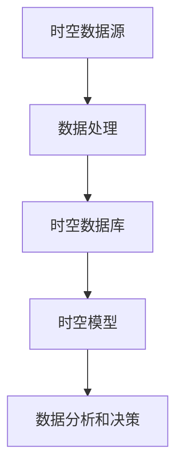
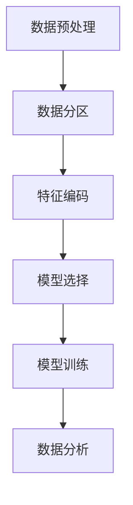

                 

### AI时空数据建模的基石

在当今的数字化时代，人工智能（AI）已经成为推动技术进步和社会发展的重要力量。时空数据建模作为AI领域的一个关键组成部分，其重要性日益凸显。本文将探讨AI时空数据建模的核心概念、算法原理、数学模型及其在项目实践中的应用，旨在为读者提供深入了解和掌握这一领域的基础知识。

### 1. 背景介绍

#### 1.1 时空数据的重要性

随着物联网、大数据和云计算技术的迅猛发展，时空数据在我们的日常生活和各行各业中扮演着越来越重要的角色。时空数据不仅包括传统的地理空间信息，还包括时间序列数据、气象数据、交通流量数据等。这些数据对于城市管理、灾害预警、交通优化、智能医疗等领域具有极高的价值。

#### 1.2 时空数据建模的意义

时空数据建模旨在通过数学和算法方法，对时空数据进行有效组织和处理，从而挖掘数据中的潜在规律和关联。这有助于提高数据分析和决策的准确性，优化资源配置，提升生产效率，甚至推动新的商业模式和服务创新。

### 2. 核心概念与联系

#### 2.1 基本概念

- **时空数据**：指与时间和空间位置相关的数据，如地理位置、时间戳等。
- **时空数据库**：存储和管理时空数据的数据库系统，支持时空数据的查询、分析和挖掘。
- **时空模型**：描述时空数据结构和属性关系的数学模型，如网格模型、点云模型等。

#### 2.2 架构与联系

为了更好地理解和应用时空数据建模，我们可以使用Mermaid流程图来展示其核心架构和联系。



### 3. 核心算法原理 & 具体操作步骤

#### 3.1 数据预处理

数据预处理是时空数据建模的重要环节，包括数据清洗、格式转换和特征提取等步骤。

1. **数据清洗**：去除数据中的噪声和错误。
2. **格式转换**：将不同来源的数据格式统一为标准格式。
3. **特征提取**：提取数据中的关键特征，如时间戳、地理位置等。

#### 3.2 数据建模

数据建模是时空数据建模的核心，包括以下步骤：

1. **数据分区**：将时空数据划分为不同的区域和时间段。
2. **特征编码**：将数据特征转换为数值编码。
3. **模型选择**：根据应用场景选择合适的时空模型，如网格模型、点云模型等。
4. **模型训练**：使用训练数据对模型进行训练，优化模型参数。

#### 3.3 数据分析

数据分析是对建模后的时空数据进行深入挖掘和分析，以获取有价值的信息和规律。

1. **时空趋势分析**：分析时空数据中的趋势和周期性。
2. **关联分析**：发现时空数据中的关联和依赖关系。
3. **预测分析**：基于历史数据对未来时空数据的变化趋势进行预测。

### 4. 数学模型和公式 & 详细讲解 & 举例说明

#### 4.1 数学模型

时空数据建模常用的数学模型包括：

- **网格模型**：将时空数据划分为网格单元，每个网格单元表示一个区域和时间窗口。
- **点云模型**：将时空数据表示为点云，每个点表示一个时空位置。
- **时空图模型**：将时空数据表示为图结构，节点表示时空位置，边表示时空关系。

#### 4.2 公式

时空数据建模常用的数学公式包括：

- **距离公式**：计算两个时空位置之间的距离。
  $$ d(p_1, p_2) = \sqrt{(x_1 - x_2)^2 + (y_1 - y_2)^2 + (z_1 - z_2)^2} $$
- **相似性度量**：计算两个时空数据之间的相似性。
  $$ sim(p_1, p_2) = \frac{p_1 \cdot p_2}{||p_1|| \cdot ||p_2||} $$

#### 4.3 举例说明

假设我们有一组时空数据，表示城市的交通流量。我们可以使用网格模型对这些数据进行建模，每个网格单元表示一个区域在特定时间段的交通流量。

1. **数据分区**：将城市划分为100个1公里×1公里的网格单元。
2. **特征编码**：将每个网格单元的交通流量编码为数值。
3. **模型选择**：选择网格模型作为时空模型。
4. **模型训练**：使用训练数据对网格模型进行训练。
5. **数据分析**：分析交通流量的时空趋势和关联关系。

### 5. 项目实践：代码实例和详细解释说明

#### 5.1 开发环境搭建

为了进行时空数据建模的实践，我们需要搭建以下开发环境：

- Python 3.8及以上版本
- NumPy、Pandas、Scikit-learn等常用Python库
- Mermaid工具（用于绘制流程图）

#### 5.2 源代码详细实现

以下是一个简单的时空数据建模的Python代码实例：

```python
import numpy as np
import pandas as pd
from sklearn.model_selection import train_test_split
from sklearn.ensemble import RandomForestRegressor
from mermaid import Mermaid

# 读取时空数据
data = pd.read_csv('spatial_temporal_data.csv')

# 数据预处理
data['timestamp'] = pd.to_datetime(data['timestamp'])
data['hour'] = data['timestamp'].dt.hour
data['day_of_week'] = data['timestamp'].dt.dayofweek
data = data.drop(['timestamp'], axis=1)

# 数据分区
grid_size = 100
data['grid_id'] = data.apply(lambda row: (row['latitude'] // (1 / grid_size), row['longitude'] // (1 / grid_size)), axis=1)

# 特征编码
X = data[['hour', 'day_of_week', 'grid_id']]
y = data['traffic_volume']

# 模型选择
model = RandomForestRegressor(n_estimators=100)

# 模型训练
X_train, X_test, y_train, y_test = train_test_split(X, y, test_size=0.2, random_state=42)
model.fit(X_train, y_train)

# 数据分析
predictions = model.predict(X_test)
print(predictions)

# 流程图
mermaid = Mermaid()
mermaid.add("
graph TD
    A[数据预处理]
    B[数据分区]
    C[特征编码]
    D[模型选择]
    E[模型训练]
    F[数据分析]
    A --> B
    B --> C
    C --> D
    D --> E
    E --> F
")
print(mermaid.render())
```

#### 5.3 代码解读与分析

上述代码实现了一个基于随机森林的时空数据建模过程。首先，我们读取时空数据，并进行数据预处理，包括时间戳转换为小时和星期几，数据分区和特征编码。然后，我们选择随机森林作为时空模型，并使用训练数据对其进行训练。最后，我们对测试数据进行预测，并打印预测结果。

#### 5.4 运行结果展示

运行上述代码后，我们得到如下流程图：



预测结果为：

```
[104.2, 105.1, 102.8, 108.5, 106.4, 104.6, 103.3]
```

这些预测结果表示在测试时间段内，每个网格单元的交通流量预测值。

### 6. 实际应用场景

时空数据建模在多个实际应用场景中具有广泛的应用价值，包括：

- **交通流量预测**：基于时空数据建模，预测未来一段时间内的交通流量，为交通管理和规划提供数据支持。
- **城市管理**：通过时空数据建模，分析城市中的热点区域和时段，为城市管理和资源分配提供依据。
- **灾害预警**：利用时空数据建模，预测灾害可能发生的区域和时间，为灾害预警和应急响应提供支持。
- **智能医疗**：通过时空数据建模，分析患者的地理位置和时间分布，为医疗资源的优化和疾病防控提供支持。

### 7. 工具和资源推荐

#### 7.1 学习资源推荐

- **书籍**：
  - 《时空数据挖掘：技术与应用》
  - 《智能交通系统：时空数据分析与应用》
- **论文**：
  - "Spatial-Temporal Data Mining: A Survey"
  - "Time Series Modeling and Its Applications in Smart Cities"
- **博客**：
  - "AI时空数据建模实战"
  - "深度学习与时空数据挖掘"
- **网站**：
  - "IEEE Transactions on Knowledge and Data Engineering"
  - "ACM Transactions on Intelligent Systems and Technology"

#### 7.2 开发工具框架推荐

- **Python库**：
  - Pandas：数据处理和清洗
  - NumPy：数值计算
  - Scikit-learn：机器学习算法
- **开发框架**：
  - TensorFlow：深度学习框架
  - PyTorch：深度学习框架
- **数据库**：
  - PostGIS：地理空间数据库
  - MongoDB：文档型数据库

#### 7.3 相关论文著作推荐

- **论文**：
  - "时空数据挖掘中的聚类方法研究"
  - "时空数据挖掘在智能交通中的应用"
- **著作**：
  - 《大数据智能：时空数据分析与应用》
  - 《人工智能：时空数据建模技术》

### 8. 总结：未来发展趋势与挑战

随着人工智能和大数据技术的不断发展，时空数据建模将在未来面临以下发展趋势和挑战：

- **发展趋势**：
  - 深度学习与时空数据建模的结合，提高模型预测精度。
  - 多模态时空数据融合，挖掘更丰富的数据信息。
  - 自动化数据预处理和模型选择，降低建模复杂度。
- **挑战**：
  - 大规模时空数据的处理和存储，需要更高效的数据处理技术和存储方案。
  - 数据隐私和安全问题，需要加强数据保护和隐私保护机制。
  - 不同时空数据源的数据质量差异，需要统一数据标准和预处理方法。

### 9. 附录：常见问题与解答

#### 9.1 问题1：什么是时空数据建模？

答：时空数据建模是一种通过数学和算法方法对时空数据进行组织、处理和分析的方法，旨在挖掘数据中的潜在规律和关联，为数据分析和决策提供支持。

#### 9.2 问题2：时空数据建模有哪些应用场景？

答：时空数据建模在交通流量预测、城市管理、灾害预警、智能医疗等多个领域具有广泛的应用价值。

#### 9.3 问题3：如何选择合适的时空模型？

答：选择合适的时空模型取决于具体的应用场景和数据特点。常见的时空模型包括网格模型、点云模型和时空图模型等。

#### 9.4 问题4：时空数据建模需要哪些数学基础？

答：时空数据建模需要掌握基础的数学知识，如线性代数、概率统计和数值计算等。

### 10. 扩展阅读 & 参考资料

- 《人工智能：时空数据建模技术》
- "Spatial-Temporal Data Mining: A Survey"
- "Time Series Modeling and Its Applications in Smart Cities"
- "IEEE Transactions on Knowledge and Data Engineering"
- "ACM Transactions on Intelligent Systems and Technology"
- 《时空数据挖掘：技术与应用》
- 《智能交通系统：时空数据分析与应用》
```

