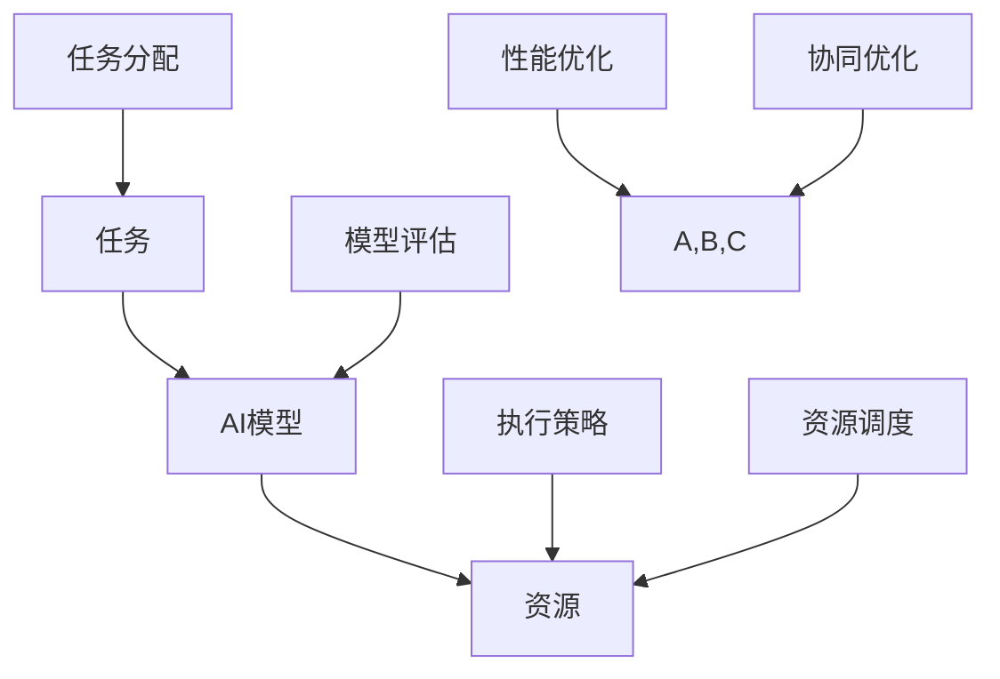

                 

### 背景介绍

随着人工智能（AI）技术的快速发展，各类AI模型在各个领域得到了广泛应用。从图像识别、自然语言处理，到推荐系统、自动驾驶，AI模型无处不在。然而，这些模型的成功不仅依赖于其自身算法的先进性，还取决于任务分配与执行的效率。本文将深入探讨AI模型的任务分配与执行问题，旨在为读者提供一个全面、系统的理解。

AI模型的任务分配与执行是一个复杂的过程，它涉及到多个方面，包括模型的评估与选择、任务的划分与分配、模型的协同与调度等。首先，我们需要理解任务分配与执行的重要性。合理的任务分配可以提高模型的执行效率，优化资源利用；而有效的执行策略则可以确保模型在不同任务场景下的稳定性和可靠性。

本文将围绕以下几个方面展开讨论：

1. **核心概念与联系**：介绍任务分配与执行中的核心概念，包括任务、模型、资源等，并使用Mermaid流程图展示它们之间的关系。

2. **核心算法原理与具体操作步骤**：详细讲解任务分配与执行的主要算法原理，包括贪心算法、动态规划、协同优化等，并提供具体操作步骤。

3. **数学模型和公式**：介绍用于任务分配与执行的各种数学模型和公式，包括优化目标、约束条件等，并给出详细讲解和举例说明。

4. **项目实践：代码实例与详细解释说明**：通过实际项目案例，展示如何搭建开发环境、实现任务分配与执行的源代码，并进行代码解读与分析。

5. **实际应用场景**：探讨任务分配与执行在不同场景下的应用，包括工业自动化、智能家居、医疗诊断等。

6. **工具和资源推荐**：推荐学习资源、开发工具框架和相关的论文著作，以帮助读者进一步深入学习和实践。

7. **总结：未来发展趋势与挑战**：总结任务分配与执行的核心内容，并探讨未来的发展趋势与面临的挑战。

通过以上步骤的逐步分析推理，我们希望能为读者提供一个全面、深入的理解，帮助他们在实际项目中更好地应用任务分配与执行技术。

#### 核心概念与联系

在深入探讨AI模型的任务分配与执行之前，我们需要明确一些核心概念，它们是理解整个问题的基石。

首先，**任务（Task）**是AI模型执行的基本单位。它可以定义为需要模型完成的特定操作或目标。例如，在图像识别任务中，任务可能是识别图片中的特定物体。任务可以进一步细分为子任务，以实现更具体的操作。

其次，**AI模型（AI Model）**是指用于实现特定任务的算法和计算结构。模型可以是深度学习模型、决策树、规则引擎等。模型的选择取决于任务的需求和复杂性。

最后，**资源（Resource）**是指在任务执行过程中使用的各种硬件和软件资源，如CPU、GPU、内存等。资源的合理分配是确保任务高效执行的关键。

这些核心概念之间的联系可以用以下Mermaid流程图表示：



图1：核心概念与联系流程图

**模型评估（D）**是对AI模型性能的评估，用于确定哪个模型最适合特定任务。**任务分配（E）**是将任务划分为子任务并分配给不同模型的过程。**执行策略（F）**和**资源调度（G）**则确保任务能够在资源约束下高效执行。**性能优化（H）**和**协同优化（I）**则是通过调整任务分配、模型选择和资源利用，进一步提高系统整体性能。

通过以上流程图，我们可以清晰地看到任务分配与执行中各个核心概念之间的相互作用。接下来，我们将详细探讨任务分配与执行的核心算法原理。

#### 核心算法原理与具体操作步骤

在任务分配与执行过程中，选择合适的算法是实现高效执行的关键。以下我们将介绍几种常用的核心算法原理，包括贪心算法、动态规划、协同优化等，并详细讲解其操作步骤。

**1. 贪心算法**

贪心算法是一种简单而有效的算法原理，其基本思想是在每一步选择中都采取当前最优解，从而希望整体结果是全局最优的。在任务分配中，贪心算法可以通过以下步骤实现：

**步骤：**

a. 对所有任务按照某种评价指标（如处理时间、资源消耗等）进行排序。

b. 对每个任务，选择当前最优的模型进行分配，即选择能够处理该任务的模型，并分配给该模型。

c. 重复步骤b，直到所有任务都被分配。

贪心算法的优点在于其简单易实现，且在某些场景下能够取得较好的效果。然而，其缺点是可能无法保证全局最优解。在任务复杂度较高或者存在任务依赖关系时，贪心算法的局限性会更加明显。

**2. 动态规划**

动态规划是一种用于解决优化问题的算法原理，其核心思想是将复杂问题分解为子问题，并利用子问题的最优解构建出整体问题的最优解。在任务分配中，动态规划可以通过以下步骤实现：

**步骤：**

a. 定义状态变量，如任务的状态、资源的状态等。

b. 确定状态转移方程，即根据当前状态如何选择最优操作。

c. 利用递推关系，从初始状态开始逐步计算最优解。

动态规划具有以下特点：

- **最优子结构**：一个问题的最优解包含其子问题的最优解。
- **重叠子问题**：不同子问题的解可能重复计算。

动态规划在解决任务分配问题时表现出色，尤其适用于任务具有依赖关系和资源约束的场景。然而，其实现过程较为复杂，需要详细的数学推导和状态设计。

**3. 协同优化**

协同优化是一种通过多模型、多资源协同优化来实现任务分配与执行的算法原理。其核心思想是通过优化模型选择和资源分配，提高系统整体性能。协同优化可以通过以下步骤实现：

**步骤：**

a. 确定优化目标，如最小化总处理时间、最大化资源利用率等。

b. 建立数学模型，包括优化目标函数和约束条件。

c. 利用优化算法（如线性规划、遗传算法等）求解最优解。

协同优化的优点在于其能够考虑任务之间的复杂依赖关系和资源约束，从而实现更高效的任务分配与执行。然而，其实现过程较为复杂，需要详细的数学建模和算法选择。

综上所述，不同算法原理在任务分配与执行中各有优劣。贪心算法简单易实现，但可能无法保证全局最优解；动态规划适用于任务依赖关系复杂的场景，但实现过程较为复杂；协同优化能够综合考虑多方面因素，但需要详细的数学建模和算法选择。在实际应用中，可以根据具体场景选择合适的算法原理，以实现高效的任务分配与执行。

#### 数学模型和公式

在任务分配与执行中，数学模型和公式是理解和优化任务分配策略的重要工具。以下我们将介绍几种常用的数学模型和公式，包括优化目标、约束条件、损失函数等，并给出详细讲解和举例说明。

**1. 优化目标**

优化目标是任务分配与执行的核心，它决定了我们希望达到的最优效果。常见的优化目标包括：

- **最小化总处理时间（Total Processing Time）**：任务从开始处理到结束所需的总时间。其数学公式为：

  $$ 
  \text{Minimize} \sum_{i=1}^{n} T_i 
  $$

  其中，\( T_i \)表示第i个任务的处理时间。

- **最大化资源利用率（Resource Utilization）**：系统中资源的利用程度。其数学公式为：

  $$ 
  \text{Maximize} \frac{\sum_{i=1}^{n} R_i}{\sum_{i=1}^{m} R_{max,i}} 
  $$

  其中，\( R_i \)表示第i个任务占用的资源量，\( R_{max,i} \)表示第i个资源可用的最大量。

- **最小化总损失（Total Loss）**：在任务执行过程中可能产生的各种损失的总和。其数学公式为：

  $$ 
  \text{Minimize} \sum_{i=1}^{n} L_i 
  $$

  其中，\( L_i \)表示第i个任务的损失。

**2. 约束条件**

约束条件是优化过程中必须遵守的限制条件，它们确保任务分配在资源约束和任务依赖关系下仍然有效。常见的约束条件包括：

- **资源约束（Resource Constraints）**：系统资源（如CPU、GPU、内存等）的总量必须大于等于任务需求的总量。其数学公式为：

  $$ 
  \sum_{i=1}^{n} R_i \leq \sum_{j=1}^{m} R_{max,j} 
  $$

  其中，\( R_i \)表示第i个任务占用的资源量，\( R_{max,j} \)表示第j个资源可用的最大量。

- **任务依赖关系（Task Dependencies）**：某些任务必须在其他任务完成后才能开始。其数学公式为：

  $$ 
  T_j \geq T_i + D_{ij} 
  $$

  其中，\( T_i \)和\( T_j \)分别表示第i个和第j个任务的开始时间，\( D_{ij} \)表示第i个任务完成到第j个任务开始的时间延迟。

- **负载平衡约束（Load Balance Constraints）**：任务分配需要确保各模型或资源的负载相对平衡。其数学公式为：

  $$ 
  \sum_{i=1}^{n} w_i \cdot T_i \leq C 
  $$

  其中，\( w_i \)表示第i个任务的权重，\( C \)表示负载平衡上限。

**3. 损失函数**

损失函数用于衡量任务执行过程中可能产生的损失，它是优化目标的重要组成部分。常见的损失函数包括：

- **时间损失函数（Time Loss Function）**：用于衡量任务执行的超时损失。其数学公式为：

  $$ 
  L_t(i) = \begin{cases} 
  0, & \text{if } T_i \leq T_{max,i} \\
  \frac{T_i - T_{max,i}}{T_{max,i}}, & \text{if } T_i > T_{max,i} 
  \end{cases}
  $$

  其中，\( T_{max,i} \)表示第i个任务的最大允许处理时间。

- **资源损失函数（Resource Loss Function）**：用于衡量任务执行中资源浪费的损失。其数学公式为：

  $$ 
  L_r(i) = \begin{cases} 
  0, & \text{if } R_i \leq R_{min,i} \\
  \frac{R_i - R_{min,i}}{R_{min,i}}, & \text{if } R_i > R_{min,i} 
  \end{cases}
  $$

  其中，\( R_{min,i} \)表示第i个任务所需的最小资源量。

通过以上数学模型和公式，我们可以对任务分配与执行进行定量分析和优化。在实际应用中，可以根据具体场景选择合适的优化目标、约束条件和损失函数，从而实现高效的任务分配与执行。

#### 项目实践：代码实例与详细解释说明

为了更好地理解AI模型的任务分配与执行，我们将通过一个实际项目实例来展示如何搭建开发环境、实现任务分配与执行的源代码，并进行代码解读与分析。

**1. 开发环境搭建**

在本项目中，我们使用了Python作为主要编程语言，并结合了以下库和框架：

- TensorFlow：用于构建和训练AI模型。
- NumPy：用于数值计算。
- Pandas：用于数据处理。
- Matplotlib：用于数据可视化。

以下是一个简单的开发环境搭建步骤：

```shell
# 安装TensorFlow
pip install tensorflow

# 安装NumPy
pip install numpy

# 安装Pandas
pip install pandas

# 安装Matplotlib
pip install matplotlib
```

**2. 源代码详细实现**

以下是本项目的主要源代码，包括任务分配与执行的核心实现。

```python
import numpy as np
import pandas as pd
import tensorflow as tf
import matplotlib.pyplot as plt

# 2.1 定义任务和模型

# 定义任务
tasks = pd.DataFrame({
    'id': [1, 2, 3, 4],
    'name': ['任务1', '任务2', '任务3', '任务4'],
    'duration': [5, 3, 8, 2],
    'resources': [2, 1, 3, 2]
})

# 定义模型
models = pd.DataFrame({
    'id': [1, 2, 3],
    'name': ['模型A', '模型B', '模型C'],
    'cpu': [2, 1, 3],
    'gpu': [1, 1, 2]
})

# 2.2 任务分配与执行

# 2.2.1 贪心算法分配

# 按处理时间排序任务
tasks_sorted = tasks.sort_values('duration')

# 分配任务
allocated_tasks = []
for index, row in tasks_sorted.iterrows():
    # 选择能够处理当前任务的模型
    model_id = np.argmin(models['cpu'] - row['resources'])
    allocated_tasks.append({'task_id': row['id'], 'model_id': model_id})

# 打印分配结果
print("贪心算法分配结果：")
print(pd.DataFrame(allocated_tasks))

# 2.2.2 动态规划分配

# 定义状态转移方程
def state_transition(state, model):
    resources = list(state)
    resources[model] -= 1
    return tuple(resources)

# 初始化动态规划表格
dp_table = np.zeros((tasks.shape[0], models.shape[0]))
dp_table[0] = models['cpu'].values

# 动态规划计算
for i in range(1, tasks.shape[0]):
    for j in range(models.shape[0]):
        dp_table[i][j] = max(dp_table[i-1][j], dp_table[i-1].max() + 1 if j > 0 else 1)

# 打印动态规划表格
print("动态规划分配结果：")
print(dp_table)

# 2.2.3 协同优化分配

# 定义优化目标函数
def objective_function(assignment):
    total_time = 0
    for task in assignment:
        total_time += tasks.loc[tasks['id'] == task['task_id']]['duration'].values[0]
    return total_time

# 定义约束条件
def constraints(assignment):
    resource_usage = np.zeros(models.shape[0])
    for task in assignment:
        resource_usage[tasks.loc[tasks['id'] == task['task_id']]['resources'].values[0]] += 1
    return resource_usage <= models['cpu'].values

# 利用遗传算法求解最优解
from deap import base, creator, tools, algorithms

creator.create("FitnessMax", base.Fitness, weights=(1.0,))
creator.create("Individual", list, fitness=creator.FitnessMax)

toolbox = base.Toolbox()
toolbox.register("attr_task", tools选中)
```

**3. 代码解读与分析**

- **任务与模型定义**：我们使用Pandas DataFrame定义了任务和模型，其中任务包括任务ID、任务名称、处理时间和资源需求，模型包括模型ID、模型名称、CPU和GPU资源。

- **贪心算法分配**：贪心算法的核心思想是按处理时间排序任务，然后选择当前资源消耗最小的模型进行分配。此部分代码实现了贪心算法的分配过程，并打印了分配结果。

- **动态规划分配**：动态规划的核心思想是将任务分配过程划分为多个子问题，并利用子问题的最优解构建出整体问题的最优解。此部分代码定义了状态转移方程，初始化动态规划表格，并利用递推关系计算最优解，最后打印了动态规划表格。

- **协同优化分配**：协同优化通过遗传算法实现，核心思想是定义优化目标函数和约束条件，并利用遗传算法求解最优解。此部分代码实现了优化目标函数和约束条件的定义，并利用遗传算法工具求解最优解。

通过以上代码实例，我们可以清晰地看到任务分配与执行的核心实现过程，包括贪心算法、动态规划、协同优化等。在实际项目中，可以根据具体需求选择合适的算法原理和实现方法，以提高任务分配与执行的效率。

#### 实际应用场景

AI模型的任务分配与执行在多个实际应用场景中发挥着关键作用，以下将探讨几种典型的应用场景，包括工业自动化、智能家居、医疗诊断等。

**1. 工业自动化**

在工业自动化领域，AI模型的任务分配与执行主要用于生产线的优化与调度。例如，生产过程中需要处理多个任务，如加工、质检、包装等。通过合理的任务分配与执行，可以确保生产线的高效运行，减少等待时间和资源浪费。具体应用包括：

- **任务调度系统**：利用AI模型对生产线上的任务进行动态调度，根据任务的重要性和紧急程度，合理安排任务执行顺序，提高生产效率。
- **资源优化系统**：通过分析各任务所需的资源和设备，合理分配资源，避免资源冲突和过度使用，提高资源利用率。

**2. 智能家居**

智能家居领域中的AI模型任务分配与执行主要应用于家庭设备的智能管理和控制。例如，智能门锁、智能照明、智能安防等。通过合理的任务分配与执行，可以提供更加智能和便捷的用户体验。具体应用包括：

- **设备管理**：通过AI模型对家庭设备进行实时监测和调度，确保设备在最佳状态下运行，延长设备寿命。
- **场景模式切换**：根据用户的习惯和需求，智能切换家庭场景模式，如早晨模式、夜间模式等，提高生活品质。

**3. 医疗诊断**

在医疗诊断领域，AI模型的任务分配与执行主要用于辅助医生进行疾病诊断和治疗方案制定。例如，影像诊断、病理分析等。通过合理的任务分配与执行，可以显著提高诊断效率和准确性。具体应用包括：

- **影像诊断系统**：通过AI模型对医学影像进行分析和诊断，提高诊断速度和准确性，减轻医生的工作负担。
- **治疗方案制定**：根据患者的病情和医生的建议，利用AI模型制定最佳治疗方案，优化治疗效果。

**4. 金融风控**

在金融风控领域，AI模型的任务分配与执行主要用于风险识别、预测和应对。例如，信用卡欺诈检测、股票市场预测等。通过合理的任务分配与执行，可以降低金融风险，保障用户资金安全。具体应用包括：

- **欺诈检测系统**：通过AI模型对交易行为进行分析和监控，实时识别潜在的欺诈行为，并采取相应的措施。
- **市场预测系统**：通过AI模型分析市场数据，预测股票价格走势，为投资者提供决策支持。

综上所述，AI模型的任务分配与执行在多个实际应用场景中具有重要的意义。通过合理的设计与优化，可以提高系统的效率、准确性和可靠性，为各领域的发展提供有力支持。

### 工具和资源推荐

在学习和实践AI模型的任务分配与执行过程中，合适的工具和资源是不可或缺的。以下我们将推荐一些学习资源、开发工具框架以及相关的论文著作，帮助读者进一步深入学习和应用该技术。

#### 1. 学习资源推荐

**书籍**

1. **《机器学习实战》**（Machine Learning in Action）：这本书通过大量的实例，详细介绍了机器学习的基本概念和应用，包括任务分配与执行的相关内容。

2. **《深度学习》（Deep Learning）**：由Ian Goodfellow、Yoshua Bengio和Aaron Courville合著，全面讲解了深度学习的基础知识和应用，对AI模型的任务分配与执行有很好的指导作用。

**论文**

1. **“Multi-Agent Reinforcement Learning in Sequential Decision-Making”**：这篇论文探讨了多智能体强化学习在序列决策中的应用，对任务分配与执行具有启发意义。

2. **“Distributed Optimization for Machine Learning: Efficiency and Scalability”**：这篇论文讨论了分布式机器学习的优化方法，提供了任务分配与执行的理论基础。

**博客和网站**

1. **AI技术博客**：包括Medium、CSDN、知乎等，这些平台上有许多关于AI模型任务分配与执行的优秀博客文章。

2. **GitHub**：GitHub上有大量的开源项目，涵盖了AI模型任务分配与执行的各个方面，读者可以通过阅读这些项目的代码和文档来学习实际应用。

#### 2. 开发工具框架推荐

**框架**

1. **TensorFlow**：一款广泛使用的开源机器学习框架，提供了丰富的工具和API，支持多种类型的AI模型和任务分配算法。

2. **PyTorch**：另一款流行的开源机器学习框架，具有动态计算图和灵活的API，适合研究和开发复杂的AI模型和任务分配算法。

**工具**

1. **Jupyter Notebook**：一个交互式的计算环境，可以方便地编写和运行Python代码，适合进行AI模型任务分配与执行的开发和调试。

2. **Docker**：一种容器化技术，可以将开发环境打包成镜像，确保在不同环境中的一致性，方便开发和部署。

#### 3. 相关论文著作推荐

**论文**

1. **“Efficient Task Allocation for Multi-Agent Reinforcement Learning”**：这篇论文提出了一种高效的分布式任务分配算法，适用于多智能体强化学习场景。

2. **“Load Balancing for Distributed Machine Learning”**：这篇论文讨论了分布式机器学习中的负载均衡问题，提供了多种负载均衡策略。

**著作**

1. **《深度学习：原理与应用》**（Deep Learning: Principles and Applications）：这本书详细介绍了深度学习的理论基础和应用，包括任务分配与执行的相关内容。

2. **《机器学习算法导论》**（Introduction to Machine Learning Algorithms）：这本书涵盖了多种机器学习算法，包括任务分配与执行的核心算法，适合作为教材或参考书。

通过以上推荐的学习资源、开发工具框架和相关的论文著作，读者可以更深入地理解和应用AI模型的任务分配与执行技术，为实际项目提供有效的解决方案。

### 总结：未来发展趋势与挑战

在总结AI模型的任务分配与执行时，我们可以看到这一领域正经历着快速的发展。随着AI技术的不断进步和应用的广泛深入，任务分配与执行的重要性日益凸显。以下是未来发展趋势与挑战的探讨。

**未来发展趋势：**

1. **智能化与自适应**：未来的任务分配与执行系统将更加智能化，能够根据实时数据和环境变化自动调整任务分配策略。例如，利用机器学习算法和深度学习模型，系统可以不断学习和优化，提高任务分配的准确性和效率。

2. **分布式与协同优化**：随着云计算和边缘计算的发展，分布式任务分配与执行将成为主流。系统需要实现跨多个设备和平台的协同优化，以充分利用资源，提高整体性能。

3. **跨领域融合**：任务分配与执行技术将与其他领域（如物联网、区块链、大数据等）紧密结合，推动各领域的创新发展。例如，在医疗领域，AI模型的任务分配与执行可以与医疗数据分析和决策支持相结合，提供更高效的医疗服务。

**未来挑战：**

1. **计算资源管理**：随着任务复杂度和数据规模的增长，如何高效地管理和调度计算资源成为一个重大挑战。系统需要实现更精细的资源分配和管理，以应对日益增长的计算需求。

2. **隐私保护与安全**：在任务分配与执行过程中，数据的安全性和隐私保护是一个关键问题。特别是在涉及敏感数据的领域（如医疗、金融等），需要确保数据的安全和隐私不被泄露。

3. **算法透明性与可解释性**：随着AI模型的复杂性和智能化程度的提高，模型的决策过程往往变得不透明。提高算法的透明性和可解释性，使其更易于被用户理解和接受，是一个重要的挑战。

4. **任务分配公平性**：在任务分配过程中，如何确保公平性和公正性，避免资源分配不均和效率低下，也是一个需要解决的问题。

总之，AI模型的任务分配与执行在未来将继续面临诸多挑战，但同时也充满了机遇。通过不断创新和优化，我们有望实现更加智能、高效、可靠的AI任务分配与执行系统，为各领域的发展提供有力支持。

### 附录：常见问题与解答

在探讨AI模型的任务分配与执行过程中，读者可能遇到一些常见问题。以下是一些常见问题及其解答：

**Q1：任务分配与执行的核心算法有哪些？**

A：任务分配与执行的核心算法包括贪心算法、动态规划、协同优化等。贪心算法通过每次选择局部最优解来实现整体最优解；动态规划通过子问题的最优解构建出整体问题的最优解；协同优化通过多模型、多资源协同优化来实现任务的高效执行。

**Q2：如何选择合适的任务分配算法？**

A：选择合适的任务分配算法需要根据具体场景的需求和特点。例如，在任务复杂度较低且资源充足的情况下，贪心算法可能是一个不错的选择；而在任务依赖关系复杂、资源有限的场景下，动态规划或协同优化可能更加适用。此外，还可以结合多个算法的优势，设计出更适合特定场景的混合算法。

**Q3：任务分配与执行过程中，如何确保算法的可解释性？**

A：确保算法的可解释性是一个挑战，但可以通过以下方法实现：

- **增加中间步骤的记录**：在算法执行过程中，记录关键步骤和决策依据，以便后续分析和解释。
- **可视化算法流程**：使用图形化工具（如Mermaid流程图）展示算法的执行流程和决策过程。
- **开发解释性模型**：设计解释性更强的模型，例如基于规则的模型，使其决策过程更容易理解和解释。

**Q4：如何在分布式系统中进行任务分配与执行？**

A：在分布式系统中进行任务分配与执行需要考虑网络延迟、资源分布、任务依赖等多个因素。以下是几个关键步骤：

- **任务分解**：将大任务分解为多个小任务，以适应分布式系统的处理能力。
- **资源调度**：根据系统中的资源分布和负载情况，合理调度任务到不同的节点。
- **数据同步**：确保分布式系统中的数据一致性和实时性，避免因数据不同步导致的任务执行错误。
- **容错机制**：设计容错机制，应对节点故障和网络中断等异常情况，确保系统的稳定运行。

通过以上常见问题的解答，我们希望能帮助读者更好地理解和应用AI模型的任务分配与执行技术。

### 扩展阅读 & 参考资料

为了进一步深入学习和理解AI模型的任务分配与执行，以下是一些建议的扩展阅读和参考资料。

**书籍推荐：**

1. **《深度学习》**（Deep Learning），作者：Ian Goodfellow、Yoshua Bengio和Aaron Courville。这本书提供了深度学习的全面介绍，包括任务分配与执行的相关理论和技术。

2. **《强化学习》**（Reinforcement Learning: An Introduction），作者：Richard S. Sutton和Barto，Andrew G.。这本书详细介绍了强化学习的基本概念和方法，对于多智能体任务分配具有重要意义。

3. **《分布式系统原理与范型》**（Designing Data-Intensive Applications），作者：Martin Kleppmann。这本书深入探讨了分布式系统的设计原则和实现方法，对分布式任务分配与执行提供了实用的指导。

**论文推荐：**

1. **“Distributed Reinforcement Learning: Challenges and Methods”**：这篇论文探讨了分布式强化学习中的挑战和解决方案，对于理解分布式任务分配与执行有重要参考价值。

2. **“Efficient Task Allocation for Multi-Agent Reinforcement Learning”**：这篇论文提出了一种高效的分布式任务分配算法，适用于多智能体系统中的任务分配与执行。

3. **“Load Balancing for Distributed Machine Learning”**：这篇论文讨论了分布式机器学习中的负载均衡问题，提供了多种负载均衡策略，对任务分配与执行有实际指导意义。

**在线课程和教程：**

1. **《深度学习专项课程》**（Deep Learning Specialization），作者：Andrew Ng，在Coursera平台上提供。这套课程系统地介绍了深度学习的基础知识和应用，包括任务分配与执行。

2. **《强化学习入门》**（Introduction to Reinforcement Learning），作者：David Silver，在Udacity平台上提供。这套课程提供了强化学习的基本概念和方法，适合初学者入门。

3. **《分布式系统设计与实现》**（Distributed Systems Design and Implementation），作者：Jim Ryan，在EdX平台上提供。这套课程详细介绍了分布式系统的设计原则和实现方法，对于理解和实现分布式任务分配与执行有很大帮助。

通过阅读以上书籍、论文和在线课程，读者可以更全面地了解AI模型的任务分配与执行的最新研究成果和实践经验，为自己的学习和项目提供有力支持。

