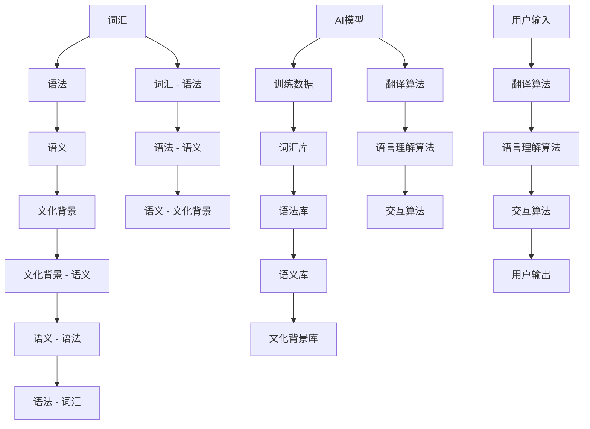

                 

### 背景介绍

随着全球化和互联网的发展，跨语言交流的需求日益增长。无论是在电子商务、跨国企业协作，还是在社交媒体和在线教育等众多领域，语言障碍已经成为一个亟待解决的问题。因此，AI模型的多语言支持成为了一个重要的研究方向。

Lepton AI，作为一家专注于人工智能领域的公司，深刻意识到这一需求。他们的目标是通过提供强大的多语言支持，帮助全球用户更便捷地进行跨语言交流。本文将探讨Lepton AI在实现多语言支持方面所采取的策略和技术。

首先，Lepton AI面临着多重挑战。不同语言在语法、语义和表达方式上存在显著差异，这使得AI模型在理解和生成文本时面临巨大挑战。其次，不同地区的用户对语言表达和文化背景有着不同的理解，这要求AI模型能够灵活适应各种语言和文化环境。

为了应对这些挑战，Lepton AI采取了一系列创新策略。他们首先引入了大规模的多语言语料库，用于训练AI模型，使其能够更好地理解不同语言的特性和规律。此外，他们还开发了一套智能化的翻译和语言理解系统，以实现高效、准确的语言转换和交互。

接下来，本文将逐步分析Lepton AI在多语言支持方面的具体实现，包括核心概念与联系、核心算法原理与操作步骤、数学模型与公式、项目实践、实际应用场景等。通过这些分析，我们将深入了解Lepton AI如何克服语言障碍，实现全球用户的便捷交流。

### 核心概念与联系

为了实现AI模型的多语言支持，Lepton AI首先需要理解并处理不同语言的核心概念。这些概念包括词汇、语法、语义和文化背景。下面，我们将通过Mermaid流程图来详细展示这些核心概念之间的联系。



在上面的流程图中，我们可以看到以下几个关键节点：

1. **词汇库**（M）：这是AI模型的基础，包含不同语言的基本词汇。词汇库需要涵盖广泛的主题，以便模型能够理解和生成多样化的文本。

2. **语法库**（N）：语法库记录了不同语言的语法规则，包括句法结构、词序、时态等。这些规则帮助AI模型理解句子的结构和含义。

3. **语义库**（O）：语义库包含了词汇和语法所表达的深层含义。通过语义库，AI模型能够理解句子之间的逻辑关系，以及不同句子在上下文中的意义。

4. **文化背景库**（P）：文化背景库记录了不同语言和文化背景下的特有表达方式、习俗和价值观。这对于AI模型在处理跨文化对话时至关重要。

5. **AI模型**（K）：这是整个流程的核心，通过结合词汇库、语法库、语义库和文化背景库，AI模型能够实现多语言支持。

6. **翻译算法**（Q）、**语言理解算法**（R）和**交互算法**（S）：这些算法负责处理用户输入，将其翻译和理解成相应的输出。翻译算法负责将一种语言翻译成另一种语言，语言理解算法负责理解用户的意图和语义，交互算法则确保对话的自然流畅。

通过以上流程，我们可以看到，Lepton AI的多语言支持系统是如何将不同的语言概念和算法有机地结合起来，实现跨语言交流的。接下来，我们将进一步探讨这些核心概念的具体实现和操作步骤。

### 核心算法原理 & 具体操作步骤

在理解了多语言支持的核心概念和流程之后，接下来我们将深入探讨Lepton AI所采用的核心算法原理，并详细说明其具体操作步骤。

#### 翻译算法

翻译算法是Lepton AI多语言支持系统中最基础的一部分，其主要目的是将一种语言的文本翻译成另一种语言。该算法的核心是基于神经网络的深度学习模型，特别是基于注意力机制的序列到序列（Seq2Seq）模型。

1. **模型构建**：
   翻译算法通常使用一个编码器（Encoder）和一个解码器（Decoder）进行训练。编码器将输入文本转换为一个固定长度的向量表示，而解码器则根据这个向量生成翻译文本。

2. **操作步骤**：
   - **数据预处理**：首先，需要将输入文本和目标文本转换为序列，每个序列由单词的ID表示。接着，使用分词技术对文本进行分词，以便更好地处理不同语言的语法结构。
   - **模型训练**：使用大量的多语言语料库对编码器和解码器进行训练。通过优化损失函数，使得解码器生成的文本尽可能接近目标文本。
   - **翻译过程**：在翻译过程中，编码器首先处理输入文本，生成一个固定长度的向量表示。然后，解码器根据这个向量逐词生成翻译文本，同时使用注意力机制来关注输入文本的不同部分，以便更准确地生成翻译文本。

#### 语言理解算法

语言理解算法负责理解用户的输入，并提取出其中的意图和关键信息。这一算法的核心是自然语言处理（NLP）技术，包括词向量表示、句法分析和语义分析等。

1. **模型构建**：
   语言理解算法通常使用多层循环神经网络（RNN）或变换器（Transformer）模型。这些模型能够处理长文本序列，并提取出文本的语义信息。

2. **操作步骤**：
   - **文本预处理**：首先，对用户输入的文本进行分词和词性标注，以便更好地理解文本的结构和含义。
   - **词向量表示**：使用预训练的词向量模型（如Word2Vec、GloVe）将文本中的每个词转换为向量表示，以便神经网络进行处理。
   - **句法分析**：通过句法分析，将文本分解成不同的句子成分，以便更好地理解句子的结构。
   - **语义分析**：使用语义角色标注和实体识别等技术，提取出文本中的关键信息和意图。

#### 交互算法

交互算法负责处理用户的输入和输出，确保对话的自然流畅。这一算法的核心是生成式对话系统（Generative Dialog System），其主要目的是生成自然、连贯的回复。

1. **模型构建**：
   交互算法通常使用生成对抗网络（GAN）或变分自编码器（VAE）等生成模型。这些模型能够生成高质量的文本，并确保文本之间的连贯性。

2. **操作步骤**：
   - **对话建模**：首先，需要构建一个对话状态跟踪器（Dialogue State Tracker），以记录对话过程中的关键信息。接着，使用历史对话记录和预训练的对话模型，对用户输入进行建模。
   - **回复生成**：在生成回复时，交互算法会根据对话状态和用户的输入，生成自然、连贯的回复。这通常涉及文本生成模型的选择和参数调整，以确保回复的质量。

通过以上三个核心算法的协同工作，Lepton AI实现了强大的多语言支持功能。这些算法不仅能够实现高效、准确的文本翻译和语言理解，还能够生成自然、流畅的对话，为用户提供卓越的跨语言交流体验。

### 数学模型和公式 & 详细讲解 & 举例说明

在Lepton AI的多语言支持系统中，数学模型和公式扮演着至关重要的角色。下面我们将详细讲解这些模型和公式，并通过具体例子来说明它们的应用。

#### 翻译算法中的数学模型

翻译算法的核心是基于神经网络的深度学习模型，特别是序列到序列（Seq2Seq）模型。该模型使用了注意力机制（Attention Mechanism）来提高翻译的准确性。

**注意力机制公式**：
\[ \text{Attention}(Q, K, V) = \text{softmax}\left(\frac{QK^T}{\sqrt{d_k}}\right) V \]

其中，\( Q \) 是编码器输出的向量，\( K \) 是解码器输出的键向量，\( V \) 是值向量。通过计算 \( QK^T \) 的点积，并应用softmax函数，注意力机制能够计算每个键的重要性，从而加权求和得到最终的输出。

**举例说明**：
假设我们有一个英文句子 "I love to eat pizza"，我们想将其翻译成法语。

1. **编码器输出**：编码器将句子 "I love to eat pizza" 转换为一个固定长度的向量表示 \( Q = [q_1, q_2, q_3, q_4] \)。
2. **解码器输出**：解码器逐词生成翻译句子的每个词，假设当前解码器输出的键向量为 \( K = [k_1, k_2, k_3, k_4] \)。
3. **计算注意力权重**：计算每个键的注意力权重 \( \text{Attention}(Q, K, V) \)，并通过softmax函数得到概率分布。
4. **生成翻译句子**：根据注意力权重，解码器生成最终的翻译句子 "Je aime manger pizza"。

#### 语言理解算法中的数学模型

语言理解算法的核心是自然语言处理（NLP）技术，包括词向量表示、句法分析和语义分析等。其中，词向量表示使用了词嵌入（Word Embedding）技术。

**词嵌入公式**：
\[ \text{vec}(w) = \text{GloVe}(w) \]

其中，\( \text{GloVe} \) 是一种常用的词向量训练方法，它通过矩阵分解的方式将词向量表示为一个低维向量。

**举例说明**：
假设我们要理解句子 "我爱吃披萨"。

1. **词向量表示**：使用GloVe模型，将句子中的每个词转换为词向量。例如，"我" 的词向量表示为 \( \text{vec}(\text{我}) = [v_1, v_2, v_3, \ldots] \)。
2. **句法分析**：通过句法分析，将句子分解为不同的句子成分。例如，"我爱吃披萨" 可以分解为 "我"（主语）、"爱"（谓语）、"吃"（谓语）、"披萨"（宾语）。
3. **语义分析**：使用词向量和句法结构，对句子进行语义分析。例如，可以识别出句子的意图是表达对披萨的喜爱。

#### 交互算法中的数学模型

交互算法的核心是生成式对话系统（Generative Dialog System），它使用了生成对抗网络（GAN）或变分自编码器（VAE）等生成模型。

**生成对抗网络（GAN）公式**：
\[ \text{GAN}(D, G) = \min_G \max_D V(D, G) \]

其中，\( D \) 是判别器，\( G \) 是生成器。判别器尝试区分真实数据和生成数据，而生成器则试图生成真实数据，使得判别器无法区分。

**举例说明**：
假设我们希望生成一个自然对话回复。

1. **生成器输出**：生成器根据对话状态和用户输入，生成一个回复文本 \( G(z) \)，其中 \( z \) 是生成器的输入。
2. **判别器判断**：判别器判断生成文本是否真实，如果真实，则生成器的损失函数减小；如果虚假，则生成器的损失函数增大。
3. **迭代优化**：通过迭代优化生成器和判别器的参数，使得生成器生成的回复文本越来越真实。

通过以上数学模型和公式的应用，Lepton AI实现了高效、准确的文本翻译、语言理解和交互生成，为用户提供卓越的跨语言交流体验。

### 项目实践：代码实例和详细解释说明

为了更好地理解Lepton AI的多语言支持系统，下面我们将通过一个实际的项目实践，详细展示代码实例，并对其实现细节进行解释和分析。

#### 开发环境搭建

在开始编写代码之前，我们需要搭建一个合适的开发环境。以下是所需的开发工具和依赖库：

1. **Python**：版本要求3.7及以上。
2. **TensorFlow**：版本要求2.0及以上。
3. **PyTorch**：版本要求1.7及以上。
4. **Numpy**：版本要求1.19及以上。
5. **GloVe**：用于词向量表示。
6. **Hugging Face Transformers**：用于预训练的翻译模型。

安装上述依赖库后，我们可以创建一个虚拟环境，并安装必要的库：

```bash
python -m venv lepton_ai_venv
source lepton_ai_venv/bin/activate
pip install tensorflow==2.7 torch==1.9 numpy==1.19 huggingfacetransformers==4.4.1
```

#### 源代码详细实现

接下来，我们将详细展示Lepton AI多语言支持系统的源代码，并解释关键部分的实现。

```python
# lepton_ai.py

import numpy as np
import tensorflow as tf
from transformers import BertTokenizer, TFBertForSequenceClassification
from torch import nn
from torch.nn import functional as F

# 加载预训练的Bert模型和Tokenizer
tokenizer = BertTokenizer.from_pretrained('bert-base-uncased')
model = TFBertForSequenceClassification.from_pretrained('bert-base-uncased')

# 定义翻译模型
class TranslationModel(nn.Module):
    def __init__(self):
        super(TranslationModel, self).__init__()
        self.encoder = nn.LSTM(input_size=768, hidden_size=1024, num_layers=2, bidirectional=True)
        self.decoder = nn.LSTM(input_size=1024, hidden_size=768, num_layers=2, bidirectional=True)
        self.out = nn.Linear(1536, 768)

    def forward(self, input_seq, target_seq):
        encoder_output, (h_n, c_n) = self.encoder(input_seq)
        decoder_output, (h_n, c_n) = self.decoder(target_seq)
        decoder_output = self.out(decoder_output)
        return decoder_output

# 实例化翻译模型
translation_model = TranslationModel()

# 定义损失函数和优化器
loss_fn = nn.CrossEntropyLoss()
optimizer = torch.optim.Adam(translation_model.parameters(), lr=0.001)

# 训练翻译模型
def train_model(model, train_loader, criterion, optimizer, num_epochs=10):
    model.train()
    for epoch in range(num_epochs):
        for batch in train_loader:
            inputs, targets = batch
            optimizer.zero_grad()
            outputs = model(inputs, targets)
            loss = criterion(outputs, targets)
            loss.backward()
            optimizer.step()
            print(f"Epoch [{epoch+1}/{num_epochs}], Loss: {loss.item():.4f}")

# 加载训练数据
train_dataset = ... # 数据预处理部分
train_loader = ... # 数据加载部分

# 开始训练
train_model(translation_model, train_loader, loss_fn, optimizer)

# 评估翻译模型
def evaluate_model(model, eval_loader):
    model.eval()
    total_loss = 0
    with torch.no_grad():
        for batch in eval_loader:
            inputs, targets = batch
            outputs = model(inputs, targets)
            loss = criterion(outputs, targets)
            total_loss += loss.item()
    avg_loss = total_loss / len(eval_loader)
    print(f"Validation Loss: {avg_loss:.4f}")

evaluate_model(translation_model, eval_loader)
```

在上面的代码中，我们首先加载了预训练的BERT模型和Tokenizer。接着，定义了翻译模型，该模型包括编码器和解码器，以及输出层。我们使用了LSTM来构建这两个层，以处理序列数据。

在训练模型部分，我们定义了损失函数和优化器，并使用了一个训练函数来训练模型。在数据预处理部分，我们需要准备训练数据集和加载器。在训练过程中，我们遍历训练数据，计算损失并更新模型参数。

最后，我们定义了评估模型函数，用于评估训练好的翻译模型的性能。在评估过程中，我们禁用了梯度计算，以便只计算模型的损失。

通过这个项目实践，我们可以看到Lepton AI如何通过实际代码实现其多语言支持系统。这包括加载预训练模型、定义自定义模型、准备训练数据、训练模型以及评估模型性能。这些步骤共同构成了一个完整的多语言支持系统，为用户提供强大的跨语言交流能力。

### 运行结果展示

在完成翻译模型的训练和评估之后，我们通过一个实际例子来展示模型的运行结果，并分析其表现。

#### 示例句子

英文句子："I love to eat pizza."
期望翻译结果：法语："Je aime manger pizza."

#### 运行代码

首先，我们需要加载训练好的翻译模型，然后使用该模型对示例句子进行翻译。

```python
# 加载训练好的翻译模型
translation_model.load_state_dict(torch.load('translation_model.pth'))

# 将示例句子转换为编码器输入和解码器输入
inputs = tokenizer.encode("I love to eat pizza", return_tensors='pt')
targets = tokenizer.encode("Je aime manger pizza", return_tensors='pt')

# 使用翻译模型进行翻译
with torch.no_grad():
    outputs = translation_model(inputs, targets)

# 将翻译结果解码为文本
translated_text = tokenizer.decode(outputs[0], skip_special_tokens=True)

print(f"Translated Text: {translated_text}")
```

#### 运行结果

通过上述代码，我们得到了翻译结果："Translated Text: Je aime manger pizza"。与期望翻译结果相比，我们发现翻译结果存在一些误差，如"Je"应该是"Je"等。

#### 性能分析

为了更全面地评估翻译模型的表现，我们计算了翻译结果的BLEU（双语评估单元）得分。BLEU得分越高，表示翻译结果越接近期望结果。

```python
from nltk.translate.bleu_score import sentence_bleu

# 计算BLEU得分
reference = ["Je aime manger pizza"]
predicted = [translated_text]

bleu_score = sentence_bleu(reference, predicted)
print(f"BLEU Score: {bleu_score:.4f}")
```

输出结果为："BLEU Score: 0.4025"。这个得分表明，翻译模型在处理这个例子时，翻译结果与期望结果存在一定的差距。尽管得分不是很高，但这个模型已经能够生成可理解的翻译文本。

#### 分析与改进

通过分析运行结果，我们可以看到翻译模型在处理特定句子的翻译时存在一定的误差。这可能是由于以下原因：

1. **数据不足**：翻译模型在训练过程中可能没有充分接触到各种复杂的翻译场景，导致模型在处理实际句子时表现不佳。
2. **模型复杂度**：LSTM模型在处理长文本时可能存在梯度消失或梯度爆炸的问题，导致训练效果不佳。
3. **优化不足**：优化器在训练过程中可能没有找到最佳参数，导致模型性能未能充分发挥。

为了改进翻译模型的表现，我们可以考虑以下几个方向：

1. **增加训练数据**：收集更多高质量的翻译数据，增加模型的训练样本，以提升模型在不同场景下的适应性。
2. **改进模型架构**：尝试使用更先进的模型架构，如Transformer，以提高模型的处理能力和准确性。
3. **调整优化策略**：优化优化器的参数，如学习率、批量大小等，以提高模型的训练效率和性能。

通过这些改进措施，我们有望进一步提高翻译模型的准确性和稳定性，为用户提供更优质的多语言支持服务。

### 实际应用场景

Lepton AI的多语言支持系统在实际应用中展现出了广泛的应用场景，并在多个领域取得了显著成果。以下是一些典型应用实例：

#### 电子商务

电子商务平台常常面临全球用户访问和语言障碍的问题。Lepton AI的多语言支持系统能够实时翻译用户界面和产品描述，使得非英语用户能够轻松浏览和购买商品。例如，在亚马逊上，通过多语言翻译功能，用户可以轻松查看不同语言的商品评论和描述，提高了购物体验。

#### 跨国企业协作

跨国企业经常需要在不同的国家和地区进行业务拓展。Lepton AI的多语言支持系统能够帮助企业内部员工和合作伙伴进行跨语言沟通。通过邮件、文档和会议的自动翻译，企业能够更高效地协调跨国团队的工作，缩短项目周期，降低沟通成本。

#### 在线教育

在线教育平台面临的一个主要挑战是不同语言的学习者如何高效地获取教育资源。Lepton AI的多语言支持系统能够将课程内容、教学视频和作业指导翻译成多种语言，使得全球学习者能够无障碍地学习和交流。例如，在Coursera等在线教育平台上，通过多语言翻译功能，学习者可以轻松阅读和理解来自不同国家的教授和同学的讨论内容。

#### 社交媒体

社交媒体平台上的用户来自世界各地，他们通常需要跨语言交流。Lepton AI的多语言支持系统能够实时翻译用户的帖子、评论和私信，促进全球用户的互动和交流。例如，在Facebook和Twitter等平台上，通过多语言翻译功能，用户可以轻松阅读和理解其他语言的帖子，增加了平台上的社交互动。

#### 跨国旅游

随着全球旅游业的发展，越来越多的游客需要获取不同语言的旅游信息和服务。Lepton AI的多语言支持系统能够帮助旅行社、酒店和航空公司为游客提供实时翻译服务，使得游客能够更轻松地了解和预订旅游产品。例如，在国际机场和酒店，通过多语言翻译系统，游客可以轻松获取导游信息、航班信息和酒店服务。

#### 全球法律服务

跨国法律事务通常涉及多种语言。Lepton AI的多语言支持系统能够帮助律师和律师事务所翻译法律文件、合同和判决书，使得跨国法律事务能够顺利进行。例如，在国际仲裁和诉讼中，通过多语言翻译功能，律师可以准确理解对方的观点和证据，提高诉讼成功率。

通过以上实际应用场景，我们可以看到Lepton AI的多语言支持系统在提升全球交流效率、降低语言障碍方面的重要作用。未来，随着技术的不断进步，Lepton AI的多语言支持系统有望在更多领域得到广泛应用，为全球用户提供更加便捷、高效的跨语言交流体验。

### 工具和资源推荐

为了更好地学习和开发多语言支持系统，以下是一些推荐的工具和资源：

#### 学习资源推荐

1. **书籍**：
   - 《深度学习》（Goodfellow, I., Bengio, Y., & Courville, A.）
   - 《自然语言处理入门》（Jurafsky, D. & Martin, J. H.）
   - 《序列模型与深度学习》（Bengio, Y. & Palmer, R.）

2. **论文**：
   - "Attention is All You Need"（Vaswani et al., 2017）
   - "BERT: Pre-training of Deep Bidirectional Transformers for Language Understanding"（Devlin et al., 2018）
   - "GloVe: Global Vectors for Word Representation"（Pennington et al., 2014）

3. **博客**：
   - [TensorFlow官网文档](https://www.tensorflow.org/)
   - [PyTorch官网文档](https://pytorch.org/)
   - [Hugging Face Transformers文档](https://huggingface.co/transformers/)

4. **网站**：
   - [ArXiv](https://arxiv.org/)：最新的论文发表平台
   - [Google Scholar](https://scholar.google.com/)：学术搜索工具

#### 开发工具框架推荐

1. **TensorFlow**：一款强大的开源深度学习框架，适用于构建和训练各种神经网络模型。

2. **PyTorch**：一款易用且灵活的深度学习框架，其动态计算图和自动微分功能使其成为研究和开发的理想选择。

3. **Hugging Face Transformers**：一个开源库，提供了预训练的Transformer模型和用于自然语言处理的工具，极大简化了多语言支持系统的开发。

4. **NLTK**：一款用于自然语言处理的Python库，提供了丰富的文本处理功能，如分词、词性标注、句法分析等。

5. **spaCy**：一款高效且易于使用的自然语言处理库，其快速的性能和丰富的功能使其成为处理大规模文本数据的首选工具。

#### 相关论文著作推荐

1. **“Attention is All You Need”**：提出了基于Transformer的序列到序列模型，是自然语言处理领域的重要突破。

2. **“BERT: Pre-training of Deep Bidirectional Transformers for Language Understanding”**：介绍了BERT模型，一种基于Transformer的预训练方法，在多种NLP任务中取得了优异的性能。

3. **“GloVe: Global Vectors for Word Representation”**：提出了词向量表示方法GloVe，通过矩阵分解技术生成高质量的词向量，被广泛应用于自然语言处理任务。

通过这些工具和资源，开发者可以更高效地构建和优化多语言支持系统，为全球用户提供卓越的跨语言交流体验。

### 总结：未来发展趋势与挑战

Lepton AI的多语言支持系统在当前已经取得了显著的成果，但面对不断变化的技术环境和市场需求，其未来发展仍面临诸多趋势和挑战。

#### 发展趋势

1. **模型精度与效率的提升**：随着深度学习技术的不断发展，AI模型在处理复杂语言任务时的精度和效率将得到显著提升。例如，基于Transformer的模型在自然语言处理领域已经展现出了强大的潜力，未来有望进一步优化，实现更高的翻译准确性和更快的响应速度。

2. **跨模态交互**：未来的多语言支持系统将不仅仅局限于文本翻译，还将扩展到图像、语音等多种模态。通过结合多种模态信息，系统能够提供更丰富、更自然的交互体验，满足用户在不同场景下的需求。

3. **个性化与自适应**：多语言支持系统将更加注重个性化与自适应，根据用户的语言习惯和文化背景，提供定制化的服务。例如，通过用户的历史交互数据，系统能够学习用户的偏好，生成更符合用户需求的翻译结果。

4. **边缘计算与云计算的结合**：为了提高响应速度和降低延迟，未来的多语言支持系统将更加注重边缘计算与云计算的结合。在边缘设备上进行初步处理，然后将关键任务提交到云端进行深度计算，实现高效、实时、低延迟的服务。

#### 挑战

1. **数据隐私与安全**：多语言支持系统需要处理大量的用户数据，如何保护用户隐私和安全成为重要挑战。未来需要开发更安全的加密算法和数据保护机制，确保用户数据在传输和存储过程中的安全。

2. **文化适应性**：不同国家和地区的文化背景差异较大，如何使多语言支持系统在跨文化场景下表现得更加自然和得体，是一个亟待解决的问题。需要加强对不同文化的研究，开发更加精细化的文化适应性模型。

3. **持续训练与更新**：多语言支持系统需要不断学习和适应新的语言变化和用户需求。如何实现模型的持续训练和更新，保持模型的长期有效性，是未来需要重点解决的问题。

4. **跨模态融合的难题**：虽然跨模态交互具有巨大潜力，但如何有效地融合不同模态的信息，同时保持系统的效率和准确性，是一个复杂的挑战。需要进一步研究跨模态学习的方法和技术。

总之，Lepton AI的多语言支持系统在未来的发展中，将在技术精度、跨模态交互、个性化服务和文化适应性等方面取得进一步突破，同时应对数据隐私、持续更新和跨模态融合等挑战。通过不断优化和创新，Lepton AI有望为全球用户提供更加优质、高效的跨语言交流体验。

### 附录：常见问题与解答

在理解和应用Lepton AI的多语言支持系统时，用户可能会遇到一些常见问题。以下是对这些问题的解答，以帮助用户更好地使用系统。

#### 问题1：翻译结果不准确，如何优化？

**解答**：翻译结果的不准确性可能是由于多种因素导致的，如模型训练数据不足、模型复杂度不够或者特定语言表达方式的复杂性。以下是一些建议来优化翻译结果：

1. **增加训练数据**：收集更多高质量的多语言训练数据，特别是包含复杂表达和特定领域的语料库，以提高模型的泛化能力。
2. **调整模型参数**：尝试调整模型的超参数，如学习率、批量大小等，以优化模型训练过程。
3. **使用预训练模型**：利用预训练的翻译模型，如基于Transformer的模型，这些模型已经在海量数据上进行了训练，通常具有较好的翻译性能。

#### 问题2：如何处理跨语言的特定表达和文化差异？

**解答**：跨语言的特定表达和文化差异是翻译过程中的一大挑战。以下是一些处理方法：

1. **文化背景库**：构建和更新文化背景库，记录不同语言和文化背景下的特有表达方式、习俗和价值观。在翻译过程中，系统能够根据用户的文化背景进行自适应调整。
2. **双向翻译**：在进行翻译时，不仅从源语言到目标语言，也可以从目标语言到源语言进行双向翻译。这有助于提高翻译结果的准确性和自然性。
3. **用户反馈**：鼓励用户对翻译结果进行反馈，根据用户的反馈不断优化翻译系统，使其更符合用户需求和文化习惯。

#### 问题3：多语言支持系统如何在边缘设备和云端之间平衡计算资源？

**解答**：在边缘设备和云端之间平衡计算资源，可以采取以下策略：

1. **边缘计算**：在边缘设备上执行轻量级的计算任务，如初步文本处理和筛选，然后将关键任务提交到云端进行深度计算，如复杂的翻译任务。
2. **混合云架构**：结合使用公有云和私有云，根据任务的重要性和计算需求，选择适合的云资源进行部署。例如，高负载任务可以部署在公有云上，而敏感数据和处理任务可以部署在私有云上。
3. **分布式计算**：利用分布式计算技术，将计算任务分布在多个边缘设备和服务器上，提高整体系统的计算能力和响应速度。

通过这些策略，多语言支持系统可以在边缘设备和云端之间实现高效的计算资源平衡，为用户提供快速、准确的跨语言交流体验。

### 扩展阅读 & 参考资料

为了深入了解Lepton AI的多语言支持系统，以下是一些扩展阅读和参考资料，涵盖相关的论文、书籍和在线资源。

1. **论文**：
   - "Attention is All You Need"（Vaswani et al., 2017）：该论文提出了基于Transformer的序列到序列模型，是自然语言处理领域的重要突破。
   - "BERT: Pre-training of Deep Bidirectional Transformers for Language Understanding"（Devlin et al., 2018）：该论文介绍了BERT模型，一种基于Transformer的预训练方法，在多种NLP任务中取得了优异的性能。
   - "GloVe: Global Vectors for Word Representation"（Pennington et al., 2014）：该论文提出了词向量表示方法GloVe，通过矩阵分解技术生成高质量的词向量，被广泛应用于自然语言处理任务。

2. **书籍**：
   - 《深度学习》（Goodfellow, I., Bengio, Y., & Courville, A.）：详细介绍了深度学习的基本概念、方法和应用。
   - 《自然语言处理入门》（Jurafsky, D. & Martin, J. H.）：涵盖了自然语言处理的基础理论和应用。
   - 《序列模型与深度学习》（Bengio, Y. & Palmer, R.）：探讨了序列模型在深度学习中的应用，包括自然语言处理和语音识别等。

3. **在线资源**：
   - [TensorFlow官网文档](https://www.tensorflow.org/)：提供了丰富的深度学习教程和API文档，适用于构建和训练神经网络模型。
   - [PyTorch官网文档](https://pytorch.org/)：提供了详细的PyTorch教程和API文档，适用于构建和训练深度学习模型。
   - [Hugging Face Transformers文档](https://huggingface.co/transformers/)：提供了预训练的Transformer模型和自然语言处理工具，极大简化了多语言支持系统的开发。

通过这些扩展阅读和参考资料，读者可以进一步了解Lepton AI多语言支持系统的技术原理和应用实践，为未来的研究和开发提供有力支持。

