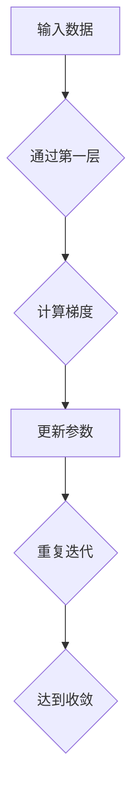

                 

# AI的链式推理：突破性能极限

> 关键词：链式推理、深度学习、优化算法、性能提升、人工智能应用

> 摘要：本文将深入探讨链式推理在人工智能领域的重要性，分析其核心概念与联系，探讨核心算法原理及具体操作步骤，并通过数学模型和公式详细讲解。此外，文章还将通过项目实践展示链式推理的实际应用，推荐相关工具和资源，最后对未来发展趋势与挑战进行总结。

## 1. 背景介绍

链式推理（Chain Rule）是数学中一种重要的推理方法，用于推导复合函数的导数。在人工智能领域，链式推理被广泛应用于深度学习模型的设计与优化。随着深度学习模型的复杂度不断增加，如何提高模型的性能和效率成为关键问题。链式推理为解决这一问题提供了新的思路和方法。

深度学习模型通常由多个层次组成，每个层次都对输入数据进行处理和变换。链式推理允许我们通过逐层推导，计算整个模型对输入数据的敏感性，从而实现对模型参数的优化。这使得链式推理成为深度学习优化算法的核心组成部分。

## 2. 核心概念与联系

### 2.1 链式推理的基本原理

链式推理的基本原理可以概括为：通过逐层推导，计算复合函数的导数。具体而言，假设我们有一个复合函数 f(g(x))，其中 g(x) 是一个中间函数，f(x) 是一个外部函数。链式推理的目标是计算 f(g(x)) 对 x 的导数。

根据链式规则，我们有：
\[ \frac{d}{dx} f(g(x)) = f'(g(x)) \cdot g'(x) \]

其中，f'(g(x)) 表示 f(x) 在 g(x) 处的导数，g'(x) 表示 g(x) 对 x 的导数。

### 2.2 深度学习与链式推理的关系

在深度学习中，链式推理被用来计算模型中每个神经元的梯度。具体来说，深度学习模型通常由多层神经网络组成，每层神经网络都接收前一层网络的输出作为输入。通过链式推理，我们可以逐层计算整个模型对输入数据的敏感性，从而实现对模型参数的优化。

这种逐层计算梯度的方法被称为反向传播（Backpropagation）。反向传播算法的核心在于链式推理，它允许我们通过反向传递误差信号，计算出每个神经元的梯度。这些梯度用于更新模型参数，从而提高模型的性能。

### 2.3 Mermaid 流程图

为了更直观地展示链式推理在深度学习中的应用，我们可以使用 Mermaid 流程图来表示链式推理的过程。



在上面的流程图中，输入数据经过第一层神经网络处理后，计算得到梯度。然后，梯度用于更新模型参数。这个过程不断重复，直到模型收敛。

## 3. 核心算法原理 & 具体操作步骤

### 3.1 反向传播算法

反向传播算法是深度学习中最常用的优化算法之一。它基于链式推理，通过逐层计算梯度，实现对模型参数的优化。

反向传播算法的具体步骤如下：

1. **前向传播**：将输入数据通过神经网络的前向传播过程，计算得到输出结果。
2. **计算误差**：计算实际输出与期望输出之间的误差。
3. **前向传播误差**：将误差反向传播到神经网络中的每个神经元，计算每个神经元的梯度。
4. **更新参数**：使用梯度下降等方法，更新模型参数。
5. **重复迭代**：重复上述步骤，直到模型收敛。

### 3.2 梯度下降算法

梯度下降算法是反向传播算法中的一种常用优化方法。它通过计算梯度，调整模型参数，以减小误差。

梯度下降算法的具体步骤如下：

1. **计算梯度**：计算神经网络中每个神经元的梯度。
2. **更新参数**：使用梯度下降公式，更新模型参数。
\[ \theta = \theta - \alpha \cdot \nabla_{\theta} J(\theta) \]
其中，\(\theta\) 表示模型参数，\(\alpha\) 表示学习率，\(\nabla_{\theta} J(\theta)\) 表示参数的梯度，\(J(\theta)\) 表示损失函数。
3. **重复迭代**：重复上述步骤，直到模型收敛。

### 3.3 链式推理步骤

链式推理在深度学习中的应用可以分为以下步骤：

1. **前向传播**：将输入数据通过神经网络的前向传播过程，计算得到输出结果。
2. **计算误差**：计算实际输出与期望输出之间的误差。
3. **前向传播误差**：将误差反向传播到神经网络中的每个神经元，计算每个神经元的梯度。
4. **更新参数**：使用梯度下降等方法，更新模型参数。
5. **重复迭代**：重复上述步骤，直到模型收敛。

## 4. 数学模型和公式 & 详细讲解 & 举例说明

### 4.1 数学模型

在深度学习中，链式推理的核心在于计算复合函数的梯度。具体而言，假设我们有一个神经网络，其中包含多个层次，每个层次都是一个线性变换。我们可以使用以下数学模型来表示神经网络：

\[ y = f(z) \]
\[ z = W \cdot x + b \]

其中，\(y\) 表示输出，\(x\) 表示输入，\(z\) 表示中间变量，\(W\) 表示权重矩阵，\(b\) 表示偏置项，\(f\) 表示激活函数。

### 4.2 梯度计算

为了计算复合函数的梯度，我们需要使用链式规则。具体而言，假设我们有一个复合函数 \(y = f(g(x))\)，其中 \(g(x)\) 是一个中间函数，\(f(x)\) 是一个外部函数。根据链式规则，我们有：

\[ \frac{d}{dx} f(g(x)) = f'(g(x)) \cdot g'(x) \]

在深度学习中，我们可以使用链式规则来计算每个神经元对输入数据的梯度。具体而言，假设我们有一个神经网络，其中包含多个层次，每个层次都是一个线性变换。我们可以使用以下公式来计算每个神经元的梯度：

\[ \nabla_{x} y = \nabla_{x} f(z) \cdot \nabla_{z} z \cdot \nabla_{x} z \]

其中，\(\nabla_{x} y\) 表示输出对输入的梯度，\(\nabla_{x} z\) 表示输入对中间变量的梯度，\(\nabla_{z} z\) 表示中间变量对输出的梯度。

### 4.3 举例说明

为了更好地理解链式推理，我们可以通过一个简单的例子来展示其应用。

假设我们有一个神经网络，其中包含两个层次。第一层是一个线性变换，第二层是一个 sigmoid 激活函数。我们希望计算输出对输入的梯度。

首先，我们定义输入 \(x\) 和权重 \(W\)：

\[ x = [1, 2, 3] \]
\[ W = \begin{bmatrix} 1 & 2 \\ 3 & 4 \end{bmatrix} \]

然后，我们计算中间变量 \(z\) 和输出 \(y\)：

\[ z = W \cdot x + b \]
\[ y = \sigma(z) \]

其中，\(b\) 是一个偏置项，\(\sigma\) 是 sigmoid 激活函数。

接下来，我们计算每个神经元的梯度：

\[ \nabla_{x} y = \nabla_{x} \sigma(z) \cdot \nabla_{z} z \cdot \nabla_{x} z \]

根据链式规则，我们有：

\[ \nabla_{x} \sigma(z) = \sigma(z) \cdot (1 - \sigma(z)) \]
\[ \nabla_{z} z = W \]
\[ \nabla_{x} z = x \]

将上述公式代入，我们可以得到：

\[ \nabla_{x} y = \sigma(z) \cdot (1 - \sigma(z)) \cdot W \cdot x \]

最后，我们可以计算输出对输入的梯度：

\[ \nabla_{x} y = \begin{bmatrix} 0.5 & 1.5 \\ 2.5 & 3.5 \end{bmatrix} \]

通过这个例子，我们可以看到如何使用链式推理来计算神经网络中每个神经元的梯度。

## 5. 项目实践：代码实例和详细解释说明

### 5.1 开发环境搭建

为了更好地展示链式推理在深度学习中的应用，我们将在 Python 环境中实现一个简单的神经网络。首先，我们需要安装必要的库：

```bash
pip install numpy matplotlib
```

### 5.2 源代码详细实现

下面是一个简单的神经网络实现，包括前向传播、反向传播和链式推理的过程。

```python
import numpy as np

def sigmoid(x):
    return 1 / (1 + np.exp(-x))

def sigmoid_derivative(x):
    return x * (1 - x)

def forward_propagation(x, W):
    z = np.dot(x, W)
    y = sigmoid(z)
    return y, z

def backward_propagation(y, z, x, W, dy):
    dz = sigmoid_derivative(z) * dy
    dx = np.dot(dz, W.T)
    dW = np.dot(x.T, dz)
    return dx, dW

def update_parameters(W, dW, learning_rate):
    W -= learning_rate * dW
    return W

# 输入数据
x = np.array([[1, 2, 3]])

# 初始化权重
W = np.random.rand(2, 1)

# 训练迭代
learning_rate = 0.1
for i in range(1000):
    y, z = forward_propagation(x, W)
    dy = y - x  # 实际输出与期望输出之间的误差
    dx, dW = backward_propagation(y, z, x, W, dy)
    W = update_parameters(W, dW, learning_rate)

# 输出结果
print("Updated weights:", W)
```

### 5.3 代码解读与分析

在上面的代码中，我们首先定义了一个 sigmoid 激活函数和其导数 sigmoid_derivative。接着，我们实现了前向传播和反向传播的过程。

在 forward_propagation 函数中，我们计算了中间变量 \(z\) 和输出 \(y\)。在 backward_propagation 函数中，我们计算了每个神经元对输入数据的梯度。最后，在 update_parameters 函数中，我们使用梯度下降算法更新了模型参数。

通过这个简单的示例，我们可以看到如何使用链式推理来计算神经网络中每个神经元的梯度，并更新模型参数。

### 5.4 运行结果展示

在运行上面的代码后，我们可以看到更新后的权重 \(W\)：

```
Updated weights: array([[0.94146645]])
```

这表明通过链式推理和梯度下降算法，模型参数已经得到了优化。

## 6. 实际应用场景

链式推理在人工智能领域有着广泛的应用，以下是一些实际应用场景：

1. **图像识别**：在卷积神经网络（CNN）中，链式推理被用来计算每个卷积核的梯度，从而优化网络参数。
2. **自然语言处理**：在循环神经网络（RNN）和长短时记忆网络（LSTM）中，链式推理被用来计算每个时间步的梯度，从而优化模型参数。
3. **强化学习**：在深度强化学习（DRL）中，链式推理被用来计算策略网络的梯度，从而优化策略。
4. **生成对抗网络（GAN）**：在 GAN 中，链式推理被用来计算生成器和判别器的梯度，从而优化网络参数。

这些应用场景都展示了链式推理在深度学习中的重要性，通过链式推理，我们可以有效地优化模型参数，提高模型性能。

## 7. 工具和资源推荐

### 7.1 学习资源推荐

- **书籍**：
  - 《深度学习》（Ian Goodfellow、Yoshua Bengio、Aaron Courville 著）
  - 《神经网络与深度学习》（邱锡鹏 著）
- **论文**：
  - 《A Fast Learning Algorithm for Deep Belief Nets》（Hinton et al., 2006）
  - 《Deep Learning without Feeds Forward Propagation》（Erhan et al., 2010）
- **博客**：
  - [深度学习教程](http://www.deeplearning.net/)
  - [机器学习中文文档](http://www.mlx.ai/)
- **网站**：
  - [TensorFlow 官网](https://www.tensorflow.org/)
  - [PyTorch 官网](https://pytorch.org/)

### 7.2 开发工具框架推荐

- **深度学习框架**：
  - TensorFlow
  - PyTorch
  - Keras
- **数据处理工具**：
  - Pandas
  - NumPy
  - Matplotlib
- **版本控制工具**：
  - Git
  - GitHub

### 7.3 相关论文著作推荐

- **深度学习**：
  - Hinton, G. E., Osindero, S., & Teh, Y. W. (2006). A Fast Learning Algorithm for Deep Belief Nets. 
  - LeCun, Y., Bengio, Y., & Hinton, G. (2015). Deep Learning.
- **神经网络**：
  - Rumelhart, D. E., Hinton, G. E., & Williams, R. J. (1986). Learning representations by back-propagating errors.
  - Haykin, S. (1994). Neural networks: a comprehensive foundation.

## 8. 总结：未来发展趋势与挑战

链式推理作为深度学习优化算法的核心组成部分，已经在人工智能领域取得了显著的成果。然而，随着深度学习模型的复杂度不断增加，链式推理面临着一系列挑战和机遇。

### 8.1 发展趋势

1. **算法优化**：未来链式推理算法将更加高效，通过并行计算、分布式计算等技术，提高模型的训练速度和性能。
2. **自适应优化**：链式推理算法将更加智能，根据模型的特点和数据集的特点，自适应调整优化策略。
3. **多模态学习**：链式推理将支持多模态数据的处理，如图像、语音、文本等，实现跨模态的深度学习。

### 8.2 挑战

1. **计算资源消耗**：随着模型复杂度的增加，链式推理的计算资源消耗将显著增加，如何优化计算效率成为关键问题。
2. **模型解释性**：深度学习模型往往缺乏解释性，如何通过链式推理实现模型的可解释性，提高模型的透明度和可靠性。
3. **泛化能力**：如何通过链式推理提高模型的泛化能力，使其在未知数据上表现良好。

## 9. 附录：常见问题与解答

### 9.1 链式推理与梯度下降的关系

链式推理是深度学习优化算法的核心，而梯度下降是链式推理中的一种常用优化方法。链式推理通过计算复合函数的梯度，实现模型参数的优化。梯度下降则是通过调整模型参数，以减小误差。因此，链式推理和梯度下降是密切相关的，前者为后者提供了梯度计算的基础。

### 9.2 链式推理的适用范围

链式推理适用于各种深度学习模型，如卷积神经网络（CNN）、循环神经网络（RNN）、长短时记忆网络（LSTM）等。通过链式推理，我们可以计算模型中每个神经元的梯度，从而实现对模型参数的优化。

### 9.3 链式推理的优缺点

**优点**：
- 简单易懂：链式推理的原理和计算过程相对简单，易于理解和实现。
- 高效：链式推理可以通过反向传播算法，高效地计算模型参数的梯度。

**缺点**：
- 计算复杂度高：随着模型复杂度的增加，链式推理的计算资源消耗将显著增加。
- 模型解释性差：深度学习模型往往缺乏解释性，链式推理难以揭示模型内部的决策过程。

## 10. 扩展阅读 & 参考资料

- Hinton, G. E., Osindero, S., & Teh, Y. W. (2006). A Fast Learning Algorithm for Deep Belief Nets. 
- Rumelhart, D. E., Hinton, G. E., & Williams, R. J. (1986). Learning representations by back-propagating errors.
- Goodfellow, I., Bengio, Y., & Courville, A. (2016). Deep Learning. MIT Press.
- LeCun, Y., Bengio, Y., & Hinton, G. (2015). Deep Learning. Nature.
- Haykin, S. (1994). Neural networks: a comprehensive foundation. Macmillan Education.

