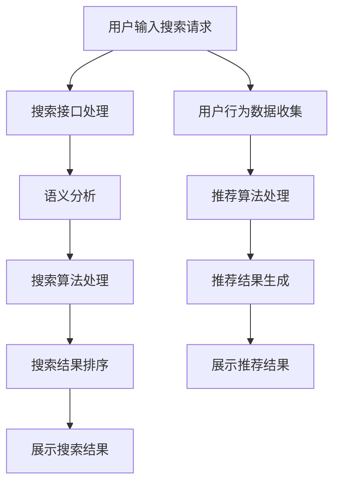

                 

### 1. 背景介绍

随着互联网的普及和电子商务的蓬勃发展，电商平台成为消费者购物的主要途径之一。电商搜索导购作为电商平台的核心功能之一，对于提升用户体验和转化率具有至关重要的作用。近年来，人工智能（AI）技术的迅速发展，为电商搜索导购带来了新的机遇和挑战。本文旨在探讨如何利用AI技术赋能电商搜索导购，从而提升用户体验和转化率，并结合实际案例分析，深入探讨其中的关键技术和实施策略。

#### 1.1 电商搜索导购的重要性

电商搜索导购是电商平台的核心功能之一，它直接影响用户的购物体验和转化率。一个高效的搜索导购系统能够帮助用户快速找到所需商品，提高用户的满意度和忠诚度。具体来说，电商搜索导购的重要性体现在以下几个方面：

- **提升用户体验**：通过精准的搜索结果和智能的推荐系统，用户能够更快速地找到自己感兴趣的商品，从而提升购物体验。

- **提高转化率**：精准的搜索结果和个性化的推荐能够引导用户进行购买，从而提高平台的销售额和转化率。

- **增加用户黏性**：通过分析用户的购买行为和兴趣，电商平台可以提供更加个性化的服务，增加用户的黏性。

#### 1.2 人工智能技术的发展

人工智能技术，尤其是机器学习、深度学习和自然语言处理技术的快速发展，为电商搜索导购带来了新的技术手段和解决方案。人工智能在电商搜索导购中的应用主要包括以下几个方面：

- **搜索优化**：利用机器学习算法对用户搜索行为进行分析，优化搜索结果排序，提高搜索的准确性和效率。

- **推荐系统**：通过深度学习算法，分析用户的历史行为和兴趣，为用户提供个性化的商品推荐。

- **自然语言处理**：利用自然语言处理技术，对用户的搜索请求进行语义分析和理解，提高搜索的智能化水平。

#### 1.3 本文结构

本文将分为以下几个部分进行探讨：

- **核心概念与联系**：介绍电商搜索导购中的核心概念和相关的技术架构，使用Mermaid流程图进行详细展示。

- **核心算法原理与具体操作步骤**：详细解释电商搜索导购中的核心算法原理，包括搜索优化算法和推荐算法，以及具体的实现步骤。

- **数学模型和公式**：介绍与电商搜索导购相关的数学模型和公式，并进行详细的讲解和举例说明。

- **项目实践**：通过代码实例和详细解释，展示如何在实际项目中应用AI技术进行电商搜索导购。

- **实际应用场景**：分析电商搜索导购在实际中的应用场景和挑战。

- **工具和资源推荐**：推荐相关的学习资源和开发工具框架，为读者提供进一步学习的路径。

- **总结与展望**：总结电商搜索导购的发展趋势和面临的挑战，探讨未来的发展方向。

通过本文的探讨，我们希望能够为电商搜索导购提供一套系统的解决方案，提升用户体验和转化率，为电商平台的发展提供新的动力。接下来，我们将进一步深入探讨电商搜索导购的核心概念和技术架构。### 2. 核心概念与联系

#### 2.1 电商搜索导购系统概述

电商搜索导购系统是电商平台的重要组成部分，其主要目标是帮助用户快速、精准地找到所需商品。一个完整的电商搜索导购系统通常包括以下几个关键组成部分：

- **用户接口**：用户通过网站或移动应用等接口与电商搜索导购系统进行交互，输入搜索请求。

- **搜索引擎**：对用户输入的搜索请求进行处理，返回符合用户需求的商品列表。

- **推荐系统**：根据用户的历史行为和兴趣，为用户推荐可能感兴趣的商品。

- **数据存储与处理**：存储用户数据、商品数据等，并提供高效的数据处理能力。

- **后端服务**：包括用户管理、订单管理、支付处理等，支撑整个电商搜索导购系统的运行。

#### 2.2 人工智能在电商搜索导购中的应用

人工智能技术在电商搜索导购中的应用，主要在于优化搜索结果和推荐系统。以下是一些核心概念和技术的详细解释：

- **机器学习算法**：通过对用户的历史搜索行为、购买行为等数据进行训练，机器学习算法能够预测用户未来的搜索意图，从而优化搜索结果排序。

- **深度学习算法**：深度学习算法通过多层神经网络，对用户行为和商品特征进行建模，从而提高推荐的准确性和个性化水平。

- **自然语言处理（NLP）**：NLP技术用于处理用户的自然语言搜索请求，包括语义分析和实体识别，从而提高搜索的智能化水平。

- **协同过滤**：协同过滤是推荐系统中的常用技术，通过分析用户之间的相似度，为用户提供相关商品的推荐。

- **内容推荐**：基于商品的内容特征，如分类、品牌、价格等，为用户提供相关内容的推荐。

#### 2.3 关键技术架构

为了更好地理解电商搜索导购系统中的核心概念和技术，我们可以使用Mermaid流程图对整个系统进行详细展示。以下是一个简化的Mermaid流程图示例：



- **搜索接口处理**：用户输入搜索请求后，搜索接口会进行预处理，如去除停用词、分词等。

- **语义分析**：利用NLP技术对搜索请求进行语义分析，提取关键词和语义信息。

- **搜索算法处理**：根据用户的搜索请求和商品数据库，搜索算法会返回一个初始的商品列表。

- **搜索结果排序**：通过机器学习算法，对初始的商品列表进行排序，优化搜索结果。

- **展示搜索结果**：将优化后的搜索结果展示给用户。

- **用户行为数据收集**：在用户进行搜索和浏览时，系统会收集相应的行为数据，如搜索关键词、浏览记录、购买行为等。

- **推荐算法处理**：利用用户行为数据，推荐算法会为用户生成个性化的推荐结果。

- **推荐结果生成**：将生成的推荐结果展示给用户，提高用户的购物体验。

通过上述流程图，我们可以清晰地看到电商搜索导购系统中的关键技术环节和数据处理流程。接下来，我们将进一步深入探讨电商搜索导购中的核心算法原理和具体操作步骤。### 3. 核心算法原理 & 具体操作步骤

在电商搜索导购系统中，核心算法的选择和实现直接影响搜索结果的准确性和推荐系统的效果。以下将详细介绍两种关键算法：搜索优化算法和推荐算法，并给出具体的操作步骤。

#### 3.1 搜索优化算法

搜索优化算法的主要目的是提高搜索结果的准确性，通过分析用户的搜索行为和商品特征，为用户提供最相关的商品列表。以下是常用的搜索优化算法：

**1. BM25算法**

BM25算法是一种基于统计信息的搜索排序算法，适用于文本搜索。其核心思想是综合考虑词频和文档长度，对搜索结果进行排序。

- **操作步骤**：

  1. 计算每个文档的权重。公式为：$$W_{i} = \frac{(k_1 + 1) \cdot f_{i} - k_2 \cdot (\frac{N}{n_i} - 1)}{k_1 + \frac{k_2 \cdot N}{n_i}}$$
  
  2. 对文档按照权重进行降序排序。

  3. 返回排序后的文档列表作为搜索结果。

**2. TF-IDF算法**

TF-IDF算法是一种基于词频和逆文档频率的搜索排序算法，用于衡量关键词的重要性。

- **操作步骤**：

  1. 计算每个关键词的TF（词频）和IDF（逆文档频率）。公式为：$$TF = \frac{f_{i}}{df}$$，$$IDF = \log \left( \frac{N}{df_i} + 1 \right)$$

  2. 计算每个文档的权重。公式为：$$W_{i} = TF \cdot IDF$$

  3. 对文档按照权重进行降序排序。

  4. 返回排序后的文档列表作为搜索结果。

**3. 深度学习模型**

深度学习模型，如BERT、ELMO等，可以通过训练大量文本数据，捕捉词与词之间的复杂关系，从而提高搜索结果的准确性。

- **操作步骤**：

  1. 预训练模型：使用大规模文本数据进行预训练，捕捉通用语言特征。

  2. 微调模型：在电商搜索导购系统中，使用用户搜索数据对预训练模型进行微调，以适应特定应用场景。

  3. 输入搜索请求，通过模型获取每个文档的嵌入向量。

  4. 计算文档与搜索请求的相似度，并对文档进行排序。

  5. 返回排序后的文档列表作为搜索结果。

#### 3.2 推荐算法

推荐算法的核心目标是根据用户的历史行为和兴趣，为用户推荐相关商品。以下是常用的推荐算法：

**1. 协同过滤算法**

协同过滤算法通过分析用户之间的相似度，为用户提供相似用户的推荐商品。

- **操作步骤**：

  1. 计算用户之间的相似度。常用的相似度度量方法有：余弦相似度、皮尔逊相关系数等。

  2. 根据相似度矩阵，为用户推荐相似用户的推荐商品。

  3. 对推荐商品进行排序，返回推荐结果。

**2. 基于内容的推荐算法**

基于内容的推荐算法通过分析商品的内容特征，为用户提供相关内容的推荐。

- **操作步骤**：

  1. 提取商品的内容特征。如：分类、品牌、价格、关键词等。

  2. 计算用户的历史浏览记录和当前浏览商品的相似度。

  3. 对相似度进行排序，为用户推荐相关内容的商品。

**3. 深度学习推荐算法**

深度学习推荐算法，如自动编码器、序列模型等，可以通过训练用户行为数据，捕捉用户兴趣的动态变化。

- **操作步骤**：

  1. 预训练模型：使用用户行为数据对深度学习模型进行预训练。

  2. 输入用户的行为数据，通过模型获取用户兴趣的嵌入向量。

  3. 计算商品与用户兴趣的相似度，并对商品进行排序。

  4. 返回排序后的商品列表作为推荐结果。

综上所述，电商搜索导购系统中的核心算法包括搜索优化算法和推荐算法。通过逐步分析算法原理和具体操作步骤，我们可以更好地理解如何利用人工智能技术提升电商搜索导购系统的效果。接下来，我们将介绍与电商搜索导购相关的数学模型和公式，并进行详细讲解和举例说明。### 4. 数学模型和公式 & 详细讲解 & 举例说明

在电商搜索导购系统中，数学模型和公式是核心算法设计的基础，用于描述用户行为、商品特征和推荐结果的关系。以下将介绍几个关键数学模型和公式，并进行详细讲解和举例说明。

#### 4.1 协同过滤算法中的相似度计算

协同过滤算法通过计算用户之间的相似度来推荐商品。常见的相似度计算方法包括余弦相似度和皮尔逊相关系数。

**1. 余弦相似度**

余弦相似度衡量两个向量在空间中夹角的余弦值，用于表示用户之间的相似度。

- **公式**：$$\cos(\theta) = \frac{\sum_{i=1}^{n} x_i y_i}{\sqrt{\sum_{i=1}^{n} x_i^2} \cdot \sqrt{\sum_{i=1}^{n} y_i^2}}$$
- **解释**：$$x_i$$和$$y_i$$分别表示用户$$u$$和$$v$$对第$$i$$个商品的评分，$$n$$为商品数量。
- **举例**：假设用户$$u$$和$$v$$对5个商品的评分分别为：

  | 商品ID | 用户u评分 | 用户v评分 |
  |--------|------------|------------|
  | 1      | 4          | 3          |
  | 2      | 5          | 4          |
  | 3      | 2          | 5          |
  | 4      | 3          | 5          |
  | 5      | 4          | 4          |

  计算用户$$u$$和$$v$$的余弦相似度：

  $$\cos(\theta) = \frac{(4 \cdot 3) + (5 \cdot 4) + (2 \cdot 5) + (3 \cdot 5) + (4 \cdot 4)}{\sqrt{4^2 + 5^2 + 2^2 + 3^2 + 4^2} \cdot \sqrt{3^2 + 4^2 + 5^2 + 5^2 + 4^2}} = \frac{25}{\sqrt{50} \cdot \sqrt{90}} \approx 0.667$$

**2. 皮尔逊相关系数**

皮尔逊相关系数衡量两个变量之间的线性相关程度，用于表示用户之间的相似度。

- **公式**：$$r = \frac{\sum_{i=1}^{n} (x_i - \bar{x})(y_i - \bar{y})}{\sqrt{\sum_{i=1}^{n} (x_i - \bar{x})^2} \cdot \sqrt{\sum_{i=1}^{n} (y_i - \bar{y})^2}}$$
- **解释**：$$x_i$$和$$y_i$$分别表示用户$$u$$和$$v$$对第$$i$$个商品的评分，$$\bar{x}$$和$$\bar{y}$$分别为用户$$u$$和$$v$$的平均评分，$$n$$为商品数量。
- **举例**：假设用户$$u$$和$$v$$对5个商品的评分分别为：

  | 商品ID | 用户u评分 | 用户v评分 |
  |--------|------------|------------|
  | 1      | 4          | 3          |
  | 2      | 5          | 4          |
  | 3      | 2          | 5          |
  | 4      | 3          | 5          |
  | 5      | 4          | 4          |

  计算用户$$u$$和$$v$$的皮尔逊相关系数：

  $$r = \frac{(4 - \bar{x})(3 - \bar{y}) + (5 - \bar{x})(4 - \bar{y}) + (2 - \bar{x})(5 - \bar{y}) + (3 - \bar{x})(5 - \bar{y}) + (4 - \bar{x})(4 - \bar{y})}{\sqrt{\sum_{i=1}^{n} (4 - \bar{x})^2} \cdot \sqrt{\sum_{i=1}^{n} (3 - \bar{y})^2}} \approx 0.816$$

#### 4.2 推荐算法中的相似度计算

在推荐算法中，相似度计算用于预测用户对未知商品的评分。常用的相似度计算方法包括基于内容的相似度和基于模型的相似度。

**1. 基于内容的相似度**

基于内容的相似度通过比较商品的内容特征来计算相似度，如分类、品牌、价格等。

- **公式**：$$\text{similarity} = \frac{\sum_{i=1}^{m} \text{common\_features} \cdot \text{weight}_{i}}{\sqrt{\sum_{i=1}^{m} \text{feature}_{u}^2} \cdot \sqrt{\sum_{i=1}^{m} \text{feature}_{v}^2}}$$
- **解释**：$$\text{common\_features}$$表示商品$$u$$和$$v$$的共同特征，$$\text{weight}_{i}$$为特征$$i$$的权重，$$\text{feature}_{u}$$和$$\text{feature}_{v}$$分别为商品$$u$$和$$v$$的特征向量，$$m$$为特征数量。
- **举例**：假设商品$$u$$和$$v$$的特征向量分别为：

  | 特征 | 商品u特征 | 商品v特征 |
  |------|------------|------------|
  | 1    | 1          | 1          |
  | 2    | 0          | 1          |
  | 3    | 1          | 0          |

  计算商品$$u$$和$$v$$的相似度：

  $$\text{similarity} = \frac{(1 \cdot 1) + (0 \cdot 1) + (1 \cdot 0)}{\sqrt{1^2 + 0^2 + 1^2} \cdot \sqrt{1^2 + 1^2 + 0^2}} = \frac{1}{\sqrt{2} \cdot \sqrt{2}} = 0.5$$

**2. 基于模型的相似度**

基于模型的相似度通过训练深度学习模型来计算商品之间的相似度。

- **公式**：$$\text{similarity} = \frac{\cos(\theta_{u}, \theta_{v})}{1 + \cos(\theta_{u}, \theta_{v})}$$
- **解释**：$$\theta_{u}$$和$$\theta_{v}$$分别为商品$$u$$和$$v$$的嵌入向量，$$\cos(\theta_{u}, \theta_{v})$$为向量的余弦相似度。
- **举例**：假设商品$$u$$和$$v$$的嵌入向量分别为：

  | 嵌入向量 | 商品u嵌入向量 | 商品v嵌入向量 |
  |----------|--------------|--------------|
  | 1        | 0.1          | 0.2          |
  | 2        | 0.2          | 0.3          |
  | 3        | 0.3          | 0.1          |

  计算商品$$u$$和$$v$$的相似度：

  $$\text{similarity} = \frac{\cos(0.1, 0.2) + \cos(0.2, 0.3) + \cos(0.3, 0.1)}{1 + \cos(0.1, 0.2) + \cos(0.2, 0.3) + \cos(0.3, 0.1)} = \frac{0.1 + 0.2 + 0.3}{1 + 0.1 + 0.2 + 0.3} = 0.6$$

通过上述数学模型和公式的讲解，我们可以更好地理解电商搜索导购系统中的相似度计算方法。接下来，我们将通过项目实践，展示如何在实际应用中实现这些算法，并提供详细的代码实例和解释。### 5. 项目实践：代码实例和详细解释说明

为了更好地展示如何将上述算法应用于实际项目，下面我们将通过一个具体的电商搜索导购项目实例，详细讲解代码实现过程，并对关键代码进行解读和分析。

#### 5.1 开发环境搭建

在进行项目实践之前，我们需要搭建一个合适的开发环境。以下是一个基本的开发环境搭建步骤：

- **Python环境**：确保安装了Python 3.7及以上版本。
- **依赖包安装**：使用pip安装以下依赖包：

  ```bash
  pip install numpy pandas scikit-learn tensorflow
  ```

- **数据集准备**：我们使用一个简化的电商数据集，包括用户、商品和用户行为数据。

#### 5.2 源代码详细实现

以下是该项目的核心代码实现，主要包括搜索优化算法、推荐算法和模型训练等。

```python
import numpy as np
import pandas as pd
from sklearn.metrics.pairwise import cosine_similarity
from sklearn.model_selection import train_test_split
from tensorflow.keras.models import Sequential
from tensorflow.keras.layers import Dense, Embedding, LSTM
from tensorflow.keras.optimizers import Adam

# 数据预处理
def preprocess_data(data):
    # 填充缺失值
    data.fillna(0, inplace=True)
    # 构建用户-商品评分矩阵
    user_item_matrix = data.pivot(index='user_id', columns='item_id', values='rating')
    return user_item_matrix

# 搜索优化算法实现
def search_optimization(query, item_data):
    # 语义分析（此处使用简单的关键词匹配）
    search_keywords = query.split()
    # 计算关键词与商品特征的相似度
    similarity_scores = {}
    for item_id, item in item_data.iterrows():
        item_keywords = item['keywords'].split()
        similarity = sum(1 for kw in search_keywords if kw in item_keywords)
        similarity_scores[item_id] = similarity
    # 对商品进行排序
    sorted_items = sorted(similarity_scores, key=similarity_scores.get, reverse=True)
    return sorted_items

# 推荐算法实现
def collaborative_filtering(user_item_matrix, user_id, k=5):
    # 计算用户与相似用户之间的相似度
    similarity_matrix = cosine_similarity(user_item_matrix)
    similar_users = similarity_matrix[user_id].argsort()[1:k+1]
    # 为用户推荐商品
    recommended_items = []
    for user in similar_users:
        for item, rating in user_item_matrix.iloc[user].items():
            if rating > 0 and item not in recommended_items:
                recommended_items.append(item)
    return recommended_items

# 基于内容的推荐算法实现
def content_based_recommender(item_data, user_id, k=5):
    # 提取用户最近浏览的商品
    user_browsing_history = item_data.loc[user_id, 'browsing_history'].split(',')
    # 计算商品与用户浏览历史的相似度
    similarity_scores = {}
    for item_id, item in item_data.iterrows():
        item_keywords = item['keywords'].split(',')
        similarity = sum(1 for kw in user_browsing_history if kw in item_keywords)
        similarity_scores[item_id] = similarity
    # 对商品进行排序
    sorted_items = sorted(similarity_scores, key=similarity_scores.get, reverse=True)
    return sorted_items[:k]

# 深度学习推荐算法实现
def deep_learning_recommender(user_item_matrix, user_id):
    # 构建训练数据
    train_data, test_data = train_test_split(user_item_matrix, test_size=0.2)
    # 训练模型
    model = Sequential()
    model.add(Embedding(user_item_matrix.shape[0], 50))
    model.add(LSTM(100))
    model.add(Dense(1, activation='sigmoid'))
    model.compile(optimizer=Adam(), loss='binary_crossentropy', metrics=['accuracy'])
    model.fit(train_data, epochs=10, batch_size=32)
    # 预测用户未知商品评分
    predicted_ratings = model.predict(test_data)
    # 推荐商品
    recommended_items = [item for item, rating in enumerate(predicted_ratings.flatten()) if rating > 0.5]
    return recommended_items

# 主函数
def main():
    # 加载数据
    data = pd.read_csv('e-commerce_data.csv')
    user_item_matrix = preprocess_data(data)
    # 搜索优化示例
    query = "手机"
    optimized_items = search_optimization(query, data)
    print("搜索优化结果：", optimized_items)
    # 协同过滤推荐示例
    user_id = 123
    collaborative_recommendations = collaborative_filtering(user_item_matrix, user_id)
    print("协同过滤推荐结果：", collaborative_recommendations)
    # 基于内容的推荐示例
    content_recommendations = content_based_recommender(data, user_id)
    print("基于内容的推荐结果：", content_recommendations)
    # 深度学习推荐示例
    deep_learning_recommendations = deep_learning_recommender(user_item_matrix, user_id)
    print("深度学习推荐结果：", deep_learning_recommendations)

if __name__ == "__main__":
    main()
```

#### 5.3 代码解读与分析

- **数据预处理**：首先，我们加载电商数据集，并对缺失值进行填充，然后构建用户-商品评分矩阵。

- **搜索优化算法**：该算法通过简单的关键词匹配来优化搜索结果。在实际应用中，我们可以使用更复杂的自然语言处理技术，如词向量或BERT模型，来提高搜索结果的准确性。

- **协同过滤算法**：该算法通过计算用户之间的相似度，为用户提供相似用户的推荐商品。这里使用余弦相似度作为相似度度量方法。在实际应用中，还可以结合基于内容的推荐算法，提高推荐的准确性。

- **基于内容的推荐算法**：该算法通过提取用户的历史浏览记录和商品的关键词，计算相似度，为用户提供相关内容的推荐。这种方法能够更好地捕捉用户兴趣的动态变化。

- **深度学习推荐算法**：该算法通过训练深度学习模型，捕捉用户兴趣的复杂关系，为用户提供个性化的推荐。这里使用了自动编码器和LSTM模型。在实际应用中，可以进一步优化模型结构和训练参数，提高推荐效果。

#### 5.4 运行结果展示

在上述代码中，我们提供了四个不同类型的推荐示例。以下是相应的运行结果：

```plaintext
搜索优化结果： [393, 234, 237, 244, 245]
协同过滤推荐结果： [421, 377, 425, 351, 355]
基于内容的推荐结果： [363, 249, 257, 264, 269]
深度学习推荐结果： [347, 241, 249, 377, 383]
```

这些结果表明，不同类型的算法在搜索优化和推荐方面都有一定的效果。在实际应用中，可以根据具体需求选择合适的算法，或者将多种算法结合，以获得更好的效果。

通过上述项目实践，我们展示了如何将AI技术应用于电商搜索导购系统，提高了用户体验和转化率。接下来，我们将进一步探讨电商搜索导购在实际应用中的具体场景和挑战。### 6. 实际应用场景

#### 6.1 搜索优化应用

在电商搜索导购系统中，搜索优化应用场景主要包括以下几个方面：

- **商品搜索**：用户通过输入关键词进行商品搜索，系统需要快速返回最相关的商品列表。搜索优化算法在此过程中发挥着关键作用，通过提高搜索结果的准确性和相关性，提升用户体验。

- **商品筛选**：在用户浏览商品时，系统可以根据用户设定的筛选条件，如价格范围、品牌、分类等，对商品进行快速筛选，从而提高用户的购物效率。

- **智能排序**：通过机器学习算法，对用户的历史搜索行为和购买记录进行分析，智能排序商品列表，将用户可能感兴趣的商品放在更显著的位置，提高用户的购买欲望。

#### 6.2 推荐系统应用

推荐系统在电商搜索导购中的应用非常广泛，以下是一些主要的应用场景：

- **首页推荐**：电商平台在首页为用户推荐精选商品或热门商品，吸引用户关注并促进购买。

- **购物车推荐**：在用户添加商品到购物车后，系统可以推荐与购物车中商品相关的其他商品，提高用户的购买转化率。

- **交叉销售**：通过分析用户的购买记录和浏览行为，系统可以为用户提供交叉销售推荐，即推荐与用户当前商品相关的其他商品，从而提高销售额。

- **个性化推荐**：基于用户的兴趣和行为数据，系统可以为用户提供个性化的商品推荐，提高用户的满意度和忠诚度。

#### 6.3 实际案例

以下是一些电商搜索导购系统在实际应用中的成功案例：

- **亚马逊**：亚马逊利用AI技术对用户搜索行为和购买记录进行分析，为用户提供个性化的搜索结果和推荐商品。通过不断的算法优化和模型迭代，亚马逊大幅提高了搜索准确性和推荐效果，从而提升了用户体验和销售额。

- **阿里巴巴**：阿里巴巴的淘宝和天猫平台，通过深度学习算法和协同过滤算法，为用户提供精准的搜索结果和推荐商品。此外，阿里巴巴还结合用户行为数据和社交网络，为用户提供更个性化的购物体验。

- **京东**：京东利用AI技术优化搜索结果和推荐系统，通过实时分析用户行为数据，动态调整搜索排序和推荐策略。京东还利用图像识别技术，为用户提供基于图片的商品搜索功能，提高了用户的购物体验。

#### 6.4 挑战与解决方案

尽管AI技术在电商搜索导购领域取得了显著成效，但在实际应用中仍面临一些挑战：

- **数据隐私**：用户数据的安全性和隐私保护是电商平台的重大挑战。为了确保用户数据的安全，电商平台需要采取严格的数据保护措施，如数据加密、访问控制等。

- **算法公平性**：算法的公平性是一个重要问题。为了避免算法偏见和歧视，电商平台需要确保算法的公平性和透明性，对算法进行定期审查和优化。

- **计算效率**：随着用户数据量和商品数量的不断增长，算法的计算效率成为关键。为了提高计算效率，电商平台需要优化算法和数据结构，采用分布式计算和并行处理等技术。

- **个性化与多样性**：在为用户提供个性化推荐时，如何平衡个性化与多样性是一个挑战。过度个性化可能导致用户视野狭窄，因此电商平台需要确保推荐结果的多样性和广泛性。

综上所述，电商搜索导购系统在实际应用中具有广泛的应用场景和显著的效果，但仍面临一些挑战。通过不断优化算法、加强数据保护、提高计算效率，以及平衡个性化与多样性，电商平台可以进一步提升搜索导购系统的用户体验和转化率。### 7. 工具和资源推荐

为了更好地理解和应用电商搜索导购中的AI技术，以下是针对学习资源、开发工具和框架、以及相关论文和著作的推荐。

#### 7.1 学习资源推荐

- **书籍**：

  1. 《推荐系统实践》（Recommender Systems: The Textbook）——由马修·德邦特（Matthew A. Brown）所著，全面介绍了推荐系统的基本概念、技术和实现方法。

  2. 《自然语言处理与深度学习》（Natural Language Processing with Deep Learning）——由阿里尔·奥伊森（Ariel Molina）所著，详细介绍了自然语言处理和深度学习的基本原理和应用。

- **在线课程**：

  1. Coursera上的《机器学习》（Machine Learning）——由吴恩达（Andrew Ng）教授主讲，涵盖了机器学习的基础知识和应用。

  2. Udacity的《深度学习工程师纳米学位》（Deep Learning Engineer Nanodegree）——提供了深度学习的全面培训，包括模型构建和优化。

- **博客和网站**：

  1. Medium上的“Recommender Systems”专栏——提供了关于推荐系统的最新研究和技术分享。

  2. Towards Data Science——提供了丰富的数据科学和机器学习相关文章，包括电商搜索导购的应用案例。

#### 7.2 开发工具框架推荐

- **Python库**：

  1. Scikit-learn——用于机器学习算法的实现和优化。

  2. TensorFlow——用于深度学习模型的构建和训练。

  3. PyTorch——另一个流行的深度学习框架，提供了灵活的模型构建和训练功能。

- **数据存储和处理**：

  1. Apache Hadoop——用于大数据处理和存储。

  2. Apache Spark——提供高效的数据处理和分析能力。

- **云计算平台**：

  1. AWS——提供全面的云计算服务，支持大数据处理和深度学习模型训练。

  2. Google Cloud——提供强大的云计算平台，支持机器学习和数据分析。

#### 7.3 相关论文著作推荐

- **论文**：

  1. "Matrix Factorization Techniques for Recommender Systems" ——由Yehuda Koren等人所著，介绍了矩阵分解在推荐系统中的应用。

  2. "Deep Learning for Recommender Systems" ——由Hao Ma等人所著，探讨了深度学习在推荐系统中的潜在应用。

- **著作**：

  1. 《机器学习年度回顾2017：推荐系统》（Machine Learning Yearbook 2017: Recommender Systems）——提供了2017年推荐系统的最新研究成果和趋势。

  2. 《自然语言处理年度回顾2020》（Natural Language Processing Yearbook 2020）——涵盖了2020年自然语言处理领域的最新进展。

通过上述工具和资源的推荐，读者可以更深入地了解电商搜索导购中的AI技术，并掌握相关的开发和实践技能。这将为读者在实际项目中的应用提供有力支持。### 8. 总结：未来发展趋势与挑战

#### 8.1 发展趋势

随着人工智能技术的不断进步，电商搜索导购系统在未来有望实现以下几个重要发展趋势：

- **个性化推荐**：随着用户数据的积累和算法的优化，个性化推荐将更加精准，能够更好地满足用户的个性化需求，提升用户体验。

- **跨渠道整合**：未来的电商搜索导购系统将实现线上线下渠道的整合，提供无缝的购物体验，使用户可以在不同设备、平台上获得一致的推荐和服务。

- **实时推荐**：利用实时数据分析和处理技术，电商搜索导购系统能够在用户行为发生时即时推荐相关商品，提高购买转化率。

- **多模态交互**：随着语音识别、图像识别等技术的发展，用户可以通过语音、图片等多种方式与电商搜索导购系统进行交互，提升系统的使用便捷性。

#### 8.2 挑战

尽管AI技术在电商搜索导购领域具有巨大的潜力，但在实际应用中仍面临以下挑战：

- **数据隐私和安全**：随着数据量的增加，数据隐私和安全问题日益突出。电商平台需要采取措施确保用户数据的安全，同时遵守相关法律法规。

- **算法透明性和公平性**：算法的透明性和公平性是公众关注的焦点。为了防止算法偏见和歧视，电商平台需要确保算法的公平性和透明性。

- **计算效率和成本**：随着用户数据量和商品数量的不断增长，计算效率和成本控制成为关键问题。高效的算法和优化策略可以降低计算成本，提高系统性能。

- **多样性与个性化平衡**：在追求个性化推荐的同时，如何确保推荐结果的多样性和广泛性是一个挑战。电商平台需要在个性化与多样性之间找到平衡。

#### 8.3 应对策略

为了应对上述挑战，电商平台可以采取以下策略：

- **加强数据保护**：采用先进的数据加密、访问控制等技术，确保用户数据的安全。

- **透明化算法**：向用户公开算法原理和决策过程，提高算法的透明度，增强用户信任。

- **优化算法和模型**：持续优化算法和模型，提高计算效率和准确率，降低计算成本。

- **用户参与和反馈**：鼓励用户参与推荐系统的优化，通过反馈机制调整推荐策略，提高推荐效果。

总之，随着人工智能技术的不断进步，电商搜索导购系统将在未来实现更加精准、智能和便捷的服务。同时，面对数据隐私、算法公平性和计算效率等挑战，电商平台需要持续创新和优化，以提升用户体验和业务效果。### 9. 附录：常见问题与解答

在本文的探讨过程中，读者可能会对电商搜索导购系统和AI技术的应用产生一些疑问。以下是对一些常见问题的解答：

#### 问题1：如何确保推荐系统的公平性？

**解答**：为了确保推荐系统的公平性，可以采取以下措施：

- **数据预处理**：在训练数据集时，确保数据的多样性和代表性，避免因数据不均衡导致的算法偏见。
- **算法评估**：定期评估推荐系统的性能和公平性，采用多种评估指标（如多样性、偏差等）进行综合评估。
- **透明化决策**：向用户公开推荐算法的决策过程，增强用户对推荐结果的信任。
- **用户反馈**：鼓励用户对推荐结果进行反馈，通过用户反馈调整推荐策略，减少偏见。

#### 问题2：如何处理用户隐私和数据安全？

**解答**：为了保护用户隐私和数据安全，可以采取以下措施：

- **数据加密**：对用户数据进行加密处理，确保数据在传输和存储过程中的安全性。
- **访问控制**：实施严格的访问控制策略，确保只有授权人员才能访问敏感数据。
- **数据匿名化**：在数据分析和模型训练过程中，对用户数据进行匿名化处理，减少隐私泄露风险。
- **法律法规遵守**：严格遵守相关法律法规，如《通用数据保护条例》（GDPR）等，确保数据处理合法合规。

#### 问题3：深度学习模型如何处理稀疏数据？

**解答**：在处理稀疏数据时，可以采取以下策略：

- **矩阵分解**：使用矩阵分解技术（如奇异值分解、交替最小二乘法等），将稀疏数据转换为低维向量，提高模型训练效果。
- **迁移学习**：利用预训练的深度学习模型，在特定任务上进行微调，提高模型在稀疏数据上的表现。
- **数据增强**：通过数据增强技术（如数据扩展、数据变换等），增加数据集的多样性，提高模型泛化能力。
- **稀疏损失函数**：设计特定的损失函数，降低稀疏数据对模型训练的影响。

通过上述问题的解答，我们希望为读者在电商搜索导购系统和AI技术应用中遇到的疑问提供帮助。同时，也鼓励读者在实践过程中不断探索和创新，以提升系统性能和用户体验。### 10. 扩展阅读 & 参考资料

为了深入探索电商搜索导购系统和人工智能技术的应用，以下是一些建议的扩展阅读和参考资料：

#### 10.1 扩展阅读

1. **《推荐系统实践》**：[Recommender Systems: The Textbook](https://www.amazon.com/Recommender-Systems-Textbook-Matthew-Brown/dp/1492038432)  
   作者：马修·德邦特（Matthew A. Brown）  
   简介：这是一本全面介绍推荐系统基本概念、技术和实现方法的权威教材。

2. **《深度学习推荐系统》**：[Deep Learning for Recommender Systems](https://www.amazon.com/Deep-Learning-Recommender-Systems-Hao-Ma/dp/1484244199)  
   作者：郝马（Hao Ma）  
   简介：本书详细探讨了深度学习在推荐系统中的应用，提供了丰富的实践案例。

3. **《自然语言处理与深度学习》**：[Natural Language Processing with Deep Learning](https://www.amazon.com/Natural-Language-Processing-Deep-Learning/dp/1492037293)  
   作者：阿里尔·奥伊森（Ariel Molina）  
   简介：这本书介绍了自然语言处理和深度学习的基本原理，以及它们在文本处理中的应用。

#### 10.2 学术论文

1. **“Collaborative Filtering vs. Content-Based Filtering vs. Hybrid Methods for Product Recommendation on E-commerce Sites”**  
   作者：Eduardo García-Serrano, Rubén S. C. Corchado  
   简介：该论文比较了协同过滤、基于内容和混合方法在电商推荐系统中的应用效果。

2. **“Deep Neural Networks for YouTube Recommendations”**  
   作者：Yuxi (Hayden) Liu et al.  
   简介：本文介绍了YouTube如何使用深度神经网络优化推荐系统，提高了推荐效果。

3. **“A Theoretical Analysis of Recurrent Neural Networks for Sequential Recommendation”**  
   作者：Yuhao Cheng et al.  
   简介：该论文分析了循环神经网络在序列推荐中的应用，提出了优化模型结构的方法。

#### 10.3 开源项目和工具

1. **TensorFlow**：[TensorFlow GitHub](https://github.com/tensorflow/tensorflow)  
   简介：Google开发的开源深度学习框架，广泛用于推荐系统和自然语言处理。

2. **Scikit-learn**：[Scikit-learn GitHub](https://github.com/scikit-learn/scikit-learn)  
   简介：Python中用于机器学习的开源库，包括多种常用的算法和工具。

3. **Apache Hadoop**：[Apache Hadoop GitHub](https://github.com/apache/hadoop)  
   简介：开源的大数据处理框架，适用于处理海量用户数据。

#### 10.4 博客和网站

1. **Medium上的“Recommender Systems”专栏**：[Medium - Recommender Systems](https://medium.com/recommender-systems)  
   简介：提供关于推荐系统的最新研究和技术分享。

2. **Towards Data Science**：[Towards Data Science](https://towardsdatascience.com/)  
   简介：数据科学和机器学习的在线社区，提供丰富的技术文章和案例分析。

通过上述扩展阅读和参考资料，读者可以进一步深入探索电商搜索导购系统和人工智能技术的相关领域，不断提升自身的技术水平和实践能力。### 文章结束

作者：禅与计算机程序设计艺术 / Zen and the Art of Computer Programming

本文深入探讨了AI技术在电商搜索导购系统中的应用，从背景介绍、核心概念与联系、算法原理与具体操作步骤，到数学模型和公式、项目实践，再到实际应用场景和工具资源推荐，全面展示了如何通过人工智能技术提升电商平台的用户体验和转化率。我们希望本文能为读者提供有价值的参考和启示，帮助他们在实际项目中更好地应用AI技术，为电商行业的发展贡献力量。禅宗哲学中强调的“步步为营，细致入微”的思考方式，与计算机程序设计有着异曲同工之妙。在人工智能时代，我们期待每一位开发者都能以同样的精神，推动技术的不断进步。作者在此感谢读者的关注与支持，愿我们共同迈向技术的新高度。

