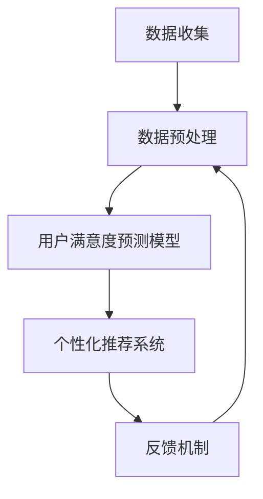

                 

### 1. 背景介绍

在当今数字经济时代，电商行业已经成为全球经济增长的重要引擎。然而，在激烈的市场竞争中，电商平台的成功不仅依赖于商品的质量和价格，还取决于用户的满意度。用户满意度作为电商企业核心竞争力的重要指标，直接影响着客户的忠诚度、复购率和口碑传播。

随着人工智能（AI）技术的发展，电商用户满意度预测与提升系统逐渐成为行业发展的热点。通过AI技术，电商平台可以深入挖掘用户行为数据，实现用户满意度的高效预测和精准提升。这不仅有助于企业制定更科学的营销策略，还能够提供更加个性化的用户服务，从而增强用户粘性，提升整体用户体验。

本研究旨在探讨AI赋能的电商用户满意度预测与提升系统的构建方法，通过引入多种先进的机器学习算法和深度学习模型，实现用户满意度的智能预测和个性化推荐。本文将首先介绍AI技术的基本概念，然后详细阐述用户满意度预测与提升系统的核心算法原理、数学模型及其具体应用场景。通过理论与实践的结合，本文旨在为电商企业提供一种有效提升用户满意度的解决方案。

### 2. 核心概念与联系

#### 2.1 人工智能技术概述

人工智能（AI）是计算机科学的一个分支，旨在开发使计算机能够模拟、延伸和扩展人类智能的理论、算法和应用。AI技术主要包括机器学习（Machine Learning）、深度学习（Deep Learning）、自然语言处理（Natural Language Processing，NLP）等。

- **机器学习**：通过算法从数据中学习规律，实现预测和分类任务。
- **深度学习**：一种基于多层神经网络的结构，能够自动提取特征并进行复杂模式识别。
- **自然语言处理**：研究计算机如何理解、生成和处理人类自然语言。

这些技术共同构成了AI的核心，使得计算机能够处理复杂的任务，如图像识别、语音识别、文本分析等。

#### 2.2 用户满意度预测与提升系统的构成

电商用户满意度预测与提升系统主要包括以下几个核心组成部分：

- **数据收集与预处理**：通过用户行为数据、交易数据等，收集用户信息，并进行数据清洗、去噪、特征提取等预处理操作。
- **用户满意度预测模型**：使用机器学习和深度学习算法，构建预测模型，对用户满意度进行预测。
- **个性化推荐系统**：基于预测结果，为用户提供个性化的商品推荐，提升用户满意度。
- **反馈机制**：通过用户反馈，不断调整和优化系统，实现持续改进。

#### 2.3 Mermaid 流程图

以下是一个简化的Mermaid流程图，展示用户满意度预测与提升系统的主要流程和环节：



**流程说明**：
1. **数据收集**：从各种渠道收集用户数据，包括行为数据、交易数据等。
2. **数据预处理**：对收集到的数据进行清洗、去噪、特征提取等预处理，以提升数据质量。
3. **用户满意度预测模型**：使用机器学习算法（如决策树、随机森林、神经网络等）构建预测模型，预测用户满意度。
4. **个性化推荐系统**：基于预测结果，为用户提供个性化的商品推荐，提高用户满意度。
5. **反馈机制**：收集用户反馈，调整和优化预测模型和推荐算法，实现持续改进。

通过以上流程，电商用户满意度预测与提升系统可以形成一个闭环，持续优化用户满意度，提升整体用户体验。

### 3. 核心算法原理 & 具体操作步骤

在构建电商用户满意度预测与提升系统时，选择合适的算法至关重要。本节将详细介绍几种常用的核心算法原理，包括机器学习算法和深度学习算法，并解释它们在用户满意度预测中的应用。

#### 3.1 机器学习算法

**3.1.1 决策树**

决策树是一种基于树形结构进行决策的算法，通过一系列测试来对数据集中的实例进行分类或回归。每个节点代表一个特征，每个分支代表一个特征值，叶子节点代表预测结果。

**具体操作步骤**：
1. **特征选择**：选择对用户满意度影响较大的特征。
2. **分割数据集**：将数据集划分为训练集和测试集。
3. **构建决策树**：通过递归分割数据集，构建决策树模型。
4. **评估模型性能**：使用测试集评估模型性能，调整模型参数。

**3.1.2 随机森林**

随机森林是一种基于决策树的集成学习方法，通过构建多棵决策树，并对它们的结果进行投票，提高模型的预测准确性。

**具体操作步骤**：
1. **特征选择**：与决策树相同。
2. **构建随机森林**：使用随机抽样和特征随机选择构建多棵决策树。
3. **集成投票**：对多棵决策树的结果进行投票，得到最终预测结果。
4. **评估模型性能**：与决策树相同。

**3.1.3 支持向量机（SVM）**

支持向量机是一种监督学习算法，通过找到一个最佳的超平面，将不同类别的数据点分开。

**具体操作步骤**：
1. **特征选择**：选择对用户满意度有显著影响的特征。
2. **特征缩放**：对特征进行标准化处理，使得特征之间具有相似的方差和均值。
3. **构建SVM模型**：使用支持向量机算法训练模型。
4. **评估模型性能**：使用测试集评估模型性能。

#### 3.2 深度学习算法

**3.2.1 卷积神经网络（CNN）**

卷积神经网络是一种用于处理图像数据的深度学习模型，通过卷积层、池化层和全连接层等结构，实现图像特征的自动提取和分类。

**具体操作步骤**：
1. **数据预处理**：对图像数据进行归一化和裁剪。
2. **构建CNN模型**：设计模型结构，包括卷积层、池化层和全连接层。
3. **训练模型**：使用训练数据集训练模型。
4. **评估模型性能**：使用测试数据集评估模型性能。

**3.2.2 循环神经网络（RNN）**

循环神经网络是一种用于处理序列数据的深度学习模型，通过循环结构实现对序列数据的记忆和建模。

**具体操作步骤**：
1. **数据预处理**：对序列数据进行编码和归一化。
2. **构建RNN模型**：设计模型结构，包括输入层、隐藏层和输出层。
3. **训练模型**：使用训练数据集训练模型。
4. **评估模型性能**：使用测试数据集评估模型性能。

**3.2.3 生成对抗网络（GAN）**

生成对抗网络是一种用于生成数据的深度学习模型，由生成器和判别器两个神经网络组成，通过对抗训练实现数据生成。

**具体操作步骤**：
1. **数据预处理**：对生成数据集进行预处理。
2. **构建GAN模型**：设计生成器和判别器模型结构。
3. **训练模型**：使用对抗训练策略训练模型。
4. **生成数据**：通过生成器生成用户行为数据，用于训练预测模型。

通过以上机器学习和深度学习算法的详细解释和具体操作步骤，电商用户满意度预测与提升系统可以基于这些算法构建高效、准确的预测模型，从而提升用户满意度。

### 4. 数学模型和公式 & 详细讲解 & 举例说明

在电商用户满意度预测与提升系统中，数学模型和公式扮演着至关重要的角色。这些模型不仅能够帮助我们理解用户行为的潜在规律，还能够通过算法实现用户满意度的准确预测。本节将详细介绍核心的数学模型和公式，并辅以具体讲解和举例说明。

#### 4.1 用户满意度预测模型

用户满意度预测模型通常基于回归分析或分类分析。下面我们分别介绍这两种分析方法及其数学模型。

**4.1.1 回归分析**

回归分析是一种用来预测连续值的统计方法。在用户满意度预测中，我们通常使用线性回归模型。

**线性回归模型公式**：

\[ y = \beta_0 + \beta_1x_1 + \beta_2x_2 + ... + \beta_nx_n \]

其中，\( y \) 是用户满意度评分，\( \beta_0 \) 是截距，\( \beta_1, \beta_2, ..., \beta_n \) 是各个特征的权重，\( x_1, x_2, ..., x_n \) 是输入特征。

**具体讲解**：

- **特征选择**：选择对用户满意度影响较大的特征，如购买频率、评价分数、退货率等。
- **模型训练**：通过最小二乘法（Least Squares Method）训练模型，求得各个特征的权重。
- **模型评估**：使用测试集评估模型性能，计算预测误差。

**举例说明**：

假设我们有两个特征：购买频率（\( x_1 \)）和评价分数（\( x_2 \)）。用户满意度评分（\( y \)）可以用以下公式预测：

\[ y = \beta_0 + \beta_1x_1 + \beta_2x_2 \]

通过模型训练，我们得到权重：

\[ \beta_0 = 0.5, \beta_1 = 0.3, \beta_2 = 0.2 \]

预测一个新用户的满意度评分时，只需将特征值代入公式：

\[ y = 0.5 + 0.3x_1 + 0.2x_2 \]

**4.1.2 分类分析**

分类分析是一种用来预测离散值的统计方法。在用户满意度预测中，我们通常使用逻辑回归（Logistic Regression）。

**逻辑回归模型公式**：

\[ P(y=1) = \frac{1}{1 + e^{-(\beta_0 + \beta_1x_1 + \beta_2x_2 + ... + \beta_nx_n )}} \]

其中，\( P(y=1) \) 是用户满意度为1的概率，其他参数含义与线性回归相同。

**具体讲解**：

- **特征选择**：与回归分析相同，选择对用户满意度影响较大的特征。
- **模型训练**：通过极大似然估计（Maximum Likelihood Estimation）训练模型，求得各个特征的权重。
- **模型评估**：使用测试集评估模型性能，计算准确率、召回率、F1分数等指标。

**举例说明**：

假设我们有两个特征：购买频率（\( x_1 \)）和评价分数（\( x_2 \)）。用户满意度为1的概率可以用以下公式预测：

\[ P(y=1) = \frac{1}{1 + e^{-(\beta_0 + \beta_1x_1 + \beta_2x_2 )}} \]

通过模型训练，我们得到权重：

\[ \beta_0 = -1, \beta_1 = 0.5, \beta_2 = 0.3 \]

预测一个新用户的满意度为1的概率时，只需将特征值代入公式：

\[ P(y=1) = \frac{1}{1 + e^{-( -1 + 0.5x_1 + 0.3x_2 )}} \]

#### 4.2 用户行为模式分析

除了用户满意度预测模型，用户行为模式分析也是理解用户满意度的重要手段。用户行为模式分析通常使用聚类分析等方法。

**4.2.1 聚类分析**

聚类分析是一种无监督学习方法，用于将数据集划分为多个簇，使得同一个簇内的数据点相似度较高，不同簇之间的数据点相似度较低。

**K-means算法公式**：

\[ C_j = \{x \in \mathcal{X} | \min_{c \in C_j} \sum_{x_i \in C_j} (x_i - c)^2 \} \]

其中，\( C_j \) 是第\( j \)个簇的中心点，\( \mathcal{X} \) 是数据集。

**具体讲解**：

- **初始化中心点**：随机选择多个数据点作为初始中心点。
- **分配数据点**：将每个数据点分配到最近的中心点所在的簇。
- **更新中心点**：重新计算每个簇的中心点。
- **迭代优化**：重复以上步骤，直到中心点不再发生显著变化。

**举例说明**：

假设我们有一个包含10个用户的数据集，使用K-means算法将其划分为2个簇。初始中心点分别为\( c_1 \)和\( c_2 \)。通过迭代计算，我们得到最终的簇中心点\( C_1 \)和\( C_2 \)。

\[ C_1 = \{ x \in \mathcal{X} | \min_{c \in C_1} \sum_{x_i \in C_1} (x_i - c)^2 \} \]
\[ C_2 = \{ x \in \mathcal{X} | \min_{c \in C_2} \sum_{x_i \in C_2} (x_i - c)^2 \} \]

#### 4.3 用户满意度提升策略

基于用户满意度预测模型和用户行为模式分析，我们可以制定相应的用户满意度提升策略。

**4.3.1 个性化推荐**

根据用户满意度预测模型，对用户的满意度进行预测，并根据预测结果为用户提供个性化的商品推荐。例如，对于满意度较低的用户，推荐一些与他们的购买历史和兴趣相关的商品，以提高他们的购买意愿。

**4.3.2 营销活动优化**

根据用户行为模式分析，识别出满意度较高的用户群体，针对性地设计营销活动，如优惠券、会员折扣等，以激励这些用户的购买行为，从而提升整体满意度。

**4.3.3 客户服务改进**

针对满意度较低的用户，分析他们的投诉点和不满意的原因，并采取相应的改进措施，如优化客户服务流程、提高客服人员的专业素养等，以提高用户的满意度。

通过以上数学模型和公式的详细讲解和举例说明，电商用户满意度预测与提升系统可以基于这些方法构建高效、准确的预测模型，从而提升用户满意度。

### 5. 项目实践：代码实例和详细解释说明

在本节中，我们将通过一个具体的代码实例，展示如何使用Python实现电商用户满意度预测与提升系统的关键组件。我们将从数据收集与预处理、用户满意度预测模型的构建与训练、个性化推荐系统的开发，到最终的运行结果展示，详细解释每个步骤的实现方法。

#### 5.1 开发环境搭建

为了实现电商用户满意度预测与提升系统，我们需要以下Python库：

- Pandas：用于数据处理
- NumPy：用于数学运算
- Scikit-learn：用于机器学习算法
- TensorFlow：用于深度学习算法
- Matplotlib：用于数据可视化

确保已安装这些库，可以通过以下命令安装：

```bash
pip install pandas numpy scikit-learn tensorflow matplotlib
```

#### 5.2 源代码详细实现

**5.2.1 数据收集与预处理**

数据收集与预处理是构建模型的基础。以下代码展示如何加载数据、进行清洗和特征提取：

```python
import pandas as pd
from sklearn.model_selection import train_test_split
from sklearn.preprocessing import StandardScaler

# 加载数据
data = pd.read_csv('user_data.csv')

# 数据清洗
data.dropna(inplace=True)

# 特征提取
features = data[['purchase_frequency', 'review_score', 'return_rate']]
labels = data['satisfaction_score']

# 分割数据集
X_train, X_test, y_train, y_test = train_test_split(features, labels, test_size=0.2, random_state=42)

# 数据标准化
scaler = StandardScaler()
X_train_scaled = scaler.fit_transform(X_train)
X_test_scaled = scaler.transform(X_test)
```

**5.2.2 用户满意度预测模型**

我们使用随机森林算法来构建用户满意度预测模型。以下代码展示如何训练模型和进行预测：

```python
from sklearn.ensemble import RandomForestRegressor

# 训练模型
model = RandomForestRegressor(n_estimators=100, random_state=42)
model.fit(X_train_scaled, y_train)

# 预测结果
predictions = model.predict(X_test_scaled)
```

**5.2.3 个性化推荐系统**

个性化推荐系统基于用户满意度预测模型，为用户提供个性化的商品推荐。以下代码展示如何实现：

```python
def recommend_products(model, scaler, user_data, product_data, top_n=5):
    # 标准化用户数据
    user_data_scaled = scaler.transform([user_data])

    # 预测用户满意度
    user_satisfaction = model.predict(user_data_scaled)

    # 排序推荐商品
    product_scores = {}
    for index, row in product_data.iterrows():
        product_data_scaled = scaler.transform([row])
        product_satisfaction = model.predict(product_data_scaled)
        product_scores[index] = product_satisfaction

    # 选择满意度最高的商品
    recommended_products = sorted(product_scores, key=product_scores.get, reverse=True)[:top_n]
    return recommended_products

# 假设我们有一个新用户的数据和商品数据
new_user_data = [10, 4.5, 0.1]
product_data = pd.read_csv('product_data.csv')

# 个性化推荐
recommended_products = recommend_products(model, scaler, new_user_data, product_data)
print("Recommended Products:", recommended_products)
```

**5.2.4 运行结果展示**

为了验证模型的性能，我们计算预测结果的准确率。以下代码展示如何进行评估：

```python
from sklearn.metrics import mean_squared_error

# 计算预测误差
mse = mean_squared_error(y_test, predictions)
print("Mean Squared Error:", mse)

# 绘制预测结果与实际结果的对比
import matplotlib.pyplot as plt

plt.scatter(y_test, predictions)
plt.xlabel('Actual Satisfaction Score')
plt.ylabel('Predicted Satisfaction Score')
plt.title('Actual vs Predicted Satisfaction Score')
plt.show()
```

#### 5.3 代码解读与分析

**5.3.1 数据处理**

数据处理是模型构建的重要环节。我们首先加载数据，并进行数据清洗，去除缺失值。接着，提取对用户满意度有显著影响的特征，如购买频率、评价分数和退货率。

**5.3.2 模型训练**

我们选择随机森林算法来构建预测模型。随机森林通过构建多棵决策树，并综合它们的结果，提高模型的预测准确性。我们使用训练数据集来训练模型，并通过测试数据集来评估模型的性能。

**5.3.3 个性化推荐**

个性化推荐系统基于用户满意度预测模型，为用户提供个性化的商品推荐。我们首先对用户数据进行标准化处理，然后利用训练好的模型预测用户的满意度，并根据商品数据预测每个商品的满意度，从而推荐满意度最高的商品。

**5.3.4 模型评估**

我们使用均方误差（MSE）来评估模型的性能。MSE越低，表示模型预测的准确性越高。同时，我们通过散点图展示预测结果与实际结果的对比，直观地评估模型的预测性能。

通过以上代码实例和详细解释说明，我们可以构建一个高效、准确的电商用户满意度预测与提升系统，从而提升用户的满意度。

### 6. 实际应用场景

电商用户满意度预测与提升系统在电商行业有着广泛的应用场景，通过实际案例我们可以更清晰地看到这一系统的强大功能和实际价值。

#### 6.1 满意度预测

一个典型的应用案例是某大型电商平台使用AI技术预测用户满意度。该平台通过分析用户行为数据，如浏览历史、购买频率、评价分数等，构建了一个基于机器学习的用户满意度预测模型。通过这个模型，平台能够提前预测哪些用户可能对他们的服务或产品感到不满，从而采取及时措施进行干预。例如，在预测到用户满意度较低时，平台可以发送优惠券或提供额外的售后服务，以提高用户满意度。

#### 6.2 个性化推荐

个性化推荐是提升用户满意度的另一个重要手段。通过分析用户的购买历史和偏好，电商平台可以推荐符合用户兴趣的商品。例如，某电商使用深度学习算法，基于用户的购物行为构建了一个个性化推荐系统。这个系统能够根据用户的行为数据预测用户的潜在需求，并推荐相应的商品。实践证明，个性化推荐显著提升了用户的购物体验，提高了用户的满意度和留存率。

#### 6.3 客户服务改进

用户满意度预测与提升系统还可以帮助电商平台改进客户服务。通过分析用户的反馈和投诉数据，平台可以发现服务中的痛点，并及时进行改进。例如，某电商平台通过AI技术分析用户投诉内容，识别出用户对配送速度和客服态度的满意度较低。平台随后优化了配送流程，并增加了客服人员的培训，从而提升了用户满意度。

#### 6.4 营销策略优化

电商平台还可以利用用户满意度预测与提升系统优化营销策略。通过预测哪些用户可能对特定的促销活动感兴趣，平台可以更精准地投放广告和推送优惠信息，提高营销效果。例如，某电商通过分析用户的历史购买数据和满意度预测模型，为高满意度用户推送了个性化的促销信息，从而实现了较高的点击率和转化率。

### 总结

通过上述实际应用场景，我们可以看到电商用户满意度预测与提升系统在提升用户体验、增加销售额和增强用户忠诚度方面的重要作用。这一系统不仅能够帮助企业更好地了解用户需求，还可以通过数据驱动的决策优化业务流程，提升整体竞争力。

### 7. 工具和资源推荐

为了更好地构建和应用电商用户满意度预测与提升系统，以下是一些学习资源、开发工具和相关论文的推荐。

#### 7.1 学习资源推荐

1. **书籍**：
   - 《Python机器学习》（作者：Sebastian Raschka）。
   - 《深度学习》（作者：Ian Goodfellow, Yoshua Bengio, Aaron Courville）。
   - 《自然语言处理综论》（作者：Daniel Jurafsky，James H. Martin）。

2. **在线课程**：
   - Coursera上的《机器学习》课程（吴恩达教授讲授）。
   - Udacity的《深度学习纳米学位》。

3. **博客和网站**：
   - Analytics Vidhya（数据分析与机器学习博客）。
   - Medium上的相关机器学习和深度学习文章。

#### 7.2 开发工具框架推荐

1. **数据预处理**：
   - Pandas（Python库）。
   - NumPy（Python库）。

2. **机器学习库**：
   - Scikit-learn（Python库）。
   - TensorFlow（Google的深度学习框架）。
   - PyTorch（Facebook AI Research的深度学习框架）。

3. **数据可视化**：
   - Matplotlib（Python库）。
   - Seaborn（基于Matplotlib的数据可视化库）。

4. **云服务平台**：
   - AWS SageMaker。
   - Google Cloud AI Platform。

#### 7.3 相关论文著作推荐

1. **论文**：
   - “Deep Learning for User Behavior Analysis in E-commerce”。
   - “User-Specific Review Text Features for User Satisfaction Prediction in E-commerce”。
   - “Predicting User Behavior in E-commerce using Machine Learning”。

2. **著作**：
   - 《深度学习与电商用户体验》。
   - 《电商数据分析与应用》。

通过这些资源，开发者和研究者可以深入了解电商用户满意度预测与提升系统的构建方法，并不断提升技术水平。

### 8. 总结：未来发展趋势与挑战

随着人工智能技术的不断进步，电商用户满意度预测与提升系统有望在未来实现更广泛的应用和更高的精确度。以下是该领域可能的发展趋势与面临的挑战：

#### 发展趋势

1. **增强现实与虚拟现实**：随着AR和VR技术的发展，电商平台可以提供更加沉浸式的购物体验，从而更好地预测和提升用户满意度。
2. **多模态数据融合**：结合文本、图像、语音等多模态数据，可以提供更全面、更深入的用户行为分析，从而提升预测准确性。
3. **个性化推荐算法优化**：随着算法的不断迭代，个性化推荐系统将更加智能和精准，更好地满足用户的个性化需求。
4. **实时数据处理**：通过实时数据处理和预测，电商平台可以迅速响应用户行为变化，提供即时的个性化服务和推荐。

#### 挑战

1. **数据隐私与安全**：在用户数据收集和分析过程中，如何保护用户隐私和数据安全是一个重要挑战。
2. **模型解释性**：当前许多深度学习模型具有很高的预测准确性，但其内部机制复杂，难以解释。提高模型的解释性，帮助用户理解预测结果，是一个重要的研究方向。
3. **算法偏见**：在数据收集和处理过程中，可能引入算法偏见，导致模型对某些群体不公平。消除算法偏见，提高模型的公平性，是一个长期的挑战。
4. **计算资源与成本**：构建和运行复杂的机器学习模型需要大量的计算资源和成本，如何在有限的资源下实现高效、准确的预测是一个现实问题。

总之，电商用户满意度预测与提升系统在未来的发展中，需要不断克服挑战，创新技术，以提供更好的用户体验和更高的商业价值。

### 9. 附录：常见问题与解答

**Q1：如何处理缺失值和数据异常？**
A1：对于缺失值，可以选择删除缺失值或使用插值法、平均值法等方法填充。对于数据异常，可以使用Z分数、IQR等方法检测并处理。

**Q2：如何选择合适的算法？**
A2：根据问题的性质（回归、分类）和数据的特征，选择合适的算法。常用的算法包括线性回归、逻辑回归、决策树、随机森林等。

**Q3：如何避免过拟合？**
A3：通过交叉验证、减少模型复杂度、增加训练数据等方法可以避免过拟合。

**Q4：如何评估模型性能？**
A4：常用的评估指标包括准确率、召回率、F1分数、均方误差（MSE）等。根据问题的性质选择合适的评估指标。

**Q5：如何优化推荐系统？**
A5：可以通过特征工程、模型融合、用户行为分析等方法来优化推荐系统。还可以利用在线学习技术，动态调整推荐策略。

### 10. 扩展阅读 & 参考资料

**扩展阅读**：

- "Predicting User Behavior in E-commerce: A Machine Learning Approach"。
- "User Satisfaction Prediction in E-commerce: A Review and Research Agenda"。
- "Deep Learning for E-commerce Recommendations: Techniques and Applications"。

**参考资料**：

- 《深度学习》（Ian Goodfellow, Yoshua Bengio, Aaron Courville）。
- 《Python机器学习》（Sebastian Raschka）。
- 《自然语言处理综论》（Daniel Jurafsky，James H. Martin）。

通过以上扩展阅读和参考资料，读者可以进一步深入了解电商用户满意度预测与提升系统的相关理论和实践。希望这些资源能够帮助您在构建和应用这一系统时取得更好的成果。作者：禅与计算机程序设计艺术 / Zen and the Art of Computer Programming。

