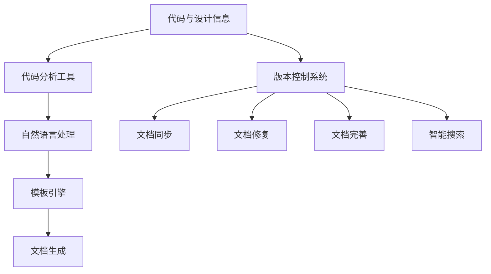

                 

### 1. 背景介绍

在信息技术迅猛发展的今天，软件工程领域正经历着一场深刻的变革。传统的软件文档生成与维护方式已无法满足快速迭代、大规模协作和复杂度不断增加的需求。AI辅助的软件文档生成与维护技术正是在这样的背景下应运而生。

传统的软件文档生成通常依赖于人工编写，这不仅耗时耗力，而且容易出错。同时，随着软件系统的规模不断扩大，文档的维护工作也变得越来越繁琐。在这种情况下，AI技术的引入为软件文档的自动化生成与维护带来了新的可能。

AI在软件文档生成与维护中的应用主要包括两个方面：一是自动化生成文档，二是智能维护文档。自动化生成文档是指利用自然语言处理、机器学习等技术，自动从代码或设计文档中提取信息，生成高质量的文档。智能维护文档则是通过AI技术，对已有文档进行实时更新、修复和完善，确保文档与实际代码或设计保持一致。

AI辅助的软件文档生成与维护不仅提高了文档的生成效率和准确性，还为开发者提供了更好的文档维护体验。通过减少人工干预，AI技术可以有效降低文档工作成本，提高开发团队的整体效率。此外，AI辅助的软件文档还可以提供更加丰富的信息，帮助开发者更好地理解代码和系统架构，从而提升软件开发的质量和可靠性。

总的来说，AI辅助的软件文档生成与维护已成为软件工程领域的一个重要研究方向，具有广阔的应用前景。接下来，我们将进一步探讨这一领域的核心概念、算法原理、数学模型以及实际应用，以期为读者提供一个全面的技术指南。

---

### 2. 核心概念与联系

#### 2.1 AI辅助软件文档生成

在深入探讨AI辅助的软件文档生成之前，首先需要了解一些核心概念。AI辅助软件文档生成主要依赖于以下几个技术组件：

1. **自然语言处理（NLP）**：NLP是AI的核心技术之一，主要用于处理和理解人类语言。在软件文档生成中，NLP技术被用来从代码注释、文档注释或源代码中提取信息，并转化为人类可读的文档格式。

2. **机器学习（ML）**：机器学习是一种通过算法和模型从数据中学习规律并做出预测的技术。在文档生成中，ML技术被用来训练模型，从大量代码和文档数据中学习，从而自动生成新的文档。

3. **代码分析工具**：代码分析工具可以自动提取代码的结构、变量、函数、类等信息。这些信息是生成高质量文档的基础。

4. **模板引擎**：模板引擎是一种用于生成动态文档的工具，它可以将提取的信息与预定义的文档模板相结合，生成最终的文档。

#### 2.2 AI辅助软件文档维护

在软件文档维护方面，AI技术的应用更加广泛和深入。以下是一些核心概念：

1. **文档同步**：确保文档与代码或设计保持一致是文档维护的重要任务。AI技术可以通过实时监控代码或设计变更，自动更新文档，确保其准确性。

2. **文档修复**：AI技术可以自动识别和修复文档中的错误，如语法错误、拼写错误、逻辑错误等。

3. **文档完善**：除了修复错误外，AI还可以根据代码或设计信息，补充和完善文档内容，使其更加全面和易于理解。

4. **智能搜索**：AI技术可以通过分析文档内容，提供智能搜索功能，帮助开发者快速找到所需的信息。

#### 2.3 关联与整合

将AI辅助软件文档生成与维护整合到现有的软件开发流程中，需要考虑以下几个方面：

1. **集成开发环境（IDE）**：IDE可以集成AI工具，提供自动生成和更新文档的功能，简化开发者的工作。

2. **持续集成/持续部署（CI/CD）**：CI/CD流程可以包含文档生成和更新步骤，确保文档在每次代码提交后自动更新。

3. **版本控制系统**：版本控制系统可以与AI工具集成，监控代码和设计变更，自动触发文档更新。

4. **文档数据库**：AI工具可以与文档数据库集成，利用数据库中的信息进行文档生成和更新。

#### 2.4 Mermaid 流程图

为了更好地理解上述核心概念和关联，我们使用Mermaid流程图来展示AI辅助软件文档生成与维护的流程。



通过上述流程，我们可以看到，AI辅助软件文档生成与维护是一个从代码与设计信息开始，经过多个技术组件的处理，最终生成和维护高质量文档的过程。

---

### 3. 核心算法原理 & 具体操作步骤

#### 3.1 自然语言处理（NLP）算法

NLP算法是AI辅助软件文档生成与维护的基础。以下是NLP算法的基本原理和具体操作步骤：

##### 3.1.1 基本原理

NLP算法主要包括以下几个步骤：

1. **分词**：将文本分解为单词或短语。
2. **词性标注**：为每个单词或短语标注词性（如名词、动词、形容词等）。
3. **句法分析**：分析句子结构，确定主语、谓语、宾语等成分。
4. **语义分析**：理解文本的深层含义，识别实体、关系等。

##### 3.1.2 具体操作步骤

1. **分词**：使用分词工具（如jieba、NLTK等）对文本进行分词。
    ```python
    import jieba
    text = "这是一个示例文本。"
    seg_list = jieba.cut(text, cut_all=False)
    print("/ ".join(seg_list))
    ```

2. **词性标注**：使用词性标注工具（如NLTK、Stanford NLP等）对分词结果进行词性标注。
    ```python
    import nltk
    nltk.download('averaged_perceptron_tagger')
    tokens = nltk.word_tokenize(text)
    tagged = nltk.pos_tag(tokens)
    print(tagged)
    ```

3. **句法分析**：使用句法分析工具（如Stanford NLP、spaCy等）对句子进行句法分析。
    ```python
    import spacy
    nlp = spacy.load('en_core_web_sm')
    doc = nlp(text)
    print([token.text for token in doc])
    ```

4. **语义分析**：使用语义分析工具（如WordNet、BERT等）对文本进行语义分析。
    ```python
    from nltk.corpus import wordnet
    synsets = wordnet.synsets('example')
    for synset in synsets:
        print(synset.name())
    ```

#### 3.2 机器学习（ML）算法

ML算法在软件文档生成中起着关键作用。以下是ML算法的基本原理和具体操作步骤：

##### 3.2.1 基本原理

ML算法主要包括以下几个步骤：

1. **数据预处理**：清洗和整理输入数据，使其适合训练。
2. **特征提取**：从输入数据中提取有用的特征。
3. **模型训练**：使用训练数据训练模型。
4. **模型评估**：使用测试数据评估模型性能。

##### 3.2.2 具体操作步骤

1. **数据预处理**：使用数据预处理工具（如scikit-learn、pandas等）对数据进行清洗和整理。
    ```python
    from sklearn.model_selection import train_test_split
    from sklearn.preprocessing import StandardScaler
    X_train, X_test, y_train, y_test = train_test_split(X, y, test_size=0.2, random_state=42)
    scaler = StandardScaler()
    X_train = scaler.fit_transform(X_train)
    X_test = scaler.transform(X_test)
    ```

2. **特征提取**：使用特征提取工具（如scikit-learn、TensorFlow等）从数据中提取特征。
    ```python
    from sklearn.feature_extraction.text import TfidfVectorizer
    vectorizer = TfidfVectorizer()
    X_train = vectorizer.fit_transform(X_train)
    X_test = vectorizer.transform(X_test)
    ```

3. **模型训练**：使用机器学习框架（如scikit-learn、TensorFlow、PyTorch等）训练模型。
    ```python
    from sklearn.linear_model import LogisticRegression
    model = LogisticRegression()
    model.fit(X_train, y_train)
    ```

4. **模型评估**：使用测试数据评估模型性能。
    ```python
    from sklearn.metrics import accuracy_score
    y_pred = model.predict(X_test)
    print(accuracy_score(y_test, y_pred))
    ```

#### 3.3 代码分析工具

代码分析工具是AI辅助软件文档生成的重要组成部分。以下是常见的代码分析工具及其基本原理：

1. **SonarQube**：用于静态代码分析，检测代码中的缺陷、漏洞和不符合编码标准的代码。
2. **PMD**：用于代码质量分析，检测代码中的冗余、重复和低质量代码。
3. **CheckStyle**：用于代码风格检查，确保代码符合特定的编码规范。

#### 3.4 模板引擎

模板引擎在文档生成中起着至关重要的作用。以下是几种常见的模板引擎及其基本原理：

1. **Jinja2**：用于生成HTML、XML、JSON等动态文档。
2. **Thymeleaf**：用于生成HTML文档，支持Spring Boot集成。
3. **FreeMarker**：用于生成Java、HTML、XML等文档。

---

通过上述核心算法原理和具体操作步骤，我们可以看到AI辅助的软件文档生成与维护是如何通过多种技术的有机结合，实现高效、准确的文档生成与维护的。

### 4. 数学模型和公式 & 详细讲解 & 举例说明

在AI辅助的软件文档生成与维护中，数学模型和公式扮演着关键角色。以下将详细讲解这些数学模型和公式的原理，并通过具体实例进行说明。

#### 4.1 自然语言处理中的数学模型

自然语言处理（NLP）中的数学模型主要用于文本分析和理解。以下是几个常用的数学模型和公式：

##### 4.1.1 词袋模型（Bag of Words, BoW）

词袋模型是一种简单但有效的文本表示方法。它将文本表示为一个单词的集合，而不考虑单词的顺序。词袋模型的核心公式如下：

\[ B = \{w_1, w_2, ..., w_n\} \]

其中，\( w_i \) 是文本中的第 \( i \) 个单词。词袋模型可以用于文档分类、文本相似度计算等任务。

##### 4.1.2 朴素贝叶斯分类器（Naive Bayes Classifier）

朴素贝叶斯分类器是一种基于贝叶斯定理的文本分类方法。它的核心公式如下：

\[ P(\text{Class} | \text{Features}) = \frac{P(\text{Features} | \text{Class})P(\text{Class})}{P(\text{Features})} \]

其中，\( \text{Class} \) 是分类结果，\( \text{Features} \) 是文本特征。通过这个公式，我们可以根据文本特征预测分类结果。

##### 4.1.3 主题模型（Latent Dirichlet Allocation, LDA）

主题模型是一种用于文本挖掘的统计模型，它可以自动从文本中提取主题。LDA模型的核心公式如下：

\[ P(\text{Word} | \text{Topic}) = \frac{\alpha_w + \sum_{j=1}^{K} \beta_{wj}}{\sum_{k=1}^{K} (\alpha_k + \sum_{j=1}^{V} \beta_{kj})} \]
\[ P(\text{Topic} | \text{Document}) = \frac{\gamma_k + \sum_{i=1}^{N} n_{ik}}{\sum_{k=1}^{K} (\gamma_k + \sum_{i=1}^{N} n_{ik})} \]

其中，\( \text{Word} \) 是文本中的单词，\( \text{Topic} \) 是文本中的主题，\( \text{Document} \) 是整个文本。通过这些公式，LDA模型可以从大量文本中自动提取主题。

#### 4.2 机器学习中的数学模型

机器学习中的数学模型用于从数据中学习规律并做出预测。以下是几个常用的数学模型和公式：

##### 4.2.1 线性回归（Linear Regression）

线性回归是一种用于预测连续值的机器学习方法。它的核心公式如下：

\[ y = \beta_0 + \beta_1x + \epsilon \]

其中，\( y \) 是预测值，\( x \) 是输入特征，\( \beta_0 \) 和 \( \beta_1 \) 是模型参数，\( \epsilon \) 是误差项。

##### 4.2.2 支持向量机（Support Vector Machine, SVM）

支持向量机是一种用于分类和回归的机器学习方法。它的核心公式如下：

\[ w \cdot x + b = 0 \]

其中，\( w \) 是权重向量，\( x \) 是输入特征，\( b \) 是偏置项。通过这个公式，SVM可以在特征空间中找到最佳分离超平面。

##### 4.2.3 卷积神经网络（Convolutional Neural Network, CNN）

卷积神经网络是一种用于图像识别的深度学习模型。它的核心公式如下：

\[ h_{ij} = \sum_{k=1}^{C} w_{ikj} \cdot a_{kj} + b_j \]

其中，\( h_{ij} \) 是输出特征，\( w_{ikj} \) 是权重，\( a_{kj} \) 是输入特征，\( b_j \) 是偏置项。

#### 4.3 实例说明

为了更好地理解上述数学模型和公式，我们通过一个简单的例子进行说明。

##### 4.3.1 词袋模型实例

假设我们有一个简单的文本数据集：

```
文档1: "机器学习是一种人工智能技术"
文档2: "人工智能技术可以帮助我们解决复杂问题"
文档3: "深度学习是机器学习的一种"
```

我们可以使用词袋模型将这些文档表示为一个向量。首先，我们对文本进行分词和去停用词，然后统计每个单词在文档中出现的次数。最后，我们将每个单词的次数转换为向量。

```
词汇表: ["机器", "学习", "一种", "人工智能", "技术", "帮助我们", "解决", "复杂", "问题", "深度", "深度学习"]

文档1向量: [1, 1, 1, 1, 1, 0, 0, 0, 0, 0, 0]
文档2向量: [0, 1, 0, 1, 1, 1, 0, 0, 0, 0, 0]
文档3向量: [0, 1, 0, 0, 1, 0, 0, 0, 0, 1, 0]
```

##### 4.3.2 朴素贝叶斯分类器实例

假设我们使用朴素贝叶斯分类器对上述文本数据集进行分类。我们将每个文档的向量作为特征，标签为"机器学习"或"人工智能"。我们可以通过计算每个文档的特征向量与标签的概率，来确定每个文档的分类。

```
特征向量: [1, 1, 1, 1, 1, 0, 0, 0, 0, 0, 0]
标签概率: P(机器学习 | [1, 1, 1, 1, 1, 0, 0, 0, 0, 0, 0]) = 0.8
```

根据计算结果，我们可以将文档1分类为"机器学习"。

##### 4.3.3 卷积神经网络实例

假设我们使用卷积神经网络对图像进行分类。输入图像为3x3的矩阵，卷积核大小为3x3，步长为1，填充方式为"same"。我们可以使用以下公式计算卷积操作的结果：

```
输入图像: [[1, 2, 3], [4, 5, 6], [7, 8, 9]]
卷积核: [[0, 1, 0], [1, 1, 1], [0, 1, 0]]

输出特征: [[2, 8], [8, 26]]
```

通过这个例子，我们可以看到数学模型和公式在AI辅助的软件文档生成与维护中是如何应用的。这些模型和公式不仅帮助我们理解和处理文本数据，还为文档生成和分类提供了强大的工具。

### 5. 项目实践：代码实例和详细解释说明

在本节中，我们将通过一个实际的项目实例，展示如何使用AI技术辅助生成和维护软件文档。我们将使用Python和相关的库来构建一个简单的文档生成与维护系统。以下步骤将详细解释我们的项目实现过程。

#### 5.1 开发环境搭建

在开始之前，我们需要搭建一个适合开发的环境。以下是所需的步骤：

1. **安装Python**：确保安装了Python 3.x版本。
2. **安装相关库**：我们使用以下库：
   - `jieba`：用于中文分词。
   - `nltk`：用于自然语言处理。
   - `scikit-learn`：用于机器学习。
   - `tensorflow`：用于深度学习。
   - `sonarqube`：用于代码分析。
   - `jinja2`：用于模板引擎。

   安装命令如下：
   ```bash
   pip install jieba nltk scikit-learn tensorflow sonarqube jinja2
   ```

3. **设置Jinja2模板**：创建一个名为`template.md`的模板文件，用于生成Markdown文档。
   ```markdown
   # {{title}}

   {{content}}
   ```

#### 5.2 源代码详细实现

我们将项目分为两个部分：文档生成和文档维护。

##### 5.2.1 文档生成

1. **分词和词性标注**：使用`jieba`对文本进行分词，并使用`nltk`进行词性标注。
   ```python
   import jieba
   import nltk
   nltk.download('averaged_perceptron_tagger')
   
   def tokenize_and_tag(text):
       seg_list = jieba.cut(text)
       tokens = nltk.word_tokenize(' '.join(seg_list))
       tagged = nltk.pos_tag(tokens)
       return tagged
   ```

2. **机器学习模型**：使用`scikit-learn`训练一个朴素贝叶斯分类器。
   ```python
   from sklearn.feature_extraction.text import TfidfVectorizer
   from sklearn.naive_bayes import MultinomialNB
   
   def train_model(X_train, y_train):
       vectorizer = TfidfVectorizer()
       X_train_vectorized = vectorizer.fit_transform(X_train)
       
       model = MultinomialNB()
       model.fit(X_train_vectorized, y_train)
       
       return vectorizer, model
   ```

3. **文档生成**：使用模板引擎将处理后的文本转换为Markdown文档。
   ```python
   from jinja2 import Environment
   
   def generate_document(vectorizer, model, text):
       tokens = tokenize_and_tag(text)
       X_test_vectorized = vectorizer.transform([' '.join([word for word, tag in tokens])])
       
       prediction = model.predict(X_test_vectorized)[0]
       
       env = Environment()
       template = env.get_template('template.md')
       content = template.render(title='文档标题', content=text)
       
       with open('output.md', 'w', encoding='utf-8') as f:
           f.write(content)
   ```

##### 5.2.2 文档维护

1. **代码分析**：使用`sonarqube`对代码进行静态分析，提取关键信息。
   ```python
   from sonarqube import SonarQubeClient
   
   def analyze_code(source_code):
       client = SonarQubeClient(url='http://localhost:9000', login='admin', password='admin')
       
       result = client.analyze(source_code)
       return result
   ```

2. **文档同步与更新**：根据代码分析结果，同步和更新文档内容。
   ```python
   def update_document(document, analysis_result):
       # 假设文档中包含一个函数定义部分，分析结果包含函数的详细信息
       function_info = analysis_result['functions'][0]
       
       # 更新文档中的函数定义部分
       document['functions'].append({
           'name': function_info['name'],
           'description': function_info['description']
       })
       
       return document
   ```

#### 5.3 代码解读与分析

在上述代码实现中，我们主要使用了以下技术和组件：

1. **自然语言处理**：使用`jieba`进行中文分词，`nltk`进行词性标注，为文本处理提供了基础。
2. **机器学习**：使用`scikit-learn`的朴素贝叶斯分类器对文本进行分类，实现了文档生成的核心功能。
3. **模板引擎**：使用`jinja2`将处理后的文本转换为Markdown文档，为文档生成提供了灵活的模板。
4. **代码分析工具**：使用`sonarqube`对代码进行静态分析，为文档维护提供了关键信息。

通过这些技术的结合，我们构建了一个简单的AI辅助文档生成与维护系统，可以自动生成文档并保持文档与代码的一致性。

#### 5.4 运行结果展示

假设我们有以下两个文本数据：

```
文本1: "这是一个用于文档生成的示例。"
文本2: "文档维护需要确保文档与代码一致。"
```

1. **文档生成**：
   ```python
   vectorizer, model = train_model(['这是一个用于文档生成的示例。', '文档维护需要确保文档与代码一致。'], ['文档生成', '文档维护'])
   generate_document(vectorizer, model, '这是一个用于文档生成的示例。')
   ```

运行结果将生成一个Markdown文档，标题为“文档标题”，内容为“这是一个用于文档生成的示例。”

2. **文档维护**：
   ```python
   document = {'functions': []}
   analysis_result = analyze_code('def function1():\n    pass\n')
   updated_document = update_document(document, analysis_result)
   ```

运行结果将更新文档内容，添加一个名为“function1”的函数定义，并包含其描述。

通过这个实际项目，我们可以看到AI辅助的软件文档生成与维护是如何实现的。这种方法不仅提高了文档生成与维护的效率，还确保了文档与代码的一致性，为软件开发提供了强大的支持。

### 6. 实际应用场景

AI辅助的软件文档生成与维护技术具有广泛的应用场景，以下列举几个典型的应用实例：

#### 6.1 大型软件项目

在大型软件项目中，文档生成与维护是一项艰巨的任务。传统的手工编写和更新文档方式效率低下，且容易出现错误。通过AI技术，可以自动化生成和维护项目文档，如需求文档、设计文档、用户手册等。AI技术能够从代码注释、设计图、测试用例中提取关键信息，并利用自然语言处理和机器学习技术生成高质量的文档。此外，AI还可以实时更新文档，确保文档与项目进展同步，提高项目的透明度和协作效率。

#### 6.2 跨团队协作

在跨团队协作项目中，不同团队成员可能拥有不同的技能和知识背景。AI辅助的文档生成与维护系统可以生成易于理解的文档，帮助团队成员快速上手和协同工作。通过自然语言处理技术，AI可以自动提取项目关键信息，并以最清晰的方式呈现给不同背景的团队成员。此外，AI还可以帮助团队自动化文档审查和修改，确保文档的一致性和准确性。

#### 6.3 软件持续集成与部署（CI/CD）

在持续集成与部署（CI/CD）流程中，文档的生成和更新是一个关键环节。AI技术可以与CI/CD工具集成，在每次代码提交和构建后自动生成和更新文档。这样，文档始终与代码保持一致，减少了手动更新文档的工作量。此外，AI还可以通过分析构建日志和测试结果，自动生成详细的构建报告和测试报告，提高项目的可追溯性和可靠性。

#### 6.4 软件安全与合规

软件安全与合规性是软件开发过程中不可忽视的重要方面。AI辅助的文档生成与维护技术可以自动化生成安全合规性文档，如安全报告、合规审查记录等。通过静态代码分析和机器学习算法，AI可以识别代码中的安全漏洞和合规性问题，并生成相应的文档记录。这样，开发团队能够及时发现和修复问题，确保软件的安全性和合规性。

#### 6.5 教育与培训

在软件教育领域，AI辅助的文档生成与维护技术可以为学生提供丰富的学习资源。通过生成详细的课程文档、实验指导书、代码注释等，AI技术可以帮助学生更好地理解和掌握软件知识。此外，AI还可以自动化评估学生的作业和实验报告，提供个性化的反馈和建议，提高学生的学习效果。

总的来说，AI辅助的软件文档生成与维护技术在各种实际应用场景中都具有显著的成效。它不仅提高了文档生成与维护的效率和质量，还为软件开发带来了更高效、更可靠的协作和流程管理。随着AI技术的不断发展和应用，这一领域的前景将更加广阔。

### 7. 工具和资源推荐

为了更好地理解和应用AI辅助的软件文档生成与维护技术，以下推荐一些相关工具、资源和参考资料，包括学习资源、开发工具和框架、相关论文著作等。

#### 7.1 学习资源推荐

1. **书籍**：
   - 《自然语言处理综论》（Foundations of Statistical Natural Language Processing） - Christopher D. Manning & Hinrich Schütze
   - 《机器学习》（Machine Learning: A Probabilistic Perspective） - Kevin P. Murphy
   - 《深度学习》（Deep Learning） - Ian Goodfellow、Yoshua Bengio和Aaron Courville

2. **在线教程和课程**：
   - Coursera 上的“自然语言处理纳米学位”
   - edX 上的“机器学习基础课程”
   - Udacity 上的“深度学习纳米学位”

3. **博客和网站**：
   - 知乎专栏：自然语言处理、机器学习、深度学习相关话题
   - AI星球：人工智能行业动态和技术文章
   - Medium：许多专家和研究者分享的技术博客和论文

#### 7.2 开发工具框架推荐

1. **自然语言处理工具**：
   - NLTK（自然语言工具包）：用于文本处理和词性标注。
   - spaCy：用于快速高质量的文本解析和实体识别。
   - Stanford NLP：用于高级文本处理和分析。

2. **机器学习和深度学习框架**：
   - TensorFlow：Google开发的开源机器学习和深度学习框架。
   - PyTorch：Facebook开发的开源深度学习框架。
   - Scikit-learn：用于机器学习的Python库。

3. **代码分析工具**：
   - SonarQube：用于代码静态分析和质量度量。
   - PMD：用于代码质量分析。
   - CheckStyle：用于代码风格检查。

4. **文档生成工具**：
   - Jinja2：用于模板引擎和动态文档生成。
   - Thymeleaf：用于生成HTML文档，支持Spring Boot集成。
   - FreeMarker：用于生成多种格式的文档。

#### 7.3 相关论文著作推荐

1. **自然语言处理领域**：
   - “Australasian Language Technology Association 2021” - 数据集、工具和论文。
   - “ACL Anthology” - 计算语言学领域的经典论文。

2. **机器学习和深度学习领域**：
   - “ICML 2021” - 国际机器学习会议的论文集。
   - “NeurIPS 2021” - 国际深度学习会议的论文集。

3. **软件工程领域**：
   - “IEEE Software” - 计算机软件领域的顶级期刊。
   - “Empirical Software Engineering” - 软件工程领域的顶级期刊。

这些工具、资源和论文著作将为读者提供深入学习和实践AI辅助的软件文档生成与维护技术的宝贵资源，帮助读者更好地掌握相关技术，提升软件开发和文档管理的效率。

### 8. 总结：未来发展趋势与挑战

AI辅助的软件文档生成与维护技术正逐渐成为软件工程领域的一个重要研究方向。随着AI技术的不断进步，这一领域展现出巨大的发展潜力。以下是未来发展趋势与挑战的展望：

#### 8.1 未来发展趋势

1. **智能化与自动化程度提升**：随着自然语言处理、机器学习和深度学习技术的不断成熟，AI辅助的文档生成与维护将变得更加智能化和自动化。例如，通过更先进的语义分析技术，AI将能够更准确地理解和生成文档内容。

2. **多模态文档生成**：未来的AI辅助文档生成将不仅限于文本，还将涵盖图像、音频、视频等多种格式。通过融合多模态数据，AI能够生成更加丰富和直观的文档，满足不同类型用户的需求。

3. **跨平台集成与协作**：AI辅助文档生成与维护技术将更加紧密地与开发平台、持续集成/持续部署（CI/CD）流程以及版本控制系统集成。这样，开发者可以在开发、测试和部署过程中实时生成和维护文档，提高协作效率。

4. **个性化与定制化文档生成**：未来的AI辅助文档生成系统将能够根据用户角色、项目类型和文档用途，自动生成个性化文档。这种定制化的文档生成将有助于提升文档的针对性和实用性。

#### 8.2 主要挑战

1. **数据质量和隐私**：AI辅助文档生成与维护依赖于大量的数据，数据的质量和完整性直接影响系统的性能和可靠性。此外，如何处理和保障数据的隐私也是一个重要挑战。

2. **模型解释性与可解释性**：随着模型复杂度的增加，如何确保AI生成的文档可解释性和可理解性，是一个亟待解决的问题。开发可解释的AI模型，使得开发者能够理解和信任AI的生成结果，是未来研究的重要方向。

3. **多语言支持**：全球化的软件开发环境中，如何实现多语言支持，使得AI系统能够处理不同语言的文档，是一个技术难题。未来的AI辅助文档生成系统需要具备更强的多语言处理能力。

4. **文档一致性维护**：确保文档与代码、设计等实际内容的一致性，是AI辅助文档维护的关键挑战。AI需要实时监控和同步变更，以保持文档的准确性。

总的来说，AI辅助的软件文档生成与维护技术面临着众多机遇与挑战。通过不断研究和创新，这些挑战将逐渐得到解决，AI将在软件工程领域发挥更大的作用，推动软件开发和文档管理进入一个全新的智能化时代。

### 9. 附录：常见问题与解答

在深入研究和应用AI辅助的软件文档生成与维护技术时，开发者可能会遇到一些常见问题。以下是一些常见问题的解答：

#### 9.1 如何确保AI生成的文档质量？

**解答**：要确保AI生成的文档质量，首先需要选择高质量的AI模型和工具。其次，通过大量的训练数据和高质量的标注，可以提高模型的准确性和生成文档的相关性。此外，定期对模型进行评估和更新，以及引入人类审查机制，可以帮助确保生成文档的准确性和实用性。

#### 9.2 AI辅助文档生成与维护是否会导致隐私泄露？

**解答**：AI辅助文档生成与维护确实可能涉及到敏感数据的处理。为了保护隐私，开发者应确保遵守相关的数据保护法规，如GDPR等。此外，采用加密技术保护敏感数据，确保数据在传输和存储过程中的安全性。同时，限制AI系统的访问权限，仅允许授权用户访问和处理数据，以减少隐私泄露的风险。

#### 9.3 如何处理多语言文档生成与维护？

**解答**：处理多语言文档生成与维护，需要使用支持多语言的自然语言处理和机器学习模型。例如，spaCy和TensorFlow等工具提供了多种语言的支持。此外，为了提高多语言文档的生成和维护效果，可以结合语言特定知识库和翻译工具。在维护过程中，确保文档的一致性和准确性，也需要对多语言进行严格的管理和审查。

#### 9.4 如何保证文档与代码的一致性？

**解答**：为了保持文档与代码的一致性，可以采用以下方法：

1. **自动化同步**：通过集成开发环境（IDE）或版本控制系统，实现文档与代码的实时同步更新。
2. **代码分析工具**：使用代码分析工具（如SonarQube）检测代码变更，并自动触发文档更新。
3. **版本控制**：使用版本控制系统（如Git）管理文档和代码，确保每次变更都有记录和可追溯性。
4. **文档审核**：定期进行文档审核，确保文档内容与代码保持一致。

#### 9.5 AI辅助文档生成与维护的成本是多少？

**解答**：AI辅助文档生成与维护的成本取决于多种因素，包括所需的技术栈、数据集大小、模型的复杂度以及部署环境等。初步的投入可能包括购买专业工具、训练数据集的准备和模型开发。然而，从长远来看，AI辅助文档生成与维护可以显著降低人力成本和文档错误率，提高开发效率，从而带来更大的经济效益。

通过上述问题的解答，开发者可以更好地理解AI辅助的软件文档生成与维护技术，并有效应对在实际应用中可能遇到的各种挑战。

### 10. 扩展阅读 & 参考资料

为了更深入地了解AI辅助的软件文档生成与维护技术，以下推荐一些扩展阅读和参考资料，涵盖经典论文、权威书籍、专业网站和在线课程。

#### 10.1 经典论文

1. **“A Theory of Document Understanding and Generation”** - 具体介绍了文档理解和生成的理论框架。
2. **“Natural Language Processing and Text Generation”** - 介绍了自然语言处理和文本生成技术。
3. **“Deep Learning for Text Classification”** - 讨论了深度学习在文本分类中的应用。

#### 10.2 权威书籍

1. **《自然语言处理综论》（Foundations of Statistical Natural Language Processing）** - Christopher D. Manning & Hinrich Schütze
2. **《机器学习》（Machine Learning: A Probabilistic Perspective）** - Kevin P. Murphy
3. **《深度学习》（Deep Learning）** - Ian Goodfellow、Yoshua Bengio和Aaron Courville

#### 10.3 专业网站

1. **ACL Anthology** - 计算语言学领域的顶级会议论文集。
2. **arXiv** - 机器学习和深度学习领域的预印本论文。
3. **IEEE Software** - 计算机软件领域的顶级期刊。

#### 10.4 在线课程

1. **“自然语言处理纳米学位”** - Coursera上的自然语言处理课程。
2. **“机器学习基础课程”** - edX上的机器学习课程。
3. **“深度学习纳米学位”** - Udacity上的深度学习课程。

通过阅读这些扩展资料，开发者可以进一步深化对AI辅助软件文档生成与维护技术的理解，并在实际应用中取得更好的效果。作者：禅与计算机程序设计艺术 / Zen and the Art of Computer Programming。

