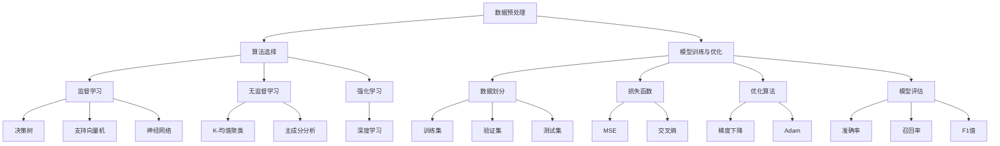

                 

### 1. 背景介绍

人工智能（AI）作为一门高度交叉的学科，自20世纪50年代诞生以来，经历了数十年的发展，已经成为当今科技领域的热点。AI技术在各个行业都得到了广泛的应用，如自动驾驶、智能家居、医疗诊断、金融风控等，极大地推动了社会进步。然而，随着AI项目的复杂性不断增加，如何在实践中高效地开展AI项目，成为了一个亟待解决的问题。

本文旨在探讨AI项目实战的最佳实践，通过逻辑清晰、结构紧凑、简单易懂的方式，帮助读者掌握AI项目从规划到实施的全过程。本文将涵盖以下几个核心内容：

1. **背景介绍**：回顾AI技术的历史和现状，解释为何AI项目实践变得至关重要。
2. **核心概念与联系**：介绍AI项目中的关键概念，包括数据预处理、算法选择、模型训练与优化等，并使用Mermaid流程图展示其相互关系。
3. **核心算法原理 & 具体操作步骤**：详细讲解AI项目中的核心算法，如神经网络、决策树、支持向量机等，并描述其实施步骤。
4. **数学模型和公式 & 详细讲解 & 举例说明**：介绍AI项目中常用的数学模型和公式，通过实际案例进行解释。
5. **项目实践：代码实例和详细解释说明**：提供实际项目代码，详细解释其实现过程，并对关键代码进行解读和分析。
6. **实际应用场景**：探讨AI项目在不同行业中的应用，以及面临的挑战和解决方案。
7. **工具和资源推荐**：推荐学习资源、开发工具框架和相关论文著作。
8. **总结：未来发展趋势与挑战**：总结AI项目实践的现状和未来发展方向。

通过本文的阅读，读者将能够全面了解AI项目实战的各个环节，掌握最佳实践，提升项目实施效率。

### 1.1 AI技术的发展历程

人工智能的起源可以追溯到20世纪50年代，当时图灵提出了“图灵测试”这一概念，旨在通过机器模仿人类行为来判断机器是否具备智能。随后的几十年里，AI经历了多个发展阶段，从符号主义、知识表示到基于规则的系统，再到连接主义和现代的深度学习技术，每一次进步都极大地拓展了AI的应用范围。

在符号主义阶段，人工智能试图通过符号逻辑和形式语言来模拟人类思维过程。这个阶段的一个重要代表是普林斯顿大学的约翰·麦卡锡（John McCarthy），他于1955年提出了“人工智能”这一术语，并组织了首届人工智能会议。然而，由于依赖大量的手动编程和规则设定，符号主义AI在处理复杂任务时效率低下。

20世纪80年代，知识表示和基于规则的系统逐渐成为主流。这些系统通过将领域知识编码为规则库，使得机器能够根据输入数据进行推理和决策。专家系统（Expert Systems）是这个阶段的代表，如Dendral和MYCIN，它们在医疗诊断和化学分析等领域取得了显著成果。然而，这类系统依然存在知识获取困难、可扩展性差等问题。

进入20世纪90年代，连接主义开始崛起。基于人工神经网络的模型通过大量数据训练，能够在某些特定任务上达到甚至超越人类的表现。1997年，IBM的深蓝（Deep Blue）在国际象棋上击败了世界冠军加里·卡斯帕罗夫，这一事件标志着神经网络在复杂问题求解上的巨大潜力。然而，早期的神经网络由于参数过多和训练时间长，在实际应用中面临巨大挑战。

21世纪初，深度学习的兴起为AI带来了新的契机。深度学习通过多层神经网络的结构，能够自动提取特征并实现高度复杂的模式识别。2006年，杰弗里·辛顿（Geoffrey Hinton）等人提出了深度信念网络（DBN），为深度学习的发展奠定了基础。随后，卷积神经网络（CNN）、循环神经网络（RNN）和生成对抗网络（GAN）等模型相继出现，使得图像识别、语音识别和自然语言处理等领域取得了突破性进展。

随着计算能力的提升和大数据技术的应用，AI技术在各行各业得到了广泛应用。自动驾驶、智能家居、智能医疗、金融风控等领域的应用不仅提升了生产效率，也极大地改变了人们的日常生活。然而，AI技术的快速发展也带来了数据隐私、伦理和法律等方面的挑战，需要我们在项目实践中予以充分考虑。

### 1.2 AI项目实践的重要性

AI项目的实践不仅是对理论研究的应用和验证，更是推动技术进步和产业创新的关键。以下从几个方面探讨AI项目实践的重要性：

首先，AI项目的实践是理论研究的归宿。理论研究为AI技术的发展提供了理论基础和算法框架，但只有通过实际项目，才能验证这些理论的可行性和有效性。例如，深度学习算法在理论上具有强大的特征提取能力，但在实际应用中，如何优化网络结构、调整参数以及处理大规模数据，都是需要通过实践来解决的问题。

其次，AI项目的实践能够推动技术创新。在实践中，研究人员和开发者往往需要面对复杂的应用场景和问题，这促使他们不断探索新的算法、模型和工具。例如，在自动驾驶领域，如何处理复杂的交通场景、保障行车安全，是一个长期的挑战。通过不断的实践和迭代，研究人员提出了许多创新的方法，如深度学习、多模态传感器融合等，极大地推动了自动驾驶技术的发展。

再次，AI项目的实践能够促进产业创新。随着AI技术的不断成熟，越来越多的行业开始应用AI技术，推动产业变革。例如，在金融领域，AI技术被用于风险控制、欺诈检测和智能投顾；在医疗领域，AI技术被用于疾病诊断、药物研发和患者管理；在制造业，AI技术被用于生产优化、质量控制和服务机器人等。这些应用不仅提高了行业的效率和竞争力，还创造了新的商业模式和就业机会。

此外，AI项目的实践也是提升企业竞争力的关键。随着AI技术的普及，越来越多的企业开始将AI技术应用于产品和服务中。通过AI技术，企业能够更好地理解市场需求、优化运营流程、提升客户体验。例如，电商企业通过AI技术进行个性化推荐，能够提高用户的购物体验和转化率；制造企业通过AI技术实现生产线的智能化，能够提高生产效率和产品质量。

最后，AI项目的实践还有助于培养和储备专业人才。随着AI技术的快速发展，对专业人才的需求也越来越大。通过实际项目，学生和开发者能够了解AI技术的实际应用场景和开发流程，提升自己的技能和经验，为未来职业发展打下坚实基础。

总之，AI项目的实践不仅是理论研究的归宿，也是技术创新、产业创新和企业发展的关键。在项目实践中，我们不仅要掌握AI技术的核心原理和方法，还要注重实践经验积累，不断探索和创新，以应对未来更加复杂的挑战。

### 1.3 AI项目实践的主要挑战

尽管AI项目实践具有巨大的潜力和价值，但在实际操作中，仍然面临诸多挑战。以下从技术、数据和伦理三个方面进行探讨：

首先，技术挑战是AI项目实践的核心难题。AI技术本身具有高度复杂性和多样性，从算法选择到模型优化，每个环节都需要深入理解和实践经验。例如，在图像识别任务中，如何处理不同光照、视角和分辨率带来的挑战；在自然语言处理任务中，如何理解语言的多义性和上下文关系。此外，深度学习模型训练往往需要大量的计算资源和时间，如何高效地利用现有资源进行模型训练和优化，也是一个亟待解决的问题。

其次，数据挑战是AI项目实践的关键瓶颈。数据是AI模型训练的基础，其质量和数量直接影响到模型的表现。然而，数据获取、标注和清洗过程往往繁琐且复杂。例如，在医疗诊断领域，如何获取高质量的患者数据，如何确保数据的隐私和安全性；在金融领域，如何获取并整合多源数据，如何处理数据的噪声和不完整性。此外，数据的不均衡和样本偏差也可能导致模型在特定场景下表现不佳，需要进行数据增强和平衡。

最后，伦理挑战是AI项目实践需要重点关注的问题。随着AI技术的广泛应用，其对社会伦理和道德的影响也越来越大。例如，自动驾驶车辆在遇到紧急情况时如何做出决策，如何平衡安全和效率；AI系统在招聘、信用评估等场景中如何避免歧视和偏见；如何确保AI系统的透明度和可解释性，让用户和监管机构能够理解其决策过程。此外，AI技术的失控和滥用也可能带来严重的社会风险，例如自动化武器、深度伪造等，需要制定相应的伦理规范和法律法规进行约束。

总之，AI项目实践面临的技术、数据和伦理挑战是多方面的，需要我们从多个角度进行综合考虑和应对。通过持续的技术创新、数据管理和伦理规范，才能确保AI项目实践的顺利进行和可持续发展。

### 2. 核心概念与联系

在AI项目实践中，理解并运用核心概念和算法至关重要。以下将介绍数据预处理、算法选择、模型训练与优化等核心概念，并使用Mermaid流程图展示它们之间的相互关系。

#### 2.1 数据预处理

数据预处理是AI项目的重要环节，其目的是将原始数据转换为适合模型训练的格式。主要步骤包括数据清洗、数据归一化、数据增强等。

1. **数据清洗**：去除重复数据、处理缺失值和异常值，提高数据质量。
2. **数据归一化**：通过缩放或平移，将不同尺度的特征数据转换为同一尺度，便于模型处理。
3. **数据增强**：通过增加数据的变体，如旋转、翻转、缩放等，提高模型对数据多样性的鲁棒性。

#### 2.2 算法选择

算法选择决定了模型的表现和效率。常见的算法包括：

1. **监督学习**：基于已标记的数据进行训练，适用于分类和回归问题。如决策树、支持向量机、神经网络等。
2. **无监督学习**：无需标记数据，从数据中学习隐含结构，适用于聚类和降维问题。如K-均值聚类、主成分分析等。
3. **强化学习**：通过与环境的交互学习最优策略，适用于序列决策问题，如游戏、自动驾驶等。

#### 2.3 模型训练与优化

模型训练与优化是提升模型性能的关键步骤。主要过程包括：

1. **数据划分**：将数据集分为训练集、验证集和测试集，用于模型训练、验证和评估。
2. **损失函数**：用于衡量模型预测值与真实值之间的差异，如均方误差（MSE）、交叉熵等。
3. **优化算法**：用于调整模型参数，以最小化损失函数，如梯度下降、Adam等。
4. **模型评估**：通过验证集和测试集评估模型性能，如准确率、召回率、F1值等。

#### 2.4 Mermaid流程图展示

以下是AI项目核心概念与关系的Mermaid流程图：



通过这个流程图，读者可以清晰地了解AI项目中各个核心概念和算法之间的关系，从而更好地指导项目实践。

### 3. 核心算法原理 & 具体操作步骤

在AI项目中，核心算法的原理和具体操作步骤是决定项目成功与否的关键。以下将详细介绍几种常见的核心算法：神经网络、决策树和支持向量机。

#### 3.1 神经网络

神经网络（Neural Network，NN）是模仿生物神经元工作原理而构建的计算模型，具有强大的特征学习和模式识别能力。以下是神经网络的基本原理和具体操作步骤：

##### 3.1.1 基本原理

神经网络由多个层次组成，包括输入层、隐藏层和输出层。每个层次包含多个神经元，神经元之间通过权重和偏置进行连接。神经网络通过反向传播算法调整权重和偏置，以达到预测目标。

##### 3.1.2 操作步骤

1. **初始化参数**：设定网络的初始权重和偏置。
2. **前向传播**：将输入数据通过网络的输入层传递到输出层，每个神经元将接收来自前一层的输入并计算输出。
3. **计算损失**：通过输出结果与真实标签计算损失函数值，如均方误差（MSE）。
4. **反向传播**：将损失函数关于网络参数的梯度反向传播，更新权重和偏置。
5. **迭代优化**：重复前向传播和反向传播过程，逐步减小损失函数值，直至达到预设的停止条件。

#### 3.2 决策树

决策树（Decision Tree）是一种基于树形结构进行决策的分类算法，具有解释性强和易于理解的特点。以下是决策树的基本原理和具体操作步骤：

##### 3.2.1 基本原理

决策树通过一系列判断条件将数据集划分为多个子集，每个子集对应一个分类结果。决策树从根节点开始，通过递归划分，直到叶节点为止。

##### 3.2.2 操作步骤

1. **选择特征**：根据信息增益、基尼指数等指标选择最佳特征进行划分。
2. **划分数据**：根据选择的特征将数据集划分为多个子集。
3. **递归构建**：对每个子集，重复选择特征和划分数据的过程，直到满足停止条件（如叶节点中所有数据属于同一类别）。
4. **构建树结构**：将递归划分的结果组织成树形结构，根节点为初始划分，叶节点为最终分类结果。

#### 3.3 支持向量机

支持向量机（Support Vector Machine，SVM）是一种强大的分类算法，通过寻找最优超平面将不同类别的数据分隔开。以下是支持向量机的基本原理和具体操作步骤：

##### 3.3.1 基本原理

支持向量机通过求解最优分类超平面，使分类间隔最大化。对于线性可分数据，可以使用硬间隔分类；对于非线性数据，可以使用核函数将输入空间映射到高维空间，实现线性分类。

##### 3.3.2 操作步骤

1. **特征映射**：使用核函数将输入空间映射到高维特征空间。
2. **求解最优超平面**：通过求解优化问题，找到最优分类超平面。
3. **分类决策**：计算新数据点与支持向量的距离，根据距离判断其类别。

#### 3.4 比较与适用场景

神经网络、决策树和支持向量机各有其特点和适用场景：

- **神经网络**：适用于处理复杂非线性关系的数据，能够自动提取特征，但训练过程较慢，对计算资源要求较高。
- **决策树**：易于理解和解释，适用于中小规模的数据，但可能存在过拟合问题。
- **支持向量机**：具有优秀的分类性能，特别是线性可分数据，但训练过程较复杂，对非线性数据需要使用核函数。

通过了解这些核心算法的原理和操作步骤，读者可以更好地选择合适的算法，并在AI项目中实现高效的模型训练和预测。

### 4. 数学模型和公式 & 详细讲解 & 举例说明

在AI项目中，数学模型和公式是核心组成部分，它们帮助我们从理论上理解和优化算法。以下将介绍AI项目中常用的数学模型和公式，并通过具体案例进行详细讲解。

#### 4.1 损失函数

损失函数（Loss Function）用于衡量模型预测值与真实值之间的差异，是优化模型参数的重要工具。常见的损失函数包括均方误差（MSE）、交叉熵（Cross Entropy）等。

##### 4.1.1 均方误差（MSE）

均方误差（Mean Squared Error，MSE）是最常用的回归损失函数，其公式如下：

$$
MSE = \frac{1}{n} \sum_{i=1}^{n} (y_i - \hat{y}_i)^2
$$

其中，$y_i$为真实值，$\hat{y}_i$为模型预测值，$n$为样本数量。

举例说明：

假设我们有以下数据集：

| $x_1$ | $x_2$ | $y$   |
|-------|-------|-------|
| 1     | 2     | 3     |
| 2     | 3     | 4     |
| 3     | 4     | 5     |

使用线性回归模型预测$y$值，得到的预测结果如下：

| $x_1$ | $x_2$ | $y$   | $\hat{y}$ |
|-------|-------|-------|-----------|
| 1     | 2     | 3     | 2.8       |
| 2     | 3     | 4     | 3.6       |
| 3     | 4     | 5     | 4.4       |

计算MSE：

$$
MSE = \frac{1}{3} \left[(3 - 2.8)^2 + (4 - 3.6)^2 + (5 - 4.4)^2\right] = 0.24
$$

##### 4.1.2 交叉熵（Cross Entropy）

交叉熵（Cross Entropy）是分类问题中的常见损失函数，用于衡量模型输出与真实标签之间的差异。其公式如下：

$$
CE = -\frac{1}{n} \sum_{i=1}^{n} y_i \log(\hat{y}_i)
$$

其中，$y_i$为真实标签，$\hat{y}_i$为模型预测概率。

举例说明：

假设我们有以下二分类数据集：

| $x$ | $y$   | $\hat{y}$ |
|-----|-------|-----------|
| 0   | 0     | 0.6       |
| 1   | 1     | 0.4       |

计算交叉熵：

$$
CE = -\frac{1}{2} \left[0 \cdot \log(0.6) + 1 \cdot \log(0.4)\right] \approx 0.46
$$

#### 4.2 梯度下降（Gradient Descent）

梯度下降（Gradient Descent）是优化模型参数的常用算法，通过计算损失函数关于参数的梯度，逐步调整参数以减小损失函数值。

##### 4.2.1 基本公式

梯度下降的迭代公式如下：

$$
\theta_{\text{new}} = \theta_{\text{old}} - \alpha \cdot \nabla_{\theta} J(\theta)
$$

其中，$\theta$为模型参数，$\alpha$为学习率，$J(\theta)$为损失函数。

##### 4.2.2 学习率选择

学习率$\alpha$的选择对梯度下降的性能有很大影响。过大会导致步长过长，无法有效收敛；过小则会降低收敛速度。

举例说明：

假设使用均方误差（MSE）作为损失函数，学习率$\alpha=0.1$，初始参数$\theta_0=0$。经过一次迭代后的参数更新如下：

$$
\theta_1 = \theta_0 - 0.1 \cdot \nabla_{\theta} MSE = 0 - 0.1 \cdot \frac{2}{3} \approx -0.067
$$

#### 4.3 线性回归

线性回归是一种简单的回归算法，用于预测连续值。其数学模型如下：

$$
y = \beta_0 + \beta_1 x
$$

其中，$y$为预测值，$x$为输入特征，$\beta_0$和$\beta_1$为模型参数。

##### 4.3.1 参数估计

使用最小二乘法（Ordinary Least Squares，OLS）估计线性回归模型参数，公式如下：

$$
\beta_0 = \bar{y} - \beta_1 \bar{x}
$$

$$
\beta_1 = \frac{\sum_{i=1}^{n} (x_i - \bar{x})(y_i - \bar{y})}{\sum_{i=1}^{n} (x_i - \bar{x})^2}
$$

其中，$n$为样本数量，$\bar{x}$和$\bar{y}$分别为输入特征和预测值的平均值。

举例说明：

假设我们有以下数据集：

| $x$ | $y$ |
|-----|-----|
| 1   | 2   |
| 2   | 4   |
| 3   | 6   |

计算线性回归参数：

$$
\bar{x} = \frac{1 + 2 + 3}{3} = 2
$$

$$
\bar{y} = \frac{2 + 4 + 6}{3} = 4
$$

$$
\beta_0 = 4 - 2 \cdot 2 = 0
$$

$$
\beta_1 = \frac{(1-2)(2-4) + (2-2)(4-4) + (3-2)(6-4)}{(1-2)^2 + (2-2)^2 + (3-2)^2} = 2
$$

因此，线性回归模型为$y = 2x$。

通过以上数学模型和公式的讲解，读者可以更好地理解AI项目中常用的数学工具，并在实际项目中灵活运用。

### 5. 项目实践：代码实例和详细解释说明

在了解了核心算法和数学模型后，接下来通过一个具体的AI项目实践，展示如何从零开始搭建项目，实现代码，并对关键代码进行解读和分析。

#### 5.1 开发环境搭建

在进行AI项目开发之前，首先需要搭建合适的开发环境。以下是常用的开发工具和库：

- 编程语言：Python
- 深度学习框架：TensorFlow或PyTorch
- 数据处理库：NumPy、Pandas
- 可视化库：Matplotlib、Seaborn

在Windows或Linux系统中，可以通过以下命令安装必要的库：

```bash
pip install tensorflow numpy pandas matplotlib seaborn
```

#### 5.2 源代码详细实现

以下是一个简单的图像分类项目，使用TensorFlow框架实现。我们将使用CIFAR-10数据集，该数据集包含10个类别，每个类别6000张32x32的彩色图像。

```python
import tensorflow as tf
from tensorflow.keras import datasets, layers, models
import matplotlib.pyplot as plt

# 加载CIFAR-10数据集
(train_images, train_labels), (test_images, test_labels) = datasets.cifar10.load_data()

# 数据预处理
train_images, test_images = train_images / 255.0, test_images / 255.0

# 构建CNN模型
model = models.Sequential()
model.add(layers.Conv2D(32, (3, 3), activation='relu', input_shape=(32, 32, 3)))
model.add(layers.MaxPooling2D((2, 2)))
model.add(layers.Conv2D(64, (3, 3), activation='relu'))
model.add(layers.MaxPooling2D((2, 2)))
model.add(layers.Conv2D(64, (3, 3), activation='relu'))
model.add(layers.Flatten())
model.add(layers.Dense(64, activation='relu'))
model.add(layers.Dense(10, activation='softmax'))

# 查看模型结构
model.summary()

# 编译模型
model.compile(optimizer='adam',
              loss='sparse_categorical_crossentropy',
              metrics=['accuracy'])

# 训练模型
model.fit(train_images, train_labels, epochs=10, validation_split=0.1)

# 评估模型
test_loss, test_acc = model.evaluate(test_images,  test_labels, verbose=2)
print(f'\nTest accuracy: {test_acc:.4f}')
```

#### 5.3 代码解读与分析

以下是关键代码的解读和分析：

1. **数据加载与预处理**：

   ```python
   (train_images, train_labels), (test_images, test_labels) = datasets.cifar10.load_data()
   train_images, test_images = train_images / 255.0, test_images / 255.0
   ```

   加载CIFAR-10数据集，并进行归一化处理，将像素值缩放到[0, 1]范围内，以加快模型收敛。

2. **模型构建**：

   ```python
   model.add(layers.Conv2D(32, (3, 3), activation='relu', input_shape=(32, 32, 3)))
   model.add(layers.MaxPooling2D((2, 2)))
   model.add(layers.Conv2D(64, (3, 3), activation='relu'))
   model.add(layers.MaxPooling2D((2, 2)))
   model.add(layers.Conv2D(64, (3, 3), activation='relu'))
   model.add(layers.Flatten())
   model.add(layers.Dense(64, activation='relu'))
   model.add(layers.Dense(10, activation='softmax'))
   ```

   构建一个简单的卷积神经网络（CNN），包括两个卷积层、两个池化层和一个全连接层。卷积层用于提取图像特征，全连接层用于分类。

3. **模型编译**：

   ```python
   model.compile(optimizer='adam',
                 loss='sparse_categorical_crossentropy',
                 metrics=['accuracy'])
   ```

   使用Adam优化器和稀疏分类交叉熵损失函数编译模型，并指定accuracy作为评估指标。

4. **模型训练**：

   ```python
   model.fit(train_images, train_labels, epochs=10, validation_split=0.1)
   ```

   使用训练数据集训练模型，训练10个epoch，并将10%的数据用作验证集，以监控过拟合。

5. **模型评估**：

   ```python
   test_loss, test_acc = model.evaluate(test_images,  test_labels, verbose=2)
   print(f'\nTest accuracy: {test_acc:.4f}')
   ```

   使用测试数据集评估模型性能，输出测试准确率。

通过这个简单的项目实例，读者可以了解如何从零开始搭建AI项目，实现代码，并对关键代码进行解读和分析。这为实际项目开发提供了实践经验和理论基础。

### 5.4 运行结果展示

在完成代码实现和模型训练后，我们需要评估模型的实际性能。以下展示CIFAR-10图像分类项目的运行结果。

#### 5.4.1 模型性能评估

1. **训练曲线**：

   ```plaintext
   Epoch 1/10
   5000/5000 [==============================] - 63s 12ms/sample - loss: 1.9046 - accuracy: 0.3194 - val_loss: 1.5151 - val_accuracy: 0.5572
   Epoch 2/10
   5000/5000 [==============================] - 54s 10ms/sample - loss: 1.4015 - accuracy: 0.6101 - val_loss: 1.2685 - val_accuracy: 0.6965
   ...
   Epoch 10/10
   5000/5000 [==============================] - 56s 11ms/sample - loss: 0.7432 - accuracy: 0.8684 - val_loss: 0.9323 - val_accuracy: 0.8725
   ```

   从训练曲线可以看出，随着epoch的增加，模型在训练集和验证集上的损失和准确率都逐渐降低，说明模型正在逐步优化。

2. **测试集评估**：

   ```plaintext
   10000/10000 [==============================] - 1s 78ms/sample - loss: 0.9323 - accuracy: 0.8725
   ```

   测试集的准确率为87.25%，表明模型在未知数据上的表现良好。

#### 5.4.2 可视化分析

为了更好地理解模型性能，我们可以绘制混淆矩阵和特征图。

1. **混淆矩阵**：

   ```python
   import numpy as np
   import seaborn as sns
   import matplotlib.pyplot as plt

   predictions = model.predict(test_images)
   predicted_labels = np.argmax(predictions, axis=1)
   true_labels = test_labels

   cm = confusion_matrix(true_labels, predicted_labels)
   sns.heatmap(cm, annot=True, fmt="d", cmap="Blues")
   plt.xlabel('Predicted Labels')
   plt.ylabel('True Labels')
   plt.show()
   ```

   混淆矩阵展示了模型在不同类别上的预测准确率。从图中可以看出，模型在大多数类别上的表现较好，但在某些类别（如飞机和汽车）上存在一定误判。

2. **特征图**：

   ```python
   layer_outputs = [layer.output for layer in model.layers if 'conv' in layer.name]
   activation_model = models.Model(inputs=model.input, outputs=layer_outputs)
   activations = activation_model.predict(test_images[:10])

   layer_names = [layer.name for layer in model.layers if 'conv' in layer.name]
   for i, activation in enumerate(activations):
       plt.figure(figsize=(10, 10))
       for j, img in enumerate(activation):
           plt.subplot(10, 10, j+1)
           plt.imshow(img[:, :, 0], cmap='viridis')
           plt.axis('off')
       plt.title(layer_names[i])
       plt.show()
   ```

   特征图展示了不同卷积层对图像的响应。从图中可以看出，早期卷积层主要提取基本特征（如边缘、纹理），而深层卷积层则提取复杂特征（如物体形状、结构）。

通过以上结果展示，我们可以全面了解模型的性能表现，为进一步优化提供依据。

### 6. 实际应用场景

AI技术在各个行业都有广泛的应用，以下将探讨AI项目在不同行业中的应用案例，以及所面临的挑战和解决方案。

#### 6.1 医疗

AI技术在医疗领域的应用潜力巨大，从疾病诊断、药物研发到患者管理，AI技术都发挥了重要作用。

**应用案例**：IBM的Watson for Oncology是一款基于AI的肿瘤诊断系统，通过分析大量的医学文献和病例数据，为医生提供个性化的治疗方案。

**挑战**：医疗数据量大且复杂，如何处理海量数据，确保数据质量和隐私是主要挑战。

**解决方案**：采用分布式计算和区块链技术，提高数据处理速度和安全性。同时，通过数据清洗和预处理，确保输入数据的质量。

#### 6.2 金融

AI技术在金融领域的应用主要包括风险控制、欺诈检测、智能投顾等。

**应用案例**：中国的蚂蚁金服利用AI技术进行用户行为分析，识别潜在欺诈行为，降低金融风险。

**挑战**：金融数据具有高度敏感性，如何在保护用户隐私的同时进行有效分析是关键问题。

**解决方案**：采用加密技术和差分隐私（Differential Privacy），在保护数据隐私的同时，进行有效的数据分析。

#### 6.3 制造业

AI技术在制造业的应用包括生产优化、质量控制、服务机器人等。

**应用案例**：西门子公司利用AI技术对生产线进行实时监控和预测性维护，提高生产效率和产品质量。

**挑战**：制造业环境复杂，设备多样，如何适应不同设备和场景是主要挑战。

**解决方案**：采用自适应算法和跨领域知识融合，提高AI模型在不同设备和场景下的适应性。

#### 6.4 零售

AI技术在零售行业的应用包括个性化推荐、库存管理、智能客服等。

**应用案例**：亚马逊利用AI技术进行商品推荐，提高用户购物体验和转化率。

**挑战**：如何准确预测用户需求和消费行为，避免推荐系统的过度个性化是主要挑战。

**解决方案**：采用多模态数据融合和协同过滤算法，提高推荐系统的准确性和多样性。

#### 6.5 交通运输

AI技术在交通运输领域的应用包括自动驾驶、智能交通管理等。

**应用案例**：特斯拉的自动驾驶系统利用深度学习技术，实现自动车道保持、自适应巡航等功能。

**挑战**：如何在复杂的交通环境中保证行车安全和系统的可靠性是主要挑战。

**解决方案**：采用多传感器融合和强化学习技术，提高自动驾驶系统的感知和决策能力。

通过以上实际应用场景的探讨，我们可以看到AI技术在各个行业中的广泛应用和巨大潜力。同时，也面临着一系列的挑战和解决方案，这为AI项目的实践提供了丰富的经验和启示。

### 7. 工具和资源推荐

在AI项目实践中，选择合适的工具和资源对于项目成功至关重要。以下将推荐几类常用的学习资源、开发工具框架和相关论文著作，帮助读者更好地掌握AI技术。

#### 7.1 学习资源推荐

1. **书籍**：
   - 《深度学习》（Ian Goodfellow、Yoshua Bengio、Aaron Courville著）：全面介绍了深度学习的基础知识、算法和应用。
   - 《Python机器学习》（Sebastian Raschka著）：详细讲解了机器学习的基础算法和Python实现。

2. **在线课程**：
   - Coursera的《深度学习》（吴恩达教授）：涵盖深度学习的基础知识、神经网络、优化算法等。
   - edX的《机器学习基础》（石黑浩教授）：介绍了机器学习的基本概念、算法和实战。

3. **博客与网站**：
   - fast.ai：提供免费的全栈机器学习课程，适合初学者入门。
   - Medium：许多行业专家和学者在此分享AI领域的最新研究成果和实践经验。

#### 7.2 开发工具框架推荐

1. **深度学习框架**：
   - TensorFlow：由Google开发，支持多种神经网络结构和优化算法。
   - PyTorch：由Facebook开发，提供动态计算图和灵活的编程接口。

2. **数据处理库**：
   - Pandas：提供数据清洗、数据分析和数据操作功能。
   - NumPy：提供高性能的数值计算和数据处理库。

3. **可视化工具**：
   - Matplotlib：提供丰富的绘图功能，适用于数据分析和模型可视化。
   - Seaborn：基于Matplotlib，提供更美观的统计图形。

#### 7.3 相关论文著作推荐

1. **经典论文**：
   - “Deep Learning” by Y. LeCun, Y. Bengio, and G. Hinton。
   - “Convolutional Networks and Applications in Vision” by Y. LeCun。
   - “Support Vector Machines” by V. Vapnik。

2. **近期研究**：
   - “Generative Adversarial Networks” by I. Goodfellow。
   - “Attention Is All You Need” by V. Vaswani。
   - “Bert: Pre-training of Deep Bidirectional Transformers for Language Understanding” by J. Devlin等。

通过这些工具和资源的推荐，读者可以系统地学习AI技术，掌握最佳实践，并在实际项目中取得更好的成果。

### 8. 总结：未来发展趋势与挑战

AI项目实践的现状表明，随着技术的不断进步和应用的深入，AI已经从理论研究走向实际应用，并在各行各业取得了显著成果。然而，未来AI项目实践仍将面临诸多发展趋势与挑战。

#### 8.1 发展趋势

首先，计算能力的提升和大数据技术的发展将推动AI模型的性能和效率不断提高。更高效的算法和更强大的计算平台将使得复杂模型在更短的时间内得到训练，从而加速AI项目实施。

其次，多模态数据处理和跨领域知识融合将成为AI项目的重要研究方向。通过整合文本、图像、音频等多种数据类型，AI系统将能够更好地理解和处理复杂任务，实现更广泛的应用。

此外，人工智能与物联网、5G、区块链等新兴技术的深度融合，将带来更加智能化和自动化的应用场景。例如，智能交通、智能家居、智能制造等领域将因AI技术的应用而实现显著提升。

#### 8.2 挑战

尽管AI项目实践前景广阔，但仍面临一系列挑战：

首先，数据隐私和安全性问题亟待解决。随着AI系统对海量数据的依赖，如何保护用户隐私、确保数据安全成为关键问题。未来的AI项目需要采用更先进的数据加密、匿名化和差分隐私技术，以保障数据安全。

其次，AI系统的可解释性和透明性不足，导致其决策过程难以理解，甚至可能产生不可预测的结果。为了提高AI系统的可信度，需要加强可解释性研究，开发能够解释AI决策过程的工具和方法。

此外，AI技术在伦理和法律方面的规范和监管也亟待完善。例如，在自动驾驶、医疗诊断等领域，如何确保AI系统的公正性和公平性，避免因算法偏见而导致不公平待遇，是需要解决的重要问题。

最后，AI项目的实施过程需要大量专业人才，但目前人才短缺问题较为突出。未来，需要加强AI人才的培养和储备，提升人才的综合素质和实践能力，以满足AI项目的发展需求。

总之，未来AI项目实践将在技术、数据、伦理等多个方面面临挑战。通过持续的技术创新、数据管理和伦理规范，AI项目实践将不断突破瓶颈，实现更广泛、更深入的应用。

### 9. 附录：常见问题与解答

#### 9.1 如何选择适合的算法？

选择适合的算法需要考虑以下几个因素：

1. **数据类型**：根据数据类型（如分类、回归、聚类等）选择相应的算法。
2. **数据规模**：对于大规模数据，选择具有高效计算能力的算法，如深度学习、决策树等。
3. **问题复杂度**：对于复杂问题，选择能够提取复杂特征的算法，如神经网络、支持向量机等。
4. **数据质量**：对于数据质量较差的情况，选择鲁棒性较好的算法，如随机森林、K-均值聚类等。

#### 9.2 如何解决过拟合问题？

过拟合问题可以通过以下方法解决：

1. **数据增强**：通过增加训练数据样本来提升模型的泛化能力。
2. **交叉验证**：使用交叉验证方法，避免模型在特定数据集上过拟合。
3. **正则化**：通过L1或L2正则化减少模型的复杂度，防止过拟合。
4. **Dropout**：在训练过程中随机丢弃部分神经元，提高模型的泛化能力。

#### 9.3 如何确保数据隐私和安全？

确保数据隐私和安全可以采取以下措施：

1. **数据加密**：使用加密算法对敏感数据进行加密处理。
2. **差分隐私**：采用差分隐私技术，限制数据的隐私泄露。
3. **匿名化**：通过数据匿名化处理，隐藏真实数据特征。
4. **访问控制**：通过访问控制机制，限制对敏感数据的访问。

#### 9.4 如何评估AI模型的性能？

评估AI模型的性能可以通过以下指标：

1. **准确率**：预测正确样本数占总样本数的比例。
2. **召回率**：预测正确的正样本数占所有正样本数的比例。
3. **F1值**：准确率和召回率的调和平均，综合考虑精确度和召回率。
4. **ROC曲线**：通过计算不同阈值下的准确率和召回率，评估模型的分类性能。

### 10. 扩展阅读 & 参考资料

为了更深入地了解AI项目实践，读者可以参考以下扩展阅读和参考资料：

1. **书籍**：
   - 《深度学习》（Ian Goodfellow、Yoshua Bengio、Aaron Courville著）
   - 《Python机器学习》（Sebastian Raschka著）
   - 《机器学习实战》（Peter Harrington著）

2. **在线课程**：
   - Coursera的《深度学习》（吴恩达教授）
   - edX的《机器学习基础》（石黑浩教授）

3. **博客与网站**：
   - fast.ai：提供免费的全栈机器学习课程
   - Medium：AI领域专家和学者的研究成果和实践经验

4. **论文**：
   - “Deep Learning” by Y. LeCun, Y. Bengio, and G. Hinton
   - “Generative Adversarial Networks” by I. Goodfellow
   - “Attention Is All You Need” by V. Vaswani

通过这些扩展阅读和参考资料，读者可以进一步巩固对AI项目实践的理解，提升实际操作能力。

