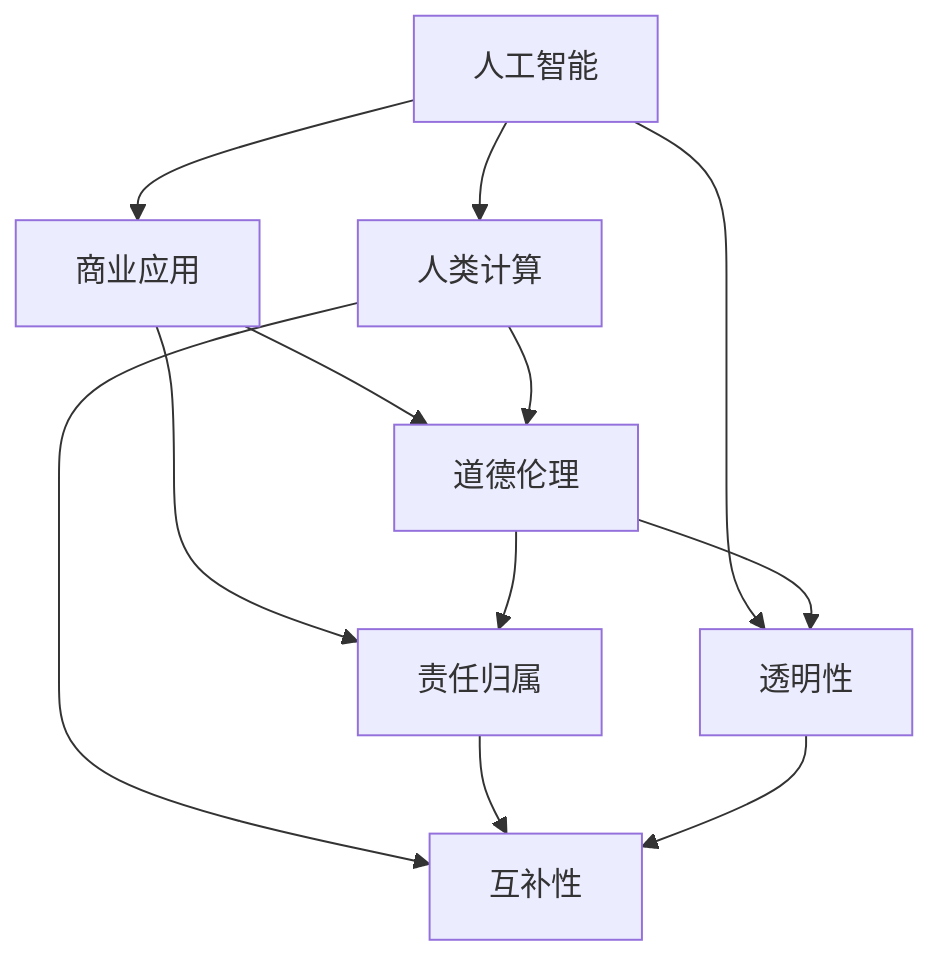

                 

### 背景介绍 Background Introduction

随着人工智能（AI）技术的飞速发展，其在商业领域的应用日益广泛，从自动驾驶、智能制造、金融分析到医疗诊断，AI正深刻地改变着我们的工作和生活方式。这一变革不仅带来了前所未有的效率和生产力提升，同时也引发了一系列伦理道德上的问题。在AI驱动的商业创新浪潮中，如何确保人类计算（Human Computing）的道德考虑因素得到充分重视，成为了一个亟待解决的重要议题。

首先，人类计算在商业中的角色不可忽视。人类在创造性思考、情感理解、复杂决策等方面拥有独特的优势，这些优势是单纯依靠算法和机器学习模型难以完全取代的。因此，在AI驱动的商业创新过程中，如何有效地结合人类计算与机器计算，实现优势互补，是一个关键问题。

其次，AI技术的快速应用也带来了一系列伦理道德挑战。例如，AI算法的决策过程可能存在偏见和不公平性，这不仅损害了商业的公正性，也可能对特定群体造成不公平对待。再者，AI技术的滥用和隐私侵犯问题也日益凸显，如何保障用户数据的安全和隐私权，成为了一个紧迫的问题。

因此，本文旨在探讨AI驱动的创新背景下，人类计算在商业中的道德考虑因素，分析现有问题和挑战，并展望未来的发展趋势。通过本文的讨论，希望为读者提供一个全面的视角，理解在AI时代如何平衡技术创新与道德责任，推动可持续的商业发展。

### 核心概念与联系 Core Concepts and Connections

在深入探讨AI驱动的商业创新及其伦理道德问题时，我们需要明确几个核心概念，并理解它们之间的相互联系。这些核心概念包括人工智能（AI）、人类计算（Human Computing）、道德伦理（Ethical Considerations）和商业应用（Business Applications）。

**人工智能（AI）** 是指通过模拟人类智能行为，使计算机系统具有感知、学习、推理和决策能力的科学技术。AI在商业中的应用范围广泛，包括数据分析、自动化、智能客服、预测建模等。然而，AI系统的运作通常依赖于大量的数据和复杂的算法，这使得它们在处理问题时可能表现出一定程度的偏见和不透明性。

**人类计算（Human Computing）** 强调人类在创造性思维、情感理解和复杂决策等方面的独特优势。尽管AI技术在一些领域已经表现出卓越的性能，但人类在处理复杂、模糊和具有情感色彩的任务时，仍然具有不可替代的作用。例如，在医疗诊断中，医生的专业知识和经验可以帮助识别一些机器难以察觉的细微症状。

**道德伦理（Ethical Considerations）** 是指在行为和决策过程中，如何确保尊重和保护人的尊严、权利和利益。在商业环境中，道德伦理涉及到公平性、透明性、责任感和隐私保护等多个方面。随着AI技术的发展，道德伦理问题变得日益复杂，因为AI系统的决策往往具有不可预见性和不可逆转性。

**商业应用（Business Applications）** 是指AI和人类计算在具体商业场景中的应用。这些应用不仅需要技术上的可行性，还必须符合道德伦理标准，以保障企业的社会责任和可持续发展。例如，在招聘过程中，AI系统可以用于筛选简历，但必须确保不会因为性别、种族或年龄等因素产生歧视。

这些核心概念之间的联系体现在以下几个方面：

1. **互补性**：AI和人类计算在商业应用中具有互补性。AI擅长处理大量数据和复杂计算，而人类计算则在创造性思维和情感理解方面具有优势。通过结合两者的优势，可以更好地解决商业问题。

2. **伦理约束**：AI系统的道德伦理问题直接影响其商业应用。例如，如果AI系统在招聘中表现出性别或种族偏见，那么这种应用就违反了道德伦理标准，可能导致法律和商业风险。

3. **责任归属**：在AI驱动的商业创新中，责任归属问题变得尤为重要。当AI系统出现问题时，是应该由开发者、使用者还是用户承担责任？这种责任归属的模糊性增加了法律和道德风险。

4. **透明性**：AI系统的透明性是确保其道德合法性的关键。通过提高AI系统的透明性，可以更好地理解其决策过程，从而减少潜在的伦理问题。

为了更好地理解这些概念之间的联系，我们可以通过一个Mermaid流程图来展示它们之间的互动关系：



通过这个流程图，我们可以看到，人工智能、人类计算和道德伦理共同构成了商业应用的核心框架，而责任归属和透明性是确保这一框架有效运行的必要条件。

### 核心算法原理 & 具体操作步骤 Core Algorithm Principles and Operational Steps

在讨论AI驱动的商业创新中的道德考虑因素时，我们需要深入了解AI系统的工作原理以及如何在实际操作中应用这些原理。以下是核心算法原理及其具体操作步骤的详细阐述。

**1. 机器学习基础**

机器学习（Machine Learning，ML）是AI系统的核心组成部分，它使计算机系统能够从数据中学习并作出预测或决策。机器学习的基本过程包括数据收集、数据预处理、模型训练、模型评估和模型部署。

- **数据收集**：数据是机器学习的基石。在选择数据源时，需要确保数据的多样性和代表性，避免数据偏差。
- **数据预处理**：包括数据清洗、数据归一化、数据降维等步骤，以消除噪声和异常值，提高数据质量。
- **模型训练**：使用收集到的数据训练机器学习模型。训练过程中，模型通过调整参数以最小化预测误差。
- **模型评估**：通过验证集或测试集评估模型的性能，确保模型具有良好的泛化能力。
- **模型部署**：将训练好的模型部署到实际应用场景中，进行实时预测或决策。

**2. 决策树算法**

决策树（Decision Tree）是一种常见的机器学习算法，用于分类和回归任务。其基本原理是通过一系列条件判断来分割数据，直到满足某种停止条件。

- **停止条件**：当数据集的纯度达到一定阈值或树深度达到最大限制时，停止分裂。
- **节点分裂**：在每个节点上选择一个最佳特征进行分裂，通常使用信息增益、基尼不纯度等指标来评估特征的重要性。
- **叶节点**：叶节点表示最终预测结果。

**3. 随机森林算法**

随机森林（Random Forest）是一种集成学习方法，通过构建多个决策树并投票得到最终预测结果，以提高模型的泛化能力和鲁棒性。

- **决策树构建**：随机森林中的每个决策树都是通过随机特征选择和随机样本生成来构建的。
- **模型集成**：将多个决策树的预测结果进行投票或求平均，得到最终预测结果。

**4. 神经网络算法**

神经网络（Neural Network）是一种模仿人脑结构和功能的计算模型，广泛应用于图像识别、自然语言处理等领域。

- **层结构**：神经网络通常包括输入层、隐藏层和输出层。隐藏层的数量和神经元个数可以灵活调整。
- **激活函数**：激活函数用于引入非线性特性，常用的激活函数包括Sigmoid、ReLU和Tanh等。
- **反向传播**：通过反向传播算法更新网络权重和偏置，以最小化损失函数。

**5. 迁移学习**

迁移学习（Transfer Learning）是一种利用预训练模型进行新任务学习的方法，可以显著提高模型在目标任务上的性能。

- **预训练模型**：在广泛的数据集上预训练一个基础模型，模型已经具备了良好的特征提取能力。
- **微调**：将预训练模型迁移到新任务上，通过少量数据对模型进行微调，以适应新任务的需求。

通过上述算法原理和操作步骤，我们可以构建一个强大的AI系统，并在商业应用中实现高效的预测和决策。然而，这仅仅是技术层面的问题，实际操作中，我们还需要关注算法的道德考虑因素，确保其在应用过程中不损害人类利益。

### 数学模型和公式 & 详细讲解 & 举例说明 Mathematical Models and Formulas & Detailed Explanation & Examples

在AI驱动的商业创新中，数学模型和公式是构建和优化算法的核心工具。以下将详细讲解几个关键数学模型，并举例说明其在实际应用中的使用。

#### 1. 线性回归模型

线性回归（Linear Regression）是一种用于预测连续值的统计模型，其公式如下：

\[ y = \beta_0 + \beta_1 \cdot x \]

其中，\( y \) 是因变量，\( x \) 是自变量，\( \beta_0 \) 是截距，\( \beta_1 \) 是斜率。

**例：** 假设我们想预测一家餐厅的日营业额。自变量可以是天气（温度）、当天是否为周末等。我们可以通过收集历史数据，使用线性回归模型来预测未来的营业额。

#### 2. 决策树模型

决策树（Decision Tree）是一种基于特征分割数据的模型。其公式较为复杂，主要依赖于信息增益或基尼不纯度来选择最佳分割点。信息增益（Information Gain）的公式如下：

\[ IG(D, A) = H(D) - \sum_{v \in Values(A)} \frac{D[A=v]}{D} H(D[A=v]) \]

其中，\( D \) 是数据集，\( A \) 是特征，\( v \) 是特征的取值，\( H \) 是熵函数。

**例：** 假设我们使用决策树模型来预测客户购买行为。特征可以是客户年龄、收入、购买历史等。通过计算每个特征的信息增益，我们可以选择最佳分割点来构建决策树。

#### 3. 支持向量机（SVM）

支持向量机（Support Vector Machine，SVM）是一种用于分类的机器学习算法。其公式如下：

\[ \text{Minimize} \quad \frac{1}{2} \sum_{i=1}^{n} w_i^2 \]

\[ \text{Subject to} \quad y_i (\langle w, x_i \rangle - b) \geq 1 \]

其中，\( w \) 是权重向量，\( x_i \) 是特征向量，\( y_i \) 是标签，\( b \) 是偏置。

**例：** 假设我们要分类不同种类的水果。特征可以是颜色、重量等。通过求解上述优化问题，我们可以找到最优的权重向量，从而实现分类。

#### 4. 神经网络模型

神经网络（Neural Network）是一种复杂的数学模型，用于模拟人脑的计算方式。其基本公式如下：

\[ a_{\text{layer}} = \sigma(\langle W_{\text{layer}}, a_{\text{layer-1}} \rangle + b_{\text{layer}}) \]

其中，\( a_{\text{layer}} \) 是当前层的激活值，\( W_{\text{layer}} \) 是权重矩阵，\( b_{\text{layer}} \) 是偏置，\( \sigma \) 是激活函数。

**例：** 假设我们使用一个简单的神经网络来识别手写数字。输入层包含784个神经元，对应于一个8x8的图像。隐藏层和输出层的神经元数量可以根据需要调整。通过不断调整权重和偏置，我们可以训练神经网络来识别手写数字。

#### 5. 熵函数（Entropy）

熵函数（Entropy）用于衡量系统的混乱程度，常用于信息论和机器学习。其公式如下：

\[ H(X) = -\sum_{x \in X} p(x) \log_2 p(x) \]

其中，\( X \) 是随机变量，\( p(x) \) 是\( x \)的概率。

**例：** 假设我们有一个随机变量\( X \)，其可能的取值为\( {0, 1} \)，且概率分别为\( {0.5, 0.5} \)。我们可以计算其熵：

\[ H(X) = -0.5 \log_2(0.5) - 0.5 \log_2(0.5) = 1 \]

这表明系统处于完全不确定的状态。

通过理解这些数学模型和公式，我们可以更有效地构建和优化AI系统，以满足商业应用的需求。同时，我们也需要确保这些模型在应用过程中符合道德伦理标准，避免对人类造成不公平对待或伤害。

### 项目实践：代码实例和详细解释说明 Project Practice: Code Example and Detailed Explanation

为了更好地理解AI驱动的商业创新中的道德考虑因素，我们将通过一个实际项目来展示代码实例，并详细解释其实现过程。

**项目背景**：

假设我们是一家金融服务公司，希望通过AI技术来优化客户风险评估。客户风险评估对于金融机构至关重要，它不仅影响信贷审批决策，还关系到金融市场的稳定性。

**技术选型**：

我们选择使用Python语言和Scikit-learn库来构建和优化风险评估模型。Scikit-learn是一个强大的机器学习库，它提供了丰富的算法和工具，方便我们进行数据预处理、模型训练和评估。

**实现步骤**：

1. **数据收集与预处理**：

   首先，我们需要收集客户数据，包括收入、年龄、职业、信用历史等。数据收集后，我们需要进行预处理，包括数据清洗、缺失值处理、数据标准化等步骤。

   ```python
   import pandas as pd
   from sklearn.model_selection import train_test_split
   from sklearn.preprocessing import StandardScaler

   # 读取数据
   data = pd.read_csv('customer_data.csv')

   # 数据清洗和缺失值处理
   data = data.dropna()

   # 划分特征和标签
   X = data.drop('credit_score', axis=1)
   y = data['credit_score']

   # 划分训练集和测试集
   X_train, X_test, y_train, y_test = train_test_split(X, y, test_size=0.2, random_state=42)

   # 数据标准化
   scaler = StandardScaler()
   X_train = scaler.fit_transform(X_train)
   X_test = scaler.transform(X_test)
   ```

2. **模型训练与优化**：

   接下来，我们使用决策树算法来训练模型。为了提高模型的性能和鲁棒性，我们可以尝试不同的参数组合，如最大深度、最小样本叶节点等。

   ```python
   from sklearn.tree import DecisionTreeRegressor
   from sklearn.model_selection import GridSearchCV

   # 定义决策树模型
   dt = DecisionTreeRegressor(random_state=42)

   # 参数网格搜索
   parameters = {
       'max_depth': [3, 5, 10],
       'min_samples_leaf': [1, 3, 5]
   }
   cv = GridSearchCV(dt, parameters, cv=5)
   cv.fit(X_train, y_train)

   # 获取最佳参数
   best_params = cv.best_params_
   best_dt = cv.best_estimator_
   ```

3. **模型评估与解释**：

   训练好的模型需要通过测试集进行评估，以验证其泛化能力。同时，为了确保模型符合道德考虑因素，我们需要对其决策过程进行解释。

   ```python
   from sklearn.metrics import mean_squared_error
   import shap

   # 模型评估
   y_pred = best_dt.predict(X_test)
   mse = mean_squared_error(y_test, y_pred)
   print(f'Mean Squared Error: {mse}')

   # 模型解释
   explainer = shap.TreeExplainer(best_dt)
   shap_values = explainer.shap_values(X_test)

   shap.summary_plot(shap_values, X_test, feature_names=data.columns)
   ```

通过上述代码实例，我们可以看到如何使用Python和Scikit-learn库构建和优化一个客户风险评估模型。在实际应用中，我们还需要确保模型不会因为性别、种族等因素产生偏见，这可以通过敏感性分析（Sensitivity Analysis）和公平性测试（Fairness Testing）来实现。

**关键代码解释**：

- 数据预处理：通过数据清洗、缺失值处理和数据标准化，确保模型输入的质量。
- 网格搜索：通过网格搜索（GridSearchCV）找到最佳模型参数，提高模型的性能。
- 模型评估：使用均方误差（MSE）评估模型在测试集上的表现。
- 模型解释：使用SHAP（SHapley Additive exPlanations）工具解释模型决策过程，确保其透明性和可解释性。

通过这个项目实例，我们可以看到如何将AI技术应用于商业场景，同时确保模型符合道德考虑因素，从而实现商业价值和道德责任的平衡。

### 实际应用场景 Practical Application Scenarios

AI驱动的商业创新在各个行业中已经取得了显著的应用成果，以下是几个典型的实际应用场景：

**1. 金融行业**

在金融行业中，AI技术被广泛应用于信用评分、风险控制、投资决策和客户服务等方面。例如，银行可以使用AI模型来评估客户的信用风险，从而更精确地决定贷款审批和利率设定。此外，AI还可以用于监控交易异常，及时发现潜在的欺诈行为，提高金融市场的安全性。

**2. 医疗保健**

AI技术在医疗保健领域也具有广泛的应用前景。通过深度学习和图像识别技术，AI可以帮助医生进行疾病诊断，如肿瘤检测、心脏病诊断等。同时，AI还可以用于医疗数据的分析和挖掘，为临床决策提供支持。例如，通过分析患者的电子健康记录，AI可以帮助预测疾病发展趋势，从而实现个性化的预防和治疗。

**3. 零售业**

零售业中的AI应用主要包括商品推荐、库存管理和客户关系管理等方面。基于用户行为数据和购物历史，AI可以精确地推荐商品，提高客户的满意度和购买意愿。此外，AI还可以用于库存管理，通过预测销量和需求变化，优化库存水平，降低库存成本。在客户关系管理方面，AI可以帮助企业更好地理解客户需求，提供个性化的服务和体验。

**4. 制造业**

在制造业中，AI技术被用于生产优化、质量控制、设备维护和供应链管理等方面。通过机器学习和预测分析，AI可以帮助企业优化生产流程，提高生产效率和产品质量。例如，AI可以用于预测设备故障，提前安排维护计划，从而减少停机时间和维修成本。在供应链管理方面，AI可以帮助企业实时监控库存和物流信息，提高供应链的灵活性和响应速度。

**5. 教育行业**

在教育行业中，AI技术被用于个性化教学、学习分析和管理等方面。通过分析学生的学习行为和成绩，AI可以为学生提供个性化的学习建议和资源，提高学习效果。同时，AI还可以用于学习数据分析，帮助教育机构了解学生的学习状况，优化教学策略和资源分配。

这些实际应用场景展示了AI驱动的商业创新在各个行业中的广泛潜力和重要性。然而，随着AI技术的不断发展和应用，我们还需要关注其道德和社会影响，确保AI技术在商业应用中的公平性、透明性和可持续性。

### 工具和资源推荐 Tools and Resources Recommendation

为了更好地理解和应用AI驱动的商业创新，以下推荐一些有用的学习资源、开发工具和相关论文著作，以帮助读者深入探索这一领域。

**1. 学习资源推荐**

- **书籍**：
  - 《深度学习》（Deep Learning） - Ian Goodfellow、Yoshua Bengio和Aaron Courville
  - 《Python机器学习》（Python Machine Learning） - Sebastian Raschka和Vahid Mirjalili
  - 《数据科学手册》（Data Science from Scratch） - Joel Grus

- **在线课程**：
  - Coursera上的《机器学习》（Machine Learning） - Andrew Ng
  - edX上的《人工智能导论》（Introduction to Artificial Intelligence） - AI21 Labs
  - Udacity的《深度学习纳米学位》（Deep Learning Nanodegree）

- **博客与网站**：
  - Medium上的机器学习和AI相关文章
  - arXiv.org上的最新AI研究论文
  - TensorFlow官方文档和教程

**2. 开发工具框架推荐**

- **编程语言**：
  - Python：由于其丰富的库和社区支持，Python是AI开发的流行语言。
  - R：在统计分析和数据挖掘领域，R语言具有强大的功能。

- **库和框架**：
  - TensorFlow：用于构建和训练深度学习模型的强大框架。
  - PyTorch：具有灵活性和动态计算图，适合研究和新模型开发。
  - Scikit-learn：提供多种机器学习算法，适合快速原型开发。
  - Keras：基于TensorFlow的高层神经网络API，简化模型构建过程。

- **工具与平台**：
  - Google Colab：免费的云平台，提供强大的GPU和TPU支持。
  - Jupyter Notebook：交互式的数据分析和机器学习开发环境。
  - AWS SageMaker：用于构建、训练和部署机器学习模型的平台。

**3. 相关论文著作推荐**

- **论文**：
  - “Deep Learning” - Ian Goodfellow（2016）
  - “Generative Adversarial Nets” - Ian Goodfellow et al.（2014）
  - “Reinforcement Learning: An Introduction” - Richard S. Sutton and Andrew G. Barto（2018）

- **著作**：
  - 《人工神经网络：基础与实现》（Artificial Neural Networks: Foundations and Implementation） - Christian G. Atkeson et al.（1997）
  - 《模式识别与机器学习》（Pattern Recognition and Machine Learning） - Christopher M. Bishop（2006）
  - 《统计学习方法》（Statistical Learning Methods） - 李航（2012）

通过这些学习资源、开发工具和相关论文著作，读者可以更全面地了解AI驱动的商业创新，掌握必要的技能和知识，为实际应用打下坚实的基础。

### 总结：未来发展趋势与挑战 Summary: Future Trends and Challenges

随着AI技术的不断进步，其在商业领域的应用前景愈发广阔。然而，这一快速发展的过程也伴随着一系列道德和社会挑战，需要我们深刻认识和谨慎应对。

**未来发展趋势**：

1. **AI的普及与深入应用**：AI技术将在更多行业和领域中得到普及，从智能制造、医疗保健到金融、教育等，AI的应用场景将更加多样化和深入。

2. **跨学科融合**：AI与生物学、心理学、社会学等学科的交叉融合将推动新技术的诞生，为解决复杂问题提供更多可能性。

3. **透明性与可解释性**：为了增强公众对AI技术的信任，提高透明性和可解释性将成为重要趋势。这包括开发可解释的AI模型和工具，以及建立透明的算法决策过程。

4. **人工智能伦理法规**：随着AI应用的不断扩大，全球各国可能会出台更严格的伦理法规，以规范AI的开发和使用，确保其符合道德和社会责任。

**面临的挑战**：

1. **隐私保护**：AI技术在数据收集和处理过程中可能侵犯用户隐私，如何在保护隐私的同时充分利用数据，是一个亟待解决的难题。

2. **算法偏见与歧视**：AI算法的决策过程可能受到数据偏见的影响，导致不公平对待。如何消除算法偏见，确保AI的公平性，是当前研究的重点。

3. **责任归属**：当AI系统出现错误或导致损害时，如何确定责任归属，是法律和道德上的一大挑战。这涉及到开发者、使用者还是用户的责任划分。

4. **职业转型与就业**：随着AI技术的广泛应用，一些传统职业可能会被自动化替代，这将对就业市场和劳动力市场带来重大影响。

5. **社会影响**：AI技术的快速发展可能带来社会结构和文化价值观念的变化，如何平衡技术创新与社会稳定，是未来需要持续探讨的问题。

综上所述，AI驱动的商业创新在带来巨大机遇的同时，也面临诸多道德和社会挑战。我们需要在技术进步和伦理道德之间找到平衡点，确保AI技术的健康发展，推动社会的可持续进步。

### 附录：常见问题与解答 Appendix: Frequently Asked Questions and Answers

**Q1：AI技术是否会完全替代人类工作？**

A1：尽管AI技术在某些领域已经表现出卓越的性能，但完全替代人类工作仍然面临巨大挑战。AI擅长处理大量数据和重复性任务，但在创造性思考、情感理解和复杂决策方面，人类计算仍然具有不可替代的优势。因此，AI更可能是人类工作的辅助工具，而不是完全替代者。

**Q2：如何确保AI系统的透明性和可解释性？**

A2：确保AI系统的透明性和可解释性是一个重要课题。可以通过开发可解释的AI模型（如决策树、规则系统）和使用解释性工具（如LIME、SHAP）来实现。此外，建立透明的算法决策过程和公开模型训练数据，也有助于提高系统的可解释性。

**Q3：AI系统的偏见如何消除？**

A3：消除AI系统的偏见可以通过多种方法实现。首先，在数据收集和处理过程中确保数据的多样性和代表性，避免数据偏见。其次，使用公平性测试和敏感性分析来评估模型的偏见，并根据评估结果调整模型参数。最后，通过持续的训练和优化，减少模型在决策过程中的偏见。

**Q4：如何确保AI系统的责任归属？**

A4：确保AI系统的责任归属是一个复杂的法律和道德问题。可以建立明确的责任分配机制，明确开发者、使用者和用户之间的责任关系。此外，制定相关的法律法规，明确AI系统的责任和法律责任，有助于规范AI系统的开发和使用。

**Q5：AI技术对隐私保护有哪些影响？**

A5：AI技术在数据收集和处理过程中可能侵犯用户隐私。为了保护用户隐私，可以采取以下措施：首先，确保数据收集的合法性和透明性；其次，使用加密技术和匿名化处理，保护用户数据的隐私；最后，建立用户隐私保护机制，确保用户在AI系统中的隐私权得到保障。

### 扩展阅读 & 参考资料 Further Reading & References

**书籍推荐**

1. 《深度学习》：作者 Ian Goodfellow、Yoshua Bengio和Aaron Courville，这是一本经典且全面的深度学习教材，适合初学者和专业人士。
2. 《Python机器学习》：作者 Sebastian Raschka和Vahid Mirjalili，通过Python语言，介绍了多种机器学习算法的应用和实践。
3. 《数据科学从零开始》：作者 Joel Grus，涵盖数据科学的基础知识和实际应用，适合对数据科学感兴趣的学习者。

**论文著作推荐**

1. “Deep Learning” - Ian Goodfellow（2016），这是一篇关于深度学习全面介绍的综述文章，对深度学习的原理和应用进行了详细阐述。
2. “Generative Adversarial Nets” - Ian Goodfellow et al.（2014），介绍了生成对抗网络（GAN）的原理和应用，是深度学习领域的重要成果。
3. “Reinforcement Learning: An Introduction” - Richard S. Sutton and Andrew G. Barto（2018），这是一本关于强化学习的基础教材，对强化学习的原理和应用进行了深入讲解。

**在线资源推荐**

1. Coursera：提供多种机器学习和深度学习的在线课程，由领域内的顶尖专家授课。
2. edX：汇聚全球顶尖大学的在线课程资源，包括人工智能、机器学习等前沿领域。
3. arXiv.org：计算机科学和人工智能领域的最新研究论文，是了解最新研究成果的重要渠道。

通过上述推荐资源，读者可以更深入地了解AI驱动的商业创新的相关知识，为实际应用和研究提供有力支持。

