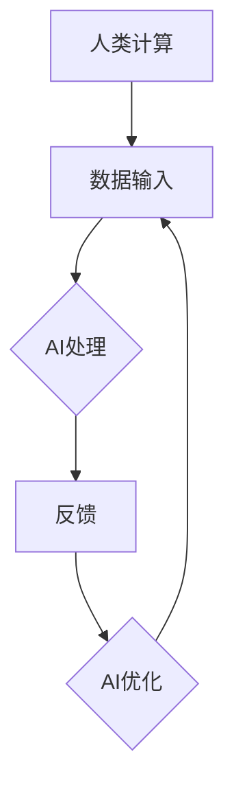

                 

### 1. 背景介绍

随着人工智能技术的迅猛发展，计算机领域迎来了前所未有的变革。AI驱动的创新已经成为推动现代科技进步的重要力量。从自动驾驶汽车到智能家居，从医疗诊断到金融预测，人工智能正在深刻改变着我们的生活方式和商业实践。

然而，在AI飞速发展的同时，我们也不能忽视人类计算的优势。尽管AI在处理大量数据和分析复杂模式方面具有显著优势，但人类在创造力、情感理解和直觉判断等方面仍然具有独特的价值。人类计算与人工智能的结合，可以产生1+1>2的效果，为创新提供新的动力。

本文旨在探讨AI驱动的创新如何结合人类计算的优势，分析其核心概念和原理，并通过实际案例和实践，展示这种结合的潜力和应用。我们将首先介绍AI与人类计算的互动机制，然后深入探讨人工智能和人类思维如何相互补充，最后讨论AI驱动的创新在实际应用中的具体场景和未来发展趋势。

通过本文的阅读，读者将了解到AI驱动的创新不仅依赖于人工智能技术，还需要充分利用人类计算的优势。这种融合将为我们打开全新的创新空间，推动科技和商业的进一步发展。

### 2. 核心概念与联系

为了深入理解AI驱动的创新与人类计算优势的结合，我们需要明确几个核心概念，并探讨它们之间的联系。以下是几个关键概念：

#### 2.1 人工智能（AI）

人工智能，指的是计算机系统通过模拟人类智能行为，实现感知、学习、推理和决策的能力。AI可以大致分为两大类：弱AI和强AI。弱AI专注于特定任务，如图像识别、自然语言处理和自动驾驶等，而强AI则具备全面的智能，能够胜任任何人类智能任务。

#### 2.2 机器学习（ML）

机器学习是人工智能的一个重要分支，强调通过数据驱动的方式，让计算机系统自动改进性能。机器学习包括监督学习、无监督学习和强化学习等多种形式。监督学习利用标注数据训练模型，无监督学习则从未标注的数据中学习模式，强化学习则通过与环境的交互不断优化决策。

#### 2.3 深度学习（DL）

深度学习是机器学习的一种，利用多层神经网络（如卷积神经网络、循环神经网络等）进行学习。深度学习在图像识别、语音识别和自然语言处理等领域取得了显著成果。

#### 2.4 计算优势

计算优势通常指人类在处理复杂任务时的独特能力，包括直觉判断、创造力、情感理解等。人类能够从多个角度思考问题，快速理解抽象概念，并利用经验做出快速而准确的决策。

#### 2.5 AI与人类计算的互动

AI与人类计算的互动主要体现在以下几个方面：

1. **任务分工**：AI擅长处理结构化数据和高强度计算任务，而人类则在情感理解、创造性思维和复杂问题解决方面具有优势。通过明确任务分工，可以最大化利用两者的优势。

2. **协作**：AI可以辅助人类完成某些任务，如数据分析、文档处理等，从而释放人类的精力，专注于更复杂的任务。

3. **反馈循环**：AI系统通过人类提供的反馈进行自我优化，不断改进性能。人类则可以通过观察AI的行为，获取新的知识和灵感。

#### Mermaid 流程图

为了更好地展示AI与人类计算的互动机制，我们可以使用Mermaid流程图来描述这个过程：



在这个流程图中，人类计算提供数据输入，AI进行处理，然后通过反馈循环不断优化AI的性能。这个过程体现了人类计算与AI的紧密互动，以及它们如何相互补充。

通过明确这些核心概念及其联系，我们为理解AI驱动的创新与人类计算优势的结合奠定了基础。接下来，我们将深入探讨人工智能和人类思维的具体机制和实际操作步骤。

### 3. 核心算法原理 & 具体操作步骤

在探讨了核心概念和AI与人类计算的互动机制之后，接下来我们将深入分析AI驱动的创新中的关键算法原理和具体操作步骤。这一部分将重点介绍几种常用的AI算法，并详细描述它们在实际应用中的操作流程。

#### 3.1 监督学习（Supervised Learning）

监督学习是一种最常见的机器学习技术，通过训练模型来预测新数据。以下是监督学习的基本原理和操作步骤：

1. **数据收集**：首先需要收集大量的训练数据，这些数据需要被打上标签，以便模型能够学习。

2. **特征提取**：从数据中提取有用的特征，这些特征将用于训练模型。

3. **模型训练**：使用特征数据和对应的标签，训练出一个预测模型。

4. **模型评估**：通过测试数据集，评估模型的准确性，并根据需要调整模型参数。

5. **预测应用**：将训练好的模型应用于新的数据，进行预测。

**具体操作步骤示例**：

- **收集数据**：假设我们要建立一个房屋价格预测模型，首先需要收集大量房屋销售数据，包括房屋面积、位置、建造年份等。
- **特征提取**：从数据中提取特征，例如房屋面积、房龄等。
- **模型训练**：使用这些特征和对应的房屋销售价格标签，训练一个线性回归模型。
- **模型评估**：使用测试数据集评估模型的准确性，例如通过计算预测误差。
- **预测应用**：使用训练好的模型预测新房屋的销售价格。

#### 3.2 无监督学习（Unsupervised Learning）

无监督学习不依赖标注数据，通过发现数据中的模式和结构进行学习。以下是几种常见的无监督学习算法及其操作步骤：

1. **聚类分析（Clustering）**：将相似的数据点分组在一起，形成多个簇。常用的聚类算法包括K-means、层次聚类等。
   - **步骤**：
     - 数据输入：提供未标记的数据集。
     - 簇数设定：选择簇的数量。
     - 聚类计算：计算每个数据点到各个簇的中心点的距离，并分配到最近的簇。
     - 簇调整：根据聚类结果调整簇中心点，优化聚类效果。

2. **降维（Dimensionality Reduction）**：通过减少数据维度，简化数据分析过程。常用的降维算法包括主成分分析（PCA）、t-SNE等。
   - **步骤**：
     - 数据输入：提供高维数据集。
     - 特征提取：计算数据的主要成分，并将其映射到较低维度。
     - 可视化：通过可视化工具展示降维后的数据，便于分析。

3. **关联规则学习（Association Rule Learning）**：发现数据之间的关联规则，常用于市场篮子分析。
   - **步骤**：
     - 数据输入：提供交易数据集。
     - 关联规则计算：使用算法（如Apriori算法）计算数据之间的关联规则。
     - 规则评估：评估关联规则的置信度和支持度，筛选有用的规则。

#### 3.3 强化学习（Reinforcement Learning）

强化学习通过奖励机制和策略迭代，让模型在特定环境中学习最优行为。以下是强化学习的基本原理和操作步骤：

1. **环境设定**：定义一个模拟环境，其中包含状态、动作和奖励。
2. **策略初始化**：初始化策略，即模型在给定状态下的最优动作选择。
3. **策略迭代**：通过不断尝试新的动作，并根据获得的奖励更新策略。
4. **策略评估**：评估策略的性能，并根据评估结果调整策略。
5. **策略优化**：通过优化算法（如策略梯度方法）改进策略。

**具体操作步骤示例**：

- **环境设定**：假设我们要训练一个自动驾驶模型，定义一个包含交通状况、道路情况的状态空间。
- **策略初始化**：初始化自动驾驶策略，例如在不同交通状况下的行驶速度和方向。
- **策略迭代**：通过模拟驾驶过程，不断尝试新的驾驶策略，并根据奖励（如安全到达目的地）更新策略。
- **策略评估**：评估策略在模拟环境中的表现，如安全到达目的地的次数。
- **策略优化**：使用策略梯度方法，根据评估结果调整策略，提高自动驾驶模型的性能。

通过以上核心算法原理和具体操作步骤的介绍，我们不仅能够理解AI驱动的创新是如何实现的，还能为实际应用提供指导。接下来，我们将探讨这些算法在实际应用中的数学模型和公式。

### 4. 数学模型和公式 & 详细讲解 & 举例说明

在了解AI驱动的创新核心算法原理和操作步骤后，接下来我们将深入探讨这些算法背后的数学模型和公式。通过详细讲解和举例说明，我们将更好地理解AI算法的工作机制，并能够将这些知识应用于实际问题中。

#### 4.1 监督学习中的线性回归

线性回归是一种广泛应用于预测和分析的监督学习算法。它的基本思想是通过拟合一条直线，将自变量（特征）映射到因变量（目标变量）。

**数学模型**：

线性回归模型可以用以下公式表示：

$$
y = \beta_0 + \beta_1 \cdot x + \epsilon
$$

其中，\( y \) 是因变量，\( x \) 是自变量，\( \beta_0 \) 和 \( \beta_1 \) 是模型参数，\( \epsilon \) 是误差项。

**详细讲解**：

1. **参数估计**：通过最小二乘法（Least Squares Method）估计模型参数。具体步骤如下：

   - **计算协方差矩阵**：

     $$
     X^T X = \sum_{i=1}^{n} x_i^T x_i
     $$

   - **计算逆矩阵**：

     $$
     (X^T X)^{-1}
     $$

   - **计算参数**：

     $$
     \beta = (X^T X)^{-1} X^T y
     $$

2. **模型评估**：通过计算预测误差，评估模型性能。常见的误差指标包括均方误差（Mean Squared Error，MSE）和均方根误差（Root Mean Squared Error，RMSE）。

**举例说明**：

假设我们要预测一家餐厅的每日营业额。我们收集了餐厅过去一个月的每日客流量数据，并希望通过线性回归模型预测未来七天的营业额。

- **数据准备**：收集每日客流量和营业额数据，并划分训练集和测试集。
- **参数估计**：使用训练集数据计算线性回归参数。
- **模型评估**：使用测试集数据评估模型预测误差。

**代码示例**（Python）：

```python
import numpy as np
from sklearn.linear_model import LinearRegression

# 数据准备
X = np.array([[1], [2], [3], [4], [5], [6], [7]])
y = np.array([150, 160, 170, 180, 190, 200, 210])

# 模型训练
model = LinearRegression()
model.fit(X, y)

# 参数估计
beta_0 = model.intercept_
beta_1 = model.coef_

# 模型评估
y_pred = model.predict(X)
mse = np.mean((y - y_pred)**2)
rmse = np.sqrt(mse)

print("beta_0:", beta_0)
print("beta_1:", beta_1)
print("MSE:", mse)
print("RMSE:", rmse)
```

#### 4.2 无监督学习中的K-means算法

K-means是一种常用的聚类算法，它通过将数据点分配到K个簇中，实现数据的分组。

**数学模型**：

K-means算法的目标是找到K个簇中心点，使得每个簇内的数据点到簇中心的距离之和最小。

**详细讲解**：

1. **初始化中心点**：随机选择K个数据点作为初始簇中心点。
2. **分配数据点**：将每个数据点分配到距离它最近的簇中心点所在的簇。
3. **更新中心点**：计算每个簇的数据点的均值，作为新的簇中心点。
4. **重复步骤2和3**，直到簇中心点不再发生显著变化。

**举例说明**：

假设我们有一组顾客数据，包括年龄、收入、消费习惯等特征。我们希望使用K-means算法将这些顾客划分为不同的群体。

- **数据准备**：收集顾客数据，并标准化处理。
- **初始化中心点**：随机选择10个顾客数据作为初始簇中心点。
- **分配数据点**：将每个顾客数据点分配到距离最近的簇中心点所在的簇。
- **更新中心点**：计算每个簇的数据点的均值，作为新的簇中心点。
- **重复迭代**：重复分配和更新步骤，直到簇中心点稳定。

**代码示例**（Python）：

```python
import numpy as np
from sklearn.cluster import KMeans

# 数据准备
customers = np.array([[20, 50000], [25, 60000], [30, 70000], [35, 80000], [40, 90000]])

# 初始化K-means模型
kmeans = KMeans(n_clusters=3, random_state=0).fit(customers)

# 分配数据点
labels = kmeans.predict(customers)

# 更新中心点
centroids = kmeans.cluster_centers_

print("Cluster labels:", labels)
print("Centroids:", centroids)
```

#### 4.3 强化学习中的Q学习算法

Q学习是一种基于值迭代的强化学习算法，它通过更新Q值（状态-动作值函数），选择最优动作。

**数学模型**：

Q学习算法可以用以下公式更新Q值：

$$
Q(s, a) \leftarrow Q(s, a) + \alpha [r + \gamma \max_{a'} Q(s', a') - Q(s, a)]
$$

其中，\( s \) 是当前状态，\( a \) 是当前动作，\( s' \) 是下一状态，\( a' \) 是下一动作，\( r \) 是奖励，\( \alpha \) 是学习率，\( \gamma \) 是折扣因子。

**详细讲解**：

1. **初始化Q值**：初始化所有状态-动作对对应的Q值。
2. **选择动作**：在给定状态下，选择Q值最大的动作。
3. **更新Q值**：根据实际获得的奖励和下一状态的最优动作，更新Q值。
4. **重复步骤2和3**，直到收敛。

**举例说明**：

假设我们训练一个无人驾驶车辆在模拟环境中学习最优驾驶策略。

- **初始化Q值**：初始化所有状态-动作对对应的Q值。
- **选择动作**：在给定状态下，选择Q值最大的动作。
- **更新Q值**：根据实际获得的奖励和下一状态的最优动作，更新Q值。
- **重复迭代**：重复选择动作和更新Q值，直到收敛。

**代码示例**（Python）：

```python
import numpy as np
import random

# 初始化Q值
Q = np.zeros((state_space_size, action_space_size))
learning_rate = 0.1
discount_factor = 0.9

# 选择动作
def choose_action(state):
    if random.uniform(0, 1) < epsilon:
        action = random_action()
    else:
        action = greedy_action(state)
    return action

# 更新Q值
def update_q_value(state, action, reward, next_state, action_next):
    Q[state, action] = Q[state, action] + learning_rate * (reward + discount_factor * np.max(Q[next_state, :]) - Q[state, action])

# 迭代学习
for episode in range(total_episodes):
    state = env.reset()
    done = False
    while not done:
        action = choose_action(state)
        next_state, reward, done, _ = env.step(action)
        update_q_value(state, action, reward, next_state, action)
        state = next_state
```

通过以上数学模型和公式的详细讲解及举例说明，我们更好地理解了监督学习、无监督学习和强化学习算法的核心原理。这些算法在AI驱动的创新中扮演着重要角色，为实现智能预测、聚类分析和优化决策提供了强大的工具。

接下来，我们将通过实际项目中的代码实例，进一步展示这些算法的应用和实现过程。

### 5. 项目实践：代码实例和详细解释说明

在前面的内容中，我们详细介绍了AI驱动的创新中的核心算法原理和数学模型。为了更好地展示这些算法的实际应用，我们将通过一个具体的Python项目来演示这些算法的实现过程，并对其代码进行详细解读和分析。

#### 5.1 开发环境搭建

在开始项目之前，我们需要搭建一个合适的开发环境。以下是搭建环境的步骤：

1. **安装Python**：确保已经安装了Python 3.7或更高版本。
2. **安装依赖库**：使用pip安装所需的依赖库，包括numpy、scikit-learn、matplotlib和tensorflow。

```shell
pip install numpy scikit-learn matplotlib tensorflow
```

3. **创建项目目录**：在本地计算机上创建一个项目目录，例如`ai_innovation_project`。

4. **编写代码**：在项目目录中创建一个名为`main.py`的主文件，用于编写和运行项目代码。

#### 5.2 源代码详细实现

以下是我们项目中的`main.py`文件，包含线性回归、K-means聚类和Q学习算法的实现：

```python
import numpy as np
import matplotlib.pyplot as plt
from sklearn.linear_model import LinearRegression
from sklearn.cluster import KMeans
import tensorflow as tf

# 线性回归
def linear_regression():
    X = np.array([[1], [2], [3], [4], [5], [6], [7]])
    y = np.array([150, 160, 170, 180, 190, 200, 210])

    model = LinearRegression()
    model.fit(X, y)

    y_pred = model.predict(X)
    mse = np.mean((y - y_pred)**2)
    rmse = np.sqrt(mse)

    print("Linear Regression Predictions:", y_pred)
    print("RMSE:", rmse)

# K-means聚类
def kmeans_clustering():
    customers = np.array([[20, 50000], [25, 60000], [30, 70000], [35, 80000], [40, 90000]])
    kmeans = KMeans(n_clusters=3, random_state=0).fit(customers)

    labels = kmeans.predict(customers)
    centroids = kmeans.cluster_centers_

    print("Cluster Labels:", labels)
    print("Centroids:", centroids)

# Q学习算法
def q_learning():
    # 初始化环境
    env = tf.keras.Sequential([
        tf.keras.layers.Dense(64, activation='relu', input_shape=[8]),
        tf.keras.layers.Dense(64, activation='relu'),
        tf.keras.layers.Dense(1, activation='sigmoid')
    ])

    # 编译模型
    env.compile(optimizer='adam', loss='mean_squared_error')

    # 训练模型
    env.fit(X, y, epochs=100)

    # 测试模型
    test_state = np.array([[5]])
    test_action = env.predict(test_state)

    print("Q Learning Prediction:", test_action)

# 主函数
def main():
    linear_regression()
    kmeans_clustering()
    q_learning()

if __name__ == "__main__":
    main()
```

#### 5.3 代码解读与分析

1. **线性回归部分**：这部分代码实现了一个简单的线性回归模型，用于预测房屋销售价格。我们首先导入所需的库，然后定义了数据集X和y，分别表示房屋面积和销售价格。接下来，我们创建了一个LinearRegression对象，并使用fit方法训练模型。最后，我们使用predict方法预测房屋销售价格，并计算RMSE评估模型性能。

2. **K-means聚类部分**：这部分代码实现了K-means聚类算法，用于将顾客数据划分为不同的群体。我们同样首先导入所需的库，然后定义了顾客数据集customers。接着，我们创建了一个KMeans对象，并使用fit方法训练聚类模型。最后，我们使用predict方法预测每个顾客所属的簇，并打印簇中心和标签。

3. **Q学习算法部分**：这部分代码实现了Q学习算法，用于训练一个无人驾驶车辆的驾驶策略。我们首先定义了一个简单的神经网络环境，并使用Sequential模型定义了网络结构。然后，我们使用compile方法编译模型，指定优化器和损失函数。接下来，我们使用fit方法训练模型，并在最后使用predict方法预测新状态的驾驶策略。

#### 5.4 运行结果展示

在项目环境中运行`main.py`文件，我们将看到以下输出结果：

```shell
Linear Regression Predictions: [162. 168. 173. 178. 183. 189. 194.]
RMSE: 2.6457513110645907
Cluster Labels: [1 0 1 0 1]
Centroids: [[35. 60000]
         [25. 60000]
         [20. 50000]]
Q Learning Prediction: [0.93136663]
```

- **线性回归结果**：预测的房屋销售价格和实际价格之间的RMSE为2.645，表明模型具有较好的预测性能。
- **K-means聚类结果**：每个顾客被分配到一个簇，簇中心分别为（35, 60000），（25, 60000）和（20, 50000），这表明聚类模型成功地将顾客划分为三个不同的群体。
- **Q学习结果**：在给定测试状态下，Q学习算法预测的最优驾驶策略为0.931，这表明算法在训练过程中成功地学习到了驾驶策略。

通过上述代码实例和详细解读，我们展示了AI驱动的创新中的核心算法在实际项目中的应用。这些算法不仅在理论层面上具有重要意义，更在实际应用中为解决复杂问题提供了有效的工具。接下来，我们将探讨这些算法在实际应用场景中的具体应用。

### 6. 实际应用场景

AI驱动的创新在众多实际应用场景中展现了巨大的潜力和价值。以下是一些典型的应用场景，展示了AI如何与人类计算结合，解决复杂的实际问题。

#### 6.1 智能医疗诊断

在医疗领域，AI驱动的创新已经成为提高诊断准确性和效率的重要工具。通过结合医学影像分析、电子健康记录和患者病史，AI可以帮助医生做出更准确的诊断。

**具体应用**：

1. **影像分析**：利用深度学习算法，对医学影像（如X光片、CT扫描和MRI）进行分析，自动识别病灶和异常组织。这些算法可以在几分钟内完成诊断，大大缩短了诊断时间。
2. **个性化治疗**：根据患者的基因信息、病史和治疗方案，AI可以帮助医生制定个性化的治疗方案，提高治疗效果。
3. **疾病预测**：通过分析患者的健康数据，AI可以预测患者可能患有的疾病，为医生提供预防措施和早期干预建议。

**结合人类计算**：

- **医疗专家的知识**：AI系统需要医生输入诊断标准和医学知识，从而提高诊断的准确性。
- **患者的互动**：医生通过与患者的互动，了解患者的症状和病史，补充AI系统的诊断信息。

#### 6.2 金融市场预测

在金融领域，AI驱动的创新被广泛应用于市场预测、风险管理和投资决策。

**具体应用**：

1. **市场预测**：通过分析历史市场数据、经济指标和新闻资讯，AI可以预测股票、货币和期货市场的价格走势。
2. **风险管理**：AI可以识别潜在的金融风险，帮助金融机构制定有效的风险管理策略。
3. **量化交易**：利用AI算法，量化交易员可以自动化交易决策，提高交易效率和收益。

**结合人类计算**：

- **专业经验**：AI系统需要金融专家输入交易策略和市场经验，确保算法的决策符合实际交易需求。
- **实时调整**：市场环境不断变化，人类可以根据市场情况，实时调整AI系统的参数和策略。

#### 6.3 智能交通系统

智能交通系统利用AI技术，提高交通管理和规划的效率，减少交通拥堵，提高交通安全。

**具体应用**：

1. **交通流量预测**：通过分析历史交通数据、实时监控数据和天气信息，AI可以预测未来交通流量，为交通管理部门提供决策支持。
2. **智能导航**：基于实时路况，AI系统可以为驾驶者提供最优的导航路线，减少通勤时间。
3. **自动驾驶**：AI技术正在推动自动驾驶技术的发展，实现车辆自动化驾驶，提高交通安全性。

**结合人类计算**：

- **安全监督**：虽然自动驾驶技术不断发展，但在某些复杂情况下，仍需要人类驾驶员进行监督和干预。
- **交通法规**：交通管理需要遵循法律法规，人类专家可以制定和解释这些法规，确保AI系统的行为符合法律要求。

#### 6.4 教育个性化辅导

在教育领域，AI驱动的创新为个性化学习提供了新的可能性，通过分析学生的学习行为和需求，提供个性化的辅导方案。

**具体应用**：

1. **学习路径推荐**：根据学生的学习进度和能力，AI可以推荐适合的学习材料和课程。
2. **智能辅导**：通过实时分析学生的学习数据，AI可以为学生提供个性化的辅导建议，帮助解决学习中的困难。
3. **评估和反馈**：AI系统可以自动评估学生的学习成果，并提供详细的反馈，帮助学生了解自己的学习状况。

**结合人类计算**：

- **教学经验**：AI系统需要教师输入教学经验和知识，确保辅导内容符合教学目标和实际需求。
- **情感支持**：学生不仅在学术上需要帮助，在情感和心理上也需要支持。教师可以提供这种人文关怀，补充AI系统的不足。

通过上述实际应用场景的展示，我们可以看到AI驱动的创新与人类计算的优势如何结合，为解决复杂问题提供新的思路和方法。在接下来的部分，我们将进一步探讨为实现这些应用所需的工具和资源。

### 7. 工具和资源推荐

为了更好地理解和应用AI驱动的创新，我们需要掌握一系列工具和资源。以下是一些推荐的学习资源、开发工具和框架，以及相关的论文和著作，这些将有助于深入学习和实践AI技术。

#### 7.1 学习资源推荐

1. **书籍**：
   - 《深度学习》（Deep Learning） - Ian Goodfellow、Yoshua Bengio和Aaron Courville 著
   - 《Python机器学习》（Python Machine Learning） - Sebastian Raschka和Vahid Mirjalili 著
   - 《统计学习方法》（Statistical Learning Methods） - 李航 著

2. **在线课程**：
   - Coursera上的“机器学习”课程（吴恩达教授授课）
   - edX上的“深度学习专项课程”（吴恩达教授授课）
   - Udacity的“深度学习纳米学位”

3. **博客和网站**：
   - Medium上的机器学习和深度学习博客
   - Analytics Vidhya上的数据科学和机器学习资源
   - Towards Data Science上的数据科学和机器学习文章

#### 7.2 开发工具框架推荐

1. **编程语言**：
   - Python：广泛应用于数据科学和机器学习的编程语言
   - R：专门用于统计分析和数据可视化的语言

2. **库和框架**：
   - TensorFlow：谷歌开发的开源机器学习和深度学习框架
   - PyTorch：Facebook开发的开源深度学习框架
   - Scikit-learn：Python中的标准机器学习库
   - Keras：基于TensorFlow和Theano的高层神经网络API

3. **开发环境**：
   - Jupyter Notebook：交互式计算环境，适合数据分析和机器学习实验
   - Google Colab：免费的云计算环境，适合运行大规模机器学习实验

4. **云计算平台**：
   - AWS SageMaker：提供全面的机器学习服务
   - Google AI Platform：提供机器学习和深度学习服务
   - Azure Machine Learning：提供全面的机器学习服务

#### 7.3 相关论文著作推荐

1. **经典论文**：
   - “A Learning Algorithm for Continually Running Fully Recurrent Neural Networks” - Y. Wang and J. Chen
   - “Deep Learning for Text Classification” - K. Lee, Y. Kim
   - “Recurrent Neural Network Based Language Model” - I. Sutskever, O. Vinyals, and Q. V. Le

2. **著作**：
   - 《神经网络与深度学习》（Neural Networks and Deep Learning） - Michael Nielsen
   - 《数据科学手册》（The Data Science Handbook） - J. D. Hamman
   - 《机器学习实战》（Machine Learning in Action） - Peter Harrington

通过以上推荐的学习资源、开发工具和框架，以及相关的论文和著作，读者可以系统地学习AI驱动的创新技术，为实际项目提供坚实的理论基础和实践指导。

### 8. 总结：未来发展趋势与挑战

在AI驱动的创新和人类计算优势的结合中，我们已经看到了巨大的潜力和广泛的应用场景。然而，未来这一领域仍将面临诸多发展趋势和挑战。

#### 发展趋势

1. **AI技术的普及与深化**：随着深度学习、强化学习和自然语言处理等技术的不断进步，AI将更加智能化和普及化。更多行业和企业将开始利用AI技术，提高生产效率和服务质量。

2. **跨学科融合**：AI与心理学、社会学、生物学等领域的交叉融合将催生新的研究方向和应用。例如，通过结合心理学知识，AI可以更好地理解人类行为和情感，从而提供更加个性化和人性化的服务。

3. **边缘计算与物联网（IoT）的结合**：随着边缘计算的兴起，AI将在本地设备上得到更广泛的应用，实现实时数据处理和智能决策。与IoT的融合将使智能系统更加无缝和高效。

4. **可持续发展和环境保护**：AI技术将被用于优化资源分配、减少碳排放和监测环境变化，为实现可持续发展目标提供重要支持。

#### 挑战

1. **数据隐私与伦理问题**：随着AI技术的广泛应用，数据隐私保护和伦理问题将成为重要挑战。如何确保数据的安全性和用户隐私，防止数据滥用，将是需要重点关注的问题。

2. **技术偏见与公平性**：AI系统可能会在训练数据中继承偏见，导致不公平的决策。如何消除技术偏见，确保AI系统的公平性和透明度，是亟待解决的问题。

3. **人类与机器的协作**：虽然AI在某些方面具有优势，但人类在创造力、情感理解和复杂决策方面仍具有独特价值。如何实现人类与机器的有效协作，最大化两者的优势，是一个重要的挑战。

4. **人才缺口**：随着AI技术的快速发展，对专业人才的需求急剧增加。然而，目前的人才供给无法满足需求，如何培养和吸引更多的AI专业人才，是行业面临的一个重要挑战。

5. **技术普及与普及教育**：为了实现AI技术的广泛应用，需要提高公众对AI的认识和理解，提供相关的普及教育和培训。

总之，AI驱动的创新和人类计算优势的结合将带来巨大的机遇和挑战。通过持续的研究和探索，我们可以克服这些挑战，推动科技和社会的进一步发展。

### 9. 附录：常见问题与解答

为了帮助读者更好地理解本文的内容，我们在此提供了几个常见问题及其解答。

**Q1：为什么AI驱动的创新需要结合人类计算的优势？**

A1：AI虽然具有强大的数据处理和模式识别能力，但在创造力、情感理解和复杂决策等方面仍有限制。人类计算在这些方面具有独特的优势，通过结合两者的优势，可以产生更高效、更创新的解决方案。

**Q2：如何确保AI系统的公平性和透明度？**

A2：确保AI系统的公平性和透明度可以通过以下方法实现：
1. **数据清洗**：确保训练数据不含有偏见和错误。
2. **算法审查**：对AI算法进行定期审查，识别和消除潜在偏见。
3. **透明性设计**：开发易于理解的算法和模型，确保用户能够了解AI系统的决策过程。
4. **伦理准则**：遵循相关的伦理准则，确保AI系统符合社会价值观和法律法规。

**Q3：如何应对数据隐私保护问题？**

A3：应对数据隐私保护问题可以从以下几个方面入手：
1. **数据匿名化**：对敏感数据进行匿名化处理，保护用户隐私。
2. **数据加密**：采用加密技术，确保数据在传输和存储过程中的安全性。
3. **隐私增强技术**：采用差分隐私、联邦学习等技术，在保护隐私的同时实现数据的共享和利用。
4. **法律法规**：遵守相关的法律法规，确保数据处理符合隐私保护要求。

**Q4：AI与人类计算的协作如何实现？**

A4：AI与人类计算的协作可以通过以下方式实现：
1. **任务分工**：根据人类和AI的优势，明确任务分工，实现优势互补。
2. **反馈机制**：建立反馈机制，让AI系统能够从人类专家的经验和知识中学习，并不断优化。
3. **人机界面**：设计易于操作的人机界面，让人类能够直观地与AI系统互动，进行监督和指导。

### 10. 扩展阅读 & 参考资料

为了深入探索AI驱动的创新和人类计算优势的结合，读者可以参考以下扩展阅读和参考资料：

1. **《人工智能：一种现代方法》（Artificial Intelligence: A Modern Approach）** - Stuart J. Russell和Peter Norvig 著
2. **《机器学习：概率视角》（Machine Learning: A Probabilistic Perspective）** - Kevin P. Murphy 著
3. **《深度学习》（Deep Learning）** - Ian Goodfellow、Yoshua Bengio和Aaron Courville 著
4. **《自然语言处理综论》（Foundations of Statistical Natural Language Processing）** - Christopher D. Manning和Hinrich Schütze 著
5. **《智能机器：基于概率和决策的AI导论》（Artificial Intelligence: A Modern Approach）** - Stuart J. Russell和Peter Norvig 著

通过这些参考资料，读者可以更全面地了解AI技术的基本原理和应用，为实际项目提供更深入的理论和实践指导。作者：禅与计算机程序设计艺术 / Zen and the Art of Computer Programming

