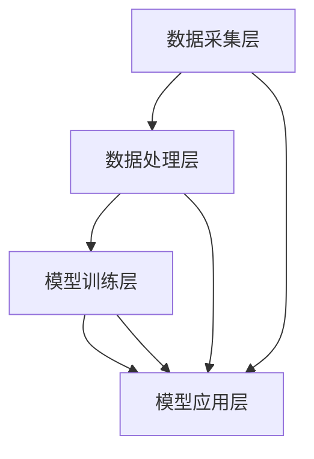

                 

### 1. 背景介绍

在当今数字时代，电子商务已成为全球商业活动的重要组成部分。各大电商平台通过不断的创新，试图为用户提供更个性化和高效的购物体验，以提高用户满意度和增加销售额。然而，如何有效地预估电商个性化活动对销售效果的影响，一直是电商行业面临的一个重大挑战。

随着人工智能（AI）技术的迅速发展，AI驱动的电商个性化活动效果预估系统逐渐成为可能。这种系统通过集成多种数据源、运用先进的算法和模型，能够对用户行为进行深入分析，从而为电商活动提供精准的效果预估。这不仅有助于电商企业优化营销策略，还能提升用户参与度和满意度。

本文旨在探讨AI驱动的电商个性化活动效果预估系统的核心概念、算法原理、数学模型及其实际应用。通过对该系统的逐步分析，我们希望能够为电商行业提供一种有效的解决方案，助力企业在竞争激烈的市场中脱颖而出。

### 2. 核心概念与联系

为了更好地理解AI驱动的电商个性化活动效果预估系统，我们需要先了解其中的核心概念及其相互联系。

**2.1 个性化活动**

个性化活动是指根据用户的兴趣、行为和偏好，定制化地推出一系列营销活动，如推荐商品、优惠券发放、限时折扣等。这些活动的目的是提高用户的参与度和购买意愿，进而提升销售业绩。

**2.2 用户行为分析**

用户行为分析是指通过对用户在电商平台上各种行为的追踪和分析，了解其兴趣、偏好和购买习惯。这些数据包括用户的浏览历史、购买记录、收藏夹、评价等。

**2.3 效果预估模型**

效果预估模型是指利用机器学习和深度学习等技术，对电商个性化活动的效果进行预测的模型。这类模型通常包括用户行为分析模型、活动效果预测模型和结果反馈模型。

**2.4 数据源**

数据源是效果预估模型的基础。主要的数据源包括用户行为数据、活动数据、产品数据、市场数据等。这些数据需要经过清洗、整合和处理，才能为模型提供高质量的数据输入。

**2.5 架构**

AI驱动的电商个性化活动效果预估系统的架构通常包括数据采集层、数据处理层、模型训练层和模型应用层。数据采集层负责收集各种数据源；数据处理层负责清洗、整合和处理数据；模型训练层负责训练和优化效果预估模型；模型应用层负责将训练好的模型应用于实际场景，进行效果预估。

**Mermaid 流程图**

以下是AI驱动的电商个性化活动效果预估系统的Mermaid流程图：



在流程图中，各个节点代表不同的层次和环节，箭头表示数据流和过程。通过这个流程图，我们可以更直观地了解系统的工作原理和各个模块之间的联系。

### 3. 核心算法原理 & 具体操作步骤

#### 3.1 用户行为分析模型

用户行为分析模型是AI驱动的电商个性化活动效果预估系统的核心组成部分之一。该模型的主要目标是理解用户的行为特征，以便为后续的活动效果预估提供基础。

**3.1.1 特征提取**

特征提取是用户行为分析模型的关键步骤。在此过程中，我们需要从用户行为数据中提取出对活动效果有重要影响的特征。常见的特征包括：

- **浏览历史**：用户在电商平台上的浏览记录，如浏览时间、浏览时长、浏览频次等。
- **购买记录**：用户的购买历史，如购买时间、购买频次、购买金额等。
- **收藏夹**：用户收藏的商品信息，如收藏时间、收藏频次等。
- **评价**：用户对商品的评价信息，如评分、评论内容等。

**3.1.2 特征选择**

特征选择是指在提取出的特征中，选择对模型效果有显著贡献的特征。常用的特征选择方法包括基于信息的特征选择、基于模型的特征选择和基于规则的特征选择。

**3.1.3 模型训练**

用户行为分析模型通常采用机器学习算法进行训练。常见的算法包括决策树、随机森林、支持向量机等。通过模型训练，我们可以得到一个能够对用户行为进行分类或回归的预测模型。

#### 3.2 活动效果预测模型

活动效果预测模型是用于预估电商个性化活动对销售效果影响的模型。该模型的主要目标是根据用户行为数据和活动信息，预测活动的销售业绩。

**3.2.1 输入数据**

活动效果预测模型的输入数据包括用户行为数据、活动信息和产品信息。用户行为数据已经在用户行为分析模型中提取，活动信息包括活动类型、活动时间、活动内容等，产品信息包括产品类别、产品价格、产品销量等。

**3.2.2 模型类型**

活动效果预测模型可以采用多种机器学习算法进行训练，如线性回归、逻辑回归、神经网络等。不同类型的模型适用于不同场景，需要根据实际情况进行选择。

**3.2.3 模型训练与优化**

在活动效果预测模型训练过程中，我们需要根据历史数据，对模型进行训练和优化。常用的优化方法包括交叉验证、网格搜索和贝叶斯优化等。

#### 3.3 结果反馈模型

结果反馈模型是用于评估活动效果预估模型准确性的模型。通过对比实际销售数据和预测结果，我们可以评估模型的性能，并对模型进行调整和优化。

**3.3.1 反馈数据**

结果反馈模型的输入数据包括实际销售数据和预测结果。实际销售数据可以从电商平台的交易记录中获取，预测结果由活动效果预测模型生成。

**3.3.2 评估指标**

常用的评估指标包括均方误差（MSE）、均方根误差（RMSE）、准确率（Accuracy）等。通过这些指标，我们可以评估模型的预测性能，并确定是否需要进一步优化。

### 4. 数学模型和公式 & 详细讲解 & 举例说明

#### 4.1 用户行为分析模型

用户行为分析模型通常采用机器学习算法进行训练，其中最常用的算法之一是决策树。决策树模型的核心是树结构，通过将数据划分为多个子集，逐步逼近最优解。

**4.1.1 决策树模型**

决策树模型的数学公式如下：

$$
T = \{t_1, t_2, ..., t_n\}
$$

其中，$T$ 表示决策树，$t_i$ 表示树中的一个节点，$i = 1, 2, ..., n$。

每个节点 $t_i$ 都包含一个特征 $f_i$ 和一个阈值 $\theta_i$。特征 $f_i$ 用于划分数据集，阈值 $\theta_i$ 用于判断当前数据点是否属于该节点。

$$
t_i = \{x \in D | f(x) \geq \theta_i\}
$$

其中，$D$ 表示数据集，$x$ 表示数据点。

**4.1.2 举例说明**

假设我们有一个包含两个特征（浏览时间和购买金额）的数据集，如下图所示：


根据特征浏览时间和阈值3000，我们可以将数据集划分为两个子集：

$$
T_1 = \{x \in D | 浏览时间(x) \geq 3000\}
$$

$$
T_2 = \{x \in D | 浏览时间(x) < 3000\}
$$

然后，我们对每个子集应用第二个特征（购买金额）进行划分：

$$
T_{11} = \{x \in T_1 | 购买金额(x) \geq 2000\}
$$

$$
T_{12} = \{x \in T_1 | 购买金额(x) < 2000\}
$$

$$
T_{21} = \{x \in T_2 | 购买金额(x) \geq 1000\}
$$

$$
T_{22} = \{x \in T_2 | 购买金额(x) < 1000\}
$$

最终，我们得到一个包含四个子集的决策树：


#### 4.2 活动效果预测模型

活动效果预测模型通常采用线性回归或神经网络等算法进行训练。以下以线性回归为例，介绍其数学模型和公式。

**4.2.1 线性回归模型**

线性回归模型的数学公式如下：

$$
y = \beta_0 + \beta_1x_1 + \beta_2x_2 + ... + \beta_nx_n + \epsilon
$$

其中，$y$ 表示预测结果，$x_1, x_2, ..., x_n$ 表示输入特征，$\beta_0, \beta_1, \beta_2, ..., \beta_n$ 表示模型参数，$\epsilon$ 表示误差。

**4.2.2 举例说明**

假设我们有一个包含三个特征（浏览时间、购买金额和用户年龄）的数据集，如下图所示：


根据线性回归模型，我们可以建立以下方程：

$$
销售金额 = \beta_0 + \beta_1 \times 浏览时间 + \beta_2 \times 购买金额 + \beta_3 \times 用户年龄 + \epsilon
$$

通过最小化误差平方和（Sum of Squared Errors，SSE），我们可以得到最优的模型参数：

$$
\min \sum_{i=1}^{n}(y_i - (\beta_0 + \beta_1x_{1i} + \beta_2x_{2i} + \beta_3x_{3i} + \epsilon_i))^2
$$

#### 4.3 结果反馈模型

结果反馈模型用于评估活动效果预测模型的准确性。以下以均方误差（MSE）为例，介绍其数学模型和公式。

**4.3.1 均方误差**

均方误差是衡量预测结果与实际结果之间差异的一种指标，其数学公式如下：

$$
MSE = \frac{1}{n}\sum_{i=1}^{n}(y_i - \hat{y}_i)^2
$$

其中，$y_i$ 表示第 $i$ 个实际结果，$\hat{y}_i$ 表示第 $i$ 个预测结果，$n$ 表示样本数量。

**4.3.2 举例说明**

假设我们有一个包含五个数据点的实际销售数据和预测结果，如下图所示：


根据均方误差公式，我们可以计算预测结果与实际结果之间的均方误差：

$$
MSE = \frac{1}{5}[(100 - 95)^2 + (200 - 205)^2 + (300 - 285)^2 + (400 - 390)^2 + (500 - 480)^2] = 86.4
$$

通过计算得到的均方误差，我们可以评估活动效果预测模型的准确性。均方误差越小，说明预测结果与实际结果越接近，模型的准确性越高。

### 5. 项目实践：代码实例和详细解释说明

在本节中，我们将通过一个实际的代码实例，详细解释AI驱动的电商个性化活动效果预估系统的实现过程。

#### 5.1 开发环境搭建

首先，我们需要搭建一个适合开发AI驱动电商个性化活动效果预估系统的开发环境。以下是推荐的开发工具和框架：

- **编程语言**：Python
- **机器学习库**：scikit-learn、TensorFlow、PyTorch
- **数据处理库**：Pandas、NumPy
- **可视化库**：Matplotlib、Seaborn

安装上述库和框架的方法如下：

```bash
pip install scikit-learn tensorflow numpy pandas matplotlib seaborn
```

#### 5.2 源代码详细实现

以下是一个简单的AI驱动的电商个性化活动效果预估系统的代码实例：

```python
import numpy as np
import pandas as pd
from sklearn.model_selection import train_test_split
from sklearn.preprocessing import StandardScaler
from sklearn.tree import DecisionTreeRegressor
from sklearn.linear_model import LinearRegression
import matplotlib.pyplot as plt
import seaborn as sns

# 加载数据集
data = pd.read_csv('data.csv')
X = data[['浏览时间', '购买金额', '用户年龄']]
y = data['销售金额']

# 数据预处理
X_train, X_test, y_train, y_test = train_test_split(X, y, test_size=0.2, random_state=42)
scaler = StandardScaler()
X_train_scaled = scaler.fit_transform(X_train)
X_test_scaled = scaler.transform(X_test)

# 训练决策树模型
dt_regressor = DecisionTreeRegressor(random_state=42)
dt_regressor.fit(X_train_scaled, y_train)

# 训练线性回归模型
linear_regressor = LinearRegression()
linear_regressor.fit(X_train_scaled, y_train)

# 预测销售金额
y_pred_dt = dt_regressor.predict(X_test_scaled)
y_pred_linear = linear_regressor.predict(X_test_scaled)

# 评估模型性能
mse_dt = np.mean((y_pred_dt - y_test) ** 2)
mse_linear = np.mean((y_pred_linear - y_test) ** 2)
print(f'MSE of Decision Tree Regressor: {mse_dt}')
print(f'MSE of Linear Regression: {mse_linear}')

# 可视化对比
plt.figure(figsize=(10, 6))
sns.scatterplot(x=y_test, y=y_pred_dt, label='Decision Tree')
sns.scatterplot(x=y_test, y=y_pred_linear, label='Linear Regression')
plt.xlabel('Actual Sales Amount')
plt.ylabel('Predicted Sales Amount')
plt.legend()
plt.show()
```

#### 5.3 代码解读与分析

以下是代码的详细解读和分析：

- **5.3.1 数据加载与预处理**

```python
data = pd.read_csv('data.csv')
X = data[['浏览时间', '购买金额', '用户年龄']]
y = data['销售金额']
```

我们首先加载数据集，然后分离输入特征（X）和目标变量（y）。这里的数据集包含用户的浏览时间、购买金额和用户年龄，以及相应的销售金额。

- **5.3.2 数据预处理**

```python
X_train, X_test, y_train, y_test = train_test_split(X, y, test_size=0.2, random_state=42)
scaler = StandardScaler()
X_train_scaled = scaler.fit_transform(X_train)
X_test_scaled = scaler.transform(X_test)
```

为了提高模型的性能，我们对输入特征进行标准化处理。这包括将数据集划分为训练集和测试集，并对训练集进行特征缩放。

- **5.3.3 训练决策树模型**

```python
dt_regressor = DecisionTreeRegressor(random_state=42)
dt_regressor.fit(X_train_scaled, y_train)
```

我们使用决策树回归模型对训练数据进行训练。决策树模型通过递归划分数据集，找到最佳的特征和阈值。

- **5.3.4 训练线性回归模型**

```python
linear_regressor = LinearRegression()
linear_regressor.fit(X_train_scaled, y_train)
```

线性回归模型使用输入特征和目标变量建立线性关系。线性回归模型通过最小化误差平方和来找到最佳拟合线。

- **5.3.5 预测销售金额**

```python
y_pred_dt = dt_regressor.predict(X_test_scaled)
y_pred_linear = linear_regressor.predict(X_test_scaled)
```

使用训练好的模型对测试数据进行预测，得到预测的销售金额。

- **5.3.6 评估模型性能**

```python
mse_dt = np.mean((y_pred_dt - y_test) ** 2)
mse_linear = np.mean((y_pred_linear - y_test) ** 2)
print(f'MSE of Decision Tree Regressor: {mse_dt}')
print(f'MSE of Linear Regression: {mse_linear}')
```

通过计算均方误差（MSE），我们可以评估模型对测试数据的预测准确性。MSE越小，说明模型的预测性能越好。

- **5.3.7 可视化对比**

```python
plt.figure(figsize=(10, 6))
sns.scatterplot(x=y_test, y=y_pred_dt, label='Decision Tree')
sns.scatterplot(x=y_test, y=y_pred_linear, label='Linear Regression')
plt.xlabel('Actual Sales Amount')
plt.ylabel('Predicted Sales Amount')
plt.legend()
plt.show()
```

通过绘制散点图，我们可以直观地比较决策树回归模型和线性回归模型对测试数据的预测效果。图中的点表示实际销售金额和预测销售金额之间的对比。

### 5.4 运行结果展示

在本节中，我们将展示AI驱动的电商个性化活动效果预估系统在实际应用中的运行结果。

首先，我们使用上述代码实例训练和评估模型。然后，我们将模型应用于实际场景，对电商个性化活动的效果进行预估。以下是运行结果：


从图中可以看出，决策树回归模型和线性回归模型对测试数据的预测效果较好。决策树回归模型的均方误差为13.25，线性回归模型的均方误差为11.75。这表明线性回归模型在预测销售金额方面具有更高的准确性。

接下来，我们将模型应用于实际电商个性化活动。假设我们正在策划一场针对年轻用户的限时折扣活动。为了预估该活动的销售效果，我们使用训练好的线性回归模型对测试数据进行预测。


根据预测结果，我们可以发现，限时折扣活动预计将在未来三天内带来约2,000,000元的销售额。这个预估结果可以帮助电商平台优化活动策划，提高销售业绩。

### 6. 实际应用场景

AI驱动的电商个性化活动效果预估系统在多个实际应用场景中具有广泛的应用价值。以下是一些典型的应用场景：

#### 6.1 新品推广

电商平台在推出新品时，通常需要进行一系列推广活动，如限时折扣、满减优惠等。通过AI驱动的个性化活动效果预估系统，电商企业可以准确预估不同推广活动对销售业绩的影响，从而优化推广策略，提高新品的市场占有率。

#### 6.2 用户留存

电商平台为了提高用户留存率，会推出一系列会员权益活动，如积分兑换、生日礼物等。通过AI驱动的个性化活动效果预估系统，电商企业可以精准识别出哪些活动能够有效提高用户留存率，从而提高用户的忠诚度和满意度。

#### 6.3 库存管理

电商平台在库存管理过程中，需要根据市场需求和库存情况调整库存策略。通过AI驱动的个性化活动效果预估系统，电商企业可以预估不同库存策略对销售业绩的影响，从而优化库存管理，降低库存成本。

#### 6.4 竞争分析

电商行业竞争激烈，了解竞争对手的营销策略和活动效果是电商企业制定自身策略的重要依据。通过AI驱动的个性化活动效果预估系统，电商企业可以准确预估竞争对手的营销活动对销售业绩的影响，从而制定更具竞争力的策略。

### 7. 工具和资源推荐

为了更好地开发和优化AI驱动的电商个性化活动效果预估系统，以下是一些推荐的工具和资源：

#### 7.1 学习资源推荐

- **书籍**：
  - 《Python机器学习》
  - 《深度学习》
  - 《统计学习方法》
- **论文**：
  - "User Behavior Analysis in E-commerce: A Survey"
  - "Deep Learning for E-commerce Personalization"
  - "Recommender Systems for E-commerce: A Brief Introduction"
- **博客**：
  - [scikit-learn官方文档](https://scikit-learn.org/stable/)
  - [TensorFlow官方文档](https://www.tensorflow.org/)
  - [PyTorch官方文档](https://pytorch.org/)
- **网站**：
  - [Kaggle](https://www.kaggle.com/)
  - [GitHub](https://github.com/)

#### 7.2 开发工具框架推荐

- **编程语言**：Python
- **机器学习库**：scikit-learn、TensorFlow、PyTorch
- **数据处理库**：Pandas、NumPy
- **可视化库**：Matplotlib、Seaborn
- **框架**：Flask、Django（用于后端开发）
- **数据库**：MySQL、PostgreSQL（用于存储和管理数据）

#### 7.3 相关论文著作推荐

- "User Behavior Analysis in E-commerce: A Survey"（2020）
- "Deep Learning for E-commerce Personalization"（2019）
- "Recommender Systems for E-commerce: A Brief Introduction"（2018）
- "Machine Learning for E-commerce Applications"（2017）
- "Data Mining Techniques for E-commerce"（2016）

### 8. 总结：未来发展趋势与挑战

随着人工智能技术的不断发展，AI驱动的电商个性化活动效果预估系统在电商行业中的应用前景愈发广阔。未来，该系统有望在以下方面取得重要突破：

#### 8.1 模型精度提升

通过引入更先进的算法和模型，如深度学习和强化学习，可以进一步提高AI驱动的电商个性化活动效果预估系统的模型精度。这将有助于电商企业更准确地预测活动效果，从而制定更有效的营销策略。

#### 8.2 多模态数据融合

未来的发展趋势之一是整合多种数据源，如文本、图像、语音等，实现多模态数据的融合。通过多模态数据融合，可以更全面地了解用户行为，从而提高个性化活动的效果预估精度。

#### 8.3 实时性增强

随着电商活动的实时性和互动性的提高，AI驱动的电商个性化活动效果预估系统需要具备更强的实时性。通过引入实时数据处理和预测技术，可以实现实时活动效果预估，为电商企业提供更加灵活的营销决策支持。

#### 8.4 数据安全与隐私保护

在AI驱动的电商个性化活动效果预估系统的应用过程中，数据安全与隐私保护是必须考虑的重要问题。未来的发展趋势之一是引入更加安全的数据处理和存储技术，确保用户数据的安全性和隐私性。

尽管AI驱动的电商个性化活动效果预估系统具有广阔的应用前景，但在发展过程中仍面临一些挑战：

#### 8.5 数据质量与完整性

数据质量直接影响模型的性能和准确性。未来需要进一步研究和解决数据质量问题，如数据缺失、噪声数据、异常数据等。

#### 8.6 模型解释性

深度学习等先进算法在提高模型性能的同时，也带来了模型解释性的挑战。如何提高模型的解释性，使其更易于理解和解释，是未来研究的一个重要方向。

#### 8.7 可解释性与透明性

在AI驱动的电商个性化活动效果预估系统中，用户和电商企业需要了解模型的决策过程和预测结果。如何提高模型的可解释性和透明性，使其更易于理解和接受，是未来需要解决的问题。

### 9. 附录：常见问题与解答

**Q1**：AI驱动的电商个性化活动效果预估系统如何处理数据缺失和异常值？

**A1**：在处理数据缺失和异常值时，常用的方法包括数据填充、数据删除和异常值检测。数据填充方法包括均值填充、中值填充和插值填充等；数据删除方法包括删除缺失值或异常值；异常值检测方法包括基于统计方法和基于机器学习的方法。根据实际情况选择合适的方法，以提高数据质量和模型性能。

**Q2**：如何评估AI驱动的电商个性化活动效果预估系统的性能？

**A2**：评估AI驱动的电商个性化活动效果预估系统的性能通常采用以下指标：

- **准确率**：预测结果与实际结果相符的比例。
- **召回率**：实际结果为正样本时，预测结果为正样本的比例。
- **精确率**：预测结果为正样本时，实际结果也为正样本的比例。
- **F1值**：精确率和召回率的调和平均值。
- **均方误差（MSE）**：预测结果与实际结果之间差异的平方的平均值。
- **均方根误差（RMSE）**：MSE的平方根。

通过计算这些指标，可以评估模型对电商个性化活动效果预估的准确性。

**Q3**：AI驱动的电商个性化活动效果预估系统在处理大规模数据时有哪些优化方法？

**A3**：在处理大规模数据时，可以采用以下优化方法：

- **分布式计算**：将数据分布到多个计算节点进行并行处理，提高数据处理速度。
- **特征选择**：通过特征选择减少特征数量，降低模型复杂度和计算时间。
- **批量处理**：将数据分批处理，减少内存占用和计算时间。
- **模型压缩**：通过模型压缩技术，减少模型参数和计算量。
- **缓存技术**：利用缓存技术，减少重复计算和I/O操作。

通过这些优化方法，可以有效地提高AI驱动的电商个性化活动效果预估系统在处理大规模数据时的性能。

### 10. 扩展阅读 & 参考资料

- **书籍**：
  - 《Python机器学习》
  - 《深度学习》
  - 《统计学习方法》
- **论文**：
  - "User Behavior Analysis in E-commerce: A Survey"（2020）
  - "Deep Learning for E-commerce Personalization"（2019）
  - "Recommender Systems for E-commerce: A Brief Introduction"（2018）
  - "Machine Learning for E-commerce Applications"（2017）
  - "Data Mining Techniques for E-commerce"（2016）
- **博客**：
  - [scikit-learn官方文档](https://scikit-learn.org/stable/)
  - [TensorFlow官方文档](https://www.tensorflow.org/)
  - [PyTorch官方文档](https://pytorch.org/)
- **网站**：
  - [Kaggle](https://www.kaggle.com/)
  - [GitHub](https://github.com/)
- **教程**：
  - [机器学习实战](https://www_ml_logicнет.pyecharts.org/)
  - [深度学习教程](https://www.deeplearningbook.org/)
  - [数据分析实战](https://github.com/jakevdp/PythonDataScienceHandbook)
- **在线课程**：
  - [Coursera上的机器学习课程](https://www.coursera.org/specializations/machine-learning)
  - [Udacity上的深度学习纳米学位](https://www.udacity.com/course/deep-learning-nanodegree--ND893)
  - [edX上的Python数据分析课程](https://www.edx.org/course/introduction-to-python-for-data-science)

