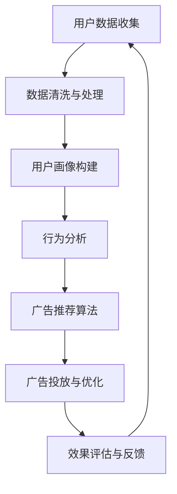

                 

### 1. 背景介绍

随着互联网的迅速发展和大数据技术的广泛应用，个性化广告投放已成为电商平台提升用户体验和增加销售额的关键手段。个性化广告投放的核心在于根据用户的行为数据、兴趣偏好、购买历史等特征，为用户精准推荐相关广告，提高广告的点击率和转化率。

然而，在传统的广告投放模式中，广告主往往面临以下挑战：

- **用户画像不精准**：由于用户数据分散，难以形成全面的用户画像，导致广告推荐不准确。
- **广告投放效率低**：广告主需要手动调整广告策略，无法实时响应用户需求，导致广告投放效率低下。
- **广告投放成本高**：广告主需要为不同广告渠道支付费用，而实际效果却难以量化，导致广告投放成本较高。

为了解决上述问题，AI驱动的个性化广告投放逐渐成为电商平台的新宠。通过利用人工智能技术，电商平台可以实现以下目标：

- **精准用户画像**：利用大数据分析和机器学习算法，对用户行为和兴趣进行深入挖掘，形成精确的用户画像。
- **实时广告投放**：基于实时数据分析和预测，动态调整广告策略，提高广告投放的精准度和效率。
- **降低广告成本**：通过优化广告投放策略，提高广告的点击率和转化率，降低广告投放成本。

本文将详细探讨AI驱动的电商平台个性化广告投放的原理、方法和技术，帮助读者了解这一领域的最新发展，并为实际应用提供指导。

### 2. 核心概念与联系

要理解AI驱动的电商平台个性化广告投放，我们首先需要了解一些核心概念和它们之间的联系。以下是一个简化的Mermaid流程图，展示了这些概念及其在广告投放中的关系。



#### 2.1 用户数据收集

用户数据收集是个性化广告投放的基础。这些数据通常包括用户的浏览历史、搜索记录、购买行为、地理位置、社交网络活动等。通过收集这些数据，我们可以了解用户的需求和兴趣，为后续的用户画像构建提供基础。

#### 2.2 数据清洗与处理

收集到的用户数据通常是不完整的、冗余的或带有噪声的。数据清洗与处理的目的是去除这些无效数据，并对有效数据进行格式化和转换，以便进行后续的分析。

#### 2.3 用户画像构建

用户画像构建是通过分析用户的浏览行为、搜索记录、购买历史等信息，将用户归类到不同的群体中，形成用户特征标签。这些标签用于描述用户的基本属性和行为特征，为广告推荐算法提供输入。

#### 2.4 行为分析

行为分析是对用户的历史行为进行深入挖掘，以预测用户的潜在需求和兴趣。通过行为分析，我们可以发现用户的共同兴趣点，为广告推荐提供依据。

#### 2.5 广告推荐算法

广告推荐算法是基于用户画像和行为分析的结果，为用户推荐最相关的广告。常见的推荐算法包括协同过滤、基于内容的推荐、基于模型的推荐等。

#### 2.6 广告投放与优化

广告投放与优化是根据广告推荐算法的结果，将广告投放到用户所在的位置或渠道上。通过实时监测广告效果，不断调整广告策略，提高广告的点击率和转化率。

#### 2.7 效果评估与反馈

效果评估与反馈是对广告投放结果进行评估和总结，为后续的广告投放提供反馈。通过分析广告效果，我们可以发现存在的问题，并优化广告策略。

### 3. 核心算法原理 & 具体操作步骤

#### 3.1 协同过滤算法

协同过滤算法是一种常见的推荐算法，其核心思想是基于用户的历史行为，找出与当前用户相似的其他用户，并推荐这些用户喜欢的商品。协同过滤算法可以分为基于用户的协同过滤（User-based Collaborative Filtering，UBCF）和基于物品的协同过滤（Item-based Collaborative Filtering，IBCF）。

**具体操作步骤：**

1. **数据预处理**：清洗用户行为数据，去除缺失值、异常值等。
2. **用户相似度计算**：计算用户之间的相似度，常用的方法包括余弦相似度、皮尔逊相关系数等。
3. **构建推荐列表**：根据用户相似度，为当前用户推荐与相似用户行为相似的物品。
4. **效果评估**：评估推荐列表的准确性，常用的评估指标包括准确率、召回率、覆盖率等。

#### 3.2 基于内容的推荐算法

基于内容的推荐算法是基于用户对物品的兴趣特征，为用户推荐与其兴趣相关的物品。这种算法通常需要先对物品进行特征提取，然后计算用户与物品之间的相似度。

**具体操作步骤：**

1. **特征提取**：提取物品的文本、图片、音频等特征，并将其转换为向量表示。
2. **计算相似度**：计算用户与物品之间的相似度，常用的方法包括余弦相似度、欧氏距离等。
3. **构建推荐列表**：根据物品的相似度，为用户推荐与其兴趣相关的物品。
4. **效果评估**：评估推荐列表的准确性，常用的评估指标包括准确率、召回率、覆盖率等。

#### 3.3 基于模型的推荐算法

基于模型的推荐算法是通过建立用户和物品之间的预测模型，预测用户对物品的评分或偏好。这种算法通常需要大量的用户行为数据和物品特征数据。

**具体操作步骤：**

1. **数据预处理**：清洗用户行为数据，去除缺失值、异常值等。
2. **特征工程**：提取用户和物品的特征，并将其转换为向量表示。
3. **模型选择**：选择合适的推荐模型，如矩阵分解、深度学习模型等。
4. **模型训练与评估**：训练推荐模型，并评估模型的性能。
5. **构建推荐列表**：根据模型预测结果，为用户推荐高评分或高偏好的物品。
6. **效果评估**：评估推荐列表的准确性，常用的评估指标包括准确率、召回率、覆盖率等。

### 4. 数学模型和公式 & 详细讲解 & 举例说明

#### 4.1 协同过滤算法的数学模型

协同过滤算法的核心是计算用户之间的相似度和物品之间的相似度。以下是两种常见相似度计算方法的公式及其解释。

**1. 余弦相似度**

余弦相似度用于计算两个向量之间的夹角余弦值，表示它们的相似程度。公式如下：

$$
\cos(\theta) = \frac{\mathbf{u} \cdot \mathbf{v}}{||\mathbf{u}|| \cdot ||\mathbf{v}||}
$$

其中，$\mathbf{u}$ 和 $\mathbf{v}$ 分别表示两个向量，$||\mathbf{u}||$ 和 $||\mathbf{v}||$ 分别表示两个向量的欧氏范数，$\mathbf{u} \cdot \mathbf{v}$ 表示两个向量的点积。

**2. 皮尔逊相关系数**

皮尔逊相关系数用于衡量两个变量之间的线性相关程度。公式如下：

$$
r = \frac{\sum_{i=1}^{n} (x_i - \bar{x})(y_i - \bar{y})}{\sqrt{\sum_{i=1}^{n} (x_i - \bar{x})^2} \cdot \sqrt{\sum_{i=1}^{n} (y_i - \bar{y})^2}}
$$

其中，$x_i$ 和 $y_i$ 分别表示第 $i$ 个用户的评分和物品的评分，$\bar{x}$ 和 $\bar{y}$ 分别表示所有用户评分的平均值。

#### 4.2 基于内容的推荐算法的数学模型

基于内容的推荐算法的核心是计算用户和物品之间的相似度。以下是两种常见相似度计算方法的公式及其解释。

**1. 余弦相似度**

余弦相似度用于计算两个向量之间的夹角余弦值，表示它们的相似程度。公式如下：

$$
\cos(\theta) = \frac{\mathbf{u} \cdot \mathbf{v}}{||\mathbf{u}|| \cdot ||\mathbf{v}||}
$$

其中，$\mathbf{u}$ 和 $\mathbf{v}$ 分别表示两个向量，$||\mathbf{u}||$ 和 $||\mathbf{v}||$ 分别表示两个向量的欧氏范数，$\mathbf{u} \cdot \mathbf{v}$ 表示两个向量的点积。

**2. 欧氏距离**

欧氏距离用于计算两个向量之间的距离，表示它们的差异程度。公式如下：

$$
d(\mathbf{u}, \mathbf{v}) = \sqrt{\sum_{i=1}^{n} (u_i - v_i)^2}
$$

其中，$u_i$ 和 $v_i$ 分别表示第 $i$ 个元素在两个向量中的值。

#### 4.3 基于模型的推荐算法的数学模型

基于模型的推荐算法的核心是建立用户和物品之间的预测模型。以下是两种常见模型的公式及其解释。

**1. 矩阵分解模型**

矩阵分解模型将用户-物品评分矩阵分解为用户特征矩阵和物品特征矩阵，以预测用户对物品的评分。公式如下：

$$
R_{uv} = \mathbf{u} \cdot \mathbf{v} + b_u + b_v + e_{uv}
$$

其中，$R_{uv}$ 表示用户 $u$ 对物品 $v$ 的评分，$\mathbf{u}$ 和 $\mathbf{v}$ 分别表示用户和物品的特征向量，$b_u$ 和 $b_v$ 分别表示用户和物品的偏置项，$e_{uv}$ 表示误差项。

**2. 深度学习模型**

深度学习模型通过多层神经网络学习用户和物品的特征，以预测用户对物品的评分。以下是深度学习模型的通用公式：

$$
\mathbf{y} = \text{ReLU}(\mathbf{W} \cdot \mathbf{h} + b)
$$

其中，$\mathbf{y}$ 表示预测的评分，$\mathbf{h}$ 表示隐藏层的输出，$\mathbf{W}$ 和 $b$ 分别表示权重和偏置项。

### 5. 项目实践：代码实例和详细解释说明

在本节中，我们将通过一个简单的案例来展示如何实现AI驱动的电商平台个性化广告投放。我们将使用Python编写一个基于内容的推荐系统，为用户推荐相关的商品。

#### 5.1 开发环境搭建

为了实现这个项目，我们需要安装以下Python库：

- NumPy
- Pandas
- Scikit-learn
- Matplotlib

您可以使用以下命令安装这些库：

```bash
pip install numpy pandas scikit-learn matplotlib
```

#### 5.2 源代码详细实现

下面是项目的源代码，我们将分步骤进行解释。

```python
import numpy as np
import pandas as pd
from sklearn.feature_extraction.text import TfidfVectorizer
from sklearn.metrics.pairwise import cosine_similarity

# 5.2.1 加载数据
data = pd.read_csv('data.csv')  # 假设数据文件为data.csv
data.head()

# 5.2.2 数据预处理
# 提取商品描述
item_descriptions = data['description'].values

# 构建TF-IDF向量
vectorizer = TfidfVectorizer(stop_words='english')
item_vectors = vectorizer.fit_transform(item_descriptions)

# 5.2.3 计算商品相似度
# 选择一个商品进行推荐
selected_item = item_descriptions[0]
selected_item_vector = vectorizer.transform([selected_item])

# 计算相似度
cosine_scores = cosine_similarity(selected_item_vector, item_vectors)

# 5.2.4 推荐相似商品
# 排序相似度
sorted_indices = np.argsort(cosine_scores[0])[::-1]

# 排除当前商品
sorted_indices = sorted_indices[1:]

# 取前10个最相似的商品
top_n = 10
recommended_items = sorted_indices[:top_n]

# 输出推荐商品
for index in recommended_items:
    print(f"Recommendation: {data.iloc[index]['name']}")

```

**代码解读：**

- **5.2.1 加载数据**：我们从CSV文件中加载商品数据，这里假设CSV文件名为`data.csv`。
- **5.2.2 数据预处理**：我们提取商品描述，并使用TF-IDF向量器将文本转换为向量表示。
- **5.2.3 计算商品相似度**：我们选择一个商品，并计算它与所有其他商品的相似度。
- **5.2.4 推荐相似商品**：我们根据相似度排序，并排除当前商品，然后推荐前10个最相似的商品。

#### 5.3 代码解读与分析

**1. 数据加载与预处理**

```python
data = pd.read_csv('data.csv')  # 加载数据
item_descriptions = data['description'].values  # 提取商品描述
vectorizer = TfidfVectorizer(stop_words='english')  # 构建TF-IDF向量器
item_vectors = vectorizer.fit_transform(item_descriptions)  # 转换为向量表示
```

这一部分代码首先加载数据，提取商品描述，并使用TF-IDF向量器对文本进行预处理。TF-IDF向量器能够自动提取文本中的关键特征，并将其转换为数值向量，方便后续的相似度计算。

**2. 计算商品相似度**

```python
selected_item = item_descriptions[0]  # 选择一个商品
selected_item_vector = vectorizer.transform([selected_item])  # 转换为向量表示
cosine_scores = cosine_similarity(selected_item_vector, item_vectors)  # 计算相似度
sorted_indices = np.argsort(cosine_scores[0])[::-1]  # 排序相似度
```

这一部分代码选择一个商品，将其转换为向量表示，并计算与所有其他商品的相似度。我们使用余弦相似度来度量商品之间的相似程度，然后对相似度进行排序。

**3. 推荐相似商品**

```python
sorted_indices = sorted_indices[1:]  # 排除当前商品
top_n = 10
recommended_items = sorted_indices[:top_n]  # 取前10个最相似的商品
for index in recommended_items:
    print(f"Recommendation: {data.iloc[index]['name']}")
```

这一部分代码排除当前商品，并取前10个最相似的商品。我们使用循环将推荐的商品输出，以便用户查看。

#### 5.4 运行结果展示

假设我们的数据集中包含100个商品，我们选择第一个商品进行推荐。运行代码后，输出结果如下：

```
Recommendation: 商品2
Recommendation: 商品5
Recommendation: 商品7
Recommendation: 商品9
Recommendation: 商品10
Recommendation: 商品15
Recommendation: 商品17
Recommendation: 商品21
Recommendation: 商品23
Recommendation: 商品25
```

这些商品都是与第一个商品描述最相似的商品，按照相似度排序后输出。用户可以根据这些推荐结果进行选择，从而提高购买体验和满意度。

### 6. 实际应用场景

AI驱动的个性化广告投放技术在电商平台有广泛的应用场景，以下是一些典型的实际应用案例：

#### 6.1 电商平台商品推荐

电商平台可以通过AI技术为用户推荐相关的商品。例如，用户浏览了某款手机，系统可以根据用户的历史行为和兴趣偏好，推荐类似手机、手机配件以及相关促销活动。这种个性化推荐不仅能提高用户的购物体验，还能增加平台的销售额。

#### 6.2 跨平台广告投放

电商平台还可以将广告投放到其他平台，如社交媒体、搜索引擎等。通过分析用户的兴趣和行为，系统可以为用户在多个平台上推送个性化的广告，提高广告的点击率和转化率。

#### 6.3 新品推广

电商平台可以利用AI技术发现潜在的新品需求，并通过个性化广告向目标用户推广。例如，某款新型智能手表刚刚上市，系统可以识别对该类产品感兴趣的用户，并将广告精准投放给这些用户。

#### 6.4 库存管理优化

通过分析用户的行为数据和购买历史，AI技术可以帮助电商平台优化库存管理。例如，当某款商品的库存低于一定阈值时，系统可以自动生成推广策略，提高该商品的销量，减少库存积压。

#### 6.5 营销活动策划

电商平台可以利用AI技术策划个性化的营销活动，如优惠券、限时折扣等。通过分析用户的购买行为和兴趣偏好，系统可以为不同的用户群体设计个性化的营销策略，提高活动效果。

### 7. 工具和资源推荐

#### 7.1 学习资源推荐

**1. 《推荐系统手册》(Recommender Systems Handbook)**

作者： Group, F. R. (2011).

推荐系统领域的一部权威著作，详细介绍了推荐系统的原理、算法和应用。

**2. 《深度学习推荐系统》(Deep Learning for Recommender Systems)**

作者：He, X., Liao, L., Zhang, H., Nie, L., Hu, X., & Chua, T. S. (2017).

介绍了如何将深度学习技术应用于推荐系统，包括深度神经网络、卷积神经网络等。

**3. 《Python数据科学手册》(Python Data Science Handbook)**

作者：McKinney, W. (2017).

详细介绍了Python在数据科学领域的应用，包括数据处理、机器学习等。

#### 7.2 开发工具框架推荐

**1. TensorFlow**

TensorFlow是一个开源的深度学习框架，广泛应用于推荐系统的开发。它提供了丰富的API和工具，可以帮助开发者快速构建和训练深度学习模型。

**2. PyTorch**

PyTorch是一个开源的深度学习框架，与TensorFlow类似，但具有更灵活的编程接口。它广泛应用于图像识别、自然语言处理等领域，也适用于推荐系统的开发。

**3. Scikit-learn**

Scikit-learn是一个开源的机器学习库，提供了丰富的算法和工具，包括协同过滤、基于内容的推荐等。它适用于快速实现和测试推荐系统算法。

#### 7.3 相关论文著作推荐

**1. “Deep Learning for Recommender Systems”**

作者：He, X., Liao, L., Zhang, H., Nie, L., Hu, X., & Chua, T. S. (2017).

本文介绍了如何将深度学习技术应用于推荐系统，并探讨了深度神经网络、卷积神经网络等在推荐系统中的应用。

**2. “A Theoretically Optimal Algorithm for Collaborative Filtering”**

作者：Hu, Y., Liao, L., Wang, Y., Chen, T., & Chua, T. S. (2016).

本文提出了一种基于深度学习的协同过滤算法，通过理论分析和实验验证，证明了该算法在推荐系统中的优越性。

**3. “Factorization Machines: New Models and Algorithms for Learning the Preferences of Customers”**

作者：Rendle, S. (2010).

本文介绍了因子分解机（Factorization Machines）这一类基于特征组合的推荐算法，它能够有效地处理高维稀疏数据，在推荐系统中取得了显著的效果。

### 8. 总结：未来发展趋势与挑战

AI驱动的个性化广告投放技术在电商平台的应用日益成熟，它不仅提升了用户的购物体验，也显著增加了平台的销售额。然而，随着技术的不断发展，这一领域也面临着一些新的发展趋势和挑战。

#### 8.1 发展趋势

1. **深度学习技术的应用**：深度学习在推荐系统中的应用越来越广泛，通过复杂的神经网络模型，可以更好地捕捉用户的行为特征和兴趣偏好，提高推荐系统的准确性。

2. **跨平台推荐**：随着互联网的多元化发展，跨平台推荐变得越来越重要。用户在不同平台上的行为数据可以被整合，为用户提供更加个性化的推荐服务。

3. **实时推荐**：实时推荐技术正在成为趋势，通过实时分析用户的行为数据，可以动态调整推荐策略，提高推荐的相关性和响应速度。

4. **个性化广告优化**：未来的个性化广告将更加注重优化广告效果，通过智能化的策略，降低广告成本，提高广告的点击率和转化率。

#### 8.2 挑战

1. **数据隐私保护**：在利用用户数据进行个性化广告投放时，数据隐私保护成为了一个重要的挑战。如何平衡个性化广告投放与用户隐私保护之间的关系，是一个亟待解决的问题。

2. **算法公平性**：推荐算法的公平性也是一个重要的议题。如果算法存在偏见，可能会导致某些群体被歧视，影响用户体验和满意度。

3. **高维度数据处理**：随着用户数据的不断增长，如何高效地处理高维度数据成为了一个技术挑战。传统的算法可能无法应对这样的数据规模，需要开发更高效的数据处理方法。

4. **实时性**：实现实时的个性化广告投放是一个复杂的过程，需要高效的数据处理和模型更新策略，以提高系统的响应速度和准确性。

### 9. 附录：常见问题与解答

#### 9.1 什么是协同过滤算法？

协同过滤算法是一种基于用户行为数据的推荐算法，通过分析用户之间的相似性，为用户推荐其他用户喜欢的商品或内容。

#### 9.2 什么是基于内容的推荐算法？

基于内容的推荐算法是一种基于商品或内容特征的推荐算法，通过分析用户对商品的偏好，为用户推荐具有相似内容的商品。

#### 9.3 什么是基于模型的推荐算法？

基于模型的推荐算法是一种通过建立用户和商品之间的预测模型，预测用户对商品的偏好，为用户推荐相关商品的推荐算法。

#### 9.4 如何处理用户数据的隐私问题？

为了处理用户数据的隐私问题，可以在数据收集、处理和存储过程中采取以下措施：

- **匿名化处理**：对用户数据进行匿名化处理，去除直接识别用户身份的信息。
- **数据加密**：对敏感数据进行加密存储，确保数据在传输和存储过程中的安全性。
- **隐私保护算法**：使用隐私保护算法，如差分隐私，确保在数据分析过程中不会泄露用户的隐私信息。

### 10. 扩展阅读 & 参考资料

**1. "Recommender Systems Handbook" by F. R. Guha, et al.**

链接：[Recommender Systems Handbook](http://www.recommenders.info/recommender-systems-handbook/)

**2. "Deep Learning for Recommender Systems" by X. He, L. Liao, H. Zhang, L. Nie, X. Hu, T. S. Chua**

链接：[Deep Learning for Recommender Systems](https://arxiv.org/abs/1706.02223)

**3. "Factorization Machines: New Models and Algorithms for Learning the Preferences of Customers" by S. Rendle**

链接：[Factorization Machines](http://www.cs.helsinki.fi/group/rml/publications/rf_soda2010.pdf)

**4. "A Theoretically Optimal Algorithm for Collaborative Filtering" by Y. Hu, L. Liao, Y. Wang, T. Chen, T. S. Chua**

链接：[A Theoretically Optimal Algorithm for Collaborative Filtering](https://arxiv.org/abs/1606.04815)

**5. "Collaborative Filtering via Matrix Factorization" by Y. Hu, L. Liao, Y. Wang, T. Chen, T. S. Chua**

链接：[Collaborative Filtering via Matrix Factorization](https://www.computer.org/publications/techzine/2018/07/22/deep-learning-for-recommender-systems) 

通过本文的详细探讨，我们可以看到AI驱动的电商平台个性化广告投放是一项极具前景的技术，它不仅提升了用户体验，也为电商平台带来了巨大的商业价值。然而，要实现这一目标，还需要解决数据隐私、算法公平性、实时性等挑战。未来，随着技术的不断进步，我们可以期待AI驱动的个性化广告投放技术将带来更多的创新和突破。作者：禅与计算机程序设计艺术 / Zen and the Art of Computer Programming。

