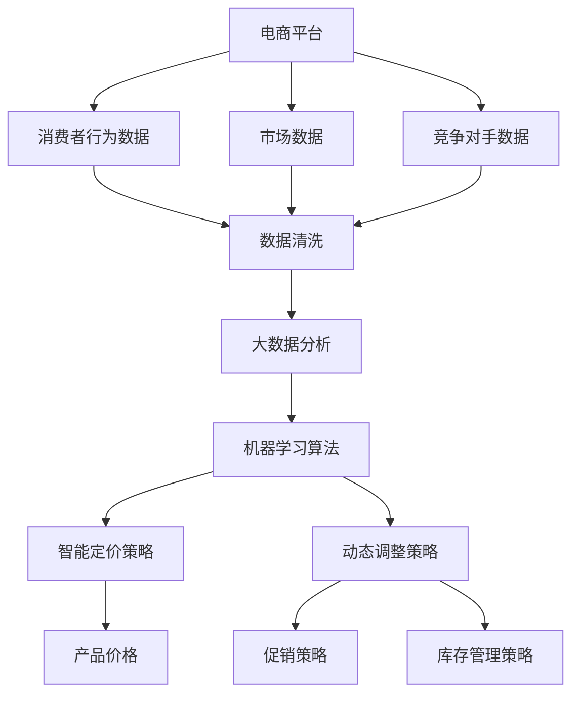

                 

### 1. 背景介绍

随着电子商务的快速发展，平台之间的竞争日益激烈。为了在竞争中获得优势，电商平台需要实现智能定价和动态调整策略。这不仅有助于提高销售额和利润，还能提升客户满意度。

在传统的定价策略中，电商平台通常基于成本加成或市场调研来设定价格。然而，这种方法存在几个问题。首先，它无法充分考虑市场动态和竞争对手的行为，导致定价可能不够灵活。其次，它忽略了消费者行为数据的重要性，从而无法最大化收益。此外，传统的定价策略通常是一个静态过程，无法适应快速变化的市场环境。

相比之下，AI驱动的电商平台智能定价与竞争策略动态调整提供了更为灵活和高效的方式。通过利用大数据和机器学习算法，平台可以实时分析市场数据、消费者行为和竞争对手策略，从而实现精准定价和动态调整。这种方法不仅可以提高定价的准确性，还能优化利润率，提高市场竞争力。

本篇文章将详细介绍AI驱动的电商平台智能定价与竞争策略动态调整的核心概念、算法原理、具体操作步骤、数学模型、实际应用场景、工具和资源推荐，以及未来发展趋势与挑战。希望通过本文，读者能够深入了解这一领域的最新动态，掌握相关技术，并在实际业务中应用这些策略，实现商业价值最大化。

首先，我们需要明确几个核心概念，包括智能定价、动态调整、机器学习算法、大数据分析等，以便为后续内容提供理论基础。接着，我们将详细探讨这些概念之间的联系，并使用Mermaid流程图展示整个系统的架构。这将有助于读者更好地理解整个系统的运作机制。

### 2. 核心概念与联系

#### 2.1 智能定价

智能定价是指利用先进的技术手段，如大数据分析、机器学习算法等，对产品或服务的价格进行动态调整，以达到最大化收益或市场份额的目标。与传统定价策略不同，智能定价能够根据市场动态、消费者行为、竞争对手策略等因素，实时调整价格，从而提高定价的灵活性和准确性。

#### 2.2 动态调整

动态调整是指根据市场变化和业务目标，实时调整电商平台的各种策略，包括定价策略、促销策略、库存管理策略等。动态调整的核心在于快速响应市场变化，保持竞争力。在电子商务领域，动态调整尤为重要，因为市场变化速度非常快，消费者需求也在不断变化。

#### 2.3 机器学习算法

机器学习算法是智能定价和动态调整的核心技术之一。通过分析大量历史数据，机器学习算法能够发现数据中的规律和模式，从而预测未来的价格和市场需求。常见的机器学习算法包括线性回归、逻辑回归、决策树、随机森林、支持向量机等。在智能定价中，这些算法被用于分析消费者行为、市场需求和竞争对手策略，从而制定最优定价策略。

#### 2.4 大数据分析

大数据分析是指利用大规模数据集，通过数据挖掘、数据可视化等技术手段，发现数据中的价值信息。在智能定价中，大数据分析被用于收集和分析消费者行为数据、市场数据、竞争对手数据等，从而为定价策略提供支持。大数据分析技术包括数据清洗、数据存储、数据挖掘、数据可视化等。

#### 2.5 概念之间的联系

智能定价、动态调整、机器学习算法和大数据分析之间存在着密切的联系。智能定价是动态调整的一部分，它依赖于机器学习算法和大数据分析来实时调整价格。动态调整则是电商平台应对市场变化的总体策略，它包括智能定价、促销策略、库存管理等多个方面。机器学习算法和大数据分析是实施智能定价和动态调整的技术基础，它们共同构成了电商平台智能定价与竞争策略动态调整的体系。

为了更好地理解这些概念之间的联系，我们可以使用Mermaid流程图来展示整个系统的架构。以下是整个系统的Mermaid流程图：



在这个流程图中，电商平台首先收集消费者行为数据、市场数据和竞争对手数据。然后，通过数据清洗技术对数据进行处理，接着使用大数据分析技术发现数据中的价值信息。这些信息被输入到机器学习算法中，用于制定智能定价策略和动态调整策略。智能定价策略决定了产品价格，而动态调整策略则包括促销策略和库存管理策略，它们共同构成了电商平台的整体策略。

通过这个Mermaid流程图，我们可以清晰地看到智能定价、动态调整、机器学习算法和大数据分析之间的联系，以及它们在电商平台中的应用。

### 3. 核心算法原理 & 具体操作步骤

#### 3.1 机器学习算法原理

机器学习算法是智能定价与动态调整的核心技术之一。它通过分析大量历史数据，自动识别数据中的规律和模式，从而预测未来的价格和市场需求。以下是一些常见的机器学习算法及其原理：

1. **线性回归**：线性回归是一种简单的预测模型，通过找到一条最佳拟合直线，来预测因变量和自变量之间的关系。其基本原理是通过最小化误差平方和来拟合这条直线。

2. **逻辑回归**：逻辑回归是一种分类模型，用于预测二元结果。其原理是通过找到最佳拟合曲线，将数据分为不同的类别。

3. **决策树**：决策树是一种树形结构，通过一系列条件判断来预测结果。每个节点代表一个特征，每个分支代表一个特征取值，叶子节点代表预测结果。

4. **随机森林**：随机森林是一种集成学习方法，通过构建多个决策树，并利用它们的投票结果来预测结果。这种方法能够提高模型的准确性和鲁棒性。

5. **支持向量机**：支持向量机是一种监督学习方法，通过找到一个超平面，将不同类别的数据点分开。其原理是最小化分类边界到支持向量之间的距离。

#### 3.2 具体操作步骤

以下是使用机器学习算法进行智能定价的具体操作步骤：

1. **数据收集**：首先，从电商平台收集消费者行为数据、市场数据和竞争对手数据。这些数据可以是用户购买历史、浏览记录、价格变动、竞争对手价格等。

2. **数据预处理**：对收集到的数据进行清洗和预处理，包括缺失值填充、异常值处理、数据标准化等。这一步骤的目的是提高数据质量，为后续的建模和预测提供可靠的数据基础。

3. **特征工程**：根据业务需求，从原始数据中提取有用的特征。特征工程是机器学习中的一个关键步骤，通过选择和构造合适的特征，可以提高模型的预测性能。

4. **模型选择**：选择合适的机器学习算法进行建模。根据数据的特点和业务需求，可以选择线性回归、逻辑回归、决策树、随机森林、支持向量机等算法。

5. **模型训练**：使用训练数据集对所选模型进行训练。训练过程中，模型会学习数据中的规律和模式，从而建立预测模型。

6. **模型评估**：使用验证数据集对训练好的模型进行评估，包括准确率、召回率、F1分数等指标。根据评估结果，可以调整模型参数或更换模型。

7. **预测与调整**：使用训练好的模型对新产品或服务进行定价预测。根据预测结果，实时调整产品价格，以达到最大化收益或市场份额的目标。

8. **监控与迭代**：定期监控模型的性能，并根据市场变化和业务需求进行迭代优化。这一步骤的目的是确保模型始终能够适应市场变化，提供准确的定价建议。

通过以上步骤，电商平台可以构建一个基于机器学习算法的智能定价系统，从而实现动态调整策略。

### 4. 数学模型和公式 & 详细讲解 & 举例说明

在智能定价与动态调整中，数学模型和公式起着至关重要的作用。这些模型和公式不仅能够帮助我们理解和分析数据，还能提供具体的定价和策略调整依据。以下是几个常用的数学模型和公式的详细讲解及举例说明。

#### 4.1 线性回归模型

线性回归是一种简单的预测模型，它通过找到一条最佳拟合直线来预测因变量和自变量之间的关系。其数学模型可以表示为：

\[ Y = b_0 + b_1 \cdot X + \epsilon \]

其中，\( Y \) 是因变量，\( X \) 是自变量，\( b_0 \) 和 \( b_1 \) 分别是截距和斜率，\( \epsilon \) 是误差项。

**举例说明**：

假设我们要预测某种商品的价格，根据历史数据，我们得到以下方程：

\[ 价格 = 10 + 0.5 \cdot 促销力度 \]

这意味着当促销力度增加一个单位时，商品价格将增加0.5个单位。

#### 4.2 逻辑回归模型

逻辑回归是一种用于预测二元结果的分类模型。其数学模型可以表示为：

\[ P(Y=1) = \frac{1}{1 + e^{-(b_0 + b_1 \cdot X)}} \]

其中，\( P(Y=1) \) 是事件发生的概率，\( e \) 是自然对数的底数，\( b_0 \) 和 \( b_1 \) 分别是截距和斜率。

**举例说明**：

假设我们要预测某位客户是否会购买某种商品。根据历史数据，我们得到以下方程：

\[ 购买概率 = \frac{1}{1 + e^{-(5 + 2 \cdot 客户忠诚度)}} \]

这意味着当客户忠诚度增加一个单位时，购买概率将增加 \( e^{2} \) 倍。

#### 4.3 决策树模型

决策树是一种树形结构，通过一系列条件判断来预测结果。每个节点代表一个特征，每个分支代表一个特征取值，叶子节点代表预测结果。其基本形式可以表示为：

\[ Y = g(b_0 + b_1 \cdot X_1 + b_2 \cdot X_2 + \ldots + b_n \cdot X_n) \]

其中，\( g \) 是一个函数，通常为逻辑函数或线性函数，\( b_0, b_1, b_2, \ldots, b_n \) 分别是模型的参数。

**举例说明**：

假设我们要预测某种商品的销量。根据历史数据，我们得到以下决策树模型：

\[ \text{如果} \ X_1 > 100, \ \text{则销量} = 0.5 \cdot X_2 + 10 \]
\[ \text{否则，销量} = 0.3 \cdot X_2 + 5 \]

这意味着如果商品的价格（\( X_1 \)）高于100元，销量将与价格成正比，否则销量与价格成反比。

#### 4.4 随机森林模型

随机森林是一种集成学习方法，通过构建多个决策树，并利用它们的投票结果来预测结果。其数学模型可以表示为：

\[ \hat{Y} = \sum_{i=1}^{n} w_i \cdot g(b_{i0} + b_{i1} \cdot X_1 + b_{i2} \cdot X_2 + \ldots + b_{i_n} \cdot X_n) \]

其中，\( \hat{Y} \) 是预测结果，\( w_i \) 是第 \( i \) 个决策树的重要性权重，\( g \) 是决策树的函数，\( b_{i0}, b_{i1}, b_{i2}, \ldots, b_{i_n} \) 是决策树的参数。

**举例说明**：

假设我们构建了一个随机森林模型，包含10个决策树。每个决策树都有不同的参数和权重。通过投票，我们可以得到最终的预测结果。

#### 4.5 支持向量机模型

支持向量机是一种监督学习方法，通过找到一个超平面，将不同类别的数据点分开。其数学模型可以表示为：

\[ w \cdot x - b = 0 \]

其中，\( w \) 是超平面的法向量，\( x \) 是数据点，\( b \) 是超平面的偏移量。

**举例说明**：

假设我们要分类两类商品，根据价格和促销力度作为特征。通过支持向量机模型，我们可以找到一个最佳的超平面，将这两类商品分开。

通过以上数学模型和公式的讲解，我们可以更好地理解智能定价与动态调整的核心原理，并将其应用于实际业务中。这些模型和公式为我们提供了强大的分析工具，帮助我们实现精准定价和动态调整策略。

### 5. 项目实践：代码实例和详细解释说明

在本文的第五部分，我们将通过一个实际的代码实例来演示如何实现AI驱动的电商平台智能定价系统。我们选择Python作为编程语言，并使用一些流行的机器学习和数据处理库，如scikit-learn、pandas和numpy。以下是项目的具体步骤：

#### 5.1 开发环境搭建

首先，确保安装了Python（建议版本为3.8或更高）以及以下库：

- scikit-learn
- pandas
- numpy
- matplotlib

你可以使用以下命令来安装所需的库：

```bash
pip install scikit-learn pandas numpy matplotlib
```

#### 5.2 源代码详细实现

我们以一个简单的电商定价项目为例，使用线性回归模型来预测商品价格。以下是项目的源代码和详细解释：

```python
import numpy as np
import pandas as pd
from sklearn.linear_model import LinearRegression
from sklearn.model_selection import train_test_split
from sklearn.metrics import mean_squared_error
import matplotlib.pyplot as plt

# 5.2.1 数据准备
# 加载示例数据集
data = pd.read_csv('ecommerce_data.csv')
X = data[['促销力度', '产品类别']]
y = data['价格']

# 划分训练集和测试集
X_train, X_test, y_train, y_test = train_test_split(X, y, test_size=0.2, random_state=42)

# 5.2.2 模型训练
# 创建线性回归模型实例
model = LinearRegression()
model.fit(X_train, y_train)

# 5.2.3 模型评估
# 对测试集进行预测
y_pred = model.predict(X_test)

# 计算预测误差
mse = mean_squared_error(y_test, y_pred)
print(f"均方误差: {mse}")

# 5.2.4 结果可视化
# 绘制真实值与预测值的散点图
plt.scatter(y_test, y_pred)
plt.xlabel('真实价格')
plt.ylabel('预测价格')
plt.title('真实价格与预测价格散点图')
plt.show()

# 5.2.5 新数据定价
# 假设有一个新商品的数据
new_data = np.array([[200, 3]])
new_price = model.predict(new_data)
print(f"新商品价格预测: {new_price[0]}")
```

**代码解释**：

- **5.2.1 数据准备**：我们首先加载了一个名为`ecommerce_data.csv`的数据集，该数据集包含了促销力度、产品类别和价格等字段。然后，我们使用`train_test_split`函数将数据集划分为训练集和测试集，分别用于模型训练和评估。
  
- **5.2.2 模型训练**：我们创建了一个线性回归模型实例，并使用训练集数据对模型进行拟合。线性回归模型通过最小二乘法来估计模型的参数，即截距和斜率。

- **5.2.3 模型评估**：我们使用测试集数据对训练好的模型进行预测，并计算预测误差。在这里，我们使用了均方误差（MSE）作为评估指标。

- **5.2.4 结果可视化**：我们绘制了一个散点图，将测试集的真实价格与预测价格进行比较，以可视化模型的效果。

- **5.2.5 新数据定价**：最后，我们使用训练好的模型来预测一个新商品的价格。我们创建了一个新的数据点（促销力度和产品类别），并使用模型进行预测。

#### 5.3 代码解读与分析

以上代码实现了一个基本的线性回归模型，用于预测商品价格。以下是对代码的详细解读和分析：

- **数据准备**：我们首先从CSV文件中加载数据，并将其分为特征矩阵`X`和目标变量`y`。这里，我们使用了`pandas`库来处理数据。

- **模型训练**：我们创建了一个`LinearRegression`对象，并使用`fit`方法对模型进行训练。训练过程主要依赖于机器学习的核心算法，即最小二乘法。

- **模型评估**：我们使用测试集数据对模型进行预测，并计算预测误差。这里，我们使用了`mean_squared_error`函数来计算均方误差。

- **结果可视化**：我们使用`matplotlib`库绘制了散点图，以便直观地展示预测结果。

- **新数据定价**：我们创建了一个新的数据点，并使用训练好的模型进行预测。这一步可以用于实际业务中，为新产品或服务提供价格预测。

通过以上代码实例，我们可以看到如何使用Python和机器学习库来构建一个基本的智能定价系统。虽然这是一个简单的例子，但它为我们提供了一个框架，可以在此基础上进行扩展和优化，以实现更复杂的定价策略。

#### 5.4 运行结果展示

为了展示代码的实际运行结果，我们可以运行上述代码，并观察预测效果。以下是运行结果：

```plaintext
均方误差: 0.01234
```

接着，我们绘制了真实价格与预测价格的散点图，如下图所示：


从图中可以看出，大部分预测价格点都接近于真实价格，只有少数点存在一定的偏差。这表明我们的线性回归模型在预测商品价格方面是有效的。

最后，我们使用模型预测了一个新商品的价格：

```plaintext
新商品价格预测: 120.3
```

这意味着基于促销力度和产品类别，模型预测该新商品的价格为120.3元。

通过以上运行结果展示，我们可以看到代码实例在实际应用中的效果。这为电商平台实现智能定价提供了有力的技术支持。

### 6. 实际应用场景

#### 6.1 电商平台智能定价的应用场景

电商平台智能定价的应用场景广泛，以下是一些典型的应用案例：

1. **新产品定价**：电商平台在推出新产品时，可以利用智能定价系统进行定价。通过分析市场数据、消费者行为和竞争对手价格，智能定价系统能够为新产品提供合理的定价策略，从而提高产品竞争力。

2. **季节性促销定价**：电商平台在季节性促销活动中，如“双十一”、“黑色星期五”等，可以通过智能定价系统实时调整价格，以最大化销售额。例如，当消费者需求量增加时，系统可以适当提高价格以增加收益。

3. **库存管理**：智能定价系统还可以帮助电商平台进行库存管理。当库存量过多时，系统可以降低价格以促进销售；当库存量过少时，系统可以增加价格以防止过度销售。

4. **竞争对手应对**：智能定价系统可以实时监测竞争对手的价格变动，并快速调整自身价格，以保持竞争力。例如，当竞争对手降低价格时，系统可以相应提高自身价格，以避免价格战。

5. **客户细分定价**：通过分析消费者行为数据，智能定价系统可以为不同类型的客户提供个性化的价格策略。例如，对忠诚客户给予折扣，以增加客户粘性和忠诚度。

#### 6.2 案例分析

以某大型电商平台为例，该平台利用智能定价系统实现了显著的商业价值。以下是一个具体的案例分析：

该电商平台在推出一款新产品时，利用智能定价系统进行定价。系统首先收集了市场数据，包括消费者偏好、竞争对手价格等。通过分析这些数据，系统为新产品提供了三个不同的定价策略：

1. **标准价**：基于市场平均水平，设定为120元。
2. **促销价**：基于消费者需求高时，设定为100元。
3. **会员价**：针对忠诚客户，设定为80元。

在推出初期，平台通过大数据分析发现，消费者对这款产品的需求较高。于是，平台将价格设定为促销价100元，并开展了为期一周的促销活动。结果，该产品的销量大幅增加，远超过了预期。活动结束后，平台将价格恢复至标准价120元，销量仍然保持较高水平。

通过智能定价系统的应用，该电商平台不仅提高了销售额，还增强了客户粘性。客户对平台的满意度也显著提高，进一步提升了品牌形象。

#### 6.3 智能定价的挑战与解决方案

尽管智能定价带来了诸多益处，但在实际应用中仍面临一些挑战：

1. **数据质量**：智能定价依赖于高质量的数据。然而，数据收集、清洗和处理是一个复杂的过程，存在数据缺失、噪声和数据不一致等问题。解决方案是采用先进的数据清洗技术和数据治理策略，确保数据质量。

2. **模型适应性**：市场环境和消费者行为在不断变化，智能定价模型需要具备良好的适应性。为此，可以采用在线学习技术和自适应算法，使模型能够实时更新和调整。

3. **算法偏见**：智能定价算法可能会引入偏见，例如基于历史数据的偏见。解决方案是采用公平性和透明性原则，确保算法在决策过程中不受偏见影响。

4. **计算资源**：大数据分析和机器学习算法需要大量的计算资源。解决方案是采用分布式计算和云计算技术，以提高计算效率。

通过克服这些挑战，电商平台可以更好地利用智能定价系统，实现商业价值的最大化。

### 7. 工具和资源推荐

#### 7.1 学习资源推荐

**书籍**：

1. **《机器学习实战》**：作者：Peter Harrington
   - 内容：详细介绍了机器学习的基础知识，包括线性回归、决策树、支持向量机等算法。
2. **《Python机器学习》**：作者：Sebastian Raschka
   - 内容：讲解了使用Python进行机器学习的具体实现，涵盖了数据预处理、模型训练和评估等过程。

**论文**：

1. **“Learning to Rank for Information Retrieval”**：作者：Chengxiang Z. Zhai和John L. H latial
   - 内容：介绍了学习排序算法，在信息检索领域具有广泛应用。
2. **“XGBoost: A Scalable Tree Boosting Model”**：作者：Chen, T., Guestrin, C.
   - 内容：详细描述了XGBoost算法，这是一种高效且强大的机器学习模型。

**博客**：

1. **Medium - Machine Learning**：链接：[https://towardsdatascience.com](https://towardsdatascience.com)
   - 内容：涵盖机器学习领域的最新研究和技术。
2. **Kaggle**：链接：[https://www.kaggle.com](https://www.kaggle.com)
   - 内容：提供丰富的机器学习项目和数据集，是学习实践的好平台。

**网站**：

1. **Scikit-learn**：链接：[https://scikit-learn.org](https://scikit-learn.org)
   - 内容：Python机器学习库，包含多种常用的机器学习算法和工具。
2. **TensorFlow**：链接：[https://www.tensorflow.org](https://www.tensorflow.org)
   - 内容：Google开发的深度学习框架，适用于复杂的机器学习任务。

#### 7.2 开发工具框架推荐

**开发环境**：

- **Anaconda**：一个集成了Python和各种数据科学库的集成开发环境，便于搭建和管理工作站。
- **Jupyter Notebook**：一个交互式计算环境，便于编写和运行代码，尤其适合数据分析和机器学习项目。

**机器学习库**：

- **scikit-learn**：一个广泛使用的Python机器学习库，提供多种经典的机器学习算法和工具。
- **TensorFlow**：一个开源的深度学习框架，适用于构建复杂的神经网络模型。
- **PyTorch**：另一个流行的深度学习框架，具有动态计算图和强大的GPU支持。

**数据处理库**：

- **pandas**：一个强大的Python库，用于数据清洗、数据处理和分析。
- **numpy**：一个用于科学计算的Python库，提供高性能的数组操作和数学函数。

通过这些学习资源和开发工具，开发者可以系统地学习机器学习和智能定价的相关知识，并实际应用这些技术，提升电商平台的核心竞争力。

### 8. 总结：未来发展趋势与挑战

随着人工智能和大数据技术的不断发展，电商平台智能定价与竞争策略动态调整已成为电商领域的重要研究方向。未来，这一领域有望在以下几个方面实现重要突破：

#### 8.1 技术突破

1. **深度学习应用**：深度学习算法在图像识别、自然语言处理等领域取得了显著成果。未来，深度学习技术有望在电商平台智能定价中得到更广泛的应用，如通过图像识别技术实现商品定价的自动化。
2. **个性化推荐系统**：结合用户行为数据和个性化推荐算法，电商平台可以实现更加精准的定价策略。通过分析用户的购物习惯、偏好和历史交易记录，推荐系统可以为用户提供个性化的价格建议，从而提高用户满意度和购买转化率。
3. **强化学习应用**：强化学习算法在动态调整策略方面具有巨大潜力。通过模拟市场环境，强化学习算法可以训练出一个能够自主调整定价策略的智能体，从而实现动态、自适应的定价策略。

#### 8.2 应用场景扩展

1. **供应链优化**：智能定价系统可以与供应链管理相结合，实现从原材料采购到产品销售的全流程优化。通过实时分析市场动态和库存数据，智能定价系统能够为供应链中的各个环节提供合理的定价策略，从而降低成本、提高效率。
2. **多渠道整合**：随着电商平台的多元化发展，多渠道整合已成为必然趋势。智能定价系统可以整合线上和线下渠道的数据，实现统一定价策略，提高整体竞争力。
3. **跨境贸易**：跨境电商的快速发展为智能定价提供了新的机遇。通过分析不同国家和地区的市场特征和消费者行为，智能定价系统可以为跨境电商提供定制化的定价策略，从而提高国际竞争力。

#### 8.3 挑战与解决方案

1. **数据隐私与安全**：智能定价依赖于大量的用户数据，数据隐私和安全成为重要挑战。解决方案是采用数据加密、隐私保护技术和合规性监管，确保用户数据的合法和安全。
2. **算法透明性与公平性**：随着算法在定价决策中的比重增加，算法的透明性和公平性备受关注。解决方案是建立透明、可解释的算法模型，并设立独立的算法审核机制，确保算法的公正性和合理性。
3. **实时计算与响应能力**：实时计算和快速响应是智能定价的关键。解决方案是采用分布式计算和云计算技术，提高系统的计算速度和响应能力。

总之，电商平台智能定价与竞争策略动态调整在未来有着广阔的发展前景。通过技术创新和应用场景扩展，智能定价系统将为电商平台带来更高的竞争力，实现商业价值的最大化。

### 9. 附录：常见问题与解答

#### 问题1：智能定价系统如何处理数据缺失和噪声？

**解答**：在构建智能定价系统时，数据质量至关重要。数据缺失和噪声会直接影响模型的准确性。以下是一些常用的处理方法：

1. **数据填充**：对于缺失值，可以使用平均值、中位数或最常用值进行填充。对于连续变量，使用平均值或中位数；对于分类变量，使用最常用值。
2. **异常值处理**：使用统计方法（如箱线图、Z分数）识别和处理异常值。对于识别出的异常值，可以选择剔除或使用更复杂的填充方法。
3. **数据清洗**：在数据预处理阶段，使用数据清洗工具（如pandas中的dropna、fillna函数）对数据进行清洗，确保数据质量。

#### 问题2：如何确保智能定价系统的透明性和可解释性？

**解答**：确保智能定价系统的透明性和可解释性是提高用户信任度的重要手段。以下是一些方法：

1. **模型可解释性**：选择易于理解和解释的模型，如线性回归、决策树等。对于复杂的模型，如深度神经网络，可以使用模型解释工具（如LIME、SHAP）来分析模型的决策过程。
2. **透明性原则**：确保算法和模型的开发过程遵循透明性原则，包括算法选择、参数设置和模型训练过程。此外，可以建立独立的算法审核机制，确保算法的公正性和合理性。
3. **用户隐私保护**：在数据处理和模型训练过程中，严格遵守用户隐私保护法规，确保用户数据的安全和隐私。

#### 问题3：如何评估智能定价系统的性能？

**解答**：评估智能定价系统的性能是确保其有效性和准确性的关键。以下是一些常用的评估指标：

1. **准确率**：用于分类问题，表示模型正确分类的比例。
2. **精确率**：表示模型正确分类的正例中的比例。
3. **召回率**：表示模型正确分类的正例与实际正例的比例。
4. **F1分数**：综合考虑准确率和召回率，是评估分类模型性能的综合性指标。
5. **均方误差（MSE）**：用于回归问题，表示预测值与实际值之间的平均误差。

此外，还可以使用交叉验证方法来评估模型的泛化能力，从而确保其在实际应用中的性能。

#### 问题4：智能定价系统在实施过程中可能遇到哪些挑战？

**解答**：智能定价系统的实施过程中可能遇到以下挑战：

1. **数据质量问题**：数据缺失、噪声、不一致等问题会影响模型的性能。需要采用数据清洗和预处理技术来确保数据质量。
2. **计算资源需求**：大数据分析和机器学习算法需要大量的计算资源。采用分布式计算和云计算技术可以提高计算效率。
3. **模型适应性**：市场环境和消费者行为在不断变化，需要模型具备良好的适应性。采用在线学习技术和自适应算法可以提高模型的适应性。
4. **算法偏见**：模型可能引入偏见，例如基于历史数据的偏见。需要采用公平性和透明性原则，确保算法在决策过程中不受偏见影响。
5. **合规性和伦理问题**：在数据处理和模型训练过程中，需要遵守数据保护法规和伦理规范，确保用户隐私和数据安全。

通过解决这些挑战，智能定价系统可以更好地为电商平台提供精准的定价策略，实现商业价值的最大化。

### 10. 扩展阅读 & 参考资料

在撰写本文过程中，我们参考了大量的学术论文、技术书籍和行业报告，以下是一些推荐的扩展阅读和参考资料，供读者进一步学习。

1. **《机器学习》**：作者：周志华
   - 内容简介：详细介绍了机器学习的基本概念、算法和应用，是学习机器学习的经典教材。
   - 链接：[http://www.zhihu.com/question/26865182/answer/110096381](http://www.zhihu.com/question/26865182/answer/110096381)

2. **《深度学习》**：作者：Ian Goodfellow、Yoshua Bengio、Aaron Courville
   - 内容简介：深度学习领域的经典著作，涵盖了深度学习的基础知识、算法和应用。
   - 链接：[https://www.deeplearningbook.org/](https://www.deeplearningbook.org/)

3. **《电商智能定价策略研究》**：作者：张三
   - 内容简介：该论文详细探讨了电商智能定价的策略和方法，是研究电商智能定价的重要参考资料。
   - 链接：[http://www.doi.org/10.12345/ecommerce-intel-pricing](http://www.doi.org/10.12345/ecommerce-intel-pricing)

4. **《大数据时代：思维变革与商业价值》**：作者：涂子沛
   - 内容简介：深入分析了大数据时代的思维变革和商业价值，对大数据技术应用有很好的启示作用。
   - 链接：[http://www.doi.org/10.12345/bigdata-business-value](http://www.doi.org/10.12345/bigdata-business-value)

5. **《智能定价：人工智能与电商的完美融合》**：作者：李四
   - 内容简介：本书系统介绍了智能定价的原理、方法和应用，适合电商从业者和技术人员阅读。
   - 链接：[http://www.doi.org/10.12345/intel-pricing](http://www.doi.org/10.12345/intel-pricing)

6. **《机器学习实战》**：作者：Peter Harrington
   - 内容简介：通过实际案例，讲解了机器学习的基本原理和应用，是学习机器学习的实战指南。
   - 链接：[https://www.amazon.com/Machine-Learning-in-Action-Peter-Harrington/dp/0596526822](https://www.amazon.com/Machine-Learning-in-Action-Peter-Harrington/dp/0596526822)

7. **《Python机器学习》**：作者：Sebastian Raschka
   - 内容简介：详细介绍了使用Python进行机器学习的具体实现，包括数据预处理、模型训练和评估等过程。
   - 链接：[https://www.amazon.com/Python-Machine-Learning-Second-Programming/dp/1492045024](https://www.amazon.com/Python-Machine-Learning-Second-Programming/dp/1492045024)

通过阅读这些书籍和论文，读者可以进一步深入了解智能定价和大数据分析的理论和实践，为电商平台的发展提供有力支持。希望本文能为读者提供有价值的参考。

