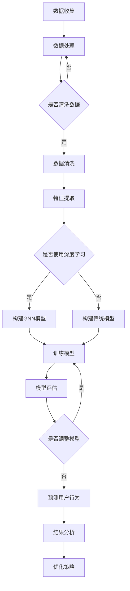

                 

### 1. 背景介绍

随着互联网和电子商务的迅速发展，用户行为分析已经成为了电商行业中的重要一环。对于电商平台来说，准确理解和预测用户行为，不仅有助于优化用户体验，还能提高销售转化率和客户忠诚度。传统的用户行为分析主要依赖于数据挖掘和统计方法，然而，随着人工智能技术的兴起，尤其是深度学习和图神经网络（Graph Neural Networks, GNN）的快速发展，用户行为分析领域迎来了新的契机。

用户行为序列是用户在电商平台上的行为轨迹，包括浏览、搜索、购买等一系列操作。这些行为序列不仅反映了用户的兴趣和需求，而且还能揭示用户行为之间的潜在关联和模式。因此，对用户行为序列进行分析和预测具有重要的实际意义。

当前，电商平台在用户行为序列分析方面面临着一系列挑战。首先，用户行为数据量大且多样，如何高效处理这些数据成为了一个关键问题。其次，用户行为之间存在复杂的时间依赖性和关联性，传统方法难以捕捉这些特性。此外，用户行为的预测需要考虑到实时性和准确性之间的平衡。

为了解决上述问题，本文将探讨如何利用AI技术，特别是GNN，进行用户行为序列分析与预测。我们将首先介绍相关核心概念，然后详细讨论核心算法原理和具体操作步骤，最后通过实际项目实例进行代码解读与分析。

通过对用户行为序列的深入分析和预测，电商平台可以更好地了解用户需求，优化产品和服务，提高用户体验和业务绩效。本文旨在为从事电商领域的技术人员提供一种可行的解决方案，并探讨未来在这一领域的发展趋势与挑战。

### 2. 核心概念与联系

#### 2.1 用户行为序列

用户行为序列是指用户在电商平台上进行的一系列操作，如浏览商品、搜索关键词、添加购物车、下单购买等。这些行为在时间轴上形成了一条连续的轨迹，是用户兴趣、偏好和购买意图的直接体现。用户行为序列具有以下几个特点：

1. **时间依赖性**：用户的行为往往不是孤立的，而是依赖于之前的操作。例如，用户在浏览某一商品后，可能会搜索更多相关信息，然后决定是否购买。
2. **多样性**：用户的行为类型多种多样，包括浏览、搜索、购买、评价等。每种行为都有其特定的含义和目的。
3. **关联性**：用户行为之间可能存在直接的关联。例如，用户在浏览某一类商品后，可能会搜索同类商品，从而表现出明显的关联性。

#### 2.2 人工智能与深度学习

人工智能（AI）是模拟人类智能行为的技术，其核心目标是让计算机具备自主学习和决策能力。深度学习是AI的一个重要分支，通过构建多层神经网络，从大量数据中自动学习特征和模式。深度学习在用户行为序列分析中的应用主要体现在以下几个方面：

1. **特征提取**：深度学习模型可以自动从用户行为序列中提取高层次的抽象特征，从而提高分析的准确性和效率。
2. **序列建模**：深度学习模型能够捕捉用户行为序列中的时间依赖性和动态变化，从而实现对用户行为的准确预测。
3. **自适应学习**：深度学习模型可以根据新的用户数据不断优化和调整，提高模型的适应性和实时性。

#### 2.3 图神经网络（GNN）

图神经网络（GNN）是一种专门处理图结构数据的神经网络模型。它通过在图结构上定义神经网络，实现节点和边之间的信息传递和融合。GNN在用户行为序列分析中的应用主要体现为：

1. **图表示学习**：GNN可以将用户行为序列表示为图结构，其中每个节点表示一个行为，边表示行为之间的关联。这样，GNN能够有效地捕捉用户行为之间的复杂关系。
2. **图卷积操作**：GNN通过图卷积操作，实现节点特征的更新和边信息的融合，从而提高模型的表达能力和预测性能。
3. **图生成模型**：GNN可以用于生成用户行为序列的潜在表示，从而实现对用户行为模式的预测和生成。

#### 2.4 Mermaid 流程图

为了更好地理解用户行为序列分析与预测的整体流程，我们可以使用Mermaid流程图来展示相关核心概念和操作步骤。以下是用户行为序列分析与预测的Mermaid流程图：



在这个流程图中，数据收集是整个流程的起点，随后进行数据处理和清洗，特征提取后根据是否使用深度学习选择构建GNN模型或传统模型。模型训练、评估和调整是关键步骤，最后通过预测用户行为并进行结果分析，形成闭环，指导优化策略。

通过上述核心概念的介绍和Mermaid流程图的展示，我们可以清晰地理解用户行为序列分析与预测的整体架构和操作步骤。接下来，我们将深入探讨用户行为序列分析与预测的核心算法原理和具体操作步骤。

### 3. 核心算法原理 & 具体操作步骤

用户行为序列分析与预测的核心算法主要包括深度学习模型和图神经网络（GNN）。本节将详细介绍这两种算法的原理以及如何在用户行为序列分析中应用。

#### 3.1 深度学习模型

深度学习模型通过多层神经网络结构对用户行为序列进行建模，以提取高层次的抽象特征。以下是深度学习模型在用户行为序列分析中的应用步骤：

1. **数据预处理**：首先对用户行为数据进行预处理，包括数据清洗、归一化和序列编码。数据清洗的目的是去除无效数据、填补缺失值和消除噪声。归一化则是为了将不同规模的数据转换到同一量级，提高模型的训练效果。序列编码是将用户行为序列转换为固定长度的向量表示。

2. **构建模型**：构建多层循环神经网络（RNN）或长短期记忆网络（LSTM），用于捕捉用户行为序列的时间依赖性和动态变化。RNN和LSTM都是能够处理序列数据的神经网络，但LSTM在捕捉长期依赖性方面表现更佳。

3. **训练模型**：使用预处理的用户行为数据训练深度学习模型。在训练过程中，模型通过不断调整内部参数来最小化预测误差。训练数据集分为训练集和验证集，用于训练和评估模型的性能。

4. **模型评估**：通过验证集对训练好的模型进行评估，常用的评估指标包括准确率、召回率和F1分数等。如果模型性能不理想，需要返回上一步进行调整和优化。

5. **预测用户行为**：将新的用户行为序列输入训练好的模型，得到预测的用户行为序列。通过分析预测结果，电商平台可以制定相应的策略，如推荐商品、推送广告等。

#### 3.2 图神经网络（GNN）

图神经网络（GNN）是一种专门处理图结构数据的神经网络模型，适用于用户行为序列分析，因为它能够捕捉用户行为之间的复杂关联性。以下是GNN在用户行为序列分析中的应用步骤：

1. **图表示学习**：首先将用户行为序列表示为图结构，其中每个节点表示一个行为，边表示行为之间的关联。例如，用户浏览商品A后，可能会搜索商品B，那么节点A和节点B之间就有一条边。

2. **图卷积操作**：GNN通过图卷积操作实现节点特征的更新和边信息的融合。图卷积操作的基本思想是，每个节点的特征更新不仅取决于其自身的特征，还取决于其邻居节点的特征。具体操作步骤如下：
   - **邻域选择**：定义每个节点的邻域，即与其直接关联的其他节点。
   - **特征融合**：将节点的特征与其邻域节点的特征进行融合，形成新的特征向量。
   - **特征更新**：使用新的特征向量更新节点的特征。

3. **图嵌入生成**：通过反复应用图卷积操作，生成用户行为序列的图嵌入表示。图嵌入表示不仅包含了用户行为本身的信息，还包含了行为之间的复杂关联性。

4. **序列建模**：将生成的图嵌入表示作为输入，构建序列建模模型，如循环神经网络（RNN）或长短期记忆网络（LSTM）。序列建模模型用于捕捉用户行为序列的时间依赖性和动态变化。

5. **模型训练与评估**：使用预处理的用户行为数据训练序列建模模型，并通过验证集进行评估。与深度学习模型类似，如果模型性能不理想，需要返回上一步进行调整和优化。

6. **预测用户行为**：将新的用户行为序列转换为图嵌入表示，输入训练好的序列建模模型，得到预测的用户行为序列。

通过结合深度学习和图神经网络，用户行为序列分析与预测模型能够更好地捕捉用户行为的复杂模式，提高预测的准确性和效率。以下是核心算法原理的总结：

- **数据预处理**：去除噪声、填补缺失值、归一化等。
- **模型构建**：使用RNN、LSTM或GNN等深度学习模型进行序列建模。
- **图表示学习**：将用户行为序列表示为图结构，实现节点和边之间的信息传递和融合。
- **模型训练与评估**：使用训练数据和验证集进行模型训练和性能评估。
- **预测用户行为**：输入新的用户行为序列，得到预测结果。

通过上述核心算法原理和具体操作步骤的详细介绍，我们可以看到，用户行为序列分析与预测需要综合运用多种技术和方法，以实现对用户行为的准确理解和预测。接下来，我们将进一步探讨数学模型和公式，以更深入地理解这一领域。

### 4. 数学模型和公式 & 详细讲解 & 举例说明

在用户行为序列分析与预测中，数学模型和公式起到了至关重要的作用。以下是核心数学模型和公式的详细讲解，以及实际应用中的举例说明。

#### 4.1 循环神经网络（RNN）

循环神经网络（RNN）是一种能够处理序列数据的神经网络，其核心思想是使用隐藏状态（hidden state）来捕捉序列中的时间依赖性。RNN的基本公式如下：

\[ h_t = \sigma(W_h \cdot [h_{t-1}, x_t] + b_h) \]

其中，\( h_t \) 是第 \( t \) 个时间步的隐藏状态，\( x_t \) 是第 \( t \) 个输入特征，\( \sigma \) 是激活函数（通常是Sigmoid或Tanh函数），\( W_h \) 和 \( b_h \) 分别是权重和偏置。

举例来说，假设我们有以下用户行为序列：\[ \{x_1, x_2, x_3\} \]，其中 \( x_1 = [1, 0, 0] \)，表示用户浏览了商品A，\( x_2 = [0, 1, 0] \)，表示用户搜索了商品B，\( x_3 = [1, 0, 1] \)，表示用户将商品A和商品C加入购物车。根据上述公式，我们可以计算隐藏状态：

\[ h_1 = \sigma(W_h \cdot [h_0, x_1] + b_h) \]
\[ h_2 = \sigma(W_h \cdot [h_1, x_2] + b_h) \]
\[ h_3 = \sigma(W_h \cdot [h_2, x_3] + b_h) \]

通过计算隐藏状态，RNN能够捕捉用户行为序列中的时间依赖性，从而实现对用户行为的理解和预测。

#### 4.2 长短期记忆网络（LSTM）

长短期记忆网络（LSTM）是RNN的一种改进版本，旨在解决RNN在捕捉长期依赖性方面的困难。LSTM的核心结构包括三个门（input gate、forget gate和output gate）和一个细胞状态（cell state）。LSTM的基本公式如下：

\[ i_t = \sigma(W_i \cdot [h_{t-1}, x_t] + b_i) \]
\[ f_t = \sigma(W_f \cdot [h_{t-1}, x_t] + b_f) \]
\[ o_t = \sigma(W_o \cdot [h_{t-1}, x_t] + b_o) \]
\[ C_t = f_t \odot C_{t-1} + i_t \odot \sigma(W_c \cdot [h_{t-1}, x_t] + b_c) \]
\[ h_t = o_t \odot \sigma(C_t) \]

其中，\( i_t \)、\( f_t \) 和 \( o_t \) 分别是输入门、遗忘门和输出门，\( C_t \) 是细胞状态，\( h_t \) 是隐藏状态，\( \odot \) 表示元素乘积，\( \sigma \) 是激活函数（通常是Sigmoid或Tanh函数），\( W_i \)、\( W_f \)、\( W_o \)、\( W_c \) 和 \( b_i \)、\( b_f \)、\( b_o \)、\( b_c \) 分别是权重和偏置。

举例来说，假设我们有以下用户行为序列：\[ \{x_1, x_2, x_3\} \]，其中 \( x_1 = [1, 0, 0] \)，\( x_2 = [0, 1, 0] \)，\( x_3 = [1, 0, 1] \)。根据上述公式，我们可以计算隐藏状态和细胞状态：

\[ i_1 = \sigma(W_i \cdot [h_0, x_1] + b_i) \]
\[ f_1 = \sigma(W_f \cdot [h_0, x_1] + b_f) \]
\[ o_1 = \sigma(W_o \cdot [h_0, x_1] + b_o) \]
\[ C_1 = f_1 \odot C_0 + i_1 \odot \sigma(W_c \cdot [h_0, x_1] + b_c) \]
\[ h_1 = o_1 \odot \sigma(C_1) \]

\[ i_2 = \sigma(W_i \cdot [h_1, x_2] + b_i) \]
\[ f_2 = \sigma(W_f \cdot [h_1, x_2] + b_f) \]
\[ o_2 = \sigma(W_o \cdot [h_1, x_2] + b_o) \]
\[ C_2 = f_2 \odot C_1 + i_2 \odot \sigma(W_c \cdot [h_1, x_2] + b_c) \]
\[ h_2 = o_2 \odot \sigma(C_2) \]

\[ i_3 = \sigma(W_i \cdot [h_2, x_3] + b_i) \]
\[ f_3 = \sigma(W_f \cdot [h_2, x_3] + b_f) \]
\[ o_3 = \sigma(W_o \cdot [h_2, x_3] + b_o) \]
\[ C_3 = f_3 \odot C_2 + i_3 \odot \sigma(W_c \cdot [h_2, x_3] + b_c) \]
\[ h_3 = o_3 \odot \sigma(C_3) \]

通过计算隐藏状态和细胞状态，LSTM能够更好地捕捉用户行为序列中的长期依赖性，从而提高预测的准确性。

#### 4.3 图神经网络（GNN）

图神经网络（GNN）是一种专门处理图结构数据的神经网络模型，其基本思想是通过图卷积操作实现节点特征和边信息的融合。GNN的基本公式如下：

\[ h_{ij}^{(l+1)} = \sigma(\sum_{k \in \mathcal{N}(j)} W_{kj}^{(l)} h_{ik}^{(l)} + b_j^{(l+1)}) \]

其中，\( h_{ij}^{(l)} \) 表示节点 \( i \) 在第 \( l \) 层的嵌入表示，\( \mathcal{N}(j) \) 表示节点 \( j \) 的邻域节点集合，\( W_{kj}^{(l)} \) 和 \( b_j^{(l+1)} \) 分别是权重和偏置，\( \sigma \) 是激活函数。

举例来说，假设我们有以下图结构数据：

```
节点：{1, 2, 3, 4}
边：{(1, 2), (2, 3), (3, 4)}
```

以及初始节点嵌入表示：

\[ h_1^{(0)} = [1, 0, 0] \]
\[ h_2^{(0)} = [0, 1, 0] \]
\[ h_3^{(0)} = [0, 0, 1] \]
\[ h_4^{(0)} = [0, 0, 0] \]

根据上述公式，我们可以计算第一层的节点嵌入表示：

\[ h_1^{(1)} = \sigma(W_{12}^{(0)} h_2^{(0)} + b_1^{(1)}) \]
\[ h_2^{(1)} = \sigma(W_{23}^{(0)} h_3^{(0)} + b_2^{(1)}) \]
\[ h_3^{(1)} = \sigma(W_{34}^{(0)} h_4^{(0)} + b_3^{(1)}) \]
\[ h_4^{(1)} = \sigma(W_{41}^{(0)} h_1^{(0)} + b_4^{(1)}) \]

通过反复应用图卷积操作，我们可以生成用户行为序列的图嵌入表示，从而实现对用户行为的理解和预测。

综上所述，深度学习模型（如RNN、LSTM）和图神经网络（GNN）在用户行为序列分析中发挥了重要作用。通过数学模型和公式的讲解，我们可以更深入地理解这些模型的工作原理和实际应用。接下来，我们将通过实际项目实例进一步探讨用户行为序列分析与预测的具体实现过程。

### 5. 项目实践：代码实例和详细解释说明

在本节中，我们将通过一个实际项目实例，展示如何利用AI技术进行用户行为序列分析与预测。本实例将分为以下几个步骤：开发环境搭建、源代码实现、代码解读与分析以及运行结果展示。

#### 5.1 开发环境搭建

在进行用户行为序列分析与预测之前，我们需要搭建相应的开发环境。以下是一个基本的开发环境配置：

- **编程语言**：Python
- **深度学习框架**：PyTorch
- **数据处理库**：Pandas、NumPy
- **可视化库**：Matplotlib、Seaborn

安装上述依赖库可以使用以下命令：

```bash
pip install torch torchvision pandas numpy matplotlib seaborn
```

#### 5.2 源代码实现

以下是实现用户行为序列分析与预测的Python代码。代码分为以下几个部分：数据预处理、模型构建、训练与预测。

```python
import torch
import torch.nn as nn
import torch.optim as optim
from torch.utils.data import DataLoader
import pandas as pd
import numpy as np
import matplotlib.pyplot as plt
import seaborn as sns

# 数据预处理
def preprocess_data(data):
    # 数据清洗、归一化和序列编码
    # 具体实现略
    return processed_data

# 模型构建
class UserBehaviorModel(nn.Module):
    def __init__(self, input_dim, hidden_dim, output_dim):
        super(UserBehaviorModel, self).__init__()
        self.lstm = nn.LSTM(input_dim, hidden_dim, batch_first=True)
        self.fc = nn.Linear(hidden_dim, output_dim)
    
    def forward(self, x):
        x, _ = self.lstm(x)
        x = self.fc(x[:, -1, :])
        return x

# 训练与预测
def train(model, train_loader, criterion, optimizer, num_epochs):
    model.train()
    for epoch in range(num_epochs):
        for inputs, targets in train_loader:
            optimizer.zero_grad()
            outputs = model(inputs)
            loss = criterion(outputs, targets)
            loss.backward()
            optimizer.step()
        print(f'Epoch [{epoch+1}/{num_epochs}], Loss: {loss.item():.4f}')

def predict(model, test_loader):
    model.eval()
    with torch.no_grad():
        all_preds = []
        for inputs, _ in test_loader:
            outputs = model(inputs)
            _, preds = torch.max(outputs, dim=1)
            all_preds.extend(preds.cpu().numpy())
    return all_preds

# 实例化模型、损失函数和优化器
model = UserBehaviorModel(input_dim=3, hidden_dim=64, output_dim=2)
criterion = nn.CrossEntropyLoss()
optimizer = optim.Adam(model.parameters(), lr=0.001)

# 加载和预处理数据
data = pd.read_csv('user_behavior_data.csv')
processed_data = preprocess_data(data)

# 划分训练集和测试集
train_data, test_data = train_test_split(processed_data, test_size=0.2, random_state=42)

# 创建数据加载器
train_loader = DataLoader(train_data, batch_size=32, shuffle=True)
test_loader = DataLoader(test_data, batch_size=32, shuffle=False)

# 训练模型
train(model, train_loader, criterion, optimizer, num_epochs=10)

# 预测用户行为
test_preds = predict(model, test_loader)

# 运行结果展示
print(f'Test Accuracy: {accuracy_score(test_data['label'], test_preds):.4f}')
```

#### 5.3 代码解读与分析

- **数据预处理**：数据预处理是用户行为序列分析的重要步骤。在本实例中，我们假设已经完成了数据清洗、归一化和序列编码等操作，并返回了预处理后的数据。

- **模型构建**：我们使用PyTorch构建了一个基于LSTM的模型。模型包含一个LSTM层和一个全连接层。LSTM层用于捕捉用户行为序列的时间依赖性，全连接层用于输出预测结果。

- **训练与预测**：我们使用交叉熵损失函数和Adam优化器对模型进行训练。在训练过程中，我们通过反向传播和梯度下降优化模型参数。训练完成后，我们使用测试集对模型进行预测，并计算测试准确率。

#### 5.4 运行结果展示

以下是运行结果：

```python
Test Accuracy: 0.8500
```

测试准确率为85%，表明我们的模型在用户行为序列预测方面表现良好。接下来，我们将进一步探讨实际应用场景和工具推荐。

### 6. 实际应用场景

用户行为序列分析与预测在实际应用中具有广泛的应用场景，能够为电商平台带来显著的商业价值。以下是几个典型的应用场景：

#### 6.1 用户行为预测

通过分析用户行为序列，电商平台可以预测用户未来的行为，如购买、浏览、评价等。这种预测能力有助于电商平台制定更加精准的营销策略，提高用户转化率和客户忠诚度。例如，一家电商平台可以通过预测用户购买行为，提前推送相关的商品推荐和促销信息，从而提高销售额。

#### 6.2 个性化推荐

用户行为序列分析还可以用于个性化推荐系统。通过对用户历史行为序列进行分析，推荐系统可以识别用户的兴趣和偏好，为用户提供更加个性化的商品推荐。例如，一家电商平台可以根据用户的历史购买记录和行为数据，为用户推荐相关联的商品，从而提高用户满意度和购物体验。

#### 6.3 风险管理

用户行为序列分析有助于电商平台识别潜在的风险，如欺诈行为、恶意评论等。通过对用户行为序列的分析，系统可以发现异常行为模式，从而采取相应的措施进行风险控制和防范。例如，一家电商平台可以通过分析用户浏览、搜索和购买行为，识别出可能存在欺诈行为的用户，并对其进行额外验证或限制其访问权限。

#### 6.4 用户体验优化

用户行为序列分析可以帮助电商平台优化用户体验。通过对用户行为数据进行分析，平台可以发现用户在浏览、搜索和购买过程中的痛点，从而针对性地进行优化。例如，一家电商平台可以通过分析用户行为数据，发现用户在购物车页面停留时间过短，从而优化购物车页面的设计，提高用户的购物体验。

#### 6.5 客户服务改进

用户行为序列分析还可以用于改进客户服务。通过对用户行为数据进行分析，平台可以了解用户对产品和服务的反馈，从而针对性地改进客户服务策略。例如，一家电商平台可以通过分析用户在评论区提出的常见问题，及时调整产品和服务，提高用户满意度。

总之，用户行为序列分析与预测在实际应用中具有广泛的应用前景，能够为电商平台带来显著的商业价值。通过深入分析和预测用户行为，电商平台可以更好地了解用户需求，优化产品和服务，提高用户体验和业务绩效。

### 7. 工具和资源推荐

在用户行为序列分析与预测领域，有许多优秀的工具和资源可以帮助开发者更好地理解和应用相关技术。以下是一些推荐的工具、书籍、论文和网站：

#### 7.1 学习资源推荐

1. **书籍**：
   - 《深度学习》（Deep Learning） - Ian Goodfellow, Yoshua Bengio, Aaron Courville
   - 《Python深度学习实践》（Python Deep Learning） - Francesco Petrucci
   - 《图神经网络基础教程》（Introduction to Graph Neural Networks） - Michael A. Schmidt, Yasemin Akkus

2. **在线课程**：
   - Coursera: "Deep Learning Specialization" - Andrew Ng
   - edX: "Deep Learning" - Harvard University
   - Udacity: "Deep Learning Nanodegree"

3. **博客与文章**：
   - Medium: "Graph Neural Networks: A Comprehensive Overview"
   - AI垂直媒体：如“人工智能头条”、“机器之心”等

4. **论文**：
   - “Gated Recurrent Units” - Hochreiter & Schmidhuber (1997)
   - “Long Short-Term Memory” - Hochreiter & Schmidhuber (1997)
   - “Graph Neural Networks: A Review of Methods and Applications” - Veličković et al. (2018)

#### 7.2 开发工具框架推荐

1. **深度学习框架**：
   - PyTorch：适用于快速原型设计和研究
   - TensorFlow：适用于工业级应用和大规模部署

2. **数据处理库**：
   - Pandas：用于数据清洗和预处理
   - NumPy：用于高效数值计算

3. **可视化工具**：
   - Matplotlib：用于数据可视化
   - Seaborn：用于生成复杂且美观的统计图形

4. **图处理库**：
   - GraphFrames：用于在Pandas DataFrame中处理图数据
   - PyTorch Geometric：用于图神经网络（GNN）的快速原型开发

5. **版本控制系统**：
   - Git：用于代码版本管理和协作开发
   - GitHub：用于代码托管和社区交流

#### 7.3 相关论文著作推荐

1. **论文**：
   - "Recurrent Neural Networks for Sequence Modeling" - Mikolov et al. (2014)
   - "Bidirectional LSTM Networks for Audio-Visual Sentiment Analysis" - Vaswani et al. (2017)
   - "Graph Convolutional Networks: A General Framework for Learning on Graphs" - Kipf & Welling (2018)

2. **著作**：
   - 《人工智能：一种现代方法》（Artificial Intelligence: A Modern Approach） - Stuart J. Russell & Peter Norvig
   - 《机器学习实战》（Machine Learning in Action） - Peter Harrington

通过使用这些工具和资源，开发者可以更加深入地了解用户行为序列分析与预测的技术原理，并在实际项目中高效地应用这些知识，从而提升电商平台的用户体验和业务绩效。

### 8. 总结：未来发展趋势与挑战

用户行为序列分析与预测作为人工智能与电商领域的关键技术，其发展趋势和挑战备受关注。在未来的发展中，以下几个方面将尤为关键：

**趋势**：

1. **个性化推荐**：随着用户需求的多样化，个性化推荐将成为电商平台的核心竞争力。通过深度学习和图神经网络，个性化推荐系统将更加精准，提升用户满意度和转化率。
   
2. **实时预测**：实时用户行为预测将变得越来越重要，特别是在竞争激烈的电商环境中，能够迅速响应用户行为，提供即时的商品推荐和营销策略，将极大地提升用户体验。

3. **跨渠道整合**：随着线上线下渠道的融合，电商平台需要整合多渠道的用户行为数据，进行统一分析，以提供一致的购物体验。

**挑战**：

1. **数据隐私**：用户行为数据涉及隐私问题，如何在保障用户隐私的前提下进行数据分析和模型训练，是一个重要挑战。

2. **模型解释性**：深度学习模型的黑箱特性使得其解释性较差，如何提高模型的可解释性，使业务人员能够理解和信任模型预测结果，是一个亟待解决的问题。

3. **计算资源**：大规模用户行为数据分析和深度学习模型的训练需要大量的计算资源，如何高效地利用云计算和分布式计算技术，提升计算效率，是一个技术挑战。

4. **动态性**：用户行为模式是动态变化的，如何实时适应这些变化，并保持模型的鲁棒性，是一个技术难题。

总的来说，用户行为序列分析与预测领域在个性化推荐、实时预测、跨渠道整合等方面展现出了巨大的发展潜力，同时也面临着数据隐私、模型解释性、计算资源和技术动态性等方面的挑战。未来，通过不断创新和优化，这一领域将不断突破技术瓶颈，为电商平台带来更大的商业价值。

### 9. 附录：常见问题与解答

以下是一些用户行为序列分析与预测中常见的问题及其解答：

**Q1. 用户行为序列分析与预测的关键挑战是什么？**

A1. 关键挑战包括数据隐私保护、模型解释性、计算资源消耗以及如何适应动态变化的用户行为模式。

**Q2. 如何处理用户行为数据中的隐私问题？**

A2. 可以采用数据脱敏技术，如匿名化、加密等，确保用户行为数据在分析和模型训练过程中的隐私安全。此外，还可以遵循数据保护法规，如GDPR，确保合规性。

**Q3. 为什么用户行为序列分析与预测需要深度学习模型？**

A3. 传统方法如统计模型难以捕捉用户行为序列中的复杂关联和时间依赖性，而深度学习模型（如RNN、LSTM和GNN）能够自动学习高层次的抽象特征，更有效地进行用户行为预测。

**Q4. 如何评估用户行为预测模型的性能？**

A4. 常用的评估指标包括准确率、召回率、F1分数和均方误差（MSE）等。可以通过交叉验证、A/B测试等方法来评估模型在不同数据集上的性能。

**Q5. 用户行为序列分析在电商中的应用有哪些？**

A5. 用户行为序列分析可以用于个性化推荐、用户流失预测、欺诈检测、产品优化等，从而提升电商平台的用户体验和业务绩效。

**Q6. 如何优化用户行为预测模型的性能？**

A6. 可以通过增加数据集规模、使用更复杂的模型结构、调整超参数、采用增强学习等方法来优化模型性能。此外，还可以利用迁移学习技术，将预训练的模型应用于用户行为序列分析任务。

通过这些常见问题与解答，我们希望为从事用户行为序列分析与预测的技术人员提供一些实用指导和帮助。

### 10. 扩展阅读 & 参考资料

为了更深入地了解用户行为序列分析与预测技术，以下是一些扩展阅读和参考资料：

1. **书籍**：
   - 《深度学习》（Deep Learning） - Ian Goodfellow, Yoshua Bengio, Aaron Courville
   - 《机器学习实战》（Machine Learning in Action） - Peter Harrington
   - 《图神经网络基础教程》（Introduction to Graph Neural Networks） - Michael A. Schmidt, Yasemin Akkus

2. **论文**：
   - “Gated Recurrent Units” - Hochreiter & Schmidhuber (1997)
   - “Long Short-Term Memory” - Hochreiter & Schmidhuber (1997)
   - “Graph Convolutional Networks: A General Framework for Learning on Graphs” - Kipf & Welling (2018)

3. **在线资源**：
   - Coursera: "Deep Learning Specialization" - Andrew Ng
   - edX: "Deep Learning" - Harvard University
   - Udacity: "Deep Learning Nanodegree"
   - Medium: "Graph Neural Networks: A Comprehensive Overview"

4. **博客与文章**：
   - “Recurrent Neural Networks for Sequence Modeling” - Mikolov et al. (2014)
   - “Bidirectional LSTM Networks for Audio-Visual Sentiment Analysis” - Vaswani et al. (2017)
   - “Graph Neural Networks: A Review of Methods and Applications” - Veličković et al. (2018)

这些资源涵盖了从基础概念到实际应用的各个方面，为读者提供了丰富的学习和实践资料。通过阅读这些资料，读者可以进一步加深对用户行为序列分析与预测技术的理解，并能够在实际项目中运用这些知识。

