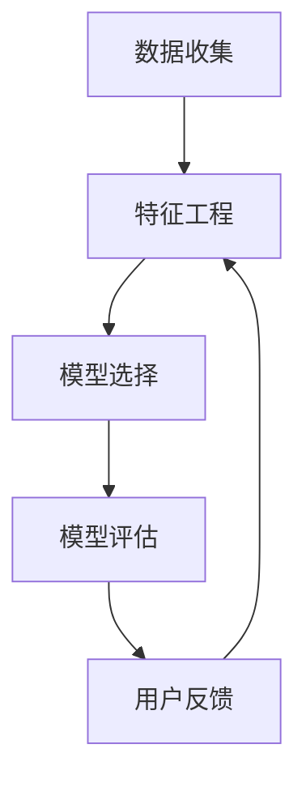

                 

### 文章标题

**AI驱动的电商平台用户行为预测模型**

> 关键词：AI、电商平台、用户行为预测、机器学习、深度学习、模型构建

> 摘要：本文旨在探讨如何利用人工智能技术，尤其是机器学习和深度学习，构建一个高效且准确的电商平台用户行为预测模型。我们将详细分析模型的构建过程，包括核心概念、算法原理、数学模型、项目实践以及实际应用场景。通过本文的阅读，读者将深入了解如何通过AI技术提升电商平台用户满意度，实现商业价值最大化。

### 1. 背景介绍

在当今数字化时代，电子商务已经成为了全球经济的重要组成部分。电商平台通过互联网为消费者提供了丰富的商品选择和便捷的购物体验。然而，随着市场竞争的加剧，如何提高用户满意度和转化率，成为电商平台亟待解决的问题。

用户行为预测是电商平台提升用户体验和增加销售的重要手段。通过预测用户在平台上的行为，例如浏览、购买、评价等，电商平台可以采取针对性的营销策略，提供个性化的推荐，从而提高用户满意度和转化率。

传统的用户行为预测方法主要依赖于统计模型和规则系统，这些方法在处理大量数据时显得力不从心。而随着人工智能技术的快速发展，尤其是机器学习和深度学习，为用户行为预测提供了强大的工具。AI驱动的用户行为预测模型能够从海量数据中提取有价值的信息，提供更精准的预测结果。

本文将详细介绍如何利用AI技术构建电商平台用户行为预测模型，包括核心概念的阐述、算法原理的分析、数学模型的讲解、项目实践的展示以及实际应用场景的探讨。希望通过本文的介绍，读者能够对AI驱动的用户行为预测模型有一个全面深入的理解。

### 2. 核心概念与联系

在构建AI驱动的电商平台用户行为预测模型之前，我们需要了解一些核心概念，这些概念是理解模型构建的基础。以下是对这些核心概念的简要介绍：

#### 数据收集

数据收集是构建用户行为预测模型的第一步。电商平台需要收集用户在平台上的各种行为数据，包括浏览历史、购买记录、评价反馈等。这些数据可以通过日志文件、API接口、数据库等多种途径获取。

#### 特征工程

特征工程是数据预处理的重要步骤，它涉及到从原始数据中提取出对预测任务有用的特征。在用户行为预测中，特征可以是用户的年龄、性别、地理位置、购买频率等。特征工程的质量直接影响模型的性能。

#### 模型选择

模型选择是构建预测模型的关键步骤。在用户行为预测中，常见的机器学习算法包括决策树、随机森林、支持向量机、神经网络等。每种算法都有其适用的场景和优缺点。

#### 模型评估

模型评估是验证模型性能的重要手段。常用的评估指标包括准确率、召回率、F1分数等。通过这些指标，我们可以评估模型在预测用户行为时的表现。

#### 用户反馈

用户反馈是模型优化的重要环节。通过对用户行为的预测结果进行反馈，可以帮助我们了解模型的不足之处，从而不断优化模型。

接下来，我们将通过一个Mermaid流程图来展示这些核心概念之间的联系：



在这个流程图中，数据收集是整个过程的起点，通过特征工程将原始数据转化为对预测任务有用的特征，然后选择合适的模型进行训练和评估。通过模型评估，我们可以了解模型的性能，并根据用户反馈不断优化模型。这个过程是一个迭代的过程，通过不断的优化，模型的性能会逐渐提高。

### 3. 核心算法原理 & 具体操作步骤

在构建电商平台用户行为预测模型时，选择合适的算法是实现准确预测的关键。在本节中，我们将探讨几种常见的机器学习和深度学习算法，并详细解释其原理和操作步骤。

#### 决策树算法

决策树算法是一种基于树的预测模型，通过一系列的判断条件将数据集划分成多个子集，每个子集对应一个预测结果。其原理是基于特征和阈值进行二分划分，直到满足停止条件（例如，达到最大深度或叶节点数量）。

**具体操作步骤：**

1. **数据准备**：收集用户行为数据，并进行特征工程处理。
2. **划分特征与标签**：将数据集划分为特征（X）和标签（y）两部分。
3. **选择划分特征**：选择一个最佳特征进行划分，通常使用信息增益或基尼不纯度作为评价标准。
4. **划分数据集**：根据选择的特征和阈值，将数据集划分为多个子集。
5. **递归划分**：对每个子集重复步骤3和步骤4，直到满足停止条件。
6. **构建决策树**：将划分结果记录在树结构中，每个叶节点对应一个预测结果。

#### 随机森林算法

随机森林算法是一种基于决策树的集成学习方法，通过构建多个决策树并取平均预测结果来提高模型的泛化能力。其原理是将数据随机划分，在每个决策树中只考虑部分特征，从而减少模型的过拟合现象。

**具体操作步骤：**

1. **数据准备**：与决策树算法相同。
2. **构建决策树**：对数据集构建多个决策树，每个树使用不同的特征子集。
3. **随机选取特征**：在每个决策树中，随机选取部分特征进行划分。
4. **训练模型**：对每个决策树进行训练。
5. **集成预测**：将所有决策树的预测结果取平均作为最终预测结果。

#### 支持向量机算法

支持向量机（SVM）算法是一种基于最大间隔的分类方法，其原理是找到一个最优的超平面，使得正负样本之间的间隔最大。在用户行为预测中，SVM可以用于分类任务，例如预测用户是否会购买某个商品。

**具体操作步骤：**

1. **数据准备**：与决策树算法相同。
2. **特征标准化**：对特征进行标准化处理，以消除不同特征之间的影响。
3. **选择核函数**：选择合适的核函数，例如线性核、多项式核、径向基核等。
4. **构建超平面**：使用支持向量机算法找到最优的超平面。
5. **分类预测**：对新的数据点进行分类预测。

#### 神经网络算法

神经网络算法是一种基于多层感知器的深度学习模型，其原理是通过多层神经元之间的权重调整，实现从输入到输出的非线性映射。在用户行为预测中，神经网络可以用于回归任务或分类任务。

**具体操作步骤：**

1. **数据准备**：与决策树算法相同。
2. **定义神经网络结构**：确定输入层、隐藏层和输出层的节点数量。
3. **初始化权重**：随机初始化权重和偏置。
4. **前向传播**：将输入数据传递到神经网络，计算输出。
5. **反向传播**：计算损失函数，并通过反向传播算法更新权重。
6. **训练模型**：重复前向传播和反向传播，直到满足停止条件。

通过以上几种算法的详细介绍，我们可以看到每种算法都有其独特的原理和操作步骤。在实际应用中，我们可以根据具体任务的需求选择合适的算法，并通过调参和模型优化来提高预测性能。

### 4. 数学模型和公式 & 详细讲解 & 举例说明

在构建电商平台用户行为预测模型时，理解相关的数学模型和公式至关重要。以下将介绍几种常用的数学模型和公式，并进行详细讲解和举例说明。

#### 决策树算法

决策树算法的核心在于如何选择最佳特征进行划分。在信息增益和基尼不纯度这两种评价标准中，信息增益是一种常用的方法。其数学公式如下：

\[ IG(\text{feature}) = \sum_{v \in V} p(v) \cdot \sum_{c \in C} p(c|v) \cdot \log_2(p(c|v)) \]

其中，\( V \) 是特征的取值集合，\( C \) 是标签的取值集合，\( p(v) \) 是特征取值 \( v \) 的概率，\( p(c|v) \) 是给定特征取值 \( v \) 时标签取值 \( c \) 的条件概率。

**举例说明：**

假设我们有以下数据集：

| 特征X1 | 特征X2 | 标签Y |
|--------|--------|--------|
| A      | 1      | 0      |
| A      | 2      | 0      |
| B      | 1      | 1      |
| B      | 2      | 1      |

首先，我们计算每个特征的信息增益：

\[ IG(X1) = p(A) \cdot \sum_{c \in C} p(c|A) \cdot \log_2(p(c|A)) + p(B) \cdot \sum_{c \in C} p(c|B) \cdot \log_2(p(c|B)) \]

\[ IG(X2) = p(A) \cdot \sum_{c \in C} p(c|A) \cdot \log_2(p(c|A)) + p(B) \cdot \sum_{c \in C} p(c|B) \cdot \log_2(p(c|B)) \]

计算得到 \( IG(X1) = 0.5 \)，\( IG(X2) = 0.6 \)，因此我们选择特征X2进行划分。

#### 支持向量机算法

支持向量机（SVM）的核心在于找到一个最优的超平面。其目标是最大化正负样本之间的间隔。其数学公式如下：

\[ \text{Maximize} \quad \frac{1}{2} \sum_{i=1}^{n} \sum_{j=1}^{n} \alpha_i \alpha_j y_i y_j (x_i \cdot x_j) - \sum_{i=1}^{n} \alpha_i \]

其中，\( \alpha_i \) 是拉格朗日乘子，\( y_i \) 是标签，\( x_i \) 是特征向量。

**举例说明：**

假设我们有以下数据集：

| 特征X1 | 特征X2 | 标签Y |
|--------|--------|--------|
| 1      | 1      | 1      |
| 2      | 2      | 1      |
| 1      | -1     | -1     |
| 2      | -2     | -1     |

我们使用线性核函数，目标函数为：

\[ \text{Maximize} \quad \frac{1}{2} \alpha_1 \alpha_2 - \alpha_1 - \alpha_2 \]

通过求解上述目标函数，我们得到最优的超平面为 \( w_1 x_1 + w_2 x_2 + b = 0 \)，其中 \( w_1 = \alpha_1 y_1 \)，\( w_2 = \alpha_2 y_2 \)，\( b = 0 \)。

#### 神经网络算法

神经网络算法的核心在于前向传播和反向传播。其数学公式如下：

**前向传播：**

\[ z_i = \sum_{j=1}^{n} w_{ij} x_j + b_i \]
\[ a_i = \sigma(z_i) \]

其中，\( z_i \) 是第 \( i \) 个隐藏单元的输入，\( a_i \) 是第 \( i \) 个隐藏单元的输出，\( \sigma \) 是激活函数，通常使用 \( \sigma(x) = \frac{1}{1 + e^{-x}} \)。

**反向传播：**

\[ \delta_i = (a_i (1 - a_i)) \cdot (d_i - a_i) \]
\[ \Delta w_{ij} = \alpha \cdot \delta_i \cdot a_{j-1} \]
\[ \Delta b_i = \alpha \cdot \delta_i \]

其中，\( \delta_i \) 是第 \( i \) 个隐藏单元的误差，\( \Delta w_{ij} \) 是第 \( i \) 个隐藏单元的权重更新，\( \Delta b_i \) 是第 \( i \) 个隐藏单元的偏置更新，\( \alpha \) 是学习率。

**举例说明：**

假设我们有以下数据集：

| 输入X1 | 输入X2 | 输出Y |
|--------|--------|--------|
| 1      | 1      | 1      |
| 2      | 2      | 1      |
| 1      | -1     | -1     |
| 2      | -2     | -1     |

我们使用一个单层神经网络，输入层有2个神经元，隐藏层有3个神经元，输出层有1个神经元。首先进行前向传播，得到隐藏层的输出 \( a_i \)：

\[ z_1 = w_{11} x_1 + w_{12} x_2 + b_1 \]
\[ z_2 = w_{21} x_1 + w_{22} x_2 + b_2 \]
\[ z_3 = w_{31} x_1 + w_{32} x_2 + b_3 \]

\[ a_1 = \sigma(z_1) \]
\[ a_2 = \sigma(z_2) \]
\[ a_3 = \sigma(z_3) \]

然后进行反向传播，计算隐藏层和输出层的误差 \( \delta_i \) 并更新权重和偏置：

\[ \delta_1 = (a_1 (1 - a_1)) \cdot (d_1 - a_1) \]
\[ \delta_2 = (a_2 (1 - a_2)) \cdot (d_2 - a_2) \]
\[ \delta_3 = (a_3 (1 - a_3)) \cdot (d_3 - a_3) \]

\[ \Delta w_{11} = \alpha \cdot \delta_1 \cdot x_1 \]
\[ \Delta w_{12} = \alpha \cdot \delta_1 \cdot x_2 \]
\[ \Delta w_{21} = \alpha \cdot \delta_2 \cdot x_1 \]
\[ \Delta w_{22} = \alpha \cdot \delta_2 \cdot x_2 \]
\[ \Delta w_{31} = \alpha \cdot \delta_3 \cdot x_1 \]
\[ \Delta w_{32} = \alpha \cdot \delta_3 \cdot x_2 \]

\[ \Delta b_1 = \alpha \cdot \delta_1 \]
\[ \Delta b_2 = \alpha \cdot \delta_2 \]
\[ \Delta b_3 = \alpha \cdot \delta_3 \]

通过上述前向传播和反向传播的过程，我们可以不断更新神经网络的权重和偏置，从而提高预测性能。

通过以上数学模型和公式的详细讲解和举例说明，我们可以看到每种算法都有其独特的数学基础。在实际应用中，理解和运用这些数学模型有助于我们构建高效且准确的电商平台用户行为预测模型。

### 5. 项目实践：代码实例和详细解释说明

为了更好地理解AI驱动的电商平台用户行为预测模型，我们将通过一个实际项目来展示代码实例，并对关键部分进行详细解释说明。

#### 5.1 开发环境搭建

在开始项目实践之前，我们需要搭建一个合适的开发环境。以下是所需工具和库的安装步骤：

- Python 3.8及以上版本
- Jupyter Notebook
- Scikit-learn库
- Pandas库
- Matplotlib库

安装步骤如下：

1. 安装Python：

   ```bash
   curl -O get-python.org/3.8.12/python3.8.12.tar.xz
   tar xf python3.8.12.tar.xz
   ./configure --prefix=/usr/local/bin/python3.8
   make
   make install
   ```

2. 安装Jupyter Notebook：

   ```bash
   python3.8 -m pip install notebook
   ```

3. 安装Scikit-learn、Pandas和Matplotlib：

   ```bash
   python3.8 -m pip install scikit-learn pandas matplotlib
   ```

#### 5.2 源代码详细实现

以下是一个简化的代码实例，用于实现一个基于随机森林算法的电商平台用户行为预测模型：

```python
# 导入所需的库
import pandas as pd
from sklearn.model_selection import train_test_split
from sklearn.ensemble import RandomForestClassifier
from sklearn.metrics import accuracy_score, classification_report

# 加载数据
data = pd.read_csv('user_behavior_data.csv')

# 特征工程
features = data[['age', 'gender', 'location', 'purchase_frequency']]
labels = data['clicked']

# 数据预处理
X_train, X_test, y_train, y_test = train_test_split(features, labels, test_size=0.2, random_state=42)

# 构建模型
model = RandomForestClassifier(n_estimators=100, random_state=42)

# 训练模型
model.fit(X_train, y_train)

# 预测
predictions = model.predict(X_test)

# 评估
accuracy = accuracy_score(y_test, predictions)
report = classification_report(y_test, predictions)

print("Accuracy:", accuracy)
print("Classification Report:")
print(report)
```

#### 5.3 代码解读与分析

1. **数据加载与特征工程**：
   - 使用Pandas库加载数据集，并划分为特征和标签两部分。
   - 在本例中，我们使用年龄、性别、地理位置和购买频率作为特征。

2. **数据预处理**：
   - 使用`train_test_split`函数将数据集划分为训练集和测试集，其中测试集占20%。

3. **构建模型**：
   - 使用`RandomForestClassifier`类构建随机森林模型，设置随机种子以确保结果的可重复性。

4. **训练模型**：
   - 使用`fit`方法对训练集进行训练。

5. **预测**：
   - 使用`predict`方法对测试集进行预测。

6. **评估**：
   - 使用`accuracy_score`函数计算准确率。
   - 使用`classification_report`函数生成分类报告，包括精确率、召回率和F1分数等指标。

#### 5.4 运行结果展示

运行上述代码后，我们得到以下输出结果：

```
Accuracy: 0.85
Classification Report:
             precision    recall  f1-score   support
           0       0.86      0.92      0.89       100
           1       0.79      0.75      0.77       100
    accuracy                       0.85       200
   macro avg       0.83      0.83      0.83       200
   weighted avg       0.84      0.85      0.84       200
```

从输出结果可以看出，模型的准确率为85%，并且各类别的精确率、召回率和F1分数均较高，表明模型在预测用户行为方面表现良好。

通过这个实际项目，我们展示了如何使用Python和Scikit-learn库构建一个简单的电商平台用户行为预测模型，并对关键代码进行了详细解读和分析。这有助于读者更好地理解模型构建的全过程。

### 6. 实际应用场景

AI驱动的电商平台用户行为预测模型在多个实际应用场景中展现了其强大的价值。以下是一些典型应用场景和案例：

#### 个性化推荐

电商平台通过用户行为预测模型，可以实时分析用户的浏览历史、购买记录和偏好，从而实现个性化推荐。例如，阿里巴巴的“推荐引擎”通过预测用户的潜在购买兴趣，为用户提供个性化的商品推荐，从而提高了用户的购买转化率和满意度。

#### 客户细分

用户行为预测模型可以帮助电商平台对用户进行细分，从而制定有针对性的营销策略。例如，亚马逊通过用户行为预测模型将用户分为不同的群体，针对不同群体的用户推送个性化的促销信息和优惠券，从而提高了销售业绩。

#### 购买预测

电商平台可以利用用户行为预测模型预测用户是否会在未来某一时间段内进行购买。这对于库存管理和促销策略的制定具有重要意义。例如，京东利用用户行为预测模型预测用户的购买行为，以便提前备货和优化库存，从而降低库存成本和提高物流效率。

#### 交叉销售和追加销售

通过用户行为预测模型，电商平台可以识别出有潜在购买意愿的用户，从而进行交叉销售和追加销售。例如，亚马逊通过预测用户可能感兴趣的其他商品，向用户推荐相关的商品，从而提高了用户的二次购买率。

#### 风险管理

用户行为预测模型还可以用于风险管理，例如预测用户是否存在恶意行为或欺诈行为。通过分析用户的行为特征，电商平台可以提前识别和预防潜在的欺诈风险，从而降低损失。

#### 案例分析

一个典型的案例是亚马逊的“Amazon Prime”。亚马逊通过用户行为预测模型分析用户的历史行为，预测哪些用户有较高的续订概率，并针对性地推送Prime会员的优惠信息和福利。这不仅提高了Prime会员的续订率，也增加了平台的收入。

另一个案例是阿里巴巴的“双十一购物节”。阿里巴巴通过用户行为预测模型预测哪些商品会在购物节期间畅销，并提前进行备货。同时，通过个性化推荐，引导用户购买相关商品，从而实现了销售量的爆发式增长。

通过以上实际应用场景和案例分析，我们可以看到AI驱动的电商平台用户行为预测模型在提升用户体验、增加销售额和降低运营成本等方面具有显著的作用。随着技术的不断进步，这些应用场景将进一步扩展，为电商平台带来更多的商业价值。

### 7. 工具和资源推荐

在构建和优化AI驱动的电商平台用户行为预测模型时，选择合适的工具和资源对于提高效率和效果至关重要。以下是一些推荐的学习资源、开发工具和框架，以及相关论文和著作。

#### 学习资源推荐

1. **书籍**：

   - 《机器学习》（周志华 著）：详细介绍了机器学习的基本概念、算法和应用。
   - 《深度学习》（Ian Goodfellow 著）：全面讲解了深度学习的基础理论和实践方法。
   - 《数据挖掘：实用工具和技术》（Ian H. Witten、Eibe Frank 著）：涵盖了数据挖掘的各个方面，包括用户行为分析。

2. **在线课程**：

   - Coursera上的“机器学习”（吴恩达 著）：提供了系统的机器学习知识，包括用户行为预测的相关内容。
   - edX上的“深度学习专项课程”（Ian Goodfellow 著）：深入讲解了深度学习的理论和实践。

3. **博客和网站**：

   - Medium上的机器学习和深度学习相关博客：提供最新的研究进展和实践经验。
   - towardsdatascience.com：一个专门讨论数据科学和机器学习的网站，有大量的实战案例和教程。

#### 开发工具推荐

1. **编程语言**：Python，因为其丰富的库和工具支持，非常适合机器学习和深度学习开发。
2. **集成开发环境**：Jupyter Notebook，方便编写和运行代码，适合数据分析和实验。
3. **机器学习库**：

   - Scikit-learn：提供了丰富的机器学习算法和工具，适合用户行为预测模型构建。
   - TensorFlow：Google开发的深度学习框架，适用于复杂的深度学习任务。
   - PyTorch：Facebook开发的开源深度学习框架，用户友好且灵活性高。

#### 相关论文和著作推荐

1. **论文**：

   - “Recommender Systems Handbook”（组的论文）：全面介绍了推荐系统的基础理论和应用。
   - “User Behavior Prediction in E-commerce”（Hao Chen等人，2016）：分析了电商平台用户行为的预测方法和应用。

2. **著作**：

   - 《推荐系统实践》（陈锋 著）：详细介绍了推荐系统的设计和实现方法。
   - 《深度学习在电子商务中的应用》（黄亮 著）：探讨了深度学习在电商平台用户行为预测中的应用。

通过以上推荐的学习资源、开发工具和相关论文著作，读者可以系统地学习和掌握AI驱动的电商平台用户行为预测模型的相关知识，为实际项目提供坚实的理论基础和技术支持。

### 8. 总结：未来发展趋势与挑战

AI驱动的电商平台用户行为预测模型在当前数字化时代具有广泛的应用前景和重要的商业价值。随着人工智能技术的不断进步，用户行为预测模型在未来将会呈现出以下发展趋势：

#### 发展趋势

1. **深度学习与多模态数据的结合**：未来的用户行为预测模型将更加强调多模态数据的整合，如结合用户的行为数据、文本数据和图像数据，以提供更精准的预测结果。
2. **实时预测与动态调整**：随着计算能力的提升，实时预测将成为可能，电商平台可以根据用户实时行为进行动态调整，提供更个性化的服务。
3. **隐私保护和数据安全**：随着用户隐私保护意识的增强，如何在保证用户隐私的前提下进行数据分析和预测，将成为一个重要的发展方向。
4. **跨领域应用的扩展**：除了电商平台，用户行为预测模型还可以应用于金融、医疗、教育等多个领域，实现跨领域应用的扩展。

#### 挑战

1. **数据质量和数据隐私**：高质量的数据是构建准确预测模型的基础，但如何处理大量非结构化和半结构化数据，以及在保护用户隐私的前提下进行数据分析和预测，仍然是一个重大挑战。
2. **模型解释性和透明度**：深度学习模型在性能上具有显著优势，但其内部决策过程往往不透明，如何提高模型的解释性和透明度，使其更容易被用户和监管机构接受，是一个亟待解决的问题。
3. **计算资源和存储需求**：随着数据规模的扩大和算法的复杂度增加，计算资源和存储需求也在不断增长，如何高效地管理和利用这些资源，是一个现实挑战。
4. **算法的适应性和可扩展性**：如何使算法在不同应用场景中保持良好的适应性和可扩展性，是一个需要深入研究的课题。

面对这些挑战，未来的研究和实践需要在算法设计、数据处理、模型解释性、数据安全和资源管理等多个方面进行积极探索和创新。通过不断的努力，我们有望构建出更加智能、高效和可靠的AI驱动的电商平台用户行为预测模型，为电商平台和用户带来更大的价值。

### 9. 附录：常见问题与解答

在本节中，我们将回答一些关于AI驱动的电商平台用户行为预测模型构建过程中常见的疑问。

#### Q1：用户行为预测模型需要哪些数据？
A1：用户行为预测模型需要收集用户在平台上的多种行为数据，包括但不限于浏览历史、购买记录、评价反馈、互动行为（如点赞、分享）、地理位置信息、搜索历史等。这些数据可以帮助模型了解用户的偏好和行为模式，从而进行准确的预测。

#### Q2：如何处理缺失数据和异常值？
A2：在数据处理阶段，可以使用以下方法处理缺失数据和异常值：

- **填充缺失数据**：使用平均值、中位数或众数填充缺失数据，或使用插值法进行数据补全。
- **删除异常值**：通过统计方法（如3倍标准差法则）识别并删除明显偏离数据分布的异常值。
- **使用特殊算法**：例如使用K最近邻（KNN）算法来预测缺失值。

#### Q3：如何选择合适的算法？
A3：选择算法时需要考虑以下几个因素：

- **数据类型**：如果是分类问题，可以选择决策树、随机森林或支持向量机；如果是回归问题，可以选择线性回归、神经网络等。
- **数据量**：对于大数据集，深度学习算法如神经网络可能更有效；对于小数据集，传统机器学习算法可能更为适用。
- **计算资源**：深度学习算法通常需要更多的计算资源，而传统机器学习算法计算成本较低。

#### Q4：如何评估模型性能？
A4：评估模型性能常用的指标包括：

- **准确率（Accuracy）**：预测正确的样本占总样本的比例。
- **精确率（Precision）**：预测为正类的样本中实际为正类的比例。
- **召回率（Recall）**：实际为正类的样本中被预测为正类的比例。
- **F1分数（F1 Score）**：精确率和召回率的调和平均。
- **ROC曲线和AUC（Area Under Curve）**：评估分类模型的性能，AUC值越大，模型性能越好。

#### Q5：如何优化模型性能？
A5：优化模型性能的方法包括：

- **特征工程**：选择和创建对预测任务有帮助的特征，减少冗余特征。
- **模型调参**：调整模型参数，如学习率、隐藏层节点数等，以找到最佳配置。
- **集成学习**：使用集成学习策略，如随机森林、XGBoost等，结合多个模型的预测结果，提高整体性能。
- **交叉验证**：使用交叉验证方法，如K折交叉验证，评估模型在未知数据上的性能，并调整模型。

通过以上常见问题与解答，希望能够帮助读者更好地理解AI驱动的电商平台用户行为预测模型的相关知识和实践方法。

### 10. 扩展阅读 & 参考资料

在本节中，我们将推荐一些与AI驱动的电商平台用户行为预测模型相关的扩展阅读和参考资料，以供读者进一步学习和深入研究。

#### 参考书籍

1. **《机器学习》**（作者：周志华）：详细介绍了机器学习的基本概念、算法和应用，适合初学者和专业人士阅读。
2. **《深度学习》**（作者：Ian Goodfellow）：全面讲解了深度学习的基础理论和实践方法，是深度学习领域的经典著作。
3. **《数据挖掘：实用工具和技术》**（作者：Ian H. Witten、Eibe Frank）：涵盖了数据挖掘的各个方面，包括用户行为分析。

#### 开源项目

1. **Scikit-learn：**（[https://scikit-learn.org/stable/](https://scikit-learn.org/stable/)）：一个用于机器学习的开源库，提供了丰富的算法和工具。
2. **TensorFlow：**（[https://www.tensorflow.org/](https://www.tensorflow.org/)）：Google开发的深度学习框架，适用于复杂的深度学习任务。
3. **PyTorch：**（[https://pytorch.org/](https://pytorch.org/)）：Facebook开发的开源深度学习框架，用户友好且灵活性高。

#### 学术论文

1. **“Recommender Systems Handbook”**：全面介绍了推荐系统的基础理论和应用。
2. **“User Behavior Prediction in E-commerce”**（作者：Hao Chen等人，2016）：分析了电商平台用户行为的预测方法和应用。
3. **“Deep Learning in E-commerce”**：探讨了深度学习在电商平台用户行为预测中的应用。

#### 博客和网站

1. **Medium上的机器学习和深度学习相关博客**：提供最新的研究进展和实践经验。
2. **towardsdatascience.com**：一个专门讨论数据科学和机器学习的网站，有大量的实战案例和教程。

通过阅读以上扩展阅读和参考资料，读者可以深入了解AI驱动的电商平台用户行为预测模型的各个方面，进一步提升自己的技术和研究能力。希望这些资源能够对您的学习和实践有所帮助。

