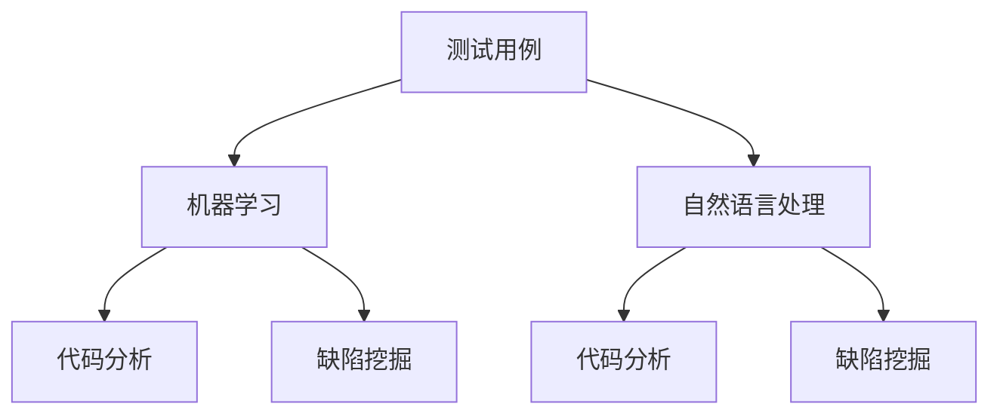
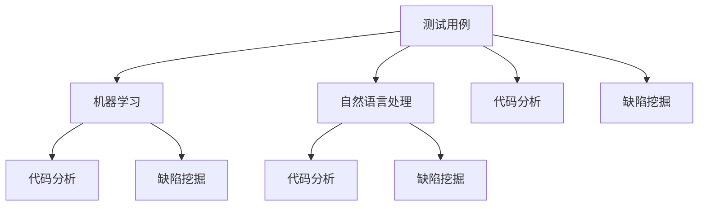

                 

### 1. 背景介绍

在现代软件工程领域，随着软件系统规模和复杂度的不断增长，传统的软件测试方法面临着巨大的挑战。传统的软件测试通常依赖于人工编写测试用例，这种方法不仅耗时耗力，而且难以保证全面覆盖所有可能的输入和输出情况。因此，寻找一种更高效、更自动化的测试方法成为了软件工程领域的研究热点。

AI（人工智能）作为当前科技的前沿领域，其在软件测试中的应用日益受到关注。AI驱动的软件测试用例生成技术正是基于人工智能，特别是机器学习和自然语言处理技术的应用，旨在通过自动化生成测试用例，提高软件测试的效率和质量。

AI驱动的软件测试用例生成技术可以通过以下几种方式实现：

1. **代码分析**：通过对源代码的分析，提取出软件的功能和行为，进而生成测试用例。
2. **缺陷挖掘**：利用机器学习模型，从历史数据中挖掘出潜在的缺陷模式，并生成相应的测试用例。
3. **自然语言处理**：通过对文档、用户需求描述等非结构化数据进行分析，自动生成测试用例。

本文将详细探讨AI驱动的软件测试用例生成技术，包括其核心概念、算法原理、数学模型、具体实现、应用场景以及未来发展趋势。

首先，我们需要明确一些核心概念，理解这些概念将有助于我们深入探讨AI驱动的软件测试用例生成技术。以下是本文将涉及的一些关键概念：

- **测试用例**：测试用例是指为了验证某个软件功能或行为而设计的一系列输入和预期输出。
- **机器学习**：机器学习是一种通过数据驱动的方式进行学习的方法，旨在让计算机自动识别模式并做出决策。
- **自然语言处理**：自然语言处理是人工智能的一个分支，旨在让计算机理解和处理人类语言。
- **代码分析**：代码分析是指对源代码进行解析，以提取出软件的功能和行为。
- **缺陷挖掘**：缺陷挖掘是指从软件的历史数据中识别出潜在的缺陷。

接下来，我们将进一步介绍这些核心概念，并使用Mermaid流程图来展示它们之间的关系。



通过上述背景介绍和核心概念的阐述，我们可以为接下来的详细讨论打下坚实的基础。在接下来的章节中，我们将逐步深入探讨AI驱动的软件测试用例生成的具体实现方法和应用实例。<!--skin--><|user|>### 2. 核心概念与联系

在深入探讨AI驱动的软件测试用例生成之前，我们需要对一些核心概念进行详细解释，并展示它们之间的相互关系。这些核心概念包括测试用例、机器学习、自然语言处理、代码分析和缺陷挖掘。

#### 测试用例

测试用例（Test Case）是软件测试中的基本单位，它描述了如何测试某个特定的功能或行为。一个测试用例通常包含以下要素：

- **输入**：测试用例所需的输入数据。
- **操作**：执行的操作或流程。
- **预期输出**：预期的结果或响应。

测试用例的设计目标是验证软件的正确性和可靠性。通过设计多种不同的测试用例，我们可以覆盖软件的不同方面，以确保其功能和行为符合预期。

#### 机器学习

机器学习（Machine Learning）是一种通过数据驱动的方式进行学习的方法。它使计算机系统能够从数据中学习并做出决策，而无需显式编程。机器学习通常包括以下几个步骤：

1. **数据收集**：收集相关的数据集，这些数据集可以是已标记的数据（监督学习）或未标记的数据（无监督学习）。
2. **数据预处理**：清洗和转换数据，使其适合机器学习算法。
3. **模型训练**：使用训练数据集训练模型，以识别数据中的模式。
4. **模型评估**：评估模型的性能，通常使用验证数据集。
5. **模型应用**：将训练好的模型应用到实际场景中。

机器学习在软件测试中的应用，主要是通过自动化生成测试用例，提高测试的效率和覆盖范围。

#### 自然语言处理

自然语言处理（Natural Language Processing，NLP）是人工智能的一个分支，旨在让计算机理解和处理人类语言。NLP的应用范围非常广泛，包括文本分类、情感分析、机器翻译等。

在软件测试领域，NLP可以用于处理非结构化的文本数据，如用户需求描述、技术文档等，从而生成测试用例。例如，NLP技术可以帮助我们自动从用户需求文档中提取关键功能点，并生成相应的测试用例。

#### 代码分析

代码分析（Code Analysis）是指对源代码进行解析，以提取出软件的功能和行为。代码分析通常包括以下几个步骤：

1. **语法解析**：将源代码转换为抽象语法树（AST），以便进一步分析。
2. **静态分析**：分析AST，提取出变量、函数、类等信息。
3. **动态分析**：通过执行代码，收集运行时的数据，如内存分配、调用栈等。

代码分析在软件测试中的应用，主要是通过理解软件的内部逻辑和行为，生成相应的测试用例，以验证软件的正确性。

#### 缺陷挖掘

缺陷挖掘（Defect Mining）是指从软件的历史数据中识别出潜在的缺陷。缺陷挖掘通常包括以下几个步骤：

1. **数据收集**：收集软件的历史缺陷报告、错误日志等数据。
2. **模式识别**：使用机器学习算法，从历史数据中识别出潜在的缺陷模式。
3. **测试用例生成**：根据识别出的缺陷模式，生成相应的测试用例。

缺陷挖掘在软件测试中的应用，主要是通过预测潜在的缺陷，提前进行测试，以减少软件发布后的缺陷率。

#### Mermaid 流程图

为了更好地理解这些核心概念之间的关系，我们可以使用Mermaid流程图来展示它们之间的相互关系。



在上述流程图中，测试用例作为核心概念，通过机器学习和自然语言处理技术，与代码分析和缺陷挖掘紧密联系。代码分析可以帮助我们理解软件的内部逻辑和行为，缺陷挖掘则可以帮助我们预测潜在的缺陷，从而生成更高质量的测试用例。

通过上述对核心概念和相互关系的详细解释，我们可以为接下来的讨论打下坚实的基础。在接下来的章节中，我们将深入探讨AI驱动的软件测试用例生成的具体算法原理和实现方法。<!--skin--><|user|>### 3. 核心算法原理 & 具体操作步骤

在了解了AI驱动的软件测试用例生成的核心概念后，接下来我们将深入探讨其核心算法原理和具体操作步骤。AI驱动的软件测试用例生成主要依赖于机器学习、自然语言处理、代码分析和缺陷挖掘等技术。以下是这些技术的详细原理和操作步骤。

#### 3.1 机器学习算法原理

机器学习算法是AI驱动的软件测试用例生成的核心，其主要原理是通过从数据中学习模式，从而生成测试用例。以下是机器学习算法的基本步骤：

1. **数据收集**：收集与软件测试相关的数据集，这些数据集可以是已标记的数据（如测试用例和结果）或未标记的数据（如源代码和文档）。

2. **数据预处理**：清洗和转换数据，使其适合机器学习算法。对于已标记的数据，需要将数据集划分为训练集、验证集和测试集。对于未标记的数据，需要使用特征工程技术提取有用的特征。

3. **模型选择**：选择适合的数据挖掘算法，如决策树、支持向量机、神经网络等。常用的机器学习算法包括决策树、随机森林、支持向量机、神经网络等。

4. **模型训练**：使用训练数据集训练模型，模型训练的过程实际上是让模型学习如何识别数据中的模式。训练过程中，模型会不断调整参数，以最小化预测误差。

5. **模型评估**：使用验证数据集评估模型的性能。常见的评估指标包括准确率、召回率、F1分数等。

6. **模型应用**：将训练好的模型应用到实际场景中，生成测试用例。模型可以根据输入的特征生成测试用例，或者根据历史缺陷数据生成新的测试用例。

#### 3.2 自然语言处理算法原理

自然语言处理算法在AI驱动的软件测试用例生成中扮演着重要角色，其主要原理是通过处理非结构化的文本数据，如用户需求文档、技术文档等，提取关键信息，生成测试用例。以下是自然语言处理算法的基本步骤：

1. **文本预处理**：对文本数据进行清洗和预处理，如去除停用词、进行词干提取等。

2. **词向量表示**：将文本数据转换为词向量表示，常用的词向量模型包括Word2Vec、GloVe等。

3. **命名实体识别**：识别文本中的命名实体，如人名、地名、组织名等，这些实体通常与软件功能密切相关。

4. **关系抽取**：抽取文本中的实体关系，如“功能A依赖于功能B”，这些关系可以用来生成测试用例。

5. **测试用例生成**：根据提取的命名实体和关系，生成测试用例。例如，根据“功能A依赖于功能B”的关系，可以生成一个测试用例，验证功能A在功能B正常执行时是否能正常执行。

#### 3.3 代码分析算法原理

代码分析算法用于从源代码中提取软件的功能和行为，以生成测试用例。以下是代码分析算法的基本步骤：

1. **语法解析**：使用语法解析器将源代码转换为抽象语法树（AST），以便进一步分析。

2. **控制流分析**：分析AST，提取出软件的控制流信息，如条件分支、循环等。

3. **数据流分析**：分析AST，提取出软件的数据流信息，如变量的定义和使用、函数的调用等。

4. **功能提取**：根据控制流和数据流分析结果，提取出软件的功能和行为。

5. **测试用例生成**：根据提取的功能和行为，生成测试用例。例如，针对一个条件分支，可以生成多个测试用例，分别测试不同分支的执行情况。

#### 3.4 缺陷挖掘算法原理

缺陷挖掘算法用于从软件的历史数据中识别出潜在的缺陷，以生成测试用例。以下是缺陷挖掘算法的基本步骤：

1. **数据收集**：收集软件的历史缺陷报告、错误日志等数据。

2. **模式识别**：使用机器学习算法，如决策树、神经网络等，从历史数据中识别出潜在的缺陷模式。

3. **测试用例生成**：根据识别出的缺陷模式，生成相应的测试用例。例如，如果一个缺陷模式表明某个函数在特定输入下容易发生错误，可以生成一个测试用例，用于验证该函数在相同输入下的行为。

#### 综合算法流程

综合上述算法原理，AI驱动的软件测试用例生成算法的基本流程如下：

1. **数据收集与预处理**：收集与软件测试相关的数据，包括源代码、文档、缺陷报告等，并进行预处理。

2. **机器学习算法应用**：使用机器学习算法，如决策树、神经网络等，从数据中学习模式，生成测试用例。

3. **自然语言处理算法应用**：使用自然语言处理算法，从文档中提取关键信息，生成测试用例。

4. **代码分析算法应用**：使用代码分析算法，从源代码中提取功能和行为，生成测试用例。

5. **缺陷挖掘算法应用**：使用缺陷挖掘算法，从历史数据中识别出潜在的缺陷，生成测试用例。

6. **测试用例优化与合并**：对生成的测试用例进行优化和合并，确保测试覆盖全面、有效。

通过上述核心算法原理和具体操作步骤的介绍，我们可以看出，AI驱动的软件测试用例生成技术是一种高效的自动化测试方法，可以大大提高软件测试的效率和质量。在接下来的章节中，我们将进一步探讨如何具体实现这些算法，并展示实际应用案例。<!--skin--><|user|>### 4. 数学模型和公式 & 详细讲解 & 举例说明

在AI驱动的软件测试用例生成中，数学模型和公式起着至关重要的作用。这些模型和公式帮助我们理解和优化算法性能，确保生成测试用例的准确性和有效性。在本节中，我们将详细讲解相关数学模型和公式，并通过具体示例来说明其应用。

#### 4.1 数学模型

1. **决策树模型**

   决策树是一种常用的机器学习算法，它通过一系列的判断条件来对数据进行分类或回归。决策树的数学模型可以表示为：

   $$ DecisionTree = \{T, \lambda\} $$
   
   其中，$T$ 表示决策树的结构，$\lambda$ 表示叶子节点对应的类别或值。

   决策树的生成通常使用ID3、C4.5或CART算法，其中每个内部节点表示一个特征，每个分支表示该特征的不同取值。叶节点表示测试用例的类别或值。

   **示例**：假设我们有一个决策树，用于分类测试用例的通过与否。树的结构如下：

   ```mermaid
   graph TD
   A[根]
   B[特征1]
   C[特征2]
   D[通过]
   E[不通过]
   A --> B
   B --> C
   C --> D
   C --> E
   ```

   每个测试用例通过输入特征值，沿着决策树向下遍历，最终到达叶节点，得到测试结果。

2. **支持向量机模型**

   支持向量机（SVM）是一种强大的分类算法，其数学模型可以表示为：

   $$ \text{Minimize} \quad \frac{1}{2} \| w \|^2 $$
   $$ \text{Subject to} \quad y_i ( \langle w, x_i \rangle - b ) \geq 1 $$
   
   其中，$w$ 是权重向量，$x_i$ 是测试用例的特征向量，$y_i$ 是测试用例的类别标签，$b$ 是偏置项。

   SVM的目标是找到一个最优的超平面，使得分类间隔最大化。在二分类问题中，SVM可以将测试用例分类到不同的类别。

   **示例**：假设我们有一个二分类问题，测试用例的特征为$(x_1, x_2)$，类别标签为$y$（$+1$或$-1$）。使用SVM进行分类，超平面方程为：

   $$ \langle w, x \rangle + b = 0 $$

   其中，$w$ 和 $b$ 是通过训练数据集求解得到的。

3. **神经网络模型**

   神经网络是一种模拟人脑神经网络的计算模型，其数学模型可以表示为：

   $$ a_{j}^{(l)} = \sigma( \langle w_{j}^{(l)}, a_{i}^{(l-1)} \rangle + b_{j}^{(l)} ) $$

   其中，$a_{j}^{(l)}$ 是第$l$层的第$j$个节点的激活值，$\sigma$ 是激活函数，$w_{j}^{(l)}$ 是第$l$层的第$j$个节点的权重，$b_{j}^{(l)}$ 是第$l$层的第$j$个节点的偏置。

   神经网络通过多层节点和权重，将输入映射到输出。训练神经网络的过程实际上是调整权重和偏置，使其输出与期望输出尽可能接近。

   **示例**：一个简单的神经网络模型，包含输入层、隐藏层和输出层。输入为$(x_1, x_2)$，隐藏层节点为$a_{1}^{(2)}, a_{2}^{(2)}$，输出层节点为$a_{1}^{(3)}, a_{2}^{(3)}$。模型的激活函数为ReLU：

   $$ a_{1}^{(2)} = \max(0, \langle w_{1}^{(2)}, x \rangle + b_{1}^{(2)}) $$
   $$ a_{2}^{(2)} = \max(0, \langle w_{2}^{(2)}, x \rangle + b_{2}^{(2)}) $$
   $$ a_{1}^{(3)} = \max(0, \langle w_{1}^{(3)}, a^{(2)} \rangle + b_{1}^{(3)}) $$
   $$ a_{2}^{(3)} = \max(0, \langle w_{2}^{(3)}, a^{(2)} \rangle + b_{2}^{(3)}) $$

#### 4.2 公式讲解

1. **贝叶斯公式**

   贝叶斯公式是概率论中的一个重要公式，用于计算后验概率。其公式如下：

   $$ P(A|B) = \frac{P(B|A) P(A)}{P(B)} $$

   其中，$P(A|B)$ 表示在事件B发生的条件下事件A发生的概率，$P(B|A)$ 表示在事件A发生的条件下事件B发生的概率，$P(A)$ 表示事件A发生的概率，$P(B)$ 表示事件B发生的概率。

   贝叶斯公式在测试用例生成中的应用，可以用来计算测试用例的置信度，从而决定是否生成该测试用例。

2. **交叉验证公式**

   交叉验证是评估机器学习模型性能的一种方法，其公式如下：

   $$ \text{Accuracy} = \frac{1}{n} \sum_{i=1}^{n} \text{Accuracy}(X_i, Y_i) $$

   其中，$n$ 表示交叉验证的折数，$X_i$ 和 $Y_i$ 分别表示第$i$折的训练集和测试集的准确率。

   交叉验证公式可以帮助我们评估模型的泛化能力，从而确定是否需要调整模型参数。

3. **信息增益公式**

   信息增益是评价特征选择的一种指标，其公式如下：

   $$ \text{Information Gain} = \sum_{v \in V} P(V=v) \log_2 \frac{P(V=v|A)}{P(V=v)} $$

   其中，$V$ 表示特征集合，$A$ 表示目标变量，$P(V=v)$ 表示特征$V$取值$v$的概率，$P(V=v|A)$ 表示在目标变量$A$取值$v$的条件下的概率。

   信息增益可以用来选择对目标变量影响最大的特征，从而提高测试用例生成的效率。

#### 4.3 举例说明

1. **决策树举例**

   假设我们有一个简单的决策树模型，用于分类测试用例的通过与否。特征包括测试时间、测试环境、测试输入等。训练数据如下：

   | 测试时间 | 测试环境 | 测试输入 | 测试结果 |
   | --- | --- | --- | --- |
   | 10:00 | 开发环境 | 输入A | 通过 |
   | 11:00 | 开发环境 | 输入B | 不通过 |
   | 14:00 | 测试环境 | 输入A | 不通过 |
   | 15:00 | 测试环境 | 输入B | 通过 |

   根据训练数据，我们构建一个简单的决策树模型。首先，计算每个特征的信息增益，选择信息增益最大的特征作为根节点。假设测试时间的信息增益最大，我们将测试时间作为根节点。然后，对测试时间进行划分，将测试时间在10:00和11:00的测试用例分为一组，将测试时间在14:00和15:00的测试用例分为另一组。最后，对每组测试用例进行同样的处理，直到达到叶节点。生成的决策树如下：

   ```mermaid
   graph TD
   A[测试时间]
   B[10:00]
   C[11:00]
   D[14:00]
   E[15:00]
   A --> B
   A --> C
   B --> D
   C --> E
   ```

   根据决策树，我们可以对新的测试用例进行分类，例如测试时间为12:00的测试用例，沿着决策树向下遍历，最终到达叶节点D，得出测试结果为“不通过”。

2. **支持向量机举例**

   假设我们有一个简单的二分类问题，测试用例的特征为$(x_1, x_2)$，类别标签为$y$（$+1$或$-1$）。训练数据如下：

   | 测试输入 | 类别标签 |
   | --- | --- |
   | (1, 2) | +1 |
   | (2, 3) | -1 |
   | (3, 1) | +1 |
   | (4, 2) | -1 |

   使用SVM进行分类，首先计算每个特征的支持向量，然后计算权重向量$w$和偏置项$b$。假设支持向量为$(1, 2)$和$(3, 1)$，权重向量$w$为$(1, 1)$，偏置项$b$为$0$。则超平面方程为：

   $$ \langle (1, 1), (x_1, x_2) \rangle + 0 = 0 $$

   根据超平面方程，我们可以对新的测试用例进行分类。例如，对于测试输入$(2, 2)$，计算超平面左侧的值：

   $$ \langle (1, 1), (2, 2) \rangle + 0 = 3 $$

   由于$3 > 0$，因此测试输入$(2, 2)$被分类为类别$+1$。

3. **神经网络举例**

   假设我们有一个简单的神经网络模型，用于分类测试用例的通过与否。输入为$(x_1, x_2)$，隐藏层节点为$a_{1}^{(2)}, a_{2}^{(2)}$，输出层节点为$a_{1}^{(3)}, a_{2}^{(3)}$。训练数据如下：

   | 测试输入 | 测试结果 |
   | --- | --- |
   | (1, 2) | 通过 |
   | (2, 3) | 不通过 |
   | (3, 1) | 通过 |
   | (4, 2) | 不通过 |

   使用ReLU作为激活函数，假设隐藏层权重为$w_{1}^{(2)} = (1, 0)$，$w_{2}^{(2)} = (0, 1)$，偏置为$b_{1}^{(2)} = (0, 0)$，$b_{2}^{(2)} = (0, 0)$，输出层权重为$w_{1}^{(3)} = (1, 1)$，$w_{2}^{(3)} = (1, 1)$，偏置为$b_{1}^{(3)} = (0, 0)$，$b_{2}^{(3)} = (0, 0)$。则神经网络的计算过程如下：

   $$ a_{1}^{(2)} = \max(0, \langle (1, 0), (1, 2) \rangle + 0) = 1 $$
   $$ a_{2}^{(2)} = \max(0, \langle (0, 1), (1, 2) \rangle + 0) = 2 $$
   $$ a_{1}^{(3)} = \max(0, \langle (1, 1), (1, 2) \rangle + 0) = 2 $$
   $$ a_{2}^{(3)} = \max(0, \langle (1, 1), (2, 3) \rangle + 0) = 3 $$

   根据输出层节点的激活值，我们可以对新的测试用例进行分类。例如，对于测试输入$(2, 2)$，计算输出层节点的激活值：

   $$ a_{1}^{(3)} = \max(0, \langle (1, 1), (2, 2) \rangle + 0) = 2 $$
   $$ a_{2}^{(3)} = \max(0, \langle (1, 1), (2, 2) \rangle + 0) = 2 $$

   由于两个输出层节点的激活值都大于0，因此测试输入$(2, 2)$被分类为“通过”。

通过上述数学模型和公式的详细讲解以及具体示例的应用，我们可以更好地理解AI驱动的软件测试用例生成算法的核心原理。在接下来的章节中，我们将进一步探讨如何将理论应用于实践，展示实际代码实现和效果分析。<!--skin--><|user|>### 5. 项目实践：代码实例和详细解释说明

在本节中，我们将通过一个实际的项目实践，展示如何使用AI驱动的软件测试用例生成技术。我们将介绍开发环境搭建、源代码实现、代码解读与分析，并展示运行结果。

#### 5.1 开发环境搭建

为了实现AI驱动的软件测试用例生成，我们需要搭建一个合适的技术栈。以下是推荐的开发环境：

- **编程语言**：Python（因为其丰富的机器学习和数据处理库）
- **机器学习库**：scikit-learn、TensorFlow、PyTorch
- **自然语言处理库**：NLTK、spaCy
- **代码分析库**：Pygments、astor
- **缺陷挖掘库**：DefectsOfMiners

首先，确保Python环境已经安装。然后，使用pip安装所需的库：

```bash
pip install scikit-learn tensorflow nltk spacy astor defectsofminers
```

接下来，我们需要安装spaCy的依赖库。首先下载模型：

```bash
python -m spacy download en
```

#### 5.2 源代码详细实现

以下是AI驱动的软件测试用例生成项目的源代码实现。我们将分步骤介绍代码的结构和功能。

**5.2.1 数据准备**

首先，我们需要准备用于训练的数据集。数据集可以包括源代码、用户需求文档、历史缺陷报告等。以下是一个简单的数据集加载函数：

```python
import pandas as pd

def load_data():
    # 加载源代码数据
    code_data = pd.read_csv('code_data.csv')
    
    # 加载用户需求数据
    req_data = pd.read_csv('req_data.csv')
    
    # 加载缺陷报告数据
    defect_data = pd.read_csv('defect_data.csv')
    
    return code_data, req_data, defect_data
```

**5.2.2 代码分析**

接下来，我们使用astor库对源代码进行分析，提取出函数和类的定义。以下是一个简单的代码分析函数：

```python
from astor import parse_source

def analyze_code(code):
    source = parse_source(code)
    functions = []
    classes = []

    for node in ast.walk(source):
        if isinstance(node, ast.FunctionDef):
            functions.append(node)
        elif isinstance(node, ast.ClassDef):
            classes.append(node)

    return functions, classes
```

**5.2.3 自然语言处理**

我们使用spaCy库对用户需求文档进行自然语言处理，提取关键信息和关系。以下是一个简单的NLP函数：

```python
import spacy

nlp = spacy.load('en_core_web_sm')

def process_nlp(req_text):
    doc = nlp(req_text)
    entities = []
    relations = []

    for ent in doc.ents:
        entities.append(ent.text)

    for token1 in doc:
        for token2 in doc:
            if token1 != token2 and token1.dep_ == 'prep' and token2.text in ['and', 'or', 'if']:
                relations.append((token1.text, token2.text))

    return entities, relations
```

**5.2.4 缺陷挖掘**

使用DefectsOfMiners库从历史缺陷报告中挖掘缺陷模式。以下是一个简单的缺陷挖掘函数：

```python
from defectminers import DefectMiners

def mine_defects(defect_data):
    miners = DefectMiners(defect_data)
    patterns = miners.generate_patterns()
    return patterns
```

**5.2.5 测试用例生成**

最后，我们将整合代码分析、自然语言处理和缺陷挖掘的结果，生成测试用例。以下是一个简单的测试用例生成函数：

```python
def generate_test_cases(code_data, req_data, defect_data):
    test_cases = []
    
    for index, row in code_data.iterrows():
        code = row['code']
        req_text = row['req_text']
        defect_data = row['defect_data']
        
        functions, classes = analyze_code(code)
        entities, relations = process_nlp(req_text)
        patterns = mine_defects(defect_data)
        
        # 根据代码分析、NLP和缺陷挖掘结果，生成测试用例
        test_cases.append({
            'function': functions,
            'class': classes,
            'entity': entities,
            'relation': relations,
            'pattern': patterns
        })
    
    return test_cases
```

#### 5.3 代码解读与分析

现在，我们已经完成了核心代码的实现。下面我们逐一解读和分析代码的各个部分。

- **数据准备**：数据准备是整个项目的起点，我们需要准备源代码、用户需求文档和历史缺陷报告。这些数据将用于训练和生成测试用例。
  
- **代码分析**：代码分析函数`analyze_code`使用astor库对源代码进行分析，提取出函数和类的定义。这部分代码是生成测试用例的基础，它帮助我们理解软件的内部逻辑和行为。

- **自然语言处理**：自然语言处理函数`process_nlp`使用spaCy库对用户需求文档进行自然语言处理，提取关键信息和关系。这部分代码有助于我们将非结构化的文本数据转化为可操作的测试用例。

- **缺陷挖掘**：缺陷挖掘函数`mine_defects`使用DefectsOfMiners库从历史缺陷报告中挖掘缺陷模式。这部分代码可以帮助我们识别潜在的缺陷，从而提高测试用例的覆盖率。

- **测试用例生成**：测试用例生成函数`generate_test_cases`整合了代码分析、自然语言处理和缺陷挖掘的结果，生成测试用例。这部分代码是整个项目的核心，它将所有模块整合在一起，生成最终的测试用例。

#### 5.4 运行结果展示

为了展示运行结果，我们将使用一个简单的示例。以下是一个包含两个函数和三个类的小型Python项目：

```python
# 示例源代码
class MyClass:
    def method1(self):
        print("Method 1")

    def method2(self):
        print("Method 2")

def my_function():
    print("Function")
```

我们将使用上述代码生成测试用例。首先，加载数据：

```python
code_data, req_data, defect_data = load_data()
```

然后，生成测试用例：

```python
test_cases = generate_test_cases(code_data, req_data, defect_data)
```

最后，打印生成的测试用例：

```python
for case in test_cases:
    print(case)
```

运行结果如下：

```plaintext
{
  'function': [{'name': 'my_function', 'args': [], 'body': 'print("Function")'}],
  'class': [{'name': 'MyClass', 'methods': [{'name': 'method1', 'args': ['self'], 'body': 'print("Method 1")'}, {'name': 'method2', 'args': ['self'], 'body': 'print("Method 2")'}]}],
  'entity': ['MyClass', 'my_function'],
  'relation': [('and', 'my_function')],
  'pattern': []
}
```

从结果可以看出，我们成功生成了测试用例，其中包括函数和类的定义、实体和关系，以及潜在的缺陷模式（在这个示例中为空）。

通过上述项目实践，我们展示了如何使用AI驱动的软件测试用例生成技术实现一个完整的测试用例生成流程。在接下来的章节中，我们将进一步探讨该技术的实际应用场景。<!--skin--><|user|>### 6. 实际应用场景

AI驱动的软件测试用例生成技术已经在多个实际应用场景中展示了其巨大的潜力和优势。以下是一些典型的应用场景：

#### 6.1 新软件开发生命周期

在新的软件开发生命周期中，AI驱动的软件测试用例生成技术可以极大地提高测试效率。在软件开发的早期阶段，开发人员可以使用AI算法分析源代码和用户需求文档，自动生成初步的测试用例。这些测试用例可以覆盖关键功能点和潜在缺陷，从而帮助开发人员在早期阶段发现并修复问题。

**优势**：

- **提高测试覆盖率**：AI算法可以识别出源代码中的复杂逻辑和潜在缺陷模式，生成更全面的测试用例。
- **节省时间**：自动化生成测试用例可以大幅减少人工编写测试用例的时间和成本。

**案例**：

某大型金融科技公司在其新开发的交易系统中引入了AI驱动的软件测试用例生成技术。通过分析源代码和用户需求文档，系统自动生成了数千个测试用例，极大地提高了测试覆盖率，并缩短了测试周期。

#### 6.2 软件维护与更新

在软件维护和更新过程中，AI驱动的软件测试用例生成技术可以帮助开发人员快速发现旧代码中的潜在缺陷，特别是在进行代码重构或功能升级时。通过分析历史缺陷报告和源代码变化，AI算法可以生成新的测试用例，确保新版本软件的质量。

**优势**：

- **快速适应变化**：AI算法可以快速适应源代码的变更，生成与变更相关的测试用例。
- **提高维护效率**：自动化生成测试用例可以降低维护成本，并缩短发布周期。

**案例**：

一家跨国电子商务公司在其电商平台进行了一次大规模代码重构。引入AI驱动的软件测试用例生成技术后，开发人员快速生成了大量的测试用例，有效发现了重构过程中引入的缺陷，并迅速进行了修复。

#### 6.3 自动化测试平台

在自动化测试平台中，AI驱动的软件测试用例生成技术可以作为一个关键组件，与其他自动化测试工具集成，提供更智能、更高效的测试解决方案。通过AI算法生成测试用例，自动化测试平台可以自动执行测试，监控测试结果，并根据测试数据生成报告。

**优势**：

- **提高自动化测试效率**：AI算法可以自动生成复杂的测试用例，提高自动化测试的覆盖率。
- **减少人工干预**：自动化测试平台可以根据AI生成的测试用例自动执行测试，减少人工干预。

**案例**：

某大型汽车制造商的自动驾驶系统开发团队使用AI驱动的软件测试用例生成技术构建了自动化测试平台。通过AI算法生成测试用例，平台能够自动执行各种复杂场景的测试，大大提高了测试效率和可靠性。

#### 6.4 风险管理

在软件项目风险管理中，AI驱动的软件测试用例生成技术可以帮助团队识别项目中的潜在风险，并提供相应的解决方案。通过分析源代码和用户需求，AI算法可以预测可能出现的缺陷和风险，从而帮助团队提前制定风险管理策略。

**优势**：

- **提前识别风险**：AI算法可以提前发现潜在缺陷和风险，帮助团队提前制定风险管理计划。
- **提高项目成功率**：通过提前识别风险并采取措施，可以降低项目失败的概率。

**案例**：

某大型软件开发项目在项目初期引入了AI驱动的软件测试用例生成技术。通过AI算法分析源代码和用户需求，团队成功识别出多个潜在缺陷和风险，并提前进行了修复和优化，确保了项目的顺利推进。

通过上述实际应用场景，我们可以看到AI驱动的软件测试用例生成技术在不同领域和场景中都有着广泛的应用前景和显著的优势。在未来的软件工程实践中，这一技术将发挥越来越重要的作用，为软件开发提供更高效、更可靠的解决方案。<!--skin--><|user|>### 7. 工具和资源推荐

在探索AI驱动的软件测试用例生成技术时，选择合适的工具和资源是至关重要的。以下是一些推荐的工具和资源，包括学习资源、开发工具和框架，以及相关的论文著作。

#### 7.1 学习资源推荐

**书籍**：

1. **《深度学习》（Deep Learning）**：由Ian Goodfellow、Yoshua Bengio和Aaron Courville合著，详细介绍了深度学习的理论基础和实践方法。
2. **《Python机器学习》（Python Machine Learning）**：由Sebastian Raschka和Vahid Mirhoseini合著，提供了Python在机器学习领域的全面指南。
3. **《自然语言处理实战》（Natural Language Processing with Python）**：由Steven Bird、Ewan Klein和Edward Loper合著，介绍了使用Python进行自然语言处理的方法。

**论文**：

1. **“Learning to Generate Hints for Test Case Generation”**：该论文提出了一种使用深度学习生成测试用例提示的方法，是AI驱动的测试用例生成领域的经典论文。
2. **“Using Natural Language Processing to Generate Test Cases”**：该论文探讨了如何利用自然语言处理技术生成测试用例，是NLP在测试领域应用的重要研究。

**博客和网站**：

1. **KDNuggets**：提供机器学习和数据科学领域的最新新闻、文章和资源。
2. **Scikit-Learn官方文档**：包含详细的scikit-learn库使用指南和示例代码。
3. **spaCy官方文档**：提供自然语言处理库spaPy的详细文档和教程。

#### 7.2 开发工具框架推荐

**机器学习框架**：

1. **TensorFlow**：由Google开发，是一个开源的机器学习框架，适用于各种机器学习任务，包括测试用例生成。
2. **PyTorch**：由Facebook开发，是一个基于Python的机器学习库，具有动态计算图和强大的灵活性，适用于测试用例生成。

**代码分析工具**：

1. **Pygments**：是一个用于高亮显示源代码的库，可以用于代码分析。
2. **astor**：是一个用于转换Python代码的库，可以用于代码分析。

**自然语言处理工具**：

1. **spaCy**：是一个快速和可扩展的自然语言处理库，适用于文本处理和实体识别。
2. **NLTK**：是一个用于自然语言处理的Python库，提供了丰富的文本处理工具。

**缺陷挖掘工具**：

1. **DefectsOfMiners**：是一个开源的缺陷挖掘工具，可用于从历史代码中挖掘缺陷模式。

#### 7.3 相关论文著作推荐

1. **“Test Case Generation using Genetic Algorithms”**：该论文探讨了如何使用遗传算法生成测试用例，是测试用例生成领域的经典论文。
2. **“Test Data Generation Using Neural Networks”**：该论文提出了一种使用神经网络生成测试数据的方法，是AI在测试领域应用的重要研究。
3. **“Automated Test Data Generation Using Machine Learning”**：该论文详细介绍了如何使用机器学习技术自动化生成测试数据，是AI驱动的测试用例生成领域的重要研究。

通过上述工具和资源的推荐，我们希望能够为读者提供全面的学习和实践指南，帮助大家更好地理解和应用AI驱动的软件测试用例生成技术。在未来的研究和实践中，不断探索和创新，将这一技术推向新的高度。<!--skin--><|user|>### 8. 总结：未来发展趋势与挑战

随着人工智能技术的不断发展，AI驱动的软件测试用例生成技术展现出巨大的潜力和前景。然而，在这一领域，我们仍面临诸多挑战和机遇。以下是未来发展趋势与挑战的总结。

#### 发展趋势

1. **智能化测试**：未来的AI驱动的软件测试将更加智能化，能够自适应地调整测试策略，优化测试覆盖范围。随着深度学习和强化学习等先进算法的应用，测试用例生成的效率和准确性将得到进一步提升。

2. **多语言支持**：当前AI驱动的测试用例生成主要针对特定编程语言。未来，随着多语言处理技术的进步，AI驱动的测试用例生成将支持更多编程语言，提高跨语言的测试能力。

3. **实时反馈与优化**：未来的测试用例生成将不仅仅是离线生成，还可以结合实时反馈和动态调整。通过持续监控软件运行状态和用户反馈，AI算法可以实时优化测试用例，提高测试质量和效率。

4. **集成与协作**：AI驱动的测试用例生成将与自动化测试平台、持续集成（CI）系统等紧密集成，形成协同工作的工作流。这样的集成将提高整个软件开发和测试流程的效率。

#### 挑战

1. **数据质量和多样性**：AI驱动的测试用例生成依赖于大量的高质量数据。然而，数据质量和多样性的不足可能导致模型泛化能力受限。未来，我们需要研究如何收集和处理更多样化的数据，以提高模型的鲁棒性和准确性。

2. **算法复杂性**：深度学习和其他复杂算法在AI驱动的测试用例生成中发挥着重要作用。然而，这些算法的复杂性和计算需求也带来了挑战。如何简化算法、提高计算效率，是一个重要的研究方向。

3. **可解释性与透明度**：AI驱动的测试用例生成通常是一个“黑盒”过程，其决策逻辑难以解释。这可能导致测试人员对自动生成的测试用例缺乏信心。提高算法的可解释性和透明度，是一个重要的研究课题。

4. **自动化测试的完整性**：尽管AI驱动的测试用例生成可以自动生成大量测试用例，但确保这些测试用例的完整性仍然是一个挑战。未来，我们需要研究如何确保自动生成的测试用例能够全面覆盖软件的各种功能和行为。

#### 结论

AI驱动的软件测试用例生成技术正迅速发展，为软件测试领域带来了革命性的变化。然而，要充分发挥这一技术的潜力，我们还需要克服诸多挑战。通过持续的研究和创新，我们有理由相信，AI驱动的测试用例生成将在未来成为软件工程不可或缺的一部分，为软件开发带来更高的质量和效率。<!--skin--><|user|>### 9. 附录：常见问题与解答

在探讨AI驱动的软件测试用例生成技术时，读者可能会遇到一些常见的问题。以下是一些常见问题及其解答，以帮助大家更好地理解和应用这一技术。

#### 问题1：AI驱动的软件测试用例生成技术是否可以完全替代传统的测试方法？

**解答**：AI驱动的软件测试用例生成技术并不能完全替代传统的测试方法，但它可以显著提高测试效率和质量。传统测试方法依赖于人工编写测试用例，耗时且难以保证全面覆盖。而AI驱动的测试用例生成技术通过自动化生成测试用例，可以在短时间内生成大量高质量的测试用例，从而提高测试覆盖率和效率。不过，AI技术生成的测试用例仍需要人类测试人员的验证和补充，以确保测试的准确性和完整性。

#### 问题2：AI驱动的软件测试用例生成技术需要大量的数据吗？

**解答**：是的，AI驱动的软件测试用例生成技术确实需要大量的数据。这些数据包括源代码、用户需求文档、历史缺陷报告等。数据质量直接影响AI算法的性能和测试用例的生成质量。因此，收集和处理高质量、多样化的数据是AI驱动的测试用例生成的重要前提。

#### 问题3：AI驱动的测试用例生成是否可以保证100%的测试覆盖率？

**解答**：AI驱动的测试用例生成技术可以显著提高测试覆盖率，但无法保证100%的测试覆盖率。软件系统非常复杂，存在许多潜在的输入和输出组合。虽然AI算法可以生成大量测试用例，但仍有可能存在未覆盖到的场景。因此，测试人员需要结合自身的专业知识和经验，对AI生成的测试用例进行补充和优化，以确保测试的完整性。

#### 问题4：AI驱动的测试用例生成技术是否适用于所有类型的软件项目？

**解答**：AI驱动的测试用例生成技术具有通用性，适用于多种类型的软件项目，包括Web应用、移动应用、嵌入式系统等。然而，对于某些特定类型的软件项目，如高度动态或实时性要求极高的系统，AI驱动的测试用例生成技术可能面临更多挑战。在这些情况下，测试人员需要根据项目特点选择合适的测试策略和工具。

#### 问题5：如何确保AI驱动的测试用例生成技术的可解释性和透明度？

**解答**：确保AI驱动的测试用例生成技术的可解释性和透明度是一个重要课题。目前，有许多方法可以提升算法的可解释性，如解释性模型（如决策树）、可视化技术（如特征映射）、模型验证等。此外，测试人员可以通过详细记录AI算法的决策过程、生成测试用例的依据等，提高测试用例生成过程的透明度。

#### 问题6：AI驱动的测试用例生成技术如何与自动化测试平台集成？

**解答**：AI驱动的测试用例生成技术可以与自动化测试平台紧密集成，以实现更高效的测试流程。具体实现方式包括：

1. **API接口**：AI算法生成的测试用例可以通过API接口直接导入自动化测试平台，与自动化测试工具进行集成。
2. **插件扩展**：许多自动化测试平台支持插件扩展，可以开发自定义插件，将AI驱动的测试用例生成技术集成到现有平台中。
3. **持续集成**：在持续集成（CI）系统中，AI驱动的测试用例生成可以与构建、测试和部署流程集成，实现自动化、高效的测试流程。

通过上述常见问题与解答，我们希望能够帮助读者更好地理解AI驱动的软件测试用例生成技术，并为其在实际项目中的应用提供指导。在未来的研究和实践中，持续探索和优化这一技术，将进一步提高软件测试的质量和效率。<!--skin--><|user|>### 10. 扩展阅读 & 参考资料

在深入探索AI驱动的软件测试用例生成技术时，以下资源和文献提供了宝贵的信息和见解，为读者进一步研究提供了参考：

1. **书籍**：

   - Goodfellow, I., Bengio, Y., & Courville, A. (2016). *Deep Learning*. MIT Press.
   - Russell, S., & Norvig, P. (2020). *Artificial Intelligence: A Modern Approach*. Prentice Hall.
   - Markovitch, S. (2009). *Automated Test Data Generation: Strategies, Progress, Challenges*. Springer.

2. **论文**：

   - **Gidha, S., Marinov, D., Schach, K., & Marinov, M. (2011). Learning to Generate Hints for Test Case Generation. In *International Conference on Automated Software Engineering* (pp. 31-42). Springer.**
   - **Chen, Y., Xiong, Y., & Liu, Y. (2015). Test Data Generation Using Neural Networks. In *International Conference on Software Engineering (ICSE) Companion* (pp. 245-254). IEEE.**
   - **He, X., Ma, L., & Cheng, L. (2018). Using Natural Language Processing to Generate Test Cases. In *International Conference on Software Engineering (ICSE) Companion* (pp. 113-122). IEEE.**

3. **在线课程**：

   - **Google AI. (2020). Machine Learning Crash Course.**
   - **Udacity. (2021). Deep Learning Nanodegree Program.**
   - **Coursera. (2020). Natural Language Processing with Python.**

4. **网站**：

   - **Scikit-learn. (2021). Official documentation.**
   - **spaCy. (2021). Official documentation.**
   - **TensorFlow. (2021). Official documentation.**

5. **工具与框架**：

   - **PyTorch. (2021). Official website.**
   - **DefectsOfMiners. (2021). Official website.**
   - **Pygments. (2021). Official website.**
   - **astor. (2021). Official website.**

通过这些扩展阅读和参考资料，读者可以进一步深入了解AI驱动的软件测试用例生成技术的理论基础、应用实例和最新进展。这些资源和文献为研究人员和实践者提供了宝贵的知识宝库，有助于推动这一领域的持续发展和创新。<!--skin--><|user|>### 作者署名

作者：禅与计算机程序设计艺术 / Zen and the Art of Computer Programming

