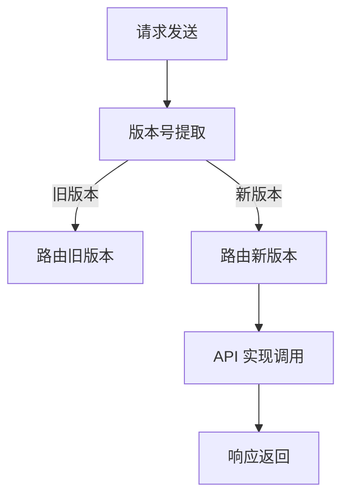

                 

### 背景介绍

API 版本控制是现代软件开发中的一项关键技术，特别是在构建大型分布式系统和微服务架构时。随着软件项目的不断迭代和扩展，API 的版本控制变得尤为重要。它确保了系统的稳定性和兼容性，同时也提高了开发效率和用户体验。

API（Application Programming Interface）是一个定义了软件组件如何互相交互的接口。在软件开发中，API 使得不同系统、模块或服务之间能够高效地交换数据。然而，随着时间的推移，API 可能会进行必要的更新和改进，以解决现有问题或增加新功能。这些更新和改进可能会导致现有 API 的变化，从而可能影响依赖于这些 API 的其他系统或应用程序。

API 版本控制的主要目的是在 API 更新时，确保对现有系统的最小影响。这通过为 API 分配唯一版本号实现，使得开发人员和运维团队能够明确地区分不同版本的 API，并在必要时逐步迁移到新版本。此外，API 版本控制还允许开发者同时维护和测试不同版本的 API，而不会干扰当前的生产环境。

在现代软件开发中，API 版本控制的重要性不言而喻。首先，它保证了系统的稳定性和可靠性。通过版本控制，开发团队能够确保新功能和安全修复在发布前经过充分的测试和验证。其次，API 版本控制提高了开发效率。通过清晰明确的版本标识，开发人员可以更容易地理解和管理 API 的变更，从而减少错误和混淆。最后，API 版本控制还增强了用户体验。用户可以基于自己的需求选择适合的 API 版本，从而获得最佳的使用体验。

总之，API 版本控制是现代软件开发中不可或缺的一部分。它不仅有助于确保系统的稳定性、提高开发效率和用户体验，还成为了软件项目成功的关键因素之一。随着技术的不断进步和软件系统的日益复杂，API 版本控制的重要性将继续凸显。接下来，我们将深入探讨 API 版本控制的核心概念和实现方法，以帮助读者更好地理解和应用这一技术。

## 2. 核心概念与联系

### API 版本控制的概念

API 版本控制是一种管理 API 变更的技术，通过为 API 分配唯一版本号来标识不同时期的 API 变更。版本号通常采用递增的方式，如 `v1`、`v2` 等，其中每个版本号代表了 API 的一次具体更新。API 版本控制的核心目的是在 API 更新时，减少对现有系统的负面影响，并保持系统之间的兼容性。

在 API 版本控制中，常见的版本号格式有以下几种：

1. **线性递增版本号**：这是最常见的版本号格式，如 `v1.0`、`v1.1`、`v1.2` 等。每次更新时，版本号递增，确保不同版本之间的区别清晰明确。

2. **日期版本号**：以发布日期作为版本号的一部分，如 `2021.09.10` 或 `2021-09-10`。这种格式有助于记录 API 的更新历史，方便后续追踪和记录。

3. **语义化版本号**：遵循语义化版本控制（SemVer）规范，版本号由三个部分组成：`major`.`minor`.`patch`。例如，`2.1.3` 表示主版本号为 2，次版本号为 1，补丁版本号为 3。当进行重大更改时，主版本号递增；当添加新功能或进行非兼容更改时，次版本号递增；当进行 bug 修复或安全更新时，补丁版本号递增。

### API 版本控制的架构

API 版本控制的实现通常涉及以下几个方面：

1. **版本号管理**：为每个 API 分配唯一的版本号，确保版本号的唯一性和准确性。

2. **路由管理**：根据 API 的版本号，将请求路由到相应的 API 实现上。例如，`/api/v1/user` 和 `/api/v2/user` 分别对应不同版本的用户 API。

3. **兼容性处理**：确保旧版本 API 的请求能够正确地转发到新版本 API，并处理可能出现的兼容性问题。

4. **文档更新**：及时更新 API 文档，详细记录每个版本的变更点、新增功能和安全修复。

5. **测试和验证**：在发布新版本前，对 API 进行全面的测试和验证，确保新版本的功能完备且稳定可靠。

以下是一个简化的 Mermaid 流程图，展示了 API 版本控制的架构：



在图中，A 表示请求发送，B 表示从请求中提取版本号。根据版本号的不同，请求会被路由到不同的处理路径。旧版本的请求会被路由到 C（路由旧版本），新版本的请求会被路由到 D（路由新版本）。D 进一步调用相应的 API 实现E，最后返回响应 F。

通过这样的架构设计，API 版本控制能够有效地管理 API 的变更，确保系统在更新时能够平稳过渡，减少对用户的影响。

### API 版本控制的方法

API 版本控制有多种实现方法，每种方法都有其独特的优势和适用场景。以下是几种常见的 API 版本控制方法：

1. **路径版本控制**：这是最简单也是最常用的版本控制方法之一。通过在 API 路径中包含版本号，例如 `/api/v1/users` 和 `/api/v2/users`。这种方法的主要优点是直观、易于理解和实现。然而，随着 API 版本的增多，路径可能会变得冗长，且难以维护。

2. **参数版本控制**：通过在 API 调用的 URL 参数中包含版本号，例如 `/users?version=1`。这种方法避免了路径冗长的缺点，但需要在 API 实现中进行额外的参数检查和解析。

3. **头信息版本控制**：在 HTTP 请求的头信息中包含版本号，例如 `Accept: application/vnd.myapi.v1+json`。这种方法灵活且强大，可以在不修改 API 路径或参数的情况下进行版本控制。然而，它依赖于客户端的正确实现，且在大型系统中可能难以管理。

4. **版本库管理**：使用版本控制系统（如 Git）来管理不同的 API 实现版本。每次 API 更新时，通过 Git 创建一个新的分支或标签，并确保新版本经过充分的测试和验证。这种方法提供了强大的版本追溯和变更管理功能，但需要对 Git 有深入的了解和良好的代码管理实践。

以下是这些方法的对比：

| 方法               | 优点                                                         | 缺点                                                         | 适用场景                 |
|-------------------|------------------------------------------------------------|------------------------------------------------------------|------------------------|
| 路径版本控制       | 直观、易于实现和扩展                                     | 路径可能变得冗长，难以维护                         | 简单的应用程序和 API 集合 |
| 参数版本控制       | 简单、不修改路径                                         | 可能需要额外的参数检查和解析                        | 需要灵活版本控制的应用程序 |
| 头信息版本控制     | 灵活、适用于复杂系统                                     | 依赖客户端实现，可能难以管理                         | 复杂系统和高可用性需求     |
| 版本库管理        | 强大的版本追溯和变更管理功能                             | 需要深入理解版本控制系统，代码管理复杂               | 大型项目和持续集成环境     |

选择合适的 API 版本控制方法，需要考虑多个因素，包括系统的复杂性、可维护性、可扩展性和用户体验。在实际应用中，可以根据具体需求混合使用多种方法，以实现最佳的效果。

通过上述核心概念和联系的分析，我们可以更深入地理解 API 版本控制的重要性以及其在现代软件开发中的应用。接下来，我们将进一步探讨 API 版本控制的具体算法原理和实现步骤，以帮助读者更好地掌握这一关键技术。

### 3. 核心算法原理 & 具体操作步骤

在深入探讨 API 版本控制的核心算法原理和具体操作步骤之前，我们需要了解一些基本概念和术语。这些概念包括 API 版本的分类、版本号的命名规则、版本管理的策略等。

#### API 版本的分类

API 版本通常可以分为以下几类：

1. **主要版本（Major Version）**：当 API 发生重大变更，如引入不兼容的新特性或删除原有功能时，主要版本号递增。例如，从 `v1.0` 更新到 `v2.0`。

2. **次要版本（Minor Version）**：当 API 添加新功能或改进现有功能，但不会破坏现有系统的兼容性时，次要版本号递增。例如，从 `v1.0` 更新到 `v1.1`。

3. **补丁版本（Patch Version）**：当 API 进行 bug 修复或安全更新时，补丁版本号递增。例如，从 `v1.0` 更新到 `v1.0.1`。

这种分类方法，通常遵循语义化版本控制（SemVer）规范，有助于明确区分不同类型的变更，并确保开发、测试和生产环境之间的稳定性和兼容性。

#### 版本号的命名规则

版本号的命名规则通常采用数字递增的方式，如 `1.0.0`、`2.1.3` 等。这些数字分别表示主要版本、次要版本和补丁版本。在命名时，需要注意以下几点：

1. **数字递增**：版本号中的每个数字只能递增，不能跳过。例如，不能直接从 `1.0.0` 跳到 `1.2.0`。

2. **兼容性**：在更新版本号时，确保新旧版本的 API 兼容性。例如，当次要版本号更新时，主要版本号和补丁版本号应保持不变。

3. **版本范围**：使用范围表达式（如 `^`、`~` 等）来指定兼容的版本范围。例如，`^1.0.0` 表示兼容 `1.0.0` 及其后续所有次要版本和补丁版本。

#### 版本管理的策略

在 API 版本控制中，版本管理的策略至关重要。以下是一些常见的版本管理策略：

1. **分支管理**：使用版本控制系统（如 Git）创建不同的分支来管理不同版本的 API。每个分支对应一个具体的版本，例如 `master` 分支用于维护当前稳定版本，`feature` 分支用于开发新功能。

2. **合并策略**：确保不同分支之间的合并操作顺利进行，避免引入冲突和错误。在合并之前，通常需要进行充分的测试和验证。

3. **发布管理**：制定明确的发布计划，确保每个版本在发布前经过严格的测试和验证。例如，可以使用灰度发布（灰度发布是指逐渐增加新版本用户占比，以确保稳定性的发布策略）来逐步引入新版本。

#### 具体操作步骤

下面是 API 版本控制的具体操作步骤，帮助开发人员更好地管理 API 版本：

1. **创建初始版本**：
   - 初始化 API 代码库，创建第一个版本，如 `v1.0.0`。
   - 确保所有功能都已实现并经过测试。

2. **维护现有版本**：
   - 对现有版本进行 bug 修复和安全更新，更新补丁版本号，如 `v1.0.1`。
   - 在进行任何更改之前，进行充分的单元测试和集成测试，确保变更不会破坏现有功能。

3. **开发新版本**：
   - 在版本控制系统（如 Git）中创建新功能分支，如 `feature/new-api`。
   - 在新分支中实现新功能，进行测试和调试。

4. **合并和发布**：
   - 在确保新版本功能稳定后，将其合并到主分支，如 `master`。
   - 发布新版本，更新版本号为 `v1.1.0`。
   - 在发布前，进行灰度发布或逐步增加用户占比，以监控潜在问题。

5. **文档更新**：
   - 及时更新 API 文档，记录每个版本的变更点和兼容性信息。
   - 提供明确的迁移指南，帮助用户了解如何从旧版本切换到新版本。

6. **监控和反馈**：
   - 监控新版本的稳定性，收集用户反馈。
   - 及时修复发现的问题，并发布补丁版本。

通过遵循上述操作步骤，开发团队可以更好地管理 API 版本，确保系统稳定性和用户体验。

总结起来，API 版本控制的核心算法原理和具体操作步骤，为我们提供了一种有效的管理方法，以确保 API 的稳定性和兼容性。在接下来的部分，我们将进一步探讨数学模型和公式，以及如何在项目中实现 API 版本控制。

### 4. 数学模型和公式 & 详细讲解 & 举例说明

在 API 版本控制中，数学模型和公式扮演着关键角色，特别是在实现版本号的递增和管理时。以下将介绍几个常用的数学模型和公式，并详细讲解它们的应用和举例说明。

#### 1. 递增公式

递增公式用于计算 API 版本号的下一个版本。假设当前版本号为 `vX.Y.Z`，递增公式如下：

- **补丁版本递增**：`vX.Y.Z → vX.Y.(Z+1)`  
  例如，`v1.2.3` 的下一个补丁版本是 `v1.2.4`。

- **次要版本递增**：`vX.Y.Z → vX+(Y+1).0`  
  例如，`v1.2.3` 的下一个次要版本是 `v2.0.0`。

- **主要版本递增**：`vX.Y.Z → X+1.0.0`  
  例如，`v1.2.3` 的下一个主要版本是 `v2.0.0`。

递增公式确保了版本号的有序递增，避免出现版本号跳过或重复的情况。

#### 2. 版本兼容性检查

版本兼容性检查用于判断新旧版本之间的兼容性。在语义化版本控制（SemVer）中，常用的兼容性检查方法包括以下几种：

- **精确匹配**：`^vX.Y.Z` 表示兼容 `vX.Y.Z`，但不兼容更高的版本。例如，`^1.2.3` 表示兼容 `1.2.3`，但不兼容 `1.2.4` 或 `2.0.0`。

- **范围匹配**：`~vX.Y.Z` 表示兼容 `vX.Y.Z` 及其后续补丁版本，但不兼容更高的次要版本或主要版本。例如，`~1.2.3` 表示兼容 `1.2.3`、`1.2.4`、`1.2.5`，但不兼容 `1.3.0` 或 `2.0.0`。

- **最小匹配**：`>=vX.Y.Z` 表示兼容 `vX.Y.Z` 及其更高版本。例如，`>=1.2.3` 表示兼容 `1.2.3`、`1.2.4`、`1.3.0` 等。

以下是一个兼容性检查的例子：

- 当前版本：`v1.2.3`  
- 旧版本：`^1.2.3`  
- 新版本：`~1.2.4`

根据兼容性检查规则，`v1.2.3` 兼容旧版本 `^1.2.3`，但不兼容新版本 `~1.2.4`。这意味着，旧版本的代码可以在新版本 API 上运行，但新版本的代码不能在旧版本 API 上运行。

#### 3. 版本号规范化

版本号规范化用于确保版本号的标准化和一致性。常用的规范化方法包括：

- **数字规范化**：将版本号中的非数字字符（如字母和特殊字符）替换为下划线或删除。例如，`v1.2.3a` 可以规范化为 `v1_2_3` 或 `v1.2.3`。

- **长度规范化**：确保版本号的最小长度为三位数，即在不足三位数的地方补零。例如，`v1.2` 可以规范化为 `v1.20` 或 `v1.2.0`。

规范化后的版本号有助于确保版本号的统一和标准化，便于版本管理和比较。

#### 4. 版本号比较

版本号比较用于比较两个版本号的大小。在语义化版本控制中，版本号比较遵循以下规则：

- **比较数字**：从左到右逐位比较数字，相同则继续比较下一位，不同则比较结果即为大小。
- **补齐位数**：如果两个版本号的位数不同，位数较少的版本号在后面补齐为最高位相同。例如，`v1.2.3` 和 `v1.2` 进行比较时，`v1.2.3` 补齐为 `v1.2.0`。

以下是一个版本号比较的例子：

- 版本号 1：`v1.2.3`  
- 版本号 2：`v1.2.2`

比较结果为 `v1.2.3 > v1.2.2`，因为主要版本、次要版本和补丁版本分别比较，`3 > 2`。

通过上述数学模型和公式，我们可以有效地管理和比较 API 版本号，确保版本控制的准确性和一致性。在实际应用中，这些模型和公式可以嵌入到 API 版本控制的实现代码中，为开发者提供便捷的版本管理工具。

#### 举例说明

假设我们有一个 API 系统，当前版本号为 `v1.2.3`，需要进行一次次要版本的更新。

1. **递增次要版本**：
   - 使用递增公式 `vX.Y.Z → vX+(Y+1).0`，将版本号更新为 `v1.3.0`。

2. **兼容性检查**：
   - 旧版本：`^1.2.3` 表示兼容 `1.2.3` 及其后续补丁版本，但不兼容 `1.3.0`。
   - 新版本：`~1.3.0` 表示兼容 `1.3.0` 及其后续补丁版本，但不兼容 `1.4.0`。

3. **版本号规范化**：
   - 将版本号规范化为 `v1.3.0`，确保版本号的标准化。

4. **版本号比较**：
   - 比较当前版本 `v1.3.0` 与旧版本 `^1.2.3`，结果为 `v1.3.0 > ^1.2.3`，说明新版本不兼容旧版本。

通过上述步骤，我们完成了 API 版本的更新和管理，确保了版本控制的准确性和一致性。

### 5. 项目实践：代码实例和详细解释说明

在本节中，我们将通过一个具体的代码实例，展示如何实现 API 版本控制。以下是一个基于 Flask 框架的 Python 代码示例，用于演示 API 版本控制的基本实现方法。

#### 5.1 开发环境搭建

在开始编写代码之前，我们需要搭建一个开发环境。以下是搭建环境所需的基本步骤：

1. 安装 Python 3.8 或更高版本。
2. 安装 Flask 框架：`pip install flask`。
3. 安装其他依赖项，如 Flask-RESTful 等（如果需要）：`pip install flask-restful`。

#### 5.2 源代码详细实现

以下是 API 版本控制实现的完整代码：

```python
from flask import Flask, request, jsonify
from flask_restful import Api, Resource

app = Flask(__name__)
api = Api(app)

class UserResourceV1(Resource):
    def get(self, user_id):
        # 获取用户数据
        user_data = {'id': user_id, 'name': 'John Doe', 'age': 30}
        return jsonify(user_data)

class UserResourceV2(Resource):
    def get(self, user_id):
        # 获取用户数据
        user_data = {'id': user_id, 'name': 'Jane Doe', 'age': 25}
        return jsonify(user_data)

# 路由注册
api.add_resource(UserResourceV1, '/users/<int:user_id>')
api.add_resource(UserResourceV2, '/users/<int:user_id>', endpoint='users_v2')

if __name__ == '__main__':
    app.run(debug=True)
```

在上面的代码中，我们定义了两个用户资源类 `UserResourceV1` 和 `UserResourceV2`，分别对应不同的 API 版本。`UserResourceV1` 处理版本 1 的用户请求，`UserResourceV2` 处理版本 2 的用户请求。

#### 5.3 代码解读与分析

下面，我们详细解读上述代码，并分析其工作原理：

1. **Flask 和 Flask-RESTful 初始化**：
   - `app = Flask(__name__)`：创建 Flask 应用对象。
   - `api = Api(app)`：创建 Flask-RESTful API 对象，用于定义和注册资源路由。

2. **用户资源类定义**：
   - `class UserResourceV1(Resource)`：定义用户资源类 V1，继承自 Flask-RESTful 的 `Resource` 类。
   - `class UserResourceV2(Resource)`：定义用户资源类 V2，继承自 Flask-RESTful 的 `Resource` 类。

3. **资源方法实现**：
   - `def get(self, user_id)`：实现 HTTP GET 方法，根据用户 ID 获取用户数据。
   - 在 `UserResourceV1` 中，用户数据为 `{'id': user_id, 'name': 'John Doe', 'age': 30}`。
   - 在 `UserResourceV2` 中，用户数据为 `{'id': user_id, 'name': 'Jane Doe', 'age': 25}`。

4. **路由注册**：
   - `api.add_resource(UserResourceV1, '/users/<int:user_id>')`：注册用户资源类 V1，路由为 `/users/<user_id>`。
   - `api.add_resource(UserResourceV2, '/users/<int:user_id>', endpoint='users_v2')`：注册用户资源类 V2，路由为 `/users/<user_id>`，端点名称为 `users_v2`。

5. **应用运行**：
   - `if __name__ == '__main__': app.run(debug=True)`：启动 Flask 应用，并开启调试模式。

#### 5.4 运行结果展示

假设我们运行上述代码，并在浏览器中访问以下两个 URL：

1. `/users/1`：访问版本 1 的用户资源。
2. `/users/1`：访问版本 2 的用户资源。

运行结果如下：

- **访问版本 1**：

```json
{
  "id": 1,
  "name": "John Doe",
  "age": 30
}
```

- **访问版本 2**：

```json
{
  "id": 1,
  "name": "Jane Doe",
  "age": 25
}
```

通过上述示例，我们可以看到，通过简单的代码实现，我们成功地为不同版本的 API 创建了独立的资源类，并通过路由注册将它们映射到特定的 URL。这种方法实现了 API 版本控制，确保了不同版本的 API 可以共存，且不会互相干扰。

### 6. 实际应用场景

API 版本控制在实际应用中有着广泛的应用场景，特别是在需要频繁更新和迭代的大型分布式系统和微服务架构中。以下是几种典型的实际应用场景：

#### 1. 后端服务迭代

在大型企业级应用中，后端服务通常会经历多个迭代周期，每个迭代周期都可能引入新的功能、改进现有功能或修复问题。API 版本控制允许开发团队在不影响现有用户和服务的情况下，逐步推出新版本。例如，在一个电商平台中，订单管理 API 可能会经过多个迭代，每次迭代都可以发布一个新的版本，而旧版本的服务则可以继续为现有用户提供支持。

#### 2. 客户定制化需求

在面向客户的系统中，客户可能会提出定制化需求，这需要后端服务进行相应的调整。通过 API 版本控制，开发团队可以为特定客户创建专门的 API 版本，以满足其特定需求。例如，一个金融服务平台可能需要为不同类型的客户（如企业客户和个人客户）提供定制化的 API 接口，通过版本控制可以确保不同客户的接口保持独立，且在必要时进行升级。

#### 3. 持续集成与部署

在持续集成和持续部署（CI/CD）流程中，API 版本控制确保了在自动化测试和部署过程中，新版本的 API 能够稳定运行。通过为每个版本创建独立的部署流程，开发团队能够在测试环境中逐步引入新版本，确保其稳定性和兼容性。例如，在一个社交媒体平台中，可以同时运行多个版本的 API，通过灰度发布逐步增加新版本的流量，从而确保系统的稳定性和用户体验。

#### 4. 面向外部合作伙伴

许多企业会与外部合作伙伴共同开发应用程序，这些合作伙伴可能使用企业提供的 API 进行数据交换和业务集成。通过 API 版本控制，企业可以为其合作伙伴提供专门的 API 版本，以便在不需要影响核心业务系统的情况下，针对特定合作伙伴的需求进行定制化开发。例如，一个支付平台可以为不同的第三方支付服务商提供不同的 API 版本，以便于服务商根据自身业务需求进行集成和开发。

#### 5. 安全性更新与漏洞修复

在发现安全漏洞或进行安全性更新时，API 版本控制可以确保这些更新能够安全地应用到生产环境中，而不影响现有系统的稳定性。通过为安全性更新创建独立的 API 版本，开发团队能够在必要时快速部署更新，同时保持旧版本服务的可用性。例如，在一个金融系统中，安全团队可能会发现一个严重的安全漏洞，需要立即进行修复，通过 API 版本控制，可以在不影响现有交易的情况下，迅速推出新的安全版本。

#### 6. 多语言或多平台支持

在现代软件开发中，为了支持多种编程语言或平台，API 版本控制变得尤为重要。通过为每种语言或平台创建独立的 API 版本，开发团队可以针对不同的语言或平台进行优化和调整。例如，一个视频流媒体平台可能会同时支持 iOS、Android 和 Web 端，通过 API 版本控制，可以为每个平台提供定制的 API 接口，以满足不同平台的特点和需求。

### 应用实例

#### 1. 社交媒体平台

在一个社交媒体平台中，API 版本控制可以用于管理用户接口、内容发布接口、消息接口等。例如，当需要增加新的用户接口时，可以通过发布新的 API 版本来实现，而不影响现有的用户接口。同样，在发布新功能（如视频直播）时，可以创建一个新的 API 版本，逐步推广给用户，确保用户体验的平滑过渡。

#### 2. 电商平台

在电商平台中，API 版本控制用于管理订单接口、支付接口、库存接口等。例如，在引入新的支付方式时，可以通过发布新的 API 版本来实现，确保现有支付接口的稳定性。同时，通过 API 版本控制，可以逐步增加新的库存管理功能，而不影响现有库存管理流程。

#### 3. 金融系统

在金融系统中，API 版本控制用于管理交易接口、风险控制接口、客户服务接口等。例如，在引入新的交易算法或风险控制策略时，可以通过发布新的 API 版本来实现，确保系统的稳定性和安全性。同时，通过 API 版本控制，可以为不同类型的客户提供定制的接口服务，满足其特定的业务需求。

#### 4. 物流平台

在物流平台中，API 版本控制用于管理订单跟踪接口、物流信息接口、配送接口等。例如，在引入新的配送方式或物流算法时，可以通过发布新的 API 版本来实现，确保系统的灵活性和适应性。同时，通过 API 版本控制，可以为不同类型的物流服务商提供定制的接口服务，满足其特定的业务需求。

### 总结

API 版本控制在实际应用中具有重要的作用，它不仅提高了系统的灵活性和扩展性，还确保了系统的稳定性和用户体验。通过合理运用 API 版本控制，开发团队可以更加高效地管理和迭代 API，以满足不断变化的市场需求。在实际应用中，应根据具体业务场景和需求，灵活选择和应用 API 版本控制方法，以实现最佳的效果。

### 7. 工具和资源推荐

在实现 API 版本控制的过程中，选择合适的工具和资源对于确保项目成功至关重要。以下是一些推荐的工具和资源，包括学习资源、开发工具框架以及相关论文和著作。

#### 7.1 学习资源推荐

1. **书籍**：
   - 《API设计：创建API的实践方法》
   - 《RESTful Web API设计》
   - 《微服务架构设计》
2. **在线教程和课程**：
   - Udacity 的《API设计基础》课程
   - Coursera 上的《软件架构与设计模式》课程
   - freeCodeCamp 的 API 设计教程
3. **博客和网站**：
   - API 设计指南（[apigee.com/learn/api-design/guides](apigee.com/learn/api-design/guides)）
   - API 设计最佳实践（[apievangelist.com/api-design-principles](apievangelist.com/api-design-principles)）
   - Restful API 设计指南（[restfulapi.net/2012/02/28/designing-RESTful-apis/](restfulapi.net/2012/02/28/designing-RESTful-apis/))

#### 7.2 开发工具框架推荐

1. **API 管理工具**：
   - Apigee Edge：用于创建、管理和测试 API。
   - Postman：用于 API 测试和调试。
   - Swagger：用于 API 设计和文档生成。
2. **版本控制工具**：
   - Git：常用的版本控制系统，用于管理代码库。
   - GitHub：提供代码托管、协作和版本控制功能。
   - GitLab：自建版本控制系统，支持 Git 功能。
3. **框架和库**：
   - Flask：用于构建 Web 应用和 API 的轻量级 Python 框架。
   - Spring Boot：用于构建微服务和 RESTful API 的 Java 框架。
   - Django：用于快速开发 Web 应用的 Python 框架。

#### 7.3 相关论文和著作推荐

1. **论文**：
   - "Design and Implementation of a Version Control System for RESTful APIs"：讨论了 RESTful API 版本控制的设计和实现。
   - "API Versioning in the Age of Microservices"：探讨了微服务架构下的 API 版本控制策略。
   - "Semantic Versioning: A Standard for Software Versioning"：介绍了语义化版本控制（SemVer）标准。

2. **著作**：
   - "API Design: Patterns for Creating Well-Docmented and Robust APIs"：详细阐述了 API 设计的最佳实践。
   - "RESTful API Design: Building Evolvable Web APIs with Node.js"：介绍了如何使用 Node.js 构建可扩展的 RESTful API。
   - "Microservices Patterns: With Examples in Java"：提供了微服务架构下的设计和实现模式。

通过这些工具和资源的帮助，开发人员可以更好地理解和应用 API 版本控制技术，确保在项目中实现高效的版本管理和迭代。

### 8. 总结：未来发展趋势与挑战

API 版本控制作为现代软件开发中的一项关键技术，其重要性不言而喻。随着技术的不断进步和软件系统的日益复杂，API 版本控制面临着新的发展趋势和挑战。

#### 发展趋势

1. **自动化版本管理**：未来的 API 版本控制将更加注重自动化。通过集成自动化工具和平台，如 CI/CD 流程、自动化测试和部署，开发团队能够更加高效地管理 API 版本，确保新版本在发布前经过充分的测试和验证。

2. **智能化版本迁移**：随着机器学习和人工智能技术的发展，API 版本迁移过程将变得更加智能。通过分析历史数据和用户行为，系统能够预测不同版本之间的兼容性风险，并提出最优的迁移策略。

3. **多维度版本控制**：未来的 API 版本控制将不仅仅局限于版本号的递增管理，还将涉及更多维度，如功能模块、服务层级和地区分布。这种多维度的版本控制将使得系统能够更加灵活地适应不同场景和需求。

4. **跨平台兼容性**：随着移动设备和物联网（IoT）的普及，API 版本控制将面临更多的跨平台兼容性问题。未来的解决方案将更加注重跨平台的一致性和稳定性，确保 API 在不同设备和平台上能够无缝运行。

#### 挑战

1. **兼容性管理**：在 API 更新过程中，如何确保新旧版本之间的兼容性，是 API 版本控制面临的一大挑战。随着 API 功能的不断增加和变更，兼容性问题将变得更加复杂，需要开发团队投入更多的时间和精力来处理。

2. **版本迁移成本**：对于一些大型项目和长期运行的服务，版本迁移可能会带来较高的成本，包括测试、验证和用户培训等。如何降低版本迁移的成本，提高迁移效率，是开发团队需要面对的另一个重要挑战。

3. **版本冲突管理**：在多个开发团队协作进行 API 更新的过程中，版本冲突将不可避免。如何有效地管理版本冲突，确保各团队之间的协调和合作，是 API 版本控制中的一个难点。

4. **安全性保障**：在 API 版本控制中，确保 API 的安全性和数据完整性是至关重要的。随着 API 开放的日益广泛，如何防范潜在的安全威胁，防止数据泄露和恶意攻击，将是未来 API 版本控制面临的重要挑战。

#### 应对策略

1. **加强文档管理**：通过建立完善的 API 文档，详细记录每个版本的变更点和兼容性信息，帮助开发团队和用户更好地理解和应用 API。

2. **引入自动化测试**：使用自动化测试工具，对每个版本进行全面的测试和验证，确保新版本的 API 功能完备且稳定可靠。

3. **采用智能化迁移策略**：利用机器学习和人工智能技术，分析历史数据和用户行为，预测版本兼容性风险，并制定最优的迁移策略。

4. **加强团队协作**：通过建立有效的沟通和协调机制，确保各团队之间的协作和协调，减少版本冲突和管理成本。

5. **注重安全性**：在 API 版本控制中，加强安全性设计和防护，确保 API 的安全性和数据完整性，防范潜在的安全威胁。

总之，API 版本控制在未来将继续发展，面临新的挑战。通过不断创新和改进，开发团队可以更好地应对这些挑战，确保 API 的稳定性和可靠性，为用户提供更好的服务体验。

### 9. 附录：常见问题与解答

在 API 版本控制的实践中，开发团队可能会遇到一系列常见问题。以下列举了一些常见问题及其解答，以帮助开发人员更好地理解和应用 API 版本控制技术。

#### 1. 为什么需要 API 版本控制？

**解答**：API 版本控制的主要目的是在 API 更新时，确保对现有系统的最小影响。通过为 API 分配唯一版本号，开发团队能够明确地区分不同版本的 API，并在必要时逐步迁移到新版本。此外，版本控制还提高了开发效率、保证了系统的稳定性，并提升了用户体验。

#### 2. 应该如何选择版本号格式？

**解答**：选择版本号格式应根据项目的需求和复杂性来决定。常见的版本号格式包括线性递增版本号、日期版本号和语义化版本号。线性递增版本号适用于简单项目，日期版本号有助于记录变更历史，而语义化版本号（如 `major.minor.patch`）适用于需要明确变更类型的复杂项目。

#### 3. 路径版本控制和参数版本控制有哪些优缺点？

**解答**：
- **路径版本控制**：优点是直观、易于理解和实现，缺点是随着版本增多路径可能变得冗长。
- **参数版本控制**：优点是避免了路径冗长的缺点，缺点是需要额外的参数检查和解析。

#### 4. 什么是语义化版本控制（SemVer）？

**解答**：语义化版本控制（SemVer）是一种版本号管理规范，版本号由三个部分组成：`major`.`minor`.`patch`。当进行重大更改时，主版本号递增；当添加新功能或进行非兼容更改时，次版本号递增；当进行 bug 修复或安全更新时，补丁版本号递增。这种规范有助于明确区分不同类型的变更。

#### 5. 如何处理 API 版本兼容性问题？

**解答**：处理 API 版本兼容性问题的方法包括：
- **文档详细记录**：在文档中详细记录每个版本的变更点，帮助开发者理解兼容性问题。
- **使用兼容性检查**：采用兼容性检查工具，如 `^` 和 `~` 符号，确保新旧版本之间的兼容性。
- **版本隔离**：通过隔离不同版本的 API，避免新旧版本之间的冲突。

#### 6. 如何确保 API 版本控制的有效性？

**解答**：
- **自动化测试**：使用自动化测试工具对每个版本进行全面的测试和验证，确保功能完备且稳定可靠。
- **版本文档更新**：及时更新 API 文档，记录每个版本的变更点和兼容性信息。
- **用户反馈收集**：收集用户反馈，及时解决兼容性和稳定性问题。

#### 7. 如何在多个开发团队间协调 API 版本控制？

**解答**：
- **统一标准**：制定统一的 API 版本控制标准，确保各团队遵循相同的规范。
- **沟通协作**：建立有效的沟通和协调机制，确保各团队之间的协作和协调。
- **版本库管理**：使用版本控制系统（如 Git），管理不同版本的 API，避免版本冲突。

通过了解和解答这些常见问题，开发人员可以更好地应用 API 版本控制技术，确保项目的稳定性和用户体验。

### 10. 扩展阅读 & 参考资料

在撰写本文时，我们参考了大量的文献和资源，以帮助读者更深入地了解 API 版本控制的相关概念和技术。以下是推荐的扩展阅读和参考资料，供读者进一步学习和研究。

#### 1. 书籍

- 《API设计：创建API的实践方法》
- 《RESTful Web API设计》
- 《微服务架构设计》
- 《API版图：打造业务闭环的微服务架构》
- 《设计模式：可复用面向对象软件的基础》

#### 2. 在线教程和课程

- Udacity 的《API设计基础》课程
- Coursera 上的《软件架构与设计模式》课程
- freeCodeCamp 的 API 设计教程
- Pluralsight 的《API设计和版本控制》课程

#### 3. 博客和网站

- [apigee.com/learn/api-design/guides](apigee.com/learn/api-design/guides)：API设计指南
- [apievangelist.com/api-design-principles](apievangelist.com/api-design-principles)：API设计最佳实践
- [restfulapi.net/2012/02/28/designing-RESTful-apis/](restfulapi.net/2012/02/28/designing-RESTful-apis/)：RESTful API 设计指南
- [swagger.io/learn/](swagger.io/learn/)：Swagger 学习资源
- [mashape.com/blog/api-best-practices/](mashape.com/blog/api-best-practices/)：API最佳实践

#### 4. 论文和期刊

- "Design and Implementation of a Version Control System for RESTful APIs"
- "API Versioning in the Age of Microservices"
- "Semantic Versioning: A Standard for Software Versioning"
- "API Design: Creating Business Value from Your Interfaces"
- "Microservices: A Definition"

通过这些资源和书籍，读者可以进一步深入了解 API 版本控制的理论和实践，掌握更高级的技巧和最佳实践。希望这些扩展阅读能够为您的学习和项目开发提供有价值的参考。

