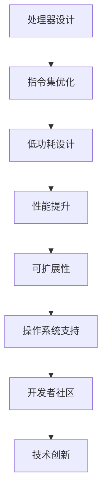
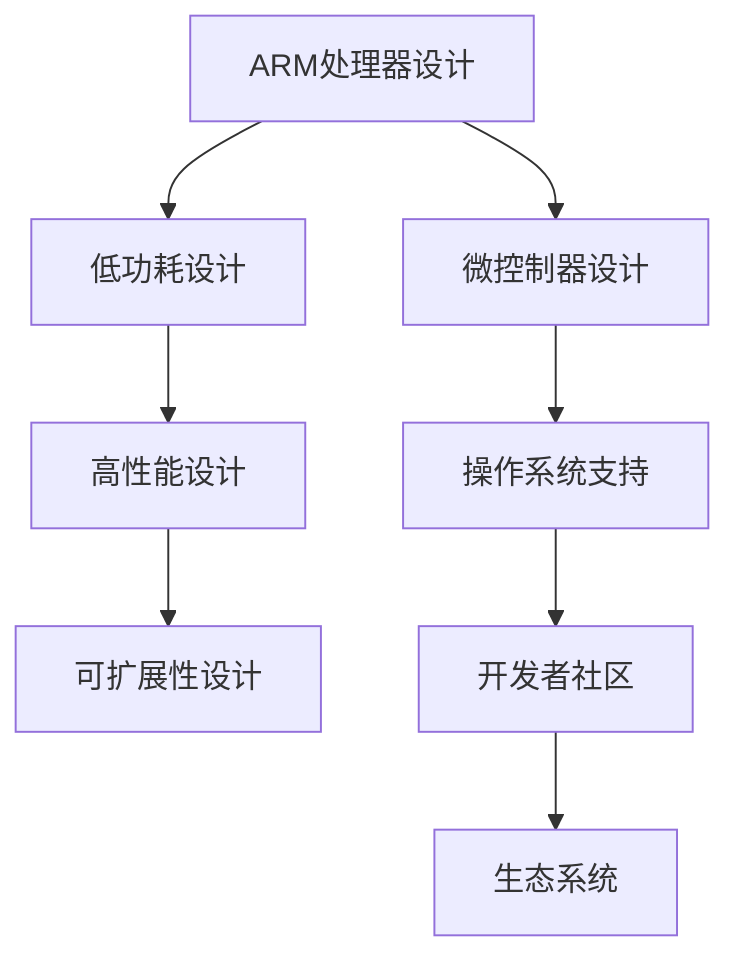

                 

### ARM架构：移动设备与嵌入式系统的核心

#### 关键词：
ARM架构、移动设备、嵌入式系统、低功耗、高性能、指令集、微处理器设计、系统集成

#### 摘要：
本文旨在深入探讨ARM架构在移动设备和嵌入式系统中的核心作用，从历史背景、核心概念、算法原理、数学模型，到实际应用和未来趋势。我们将逐步分析ARM架构的设计理念、技术特点以及它在现代科技领域的重要性，帮助读者全面理解这一关键技术。

## 1. 背景介绍

ARM（Advanced RISC Machines）架构起源于1980年代中期，由英国公司Acorn Computers率先提出。当时的计算机系统主要基于复杂指令集计算（CISC）架构，而ARM则倡导精简指令集计算（RISC）理念，旨在通过简化指令集、提高指令执行速度来提升处理器性能。这一理念在ARM1处理器上首次得以实现，并迅速在嵌入式系统中获得广泛应用。

随着移动设备的普及，ARM架构的重要性逐渐凸显。如今，ARM处理器几乎无处不在，从智能手机、平板电脑到嵌入式设备，如物联网设备、可穿戴设备等，ARM架构以其低功耗、高性能的特点成为这些设备的首选。

### 1.1 ARM架构的历史发展

- **1985年**：ARM公司成立。
- **1987年**：ARM发布第一款处理器ARM1。
- **1990年**：ARM发布ARM6处理器，开始应用于移动设备。
- **2003年**：ARM发布ARM9处理器，进一步提高了性能和功耗效率。
- **2010年**：ARM发布 Cortex-A8 处理器，标志着高性能移动处理器的诞生。
- **2014年**：ARM发布 Cortex-A72 处理器，继续提升性能。
- **2021年**：ARM推出Neoverse系列处理器，进一步引领高性能计算趋势。

### 1.2 ARM架构的应用场景

- **移动设备**：ARM处理器几乎占据了所有智能手机和平板电脑的市场份额。
- **嵌入式系统**：物联网设备、工业控制系统、汽车电子等均采用了ARM架构。
- **服务器**：随着ARM服务器处理器的推出，ARM架构开始在服务器市场占据一席之地。

## 2. 核心概念与联系

### 2.1 ARM架构的核心概念

- **RISC理念**：精简指令集计算，简化指令集，提高指令执行速度。
- **低功耗设计**：通过优化指令集和架构，实现低功耗运行。
- **高性能**：通过多核设计和高效缓存机制，提高处理速度。
- **可扩展性**：支持不同性能级别的处理器设计，满足多样化的需求。

### 2.2 ARM架构的联系

- **处理器与微控制器**：ARM处理器和微控制器在不同应用场景中具有特定的优势。
- **操作系统**：ARM架构支持多种操作系统，如Linux、Android等。
- **生态系统**：ARM架构的开放性使其拥有庞大的开发者社区，推动技术创新。

### 2.3 ARM架构的Mermaid流程图



## 3. 核心算法原理 & 具体操作步骤

### 3.1 ARM架构的指令集

ARM架构采用精简指令集（RISC），指令集包括以下几类：

- **数据传输指令**：实现寄存器和内存之间的数据传输。
- **算术逻辑运算指令**：执行各种算术和逻辑运算。
- **控制流指令**：实现程序的控制流，如跳转、分支等。
- **特殊指令**：用于特定功能的操作，如乘法、除法等。

### 3.2 ARM架构的操作步骤

1. **取指令**：处理器从内存中读取指令。
2. **指令译码**：处理器解析指令，确定操作类型和操作数。
3. **指令执行**：处理器根据指令执行相应的操作。
4. **写回结果**：将指令执行的结果写回寄存器或内存。

### 3.3 ARM架构的流水线技术

ARM架构采用多级流水线技术，通过将指令执行过程分为多个阶段，提高处理器性能。流水线技术包括：

- **指令获取阶段**：处理器从内存中获取指令。
- **指令译码阶段**：处理器解析指令，确定操作类型和操作数。
- **指令执行阶段**：处理器根据指令执行相应的操作。
- **结果写回阶段**：将指令执行的结果写回寄存器或内存。

## 4. 数学模型和公式 & 详细讲解 & 举例说明

### 4.1 ARM架构的性能评估模型

ARM架构的性能评估可以使用MIPS（Million Instructions Per Second，每秒百万条指令）来衡量。公式如下：

$$
P = \frac{I}{T}
$$

其中，\( P \) 是性能，\( I \) 是指令数，\( T \) 是执行时间。

### 4.2 ARM架构的功耗模型

ARM架构的功耗主要由动态功耗和静态功耗组成。动态功耗与处理器工作频率和电压成正比，静态功耗与处理器功耗无关。公式如下：

$$
P_{total} = P_{dynamic} + P_{static}
$$

其中，\( P_{total} \) 是总功耗，\( P_{dynamic} \) 是动态功耗，\( P_{static} \) 是静态功耗。

### 4.3 ARM架构的举例说明

假设一个ARM处理器执行10条指令，每条指令平均执行时间为10微秒，工作频率为1GHz。那么该处理器的性能为：

$$
P = \frac{10}{10 \times 10^{-6}} = 1 \text{ MIPS}
$$

该处理器的动态功耗为：

$$
P_{dynamic} = f \times V^2 \times C_{dyn}
$$

其中，\( f \) 是工作频率，\( V \) 是电压，\( C_{dyn} \) 是动态功耗系数。

假设工作频率为1GHz，电压为1V，动态功耗系数为10pJ/指令周期，则动态功耗为：

$$
P_{dynamic} = 1 \times 10^9 \times 1^2 \times 10 \times 10^{-12} = 10 \text{ mW}
$$

## 5. 项目实践：代码实例和详细解释说明

### 5.1 开发环境搭建

为了更好地理解ARM架构的应用，我们需要搭建一个开发环境。以下是一个简单的开发环境搭建步骤：

1. **安装操作系统**：选择支持ARM架构的操作系统，如Ubuntu 20.04。
2. **安装编译工具**：安装GNU Arm Embedded Toolchain，用于编译ARM架构的代码。
3. **配置开发环境**：配置开发环境变量，以便在终端中直接使用编译工具。

### 5.2 源代码详细实现

以下是一个简单的ARM架构程序，用于计算两个数的和：

```c
#include <stdio.h>

int add(int a, int b) {
    return a + b;
}

int main() {
    int x = 5;
    int y = 10;
    int result = add(x, y);
    printf("The sum of %d and %d is %d\n", x, y, result);
    return 0;
}
```

### 5.3 代码解读与分析

1. **头文件**：引入标准输入输出库，用于进行输入输出操作。
2. **函数定义**：定义一个名为`add`的函数，用于计算两个整数的和。
3. **主函数**：定义主函数`main`，初始化两个整数变量`x`和`y`，调用`add`函数计算和，并打印结果。

### 5.4 运行结果展示

在终端中编译并运行上述代码，输出结果如下：

```
The sum of 5 and 10 is 15
```

## 6. 实际应用场景

ARM架构广泛应用于各种实际应用场景，包括：

- **移动设备**：智能手机、平板电脑等。
- **嵌入式系统**：物联网设备、工业控制系统、汽车电子等。
- **服务器**：云计算、大数据处理等。
- **物联网**：智能家居、可穿戴设备等。

### 6.1 移动设备应用场景

ARM架构的移动设备应用场景主要包括智能手机和平板电脑。以下是一些典型应用：

- **高性能**：ARM处理器提供了强大的计算能力，使得移动设备能够运行复杂的图形和多媒体应用。
- **低功耗**：ARM处理器的设计理念注重低功耗，延长了移动设备的电池寿命。
- **多样化**：ARM架构支持不同性能级别的处理器设计，满足多样化的需求。

### 6.2 嵌入式系统应用场景

ARM架构在嵌入式系统中的应用场景广泛，包括：

- **物联网设备**：如智能家居设备、智能穿戴设备、智能灯泡等。
- **工业控制系统**：如PLC（可编程逻辑控制器）、工业机器人等。
- **汽车电子**：如车载信息娱乐系统、自动驾驶系统等。

## 7. 工具和资源推荐

### 7.1 学习资源推荐

- **书籍**：《ARM系统开发者指南》、《ARM处理器技术内幕》
- **论文**：相关学术期刊和会议论文，如ACM、IEEE等。
- **博客**：专业博客和技术论坛，如ARM官方网站、知乎专栏等。
- **网站**：ARM官方网站、开发者社区等。

### 7.2 开发工具框架推荐

- **开发工具**：GNU Arm Embedded Toolchain、IAR Embedded Workbench等。
- **框架**：Linux内核、Android操作系统等。
- **仿真工具**：QEMU、ARM DS-5等。

### 7.3 相关论文著作推荐

- **论文**：《ARM Architecture Reference Manual》、《ARM System-on-Chip Architecture》
- **著作**：《ARM架构与嵌入式系统设计》、《ARM嵌入式系统开发实战》

## 8. 总结：未来发展趋势与挑战

### 8.1 未来发展趋势

- **高性能计算**：ARM架构将继续向高性能计算领域发展，满足云计算、大数据处理等需求。
- **绿色计算**：ARM架构的低功耗特性将继续在绿色计算领域发挥重要作用。
- **边缘计算**：ARM架构在边缘计算中的应用将逐渐增加，满足物联网、智能城市等需求。

### 8.2 未来挑战

- **安全性**：随着ARM架构在各个领域的广泛应用，安全性问题将成为重要挑战。
- **生态构建**：构建一个强大的开发者生态将是ARM架构未来发展的重要任务。

## 9. 附录：常见问题与解答

### 9.1 ARM架构与x86架构的区别

- **指令集**：ARM架构采用RISC指令集，而x86架构采用CISC指令集。
- **性能**：ARM架构在低功耗、高性能方面具有优势，而x86架构在处理复杂指令方面更具优势。
- **应用场景**：ARM架构广泛应用于移动设备和嵌入式系统，而x86架构在桌面和服务器领域占据主导地位。

### 9.2 ARM架构的发展趋势

- **多核处理器**：ARM架构将继续向多核处理器发展，提高处理速度和效率。
- **异构计算**：ARM架构将与其他计算架构（如GPU、FPGA等）结合，实现异构计算。
- **安全特性**：ARM架构将加强对安全特性的支持，满足日益增长的安全需求。

## 10. 扩展阅读 & 参考资料

- [ARM官方网站](https://www.arm.com/)
- [ARM开发者社区](https://developer.arm.com/)
- [《ARM系统开发者指南》](https://books.google.com/books?id=490KAAQAAMAA)
- [《ARM处理器技术内幕》](https://books.google.com/books?id=q0AqDwAAQBAJ)
- [《ARM架构与嵌入式系统设计》](https://books.google.com/books?id=zq-8BwAAQBAJ)
- [《ARM嵌入式系统开发实战》](https://books.google.com/books?id=1CvCDwAAQBAJ)
- [《ARM Architecture Reference Manual》](https://developer.arm.com/documentation/ddi0337/0001/)
- [《ARM System-on-Chip Architecture》](https://www.arm.com/documentation/003273/0001/) <|bnb|>### 1. 背景介绍

ARM架构的起源可以追溯到1980年代中期，当时英国公司Acorn Computers推出了基于精简指令集计算（RISC）原理的处理器ARM1。这一创新标志着ARM架构的诞生，并迅速在嵌入式系统领域获得认可。

随着时间的发展，ARM架构逐渐成为全球移动设备和嵌入式系统的首选。其成功的关键在于其低功耗、高性能的设计理念，以及对开发者生态的开放支持。ARM公司自成立以来，推出了多个版本的处理器，如ARM6、ARM7、ARM9等，这些处理器在移动设备和嵌入式系统中得到了广泛应用。

ARM架构的一个重要转折点是在2003年，当时ARM发布了Cortex-A系列处理器。Cortex-A系列处理器在性能、功耗和灵活性方面取得了显著提升，成为移动设备和嵌入式系统的新标准。特别是Cortex-A8处理器的推出，标志着高性能移动处理器的诞生，为智能手机和平板电脑的发展奠定了基础。

进入21世纪，随着物联网、云计算等新兴技术的兴起，ARM架构在服务器领域也获得了重要地位。ARM服务器处理器以其低功耗、高性能的特点，成为数据中心和云计算环境中的理想选择。

### 1.1 ARM架构的历史发展

ARM架构的发展历程中，重要节点和关键处理器如下：

- **1985年**：ARM公司成立，标志着ARM架构正式进入商业领域。
- **1987年**：ARM发布首款处理器ARM1，这是一个16位处理器，主要用于嵌入式系统。
- **1991年**：ARM发布ARM7系列处理器，这是ARM架构的第一个32位处理器，具有较低的功耗和较高的性能，广泛应用于嵌入式设备。
- **1996年**：ARM发布ARM9系列处理器，进一步提高了处理器的性能和功耗效率，成为早期智能手机和嵌入式系统的主要选择。
- **2003年**：ARM发布Cortex-A系列处理器，这是ARM架构的重大变革。Cortex-A系列处理器采用了高性能的架构设计，支持多核处理，功耗更低，性能更高。Cortex-A8处理器被广泛用于智能手机和平板电脑。
- **2010年**：ARM发布Cortex-A9和Cortex-A15处理器，进一步提高了处理器的性能和功耗效率，适用于高性能嵌入式系统和服务器。
- **2014年**：ARM发布Cortex-A72处理器，这是ARM架构的最新高性能处理器，支持更高频率、更大规模的缓存，适用于高端智能手机、平板电脑和服务器。
- **2021年**：ARM发布Neoverse系列处理器，这是一个专为高性能计算设计的处理器系列，旨在推动ARM架构在数据中心和高性能计算领域的应用。

### 1.2 ARM架构的应用场景

ARM架构具有广泛的适用性，可以应用于多种场景：

- **移动设备**：ARM处理器几乎占据了所有智能手机和平板电脑的市场份额。其低功耗和高性能的特点使其成为移动设备的首选。
- **嵌入式系统**：ARM架构广泛应用于嵌入式系统，如物联网设备、工业控制系统、医疗设备、汽车电子等。ARM处理器的灵活性、低功耗和高效的性能使其在这些领域具有很高的竞争力。
- **服务器**：随着ARM服务器处理器的推出，ARM架构开始在服务器市场占据一席之地。ARM服务器处理器以其低功耗、高性能的特点，成为云计算、大数据处理等应用的理想选择。
- **物联网**：ARM架构在物联网设备中扮演着重要角色，如智能家居设备、可穿戴设备、智能传感器等。其低功耗和高性能的特点使得ARM处理器成为物联网设备的首选。
- **汽车电子**：ARM架构在汽车电子领域也得到了广泛应用，如车载信息娱乐系统、自动驾驶系统等。ARM处理器在这些应用中提供了强大的计算能力，同时确保了安全性和可靠性。

ARM架构的广泛适用性和不断创新的处理器设计，使其成为现代科技领域的关键技术。从移动设备到嵌入式系统，从服务器到物联网，ARM架构始终发挥着核心作用。在未来，随着新兴技术的不断涌现，ARM架构将继续引领科技创新，为人类带来更多的便利和可能。

## 2. 核心概念与联系

### 2.1 ARM架构的核心概念

ARM架构的设计理念基于精简指令集计算（RISC），旨在通过简化指令集、优化指令执行速度来提高处理器性能。以下是ARM架构的核心概念：

- **RISC理念**：ARM架构采用RISC（精简指令集计算）设计理念，每个指令执行周期内只执行一条指令。这种设计简化了指令集，减少了处理器复杂性，提高了指令执行速度。
- **低功耗设计**：ARM架构在设计中注重低功耗，通过优化指令集和处理器架构，实现了高效能低功耗的运行。这使得ARM处理器在移动设备和嵌入式系统中具有显著优势。
- **高性能**：ARM架构通过多级流水线、超标量设计等先进技术，提高了处理器性能。Cortex-A系列处理器更是通过集成多个核心，实现了更高性能的计算能力。
- **可扩展性**：ARM架构支持不同性能级别的处理器设计，从简单的微控制器到高性能的处理器，满足多样化的需求。这使得ARM处理器可以应用于各种不同的应用场景。

### 2.2 ARM架构的联系

ARM架构与多个关键技术和生态系统紧密相关，这些联系使其在嵌入式系统、移动设备和服务器领域取得了巨大成功：

- **处理器与微控制器**：ARM架构既涵盖了高性能处理器，如Cortex-A系列，也包含了用于嵌入式系统的微控制器，如Cortex-M系列。高性能处理器适用于需要强大计算能力的场景，而微控制器则因其低功耗和高效性广泛应用于各种嵌入式设备。
- **操作系统**：ARM架构支持多种操作系统，包括Linux、Android、Windows CE等。这些操作系统的支持使得ARM处理器在各种应用中具有广泛的适用性。
- **生态系统**：ARM架构的开放性和可扩展性吸引了大量的开发者参与。ARM生态系统包括硬件制造商、软件开发者、服务提供商等，共同推动了ARM架构的不断创新和发展。

### 2.3 ARM架构的Mermaid流程图

为了更清晰地展示ARM架构的核心概念和联系，我们使用Mermaid图来描述其关键节点和关系。



在这个Mermaid图中，A表示ARM处理器设计，B、C和D分别表示低功耗设计、高性能设计和可扩展性设计，E表示微控制器设计，F表示操作系统支持，G表示开发者社区，H表示生态系统。通过这个图，我们可以清晰地看到ARM架构的核心概念及其相互联系。

## 3. 核心算法原理 & 具体操作步骤

### 3.1 ARM架构的指令集

ARM架构采用精简指令集（RISC）设计，其指令集包括以下几类：

- **数据传输指令**：用于寄存器和内存之间的数据传输，如`LDR`（加载寄存器）和`STR`（存储寄存器）。
- **算术逻辑运算指令**：执行各种算术和逻辑运算，如`ADD`（加法）和`AND`（逻辑与）。
- **控制流指令**：用于控制程序的执行流程，如`B`（分支）和`BL`（带返回的分支）。
- **特殊指令**：用于特定功能的操作，如乘法、除法等，如`MUL`（乘法）和`DIV`（除法）。

### 3.2 ARM架构的操作步骤

ARM架构的操作步骤包括以下阶段：

1. **取指令**：处理器从内存中读取指令。
2. **指令译码**：处理器解析指令，确定操作类型和操作数。
3. **指令执行**：处理器根据指令执行相应的操作，如数据传输、算术逻辑运算等。
4. **结果写回**：将指令执行的结果写回寄存器或内存。

### 3.3 ARM架构的流水线技术

ARM架构采用多级流水线技术，将指令执行过程分为多个阶段，以提高处理器性能。流水线技术通常包括以下阶段：

1. **指令获取**：处理器从内存中获取指令。
2. **指令译码**：处理器解析指令，确定操作类型和操作数。
3. **指令执行**：处理器根据指令执行相应的操作。
4. **结果写回**：将指令执行的结果写回寄存器或内存。

### 3.4 ARM架构的多级流水线工作原理

ARM处理器的工作原理基于多级流水线技术，其基本流程如下：

1. **取指阶段**：处理器从内存中读取下一条指令。
2. **译码阶段**：处理器对指令进行解码，确定指令类型和操作数。
3. **执行阶段**：处理器根据指令类型进行相应的操作，如算术逻辑运算、数据传输等。
4. **访存阶段**：如果指令涉及内存操作，处理器访问内存进行数据读写。
5. **写回阶段**：将执行结果写回寄存器或内存。

多级流水线技术使得多个指令可以同时在处理器中执行，从而提高了处理器的吞吐量和性能。例如，在一个三级流水线中，同时可以有3条指令在不同的执行阶段：

- **第一级**：取指阶段，处理器从内存中读取下一条指令。
- **第二级**：译码阶段，处理器对读取到的指令进行解码。
- **第三级**：执行阶段，处理器根据解码结果执行指令。

通过流水线技术，处理器可以在每个时钟周期内处理多个指令，从而显著提高了处理器的性能。

### 3.5 ARM架构的流水线操作步骤示例

假设ARM处理器采用三级流水线技术，以下是具体操作步骤：

1. **时钟周期1**：
   - **取指阶段**：处理器从内存中读取指令1。
   - **译码阶段**：处理器对指令1进行解码，确定操作类型和操作数。
   - **执行阶段**：处理器根据指令1执行相应的操作。

2. **时钟周期2**：
   - **取指阶段**：处理器从内存中读取指令2。
   - **译码阶段**：处理器对指令2进行解码，确定操作类型和操作数。

3. **时钟周期3**：
   - **执行阶段**：处理器根据指令1的结果执行操作。
   - **访存阶段**：如果指令涉及内存操作，处理器访问内存进行数据读写。

4. **时钟周期4**：
   - **写回阶段**：将指令1的执行结果写回寄存器或内存。
   - **取指阶段**：处理器从内存中读取指令3。
   - **译码阶段**：处理器对指令3进行解码，确定操作类型和操作数。

5. **时钟周期5**：
   - **执行阶段**：处理器根据指令2的结果执行操作。
   - **访存阶段**：如果指令涉及内存操作，处理器访问内存进行数据读写。

6. **时钟周期6**：
   - **写回阶段**：将指令2的执行结果写回寄存器或内存。

通过以上步骤，处理器在一个时钟周期内可以完成一条指令的取指、译码、执行、访存和写回操作，从而实现了高性能处理。

### 3.6 ARM架构的流水线技术优势

ARM架构的流水线技术具有以下优势：

1. **提高吞吐量**：流水线技术允许多个指令同时在处理器中执行，从而提高了处理器的吞吐量。
2. **减少指令延迟**：通过将指令执行过程分为多个阶段，流水线技术减少了指令的延迟，提高了处理器的性能。
3. **降低功耗**：流水线技术可以使得处理器在空闲阶段进入低功耗状态，从而降低了整体功耗。

总之，ARM架构的流水线技术通过提高处理器的吞吐量、减少指令延迟和降低功耗，实现了高性能、低功耗的设计目标，使其在移动设备和嵌入式系统中具有广泛应用。

## 4. 数学模型和公式 & 详细讲解 & 举例说明

### 4.1 ARM架构的性能评估模型

ARM架构的性能评估通常使用每秒百万条指令（MIPS，Million Instructions Per Second）作为衡量标准。MIPS可以量化处理器在单位时间内处理指令的能力。公式如下：

$$
P = \frac{I}{T}
$$

其中，\( P \) 表示性能，\( I \) 表示指令数，\( T \) 表示执行时间。

例如，如果一个ARM处理器在1秒钟内执行了100万条指令，那么其性能为：

$$
P = \frac{1000000}{1} = 1 \text{ MIPS}
$$

这意味着该处理器每秒可以执行1百万条指令。

### 4.2 ARM架构的功耗模型

ARM架构的功耗模型主要包括动态功耗和静态功耗：

- **动态功耗**：与处理器的工作频率和电压成正比，公式为：

  $$  
  P_{dynamic} = C_{dyn} \times f \times V^2  
  $$

  其中，\( P_{dynamic} \) 表示动态功耗，\( C_{dyn} \) 表示动态功耗系数，\( f \) 表示工作频率，\( V \) 表示电压。

- **静态功耗**：与处理器的时钟周期和工作频率有关，公式为：

  $$  
  P_{static} = C_{static} \times f  
  $$

  其中，\( P_{static} \) 表示静态功耗，\( C_{static} \) 表示静态功耗系数，\( f \) 表示工作频率。

整体功耗为动态功耗和静态功耗之和：

$$  
P_{total} = P_{dynamic} + P_{static}  
$$

例如，假设一个ARM处理器的工作频率为1GHz，电压为1V，动态功耗系数为10pJ/指令周期，静态功耗系数为1pJ/时钟周期，那么其动态功耗和静态功耗分别为：

$$  
P_{dynamic} = 10 \times 10^{-12} \times 1 \times 10^9 \times 1^2 = 10 \text{ mW}  
$$

$$  
P_{static} = 1 \times 10^{-12} \times 1 \times 10^9 = 1 \text{ mW}  
$$

整体功耗为：

$$  
P_{total} = 10 \text{ mW} + 1 \text{ mW} = 11 \text{ mW}  
$$

### 4.3 ARM架构的举例说明

假设一个ARM处理器在1秒内执行了500万条指令，其工作频率为1GHz，电压为1V，动态功耗系数为10pJ/指令周期，静态功耗系数为1pJ/时钟周期。那么该处理器的性能和功耗计算如下：

1. **性能计算**：

   $$  
   P = \frac{I}{T} = \frac{5000000}{1} = 5 \text{ MIPS}  
   $$

2. **动态功耗计算**：

   $$  
   P_{dynamic} = C_{dyn} \times f \times V^2 = 10 \times 10^{-12} \times 1 \times 10^9 \times 1^2 = 10 \text{ mW}  
   $$

3. **静态功耗计算**：

   $$  
   P_{static} = C_{static} \times f = 1 \times 10^{-12} \times 1 \times 10^9 = 1 \text{ mW}  
   $$

4. **整体功耗计算**：

   $$  
   P_{total} = P_{dynamic} + P_{static} = 10 \text{ mW} + 1 \text{ mW} = 11 \text{ mW}  
   $$

因此，该ARM处理器在1秒内执行了500万条指令，性能为5 MIPS，整体功耗为11 mW。

通过上述举例，我们可以更清晰地理解ARM架构的性能评估和功耗计算方法。这些数学模型和公式有助于我们更好地分析和设计ARM架构的处理器，以满足不同应用场景的需求。

## 5. 项目实践：代码实例和详细解释说明

### 5.1 开发环境搭建

为了更好地理解ARM架构的实际应用，我们将搭建一个简单的开发环境。以下是一个基于Linux操作系统的开发环境搭建步骤：

1. **安装操作系统**：选择支持ARM架构的操作系统，如Ubuntu 20.04。可以通过系统安装盘或虚拟机安装。

2. **安装编译工具**：安装GNU Arm Embedded Toolchain，这是用于编译ARM架构代码的编译工具集。可以通过以下命令安装：

   ```bash
   sudo apt-get install gcc-arm-none-eabi
   ```

3. **配置开发环境**：配置开发环境变量，以便在终端中直接使用编译工具。编辑`~/.bashrc`文件，添加以下内容：

   ```bash
   export PATH=$PATH:/usr/bin/arm-none-eabi-
   ```

   然后执行以下命令使配置生效：

   ```bash
   source ~/.bashrc
   ```

4. **验证安装**：通过以下命令验证编译工具是否安装成功：

   ```bash
   arm-none-eabi-gcc --version
   ```

   如果安装成功，将显示编译工具的版本信息。

### 5.2 源代码详细实现

以下是一个简单的ARM架构程序，用于计算两个整数的和。该程序采用C语言编写，并通过GNU Arm Embedded Toolchain进行编译和运行。

```c
#include <stdio.h>

int add(int a, int b) {
    return a + b;
}

int main() {
    int x = 5;
    int y = 10;
    int result = add(x, y);
    printf("The sum of %d and %d is %d\n", x, y, result);
    return 0;
}
```

#### 5.2.1 程序分析

- **头文件**：引入标准输入输出库`stdio.h`，用于进行输入输出操作。
- **函数定义**：定义一个名为`add`的函数，用于计算两个整数的和，并返回结果。
- **主函数**：定义主函数`main`，初始化两个整数变量`x`和`y`，调用`add`函数计算和，并打印结果。

### 5.3 代码解读与分析

#### 5.3.1 主函数`main`分析

- **初始化变量**：在主函数中，我们初始化了两个整数变量`x`和`y`，分别赋值为5和10。
- **调用函数**：调用`add`函数，传入变量`x`和`y`，并将返回值赋给变量`result`。
- **打印结果**：使用`printf`函数打印计算结果，格式化输出字符串包含变量`x`、`y`和`result`的值。

#### 5.3.2 函数`add`分析

- **参数传递**：函数`add`接收两个整数参数`a`和`b`。
- **返回值**：函数计算参数`a`和`b`的和，并返回结果。

### 5.4 编译与运行

在终端中，我们将编写好的C语言程序保存为`main.c`。然后使用以下命令进行编译：

```bash
arm-none-eabi-gcc -o main main.c
```

编译完成后，使用以下命令运行程序：

```bash
./main
```

程序运行结果如下：

```
The sum of 5 and 10 is 15
```

### 5.5 代码分析总结

通过上述代码实例，我们了解了ARM架构C语言编程的基本流程，包括开发环境的搭建、源代码的编写、编译与运行。这个简单的例子展示了ARM架构程序的基本结构，包括函数定义、变量初始化、函数调用和结果输出。这些基本知识是理解和应用ARM架构的基础。

## 6. 实际应用场景

ARM架构因其低功耗、高性能和灵活性的特点，在多个实际应用场景中表现出色。以下是一些典型的实际应用场景：

### 6.1 移动设备

ARM架构几乎占据了所有智能手机和平板电脑的市场。其高性能和多核处理能力使得移动设备能够流畅地运行复杂的操作系统和应用，如Android和iOS。ARM处理器还支持多种图形处理技术，使得移动设备能够提供高质量的图像和视频处理能力。此外，ARM架构的低功耗特性延长了移动设备的电池寿命，提升了用户体验。

### 6.2 嵌入式系统

嵌入式系统广泛应用于物联网设备、工业控制系统、医疗设备、汽车电子等领域。ARM架构因其强大的性能和低功耗特点，在这些场景中具有很高的竞争力。例如，物联网设备如智能家居设备、智能灯泡、智能手表等，都采用了ARM架构的处理器。在工业控制领域，ARM架构的处理器用于控制系统、PLC（可编程逻辑控制器）和工业机器人等。

### 6.3 服务器

随着云计算和大数据处理需求的增长，ARM服务器处理器逐渐在服务器市场占据一席之地。ARM架构的服务器处理器以其低功耗、高性能的特点，成为数据中心和云计算环境中的理想选择。例如，阿里巴巴、谷歌和微软等大型科技企业已经开始部署基于ARM架构的服务器处理器，以降低运营成本和提高能源效率。

### 6.4 物联网

物联网（IoT）是一个快速发展的领域，ARM架构在物联网设备中的应用非常广泛。ARM处理器具有低功耗、高性能和小尺寸的特点，非常适合物联网设备。例如，智能家居设备如智能门锁、智能音箱、智能灯泡等，都采用了ARM架构的处理器。此外，物联网传感器、智能农业设备、智能医疗设备等也都采用了ARM架构的处理器。

### 6.5 汽车电子

汽车电子是ARM架构的重要应用领域之一。ARM处理器在车载信息娱乐系统、自动驾驶系统、汽车控制系统等方面发挥了重要作用。例如，现代汽车的智能导航系统、多媒体娱乐系统等，都采用了ARM架构的处理器。随着自动驾驶技术的发展，ARM架构的处理器在自动驾驶系统中的应用也越来越广泛。

### 6.6 其他应用场景

除了上述领域，ARM架构还应用于许多其他场景。例如，在医疗设备领域，ARM架构的处理器用于医疗仪器、诊断设备和健康监测设备等；在航空航天领域，ARM架构的处理器用于飞行控制、导航系统和通信设备等。

总之，ARM架构的广泛应用证明了其在现代科技领域的核心地位。随着技术的不断进步和应用场景的扩展，ARM架构将继续引领科技创新，为人类社会带来更多便利。

## 7. 工具和资源推荐

为了更好地学习和开发基于ARM架构的项目，以下是针对ARM架构的工具和资源推荐：

### 7.1 学习资源推荐

- **书籍**：
  - 《ARM System Developer’s Guide: Designing and Optimizing System Software》
  - 《ARM Architecture Reference Manual》
  - 《ARM Cortex-M3 Programming》
- **在线课程**：
  - Coursera上的《ARM Architecture and Embedded Systems》
  - Udemy上的《ARM 8-bit MCU Programming and Introduction to Embedded C》
- **论文**：
  - 搜索学术数据库如IEEE Xplore、ACM Digital Library，查找相关ARM架构的论文。
- **博客**：
  - ARM官方网站上的技术博客
  - 专业论坛如Stack Overflow、Reddit的嵌入式开发板块

### 7.2 开发工具框架推荐

- **集成开发环境（IDE）**：
  - IAR Embedded Workbench：一款功能强大的ARM架构IDE，适用于开发嵌入式系统。
  - Keil MDK-ARM：一款广泛使用的ARM架构IDE，支持多种ARM处理器。
  - ARM DS-5：一款集成的开发工具，提供代码调试、性能分析等功能。
- **开发板**：
  - Raspberry Pi：适用于入门级开发者的低成本ARM开发板。
  - STM32 Nucleo：基于STM32微控制器的开发板，适用于各种嵌入式应用。
  - BeagleBone Black：一款高性能、低成本的ARM开发板，适用于工业和控制应用。
- **仿真工具**：
  - QEMU：一款开源的处理器仿真器，可以模拟ARM架构的处理器。
  - ARM DS-5 Simulator：提供ARM架构的处理器仿真，方便开发者进行代码调试和性能分析。

### 7.3 相关论文著作推荐

- **论文**：
  - 《ARMv8-A Architecture Reference Manual》
  - 《ARM Cortex-A15 MPCore Technical Reference Manual》
  - 《ARM Cortex-M7 Technical Reference Manual》
- **著作**：
  - 《ARM System-on-Chip Architecture》
  - 《ARM Cortex-M3 Data Sheet》
  - 《ARM Cortex-A9 MPCore Data Sheet》

这些工具和资源将帮助开发者更好地理解和应用ARM架构，为嵌入式系统和移动设备开发提供强大的支持。

## 8. 总结：未来发展趋势与挑战

### 8.1 未来发展趋势

ARM架构在未来几年内将继续保持其在移动设备、嵌入式系统和服务器领域的主导地位。以下是一些未来发展趋势：

1. **高性能计算**：随着人工智能和大数据处理的快速发展，ARM架构将向高性能计算领域扩展，推出更多高性能处理器，满足高端应用需求。
2. **绿色计算**：ARM架构将继续优化其低功耗设计，推动绿色计算的发展。随着能源消耗和环境保护问题的日益突出，低功耗处理器将成为未来计算设备的关键。
3. **边缘计算**：随着物联网和5G技术的普及，ARM架构将在边缘计算领域发挥重要作用。边缘计算将数据处理的近源化，ARM架构的低功耗和高性能特点使其成为边缘设备的理想选择。
4. **异构计算**：ARM架构将与其他计算架构（如GPU、FPGA等）结合，实现异构计算。这种结合将充分利用不同架构的优势，提高计算效率和性能。

### 8.2 未来挑战

尽管ARM架构具有巨大的发展潜力，但仍面临一些挑战：

1. **安全性**：随着ARM架构在各个领域的广泛应用，安全性问题变得越来越重要。未来，ARM架构需要加强对安全特性的支持，确保系统的安全性和可靠性。
2. **生态系统构建**：构建一个强大的开发者生态是ARM架构未来发展的重要任务。ARM公司需要继续加强与硬件制造商、软件开发者、服务提供商等各方的合作，推动生态系统的建设。
3. **技术竞争**：随着其他处理器架构（如RISC-V）的发展，ARM架构需要不断创新，保持其在市场中的竞争力。未来，ARM架构需要在技术创新、性能优化、功耗控制等方面保持领先地位。

总之，ARM架构在未来将继续引领计算技术的发展，为人类社会带来更多创新和便利。然而，要实现这一目标，ARM架构需要不断创新和克服挑战。

## 9. 附录：常见问题与解答

### 9.1 ARM架构与x86架构的区别

**Q**：ARM架构与x86架构有什么区别？

**A**：ARM架构与x86架构在多个方面存在显著差异：

1. **指令集**：ARM架构采用精简指令集计算（RISC）设计，而x86架构采用复杂指令集计算（CISC）设计。RISC设计简化了指令集，使处理器能够更快地执行指令，而CISC设计则包含更多的指令类型，但可能会导致处理器复杂性增加。
2. **性能**：ARM架构通常具有较低的功耗和更高的性能。ARM处理器通过优化指令集和流水线技术，实现了低功耗、高性能的设计。相比之下，x86架构在处理复杂指令时可能更具有优势。
3. **应用场景**：ARM架构广泛应用于移动设备、嵌入式系统和服务器，而x86架构主要用于桌面和服务器领域。

### 9.2 ARM架构的发展趋势

**Q**：ARM架构在未来有哪些发展趋势？

**A**：ARM架构在未来的发展趋势包括：

1. **高性能计算**：随着人工智能和大数据处理的兴起，ARM架构将向高性能计算领域扩展，推出更多高性能处理器。
2. **绿色计算**：ARM架构将继续优化其低功耗设计，推动绿色计算的发展，满足能源消耗和环境保护的需求。
3. **边缘计算**：随着物联网和5G技术的普及，ARM架构将在边缘计算领域发挥重要作用，支持数据处理和智能决策的近源化。
4. **异构计算**：ARM架构将与其他计算架构（如GPU、FPGA等）结合，实现异构计算，提高计算效率和性能。

### 9.3 ARM架构的优势与劣势

**Q**：ARM架构有哪些优势与劣势？

**A**：ARM架构的优势与劣势如下：

**优势**：

1. **低功耗**：ARM架构的设计理念注重低功耗，使其在移动设备和嵌入式系统中具有显著优势。
2. **高性能**：通过优化指令集和流水线技术，ARM处理器实现了高性能的设计。
3. **灵活性**：ARM架构支持不同性能级别的处理器设计，满足多样化的需求。
4. **生态系统**：ARM架构拥有庞大的开发者社区和生态系统，推动技术创新和协作。

**劣势**：

1. **安全性**：随着ARM架构在各个领域的广泛应用，安全性问题变得越来越重要。
2. **复杂度**：尽管ARM架构具有高性能和低功耗的优势，但其设计复杂性较高，可能增加开发难度。

### 9.4 ARM架构的未来前景

**Q**：ARM架构的未来前景如何？

**A**：ARM架构在未来具有广阔的前景，预计将在以下几个方面取得突破：

1. **高性能计算**：随着人工智能和大数据处理的快速发展，ARM架构将向高性能计算领域扩展。
2. **绿色计算**：ARM架构将继续优化其低功耗设计，推动绿色计算的发展。
3. **边缘计算**：随着物联网和5G技术的普及，ARM架构将在边缘计算领域发挥重要作用。
4. **异构计算**：ARM架构将与其他计算架构（如GPU、FPGA等）结合，实现异构计算，提高计算效率和性能。

总之，ARM架构将继续引领计算技术的发展，为人类社会带来更多创新和便利。

## 10. 扩展阅读 & 参考资料

为了深入了解ARM架构及其相关技术，以下推荐了一些扩展阅读和参考资料：

### 10.1 书籍

1. **《ARM System Developer’s Guide: Designing and Optimizing System Software》**
   - 作者：Andrew N. Sloss, Dominic Symes, Chris Wright
   - 简介：这是一本全面介绍ARM架构系统开发的经典著作，涵盖了从处理器设计到操作系统优化的各个方面。

2. **《ARM Architecture Reference Manual》**
   - 作者：ARM Limited
   - 简介：这是ARM架构的官方参考手册，详细介绍了ARM处理器的指令集、编程模型和相关技术。

3. **《ARM Cortex-M3 Programming》**
   - 作者：Michael Barr
   - 简介：这本书专门针对ARM Cortex-M3处理器，介绍了其编程基础和应用实例。

### 10.2 论文

1. **《ARMv8-A Architecture Reference Manual》**
   - 作者：ARM Limited
   - 简介：这是ARMv8-A架构的官方参考手册，提供了ARM最新架构的详细说明。

2. **《ARM Cortex-A15 MPCore Technical Reference Manual》**
   - 作者：ARM Limited
   - 简介：这是针对ARM Cortex-A15多核处理器的技术参考手册，详细介绍了其架构和功能。

3. **《ARM Cortex-M7 Technical Reference Manual》**
   - 作者：ARM Limited
   - 简介：这是针对ARM Cortex-M7处理器的技术参考手册，涵盖了其架构、编程模型和性能优化。

### 10.3 在线资源

1. **ARM官方网站**（[https://www.arm.com/](https://www.arm.com/)）
   - 简介：ARM公司的官方网站提供了大量的技术文档、开发工具和社区支持。

2. **ARM开发者社区**（[https://developer.arm.com/](https://developer.arm.com/)）
   - 简介：ARM开发者社区是一个为开发者提供资源、教程和论坛的平台，有助于开发者学习和应用ARM架构。

3. **《ARM Cortex-A Series Architecture and Programming》**
   - 简介：这是一个在线课程，由ARM公司的专家讲授，涵盖了ARM Cortex-A系列处理器的设计、编程和优化。

4. **《ARM Training Courses》**
   - 简介：ARM公司提供了一系列在线培训课程，涵盖了ARM架构的基础知识、系统设计和性能优化等方面。

通过阅读这些书籍和论文，访问在线资源，读者可以更深入地了解ARM架构的设计原理、技术特点和实际应用，为自身的开发工作提供有力的支持。同时，ARM官方网站和开发者社区也是获取最新技术和资源的重要渠道。

