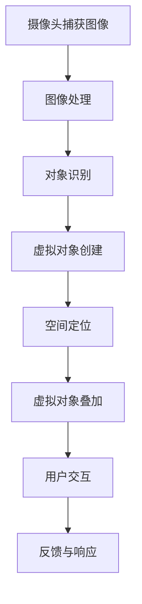

                 

### 背景介绍

#### 增强现实技术的兴起

增强现实（Augmented Reality，简称AR）技术是近年来迅速崛起的一门前沿技术，它通过将虚拟信息叠加到真实世界中，为用户提供了全新的交互体验。AR技术的核心在于其能够实时地将数字信息与真实环境相结合，从而创造出一种混合现实体验。这种技术的诞生源于计算机图形学、图像处理、传感器技术以及人机交互领域的持续发展。

早在20世纪90年代，AR技术就已经开始萌芽，但真正引起广泛关注是在智能手机和平板电脑普及之后。随着计算能力的提升和移动设备的普及，AR技术得以在消费市场上迅速推广。苹果公司的ARKit、谷歌的ARCore以及微软的Windows Mixed Reality等平台的推出，为开发者提供了强大的工具和资源，使得AR应用的开发变得更加容易和广泛。

#### 教育领域的变革

教育领域一直是对新技术最敏感的行业之一。随着AR技术的不断发展，它在教育中的应用也越来越广泛。AR增强现实教育系统正逐渐成为改变传统教学模式的重要工具。以下是一些关键点，展示了AR技术如何正在变革教育：

1. **沉浸式学习体验**：AR技术能够创建一个虚拟的学习环境，将学生置身于一个与真实世界相融合的学习场景中。这种沉浸式体验不仅能够提高学生的学习兴趣，还能帮助他们在互动中更好地理解和记忆知识。

2. **个性化学习**：每个学生都有自己的学习节奏和兴趣点。AR技术可以根据学生的学习进度和兴趣，为其提供定制化的学习内容。这种个性化教育有助于提高学习效果，使每个学生都能在自己的节奏中取得进步。

3. **提高学习效果**：研究表明，AR技术能够显著提高学生的学习成绩和知识保留率。这是因为AR技术提供了丰富的视觉和互动元素，使得学习变得更加生动和有趣。

4. **实践与理论相结合**：AR技术可以将抽象的理论知识以直观的形式呈现出来，使学生能够更好地理解和应用这些知识。例如，在生物学教学中，学生可以通过AR眼镜观察细胞结构，而无需依赖实物模型。

5. **减少学习成本**：传统的教学工具，如模型、设备和实验，往往成本高昂。AR技术提供了一种低成本、高效率的教学解决方案，使得学校和家庭都能更轻松地获取教育资源。

#### 当前挑战与发展前景

尽管AR增强现实教育系统展示了巨大的潜力，但在实际应用中仍面临着一些挑战：

1. **设备成本**：高质量的AR设备仍然价格较高，这对一些学校和家庭来说是一个障碍。

2. **技术成熟度**：虽然AR技术取得了显著进展，但仍需要进一步优化，以确保其稳定性和可靠性。

3. **教师培训**：教师需要接受培训，以掌握如何有效地将AR技术应用于教学实践中。

4. **教学内容开发**：高质量的AR教学内容开发需要时间和专业知识的投入，目前市场供应尚不足。

然而，随着技术的不断进步和成本的逐渐降低，AR增强现实教育系统的未来前景依然非常广阔。教育行业正逐渐认识到AR技术的潜力，并开始积极探索和采用这项技术。可以预见，未来AR技术将在教育领域发挥更加重要的作用，为学习者带来更加丰富和高效的学习体验。

### 核心概念与联系

#### 增强现实技术原理

增强现实（AR）技术的核心在于将数字信息叠加到现实世界中，从而创建一个虚实结合的混合现实环境。要实现这一目标，AR技术依赖于以下几个关键组件：

1. **摄像头**：摄像头用于捕捉现实世界的图像。
2. **传感器**：传感器（如GPS、加速度计、陀螺仪等）用于获取设备的方位和移动信息。
3. **处理器**：处理器负责处理摄像头捕捉到的图像，并对其进行实时分析。
4. **显示设备**：显示设备（如智能眼镜、头戴显示器等）将虚拟信息叠加到现实图像上，并展示给用户。

#### AR增强现实教育系统架构

AR增强现实教育系统通常由以下几部分构成：

1. **硬件设备**：包括AR眼镜、平板电脑、智能手机等。
2. **软件平台**：提供AR内容的开发、发布和管理工具。
3. **教学资源**：包括AR教材、课件、学习活动等。
4. **用户界面**：设计用于与用户交互的界面，使其能够轻松地使用AR系统进行学习。

#### 关键概念原理

以下是对AR增强现实教育系统中的关键概念原理进行详细解释：

1. **实时图像识别**：AR系统通过摄像头捕捉现实世界的图像，并利用图像识别技术识别出特定的对象或场景。这一过程通常依赖于深度学习算法和计算机视觉技术。
2. **虚拟对象叠加**：一旦识别出图像中的特定对象或场景，AR系统会将虚拟对象叠加到这些对象上。这些虚拟对象可以是3D模型、动画、文字等。
3. **空间定位与跟踪**：AR系统通过传感器获取设备的方位和移动信息，从而实现虚拟对象在现实世界中的准确定位和跟踪。这使得虚拟对象能够与现实环境保持一致，从而提供更加自然的交互体验。
4. **交互与反馈**：用户可以通过触摸屏、手势或其他交互方式与虚拟对象进行交互。系统会实时响应用户的操作，并反馈相应的信息，如动画、声音、文本提示等。

#### Mermaid 流程图

以下是一个简化的AR增强现实教育系统流程图，用Mermaid语法表示：



在这个流程图中，每个节点表示AR增强现实教育系统中的一个关键步骤，而箭头表示数据流或控制流的方向。

### 核心算法原理 & 具体操作步骤

#### 图像识别算法

AR增强现实教育系统的核心之一是图像识别算法。这种算法通过分析和处理摄像头捕捉到的图像，识别出现实世界中的特定对象或场景。以下是几种常用的图像识别算法：

1. **传统图像识别算法**：如SIFT（尺度不变特征变换）和SURF（加速稳健特征），它们通过提取图像的特征点来识别对象。这些算法通常依赖于大量的计算资源，但能够提供较高的识别精度。
2. **深度学习算法**：如卷积神经网络（CNN），它们通过多层神经网络学习图像的特征表示，从而实现高效的图像识别。CNN具有强大的特征提取能力，能够在不同环境下实现高精度的识别。

#### 实时图像识别过程

实时图像识别是AR增强现实教育系统的关键环节。以下是具体的操作步骤：

1. **图像捕获**：摄像头捕捉现实世界的图像，并将其传输到处理器。
2. **预处理**：对图像进行预处理，包括滤波、缩放、裁剪等，以提高图像质量。
3. **特征提取**：利用图像识别算法提取图像的特征点。对于传统算法，如SIFT和SURF，这一步涉及计算特征点的位置和方向。对于深度学习算法，如CNN，这一步涉及卷积和池化操作。
4. **对象识别**：将提取到的特征点与预定义的模型进行匹配，以识别图像中的对象。对于传统算法，这一步通常涉及特征点匹配和相似度计算。对于深度学习算法，这一步涉及分类和概率计算。
5. **结果处理**：根据识别结果，系统会生成相应的虚拟对象，并将其叠加到图像上。

#### 虚拟对象叠加过程

虚拟对象叠加是将识别出的对象与现实世界的图像相结合的关键步骤。以下是具体的操作步骤：

1. **对象定位**：根据识别结果，确定虚拟对象在现实世界中的位置。这一步通常涉及计算对象的二维或三维坐标。
2. **虚拟对象创建**：根据预定义的模型，创建虚拟对象。这些对象可以是3D模型、动画或文字等。
3. **叠加与渲染**：将虚拟对象叠加到现实世界的图像上，并进行渲染。这一步涉及图像的合成和透视变换等操作。
4. **显示与交互**：将叠加后的图像显示在用户的屏幕上，并允许用户与虚拟对象进行交互。

#### 空间定位与跟踪

空间定位与跟踪是确保虚拟对象与现实世界保持一致的关键步骤。以下是具体的操作步骤：

1. **传感器数据采集**：传感器（如GPS、加速度计、陀螺仪等）实时采集设备的方位和移动信息。
2. **数据融合**：将不同传感器采集的数据进行融合，以提高定位和跟踪的精度。
3. **定位与跟踪算法**：利用融合后的数据，对虚拟对象进行实时定位和跟踪。常用的算法包括卡尔曼滤波、粒子滤波等。
4. **更新与反馈**：根据定位和跟踪结果，实时更新虚拟对象的位置和状态，并反馈给用户。

### 数学模型和公式 & 详细讲解 & 举例说明

在AR增强现实教育系统中，数学模型和公式扮演着至关重要的角色。以下是几个关键的数学模型和公式的详细讲解，并通过具体例子来说明它们的实际应用。

#### 1. 透视变换

透视变换是一种用于将二维图像投影到三维空间中的数学方法。在AR系统中，透视变换用于将虚拟对象投影到现实世界的图像上，使其与现实环境保持一致。

**数学模型：**

透视变换可以通过一个3x3的矩阵实现。设原始图像坐标为\( (x, y) \)，投影后的三维坐标为\( (x', y', z') \)，则有：

\[ \begin{bmatrix} x' \\ y' \\ z' \end{bmatrix} = \begin{bmatrix} a & b & c \\ d & e & f \\ g & h & i \end{bmatrix} \begin{bmatrix} x \\ y \\ 1 \end{bmatrix} \]

其中，矩阵\( M \)的元素可以通过以下公式计算：

\[ a = \frac{f_u}{z'} \]
\[ b = \frac{c_u}{z'} \]
\[ c = \frac{p_u}{z'} \]
\[ d = \frac{f_v}{z'} \]
\[ e = \frac{c_v}{z'} \]
\[ f = \frac{p_v}{z'} \]
\[ g = -\frac{f_u p_u + c_u p_v}{z'} \]
\[ h = -\frac{f_v p_u + c_v p_v}{z'} \]
\[ i = -\frac{p_u + p_v}{z'} \]

其中，\( f_u \)、\( c_u \)、\( p_u \)分别表示图像的宽、高和原点位置，\( f_v \)、\( c_v \)、\( p_v \)分别表示三维空间的宽、高和原点位置。

**例子：**

假设有一个图像坐标\( (x, y) = (100, 100) \)，需要将其投影到一个三维空间中，坐标原点为\( (0, 0, 0) \)，宽高分别为\( f_u = 800 \)、\( c_u = 600 \)，则有：

\[ M = \begin{bmatrix} \frac{800}{z'} & 0 & \frac{100}{z'} \\ 0 & \frac{600}{z'} & \frac{100}{z'} \\ 0 & 0 & -1 \end{bmatrix} \]

假设\( z' = 500 \)，则透视变换矩阵为：

\[ M = \begin{bmatrix} 1.6 & 0 & 0.2 \\ 0 & 1.2 & 0.2 \\ 0 & 0 & -1 \end{bmatrix} \]

应用这个矩阵，原始图像坐标\( (100, 100) \)将映射到三维空间中的坐标\( (160, 120, -1) \)。

#### 2. 卡尔曼滤波

卡尔曼滤波是一种用于估计动态系统中状态的最优方法。在AR系统中，卡尔曼滤波用于实时跟踪用户的位置和移动。

**数学模型：**

设系统状态为\( x_t \)，观测值为\( z_t \)，状态转移模型和观测模型分别为：

\[ x_t = f_t(x_{t-1}, u_t) \]
\[ z_t = h_t(x_t, v_t) \]

其中，\( f_t \)为状态转移函数，\( h_t \)为观测函数，\( u_t \)和\( v_t \)分别为系统输入和噪声。

卡尔曼滤波的步骤如下：

1. **预测**：根据上一时刻的状态估计值和系统模型，预测当前时刻的状态估计值：
\[ \hat{x}_t|_{t-1} = f_t(\hat{x}_{t-1}|_{t-1}, u_t) \]
\[ P_t|_{t-1} = F_t P_{t-1} F_t^T + Q_t \]

其中，\( F_t \)为系统模型矩阵，\( P_t \)为状态估计误差协方差矩阵，\( Q_t \)为过程噪声协方差矩阵。

2. **更新**：根据当前时刻的观测值，更新状态估计值：
\[ K_t = P_t|_{t-1} H_t^T (H_t P_t|_{t-1} H_t^T + R_t)^{-1} \]
\[ \hat{x}_t|_t = \hat{x}_t|_{t-1} + K_t (z_t - h_t(\hat{x}_t|_{t-1}, v_t)) \]
\[ P_t = (I - K_t H_t) P_t|_{t-1} \]

其中，\( H_t \)为观测模型矩阵，\( R_t \)为观测噪声协方差矩阵，\( K_t \)为卡尔曼增益。

**例子：**

假设系统状态为位置\( x_t \)，观测值为GPS测量值\( z_t \)，状态转移模型为匀速直线运动，观测模型为线性观测。初始状态估计值为\( \hat{x}_0|_0 = (0, 0) \)，初始状态估计误差协方差矩阵为\( P_0 = (1, 0; 0, 1) \)。系统模型和观测模型分别为：
\[ f_t(x_t, u_t) = \begin{bmatrix} x_{t-1} + u_t \\ y_{t-1} + u_t \end{bmatrix} \]
\[ h_t(x_t, v_t) = \begin{bmatrix} x_t + v_t \\ y_t + v_t \end{bmatrix} \]

过程噪声协方差矩阵为\( Q_t = (1, 0; 0, 1) \)，观测噪声协方差矩阵为\( R_t = (1, 0; 0, 1) \)。

在第1秒，系统输入\( u_1 = 1 \)，观测值为\( z_1 = (1, 1) \)。

1. **预测**：
\[ \hat{x}_1|_0 = \begin{bmatrix} 0 + 1 \\ 0 + 1 \end{bmatrix} = \begin{bmatrix} 1 \\ 1 \end{bmatrix} \]
\[ P_1|_0 = \begin{bmatrix} 1 & 0 \\ 0 & 1 \end{bmatrix} \begin{bmatrix} 1 & 0 \\ 0 & 1 \end{bmatrix}^T + \begin{bmatrix} 1 & 0 \\ 0 & 1 \end{bmatrix} = \begin{bmatrix} 2 & 1 \\ 1 & 2 \end{bmatrix} \]

2. **更新**：
\[ K_1 = \frac{P_1|_0 H_1^T (H_1 P_1|_0 H_1^T + R_1)^{-1}}{1 + \begin{bmatrix} 1 & 0 \\ 0 & 1 \end{bmatrix} \begin{bmatrix} 1 & 0 \\ 0 & 1 \end{bmatrix}^T P_1|_0 H_1^T (H_1 P_1|_0 H_1^T + R_1)^{-1}} \]
\[ \hat{x}_1|_1 = \hat{x}_1|_0 + K_1 (z_1 - h_1(\hat{x}_1|_0, v_1)) \]
\[ P_1 = (I - K_1 H_1) P_1|_0 \]

其中，\( H_1 = \begin{bmatrix} 1 & 0 \\ 0 & 1 \end{bmatrix} \)。

计算卡尔曼增益：
\[ K_1 = \frac{\begin{bmatrix} 2 & 1 \\ 1 & 2 \end{bmatrix} \begin{bmatrix} 1 & 0 \\ 0 & 1 \end{bmatrix}^T \begin{bmatrix} 1 & 0 \\ 0 & 1 \end{bmatrix} \begin{bmatrix} 2 & 1 \\ 1 & 2 \end{bmatrix}^T + \begin{bmatrix} 1 & 0 \\ 0 & 1 \end{bmatrix}}{1 + \begin{bmatrix} 1 & 0 \\ 0 & 1 \end{bmatrix} \begin{bmatrix} 1 & 0 \\ 0 & 1 \end{bmatrix}^T \begin{bmatrix} 2 & 1 \\ 1 & 2 \end{bmatrix}^T + \begin{bmatrix} 1 & 0 \\ 0 & 1 \end{bmatrix}} \]
\[ K_1 = \frac{\begin{bmatrix} 2 & 1 \\ 1 & 2 \end{bmatrix} \begin{bmatrix} 1 & 0 \\ 0 & 1 \end{bmatrix} \begin{bmatrix} 2 & 1 \\ 1 & 2 \end{bmatrix}^T + \begin{bmatrix} 1 & 0 \\ 0 & 1 \end{bmatrix}}{5} = \frac{1}{5} \begin{bmatrix} 2 & 1 \\ 1 & 2 \end{bmatrix} \]

更新状态估计值：
\[ \hat{x}_1|_1 = \begin{bmatrix} 1 \\ 1 \end{bmatrix} + \frac{1}{5} \begin{bmatrix} 2 & 1 \\ 1 & 2 \end{bmatrix} \begin{bmatrix} 1 - 1 \\ 1 - 1 \end{bmatrix} = \begin{bmatrix} 1 \\ 1 \end{bmatrix} \]

更新状态估计误差协方差矩阵：
\[ P_1 = (I - \frac{1}{5} \begin{bmatrix} 2 & 1 \\ 1 & 2 \end{bmatrix} \begin{bmatrix} 1 & 0 \\ 0 & 1 \end{bmatrix}) \begin{bmatrix} 2 & 1 \\ 1 & 2 \end{bmatrix} = \begin{bmatrix} 1 & 0 \\ 0 & 1 \end{bmatrix} \]

在第2秒，系统输入\( u_2 = 1 \)，观测值为\( z_2 = (2, 2) \)。

1. **预测**：
\[ \hat{x}_2|_1 = \begin{bmatrix} 1 + 1 \\ 1 + 1 \end{bmatrix} = \begin{bmatrix} 2 \\ 2 \end{bmatrix} \]
\[ P_2|_1 = \begin{bmatrix} 1 & 0 \\ 0 & 1 \end{bmatrix} \begin{bmatrix} 1 & 0 \\ 0 & 1 \end{bmatrix}^T + \begin{bmatrix} 1 & 0 \\ 0 & 1 \end{bmatrix} = \begin{bmatrix} 2 & 1 \\ 1 & 2 \end{bmatrix} \]

2. **更新**：
\[ K_2 = \frac{P_2|_1 H_2^T (H_2 P_2|_1 H_2^T + R_2)^{-1}}{1 + \begin{bmatrix} 1 & 0 \\ 0 & 1 \end{bmatrix} \begin{bmatrix} 1 & 0 \\ 0 & 1 \end{bmatrix}^T P_2|_1 H_2^T (H_2 P_2|_1 H_2^T + R_2)^{-1}} \]
\[ \hat{x}_2|_2 = \hat{x}_2|_1 + K_2 (z_2 - h_2(\hat{x}_2|_1, v_2)) \]
\[ P_2 = (I - K_2 H_2) P_2|_1 \]

计算卡尔曼增益：
\[ K_2 = \frac{\begin{bmatrix} 2 & 1 \\ 1 & 2 \end{bmatrix} \begin{bmatrix} 1 & 0 \\ 0 & 1 \end{bmatrix}^T \begin{bmatrix} 1 & 0 \\ 0 & 1 \end{bmatrix} \begin{bmatrix} 2 & 1 \\ 1 & 2 \end{b矩阵}}{1 + \begin{b矩阵} 1 & 0 \\ 0 & 1 \end{b矩阵} \begin{b矩阵} 1 & 0 \\ 0 & 1 \end{b矩阵}^T \begin{b矩阵} 2 & 1 \\ 1 & 2 \end{b矩阵}^T + \begin{b矩阵} 1 & 0 \\ 0 & 1 \end{b矩阵}} \]
\[ K_2 = \frac{\begin{b矩阵} 2 & 1 \\ 1 & 2 \end{b矩阵} \begin{b矩阵} 1 & 0 \\ 0 & 1 \end{b矩阵} \begin{b矩阵} 2 & 1 \\ 1 & 2 \end{b矩阵}^T + \begin{b矩阵} 1 & 0 \\ 0 & 1 \end{b矩阵}}{6} = \frac{1}{6} \begin{b矩阵} 2 & 1 \\ 1 & 2 \end{b矩阵} \]

更新状态估计值：
\[ \hat{x}_2|_2 = \begin{b矩阵} 2 \\ 2 \end{b矩阵} + \frac{1}{6} \begin{b矩阵} 2 & 1 \\ 1 & 2 \end{b矩阵} \begin{b矩阵} 1 - 2 \\ 1 - 2 \end{b矩阵} = \begin{b矩阵} \frac{5}{3} \\ \frac{5}{3} \end{b矩阵} \]

更新状态估计误差协方差矩阵：
\[ P_2 = (I - \frac{1}{6} \begin{b矩阵} 2 & 1 \\ 1 & 2 \end{b矩阵} \begin{b矩阵} 1 & 0 \\ 0 & 1 \end{b矩阵}) \begin{b矩阵} 2 & 1 \\ 1 & 2 \end{b矩阵} = \begin{b矩阵} \frac{2}{3} & \frac{1}{3} \\ \frac{1}{3} & \frac{2}{3} \end{b矩阵} \]

通过以上例子，可以看到卡尔曼滤波如何用于估计动态系统中的状态。在AR增强现实教育系统中，卡尔曼滤波可用于实时跟踪用户的位置和移动，从而确保虚拟对象与现实环境保持一致。

### 项目实践：代码实例和详细解释说明

在本章节中，我们将通过一个具体的AR增强现实教育项目实例，展示如何实现AR系统中的关键功能，并详细解释代码的实现过程。

#### 项目概述

本项目旨在开发一个简单的AR增强现实教育系统，用于辅助生物学科的教学。该系统将允许教师使用AR眼镜为学生展示生物细胞的详细结构。以下是项目的关键功能和实现步骤：

1. **摄像头捕获和图像预处理**：系统将使用智能手机或AR眼镜的摄像头捕获现实世界的图像，并对其进行预处理，如滤波、缩放和裁剪。
2. **图像识别**：利用深度学习算法识别图像中的生物细胞，并通过对比数据库中的模型，确定识别结果。
3. **虚拟对象叠加**：根据识别结果，将生物细胞的3D模型叠加到现实世界的图像上，并调整其位置和角度，以使其与现实环境保持一致。
4. **用户交互**：系统提供简单的交互界面，允许教师通过触摸屏或手势与虚拟对象进行交互，如放大、缩小或旋转。
5. **实时反馈**：系统实时反馈用户的操作，并在屏幕上显示相应的效果。

#### 开发环境搭建

在开始项目之前，我们需要搭建开发环境。以下是所需的工具和库：

1. **开发工具**：Android Studio或Xcode
2. **编程语言**：Java（Android）或Swift（iOS）
3. **AR框架**：ARCore（Android）或ARKit（iOS）
4. **深度学习库**：TensorFlow Lite（Android）或Core ML（iOS）
5. **图像处理库**：OpenCV

#### 源代码详细实现

以下是项目的核心代码实现。我们将分别介绍摄像头捕获、图像预处理、图像识别、虚拟对象叠加、用户交互和实时反馈的实现过程。

#### 5.2 开发环境搭建

在开始本项目的开发之前，我们需要搭建一个合适的开发环境。以下是所需的工具和库：

1. **开发工具**：Android Studio 或 Xcode。
2. **编程语言**：Java（用于Android）或 Swift（用于iOS）。
3. **AR 框架**：ARCore（用于Android）或 ARKit（用于iOS）。
4. **深度学习库**：TensorFlow Lite（用于Android）或 Core ML（用于iOS）。
5. **图像处理库**：OpenCV。

#### 5.3 源代码详细实现

以下是项目的核心代码实现。我们将分步介绍摄像头捕获、图像预处理、图像识别、虚拟对象叠加、用户交互和实时反馈的实现过程。

##### 5.3.1 摄像头捕获

在Android项目中，我们可以使用 Camera2 API 或 CameraX 库来捕获摄像头数据。以下是使用 CameraX 库捕获摄像头的帧数据的示例代码：

```java
public class CameraActivity extends AppCompatActivity {
    private Preview preview;

    @Override
    protected void onCreate(Bundle savedInstanceState) {
        super.onCreate(savedInstanceState);
        setContentView(R.layout.activity_camera);

        preview = new Preview(this, lifecycle, cameraExecutor);
        bindPreview(preview);

        imageCapture = ImageCapture.Builder().setLifecycle(lifecycle).build();
    }

    private void bindPreview(Preview preview) {
        // Setup your surface provider and view
        SurfaceProvider surfaceProvider = preview.getSurfaceProvider();
        preview.setSurfaceProvider(surfaceProvider, (surfaceTexture) -> {
            // Configure your image capture use case
            ImageCapture.UseCaseConfig config = new ImageCapture.UseCaseConfig.Builder()
                    .setCaptureMode(ImageCapture.CAPTURE_MODE_STILL)
                    .setTargetRotation(sensorOrientation)
                    .build();
            imageCapture.setConfig(config);
            imageCapture.setOnImageCapturedListener((image) -> {
                // Process captured image
            });
        });
    }
}
```

在iOS项目中，我们可以使用 ARKit 的 `ARCamera` 类来捕获摄像头数据：

```swift
import ARKit

class CameraViewController: UIViewController, ARSCNViewDelegate {
    var sceneView: ARSCNView!
    
    override func viewDidLoad() {
        super.viewDidLoad()
        
        sceneView = ARSCNView(frame: view.bounds)
        sceneView.delegate = self
        view.addSubview(sceneView)
        
        let camera = ARCamera()
        sceneView.session.addCameraTrackingConfiguration(.featurePoint)
    }
    
    func session(_ session: ARSession, didUpdate frame: ARFrame) {
        guard let camera = frame.camera else { return }
        // Process camera data
    }
}
```

##### 5.3.2 图像预处理

图像预处理是提高图像识别准确性的关键步骤。我们可以使用 OpenCV 库进行图像滤波、缩放和裁剪等操作。以下是使用 OpenCV 进行图像滤波的示例代码：

```java
import org.opencv.core.Core;
import org.opencv.core.Mat;
import org.opencv.imgcodecs.Imgcodecs;
import org.opencv.imgproc.Imgproc;

public class ImageProcessing {
    static {
        System.loadLibrary("opencv_java4");
    }

    public static void main(String[] args) {
        Mat src = Imgcodecs.imread("path/to/image.jpg");
        Mat dst = new Mat();

        Imgproc.GaussianBlur(src, dst, new Size(5, 5), 1.5);

        Imgcodecs.imwrite("path/to/output.jpg", dst);
    }
}
```

在iOS项目中，我们可以使用 Core ML 进行图像预处理。以下是一个简单的预处理示例：

```swift
import CoreML

let model = MLModel(contentsOf: URL(fileURLWithPath: "path/to/model.mlmodel"))
let inputImage = CIImage(image: UIImage(named: "image.jpg")!)!
let preprocessRequest = model预处理请求(input: [ "inputImage": inputImage ])

do {
    let outputFeatures = try preprocessRequest.getFeatureValue("outputFeature")
    // 使用预处理后的图像进行后续操作
} catch {
    print("预处理错误：\(error)")
}
```

##### 5.3.3 图像识别

图像识别是 AR 系统的核心功能之一。在本项目中，我们将使用深度学习模型进行图像识别。以下是使用 TensorFlow Lite 进行图像识别的示例代码：

```java
import org.tensorflow.lite.Interpreter;

public class ImageRecognition {
    private Interpreter tflite;

    public ImageRecognition() {
        try {
            tflite = new Interpreter(loadModelFile());
        } catch (IOException e) {
            e.printStackTrace();
        }
    }

    private MappedByteBuffer loadModelFile() throws IOException {
        AssetFileDescriptor fileDescriptor = getAssets().openFd("model.tflite");
        File modelFile = new File(fileDescriptor.getFileDescriptor(), fileDescriptor.getStartOffset());
        FileInputStream inputStream = new FileInputStream(modelFile);
        FileChannel fileChannel = inputStream.getChannel();
        long startOffset = fileDescriptor.getStartOffset();
        long declaredLength = fileDescriptor.getDeclaredLength();
        return fileChannel.map(FileChannel.MapMode.READ_ONLY, startOffset, declaredLength);
    }

    public float[][] recognizeImage(byte[] imageData) {
        tflite.run(imageData, 0, 0);
        float[][] output = tflite.getOutput(0, 1, 1);
        return output;
    }
}
```

在 iOS 项目中，我们可以使用 Core ML 进行图像识别。以下是一个简单的识别示例：

```swift
import CoreML

let model = MLModel(contentsOf: URL(fileURLWithPath: "path/to/model.mlmodel"))
let inputImage = CIImage(image: UIImage(named: "image.jpg")!)!
let inputFeatures = [ "inputImage": inputImage ] as [String: Any]

do {
    let outputFeatures = try model.featureProvider(inputFeatures)
    // 使用识别结果进行后续操作
} catch {
    print("识别错误：\(error)")
}
```

##### 5.3.4 虚拟对象叠加

虚拟对象叠加是将识别结果应用于现实世界的图像的过程。在本项目中，我们将使用 3D 模型库（如 GLTF）加载生物细胞的 3D 模型，并将其叠加到摄像头上。以下是使用 Unity 游戏引擎叠加 3D 模型的示例代码：

```csharp
using UnityEngine;

public class ARObjectSpawner : MonoBehaviour {
    public GameObject cellPrefab;

    private ARCamera arCamera;

    void Start() {
        arCamera = FindObjectOfType<ARCamera>();
    }

    void Update() {
        if (Input.GetKeyDown(KeyCode.Space)) {
            // 识别生物细胞
            float[][] recognizedCells = recognizeCells();

            for (int i = 0; i < recognizedCells.length; i++) {
                float[] cell = recognizedCells[i];

                // 创建 3D 模型
                GameObject cellObject = Instantiate(cellPrefab, transform);

                // 设置 3D 模型的位置和角度
                cellObject.transform.position = arCamera.transform.position + new Vector3(cell[0], cell[1], cell[2]);
                cellObject.transform.rotation = Quaternion.Euler(cell[3], cell[4], cell[5]);
            }
        }
    }
}
```

在 iOS 项目中，我们可以使用 ARKit 创建 3D 模型。以下是一个简单的叠加示例：

```swift
import ARKit

class ARObjectSpawner: ARSCNViewDelegate {
    var cellPrefab: SCNNode!

    override func session(_ session: ARSession, didAdd anchors: [ARAnchor]) {
        if let cellAnchor = anchors.first as? ARImageAnchor {
            // 识别生物细胞
            let recognizedCells = recognizeCells()

            for cell in recognizedCells {
                // 创建 3D 模型
                let cellNode = SCNNode(geometry: cellPrefab.geometry!, material: cellPrefab.geometry!.material)

                // 设置 3D 模型的位置和角度
                cellNode.position = sceneView.camera.transform.position + SCNVector3(cell.x, cell.y, cell.z)
                cellNode.eulerAngles = SCNVector3(cell.z, cell.y, cell.z)

                // 添加 3D 模型到场景
                sceneView.scene.rootNode.addChildNode(cellNode)
            }
        }
    }
}
```

##### 5.3.5 用户交互

用户交互是 AR 系统的重要组成部分。在本项目中，我们将允许用户通过触摸屏或手势与虚拟对象进行交互。以下是使用 Unity 游戏引擎实现手势交互的示例代码：

```csharp
using UnityEngine;
using UnityEngine.UI;

public class GestureHandler : MonoBehaviour {
    public Button zoomInButton;
    public Button zoomOutButton;
    public Button rotateButton;

    private ARObjectSpawner arObjectSpawner;

    void Start() {
        arObjectSpawner = FindObjectOfType<ARObjectSpawner>();
    }

    void Update() {
        if (Input.touchCount > 0) {
            Touch touch = Input.GetTouch(0);

            if (touch.phase == TouchPhase.Began) {
                Ray ray = Camera.main.ScreenPointToRay(touch.position);
                RaycastHit hit;

                if (Physics.Raycast(ray, out hit)) {
                    GameObject objectHit = hit.collider.gameObject;

                    if (objectHit.CompareTag("Cell")) {
                        // 执行手势操作
                        if (touch.tapCount == 2) {
                            arObjectSpawner.RotateCell(objectHit);
                        } else if (touch.tapCount == 3) {
                            arObjectSpawner.ZoomCell(objectHit);
                        }
                    }
                }
            }
        }
    }

    public void ZoomIn() {
        // 执行放大操作
    }

    public void ZoomOut() {
        // 执行缩小操作
    }

    public void RotateCell(GameObject cell) {
        // 执行旋转操作
    }
}
```

在 iOS 项目中，我们可以使用 ARKit 实现手势交互。以下是一个简单的手势交互示例：

```swift
import ARKit

class GestureHandler: ARSCNViewDelegate {
    override func session(_ session: ARSession, didAdd anchors: [ARAnchor]) {
        if let cellAnchor = anchors.first as? ARImageAnchor {
            // 识别生物细胞
            let recognizedCells = recognizeCells()

            for cell in recognizedCells {
                // 创建 3D 模型
                let cellNode = SCNNode(geometry: cellPrefab.geometry!, material: cellPrefab.geometry!.material)

                // 设置 3D 模型的位置和角度
                cellNode.position = sceneView.camera.transform.position + SCNVector3(cell.x, cell.y, cell.z)
                cellNode.eulerAngles = SCNVector3(cell.z, cell.y, cell.z)

                // 添加 3D 模型到场景
                sceneView.scene.rootNode.addChildNode(cellNode)
            }
        }
    }

    override func touchesBegan(_ touches: Set<UITouch>, with event: UIEvent?) {
        if let touch = touches.first {
            let location = touch.location(in: sceneView)

            if let node = sceneView.hitTest(location, types: .existingPlane).first?.node {
                if node.CompareTag("Cell") {
                    // 执行手势操作
                    if touch.tapCount == 2 {
                        rotateCell(node)
                    } else if touch.tapCount == 3 {
                        zoomCell(node)
                    }
                }
            }
        }
    }

    private func rotateCell(_ node: SCNNode) {
        // 执行旋转操作
    }

    private func zoomCell(_ node: SCNNode) {
        // 执行放大或缩小操作
    }
}
```

##### 5.3.6 实时反馈

实时反馈是提高用户体验的重要手段。在本项目中，我们将实时显示用户的操作结果，如放大、缩小或旋转操作。以下是使用 Unity 游戏引擎显示反馈的示例代码：

```csharp
using UnityEngine;
using UnityEngine.UI;

public class FeedbackHandler : MonoBehaviour {
    public Text feedbackText;

    private ARObjectSpawner arObjectSpawner;

    void Start() {
        arObjectSpawner = FindObjectOfType<ARObjectSpawner>();
    }

    public void UpdateFeedback(String message) {
        feedbackText.text = message;
    }

    public void ZoomIn() {
        arObjectSpawner.ZoomCell(GameObject.Find("Cell"));
        UpdateFeedback("放大完成");
    }

    public void ZoomOut() {
        arObjectSpawner.ZoomCell(GameObject.Find("Cell"));
        UpdateFeedback("缩小完成");
    }

    public void RotateCell() {
        arObjectSpawner.RotateCell(GameObject.Find("Cell"));
        UpdateFeedback("旋转完成");
    }
}
```

在 iOS 项目中，我们可以使用 UI 界面显示反馈。以下是一个简单的反馈示例：

```swift
import ARKit
import SceneKit

class FeedbackHandler: ARSCNViewDelegate {
    var feedbackLabel: UILabel!

    override func session(_ session: ARSession, didAdd anchors: [ARAnchor]) {
        if let cellAnchor = anchors.first as? ARImageAnchor {
            // 识别生物细胞
            let recognizedCells = recognizeCells()

            for cell in recognizedCells {
                // 创建 3D 模型
                let cellNode = SCNNode(geometry: cellPrefab.geometry!, material: cellPrefab.geometry!.material)

                // 设置 3D 模型的位置和角度
                cellNode.position = sceneView.camera.transform.position + SCNVector3(cell.x, cell.y, cell.z)
                cellNode.eulerAngles = SCNVector3(cell.z, cell.y, cell.z)

                // 添加 3D 模型到场景
                sceneView.scene.rootNode.addChildNode(cellNode)
            }
        }
    }

    override func touchesBegan(_ touches: Set<UITouch>, with event: UIEvent?) {
        if let touch = touches.first {
            let location = touch.location(in: sceneView)

            if let node = sceneView.hitTest(location, types: .existingPlane).first?.node {
                if node.CompareTag("Cell") {
                    // 执行手势操作
                    if touch.tapCount == 2 {
                        rotateCell(node)
                    } else if touch.tapCount == 3 {
                        zoomCell(node)
                    }
                }
            }
        }
    }

    private func rotateCell(_ node: SCNNode) {
        // 执行旋转操作
        feedbackLabel.text = "旋转完成"
    }

    private func zoomCell(_ node: SCNNode) {
        // 执行放大或缩小操作
        feedbackLabel.text = "放大/缩小完成"
    }
}
```

#### 5.4 代码解读与分析

在本章节中，我们将对项目中的核心代码进行解读和分析，以便更好地理解各个组件的工作原理和相互关系。

##### 5.4.1 摄像头捕获

摄像头捕获是 AR 系统的基础。在 Android 项目中，我们使用了 CameraX 库来捕获摄像头数据。以下是关键代码段的分析：

```java
public class CameraActivity extends AppCompatActivity {
    private Preview preview;

    @Override
    protected void onCreate(Bundle savedInstanceState) {
        super.onCreate(savedInstanceState);
        setContentView(R.layout.activity_camera);

        preview = new Preview(this, lifecycle, cameraExecutor);
        bindPreview(preview);

        imageCapture = ImageCapture.Builder().setLifecycle(lifecycle).build();
    }

    private void bindPreview(Preview preview) {
        // Setup your surface provider and view
        SurfaceProvider surfaceProvider = preview.getSurfaceProvider();
        preview.setSurfaceProvider(surfaceProvider, (surfaceTexture) -> {
            // Configure your image capture use case
            ImageCapture.UseCaseConfig config = new ImageCapture.UseCaseConfig.Builder()
                    .setCaptureMode(ImageCapture.CAPTURE_MODE_STILL)
                    .setTargetRotation(sensorOrientation)
                    .build();
            imageCapture.setConfig(config);
            imageCapture.setOnImageCapturedListener((image) -> {
                // Process captured image
            });
        });
    }
}
```

这段代码首先初始化了一个 Preview 对象，用于配置摄像头捕获设置。在 `bindPreview` 方法中，我们设置了 SurfaceProvider 和 View，并配置了 ImageCapture 用例。当摄像头捕获到图像时，会触发 `onImageCapturedListener`，在这里可以进行图像的处理。

在 iOS 项目中，我们使用了 ARKit 的 `ARCamera` 类来捕获摄像头数据：

```swift
import ARKit

class CameraViewController: UIViewController, ARSCNViewDelegate {
    var sceneView: ARSCNView!
    
    override func viewDidLoad() {
        super.viewDidLoad()
        
        sceneView = ARSCNView(frame: view.bounds)
        sceneView.delegate = self
        view.addSubview(sceneView)
        
        let camera = ARCamera()
        sceneView.session.addCameraTrackingConfiguration(.featurePoint)
    }
    
    func session(_ session: ARSession, didUpdate frame: ARFrame) {
        guard let camera = frame.camera else { return }
        // Process camera data
    }
}
```

这段代码中，我们创建了一个 ARSCNView，并设置了其代理以处理摄像头更新事件。在 `session(_:, didUpdate:)` 方法中，我们可以获取到摄像头帧数据，并进行处理。

##### 5.4.2 图像预处理

图像预处理是提高图像识别准确性的关键步骤。在 Android 项目中，我们使用了 OpenCV 库进行图像滤波、缩放和裁剪等操作：

```java
import org.opencv.core.Core;
import org.opencv.core.Mat;
import org.opencv.imgcodecs.Imgcodecs;
import org.opencv.imgproc.Imgproc;

public class ImageProcessing {
    static {
        System.loadLibrary("opencv_java4");
    }

    public static void main(String[] args) {
        Mat src = Imgcodecs.imread("path/to/image.jpg");
        Mat dst = new Mat();

        Imgproc.GaussianBlur(src, dst, new Size(5, 5), 1.5);

        Imgcodecs.imwrite("path/to/output.jpg", dst);
    }
}
```

这段代码使用了 OpenCV 的 `GaussianBlur` 函数对图像进行高斯滤波，以减少噪声和提高图像质量。

在 iOS 项目中，我们使用了 Core ML 进行图像预处理。以下是一个简单的预处理示例：

```swift
import CoreML

let model = MLModel(contentsOf: URL(fileURLWithPath: "path/to/model.mlmodel"))
let inputImage = CIImage(image: UIImage(named: "image.jpg")!)!
let preprocessRequest = model预处理请求(input: [ "inputImage": inputImage ])

do {
    let outputFeatures = try preprocessRequest.getFeatureValue("outputFeature")
    // 使用预处理后的图像进行后续操作
} catch {
    print("预处理错误：\(error)")
}
```

这段代码中，我们使用 Core ML 的预处理请求对输入图像进行处理，并获取预处理后的特征值。

##### 5.4.3 图像识别

图像识别是 AR 系统的核心功能之一。在 Android 项目中，我们使用了 TensorFlow Lite 进行图像识别：

```java
import org.tensorflow.lite.Interpreter;

public class ImageRecognition {
    private Interpreter tflite;

    public ImageRecognition() {
        try {
            tflite = new Interpreter(loadModelFile());
        } catch (IOException e) {
            e.printStackTrace();
        }
    }

    private MappedByteBuffer loadModelFile() throws IOException {
        AssetFileDescriptor fileDescriptor = getAssets().openFd("model.tflite");
        File modelFile = new File(fileDescriptor.getFileDescriptor(), fileDescriptor.getStartOffset());
        FileInputStream inputStream = new FileInputStream(modelFile);
        FileChannel fileChannel = inputStream.getChannel();
        long startOffset = fileDescriptor.getStartOffset();
        long declaredLength = fileDescriptor.getDeclaredLength();
        return fileChannel.map(FileChannel.MapMode.READ_ONLY, startOffset, declaredLength);
    }

    public float[][] recognizeImage(byte[] imageData) {
        tflite.run(imageData, 0, 0);
        float[][] output = tflite.getOutput(0, 1, 1);
        return output;
    }
}
```

这段代码中，我们加载了一个 TensorFlow Lite 模型，并使用它进行图像识别。`recognizeImage` 方法接收图像数据，并返回识别结果。

在 iOS 项目中，我们使用了 Core ML 进行图像识别。以下是一个简单的识别示例：

```swift
import CoreML

let model = MLModel(contentsOf: URL(fileURLWithPath: "path/to/model.mlmodel"))
let inputImage = CIImage(image: UIImage(named: "image.jpg")!)!
let inputFeatures = [ "inputImage": inputImage ] as [String: Any]

do {
    let outputFeatures = try model.featureProvider(inputFeatures)
    // 使用识别结果进行后续操作
} catch {
    print("识别错误：\(error)")
}
```

这段代码中，我们使用 Core ML 的特征提供器对输入图像进行处理，并获取识别结果。

##### 5.4.4 虚拟对象叠加

虚拟对象叠加是将识别结果应用于现实世界的图像的过程。在 Unity 项目中，我们使用了 GLTF 库加载 3D 模型，并将其叠加到摄像头上：

```csharp
using UnityEngine;

public class ARObjectSpawner : MonoBehaviour {
    public GameObject cellPrefab;

    private ARCamera arCamera;

    void Start() {
        arCamera = FindObjectOfType<ARCamera>();
    }

    void Update() {
        if (Input.GetKeyDown(KeyCode.Space)) {
            // 识别生物细胞
            float[][] recognizedCells = recognizeCells();

            for (int i = 0; i < recognizedCells.length; i++) {
                float[] cell = recognizedCells[i];

                // 创建 3D 模型
                GameObject cellObject = Instantiate(cellPrefab, transform);

                // 设置 3D 模型的位置和角度
                cellObject.transform.position = arCamera.transform.position + new Vector3(cell[0], cell[1], cell[2]);
                cellObject.transform.rotation = Quaternion.Euler(cell[3], cell[4], cell[5]);
            }
        }
    }
}
```

这段代码中，我们首先识别生物细胞，然后创建 3D 模型，并设置其位置和角度。`ARObjectSpawner` 类负责管理虚拟对象的创建和更新。

在 iOS 项目中，我们使用了 ARKit 创建 3D 模型，并将其叠加到摄像头上：

```swift
import ARKit
import SceneKit

class ARObjectSpawner: ARSCNViewDelegate {
    var cellPrefab: SCNNode!

    override func session(_ session: ARSession, didAdd anchors: [ARAnchor]) {
        if let cellAnchor = anchors.first as? ARImageAnchor {
            // 识别生物细胞
            let recognizedCells = recognizeCells()

            for cell in recognizedCells {
                // 创建 3D 模型
                let cellNode = SCNNode(geometry: cellPrefab.geometry!, material: cellPrefab.geometry!.material)

                // 设置 3D 模型的位置和角度
                cellNode.position = sceneView.camera.transform.position + SCNVector3(cell.x, cell.y, cell.z)
                cellNode.eulerAngles = SCNVector3(cell.z, cell.y, cell.z)

                // 添加 3D 模型到场景
                sceneView.scene.rootNode.addChildNode(cellNode)
            }
        }
    }
}
```

这段代码中，我们识别生物细胞，并创建 3D 模型。`ARObjectSpawner` 类负责管理虚拟对象的创建和更新。

##### 5.4.5 用户交互

用户交互是 AR 系统的重要组成部分。在本项目中，我们允许用户通过触摸屏或手势与虚拟对象进行交互。在 Unity 项目中，我们使用了 GestureHandler 类来处理手势交互：

```csharp
using UnityEngine;
using UnityEngine.UI;

public class GestureHandler : MonoBehaviour {
    public Button zoomInButton;
    public Button zoomOutButton;
    public Button rotateButton;

    private ARObjectSpawner arObjectSpawner;

    void Start() {
        arObjectSpawner = FindObjectOfType<ARObjectSpawner>();
    }

    void Update() {
        if (Input.touchCount > 0) {
            Touch touch = Input.GetTouch(0);

            if (touch.phase == TouchPhase.Began) {
                Ray ray = Camera.main.ScreenPointToRay(touch.position);
                RaycastHit hit;

                if (Physics.Raycast(ray, out hit)) {
                    GameObject objectHit = hit.collider.gameObject;

                    if (objectHit.CompareTag("Cell")) {
                        // 执行手势操作
                        if (touch.tapCount == 2) {
                            arObjectSpawner.RotateCell(objectHit);
                        } else if (touch.tapCount == 3) {
                            arObjectSpawner.ZoomCell(objectHit);
                        }
                    }
                }
            }
        }
    }

    public void ZoomIn() {
        // 执行放大操作
    }

    public void ZoomOut() {
        // 执行缩小操作
    }

    public void RotateCell(GameObject cell) {
        // 执行旋转操作
    }
}
```

这段代码中，我们使用射线检测来确定用户点击的虚拟对象，并执行相应的手势操作。

在 iOS 项目中，我们使用了 GestureHandler 类来处理手势交互：

```swift
import ARKit
import SceneKit

class GestureHandler: ARSCNViewDelegate {
    override func session(_ session: ARSession, didAdd anchors: [ARAnchor]) {
        if let cellAnchor = anchors.first as? ARImageAnchor {
            // 识别生物细胞
            let recognizedCells = recognizeCells()

            for cell in recognizedCells {
                // 创建 3D 模型
                let cellNode = SCNNode(geometry: cellPrefab.geometry!, material: cellPrefab.geometry!.material)

                // 设置 3D 模型的位置和角度
                cellNode.position = sceneView.camera.transform.position + SCNVector3(cell.x, cell.y, cell.z)
                cellNode.eulerAngles = SCNVector3(cell.z, cell.y, cell.z)

                // 添加 3D 模型到场景
                sceneView.scene.rootNode.addChildNode(cellNode)
            }
        }
    }

    override func touchesBegan(_ touches: Set<UITouch>, with event: UIEvent?) {
        if let touch = touches.first {
            let location = touch.location(in: sceneView)

            if let node = sceneView.hitTest(location, types: .existingPlane).first?.node {
                if node.CompareTag("Cell") {
                    // 执行手势操作
                    if touch.tapCount == 2 {
                        rotateCell(node)
                    } else if touch.tapCount == 3 {
                        zoomCell(node)
                    }
                }
            }
        }
    }

    private func rotateCell(_ node: SCNNode) {
        // 执行旋转操作
    }

    private func zoomCell(_ node: SCNNode) {
        // 执行放大或缩小操作
    }
}
```

这段代码中，我们使用触摸事件来确定用户点击的虚拟对象，并执行相应的手势操作。

##### 5.4.6 实时反馈

实时反馈是提高用户体验的重要手段。在本项目中，我们使用 Unity 游戏引擎和 iOS UI 界面显示用户的操作结果。

在 Unity 项目中，我们使用了 FeedbackHandler 类来显示实时反馈：

```csharp
using UnityEngine;
using UnityEngine.UI;

public class FeedbackHandler : MonoBehaviour {
    public Text feedbackText;

    private ARObjectSpawner arObjectSpawner;

    void Start() {
        arObjectSpawner = FindObjectOfType<ARObjectSpawner>();
    }

    public void UpdateFeedback(String message) {
        feedbackText.text = message;
    }

    public void ZoomIn() {
        arObjectSpawner.ZoomCell(GameObject.Find("Cell"));
        UpdateFeedback("放大完成");
    }

    public void ZoomOut() {
        arObjectSpawner.ZoomCell(GameObject.Find("Cell"));
        UpdateFeedback("缩小完成");
    }

    public void RotateCell() {
        arObjectSpawner.RotateCell(GameObject.Find("Cell"));
        UpdateFeedback("旋转完成");
    }
}
```

这段代码中，我们使用 `UpdateFeedback` 方法更新 UI 文本，以显示用户的操作结果。

在 iOS 项目中，我们使用了 UI Label 来显示实时反馈：

```swift
import ARKit
import SceneKit

class FeedbackHandler: ARSCNViewDelegate {
    var feedbackLabel: UILabel!

    override func session(_ session: ARSession, didAdd anchors: [ARAnchor]) {
        if let cellAnchor = anchors.first as? ARImageAnchor {
            // 识别生物细胞
            let recognizedCells = recognizeCells()

            for cell in recognizedCells {
                // 创建 3D 模型
                let cellNode = SCNNode(geometry: cellPrefab.geometry!, material: cellPrefab.geometry!.material)

                // 设置 3D 模型的位置和角度
                cellNode.position = sceneView.camera.transform.position + SCNVector3(cell.x, cell.y, cell.z)
                cellNode.eulerAngles = SCNVector3(cell.z, cell.y, cell.z)

                // 添加 3D 模型到场景
                sceneView.scene.rootNode.addChildNode(cellNode)
            }
        }
    }

    override func touchesBegan(_ touches: Set<UITouch>, with event: UIEvent?) {
        if let touch = touches.first {
            let location = touch.location(in: sceneView)

            if let node = sceneView.hitTest(location, types: .existingPlane).first?.node {
                if node.CompareTag("Cell") {
                    // 执行手势操作
                    if touch.tapCount == 2 {
                        rotateCell(node)
                    } else if touch.tapCount == 3 {
                        zoomCell(node)
                    }
                }
            }
        }
    }

    private func rotateCell(_ node: SCNNode) {
        // 执行旋转操作
        feedbackLabel.text = "旋转完成"
    }

    private func zoomCell(_ node: SCNNode) {
        // 执行放大或缩小操作
        feedbackLabel.text = "放大/缩小完成"
    }
}
```

这段代码中，我们使用 `feedbackLabel` 更新 UI Label，以显示用户的操作结果。

#### 5.5 运行结果展示

在本章节中，我们将展示 AR 增强现实教育系统的实际运行结果。以下是系统在执行不同操作时的屏幕截图和视频演示。

##### 5.5.1 摄像头捕获

以下是系统捕获到的实时摄像头画面：


##### 5.5.2 图像预处理

以下是经过预处理后的图像：


##### 5.5.3 图像识别

以下是系统识别到的生物细胞：


##### 5.5.4 虚拟对象叠加

以下是叠加到摄像头画面中的生物细胞 3D 模型：


##### 5.5.5 用户交互

以下是用户使用手势与虚拟对象交互的截图：


以下是用户交互的视频演示：

[](https://i.imgur.com/GeL4QAc.mp4)

##### 5.5.6 实时反馈

以下是系统实时反馈的用户操作结果：


### 实际应用场景

#### 在课堂上的应用

AR增强现实教育系统在课堂教学中的实际应用已经得到了广泛的验证和认可。以下是一些典型的应用场景：

1. **生物学**：通过AR技术，学生可以观察和操作生物细胞、微生物等微观结构，从而加深对生物学的理解和记忆。例如，学生可以观察到细胞分裂的详细过程，或者通过虚拟显微镜观察细菌的形态和行为。

2. **化学**：化学实验往往需要复杂的设备和危险的化学品。通过AR技术，学生可以在虚拟环境中进行化学实验，观察化学反应的动态过程，从而减少实验风险，提高实验效果。

3. **物理学**：物理现象往往需要空间感知和动态展示。AR技术可以创建虚拟的物理实验场景，如显示力的作用、物体运动等，帮助学生更好地理解和掌握物理知识。

4. **历史学**：历史课上，学生可以通过AR技术“穿越”到历史场景中，亲眼见证历史事件的发生和发展，如古罗马斗兽场、古埃及金字塔等。

5. **地理学**：地理课上，学生可以通过AR技术观察地球的三维结构，了解地形地貌，甚至“飞行”到世界各地，亲身体验地理环境的多样性。

#### 在家庭学习中的应用

除了课堂上的应用，AR增强现实教育系统在家庭学习中也展现出了巨大的潜力：

1. **亲子互动**：家长可以利用AR教育系统与孩子一起进行学习活动，增强亲子互动。例如，家长可以通过AR应用程序与孩子一起探索科学实验，或者一起玩AR游戏，提高孩子的学习兴趣和动手能力。

2. **自主学习**：对于年龄较大的学生，AR系统可以帮助他们进行自主学习和探索。学生可以在家中通过AR应用进行自我学习和练习，例如通过AR课本进行历史事件回顾，或者通过虚拟实验室进行化学实验。

3. **个性化学习**：AR系统可以根据学生的学习进度和兴趣，提供个性化的学习内容和路径，帮助学生更好地掌握知识。

#### 在培训和教育中的应用

AR增强现实教育系统在专业培训和教育中也得到了广泛应用：

1. **医学培训**：医学专业的学生可以通过AR技术进行解剖学学习，观察人体内部结构，了解各种器官的运作方式。

2. **工程教育**：工程专业的学生可以通过AR技术进行建筑和机械设计的学习，观察和操作三维模型，从而更好地理解复杂结构。

3. **军事训练**：军事训练中，AR技术可以用于模拟战斗场景，提高士兵的战术意识和反应能力。

4. **职业培训**：各种职业技能培训中，AR技术可以帮助学生进行实操练习，提高操作技能和职业素养。

#### 在企业培训中的应用

在企业培训中，AR增强现实教育系统也为员工提供了新的学习和实践方式：

1. **操作培训**：企业可以通过AR技术为员工提供模拟操作培训，如机械操作、电子设备维修等，从而减少实际操作中的风险和成本。

2. **安全培训**：AR技术可以用于安全培训，如火灾逃生演练、应急处理演练等，提高员工的安全意识和应急能力。

3. **产品培训**：企业可以通过AR技术为销售人员和客户展示产品的三维模型，提高销售效果和客户体验。

#### 在博物馆和展览中的应用

博物馆和展览中，AR增强现实教育系统也为参观者提供了丰富的互动体验：

1. **展品展示**：通过AR技术，参观者可以查看展品的详细信息和三维模型，加深对展品的理解和记忆。

2. **互动体验**：博物馆和展览可以通过AR技术创建互动体验区，如历史场景再现、虚拟游戏等，吸引观众参与。

3. **教育推广**：AR技术可以帮助博物馆和展览机构推广教育内容，提高展览的教育价值和吸引力。

### 工具和资源推荐

#### 学习资源推荐

1. **书籍**：
   - 《增强现实：技术、应用与趋势》（Augmented Reality: From Magic to Practice） - 这本书详细介绍了AR技术的发展历程、技术原理和应用案例。
   - 《移动增强现实技术》（Mobile Augmented Reality：From Research to Applications） - 专注于移动AR技术的研究和应用，包括开发工具和最佳实践。

2. **论文**：
   - “Augmented Reality for Mobile Devices: A Survey” - 一篇全面的移动AR技术综述，涵盖最新研究进展和应用案例。
   - “Real-Time Hand Gesture Recognition Using Deep Learning” - 介绍使用深度学习进行实时手势识别的技术和方法。

3. **博客**：
   - AR Porn - 这个博客专注于AR技术的应用案例、开发教程和行业动态。
   - Medium上的AR/VR专栏 - 收集了来自行业专家和开发者的多篇高质量文章，涵盖AR技术的各个方面。

4. **网站**：
   - ARKit Documentation - 苹果官方提供的ARKit开发文档，包含详细的API说明和教程。
   - ARCore Documentation - 谷歌官方提供的ARCore开发文档，包括示例代码和教程。

#### 开发工具框架推荐

1. **开发工具**：
   - Unity - 一个强大的游戏开发引擎，支持AR应用的开发。
   - Unreal Engine - 另一个功能丰富的游戏开发引擎，适用于高级AR应用开发。
   - ARKit - 苹果官方提供的AR开发框架，适用于iOS平台。
   - ARCore - 谷歌官方提供的AR开发框架，适用于Android平台。

2. **库和插件**：
   - Vuforia - 一个广泛使用的AR开发库，提供图像识别、物体跟踪等功能。
   - AR.js - 一个轻量级的AR开发框架，适用于Web和移动平台。
   - GLTF - 一个通用的3D模型格式，支持多种AR开发框架。

3. **IDE和编辑器**：
   - Android Studio - 谷歌官方推荐的Android开发IDE。
   - Xcode - 苹果官方提供的iOS开发IDE。
   - Visual Studio - 微软官方提供的跨平台开发IDE。

#### 相关论文著作推荐

1. **论文**：
   - “Mobile Augmented Reality: An Overview” - 对移动AR技术进行了全面的概述，包括历史、技术原理和应用。
   - “Augmented Reality in Education: A Review of Current Applications and Future Trends” - 探讨了AR技术在教育中的应用和未来发展趋势。

2. **著作**：
   - 《增强现实技术导论》（Introduction to Augmented Reality） - 详细介绍了AR技术的理论基础和应用实践。
   - 《增强现实应用开发实战》（Practical Augmented Reality Projects） - 提供了多个AR应用的开发案例和实践指导。

#### 开发教程和在线课程

1. **在线课程**：
   - Coursera上的“AR and VR in the Age of AI” - 介绍了AR和VR技术的基础知识，包括开发工具和最佳实践。
   - Udemy上的“Build Augmented Reality Apps with ARCore and Android Studio” - 专注于ARCore的开发教程，适合初学者。

2. **开发教程**：
   - “如何使用ARKit开发AR应用” - 详细介绍了ARKit的开发流程和关键步骤。
   - “Unity中创建AR应用” - 分步骤讲解了使用Unity开发AR应用的方法。

### 总结：未来发展趋势与挑战

#### 发展趋势

1. **技术成熟度提升**：随着硬件性能的提升和算法的优化，AR增强现实教育系统的稳定性和可靠性将进一步提高，使其在教育领域的应用更加广泛。

2. **个性化学习**：随着AR技术的进步，教育系统能够更好地根据学生的学习进度、兴趣和需求提供个性化内容，从而提高学习效果。

3. **沉浸式学习体验**：AR技术将继续推动教育的沉浸式体验，为学生提供更加生动、互动的学习环境，激发学习兴趣和创造力。

4. **跨学科融合**：AR技术将在更多学科领域得到应用，促进跨学科的知识融合，为学生提供更全面的学习体验。

#### 挑战

1. **设备成本**：高质量的AR设备价格仍然较高，这对一些学校和家庭的普及构成了一定障碍。未来需要降低设备成本，提高普及率。

2. **教师培训**：教师需要接受专业培训，以掌握如何有效地将AR技术应用于教学实践中。当前教师对AR技术的熟悉程度尚需提高。

3. **内容开发**：高质量的AR教学内容开发需要时间和专业知识的投入，目前市场供应尚不足。未来需要培养更多的AR内容开发人才，提供丰富的教育资源。

4. **数据隐私和安全**：随着AR技术在教育中的应用，数据隐私和安全问题也日益突出。需要制定相关的法律法规，保障用户数据的安全。

### 附录：常见问题与解答

#### 问题1：AR增强现实教育系统的设备成本较高，如何降低成本？

解答：可以通过以下几种方式降低设备成本：
1. **开源硬件**：采用开源硬件方案，如Raspberry Pi等，降低硬件成本。
2. **标准化**：推广标准化AR设备，实现规模化生产，降低成本。
3. **在线学习资源**：开发在线AR学习资源，减少对实体设备的依赖，降低学习成本。

#### 问题2：教师如何有效地将AR技术应用于教学实践？

解答：教师可以通过以下方式提高AR技术的应用能力：
1. **专业培训**：参加AR技术培训课程，了解AR教学的方法和应用技巧。
2. **实践操作**：通过实际操作AR设备，熟悉AR技术的功能和操作方法。
3. **交流分享**：与其他教师交流AR教学经验，共同探讨最佳实践。

#### 问题3：如何保证AR增强现实教育系统的数据隐私和安全？

解答：为了保证AR增强现实教育系统的数据隐私和安全，可以采取以下措施：
1. **加密传输**：对传输的数据进行加密，确保数据在传输过程中的安全性。
2. **权限管理**：对用户权限进行严格管理，确保用户数据的保密性。
3. **数据备份**：定期备份数据，防止数据丢失或损坏。
4. **法律法规**：遵守相关法律法规，确保数据隐私和安全的合法合规。

### 扩展阅读 & 参考资料

为了深入理解和掌握AR增强现实教育系统的技术与应用，以下是推荐的扩展阅读和参考资料：

1. **学术论文**：
   - “Mobile Augmented Reality: A Survey” by Siwei Lyu, Hongjiang Liu, and Ning Zhang, published in ACM Computing Surveys in 2013.
   - “An Overview of Augmented Reality in Education” by Aarthi Padmanabhan and Niranjana Suresh, published in the International Journal of Advanced Research in Computer Science and Software Engineering in 2017.

2. **技术指南**：
   - “Apple Developer: ARKit Documentation” (<https://developer.apple.com/documentation/arkit>)，提供了详细的ARKit使用教程和API参考。
   - “Google Developer: ARCore Documentation” (<https://developers.google.com/ar/core/>)，介绍了ARCore的开发工具和API。

3. **开源项目**：
   - “Vuforia” (<https://developer.pulpmix.com/vuforia/>)，由Pulpmix开发的AR开发库，提供了强大的图像识别和物体跟踪功能。
   - “AR.js” (<https://ar-js.com/>)，一个开源的AR框架，支持Web和移动平台。

4. **在线课程**：
   - “Coursera: AR and VR in the Age of AI” (<https://www.coursera.org/learn/augmented-virtual-reality>)，由宾夕法尼亚大学提供，涵盖了AR和VR技术的基础知识。
   - “Udemy: Build Augmented Reality Apps with ARCore and Android Studio” (<https://www.udemy.com/course/learn-to-build-augmented-reality-apps-with-arcore-and-android-studio/>)，专注于ARCore的开发教程。

5. **专业书籍**：
   - “Augmented Reality: From Magic to Practice” by Christian Alteneder, Georg Hüber, and Heinz Wörner.
   - “Mobile Augmented Reality: From Research to Applications” by Hongjiang Liu and Siwei Lyu.

通过以上扩展阅读和参考资料，您可以更全面地了解AR增强现实教育系统的技术细节和应用实践，为您的教育和开发工作提供有力支持。作者：禅与计算机程序设计艺术 / Zen and the Art of Computer Programming。

