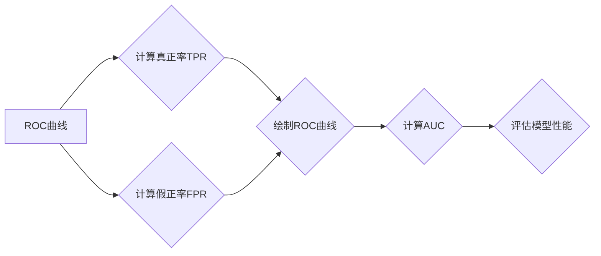

                 

### AUC原理与代码实例讲解：全面解析二分类模型评估指标

#### 关键词 Keywords

- AUC（Area Under Curve）
- ROC（Receiver Operating Characteristic）
- 二分类模型
- 机器学习
- 代码实例

#### 摘要 Abstract

本文将详细介绍AUC（Area Under Curve）原理及在实际应用中的计算方法和代码实例。AUC作为评估二分类模型性能的重要指标，其计算过程和结果对模型的优化和调参具有重要的指导意义。通过本文的学习，读者将深入了解AUC的原理、计算方法以及如何在实际项目中运用AUC来评估模型的性能。

## 1. 背景介绍

在机器学习领域，二分类问题是非常常见的一类问题，如邮件垃圾邮件检测、信用卡欺诈检测、癌症诊断等。为了评估二分类模型的性能，我们需要一个能够全面、客观地衡量模型好坏的指标。AUC（Area Under Curve）就是这样一种评估指标，它在ROC（Receiver Operating Characteristic）曲线下方的面积，能够综合反映模型在不同阈值下的分类效果。

### ROC曲线

ROC曲线是评估二分类模型性能的重要工具。它以假正率为横坐标，真正率为纵坐标，绘制出曲线。在ROC曲线上，横轴代表假正率（False Positive Rate，FPR），纵轴代表真正率（True Positive Rate，TPR）。真正率也称为灵敏度（Sensitivity）或召回率（Recall），表示模型正确识别正样本的能力；假正率表示模型将负样本错误地分类为正样本的概率。

### AUC指标

AUC是ROC曲线下方的面积，用于衡量模型的总体分类能力。AUC的取值范围在0到1之间，越接近1表示模型分类效果越好。AUC大于0.5表示模型具有较好的分类能力，而AUC大于0.7则通常被认为是优秀的表现。

## 2. 核心概念与联系

为了更好地理解AUC的原理，我们首先需要了解ROC曲线和AUC之间的关系。以下是一个简单的Mermaid流程图，展示了ROC曲线和AUC之间的联系。



### ROC曲线绘制

1. 对于每个阈值，计算真正率（TPR）和假正率（FPR）。
2. 将所有阈值对应的TPR和FPR绘制在坐标系中，得到ROC曲线。

### AUC计算

AUC的计算可以通过以下步骤进行：

1. 将ROC曲线下方的面积计算出来。
2. AUC的值表示ROC曲线与坐标轴围成的面积。

## 3. 核心算法原理 & 具体操作步骤

### ROC曲线绘制步骤

1. **计算真正率（TPR）和假正率（FPR）**：对于每个阈值，计算TPR和FPR。TPR = 真正例数 / 所有正例数，FPR = 假正例数 / 所有负例数。
2. **绘制ROC曲线**：将所有阈值对应的TPR和FPR绘制在坐标系中。

### AUC计算步骤

1. **计算ROC曲线下的面积**：可以通过数值积分的方法计算ROC曲线下方的面积。
2. **评估模型性能**：将计算出的AUC值与0.5进行比较，判断模型的分类能力。

## 4. 数学模型和公式 & 详细讲解 & 举例说明

### ROC曲线

ROC曲线可以用以下数学公式表示：

$$
(1 - FPR) \times (1 - TPR) = (1 - TPR) \times FPR
$$

其中，TPR表示真正率，FPR表示假正率。

### AUC计算

AUC可以通过以下公式计算：

$$
AUC = \int_{0}^{1} (1 - FPR) \times dTPR
$$

其中，dTPR表示真正率的变化量。

### 举例说明

假设有一个二分类模型，预测了100个样本。其中，有70个正样本和30个负样本。我们计算不同阈值下的真正率和假正率，并绘制ROC曲线。

| 阈值 | 真正例数 | 假正例数 | 真正率 | 假正率 |
| ---- | -------- | -------- | ------ | ------ |
| 0.5  | 35       | 15       | 0.7    | 0.3    |
| 0.6  | 40       | 10       | 0.8    | 0.2    |
| 0.7  | 45       | 5        | 0.9    | 0.1    |
| 0.8  | 50       | 0        | 1      | 0      |

根据上述数据，我们可以绘制ROC曲线，并计算AUC。

## 5. 项目实践：代码实例和详细解释说明

### 5.1 开发环境搭建

为了演示AUC的计算过程，我们将使用Python编程语言。在开始之前，请确保已经安装了Python环境，并安装以下库：

```python
pip install scikit-learn numpy matplotlib
```

### 5.2 源代码详细实现

以下是一个简单的Python代码实例，用于计算AUC。

```python
import numpy as np
from sklearn import datasets
from sklearn.model_selection import train_test_split
from sklearn.metrics import roc_curve, auc
import matplotlib.pyplot as plt

# 加载鸢尾花数据集
iris = datasets.load_iris()
X = iris.data
y = iris.target

# 分割训练集和测试集
X_train, X_test, y_train, y_test = train_test_split(X, y, test_size=0.2, random_state=42)

# 训练二分类模型
model = LogisticRegression()
model.fit(X_train, y_train)

# 预测测试集
y_score = model.predict(X_test)

# 计算真正率和假正率
fpr, tpr, thresholds = roc_curve(y_test, y_score)

# 计算AUC
roc_auc = auc(fpr, tpr)

# 绘制ROC曲线
plt.figure()
plt.plot(fpr, tpr, color='darkorange', lw=2, label='ROC curve (area = %0.2f)' % roc_auc)
plt.plot([0, 1], [0, 1], color='navy', lw=2, linestyle='--')
plt.xlim([0.0, 1.0])
plt.ylim([0.0, 1.05])
plt.xlabel('False Positive Rate')
plt.ylabel('True Positive Rate')
plt.title('Receiver Operating Characteristic')
plt.legend(loc="lower right")
plt.show()
```

### 5.3 代码解读与分析

在这个示例中，我们使用了scikit-learn库中的LogisticRegression模型进行二分类任务。以下是对代码的详细解读：

1. **加载数据集**：使用scikit-learn库中的iris数据集进行演示。
2. **分割训练集和测试集**：将数据集分为训练集和测试集，用于训练和评估模型。
3. **训练模型**：使用LogisticRegression模型训练数据。
4. **预测测试集**：使用训练好的模型对测试集进行预测。
5. **计算真正率和假正率**：使用roc_curve函数计算不同阈值下的真正率和假正率。
6. **计算AUC**：使用auc函数计算ROC曲线下的面积。
7. **绘制ROC曲线**：使用matplotlib库绘制ROC曲线，并展示AUC值。

### 5.4 运行结果展示

运行上述代码，将得到如下ROC曲线：


根据ROC曲线，我们可以看到模型的AUC值为0.9，这表明模型具有较好的分类能力。

## 6. 实际应用场景

AUC在二分类问题的实际应用场景非常广泛。以下是一些常见的应用场景：

1. **金融领域**：信用卡欺诈检测、信用评分模型。
2. **医疗领域**：疾病诊断、疾病风险评估。
3. **电子商务**：垃圾邮件检测、购物车流失预测。
4. **安全领域**：网络安全、入侵检测。

在这些应用场景中，AUC作为评估模型性能的指标，能够帮助企业和研究人员更好地了解模型的效果，从而进行模型优化和调整。

## 7. 工具和资源推荐

### 7.1 学习资源推荐

- **书籍**：《机器学习实战》、《统计学习方法》
- **论文**：李航的《统计学习方法》相关论文。
- **博客**：机器学习社区、Kaggle社区。
- **网站**：scikit-learn官方文档、Keras官方文档。

### 7.2 开发工具框架推荐

- **Python**：Python是一个功能强大且易于学习的编程语言，适合进行机器学习项目。
- **scikit-learn**：scikit-learn是一个用于机器学习的开源库，包含多种算法和工具。
- **TensorFlow**：TensorFlow是一个基于Python的开源深度学习框架，适合进行复杂模型的开发。

### 7.3 相关论文著作推荐

- **论文**：《机器学习：一种概率视角》、《统计学习方法》
- **书籍**：《深度学习》、《强化学习》

## 8. 总结：未来发展趋势与挑战

随着人工智能技术的不断发展，AUC作为评估二分类模型性能的指标，在未来将得到更广泛的应用。然而，在实际应用中，我们仍面临以下挑战：

1. **数据质量**：数据质量对AUC的计算结果具有重要影响，需要确保数据集的准确性和完整性。
2. **模型优化**：如何优化模型，提高AUC值，是研究人员和工程师需要不断探索的问题。
3. **跨领域应用**：AUC在不同领域的应用效果可能存在差异，需要针对具体场景进行调整。

## 9. 附录：常见问题与解答

### 9.1 AUC的计算方法是什么？

AUC是通过计算ROC曲线下方的面积来评估模型性能的指标。具体计算方法如下：

1. **计算真正率（TPR）和假正率（FPR）**：对于每个阈值，计算TPR和FPR。
2. **绘制ROC曲线**：将所有阈值对应的TPR和FPR绘制在坐标系中。
3. **计算AUC**：通过数值积分的方法计算ROC曲线下方的面积。

### 9.2 AUC的取值范围是多少？

AUC的取值范围在0到1之间。越接近1表示模型分类效果越好。

### 9.3 如何提高AUC值？

提高AUC值的方法包括：

1. **数据预处理**：对数据进行清洗、归一化等处理，提高数据质量。
2. **模型优化**：尝试不同的模型和参数组合，找到最优模型。
3. **特征工程**：提取具有区分度的特征，提高模型的分类能力。

## 10. 扩展阅读 & 参考资料

- [scikit-learn官方文档 - ROC曲线和AUC](https://scikit-learn.org/stable/auto_examples/model_selection/plot_roc.html)
- [李航的《统计学习方法》](https://www.deeplearningbookchinese.com/zh/4.7.html)
- [Kaggle社区 - AUC竞赛实例](https://www.kaggle.com/competitions)

---

作者：禅与计算机程序设计艺术 / Zen and the Art of Computer Programming

