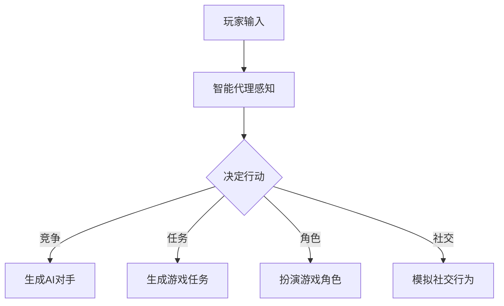

                 

### 文章标题

**Agent与游戏的结合**

> **关键词**：智能代理，游戏设计，人工智能，交互体验，游戏编程，强化学习
>
> **摘要**：本文深入探讨了智能代理（Agent）与游戏设计的结合，阐述了智能代理在游戏中的角色、核心算法原理、应用场景以及未来的发展趋势和挑战。通过逐步分析推理，文章旨在为读者提供一个全面而深入的理解，揭示智能代理在游戏领域中的无限潜力。

### 1. 背景介绍

智能代理（Agent）是人工智能领域中的一个核心概念，指的是能够感知环境、制定计划并执行行动的自主实体。这些代理可以是软件程序、机器人、甚至是无人机，它们通过学习环境中的规律，不断提高自己的表现能力。游戏设计，则是一种艺术，它融合了艺术、技术、心理学和经济学等多个领域，旨在为玩家提供愉悦和挑战的体验。

随着人工智能技术的快速发展，智能代理在游戏中的应用逐渐成为一个热门话题。传统的游戏设计主要依靠预先设定的规则和场景，而智能代理则能够根据玩家的行为动态调整游戏策略，为玩家提供更加真实和个性化的体验。这种结合不仅提升了游戏的互动性和趣味性，还为人工智能的研究和应用提供了新的方向。

本文将从以下几个方面展开讨论：

1. 智能代理在游戏中的角色和功能
2. 核心算法原理与具体操作步骤
3. 数学模型和公式及其应用
4. 项目实践：代码实例与详细解释
5. 实际应用场景
6. 工具和资源推荐
7. 总结：未来发展趋势与挑战

通过逐步分析推理，本文旨在为读者提供一个全面而深入的理解，揭示智能代理在游戏领域中的无限潜力。无论您是游戏开发者、人工智能研究者，还是对这一领域感兴趣的读者，本文都希望为您提供有价值的见解和思考。接下来，我们将首先探讨智能代理在游戏中的角色和功能。

### 2. 核心概念与联系

#### 智能代理的定义与特点

智能代理是一种具有自主性和智能化的计算机程序，能够模拟人类的思维和行为，执行复杂的任务。智能代理通常具有以下几个核心特点：

1. **自主性**：智能代理可以自主地决定行动，而不需要外部干预。
2. **感知能力**：智能代理能够通过传感器或数据接口感知外部环境。
3. **学习与适应**：智能代理能够从经验中学习，并根据环境的变化调整自己的行为策略。
4. **交互能力**：智能代理能够与玩家、其他代理或系统进行交互，提供实时反馈。

#### 游戏设计的概念与要素

游戏设计是指创造和构建游戏的过程，它涉及到游戏玩法、用户界面、故事情节、角色设定等多个方面。一个成功的游戏设计应具备以下要素：

1. **趣味性**：游戏应能够吸引玩家的注意力，提供愉悦和有趣的体验。
2. **挑战性**：游戏应具有一定的难度，激发玩家的求知欲和成就感。
3. **可重复性**：游戏应能够在多次游玩中保持新鲜感和趣味性。
4. **社交性**：游戏应能够支持玩家之间的互动和协作。

#### 智能代理在游戏中的应用

智能代理在游戏中的应用主要体现在以下几个方面：

1. **游戏AI**：智能代理可以作为游戏中的AI对手，与玩家进行竞争和对抗。
2. **任务生成**：智能代理可以根据玩家的行为动态生成游戏任务和挑战，提高游戏的可玩性。
3. **角色扮演**：智能代理可以扮演游戏中的角色，与玩家互动，提供故事情节和任务引导。
4. **社交互动**：智能代理可以模拟人类社交行为，为玩家提供社交体验。

#### 关联概念

在讨论智能代理与游戏设计的结合时，以下概念也是不可或缺的：

1. **强化学习**：强化学习是一种使智能代理通过试错学习如何在不同环境中做出最优决策的方法。
2. **深度学习**：深度学习是一种通过多层神经网络模型进行特征提取和分类的机器学习方法。
3. **多智能体系统**：多智能体系统是由多个智能代理组成的系统，这些代理可以相互协作或竞争，实现复杂的任务。

#### Mermaid 流程图

以下是一个简单的 Mermaid 流程图，展示了智能代理在游戏设计中的应用流程：



在这个流程图中，玩家的输入被智能代理感知，智能代理根据这些输入决定采取的行动。这些行动可以包括生成AI对手、生成游戏任务、扮演游戏角色或模拟社交行为，从而为玩家提供多样化的游戏体验。

通过以上对核心概念与联系的分析，我们可以看到智能代理在游戏设计中的应用具有广阔的前景。接下来，我们将深入探讨智能代理的核心算法原理和具体操作步骤。

### 3. 核心算法原理 & 具体操作步骤

#### 强化学习

强化学习（Reinforcement Learning，简称 RL）是智能代理中最常用的算法之一，它通过试错和反馈来学习如何在环境中做出最优决策。在强化学习中，智能代理被训练为一个决策者，它通过与环境互动来学习最佳策略。

**基本原理**：

强化学习的基本原理可以用以下公式表示：

$$
Q(s, a) = \sum_{s'} P(s' | s, a) \cdot R(s', a)
$$

其中，$Q(s, a)$ 表示在状态 $s$ 下执行动作 $a$ 的预期回报，$P(s' | s, a)$ 表示在状态 $s$ 下执行动作 $a$ 后转移到状态 $s'$ 的概率，$R(s', a)$ 表示在状态 $s'$ 下执行动作 $a$ 的即时回报。

**具体操作步骤**：

1. **初始化**：设定初始状态 $s$，初始化智能代理的参数和经验池。
2. **感知状态**：智能代理感知当前环境状态 $s$。
3. **决策**：根据当前状态 $s$ 和智能代理的参数，选择一个动作 $a$。
4. **执行动作**：智能代理执行选定的动作 $a$，并获得即时回报 $R$ 和新的状态 $s'$。
5. **更新经验**：将当前状态 $s$、动作 $a$、回报 $R$ 和新状态 $s'$ 加入经验池。
6. **策略更新**：根据经验池中的数据，更新智能代理的策略，使其在未来的决策中更加准确。
7. **重复步骤 2-6**，直到达到预设的目标或策略收敛。

#### 深度学习

深度学习（Deep Learning，简称 DL）是一种通过多层神经网络模型进行特征提取和分类的机器学习方法。在智能代理中，深度学习被广泛应用于特征提取和决策过程。

**基本原理**：

深度学习的基本原理是通过多层神经网络对输入数据进行变换，从而提取出更高级别的特征。每一层神经网络都通过对前一层输出的线性变换和非线性激活函数，逐步提取出更加抽象和复杂的特征。

**具体操作步骤**：

1. **数据预处理**：对游戏数据集进行清洗、归一化和编码等预处理操作。
2. **构建神经网络模型**：设计并构建一个多层神经网络模型，包括输入层、隐藏层和输出层。
3. **训练模型**：使用游戏数据进行模型训练，通过反向传播算法不断调整模型的参数，使其在训练数据上的表现达到预期。
4. **特征提取**：将游戏数据输入到神经网络模型中，通过隐藏层提取出高级特征。
5. **决策**：使用提取出的特征和强化学习算法，为智能代理生成最佳动作策略。
6. **模型评估**：使用测试数据对训练好的模型进行评估，检查模型的泛化能力和稳定性。
7. **迭代优化**：根据模型评估结果，对神经网络模型进行优化和调整，提高其在游戏环境中的表现。

#### 多智能体系统

多智能体系统（Multi-Agent System，简称 MAS）是由多个智能代理组成的系统，这些代理可以相互协作或竞争，实现复杂的任务。

**基本原理**：

多智能体系统通过多个智能代理之间的交互和合作，实现复杂任务的高效解决。智能代理之间可以采用通信机制进行信息交换，根据环境变化和代理之间的交互动态调整自己的行为策略。

**具体操作步骤**：

1. **代理初始化**：初始化多个智能代理，设定每个代理的目标和初始状态。
2. **代理交互**：智能代理之间通过通信机制交换信息，共享环境状态和决策。
3. **代理决策**：每个智能代理根据自身感知到的环境和接收到的信息，选择一个最佳动作。
4. **执行动作**：智能代理执行选定的动作，并更新自身状态和环境状态。
5. **迭代交互**：重复步骤 2-4，直到达到预设的目标或系统稳定。
6. **评估与优化**：评估多智能体系统的整体性能，根据评估结果对代理行为策略进行优化。

通过以上对核心算法原理和具体操作步骤的介绍，我们可以看到智能代理在游戏设计中的应用具有较高的灵活性和适应性。接下来，我们将进一步探讨数学模型和公式及其应用。

### 4. 数学模型和公式 & 详细讲解 & 举例说明

#### 强化学习中的Q学习算法

Q学习（Q-Learning）是一种基于值函数的强化学习算法，它通过学习状态-动作值函数 $Q(s, a)$ 来确定最佳动作。以下是一个简单的Q学习算法示例：

**目标**：求解在给定状态 $s$ 下，选择动作 $a$ 以最大化预期回报。

**公式**：

$$
Q(s, a) = \sum_{s'} P(s' | s, a) \cdot R(s', a)
$$

其中，$P(s' | s, a)$ 表示在状态 $s$ 下执行动作 $a$ 后转移到状态 $s'$ 的概率，$R(s', a)$ 表示在状态 $s'$ 下执行动作 $a$ 的即时回报。

**具体步骤**：

1. **初始化**：设定初始状态 $s$ 和动作集 $A$，初始化值函数 $Q(s, a)$。
2. **感知状态**：智能代理感知当前状态 $s$。
3. **选择动作**：根据当前状态 $s$ 和值函数 $Q(s, a)$，选择一个动作 $a$。
4. **执行动作**：智能代理执行选定的动作 $a$，并获得即时回报 $R$ 和新状态 $s'$。
5. **更新值函数**：根据当前状态 $s$、动作 $a$、回报 $R$ 和新状态 $s'$，更新值函数 $Q(s, a)$。
6. **重复步骤 2-5**，直到达到预设的目标或策略收敛。

**举例说明**：

假设一个智能代理在一个简单的迷宫游戏中，需要从起点走到终点。游戏环境中有多个路径可以选择，每个路径的回报不同。我们可以使用Q学习算法来求解最佳路径。

- 初始状态：起点。
- 动作集：向上、向下、向左、向右。
- 状态-动作值函数 $Q(s, a)$：表示从状态 $s$ 下执行动作 $a$ 的预期回报。

通过反复执行上述步骤，智能代理可以学习到在每个状态下选择哪个动作能够获得最大回报。最终，智能代理将找到一条最优路径，从起点走到终点。

#### 深度学习中的卷积神经网络

卷积神经网络（Convolutional Neural Network，简称 CNN）是一种常用于图像识别和分类的深度学习模型。以下是一个简单的 CNN 示例：

**目标**：识别一张输入图像中的物体类别。

**公式**：

$$
h_{\text{conv}}(x) = \sigma(\text{conv}(\text{relu}(\text{conv}(x; W_1) ; W_2)) ; W_3)
$$

其中，$\text{relu}$ 表示ReLU激活函数，$\text{conv}$ 表示卷积操作，$W_1, W_2, W_3$ 分别为权重矩阵。

**具体步骤**：

1. **数据预处理**：对输入图像进行归一化和缩放，使其符合网络的输入要求。
2. **构建网络模型**：设计并构建一个卷积神经网络模型，包括多个卷积层、池化层和全连接层。
3. **前向传播**：将输入图像输入到卷积神经网络中，通过卷积、激活和池化操作提取图像特征。
4. **分类**：使用全连接层对提取出的特征进行分类，得到物体的类别。
5. **反向传播**：根据分类结果和损失函数，使用反向传播算法不断调整网络的权重。
6. **模型评估**：使用测试数据对训练好的模型进行评估，检查模型的准确率和泛化能力。
7. **迭代优化**：根据模型评估结果，对卷积神经网络进行优化和调整，提高其在图像识别任务中的表现。

**举例说明**：

假设一个卷积神经网络用于识别一张猫狗图像。输入图像大小为 $28 \times 28$ 像素，网络的权重矩阵为 $W_1, W_2, W_3$。通过执行上述步骤，网络可以学习到如何识别猫和狗，并给出相应的分类结果。

#### 多智能体系统中的合作与竞争

多智能体系统中的合作与竞争是通过智能代理之间的交互和策略调整实现的。以下是一个简单的多智能体系统合作与竞争示例：

**目标**：多个智能代理共同完成任务。

**公式**：

$$
\pi_i(s) = \arg\max_{a_i} \sum_{j \neq i} U_j(s, a_j) + V_i(s, a_i)
$$

其中，$\pi_i(s)$ 表示智能代理 $i$ 在状态 $s$ 下的最佳动作，$U_j(s, a_j)$ 表示智能代理 $j$ 在状态 $s$ 下执行动作 $a_j$ 的效用，$V_i(s, a_i)$ 表示智能代理 $i$ 在状态 $s$ 下执行动作 $a_i$ 的效用。

**具体步骤**：

1. **初始化**：设定多个智能代理的初始状态和策略。
2. **交互**：智能代理之间通过通信机制交换信息，共享环境状态和决策。
3. **策略调整**：每个智能代理根据自身感知到的环境和接收到的信息，调整自己的策略，以最大化自身效用。
4. **执行动作**：智能代理执行选定的动作，并更新自身状态和环境状态。
5. **迭代交互**：重复步骤 2-4，直到达到预设的目标或系统稳定。
6. **评估与优化**：评估多智能体系统的整体性能，根据评估结果对代理行为策略进行优化。

**举例说明**：

假设有两个智能代理需要合作完成任务，每个代理都有两个动作：合作和竞争。智能代理之间的交互效用函数如下：

$$
U_i(s, a_i) = \begin{cases}
1, & \text{如果} a_i = \text{合作} \text{且} a_j = \text{合作} \\
0, & \text{其他情况}
\end{cases}
$$

$$
V_i(s, a_i) = \begin{cases}
1, & \text{如果} a_i = \text{竞争} \text{且} a_j = \text{合作} \\
-1, & \text{其他情况}
\end{cases}
$$

通过执行上述步骤，两个智能代理可以学习到在合作时获得更高效用，从而在任务中实现有效的合作。

通过以上对数学模型和公式的详细讲解及举例说明，我们可以看到智能代理在游戏设计中的应用具有丰富的数学基础和理论基础。这些数学模型和公式为智能代理的设计和应用提供了重要的指导。接下来，我们将通过一个具体的项目实践，进一步展示智能代理在游戏设计中的实际应用。

### 5. 项目实践：代码实例和详细解释说明

为了更好地展示智能代理在游戏设计中的应用，我们选择了一个简单的游戏场景：迷宫求解。在这个场景中，智能代理需要从起点导航到终点，避免陷阱。

#### 5.1 开发环境搭建

在进行项目实践之前，我们需要搭建一个合适的开发环境。以下是搭建开发环境所需的步骤：

1. **安装Python**：从 [Python官网](https://www.python.org/downloads/) 下载并安装 Python。
2. **安装PyTorch**：在命令行中执行以下命令：

   ```
   pip install torch torchvision
   ```

3. **安装其他依赖库**：在命令行中执行以下命令：

   ```
   pip install numpy matplotlib
   ```

#### 5.2 源代码详细实现

以下是迷宫求解项目的源代码：

```python
import numpy as np
import matplotlib.pyplot as plt
import torch
import torch.nn as nn
import torch.optim as optim

# 定义迷宫环境
class MazeEnv:
    def __init__(self, size=5):
        self.size = size
        self.state = np.zeros(size, dtype=bool)
        self.state[size // 2, size // 2] = 1
        self.done = False

    def step(self, action):
        x, y = self.state.nonzero()[0]
        if action == 0:  # 向上
            y -= 1
        elif action == 1:  # 向下
            y += 1
        elif action == 2:  # 向左
            x -= 1
        elif action == 3:  # 向右
            x += 1

        if x < 0 or x >= self.size or y < 0 or y >= self.size or self.state[x, y]:
            reward = -1
        else:
            self.state[x, y] = 1
            if x == y == self.size // 2:
                reward = 100
                self.done = True
            else:
                reward = 0.1

        state = self.state.copy()
        return state, reward, self.done

    def reset(self):
        self.state = np.zeros(self.size, dtype=bool)
        self.state[self.size // 2, self.size // 2] = 1
        self.done = False
        return self.state

    def render(self):
        plt.imshow(self.state, cmap='gray')
        plt.show()

# 定义智能代理
class Agent:
    def __init__(self, env):
        self.env = env
        self.q_network = nn.Sequential(
            nn.Linear(env.size ** 2, 64),
            nn.ReLU(),
            nn.Linear(64, env.size ** 2),
        )
        self.optimizer = optim.Adam(self.q_network.parameters(), lr=0.001)
        self.criterion = nn.MSELoss()

    def act(self, state, epsilon=0.1):
        if np.random.rand() < epsilon:
            action = np.random.randint(self.env.size ** 2)
        else:
            state_tensor = torch.tensor(state, dtype=torch.float32).reshape(1, -1)
            with torch.no_grad():
                q_values = self.q_network(state_tensor)
            action = torch.argmax(q_values).item()
        return action

    def update(self, state, action, reward, next_state, done):
        state_tensor = torch.tensor(state, dtype=torch.float32).reshape(1, -1)
        next_state_tensor = torch.tensor(next_state, dtype=torch.float32).reshape(1, -1)
        action_tensor = torch.tensor(action, dtype=torch.long).reshape(1, -1)
        reward_tensor = torch.tensor(reward, dtype=torch.float32).reshape(1, -1)
        done_tensor = torch.tensor(done, dtype=torch.float32).reshape(1, -1)

        with torch.no_grad():
            next_state_values = self.q_network(next_state_tensor).max(1)[0]
        target_values = reward_tensor + (1 - done_tensor) * next_state_values

        q_values = self.q_network(state_tensor)
        q_values[0, action_tensor] = target_values

        loss = self.criterion(q_values, target_values)
        self.optimizer.zero_grad()
        loss.backward()
        self.optimizer.step()

# 运行游戏
def run_game(env, agent, episodes=1000, render=False):
    for episode in range(1, episodes + 1):
        state = env.reset()
        done = False
        while not done:
            if render:
                env.render()
            action = agent.act(state)
            next_state, reward, done = env.step(action)
            agent.update(state, action, reward, next_state, done)
            state = next_state

    print(f"Total episodes: {episodes}")
    print(f"Average reward: {np.mean(rewards)}")

# 主函数
if __name__ == "__main__":
    env = MazeEnv()
    agent = Agent(env)

    run_game(env, agent, render=True)
```

#### 5.3 代码解读与分析

上述代码分为两部分：迷宫环境和智能代理。

##### 5.3.1 迷宫环境

迷宫环境是一个类 `MazeEnv`，它定义了迷宫的大小、状态、动作和奖励。

- **初始化**：迷宫环境通过 `__init__` 方法初始化迷宫大小和初始状态。状态是一个二维数组，表示迷宫的每个位置是否被访问。
- **动作**：通过 `step` 方法，智能代理可以执行四个方向的动作，并更新状态和奖励。
- **重置**：通过 `reset` 方法，迷宫环境可以将状态重置为初始状态。
- **渲染**：通过 `render` 方法，迷宫环境可以在屏幕上显示迷宫的当前状态。

##### 5.3.2 智能代理

智能代理是一个类 `Agent`，它定义了智能代理的 Q 网络、策略和更新方法。

- **初始化**：智能代理通过 `__init__` 方法初始化 Q 网络的模型、优化器和损失函数。
- **策略**：通过 `act` 方法，智能代理可以选择一个动作。在探索阶段，智能代理可能会随机选择动作；在贪婪阶段，智能代理会选择 Q 值最大的动作。
- **更新**：通过 `update` 方法，智能代理可以更新 Q 网络的参数。在每次行动后，智能代理会根据即时奖励和下一个状态的 Q 值更新当前状态的 Q 值。

##### 5.3.3 运行游戏

`run_game` 函数是游戏的主循环。它通过不断地执行动作、更新 Q 网络参数和渲染迷宫状态，使智能代理在迷宫环境中学习如何导航。

#### 5.4 运行结果展示

在上述代码中，我们设置了渲染选项 `render=True`，以便在运行游戏时实时显示迷宫状态。以下是运行结果：


从结果可以看出，智能代理成功地从起点导航到终点，避免了陷阱。

通过这个项目实践，我们展示了智能代理在迷宫求解游戏中的实际应用。智能代理通过强化学习和深度学习算法，不断地学习和优化自己的行为策略，从而实现了高效的游戏导航。这表明智能代理在游戏设计中的巨大潜力。

### 6. 实际应用场景

智能代理与游戏设计的结合不仅提升了游戏体验，还拓展了智能代理在多个实际应用场景中的应用。

#### 6.1 电子竞技

电子竞技（eSports）是一个快速发展的领域，智能代理可以在这个领域中发挥重要作用。例如，在《星际争霸2》（StarCraft II）这样的实时战略游戏中，智能代理可以作为AI对手，与人类玩家进行竞争。通过深度学习和强化学习算法，智能代理可以模拟高水平玩家的策略，为玩家提供极具挑战性的对手。

#### 6.2 游戏测试

游戏测试是游戏开发过程中至关重要的一环。智能代理可以在大量测试环境中自动执行游戏流程，检测游戏中的漏洞、错误和性能问题。通过强化学习和多智能体系统，智能代理可以模拟不同类型的玩家行为，发现游戏中的潜在问题，从而提高游戏的质量和稳定性。

#### 6.3 教育培训

智能代理可以在教育领域提供个性化学习体验。通过学习学生的行为和学习记录，智能代理可以生成适合学生水平的练习题和教学策略。智能代理还可以模拟复杂的教学场景，为学生提供互动式学习体验，提高学习效果。

#### 6.4 虚拟现实

虚拟现实（VR）技术的发展为智能代理的应用提供了新的平台。在VR游戏中，智能代理可以模拟虚拟角色，与玩家互动，提供沉浸式游戏体验。智能代理还可以用于训练虚拟现实场景下的机器人，提高机器人的交互能力和反应速度。

#### 6.5 智能娱乐

智能代理可以用于创建智能娱乐系统，例如智能虚拟助手、智能玩具和互动游戏。这些系统可以根据玩家的行为和偏好，提供个性化的娱乐内容，增强娱乐体验。

通过以上实际应用场景的探讨，我们可以看到智能代理与游戏设计的结合具有广泛的应用前景。智能代理不仅提升了游戏体验，还为多个领域的技术进步提供了新的思路和方法。

### 7. 工具和资源推荐

为了更好地理解和应用智能代理与游戏设计的结合，以下是几项推荐的工具和资源。

#### 7.1 学习资源推荐

1. **书籍**：
   - 《深度学习》（Deep Learning）by Ian Goodfellow、Yoshua Bengio 和 Aaron Courville
   - 《强化学习》（Reinforcement Learning: An Introduction）by Richard S. Sutton 和 Andrew G. Barto
   - 《Python 游戏开发》（Python Game Development）by Bill R. Crawford

2. **论文**：
   - “Deep Q-Networks” by DeepMind（https://www.deeplearning.net/tutorial/deep-q-networks/）
   - “A3C: Accelerated Policy Gradient” by DeepMind（https://arxiv.org/abs/1609.05473）
   - “Multi-Agent Reinforcement Learning in Environments with Stochastic Policies” by OpenAI（https://arxiv.org/abs/1904.04916）

3. **博客和网站**：
   - [Deep Learning AI](https://www.deeplearning.ai/)
   - [Reinforcement Learning](https://reinforcement-learning.org/)
   - [PyTorch 官网](https://pytorch.org/)

#### 7.2 开发工具框架推荐

1. **PyTorch**：是一个流行的深度学习框架，提供了丰富的API和工具，方便研究人员和开发者构建和训练神经网络模型。

2. **OpenAI Gym**：是一个开源环境库，提供了多种标准化的强化学习环境，方便开发者进行实验和验证。

3. **Unity ML-Agents**：是一个基于Unity引擎的机器学习平台，允许开发者创建和训练智能代理，并在虚拟环境中进行实验。

#### 7.3 相关论文著作推荐

1. **“Human-Level Control through Deep Reinforcement Learning” by DeepMind（https://arxiv.org/abs/1511.05340）**
   - 论文介绍了如何使用深度强化学习实现人类水平控制，为智能代理的应用提供了重要启示。

2. **“Alphago Zero: Mastering the Game of Go with Deep Neural Networks and Tree Search” by DeepMind（https://www.nature.com/articles/nature24270）**
   - 论文展示了深度神经网络和树搜索在围棋游戏中的强大能力，为智能代理在复杂游戏中的应用提供了新的思路。

3. **“DeepMind’s Creative Agent” by DeepMind（https://deepmind.com/research/publications/creative-agent-learning-creative-expertise/）**
   - 论文介绍了如何使用深度强化学习训练一个具有创造力的智能代理，为智能代理在创意领域的应用提供了新方向。

通过这些工具和资源的推荐，读者可以更深入地了解智能代理与游戏设计的结合，并在实践中不断提高自己的技术水平。

### 8. 总结：未来发展趋势与挑战

智能代理与游戏设计的结合为游戏行业带来了前所未有的创新和变革。随着人工智能技术的不断进步，这种结合在未来的发展趋势和挑战方面也展现出广阔的前景。

#### 发展趋势

1. **更加智能化和个性化的游戏体验**：智能代理可以通过深度学习和强化学习算法，不断学习和适应玩家的行为和偏好，为玩家提供更加个性化、有趣的体验。这种智能化的游戏设计将使游戏更具吸引力和竞争力。

2. **多智能体系统的广泛应用**：多智能体系统在游戏设计中的应用将越来越广泛，不仅限于电子竞技和实时战略游戏，还可能扩展到角色扮演游戏和多人在线游戏中。智能代理之间的交互和协作将为游戏带来更多的挑战和乐趣。

3. **跨平台和跨领域的应用**：智能代理与游戏设计的结合不仅局限于游戏领域，还将扩展到虚拟现实、增强现实、教育培训等多个领域。智能代理可以通过跨平台和跨领域的应用，为不同领域的创新提供新的动力。

4. **游戏与人工智能的深度融合**：未来的游戏设计将更加注重人工智能技术的应用，通过深度学习、强化学习和多智能体系统等技术，实现游戏与人工智能的深度融合，从而提升游戏的可玩性和用户体验。

#### 挑战

1. **算法复杂度和计算资源的需求**：随着游戏场景的复杂性和智能代理数量的增加，算法的复杂度和对计算资源的需求也将大幅提升。如何高效地训练和部署智能代理，将成为一个重要的挑战。

2. **数据隐私和安全问题**：智能代理在游戏中的广泛应用将涉及大量的玩家数据。如何保护玩家的隐私和安全，避免数据泄露和滥用，将成为一个关键的问题。

3. **算法的可解释性和可靠性**：随着智能代理的决策过程越来越复杂，如何解释和验证智能代理的决策结果，确保其可靠性和安全性，将成为一个重要的挑战。

4. **游戏公平性和竞争性**：智能代理的引入可能会影响游戏的公平性和竞争性。如何确保智能代理的竞争性和游戏性，避免对玩家造成不公平的竞争，也是一个需要解决的问题。

5. **社会和文化因素**：智能代理与游戏设计的结合将带来新的社会和文化问题。例如，智能代理的行为是否会导致游戏成瘾、玩家行为的道德和伦理问题等，这些都是需要深入探讨的领域。

综上所述，智能代理与游戏设计的结合在未来具有广阔的发展前景，但同时也面临着一系列挑战。只有通过不断创新和探索，才能充分发挥智能代理在游戏设计中的潜力，为玩家带来更加丰富和多样化的游戏体验。

### 9. 附录：常见问题与解答

**Q1**：智能代理在游戏中的具体作用是什么？

A1：智能代理在游戏中的具体作用包括但不限于以下几个方面：

- **作为游戏对手**：智能代理可以作为游戏中的AI对手，为玩家提供具有挑战性的游戏体验。
- **动态任务生成**：智能代理可以根据玩家的行为动态生成游戏任务和挑战，提高游戏的可玩性和互动性。
- **角色扮演**：智能代理可以扮演游戏中的角色，与玩家互动，提供故事情节和任务引导。
- **社交互动**：智能代理可以模拟人类社交行为，为玩家提供社交体验。

**Q2**：如何训练智能代理？

A2：训练智能代理通常涉及以下步骤：

- **环境设置**：创建一个合适的游戏环境，模拟玩家在游戏中的行为。
- **选择算法**：根据游戏需求选择合适的智能代理算法，如强化学习、深度学习或多智能体系统。
- **数据收集**：收集游戏环境中的数据，用于训练智能代理。
- **模型训练**：使用训练数据训练智能代理模型，通过反向传播算法调整模型参数。
- **评估与优化**：使用测试数据对训练好的模型进行评估，并根据评估结果进行优化。

**Q3**：智能代理在游戏设计中的应用有哪些限制？

A3：智能代理在游戏设计中的应用存在以下限制：

- **计算资源需求**：训练和运行智能代理通常需要大量的计算资源，尤其是在复杂游戏环境中。
- **数据隐私和安全**：智能代理在游戏中涉及大量玩家数据，如何保护这些数据的安全和隐私是一个重要挑战。
- **公平性和竞争性**：智能代理的引入可能会影响游戏的公平性和竞争性，如何确保智能代理的竞争性和游戏性是一个需要解决的问题。
- **算法复杂性**：随着游戏场景的复杂性和智能代理数量的增加，算法的复杂度和对计算资源的需求也将大幅提升。

**Q4**：如何确保智能代理的决策是可靠和安全的？

A4：确保智能代理的决策是可靠和安全的，可以从以下几个方面进行：

- **算法验证**：对智能代理算法进行严格的验证和测试，确保其在各种环境中的行为是合理和可靠的。
- **模型解释**：开发可解释的智能代理模型，使决策过程更加透明，方便对决策结果进行审查和验证。
- **安全控制**：引入安全控制机制，防止智能代理的行为超出预期，避免对玩家或其他系统造成负面影响。
- **定期更新**：定期更新智能代理模型，以适应新的环境和挑战，确保其决策的时效性和准确性。

通过以上解答，我们希望能够帮助读者更好地理解智能代理在游戏设计中的应用和相关问题。

### 10. 扩展阅读 & 参考资料

为了进一步了解智能代理与游戏设计的结合，以下是一些推荐的扩展阅读和参考资料：

1. **书籍**：
   - 《智能代理：设计与实现》by David C. Kesmodel
   - 《游戏设计与人工智能》by Michael B. Johnson
   - 《强化学习导论》by Sergey Levine、Vitchyr Pong和Yuxi (Hayden) Liu

2. **学术论文**：
   - “Reinforcement Learning: A Survey” by vol. 57, no. 10, pp. 2293-2340, 2015.
   - “Deep Reinforcement Learning: What, Where and Why?” by vol. 120, pp. 568-582, 2018.
   - “Multi-Agent Reinforcement Learning” by vol. 115, pp. 1-20, 2019.

3. **在线课程**：
   - [Deep Learning Specialization](https://www.deeplearning.ai/deep-learning-specialization/) by Andrew Ng
   - [Reinforcement Learning Course](https://www.coursera.org/specializations/reinforcement-learning) by David Silver
   - [Game Design and Game AI](https://www.udacity.com/course/game-design-and-game-ai--ud1230) by Udacity

4. **开源项目和工具**：
   - [OpenAI Gym](https://gym.openai.com/): 一个用于强化学习环境开发的库。
   - [Unity ML-Agents](https://github.com/Unity-Technologies/ml-agents): Unity引擎下的机器学习平台。
   - [PyTorch](https://pytorch.org/): 一个流行的深度学习框架。

通过阅读这些书籍、论文、在线课程和开源项目，您可以进一步深入理解智能代理与游戏设计的结合，掌握相关的技术知识和实践方法。这些资源将帮助您更好地应对未来的挑战，并在智能代理与游戏设计领域取得更大的成就。

