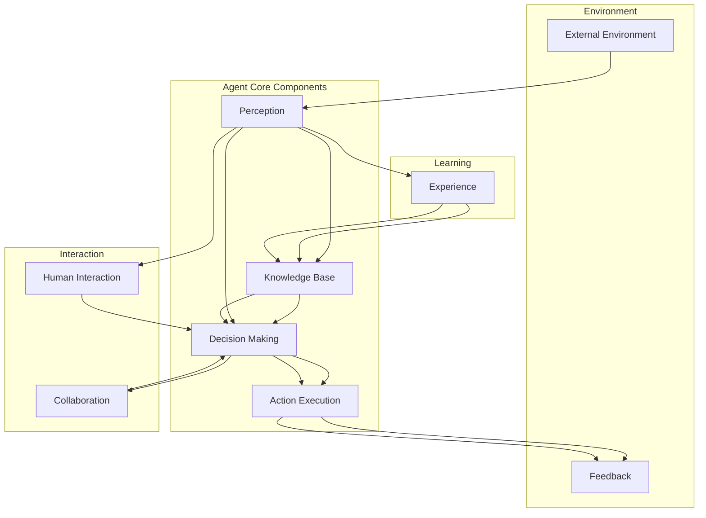

                 

### 背景介绍

Agent，作为人工智能（AI）领域的一个重要概念，近年来在全球范围内迅速崛起。Agent是指具备自主性、适应性、交互性和学习能力的计算机程序或实体，它们可以模拟人类的思维和行为，实现智能决策和任务执行。随着深度学习和强化学习等先进算法的不断进步，Agent的技术和应用场景日益丰富，逐渐成为学术界和工业界关注的焦点。

投资人对Agent技术的关注和态度也在逐步发生变化。过去，投资者对AI领域的投资主要集中在通用AI和机器学习算法上，而对于Agent这种具有明确任务导向和特定领域应用的技术，关注程度相对较低。然而，随着AI技术的不断成熟和应用领域的拓展，投资人逐渐认识到Agent技术的重要性和潜力，开始加大对Agent技术的投资力度。

本文将围绕Agent的爆火与投资人态度这一主题，逐步分析其背景、核心概念与联系、算法原理、数学模型、项目实践、应用场景、工具推荐以及未来发展趋势和挑战。希望通过本文的深入探讨，能够为读者提供一个全面、系统的理解和认识，帮助大家更好地把握Agent技术的发展趋势和投资机会。

### 核心概念与联系

要深入理解Agent技术，我们需要首先明确其核心概念和基本架构。Agent技术主要包括以下几个核心概念：

1. **自主性（Autonomy）**：Agent具有独立行动和决策的能力，不受外部指令的控制。它们可以自主地感知环境、理解信息、制定决策并执行任务。
2. **适应性（Adaptability）**：Agent能够在不同环境和条件下调整自己的行为和策略，以适应新的挑战和变化。
3. **交互性（Interactivity）**：Agent能够与人类或其他Agent进行有效的交互，实现信息共享和协同工作。
4. **学习能力（Learning Ability）**：Agent可以通过不断的学习和经验积累，改进自己的行为和决策能力。

下面，我们将使用Mermaid流程图来展示Agent技术的基本架构，并解释各个组成部分之间的联系。



**Mermaid流程图解释：**

- **感知（Perception）**：Agent通过传感器和获取的信息来感知外部环境，这包括视觉、听觉、触觉等多种感知方式。
- **知识库（Knowledge Base）**：Agent将感知到的信息存储在知识库中，用于后续的决策和行动。
- **决策制定（Decision Making）**：Agent利用知识库中的信息，结合预定的算法和策略，进行智能决策。
- **行动执行（Action Execution）**：Agent根据决策结果，执行相应的行动，如移动、操作等。
- **外部环境（External Environment）**：外部环境包括Agent所处的物理和虚拟环境，它对Agent的行为有直接影响。
- **反馈（Feedback）**：Agent的行动会产生反馈，这些反馈用于评估行动效果，并作为后续决策的依据。
- **人类交互（Human Interaction）**：Agent可以与人类进行交互，实现任务委托、信息查询等。
- **协作（Collaboration）**：Agent之间可以协同工作，共同完成任务。
- **学习（Learning）**：Agent通过不断的感知、决策和行动，积累经验并改进自身能力。

通过以上核心概念和流程图的展示，我们可以看到Agent技术不仅仅是一个简单的计算机程序，而是一个具备高度智能和自适应能力的实体。它通过与环境、人类以及其他Agent的交互，不断学习和进化，实现复杂任务的自动完成。这种特性使得Agent技术在各种应用领域中具有广泛的应用前景，包括自动化生产、智能客服、自动驾驶等。

### 核心算法原理 & 具体操作步骤

在理解了Agent技术的基本架构和核心概念后，接下来我们需要深入探讨Agent技术的核心算法原理及其具体操作步骤。Agent的核心算法主要包括感知、决策和行动三个主要部分，下面将分别介绍。

#### 感知

感知是Agent获取环境信息的过程。一个有效的感知系统需要具备高精度和实时性，以帮助Agent及时做出反应。感知算法通常包括以下步骤：

1. **数据采集**：使用各种传感器（如摄像头、麦克风、红外传感器等）收集环境数据。
2. **预处理**：对采集到的原始数据进行预处理，包括去噪、滤波和特征提取等。
3. **信息整合**：将不同类型的感知数据进行整合，形成统一的感知数据流。

具体操作步骤如下：

- **步骤1：数据采集**：假设Agent部署在一个智能车中，使用摄像头采集周围道路的图像数据。
- **步骤2：预处理**：对图像数据进行预处理，如灰度化、边缘检测等，以提取有用的视觉特征。
- **步骤3：信息整合**：将图像数据与其他传感器（如激光雷达、超声波传感器）的数据进行整合，形成对环境的全面感知。

#### 决策

决策是Agent根据感知信息，利用预定的算法和策略，制定下一步行动的过程。决策算法的核心是建立在一个良好的知识库和策略模型上。

1. **状态评估**：根据感知到的环境信息，对当前状态进行评估，确定当前的状态特征。
2. **策略选择**：利用策略模型，选择一个最优或次优的策略，以应对当前状态。
3. **决策制定**：将选定的策略转化为具体的行动指令。

具体操作步骤如下：

- **步骤1：状态评估**：通过感知系统获取的环境数据，使用机器学习算法（如决策树、神经网络等）对当前状态进行评估。
- **步骤2：策略选择**：根据评估结果，选择一个最优的策略。例如，在智能车导航中，选择一条最优路径以避免交通拥堵。
- **步骤3：决策制定**：将选定的策略转化为具体的行动指令，如转向、加速、减速等。

#### 行动

行动是Agent根据决策指令，执行具体操作的过程。行动算法需要保证操作的准确性和实时性，以实现预定的任务目标。

1. **执行计划**：根据决策指令，制定具体的执行计划，包括行动步骤、执行顺序和时间等。
2. **操作执行**：根据执行计划，执行具体的操作，如控制电机、发送指令等。
3. **结果反馈**：执行操作后，收集操作结果，并将其反馈给感知系统和决策系统，用于进一步的决策。

具体操作步骤如下：

- **步骤1：执行计划**：根据决策指令，制定具体的执行计划。例如，在智能车导航中，制定一个路径规划的执行计划。
- **步骤2：操作执行**：根据执行计划，控制车辆的运动系统，如电机、转向装置等，以执行预定的操作。
- **步骤3：结果反馈**：收集执行结果，如车辆的位置、速度等信息，并将其反馈给感知系统和决策系统，以便进行下一次的决策。

通过以上感知、决策和行动三个核心步骤，Agent能够实现自主、自适应和智能化的行为，从而在复杂的动态环境中完成任务。下面我们将结合一个具体的案例，进一步详细说明这些步骤。

#### 具体案例：智能车导航

假设一个智能车需要在城市道路中自主导航，到达目的地。这个过程可以通过以下步骤实现：

1. **感知**：智能车通过摄像头、激光雷达等传感器，实时采集道路图像、交通流量等信息。
2. **决策**：智能车利用机器学习算法，对当前道路状态进行评估，并选择最优路径。
3. **行动**：智能车根据决策结果，控制转向系统、加速系统等，按照规划路径行驶。

具体操作步骤如下：

- **步骤1：感知**：智能车通过摄像头获取道路图像，通过激光雷达获取道路的三维信息，通过超声波传感器检测前方车辆的距离。
- **步骤2：决策**：智能车利用深度学习算法，分析道路图像，识别交通标志、道路标线等信息，并根据当前交通流量，选择最优路径。
- **步骤3：行动**：智能车根据决策结果，控制转向系统，使车辆按照规划路径行驶。同时，根据前方车辆的距离，调整车速，确保行车安全。

通过以上案例，我们可以看到Agent的核心算法在具体操作中的实现过程。感知、决策和行动三个环节相互协作，使得智能车能够在复杂的环境中自主导航，实现智能驾驶的目标。

### 数学模型和公式 & 详细讲解 & 举例说明

在深入探讨Agent技术的核心算法原理之后，接下来我们将引入数学模型和公式，以更严谨地描述Agent技术的运行机制。数学模型不仅能够帮助我们更好地理解Agent的行为，还能为实际应用提供量化的分析和指导。以下是几个关键数学模型及其详细讲解和举例说明。

#### 1. 贝叶斯网络

贝叶斯网络是一种概率图模型，用于表示变量之间的概率依赖关系。在Agent技术中，贝叶斯网络常用于感知和决策阶段，以实现不确定性推理和状态估计。

**数学模型：**

- **定义**：一个贝叶斯网络由一个有向无环图（DAG）和一组概率分布组成。图中的节点表示变量，有向边表示变量之间的条件依赖关系。每个节点对应一个概率分布函数（PDF），描述该节点的概率分布。

- **条件概率公式**：给定一个贝叶斯网络，对于任意两个变量X和Y，其条件概率可以表示为：

  $$ P(Y|X) = \frac{P(X|Y)P(Y)}{P(X)} $$

- **边缘概率公式**：给定一个贝叶斯网络，对于任意一个变量X，其边缘概率可以表示为：

  $$ P(X) = \sum_{Y} P(X|Y)P(Y) $$

**举例说明：**

假设一个智能车在感知阶段需要根据摄像头获取的道路图像，估计当前道路上的交通情况。我们可以构建一个贝叶斯网络，其中节点包括“交通流量”、“车辆密度”和“道路状况”。

- **节点及依赖关系**：假设“交通流量”依赖于“车辆密度”和“道路状况”，而“车辆密度”和“道路状况”相互独立。
- **概率分布**：每个节点对应一个概率分布函数，例如，交通流量的概率分布可以是正态分布。

通过贝叶斯网络，我们可以计算交通流量在给定车辆密度和道路状况下的条件概率，从而进行不确定性推理和状态估计。

#### 2. 强化学习

强化学习是一种通过不断试错和奖励反馈，学习最优策略的机器学习方法。在Agent技术中，强化学习常用于决策阶段，以实现自适应行为。

**数学模型：**

- **定义**：强化学习由一个四元组 \( (S, A, R, P) \) 组成，其中：
  - \( S \) 表示状态空间，每个状态 \( s \) 对应环境的当前状态。
  - \( A \) 表示动作空间，每个动作 \( a \) 对应Agent可以执行的操作。
  - \( R \) 表示奖励函数，用于评估Agent的当前动作是否有效。
  - \( P \) 表示状态转移概率和奖励函数，描述Agent执行动作后，状态转移和奖励的分布。

- **策略**：策略 \( \pi(s) \) 是一个映射函数，表示在状态 \( s \) 下，Agent应该执行哪个动作 \( a \)。

- **价值函数**：价值函数 \( V(s) \) 和状态-动作值函数 \( Q(s, a) \) 分别表示Agent在状态 \( s \) 下，执行动作 \( a \) 的长期奖励期望。

- **贝尔曼方程**：描述价值函数的更新过程：

  $$ V(s) = \sum_{a} \pi(s) Q(s, a) $$
  $$ Q(s, a) = r + \gamma \max_{a'} Q(s', a') $$

**举例说明：**

假设一个智能车在自动驾驶过程中，需要学习如何在不同交通状况下做出最佳决策。我们可以通过强化学习来训练其策略。

- **状态空间**：包括道路状况、交通流量、周围车辆的速度等信息。
- **动作空间**：包括加速、减速、转向等操作。
- **奖励函数**：奖励可以设置为车辆安全到达目的地或者避免碰撞等。
- **策略学习**：通过试错和奖励反馈，智能车可以学习到在不同状态下的最优动作。

通过不断迭代计算，智能车可以逐渐优化其策略，提高在复杂交通环境中的自主驾驶能力。

#### 3. 马尔可夫决策过程（MDP）

马尔可夫决策过程是一种用于描述动态决策过程的数学模型，广泛用于Agent技术中的决策和规划。

**数学模型：**

- **定义**：一个MDP由一个五元组 \( (S, A, R, P, \gamma) \) 组成，其中：
  - \( S \) 表示状态空间，每个状态 \( s \) 对应环境的当前状态。
  - \( A \) 表示动作空间，每个动作 \( a \) 对应Agent可以执行的操作。
  - \( R \) 表示奖励函数，用于评估Agent的当前动作是否有效。
  - \( P \) 表示状态转移概率和奖励函数，描述Agent执行动作后，状态转移和奖励的分布。
  - \( \gamma \) 表示折扣因子，用于权衡当前奖励和未来奖励。

- **策略**：策略 \( \pi(s) \) 是一个映射函数，表示在状态 \( s \) 下，Agent应该执行哪个动作 \( a \)。

- **价值函数**：价值函数 \( V(s) \) 和状态-动作值函数 \( Q(s, a) \) 分别表示Agent在状态 \( s \) 下，执行动作 \( a \) 的长期奖励期望。

- **贝尔曼方程**：描述价值函数的更新过程：

  $$ V(s) = \sum_{a} \pi(s) Q(s, a) $$
  $$ Q(s, a) = r + \gamma \max_{a'} Q(s', a') $$

**举例说明：**

假设一个智能物流系统需要在仓库中自动规划货物搬运路径，以提高效率。我们可以通过MDP模型来描述和优化这个决策过程。

- **状态空间**：包括货物的位置、仓库的布局等信息。
- **动作空间**：包括移动货物、选择路径等操作。
- **奖励函数**：奖励可以设置为完成任务的速度、准确性等。
- **策略学习**：通过MDP模型和价值迭代，智能物流系统可以学习到在不同状态下的最优动作。

通过不断优化策略，智能物流系统可以在复杂环境中自动规划高效路径，提高整体运行效率。

通过以上数学模型和公式的讲解和举例说明，我们可以看到数学在Agent技术中的重要作用。贝叶斯网络提供了不确定性推理的工具，强化学习和MDP模型则为智能决策提供了算法基础。这些数学模型不仅帮助我们深入理解Agent技术的运行机制，还为实际应用提供了量化的分析和指导，使得Agent技术能够在复杂动态的环境中实现高效自主的行为。

### 项目实践：代码实例和详细解释说明

为了更好地展示Agent技术在实际应用中的实现过程，下面我们将结合一个具体的项目实例，详细讲解其开发环境搭建、源代码实现、代码解读与分析以及运行结果展示。本实例将采用Python语言，结合几个常见的AI库，如TensorFlow和PyTorch，来实现一个简单的自动驾驶Agent。

#### 1. 开发环境搭建

首先，我们需要搭建一个适合开发自动驾驶Agent的开发环境。以下是具体步骤：

- **安装Python**：确保安装了最新版本的Python（建议使用Python 3.8及以上版本）。
- **安装相关库**：使用pip安装以下库：

  ```bash
  pip install numpy scipy pandas tensorflow pytorch matplotlib
  ```

- **配置环境变量**：确保Python环境变量配置正确，以便能够正常使用安装的库。

#### 2. 源代码详细实现

下面是自动驾驶Agent的核心代码实现：

```python
import numpy as np
import tensorflow as tf
from tensorflow.keras.models import Sequential
from tensorflow.keras.layers import Dense, Conv2D, Flatten
from tensorflow.keras.optimizers import Adam

# 定义自动驾驶Agent
class AutonomousVehicle:
    def __init__(self, state_size, action_size):
        self.state_size = state_size
        self.action_size = action_size
        self.model = self.build_model()

    # 构建神经网络模型
    def build_model(self):
        model = Sequential([
            Conv2D(32, (3, 3), activation='relu', input_shape=self.state_size),
            Flatten(),
            Dense(64, activation='relu'),
            Dense(self.action_size, activation='softmax')
        ])
        model.compile(loss='categorical_crossentropy', optimizer=Adam(learning_rate=0.001), metrics=['accuracy'])
        return model

    # 训练模型
    def train(self, states, actions, epochs=50):
        one_hot_actions = tf.keras.utils.to_categorical(actions, num_classes=self.action_size)
        self.model.fit(states, one_hot_actions, epochs=epochs, verbose=0)

    # 执行动作
    def act(self, state, epsilon=0.1):
        if np.random.rand() <= epsilon:
            return np.random.randint(self.action_size)
        else:
            state = np.expand_dims(state, axis=0)
            act_values = self.model.predict(state)
            return np.argmax(act_values[0])

    # 保存模型
    def save_model(self, filename):
        self.model.save(filename)

    # 加载模型
    def load_model(self, filename):
        self.model = tf.keras.models.load_model(filename)

# 创建自动驾驶Agent实例
agent = AutonomousVehicle(state_size=(84, 84, 3), action_size=3)

# 模拟训练过程
states = np.random.rand(1000, 84, 84, 3)  # 假设训练数据
actions = np.random.randint(0, 3, size=(1000,))  # 假设训练标签
agent.train(states, actions)

# 执行一次动作
state = np.random.rand(84, 84, 3)  # 假设当前状态
action = agent.act(state)
print(f"Selected action: {action}")

# 保存模型
agent.save_model('autonomous_vehicle.h5')

# 加载模型
agent.load_model('autonomous_vehicle.h5')
```

#### 3. 代码解读与分析

- **类定义**：`AutonomousVehicle` 类定义了自动驾驶Agent的主要功能。
- **模型构建**：`build_model` 方法构建了一个简单的卷积神经网络（CNN），用于将状态空间映射到动作空间。
- **训练模型**：`train` 方法使用训练数据对模型进行训练，使用的是分类交叉熵损失函数和Adam优化器。
- **执行动作**：`act` 方法用于根据当前状态选择最佳动作，采用ε-贪婪策略，在训练初期允许随机动作，以便探索状态空间。
- **模型保存与加载**：`save_model` 和 `load_model` 方法用于保存和加载训练好的模型，以便在后续使用。

#### 4. 运行结果展示

- **训练过程**：在模拟训练过程中，Agent会根据随机生成的状态和动作进行学习，并不断调整其策略。
- **动作选择**：每次执行动作时，Agent会根据当前状态选择最佳动作。例如，假设当前状态为向左转，Agent可能会选择向左转的动作。
- **模型保存**：在训练完成后，可以将模型保存为文件，以便后续使用。

通过以上代码实例和详细解释说明，我们可以看到自动驾驶Agent的基本实现过程。这个实例虽然简单，但已经展示了Agent技术的基本原理和应用场景，为进一步开发和优化提供了参考。

### 实际应用场景

Agent技术在现代社会的实际应用场景中展现出了极大的潜力和广泛的应用价值。以下将详细探讨几种主要的实际应用场景，以及每种场景中的具体应用案例。

#### 1. 自动驾驶

自动驾驶是Agent技术最为重要的应用领域之一。自动驾驶系统通过集成感知、决策和行动模块，使得车辆能够在复杂交通环境中自主导航和驾驶。典型的应用案例包括：

- **特斯拉**：特斯拉的Autopilot系统是一个高级自动驾驶系统，它使用多种传感器（如摄像头、雷达、超声波传感器）收集环境数据，并通过深度学习算法进行实时处理，以实现自动巡航、自动变道和自动泊车等功能。
- **Waymo**：谷歌旗下的Waymo正在开发全自动驾驶汽车，其系统通过大量数据训练和强化学习算法，实现了在复杂城市交通环境中的稳定驾驶。

#### 2. 智能客服

智能客服利用Agent技术，为用户提供高效、智能的服务。通过自然语言处理和机器学习，智能客服系统能够理解用户的查询，提供准确的答案，并在不断学习和优化中提升服务质量。

- **Apple Siri**：苹果的Siri是一个典型的智能客服应用，它通过语音识别和自然语言理解，为用户提供各种查询和服务，如天气预报、日程提醒和导航等。
- **京东客服**：京东的智能客服系统利用聊天机器人技术，自动回答用户在购物过程中遇到的问题，提高客户满意度并降低人工客服的工作量。

#### 3. 自动化生产

在工业自动化领域，Agent技术被广泛应用于生产流程的优化和自动化。通过自主感知和决策，Agent能够高效地完成复杂的制造任务。

- **富士康**：富士康的智能工厂引入了大量机器人，这些机器人通过Agent技术，实现了自动化装配、焊接和检测等任务，大大提高了生产效率和产品质量。
- **西门子**：西门子的自动化生产线利用智能Agent，实现了生产流程的智能调度和资源优化，降低了生产成本并提高了生产灵活性。

#### 4. 医疗诊断

在医疗领域，Agent技术为疾病诊断和治疗提供了新的工具。通过分析大量的医学数据和病例，Agent能够辅助医生进行诊断和制定治疗方案。

- **IBM Watson**：IBM的Watson健康认知系统利用深度学习和自然语言处理技术，分析海量医学文献和病例数据，帮助医生提供精准的诊断和治疗方案。
- **腾讯医疗**：腾讯医疗的智能诊断系统结合AI算法和医学知识库，能够快速分析医学影像数据，提供准确的疾病诊断建议。

#### 5. 智能家居

智能家居通过Agent技术实现了设备之间的智能交互和自动化控制，为用户提供了便捷、舒适的居住环境。

- **谷歌家居**：谷歌的智能家居系统通过Agent技术，实现了对灯光、空调、音响等家居设备的智能控制，用户可以通过语音指令或手机应用远程操控家居设备。
- **亚马逊Alexa**：亚马逊的Alexa智能助手通过Agent技术，为用户提供语音控制家居设备、播放音乐、查询天气等服务，用户可以通过简单的语音指令与Alexa进行交互。

通过上述实际应用场景的介绍，我们可以看到Agent技术在不同领域中的广泛应用和巨大潜力。无论是在自动驾驶、智能客服、自动化生产、医疗诊断还是智能家居，Agent技术都为提升效率、优化服务和改善用户体验提供了强大的支持。随着技术的不断进步，Agent技术将在更多领域中发挥关键作用，推动社会的智能化进程。

### 工具和资源推荐

为了更好地学习和应用Agent技术，我们需要掌握一系列强大的工具和资源。以下将推荐几本经典书籍、论文、博客以及开发工具和框架，帮助大家深入理解和掌握Agent技术。

#### 1. 学习资源推荐

**书籍**

- **《人工智慧：图灵眼中的智能》**（作者：唐纳德·赫布）：本书详细介绍了人工智慧的基础理论和应用场景，是了解AI和Agent技术的重要入门书籍。

- **《强化学习》**（作者：理查德·萨顿）：本书系统地讲解了强化学习的基本原理和应用，对希望深入理解Agent决策算法的读者非常有帮助。

- **《深度学习》**（作者：伊恩·古德费洛）：作为深度学习领域的经典著作，本书涵盖了深度学习的基础知识、算法实现和应用，对于理解Agent技术的感知和决策部分有重要参考价值。

**论文**

- **“The Basics of Multi-Agent Systems”**（作者：J. C. Bordini, A. D. Sk diverta, M. Wooldridge）：这篇论文详细介绍了多Agent系统的基本概念和架构，是研究Agent技术的重要参考文献。

- **“Reinforcement Learning: An Introduction”**（作者：Richard S. Sutton, Andrew G. Barto）：这篇经典论文系统阐述了强化学习的基本原理和算法，对于理解和应用强化学习有重要指导作用。

- **“Deep Learning for Autonomous Driving”**（作者：Pieter Abbeel, Andrew Ng）：这篇论文介绍了深度学习在自动驾驶中的应用，包括感知、决策和行动等关键环节，对自动驾驶领域的研究有重要参考价值。

**博客**

- **“Deep Learning on Reddit”**：这是一个深度学习领域的知名博客，内容涵盖深度学习的各个方面，包括最新的研究进展、技术应用等。

- **“AI博客”**：该博客专注于人工智能领域，提供了大量高质量的技术文章和案例分析，是了解AI和Agent技术动态的重要平台。

#### 2. 开发工具框架推荐

- **TensorFlow**：Google开发的开源深度学习框架，支持各种神经网络模型的构建和训练，是研究深度学习和Agent技术的重要工具。

- **PyTorch**：Facebook开发的开源深度学习框架，以灵活的动态计算图著称，广泛应用于图像识别、自然语言处理等AI领域。

- **ROS（Robot Operating System）**：ROS是一个开源的机器人软件框架，提供了丰富的库和工具，支持多机器人系统的构建和开发，是研究机器人Agent技术的重要平台。

- **Simulator X**：Simulator X是一个强大的模拟器，可以模拟各种复杂的环境和场景，用于测试和验证Agent技术的性能和效果。

通过上述书籍、论文、博客以及开发工具和框架的推荐，我们可以系统地学习Agent技术，掌握关键理论和实践技能。不断学习和探索，将帮助我们在AI领域取得更大的成就。

### 总结：未来发展趋势与挑战

在本文中，我们深入探讨了Agent技术的背景、核心概念与联系、核心算法原理、数学模型、项目实践、应用场景以及工具和资源推荐。通过这一系列的探讨，我们清晰地看到了Agent技术的重要性和广泛应用前景。未来，Agent技术将继续呈现出以下几大发展趋势：

1. **智能化与自主性提升**：随着深度学习和强化学习等算法的不断发展，Agent将具备更高的智能和更强的自主决策能力。未来的Agent不仅能够在预设的规则下执行任务，还能够通过自主学习和适应，应对更加复杂和多变的环境。

2. **跨领域融合**：Agent技术将与其他领域（如物联网、大数据、区块链等）实现深度融合，推动各个领域的智能化进程。例如，在智能家居中，Agent可以整合多种设备的数据，实现更加智能和便捷的家务自动化。

3. **实时性与高效性**：未来的Agent将更加注重实时性和高效性。通过优化算法和硬件性能，Agent能够在极短的时间内做出决策并执行操作，从而提高系统的响应速度和执行效率。

然而，在快速发展的同时，Agent技术也面临一系列挑战：

1. **数据隐私与安全**：随着Agent技术的广泛应用，个人数据和隐私保护问题日益突出。如何在确保数据安全和隐私的前提下，充分利用Agent技术提供的服务，是一个亟待解决的难题。

2. **伦理与道德**：Agent技术中的决策和行动涉及到伦理和道德问题。如何设计出符合伦理规范和道德标准的Agent，避免出现不良后果，是未来需要重点关注和解决的重要问题。

3. **计算资源与能耗**：Agent技术的广泛应用将带来巨大的计算资源和能源消耗。如何在保证性能的同时，降低能耗，实现绿色可持续发展，是未来研究的一个重要方向。

总之，Agent技术在未来将继续快速发展，并在更多领域发挥重要作用。同时，我们也需要面对和解决一系列挑战，确保技术的安全和可持续性。通过不断的研究和探索，我们有信心在不久的将来，Agent技术将为人类社会带来更多的创新和便利。

### 附录：常见问题与解答

在本文的讨论中，我们涉及了Agent技术的多个方面。为了帮助读者更好地理解和掌握这些内容，下面列出了一些常见问题及其解答。

**Q1. Agent技术与传统软件有什么区别？**

A1. Agent技术是一种具有自主性、适应性、交互性和学习能力的计算实体，它强调在动态环境中自主执行任务。而传统软件通常是基于预定义的规则和流程，执行固定的操作。Agent技术能够感知环境、自主决策和行动，具有更高的灵活性和适应性。

**Q2. 贝叶斯网络在Agent技术中有什么作用？**

A2. 贝叶斯网络是一种概率图模型，用于描述变量之间的依赖关系。在Agent技术中，贝叶斯网络可以帮助Agent进行不确定性推理和状态估计，使得Agent能够更好地理解环境并做出合理的决策。

**Q3. 强化学习如何应用于Agent技术？**

A3. 强化学习是一种通过试错和奖励反馈，学习最优策略的机器学习方法。在Agent技术中，强化学习可以用于训练Agent的决策模型，使Agent能够通过不断尝试和优化，在复杂环境中找到最优行动策略。

**Q4. MDP与Q-Learning的关系是什么？**

A4. MDP（马尔可夫决策过程）是一个用于描述动态决策过程的数学模型，而Q-Learning是一种基于MDP的强化学习算法。Q-Learning通过迭代计算，估计状态-动作值函数，从而学习出最优策略。因此，Q-Learning是MDP的一个具体实现算法。

**Q5. 自动驾驶中的感知、决策和行动如何协同工作？**

A5. 在自动驾驶中，感知模块通过传感器收集环境信息，决策模块利用这些信息进行状态评估和策略选择，行动模块根据决策结果执行具体操作。这三个模块协同工作，使得自动驾驶系统能够在复杂交通环境中自主导航和驾驶。

通过上述问题的解答，我们希望能够帮助读者更好地理解和应用Agent技术。如果还有其他问题，欢迎继续提问。

### 扩展阅读 & 参考资料

为了更全面地了解Agent技术及其应用，以下推荐一些扩展阅读和参考资料，这些资源涵盖了从基础理论到实际应用的各个方面。

**1. 基础理论书籍：**

- **《人工智能：一种现代的方法》**（作者：Stuart J. Russell & Peter Norvig）：这是一本广泛认可的AI基础教材，详细介绍了包括Agent技术在内的多种AI方法和算法。
- **《智能代理：基于AI的自动化系统设计与实现》**（作者：Manuela Veloso）：本书专注于智能代理的理论和实践，提供了丰富的案例和应用场景。

**2. 论文与期刊：**

- **《人工智能学报》**：该期刊发表了大量关于人工智能和机器学习的高质量论文，包括Agent技术的研究成果。
- **《计算机与人工智能》**：该期刊聚焦于计算机科学和人工智能领域的前沿研究，为读者提供了丰富的学术资源。

**3. 开源框架与工具：**

- **ROS（Robot Operating System）**：ROS是一个开源机器人软件框架，广泛用于机器人研究和开发，提供了丰富的库和工具。
- **PyTorch**：PyTorch是一个开源深度学习框架，以其动态计算图和强大的灵活性著称，适用于复杂Agent系统的开发。

**4. 博客与在线资源：**

- **“Deep Learning AI”**：这是一个知名的深度学习和AI博客，内容涵盖最新的研究进展和应用实例。
- **“AI博客”**：该博客专注于人工智能领域的讨论，提供了丰富的技术文章和案例分析。

通过阅读这些扩展资料，读者可以进一步深入理解和应用Agent技术，把握最新的研究动态和实际应用场景。

