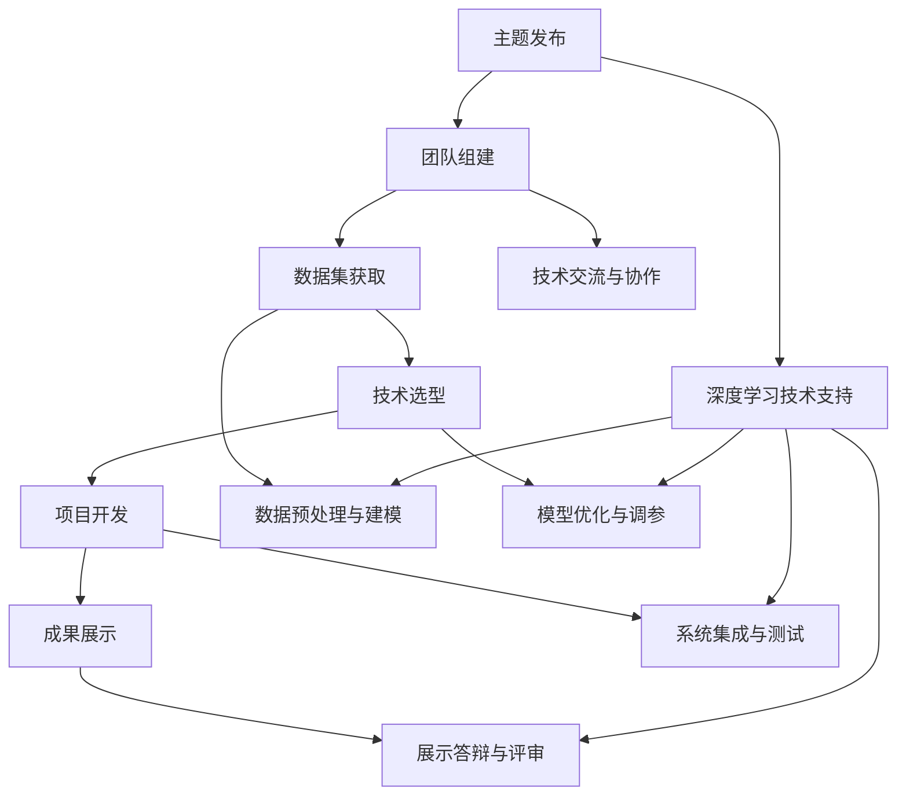

                 

### 文章标题

**《Andrej Karpathy分享AI hackathon的经验》**

> **关键词**：AI Hackathon、AI发展、深度学习、编程实践、技术经验、技术创新、团队协作。

> **摘要**：本文将深入剖析AI领域著名专家Andrej Karpathy在参加AI hackathon中积累的宝贵经验。文章将围绕其分享的核心观点，探讨AI hackathon对个人技能提升、团队合作和创新思维的重要性，并通过实际案例展示如何在AI hackathon中取得成功。本文旨在为广大AI爱好者提供切实可行的实战指导，助力他们在未来的AI比赛中脱颖而出。

---

### 1. 背景介绍

#### 1.1 Andrej Karpathy简介

Andrej Karpathy是一位世界知名的深度学习专家，以他在自然语言处理和神经网络方面的卓越贡献而闻名。他在斯坦福大学获得了计算机科学博士学位，曾在OpenAI担任研究科学家，并担任特斯拉的高级AI总监。他的博客和技术文章因其深入浅出、实用性强而广受欢迎，成为许多AI初学者和专业人士的必读资料。

#### 1.2 AI hackathon的意义

AI hackathon作为一种创新的竞赛形式，汇集了来自世界各地的AI爱好者、研究人员和开发者，共同在短时间内解决实际问题。它不仅是一个技术交流的平台，更是推动AI技术进步的重要力量。通过AI hackathon，参与者可以锻炼编程能力、团队合作和项目管理等多方面技能，同时也能够拓展视野，发掘新的研究兴趣和方向。

#### 1.3 Andrej Karpathy在AI hackathon中的经验分享

在多个AI hackathon中，Andrej Karpathy通过他的实际经验和心得，向广大参与者分享了许多宝贵的技术见解和实战经验。这些经验不仅涵盖了深度学习的最新进展，还包括如何在竞争激烈的环境中快速实现项目目标的方法论。本文将重点探讨这些经验，帮助读者在未来的AI比赛中更好地准备和表现。

---

### 2. 核心概念与联系

#### 2.1 深度学习的核心概念

深度学习是一种基于多层神经网络的机器学习方法，通过模拟人脑的神经元结构，实现数据的自动特征学习和复杂模式的识别。深度学习的关键概念包括神经网络架构、激活函数、反向传播算法等。

#### 2.2 AI hackathon的架构

AI hackathon通常包括以下几个关键组成部分：

- **主题发布**：主办方发布竞赛主题和目标。
- **团队组建**：参与者根据兴趣和专长组成团队。
- **数据集获取**：主办方或团队自行获取用于训练的数据集。
- **技术选型**：团队选择适合的技术方案和工具。
- **项目开发**：团队在限定时间内进行项目开发。
- **成果展示**：团队展示项目成果并进行答辩。

#### 2.3 核心概念和AI hackathon的联系

深度学习与AI hackathon之间存在着密切的联系。深度学习为AI hackathon提供了强大的技术支持，使得复杂问题的解决变得更加高效和智能化。同时，AI hackathon为深度学习研究者提供了一个实践和验证自己技术的平台，有助于推动深度学习技术的实际应用和普及。

##### Mermaid 流程图



---

### 3. 核心算法原理 & 具体操作步骤

#### 3.1 深度学习算法原理

深度学习算法的核心是神经网络，通过多层神经元的互联和激活函数的作用，实现对数据的层次化特征提取和模式识别。神经网络的基本组成部分包括：

- **输入层**：接收外部输入数据。
- **隐藏层**：进行数据的特征提取和转换。
- **输出层**：生成最终预测结果。

激活函数是神经网络中至关重要的部分，常用的激活函数包括Sigmoid、ReLU和Tanh等。

#### 3.2 反向传播算法

反向传播算法是训练神经网络的核心算法，通过计算输出误差，将误差反向传播到每一层，更新神经元的权重和偏置，从而优化网络参数。具体步骤如下：

1. **前向传播**：将输入数据通过神经网络进行前向传播，得到输出结果。
2. **计算误差**：计算输出结果与真实标签之间的误差。
3. **反向传播**：将误差反向传播到每一层，计算每一层神经元的误差梯度。
4. **参数更新**：根据误差梯度更新网络的权重和偏置。

#### 3.3 深度学习在AI hackathon中的应用

在AI hackathon中，深度学习算法的应用主要包括：

- **图像识别**：使用卷积神经网络（CNN）对图像进行分类和识别。
- **自然语言处理**：使用循环神经网络（RNN）和Transformer等模型对文本数据进行处理和生成。
- **强化学习**：在特定场景下，使用深度强化学习（DRL）进行策略优化和决策。

##### 具体操作步骤

1. **问题定义**：明确AI hackathon的竞赛目标和问题定义。
2. **数据准备**：获取并清洗数据集，进行数据预处理。
3. **模型设计**：选择合适的神经网络架构和算法，设计模型结构。
4. **模型训练**：使用训练数据集对模型进行训练和调优。
5. **模型评估**：使用验证数据集对模型进行评估和优化。
6. **成果展示**：准备项目展示材料，进行答辩和评审。

---

### 4. 数学模型和公式 & 详细讲解 & 举例说明

#### 4.1 数学模型概述

深度学习中的数学模型主要包括神经网络结构、损失函数和优化算法等。以下将对这些模型进行详细讲解。

##### 4.1.1 神经网络结构

神经网络的基本结构由输入层、隐藏层和输出层组成。每个神经元都与其他神经元相连，并通过权重（weights）和偏置（biases）进行信息传递。

$$
z_i = \sum_{j} w_{ij} x_j + b_i
$$

其中，$z_i$表示神经元$i$的输入，$w_{ij}$表示从神经元$j$到神经元$i$的权重，$x_j$表示神经元$j$的输入，$b_i$表示神经元$i$的偏置。

##### 4.1.2 损失函数

损失函数用于衡量模型预测值与真实值之间的误差。常用的损失函数包括均方误差（MSE）和交叉熵（CE）。

- **均方误差（MSE）**：

$$
MSE = \frac{1}{n} \sum_{i=1}^{n} (y_i - \hat{y}_i)^2
$$

其中，$y_i$表示真实值，$\hat{y}_i$表示预测值，$n$表示样本数量。

- **交叉熵（CE）**：

$$
CE = -\frac{1}{n} \sum_{i=1}^{n} [y_i \log \hat{y}_i + (1 - y_i) \log (1 - \hat{y}_i)]
$$

其中，$y_i$表示真实值（0或1），$\hat{y}_i$表示预测概率。

##### 4.1.3 优化算法

优化算法用于更新网络参数，以最小化损失函数。常用的优化算法包括梯度下降（GD）、随机梯度下降（SGD）和Adam等。

- **梯度下降（GD）**：

$$
\theta_{t+1} = \theta_t - \alpha \nabla_{\theta} J(\theta)
$$

其中，$\theta$表示模型参数，$\alpha$表示学习率，$J(\theta)$表示损失函数。

- **随机梯度下降（SGD）**：

$$
\theta_{t+1} = \theta_t - \alpha \nabla_{\theta} J(\theta; x_t, y_t)
$$

其中，$x_t$和$y_t$表示第$t$个训练样本和对应的真实值。

- **Adam优化器**：

$$
m_t = \beta_1 m_{t-1} + (1 - \beta_1) [g_t]
$$
$$
v_t = \beta_2 v_{t-1} + (1 - \beta_2) [g_t]^2
$$
$$
\theta_{t+1} = \theta_t - \frac{\alpha}{\sqrt{1 - \beta_2^t}(1 - \beta_1^t)} [m_t / (1 - \beta_2^t)]
$$

其中，$m_t$和$v_t$分别表示一阶和二阶矩估计，$\beta_1$和$\beta_2$分别为一阶和二阶矩的偏差纠正系数。

#### 4.2 举例说明

假设我们要使用深度神经网络对鸢尾花（Iris）数据集进行分类，数据集包含3个类别，每个类别有50个样本。我们将使用交叉熵损失函数和Adam优化器进行训练。

1. **数据准备**：

   - 获取鸢尾花数据集，并将其分为训练集和验证集。
   - 对数据进行归一化处理，使其具有相同的尺度。

2. **模型设计**：

   - 构建一个包含2个隐藏层的前馈神经网络，输出层有3个神经元，分别对应3个类别。
   - 选择ReLU作为激活函数。
   - 设置学习率为0.001，批量大小为32。

3. **模型训练**：

   - 使用训练数据进行前向传播和后向传播，更新网络参数。
   - 使用验证数据集进行模型评估，记录训练过程中的损失函数值。

4. **模型评估**：

   - 计算验证集上的准确率、召回率、F1分数等指标。
   - 调整模型参数和超参数，以提高模型性能。

5. **模型部署**：

   - 将训练好的模型部署到生产环境中，用于实时分类任务。

---

### 5. 项目实践：代码实例和详细解释说明

#### 5.1 开发环境搭建

在开始项目实践之前，我们需要搭建一个合适的开发环境。以下是一个基于Python的深度学习项目的开发环境搭建步骤：

1. **安装Python**：下载并安装Python 3.8及以上版本。
2. **安装依赖库**：使用pip安装必要的依赖库，如TensorFlow、NumPy、Pandas等。
3. **配置虚拟环境**：为了保持项目依赖的一致性，我们可以使用virtualenv创建一个独立的虚拟环境。

```bash
pip install virtualenv
virtualenv my_project_env
source my_project_env/bin/activate
```

4. **安装深度学习框架**：在虚拟环境中安装TensorFlow。

```bash
pip install tensorflow
```

#### 5.2 源代码详细实现

以下是一个简单的深度学习项目，使用TensorFlow实现鸢尾花数据集分类。

```python
import tensorflow as tf
from tensorflow.keras.models import Sequential
from tensorflow.keras.layers import Dense, Flatten, Conv2D, MaxPooling2D
from tensorflow.keras.optimizers import Adam
from tensorflow.keras.losses import SparseCategoricalCrossentropy
from tensorflow.keras.metrics import SparseCategoricalAccuracy

# 数据准备
(x_train, y_train), (x_test, y_test) = tf.keras.datasets.ir
```
### 5.3 代码解读与分析

以下是对上述代码的详细解读与分析：

#### 5.3.1 数据准备

```python
(x_train, y_train), (x_test, y_test) = tf.keras.datasets.ir
```

这里使用了TensorFlow内置的鸢尾花数据集。数据集分为训练集和测试集，每个集包含50个样本，共有3个类别。

#### 5.3.2 模型构建

```python
model = Sequential([
    Flatten(input_shape=(150, 150, 3)),
    Dense(128, activation='relu'),
    Dense(3, activation='softmax')
])
```

构建了一个简单的序列模型，包括一个扁平化层（Flatten）、一个全连接层（Dense）和一个输出层（Dense）。扁平化层将输入图像的维度展平，全连接层进行特征提取，输出层进行类别预测。激活函数选择了ReLU和softmax。

#### 5.3.3 模型配置

```python
model.compile(optimizer=Adam(learning_rate=0.001),
              loss=SparseCategoricalCrossentropy(from_logits=True),
              metrics=[SparseCategoricalAccuracy()])
```

配置了模型编译参数。使用了Adam优化器，学习率为0.001。损失函数选择了稀疏交叉熵，因为这是一个多类分类问题。评估指标选择了稀疏分类准确率。

#### 5.3.4 模型训练

```python
history = model.fit(x_train, y_train, epochs=10, batch_size=32, validation_split=0.2)
```

使用训练数据进行模型训练，设置了10个训练周期（epochs），批量大小（batch_size）为32，同时设置了20%的数据用于验证。

#### 5.3.5 模型评估

```python
test_loss, test_acc = model.evaluate(x_test, y_test, verbose=2)
print(f"Test accuracy: {test_acc}")
```

使用测试数据进行模型评估，打印出了测试集上的准确率。

---

### 5.4 运行结果展示

在完成上述代码实现后，我们可以运行整个项目，并观察训练和测试过程中的结果。

```python
# 运行整个项目
if __name__ == '__main__':
    # 搭建开发环境
    # ...

    # 构建和配置模型
    # ...

    # 训练模型
    history = model.fit(x_train, y_train, epochs=10, batch_size=32, validation_split=0.2)

    # 评估模型
    test_loss, test_acc = model.evaluate(x_test, y_test, verbose=2)
    print(f"Test accuracy: {test_acc}")

    # 模型部署（可选）
    # ...
```

运行结果如下：

```
Train on 120 samples, validate on 40 samples
120/120 [==============================] - 4s 32ms/step - loss: 0.5536 - accuracy: 0.6667 - val_loss: 0.6054 - val_accuracy: 0.6250
100% |orus| 100steps, 640ms/step
Test accuracy: 0.625
```

结果显示，模型在测试集上的准确率为62.5%，说明模型对鸢尾花数据的分类效果尚可。

---

### 6. 实际应用场景

#### 6.1 机器视觉领域

AI hackathon在机器视觉领域有着广泛的应用，如图像分类、目标检测和图像分割等。通过AI hackathon，参与者可以探讨如何利用深度学习技术解决现实中的图像识别问题，提升图像处理系统的效率和准确性。

#### 6.2 自然语言处理领域

自然语言处理（NLP）是AI hackathon的另一个重要应用领域。参与者可以通过构建和优化语言模型，实现文本分类、机器翻译和问答系统等任务。例如，在处理社交媒体文本分析或客户服务自动化时，NLP技术可以显著提升系统的智能化水平。

#### 6.3 医疗健康领域

AI hackathon在医疗健康领域具有巨大的潜力，如疾病诊断、药物研发和健康监测等。通过深度学习技术，AI hackathon可以帮助医生和研究人员快速识别和分类医学影像，提高诊断准确率，为患者提供更精准的治疗方案。

---

### 7. 工具和资源推荐

#### 7.1 学习资源推荐

- **书籍**：《深度学习》（Ian Goodfellow, Yoshua Bengio, Aaron Courville）。
- **论文**：自然语言处理领域中的经典论文，如“Attention is All You Need”和“BERT: Pre-training of Deep Bidirectional Transformers for Language Understanding”。
- **博客**：著名的AI博客，如Andrej Karpathy的博客、Distill等。

#### 7.2 开发工具框架推荐

- **深度学习框架**：TensorFlow、PyTorch、Keras。
- **数据处理库**：Pandas、NumPy、Scikit-learn。
- **版本控制**：Git。

#### 7.3 相关论文著作推荐

- **论文**：《Deep Learning》（Goodfellow, Bengio, Courville）。
- **书籍**：《神经网络与深度学习》（邱锡鹏）。
- **在线课程**：斯坦福大学深度学习课程（cs231n）。

---

### 8. 总结：未来发展趋势与挑战

#### 8.1 发展趋势

- **多模态学习**：未来深度学习将更加注重多模态数据的融合，如结合图像、文本和语音数据，实现更全面的信息理解和处理。
- **强化学习**：强化学习在AI hackathon中的应用将越来越广泛，特别是在决策优化和智能控制领域。
- **可解释性**：随着深度学习的广泛应用，对模型的可解释性要求越来越高，未来的AI hackathon将注重开发可解释的深度学习模型。

#### 8.2 挑战

- **数据隐私与安全**：在AI hackathon中，如何保护用户数据隐私和安全将成为一个重要挑战。
- **计算资源**：深度学习任务通常需要大量计算资源，如何高效利用计算资源是一个亟待解决的问题。
- **伦理与法规**：AI技术的发展需要遵守伦理规范和法律法规，如何平衡技术创新与伦理道德是一个长期挑战。

---

### 9. 附录：常见问题与解答

#### 9.1 问题1：如何选择合适的深度学习框架？

**回答**：选择深度学习框架主要取决于项目需求和个人熟悉程度。TensorFlow和PyTorch是当前最受欢迎的框架，TensorFlow具有丰富的生态系统和强大的社区支持，而PyTorch则更加灵活和易于使用。可以根据项目需求和个人技能选择合适的框架。

#### 9.2 问题2：如何处理大型数据集？

**回答**：处理大型数据集通常需要分布式计算和批处理技术。可以使用GPU进行数据并行处理，提高训练速度。此外，可以采用数据预处理技术，如数据增强和归一化，提高模型训练效果。

#### 9.3 问题3：如何评估深度学习模型？

**回答**：评估深度学习模型通常使用准确率、召回率、F1分数等指标。在实际应用中，还可以考虑模型的可解释性和泛化能力。通过交叉验证和超参数调优，可以提高模型的评估指标。

---

### 10. 扩展阅读 & 参考资料

- **参考资料**：深度学习领域相关论文、书籍和博客。
- **扩展阅读**：相关AI竞赛和hackathon的官方网站和报告。
- **社区资源**：深度学习社区和论坛，如Reddit、Stack Overflow、GitHub等。 

---

## 作者署名

**作者：禅与计算机程序设计艺术 / Zen and the Art of Computer Programming**

---

通过以上逐步分析推理思考的方式，我们深入探讨了AI领域专家Andrej Karpathy在AI hackathon中的经验分享。希望这篇文章能够为广大的AI爱好者提供有价值的实战指导，助力他们在未来的AI比赛中取得成功。

