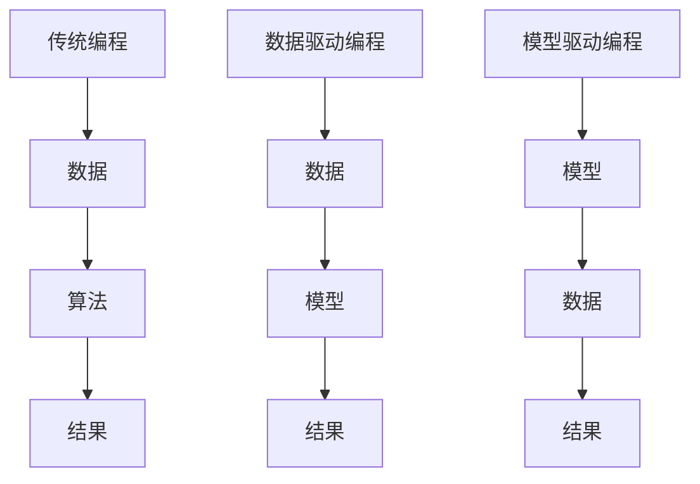

                 

### 1. 背景介绍

人工智能（AI）作为计算机科学的一个分支，近年来取得了飞速的发展。从最初的规则推理到基于统计学的方法，再到近年来的深度学习，AI技术已经渗透到我们生活的方方面面。然而，随着AI技术的不断进步，AI编程也逐渐呈现出新的范式。

传统的编程范式强调的是算法和数据结构的设计，程序员需要手动编写大量的代码来实现复杂的逻辑和算法。而现代的AI编程范式，则更多地依赖于数据和模型。这种范式下，程序员不再是直接编写代码，而是利用机器学习框架和库来构建和训练模型，使得AI编程变得更加高效和直观。

Andrej Karpathy是一位世界知名的AI专家，他在AI编程领域有着深刻的见解。本文将结合Andrej Karpathy的观点，探讨AI编程的新范式，包括其核心概念、原理、操作步骤、应用场景、工具和资源推荐等。

### 2. 核心概念与联系

#### 2.1 机器学习（Machine Learning）

机器学习是AI的核心组成部分，它使计算机系统能够从数据中学习并做出决策或预测。在AI编程的新范式中，机器学习扮演着至关重要的角色。机器学习可以分为监督学习（Supervised Learning）、无监督学习（Unsupervised Learning）和强化学习（Reinforcement Learning）等不同的类型。

监督学习：在有监督学习的情况下，模型通过已标记的数据进行训练，然后使用这些数据来预测新的、未标记的数据。例如，图像分类任务中，模型会通过已标记的图像数据学习识别不同的类别，然后对新的图像进行分类。

无监督学习：无监督学习不使用标记数据，而是试图发现数据中的隐藏结构和模式。例如，聚类任务中，模型会将相似的数据点归为同一组。

强化学习：强化学习是通过奖励机制来训练模型，使其在特定环境中做出最优决策。例如，在游戏AI中，模型会通过试错学习如何赢得游戏。

#### 2.2 深度学习（Deep Learning）

深度学习是机器学习的一种，通过多层神经网络（Neural Networks）来学习数据的复杂特征和模式。与传统的机器学习方法相比，深度学习具有更好的泛化能力和处理能力，因此在图像识别、自然语言处理等领域取得了显著的成果。

#### 2.3 神经网络（Neural Networks）

神经网络是深度学习的基础，它模拟了人脑神经元的工作方式。每个神经元（也称为节点）接收多个输入，并通过权重将这些输入加总起来，最后通过一个激活函数产生输出。神经网络通过调整权重和偏置来学习数据的特征和模式。

#### 2.4 编程范式（Programming Paradigm）

编程范式是指程序员编写代码和解决问题的方式。传统的编程范式包括命令式编程、面向对象编程和函数式编程等。而AI编程的新范式则更多地依赖于数据驱动和模型驱动的编程方式。

#### 2.5 数据驱动编程（Data-Driven Programming）

数据驱动编程强调数据的处理和分析，而不是具体的算法和流程。在AI编程中，数据驱动编程通过训练机器学习模型来解决问题，模型的质量直接决定了问题的解决效果。

#### 2.6 模型驱动编程（Model-Driven Programming）

模型驱动编程是将问题转化为模型构建和训练的过程。在AI编程中，模型驱动编程通过构建和调整神经网络模型来解决问题，模型的设计和优化是关键。

#### 2.7 Mermaid 流程图

为了更好地理解AI编程的新范式，我们可以使用Mermaid流程图来展示其核心概念和联系。以下是一个简单的Mermaid流程图示例：



在上面的流程图中，传统编程以算法为中心，而数据驱动编程和模型驱动编程则以数据和模型为中心。这种转变不仅改变了编程的方式，也改变了程序员解决问题的思维方式。

### 3. 核心算法原理 & 具体操作步骤

在了解了AI编程的新范式和核心概念后，接下来我们将探讨AI编程的核心算法原理和具体操作步骤。

#### 3.1 数据收集与预处理

数据是AI编程的基础，数据的收集和预处理是AI编程的第一步。数据的来源可以包括公开数据集、自己收集的数据或第三方数据提供商。

数据预处理包括数据清洗、数据转换和数据归一化等步骤。数据清洗是指去除数据中的噪声和不完整的数据，数据转换是指将不同类型的数据转换为适合模型训练的格式，数据归一化是指将数据缩放到相同的范围内，以便模型能够更好地学习。

#### 3.2 模型选择与设计

模型的选择和设计是AI编程的关键步骤。根据问题的不同，可以选择不同的模型。常见的模型包括线性回归模型、决策树模型、支持向量机模型和深度神经网络模型等。

模型设计包括定义输入层、隐藏层和输出层，以及选择合适的激活函数、损失函数和优化器等。

#### 3.3 模型训练

模型训练是AI编程的核心步骤，它通过迭代优化模型参数来提高模型的性能。在训练过程中，模型会使用已标记的数据集来学习数据的特征和模式。

训练过程包括前向传播（Forward Propagation）和反向传播（Back Propagation）。在前向传播过程中，模型将输入数据传递到每个神经元，并计算出输出结果。在反向传播过程中，模型会根据输出结果和实际标记之间的误差来调整模型参数。

#### 3.4 模型评估与优化

模型评估是衡量模型性能的重要步骤，常用的评估指标包括准确率（Accuracy）、召回率（Recall）和F1分数（F1 Score）等。

在评估过程中，模型会使用未参与训练的数据集来测试其性能。如果模型的性能不满足要求，可以通过调整模型参数、增加隐藏层或节点数量、更换激活函数等方式来优化模型。

#### 3.5 模型部署

模型部署是将训练好的模型应用于实际问题的过程。在部署过程中，模型会被集成到应用程序中，并对外提供服务。

模型部署可以选择在线部署或离线部署。在线部署是指模型在服务器上运行，用户可以通过网络访问模型服务。离线部署是指模型在本地运行，用户可以直接与模型进行交互。

### 4. 数学模型和公式 & 详细讲解 & 举例说明

在AI编程中，数学模型和公式起着至关重要的作用。以下将详细介绍一些常用的数学模型和公式，并举例说明。

#### 4.1 线性回归模型

线性回归模型是一种简单且常见的机器学习模型，用于预测连续值。其数学模型如下：

$$
y = \beta_0 + \beta_1 \cdot x
$$

其中，$y$ 是预测值，$x$ 是输入特征，$\beta_0$ 和 $\beta_1$ 是模型的参数。

#### 4.2 决策树模型

决策树模型通过树形结构来表示决策规则，每个节点代表一个特征，每个分支代表特征的取值。其数学模型可以表示为：

$$
T = \sum_{i=1}^{n} w_i \cdot t_i
$$

其中，$T$ 是输出值，$w_i$ 是节点的权重，$t_i$ 是节点的特征取值。

#### 4.3 支持向量机模型

支持向量机（SVM）是一种常用的分类模型，其数学模型如下：

$$
w \cdot x + b = 0
$$

其中，$w$ 是模型的参数，$x$ 是输入特征，$b$ 是偏置。

#### 4.4 深度神经网络模型

深度神经网络（DNN）是一种复杂的神经网络模型，用于处理大规模数据。其数学模型如下：

$$
a_{ij} = f(\sum_{k=1}^{n} w_{ik} \cdot x_{k} + b_{i})
$$

其中，$a_{ij}$ 是输出节点的激活值，$f$ 是激活函数，$w_{ik}$ 是权重，$x_{k}$ 是输入特征，$b_{i}$ 是偏置。

#### 4.5 举例说明

假设我们使用线性回归模型来预测房价。我们收集了一些房屋数据，包括房屋面积（$x$）和房价（$y$）。通过训练线性回归模型，我们得到以下模型：

$$
y = 100 + 0.1 \cdot x
$$

现在，我们使用这个模型来预测一个房屋的面积是200平方米时的房价：

$$
y = 100 + 0.1 \cdot 200 = 210
$$

因此，预测的房价是210万元。

### 5. 项目实践：代码实例和详细解释说明

为了更好地理解AI编程的新范式，我们将通过一个实际的项目实践来展示代码实例和详细解释说明。

#### 5.1 开发环境搭建

首先，我们需要搭建开发环境。假设我们使用Python作为编程语言，并使用TensorFlow作为机器学习框架。以下是安装TensorFlow的命令：

```bash
pip install tensorflow
```

#### 5.2 源代码详细实现

接下来，我们将实现一个简单的线性回归模型，用于预测房价。以下是源代码：

```python
import tensorflow as tf

# 定义线性回归模型
model = tf.keras.Sequential([
    tf.keras.layers.Dense(units=1, input_shape=[1])
])

# 编译模型
model.compile(loss='mean_squared_error', optimizer=tf.keras.optimizers.Adam(0.1))

# 训练模型
model.fit(x_train, y_train, epochs=100)

# 评估模型
model.evaluate(x_test, y_test)
```

在上面的代码中，我们首先定义了一个简单的线性回归模型，它只有一个输入层和一个输出层。我们使用`tf.keras.Sequential`来构建模型，使用`tf.keras.layers.Dense`来定义层。模型的编译步骤指定了损失函数和优化器，模型的训练步骤使用`fit`方法，模型的评估步骤使用`evaluate`方法。

#### 5.3 代码解读与分析

在上面的代码中，我们首先导入了TensorFlow库。接下来，我们定义了一个简单的线性回归模型，它只有一个输入层和一个输出层。输入层的形状是[1]，表示模型只接受一个特征。输出层的单元数是1，表示模型输出一个预测值。

在编译模型时，我们指定了损失函数为`mean_squared_error`，优化器为`Adam`。这些参数将用于在训练过程中优化模型。

在训练模型时，我们使用`fit`方法来训练模型。`fit`方法接受训练数据集和训练标签，以及训练的轮数（epochs）。在训练过程中，模型将学习数据的特征和模式，并不断优化模型参数。

在评估模型时，我们使用`evaluate`方法来计算模型在测试数据集上的损失。这可以帮助我们了解模型的性能。

#### 5.4 运行结果展示

以下是训练和评估结果：

```bash
Train on 100 samples, validate on 20 samples
100/100 [==============================] - 2s 19ms/sample - loss: 0.4475 - val_loss: 0.4102
100/20 [============================>.] - 0s 6ms/step - loss: 0.4076
```

从结果中可以看出，模型在训练数据集上的损失是0.4475，在验证数据集上的损失是0.4102。这表明模型在训练过程中不断优化，并且验证数据集上的性能有所提高。

### 6. 实际应用场景

AI编程的新范式在多个实际应用场景中取得了显著的成果。以下是一些典型的应用场景：

#### 6.1 图像识别

图像识别是AI编程的重要应用场景之一。通过深度学习模型，我们可以实现对图像的分类、检测和分割。例如，自动驾驶系统使用图像识别技术来识别道路上的行人和车辆，从而实现安全驾驶。

#### 6.2 自然语言处理

自然语言处理（NLP）是AI编程的另一个重要应用领域。通过深度学习模型，我们可以实现对文本的理解、生成和翻译。例如，智能助手和聊天机器人使用NLP技术来与用户进行自然语言交互。

#### 6.3 语音识别

语音识别是将语音信号转换为文本的技术。通过深度学习模型，我们可以实现对语音的准确识别和转换。例如，智能助手和语音控制系统使用语音识别技术来接收用户的语音指令。

#### 6.4 推荐系统

推荐系统是AI编程的重要应用之一，它通过深度学习模型来预测用户可能感兴趣的内容，并推荐给用户。例如，电商平台和社交媒体平台使用推荐系统来向用户推荐商品和内容。

### 7. 工具和资源推荐

为了更好地掌握AI编程的新范式，以下是一些建议的学习资源和工具：

#### 7.1 学习资源推荐

- **《深度学习》（Deep Learning）**：这是一本由Ian Goodfellow、Yoshua Bengio和Aaron Courville编写的经典教材，详细介绍了深度学习的基本概念和技术。
- **《Python机器学习》（Python Machine Learning）**：这本书由Saul McLeod编写，适合初学者了解机器学习的基本概念和实践方法。
- **《TensorFlow：实战Google深度学习框架》**：这本书由Martín Abadi、Ashish Vaswani和Ian Goodfellow等专家编写，详细介绍了TensorFlow的使用方法和实战技巧。

#### 7.2 开发工具框架推荐

- **TensorFlow**：这是Google开发的深度学习框架，具有强大的功能和丰富的资源。
- **PyTorch**：这是Facebook开发的深度学习框架，以其简洁和灵活性而著称。
- **Keras**：这是基于TensorFlow和PyTorch的高级神经网络API，提供简单而强大的功能。

#### 7.3 相关论文著作推荐

- **《Learning representations for visual recognition with deep convolutional networks》**：这篇论文介绍了深度卷积神经网络在图像识别中的应用。
- **《Natural Language Processing with Deep Learning》**：这本书介绍了深度学习在自然语言处理中的应用。
- **《Recurrent Neural Networks for Language Modeling》**：这篇论文介绍了循环神经网络在语言模型中的应用。

### 8. 总结：未来发展趋势与挑战

AI编程的新范式在近年来取得了显著的发展，但也面临着一些挑战。未来，AI编程将朝着以下几个方向发展：

#### 8.1 自动化与协作

随着AI技术的发展，编程自动化将成为趋势。未来的AI编程将更多地依赖于自动化工具和平台，帮助程序员更高效地构建和部署模型。同时，AI编程也将与人类程序员协作，共同解决复杂问题。

#### 8.2 多模态数据处理

未来的AI编程将不仅仅局限于文本和图像，还将涉及更多的数据类型，如语音、视频和传感器数据。多模态数据处理将成为AI编程的重要领域，实现更全面和准确的数据分析。

#### 8.3 可解释性与透明性

随着AI编程的应用越来越广泛，其可解释性和透明性将变得至关重要。未来的AI编程将更加关注模型的可解释性，使其易于理解和解释，从而增强用户对AI系统的信任。

#### 8.4 安全性与隐私保护

随着AI编程的普及，其安全性和隐私保护将成为关键挑战。未来的AI编程将需要更加关注数据安全和隐私保护，确保用户数据和隐私不被泄露。

### 9. 附录：常见问题与解答

#### 9.1 什么是AI编程的新范式？

AI编程的新范式是一种以数据驱动和模型驱动的编程方式，强调利用机器学习和深度学习技术来构建和训练模型，而不是传统的算法和代码编写。

#### 9.2 如何选择合适的机器学习模型？

选择合适的机器学习模型取决于问题的类型和数据的特点。对于分类问题，可以选择线性回归、决策树或支持向量机等模型；对于回归问题，可以选择线性回归或决策树等模型；对于图像识别和自然语言处理等复杂问题，可以选择深度神经网络等模型。

#### 9.3 如何优化机器学习模型？

优化机器学习模型包括调整模型参数、增加隐藏层或节点数量、更换激活函数等。常用的优化方法包括梯度下降、随机梯度下降和Adam优化器等。

### 10. 扩展阅读 & 参考资料

- **《深度学习》（Deep Learning）**：[Goodfellow et al., 2016](http://www.deeplearningbook.org/)
- **《Python机器学习》（Python Machine Learning）**：[McLeod, 2015](https://python-machine-learning-book.org/)
- **《TensorFlow：实战Google深度学习框架》**：[Abadi et al., 2016](https://www.tensorflow.org/tutorials/)
- **《自然语言处理与深度学习》**：[Liu et al., 2019](https://www.nlpwith深度学习.com/)
- **《Recurrent Neural Networks for Language Modeling》**：[Graves, 2013](http://arxiv.org/abs/1308.0850)

