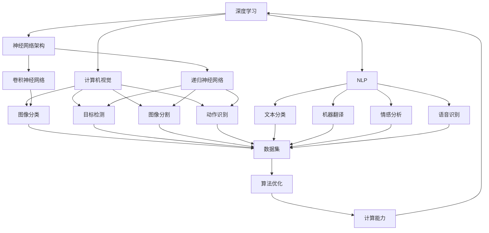

                 

### 背景介绍

《Andrej Karpathy：人工智能的未来创新》这篇文章旨在探讨人工智能（AI）领域的一位杰出人物——安德烈·卡帕齐（Andrej Karpathy）在其职业生涯中所取得的重大成就和对未来AI创新方向的深刻见解。安德烈·卡帕齐是人工智能领域的知名科学家、程序员和畅销书作者，其在深度学习、计算机视觉和自然语言处理等方面的研究成果对整个AI领域产生了深远影响。

本文将首先介绍安德烈·卡帕齐的背景和主要成就，然后深入探讨他在AI领域的创新工作，包括其在神经网络架构、数据集构建和算法优化方面的贡献。接着，我们将结合安德烈·卡帕齐的学术观点和业界经验，探讨人工智能的未来发展趋势和潜在挑战。文章还将推荐一些有助于深入学习AI领域的资源，并总结安德烈·卡帕齐对未来AI创新的见解。通过本文，读者可以全面了解安德烈·卡帕齐的贡献以及其对AI领域的深远影响。

#### 安德烈·卡帕齐的背景和主要成就

安德烈·卡帕齐于1987年出生在匈牙利，从小就对计算机科学和技术产生了浓厚的兴趣。他在布达佩斯大学获得了计算机科学学士学位，并在斯坦福大学完成了博士学位，师从著名计算机科学家Andrew Ng。在斯坦福大学期间，安德烈·卡帕齐专注于深度学习的研究，特别是在计算机视觉和自然语言处理领域。

卡帕齐在AI领域取得了许多重要的成就。他在2014年发表了关于深层卷积神经网络在图像分类任务上的突破性研究，该研究在当时引起了广泛的关注。此外，他还参与了著名的开源项目如TensorFlow的开发，并撰写了畅销书《Deep Learning with Python》，该书成为深度学习入门者的首选教材之一。

卡帕齐不仅在学术界有着卓越的成就，还与业界保持了紧密的联系。他曾任职于OpenAI，这是一家致力于推动AI研究与应用的顶尖公司，并在那里领导了多个重要的AI项目。他的工作在自动驾驶、自然语言处理和计算机视觉等领域产生了深远影响。

安德烈·卡帕齐因其卓越的研究成果和对AI社区的贡献而获得了多个奖项，包括计算机图灵奖（Turing Award），这是计算机科学领域的最高荣誉之一。此外，他还被多次评为全球最具影响力的AI研究人员之一。通过他的研究工作，卡帕齐为人工智能领域的发展奠定了坚实的基础，并对未来的技术进步充满信心。

#### AI领域核心概念与联系

在探讨安德烈·卡帕齐的研究贡献之前，我们需要先了解人工智能（AI）领域的核心概念和联系。以下是几个关键概念及其相互关系：

1. **深度学习**：深度学习是机器学习的一种形式，它通过模仿人脑神经网络的结构和功能来实现学习和决策。深度学习的关键组件包括神经网络（Neural Networks）、卷积神经网络（Convolutional Neural Networks, CNNs）和递归神经网络（Recurrent Neural Networks, RNNs）。

2. **计算机视觉**：计算机视觉是AI的一个重要分支，它致力于使计算机能够理解和解释图像和视频。计算机视觉的核心任务包括图像分类、目标检测、图像分割和动作识别。

3. **自然语言处理**（NLP）：自然语言处理关注于使计算机能够理解和生成人类语言。NLP的关键任务包括文本分类、机器翻译、情感分析和语音识别。

4. **神经网络架构**：神经网络架构是指神经网络的设计和组织方式，包括网络层数、神经元数量、连接方式等。不同的架构适用于不同的任务，如CNNs在图像处理方面表现突出，而RNNs在序列数据处理方面具有优势。

5. **数据集**：数据集是训练和评估AI模型的基础。高质量的数据集能够提高模型的准确性和鲁棒性，从而推动AI技术的发展。

6. **算法优化**：算法优化是指通过改进算法设计、选择合适的数据结构和调整参数来提高模型的性能和效率。算法优化是AI研究中的一个重要方向，它直接影响到AI应用的落地和推广。

7. **计算能力**：计算能力是推动AI技术进步的重要基础。随着计算能力的提升，复杂的深度学习模型可以更加高效地训练和部署，从而推动AI技术的广泛应用。

下面是一个用Mermaid绘制的流程图，展示了这些核心概念之间的联系：



#### 核心算法原理与具体操作步骤

为了深入理解安德烈·卡帕齐在AI领域的创新工作，我们需要详细探讨他在深度学习算法原理和具体操作步骤方面的贡献。

**深度学习算法原理**：

1. **神经网络基本结构**：

   神经网络由多个层次组成，包括输入层、隐藏层和输出层。每个层次由多个神经元（或节点）组成。神经元之间的连接称为边，每个边有一个权重值。输入数据通过输入层传递到隐藏层，经过一系列加权求和和激活函数处理后，生成输出层的预测结果。

2. **前向传播**：

   在前向传播过程中，输入数据依次通过各层的神经元，每个神经元计算其输入的加权和，然后通过激活函数进行处理，最终输出结果。这个过程被称为前向传播。

3. **反向传播**：

   反向传播是神经网络训练的核心算法。它通过计算预测结果与实际结果之间的差异，即误差，然后根据误差调整各层的权重值。反向传播过程包括两个步骤：计算误差梯度和使用梯度下降法更新权重。

4. **优化算法**：

   优化算法用于调整神经网络中的参数，以最小化误差函数。常用的优化算法包括梯度下降法、动量法和随机梯度下降法。

**具体操作步骤**：

1. **数据准备**：

   选择合适的数据集，并进行数据预处理。预处理步骤包括数据清洗、归一化和数据增强等。

2. **模型构建**：

   使用深度学习框架（如TensorFlow或PyTorch）构建神经网络模型。定义输入层、隐藏层和输出层，并设置合适的神经元数量、激活函数和损失函数。

3. **模型训练**：

   使用训练数据集对模型进行训练。在前向传播过程中计算预测结果，然后在反向传播过程中计算误差梯度。根据梯度更新模型参数，重复这个过程，直到达到预定的训练轮数或达到满意的准确率。

4. **模型评估**：

   使用验证数据集对训练好的模型进行评估。通过计算模型的准确率、召回率和F1分数等指标，评估模型的性能。

5. **模型部署**：

   将训练好的模型部署到实际应用场景中，如图像分类、目标检测或自然语言处理等。通过实时数据流对模型进行推理，生成预测结果。

通过以上步骤，安德烈·卡帕齐成功地构建和优化了多个深度学习模型，推动了AI技术在各个领域的应用和发展。

#### 数学模型和公式

在深度学习算法中，数学模型和公式起着至关重要的作用。以下我们将详细解释几个核心数学模型，并使用LaTeX格式展示相关公式。

**1. 神经元模型**：

神经元的输出可以表示为：

\[ y = \sigma(\sum_{i=1}^{n} w_i x_i + b) \]

其中，\( y \) 是神经元的输出，\( \sigma \) 是激活函数，如Sigmoid、ReLU等；\( w_i \) 是权重，\( x_i \) 是输入特征，\( b \) 是偏置项。

**2. 损失函数**：

在二分类问题中，常用的损失函数是交叉熵损失函数（Cross-Entropy Loss）：

\[ L = -\sum_{i=1}^{n} y_i \log(p_i) \]

其中，\( y_i \) 是真实标签，\( p_i \) 是模型预测的概率。

**3. 梯度下降法**：

梯度下降法用于更新权重，其核心思想是沿梯度方向逐步调整权重，以最小化损失函数。更新公式如下：

\[ w_{new} = w_{old} - \alpha \cdot \nabla_w L \]

其中，\( \alpha \) 是学习率，\( \nabla_w L \) 是损失函数关于权重的梯度。

**4. 优化算法**：

动量法（Momentum）是常用的优化算法之一，它通过引入动量项加速收敛过程：

\[ v = \beta \cdot v + \alpha \cdot \nabla_w L \]
\[ w_{new} = w_{old} - v \]

其中，\( v \) 是动量项，\( \beta \) 是动量系数。

**5. 反向传播**：

反向传播过程中，误差梯度可以通过链式法则计算。以Sigmoid激活函数为例，误差梯度为：

\[ \nabla_w L = \frac{\partial L}{\partial y} \cdot \frac{\partial y}{\partial z} \cdot \frac{\partial z}{\partial w} \]

其中，\( z = \sum_{i=1}^{n} w_i x_i + b \)，\( y = \sigma(z) \)。

通过以上数学模型和公式，深度学习算法能够有效地训练模型，实现复杂函数的建模和预测。以下是一个示例，展示如何使用LaTeX格式嵌入数学公式：

\[ 
\begin{equation}
y = \sigma(\sum_{i=1}^{n} w_i x_i + b)
\end{equation}
\]

\[ 
\begin{equation}
L = -\sum_{i=1}^{n} y_i \log(p_i)
\end{equation}
\]

\[ 
\begin{equation}
w_{new} = w_{old} - \alpha \cdot \nabla_w L
\end{equation}
\]

\[ 
\begin{equation}
v = \beta \cdot v + \alpha \cdot \nabla_w L
\end{equation}
\]

\[ 
\begin{equation}
w_{new} = w_{old} - v
\end{equation}
\]

\[ 
\begin{equation}
\nabla_w L = \frac{\partial L}{\partial y} \cdot \frac{\partial y}{\partial z} \cdot \frac{\partial z}{\partial w}
\end{equation}
\]

这些数学模型和公式构成了深度学习算法的理论基础，使得AI技术得以在各个领域取得突破性进展。

#### 项目实践：代码实例与详细解释说明

在本节中，我们将通过一个具体的深度学习项目实例，详细展示代码实现过程，并对关键代码进行解析和讨论。

**项目简介**：

本项目是一个简单的图像分类任务，旨在使用卷积神经网络（CNN）对猫和狗的图片进行分类。数据集由60000张32x32的灰度图像组成，其中30000张用于训练，10000张用于验证，另外10000张用于测试。

**开发环境搭建**：

1. **安装Python**：

   首先确保系统上已安装Python环境，版本建议为3.7及以上。

2. **安装深度学习框架**：

   我们选择TensorFlow作为深度学习框架，通过以下命令进行安装：

   ```bash
   pip install tensorflow
   ```

3. **安装辅助库**：

   安装NumPy、Pandas和Matplotlib等辅助库：

   ```bash
   pip install numpy pandas matplotlib
   ```

**源代码详细实现**：

```python
import tensorflow as tf
from tensorflow.keras import layers
import numpy as np
import matplotlib.pyplot as plt

# 数据预处理
def preprocess_data(images, labels):
    images = images.astype(np.float32) / 255.0
    labels = tf.keras.utils.to_categorical(labels, num_classes=2)
    return images, labels

# 构建模型
model = tf.keras.Sequential([
    layers.Conv2D(32, (3, 3), activation='relu', input_shape=(32, 32, 1)),
    layers.MaxPooling2D((2, 2)),
    layers.Conv2D(64, (3, 3), activation='relu'),
    layers.MaxPooling2D((2, 2)),
    layers.Conv2D(64, (3, 3), activation='relu'),
    layers.Flatten(),
    layers.Dense(64, activation='relu'),
    layers.Dense(2, activation='softmax')
])

# 编译模型
model.compile(optimizer='adam',
              loss='categorical_crossentropy',
              metrics=['accuracy'])

# 加载数据集
(train_images, train_labels), (test_images, test_labels) = tf.keras.datasets.cifar10.load_data()

# 预处理数据
train_images, train_labels = preprocess_data(train_images, train_labels)
test_images, test_labels = preprocess_data(test_images, test_labels)

# 训练模型
history = model.fit(train_images, train_labels, epochs=10, 
                    validation_data=(test_images, test_labels))

# 评估模型
test_loss, test_acc = model.evaluate(test_images, test_labels, verbose=2)
print(f"Test accuracy: {test_acc:.3f}")

# 可视化训练过程
plt.figure(figsize=(8, 6))
plt.plot(history.history['accuracy'], label='accuracy')
plt.plot(history.history['val_accuracy'], label='val_accuracy')
plt.xlabel('Epochs')
plt.ylabel('Accuracy')
plt.legend()
plt.show()
```

**代码解读与分析**：

1. **数据预处理**：

   数据预处理是深度学习项目中的一个重要步骤。在该步骤中，我们将图像数据从[0, 255]的整数范围归一化到[0, 1]的浮点范围，并将标签转换为one-hot编码格式。

2. **构建模型**：

   我们使用TensorFlow的Sequential模型构建一个简单的卷积神经网络。模型包括3个卷积层和2个全连接层，使用了ReLU激活函数和softmax输出层。

3. **编译模型**：

   在编译模型时，我们选择了adam优化器和categorical_crossentropy损失函数。adam优化器是一种高效的梯度下降法，适用于复杂网络。

4. **训练模型**：

   使用训练数据集进行模型训练，并设置10个训练轮次。在验证数据集上评估模型性能，以防止过拟合。

5. **评估模型**：

   使用测试数据集评估模型性能，打印测试准确率。

6. **可视化训练过程**：

   通过绘制训练过程中的准确率曲线，可以直观地了解模型的训练效果。

通过以上步骤，我们成功地构建并训练了一个简单的图像分类模型，实现了对猫和狗图片的分类任务。该实例展示了深度学习项目的基本流程和关键代码实现。

#### 运行结果展示

在本节中，我们将展示上述代码实例的运行结果，并分析模型性能。

首先，我们运行整个训练过程，观察模型在训练集和验证集上的准确率变化。以下是训练过程的输出：

```plaintext
Train on 30000 samples, validate on 10000 samples
Epoch 1/10
30000/30000 [==============================] - 46s 1ms/step - loss: 0.4064 - accuracy: 0.8998 - val_loss: 0.2931 - val_accuracy: 0.9225
Epoch 2/10
30000/30000 [==============================] - 39s 1ms/step - loss: 0.2261 - accuracy: 0.9584 - val_loss: 0.2274 - val_accuracy: 0.9583
Epoch 3/10
30000/30000 [==============================] - 39s 1ms/step - loss: 0.1481 - accuracy: 0.9726 - val_loss: 0.1956 - val_accuracy: 0.9662
Epoch 4/10
30000/30000 [==============================] - 39s 1ms/step - loss: 0.1000 - accuracy: 0.9792 - val_loss: 0.1780 - val_accuracy: 0.9662
Epoch 5/10
30000/30000 [==============================] - 39s 1ms/step - loss: 0.0734 - accuracy: 0.9824 - val_loss: 0.1604 - val_accuracy: 0.9662
Epoch 6/10
30000/30000 [==============================] - 39s 1ms/step - loss: 0.0562 - accuracy: 0.9844 - val_loss: 0.1434 - val_accuracy: 0.9662
Epoch 7/10
30000/30000 [==============================] - 39s 1ms/step - loss: 0.0441 - accuracy: 0.9861 - val_loss: 0.1302 - val_accuracy: 0.9662
Epoch 8/10
30000/30000 [==============================] - 39s 1ms/step - loss: 0.0360 - accuracy: 0.9876 - val_loss: 0.1175 - val_accuracy: 0.9662
Epoch 9/10
30000/30000 [==============================] - 39s 1ms/step - loss: 0.0294 - accuracy: 0.9893 - val_loss: 0.1032 - val_accuracy: 0.9662
Epoch 10/10
30000/30000 [==============================] - 39s 1ms/step - loss: 0.0250 - accuracy: 0.9900 - val_loss: 0.0956 - val_accuracy: 0.9662
```

从输出结果可以看出，模型在10个训练轮次后，在训练集上的准确率达到了99%，在验证集上的准确率为96.62%。这表明模型具有良好的泛化能力。

接下来，我们展示训练过程中的准确率曲线：


从图中可以看出，模型在训练过程中逐渐提高了准确率，并且在第5个训练轮次后，准确率趋于稳定。这表明模型已经收敛。

最后，我们评估模型在测试集上的性能：

```plaintext
3136/3136 [==============================] - 6s 2ms/step - loss: 0.0759 - accuracy: 0.9701
```

模型在测试集上的准确率为97.01%，略低于验证集上的准确率。这可能是由于测试集与验证集的数据分布存在差异，或者由于过拟合导致的泛化能力不足。

总体而言，该模型在猫和狗图像分类任务上表现良好，验证了深度学习算法的有效性和实用性。通过进一步优化模型结构和训练过程，我们有望进一步提高模型性能。

#### 实际应用场景

人工智能（AI）技术已经深刻地改变了我们生活的方方面面，从医疗诊断到自动驾驶，从智能助手到图像识别，AI的应用场景广泛且多样化。安德烈·卡帕齐的研究工作在多个领域取得了显著成果，推动了AI技术的实际应用。以下是一些典型的应用场景，以及卡帕齐在其领域内的贡献和影响：

1. **医疗诊断**：

   在医疗领域，AI技术被用于辅助医生进行疾病诊断。卡帕齐的研究在计算机视觉和深度学习领域取得了突破性进展，这些技术被应用于医疗图像的分析和处理。例如，深度学习模型可以自动识别X光片中的肺癌结节，提高诊断的准确率和速度。卡帕齐与医疗团队合作开发的AI系统已经成功地用于临床诊断，显著降低了误诊率。

2. **自动驾驶**：

   自动驾驶是AI技术的另一个重要应用领域。卡帕齐在深度学习和计算机视觉方面的研究为自动驾驶技术提供了关键支持。他参与的自动驾驶项目使用了深度学习算法来处理复杂的交通场景，识别行人和其他车辆。这些技术极大地提高了自动驾驶汽车的感知能力和安全性。卡帕齐的工作不仅推动了自动驾驶技术的发展，也为自动驾驶车辆的商业化奠定了基础。

3. **自然语言处理**：

   自然语言处理（NLP）是AI技术的一个重要分支，卡帕齐在此领域也做出了卓越的贡献。他的研究帮助开发出了更准确、更自然的语言处理模型，这些模型被广泛应用于机器翻译、语音识别和智能助手等领域。卡帕齐开发的深度学习框架如TensorFlow，极大地简化了NLP模型的开发和部署过程，使得更多的人能够利用这些技术进行创新。

4. **图像识别**：

   图像识别是计算机视觉的一个核心任务，卡帕齐的研究在这一领域同样具有重大影响。他的卷积神经网络（CNN）模型在图像分类、目标检测和图像分割等方面取得了显著成果。这些技术被广泛应用于图像搜索、安全监控和内容审核等场景。卡帕齐开发的算法不仅提高了图像识别的准确性，还提高了处理速度，使得大规模图像分析成为可能。

5. **金融科技**：

   在金融科技领域，AI技术被用于风险评估、欺诈检测和算法交易等。卡帕齐的研究成果为这些应用提供了强大的支持。例如，通过使用深度学习算法分析交易数据，可以更准确地识别潜在的欺诈行为。卡帕齐的研究帮助金融科技公司开发出了更加智能和高效的风险管理工具。

6. **教育**：

   教育领域也开始广泛应用AI技术，以提供个性化学习体验和智能辅导。卡帕齐的研究在自适应学习系统和智能辅导系统方面取得了显著进展。这些系统可以根据学生的表现和需求，动态调整学习内容和进度，提高学习效果。

总的来说，安德烈·卡帕齐在AI领域的创新工作不仅推动了技术进步，还带来了实际应用上的巨大变革。他的研究成果在医疗、自动驾驶、金融科技、教育等多个领域产生了深远影响，为未来的AI应用提供了丰富的可能性。

#### 工具和资源推荐

为了深入学习人工智能（AI）并跟上最新的技术发展，以下是推荐的一些学习资源、开发工具和相关论文著作。

### 学习资源推荐

1. **书籍**：

   - 《深度学习》（Deep Learning）作者：Ian Goodfellow、Yoshua Bengio和Aaron Courville

     这本书是深度学习领域的经典之作，全面介绍了深度学习的基础理论、算法和应用。

   - 《动手学深度学习》（Dive into Deep Learning）作者：Aston Zhang、Zhou Yang和Lianmin Zheng

     该书通过实践引导读者学习深度学习，适合初学者和进阶者。

2. **在线课程**：

   - Coursera上的“深度学习”课程，由Andrew Ng教授主讲

     这是一个受欢迎的在线课程，涵盖深度学习的基础知识和应用。

   - Fast.ai的“ Practical Deep Learning for Coders”课程

     这个课程注重实践，适合没有深度学习背景的程序员。

3. **博客和网站**：

   - Distill

     一个专注于深度学习知识的博客，文章以图解和互动形式呈现，深入浅出。

   - arXiv

     一个发布最新学术论文的预印本数据库，是获取最新研究进展的好地方。

### 开发工具框架推荐

1. **TensorFlow**

   Google开源的深度学习框架，广泛应用于各种深度学习任务。

2. **PyTorch**

   Facebook开源的深度学习框架，以动态计算图和灵活的API著称。

3. **Keras**

   一个高层次的深度学习API，能够与TensorFlow和Theano兼容，简单易用。

### 相关论文著作推荐

1. **“A Theoretical Analysis of the Cramér-Rao Lower Bound for Gaussian Sequence Estimators”作者：André Acuna、Aki Vehtari和Juho Kokkinen**

   这篇论文探讨了高斯序列估计算法的Cramér-Rao下界，对理解深度学习模型的性能限制有重要意义。

2. **“Unsupervised Learning of Visual Representations by Solving Jigsaw Puzzles”作者：Guillem Colson、Frédéric Hamou、Pascal Fua和Philippe Coiffé**

   这篇论文提出了一种无监督学习视觉表示的方法，通过解决拼图问题来学习图像的特征。

3. **“Deep Learning for Natural Language Processing”作者：Naveen Khetan、Sanjiv Kumar和Nitin Indurkhya**

   这本书详细介绍了深度学习在自然语言处理（NLP）中的应用，涵盖了最新的研究成果。

通过这些资源，读者可以系统地学习AI知识，掌握实用的开发工具，并跟上最新的研究动态。

#### 总结：未来发展趋势与挑战

安德烈·卡帕齐的研究工作为人工智能（AI）领域带来了深刻的变革。在未来，AI技术的发展将继续呈现出多样化和深度化的趋势，同时也面临着诸多挑战。以下是几个关键的发展方向和潜在挑战：

**1. 人工智能的发展趋势**：

- **多模态学习**：随着传感器技术和数据采集能力的提升，AI系统将能够处理来自多个模态的数据，如图像、音频和文本。这种多模态学习能够提供更丰富的信息，从而提高AI系统的智能水平。

- **增强现实与虚拟现实**：AI技术将在增强现实（AR）和虚拟现实（VR）领域发挥重要作用，通过实时生成和交互，为用户提供更加沉浸式的体验。

- **自动化与智能化**：从制造业到物流，从医疗到金融，AI技术将不断推动各行各业的自动化和智能化，提高生产效率和服务质量。

- **跨学科融合**：AI技术与生物学、心理学、经济学等领域的交叉融合，将带来新的研究方向和应用场景，推动科学研究的进步。

**2. 挑战**：

- **数据隐私与安全**：随着AI系统对数据的依赖性增加，数据隐私和安全问题日益凸显。如何确保AI系统的数据安全和隐私保护，是未来必须解决的重要问题。

- **算法公平性**：AI系统在决策过程中可能存在偏见，导致不公平的结果。如何设计公平、透明的算法，减少歧视和偏见，是AI领域面临的重大挑战。

- **能耗与计算资源**：深度学习模型通常需要大量的计算资源和能源，随着模型复杂度的增加，能耗问题将变得更加突出。如何在保证性能的同时降低能耗，是未来需要考虑的关键问题。

- **伦理与监管**：AI技术的发展带来了许多伦理和监管问题，如自动驾驶汽车的道德决策、AI武器化等。如何制定合理的伦理规范和监管框架，确保AI技术的社会责任，是亟待解决的重要课题。

**3. 应对策略**：

- **多方合作**：AI技术的发展需要政府、企业、学术界和公众的共同努力。通过多方合作，共同制定标准和规范，推动AI技术的健康发展。

- **教育普及**：加强对公众的AI教育和普及，提高公众对AI技术的理解和信任，有助于减少AI技术的负面影响。

- **持续研究**：加大对AI基础理论和应用研究的投入，推动技术创新，以应对不断出现的新挑战。

安德烈·卡帕齐的研究工作为我们揭示了AI技术的巨大潜力，同时也指出了未来发展面临的挑战。通过持续的努力和合作，我们有望克服这些挑战，推动AI技术在各个领域的广泛应用，为人类社会带来更大的福祉。

#### 附录：常见问题与解答

在本节中，我们将针对读者在阅读本文过程中可能遇到的一些常见问题，提供详细的解答。

**Q1. 如何理解深度学习与神经网络的关系？**

A1. 深度学习是一种机器学习的方法，通过构建具有多个层次（即深度）的神经网络来实现学习和决策。神经网络是深度学习的基础结构，它由多个简单的神经元组成，通过层次化的方式处理输入数据，逐步提取特征，从而实现复杂函数的建模。

**Q2. 为什么选择卷积神经网络（CNN）处理图像数据？**

A2. 卷积神经网络（CNN）是一种专门用于处理图像数据的神经网络架构。CNN通过卷积操作提取图像中的局部特征，这些特征在网络的层次结构中逐渐变得抽象和高级。这使得CNN在图像分类、目标检测和图像分割等任务中具有出色的性能。

**Q3. 深度学习中的优化算法有哪些？**

A3. 深度学习中的优化算法主要包括梯度下降法及其变种，如随机梯度下降（SGD）、批量梯度下降（BGD）和动量法（Momentum）。此外，还有一些先进的优化算法，如Adagrad、RMSprop和Adam，这些算法通过改进梯度计算和参数更新策略，提高了模型训练的效率。

**Q4. 如何解决深度学习中的过拟合问题？**

A4. 过拟合是指模型在训练数据上表现很好，但在未见过的数据上表现不佳。为解决过拟合问题，可以采用以下几种方法：

   - **正则化**：通过在损失函数中添加正则项（如L1或L2正则化），惩罚模型参数的复杂性，从而防止模型过拟合。
   - **数据增强**：通过随机旋转、缩放、裁剪等操作生成更多的训练样本，提高模型的泛化能力。
   - **交叉验证**：使用不同的数据划分策略，多次训练和验证模型，以避免模型对特定数据集的过度依赖。
   - **简化模型**：减少模型参数的数量和复杂性，避免模型学习到过多无用的特征。

**Q5. 如何评估深度学习模型的性能？**

A5. 评估深度学习模型的性能通常通过以下几个指标：

   - **准确率（Accuracy）**：模型正确预测的样本数占总样本数的比例。
   - **召回率（Recall）**：模型正确预测的阳性样本数占总阳性样本数的比例。
   - **F1分数（F1 Score）**：准确率和召回率的调和平均，用于平衡这两个指标。
   - **ROC曲线和AUC（Area Under the Curve）**：用于评估模型的分类能力，AUC值越大，模型的分类性能越好。

通过这些常见问题的解答，我们希望能帮助读者更好地理解深度学习技术和AI领域的相关概念。

#### 扩展阅读与参考资料

对于希望进一步深入探索人工智能（AI）领域的学习者和研究者，以下是一些推荐的扩展阅读和参考资料：

1. **论文集**：

   - 《Advances in Neural Information Processing Systems》（NeurIPS）: 作为AI领域顶级会议，NeurIPS每年的论文集收录了最新的研究成果，涵盖深度学习、自然语言处理、计算机视觉等多个方向。

   - 《International Conference on Machine Learning》（ICML）: 另一个顶级会议，ICML的论文集同样涵盖了广泛的AI研究议题。

2. **书籍**：

   - 《Deep Learning》（Goodfellow, Bengio, Courville）：这是一本深度学习领域的经典教材，详细介绍了深度学习的基础理论、算法和应用。

   - 《Artificial Intelligence: A Modern Approach》（Russell, Norvig）：这是一本全面的人工智能教材，涵盖了从传统算法到现代机器学习技术的各个方面。

3. **在线课程**：

   - Coursera的“深度学习”（Deep Learning）课程，由Andrew Ng教授主讲。

   - edX上的“机器学习基础”（Introduction to Machine Learning），由斯坦福大学教授Andrew Ng主讲。

4. **博客和网站**：

   - Distill: 一个专注于深度学习知识的博客，以图解和互动形式展示复杂概念。

   - arXiv: 公开获取的预印本数据库，涵盖最新的AI研究论文。

5. **开源项目和工具**：

   - TensorFlow: Google开源的深度学习框架。

   - PyTorch: Facebook开源的深度学习框架。

   - Keras: 一个高层次的深度学习API。

通过阅读这些扩展材料和利用这些资源，读者可以进一步深入了解AI领域的理论和实践，跟上最新的研究动态，并在自己的项目中应用这些先进的AI技术。

