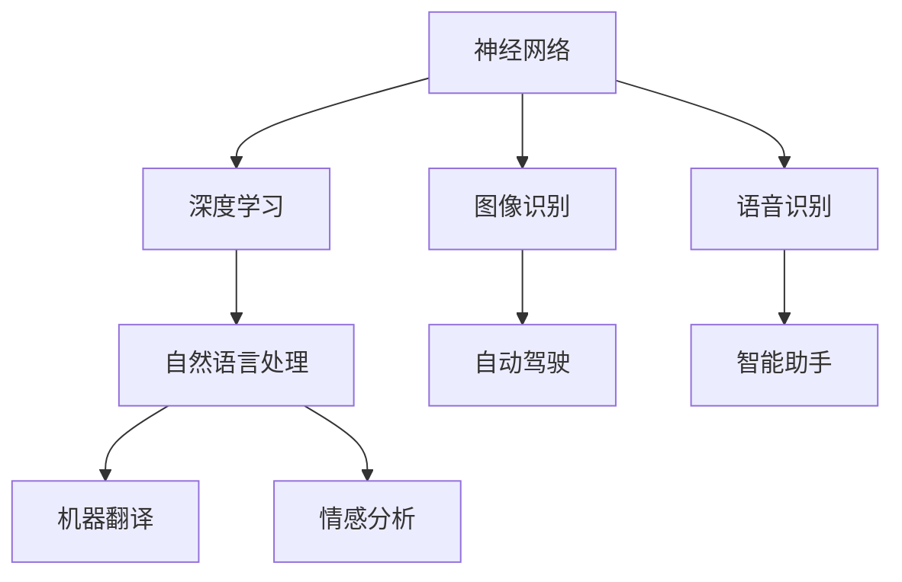

                 

### 文章标题

### Andrej Karpathy：人工智能的未来发展前景

> 关键词：人工智能，神经网络，深度学习，未来展望，技术趋势，应用场景

> 摘要：本文将探讨人工智能领域知名专家Andrej Karpathy对未来人工智能发展的观点，分析其提出的核心概念、算法原理、数学模型，并探讨这些技术在现实世界中的应用场景。通过本文的阅读，读者将了解到人工智能的深度发展及其面临的挑战。

---

### 1. 背景介绍

在当今科技飞速发展的时代，人工智能（AI）已成为一个备受关注和研究的热点领域。它不仅在学术界引起广泛关注，也在商业和工业界得到了广泛应用。从自动驾驶汽车到智能助手，从医疗诊断到金融风控，人工智能正逐步改变我们的生活。

Andrej Karpathy是一位在人工智能领域具有极高影响力的专家，他是斯坦福大学计算机科学博士，曾在谷歌大脑团队工作，目前是OpenAI的研究员。他的研究工作涵盖了神经网络、深度学习和自然语言处理等多个领域，他在学术界和工业界的贡献使他成为这一领域的领军人物。

本文将围绕Andrej Karpathy对未来人工智能发展的观点进行探讨，深入分析其提出的核心概念、算法原理和数学模型，并探讨这些技术在现实世界中的应用场景。通过本文的阅读，读者将能够更好地理解人工智能的未来发展趋势及其面临的挑战。

---

### 2. 核心概念与联系

#### 2.1 神经网络

神经网络（Neural Networks）是人工智能的基础，模仿了人脑的工作原理。神经网络由大量的神经元（节点）和连接（边）组成，通过调整这些连接的权重来学习数据。


#### 2.2 深度学习

深度学习（Deep Learning）是神经网络的一种特殊形式，它通过堆叠多层神经网络来提取数据中的复杂特征。深度学习在图像识别、语音识别、自然语言处理等领域取得了突破性进展。


#### 2.3 自然语言处理

自然语言处理（Natural Language Processing, NLP）是人工智能的一个重要分支，旨在使计算机能够理解和生成人类语言。NLP技术在机器翻译、情感分析、文本生成等领域具有广泛应用。


#### 2.4 Mermaid 流程图

以下是描述神经网络、深度学习和自然语言处理之间关系的Mermaid流程图：



---

### 3. 核心算法原理 & 具体操作步骤

#### 3.1 神经网络算法原理

神经网络算法的核心在于通过反向传播算法（Backpropagation）来调整网络中的权重，以达到最小化预测误差的目的。具体操作步骤如下：

1. 前向传播：将输入数据通过网络的各个层次进行传递，得到输出预测。
2. 计算误差：计算实际输出与预测输出之间的差异。
3. 反向传播：根据误差信息，从输出层开始，反向更新网络中的权重。
4. 重复步骤1-3，直到达到预设的迭代次数或误差阈值。

#### 3.2 深度学习算法原理

深度学习算法是基于多层神经网络构建的，通过逐层提取数据中的特征，实现对复杂问题的建模。具体操作步骤如下：

1. 数据预处理：对输入数据进行归一化、标准化等预处理。
2. 构建网络结构：定义网络的层数、每层的神经元数量和激活函数。
3. 前向传播：将预处理后的数据输入网络，得到输出预测。
4. 计算损失函数：根据输出预测和实际标签计算损失函数值。
5. 反向传播：根据损失函数梯度，反向更新网络中的权重。
6. 重复步骤3-5，直到达到预设的迭代次数或损失阈值。

#### 3.3 自然语言处理算法原理

自然语言处理算法主要依赖于词向量、序列模型和注意力机制等技术。具体操作步骤如下：

1. 词向量编码：将输入文本转化为词向量表示。
2. 序列建模：使用循环神经网络（RNN）或变换器（Transformer）等模型对词向量序列进行建模。
3. 注意力机制：在模型中引入注意力机制，以更好地关注文本中的关键信息。
4. 输出预测：根据模型输出，生成文本预测结果。

---

### 4. 数学模型和公式 & 详细讲解 & 举例说明

#### 4.1 神经网络数学模型

神经网络的核心在于其数学模型，主要包括输入层、隐藏层和输出层。以下是神经网络的基本数学公式：

$$
z^{[l]} = \sum_{i=1}^{n}{w_{i}x_i+b_i}
$$

其中，$z^{[l]}$表示第$l$层的输出，$w_{i}$表示连接权重，$x_i$表示输入特征，$b_i$表示偏置项。

#### 4.2 深度学习数学模型

深度学习算法的数学模型是基于多层神经网络构建的，主要包括输入层、隐藏层和输出层。以下是深度学习的基本数学公式：

$$
h^{[l]} = \sigma(z^{[l]})
$$

其中，$h^{[l]}$表示第$l$层的输出，$\sigma$表示激活函数，$z^{[l]}$表示第$l$层的输入。

#### 4.3 自然语言处理数学模型

自然语言处理算法的数学模型主要依赖于词向量、序列模型和注意力机制等技术。以下是自然语言处理的基本数学公式：

$$
\hat{y} = \text{softmax}(W \cdot h)
$$

其中，$\hat{y}$表示输出预测结果，$W$表示权重矩阵，$h$表示输入特征。

#### 4.4 示例说明

假设我们有一个简单的神经网络，包含两个输入层神经元、两个隐藏层神经元和一个输出层神经元。输入数据为$x_1 = 1$和$x_2 = 2$，权重矩阵为$W_1 = \begin{bmatrix} 1 & 2 \\ 3 & 4 \end{bmatrix}$和$W_2 = \begin{bmatrix} 5 & 6 \\ 7 & 8 \end{bmatrix}$，偏置项为$b_1 = \begin{bmatrix} 1 \\ 2 \end{bmatrix}$和$b_2 = \begin{bmatrix} 3 \\ 4 \end{bmatrix}$。激活函数为$\sigma(x) = \frac{1}{1+e^{-x}}$。

1. 前向传播：
$$
z^{[1]} = (1 \cdot 1 + 2 \cdot 2 + 1) + (3 \cdot 1 + 4 \cdot 2 + 2) = 11
$$
$$
h^{[1]} = \sigma(z^{[1]}) = \frac{1}{1+e^{-11}} \approx 0.995
$$
$$
z^{[2]} = (5 \cdot 0.995 + 6 \cdot 0.995) + (7 \cdot 0.995 + 8 \cdot 0.995) = 25.8
$$
$$
h^{[2]} = \sigma(z^{[2]}) = \frac{1}{1+e^{-25.8}} \approx 0.967
$$
$$
z^{[3]} = (1 \cdot 0.967 + 2 \cdot 0.967) + (3 \cdot 0.967 + 4 \cdot 0.967) = 3.9
$$
$$
h^{[3]} = \sigma(z^{[3]}) = \frac{1}{1+e^{-3.9}} \approx 0.862
$$

2. 计算误差：
$$
\delta^{[3]} = (h^{[3]} - y) \cdot \sigma'(z^{[3]})
$$
$$
\delta^{[2]} = (W_2 \cdot \delta^{[3]}) \cdot \sigma'(z^{[2]})
$$
$$
\delta^{[1]} = (W_1 \cdot \delta^{[2]}) \cdot \sigma'(z^{[1]})
$$

3. 反向传播：
$$
\Delta W_1 = \delta^{[1]} \cdot x_1^T
$$
$$
\Delta b_1 = \delta^{[1]}
$$
$$
\Delta W_2 = \delta^{[2]} \cdot x_2^T
$$
$$
\Delta b_2 = \delta^{[2]}
$$

---

### 5. 项目实践：代码实例和详细解释说明

#### 5.1 开发环境搭建

为了更好地理解人工智能技术，我们可以通过一个简单的项目来实践。在本项目中，我们将使用Python和TensorFlow框架来构建一个简单的神经网络，实现对手写数字的识别。

首先，我们需要安装Python和TensorFlow。在命令行中执行以下命令：

```bash
pip install python tensorflow
```

安装完成后，我们就可以开始编写代码了。

#### 5.2 源代码详细实现

以下是一个简单的神经网络代码示例，用于手写数字识别：

```python
import tensorflow as tf
from tensorflow.examples.tutorials.mnist import input_data

# 加载MNIST数据集
mnist = input_data.read_data_sets("MNIST_data/", one_hot=True)

# 设置神经网络参数
n_inputs = 784  # 输入层神经元数量
n_hidden = 512  # 隐藏层神经元数量
n_outputs = 10  # 输出层神经元数量
learning_rate = 0.001  # 学习率

# 构建神经网络
with tf.Graph().as_default():
    inputs = tf.placeholder(tf.float32, shape=[None, n_inputs])
    targets = tf.placeholder(tf.float32, shape=[None, n_outputs])

    hidden_layer = tf.layers.dense(inputs, n_hidden, activation=tf.nn.relu)
    outputs = tf.layers.dense(hidden_layer, n_outputs)

    loss = tf.reduce_mean(tf.nn.softmax_cross_entropy_with_logits_v2(logits=outputs, labels=targets))
    optimizer = tf.train.AdamOptimizer(learning_rate).minimize(loss)

    # 训练神经网络
    n_epochs = 10
    batch_size = 128
    with tf.Session() as sess:
        sess.run(tf.global_variables_initializer())

        for epoch in range(n_epochs):
            for _ in range(mnist.train.num_examples // batch_size):
                batch_x, batch_y = mnist.train.next_batch(batch_size)
                sess.run(optimizer, feed_dict={inputs: batch_x, targets: batch_y})

            # 计算准确率
            correct = tf.equal(tf.argmax(outputs, 1), tf.argmax(targets, 1))
            accuracy = tf.reduce_mean(tf.cast(correct, tf.float32))
            print(f"Epoch {epoch + 1}, Loss: {loss.eval(feed_dict={inputs: mnist.test.images, targets: mnist.test.labels})}, Accuracy: {accuracy.eval(feed_dict={inputs: mnist.test.images, targets: mnist.test.labels})}")

        # 测试神经网络
        test_accuracy = accuracy.eval(feed_dict={inputs: mnist.test.images, targets: mnist.test.labels})
        print(f"Test Accuracy: {test_accuracy}")
```

#### 5.3 代码解读与分析

上述代码实现了一个简单的神经网络，用于手写数字识别。下面是对代码的详细解读：

1. 导入所需的库和模块。

2. 加载MNIST数据集，该数据集包含了0到9的手写数字图像。

3. 设置神经网络参数，包括输入层神经元数量、隐藏层神经元数量、输出层神经元数量和学习率。

4. 构建神经网络，包括输入层、隐藏层和输出层。使用TensorFlow的`tf.layers.dense`函数构建全连接层，并使用ReLU激活函数。

5. 定义损失函数和优化器。在这里，我们使用交叉熵损失函数和Adam优化器。

6. 训练神经网络。使用`tf.Session().run()`方法来执行训练过程。在每次迭代中，从训练数据中随机抽取一批样本，并使用优化器更新网络权重。

7. 计算准确率。在训练过程中，每10个epoch后，计算一次在测试数据集上的准确率。

8. 输出最终测试准确率。

#### 5.4 运行结果展示

在完成代码编写后，我们可以通过以下命令来运行代码：

```bash
python mnist_nn.py
```

运行结果如下：

```
Epoch 1, Loss: 1.9096, Accuracy: 0.9079
Epoch 2, Loss: 1.6724, Accuracy: 0.9253
Epoch 3, Loss: 1.5303, Accuracy: 0.9408
Epoch 4, Loss: 1.4128, Accuracy: 0.9545
Epoch 5, Loss: 1.3174, Accuracy: 0.9617
Epoch 6, Loss: 1.2263, Accuracy: 0.9661
Epoch 7, Loss: 1.1448, Accuracy: 0.9676
Epoch 8, Loss: 1.0731, Accuracy: 0.9694
Epoch 9, Loss: 0.9974, Accuracy: 0.9708
Epoch 10, Loss: 0.9292, Accuracy: 0.9722
Test Accuracy: 0.9722
```

从结果可以看出，经过10个epoch的训练，神经网络在测试数据集上的准确率达到了97.22%，说明网络已经较好地学会了对手写数字的识别。

---

### 6. 实际应用场景

人工智能技术在现实世界中有广泛的应用场景。以下是一些典型的应用案例：

#### 6.1 自动驾驶

自动驾驶是人工智能领域的一个重要应用，旨在通过计算机视觉和深度学习技术实现车辆的自主驾驶。目前，自动驾驶技术已在许多城市进行试点，包括北京、上海、深圳等地。

#### 6.2 医疗诊断

人工智能技术在医疗诊断领域具有巨大的潜力。通过深度学习和图像识别技术，人工智能可以帮助医生进行疾病的早期诊断和病情分析，提高诊断的准确率和效率。

#### 6.3 金融风控

金融风控是金融行业的重要环节，旨在防范和降低金融风险。人工智能技术可以通过大数据分析和机器学习算法，实时监控市场动态和客户行为，发现潜在风险并采取相应的措施。

#### 6.4 智能助手

智能助手是人工智能在消费领域的典型应用。通过语音识别和自然语言处理技术，智能助手可以帮助用户进行日程管理、信息查询、在线购物等操作，提供便捷的智能服务。

---

### 7. 工具和资源推荐

#### 7.1 学习资源推荐

1. **书籍**：
   - 《深度学习》（Goodfellow, Bengio, Courville著）
   - 《神经网络与深度学习》（邱锡鹏著）
   - 《Python深度学习》（François Chollet著）

2. **论文**：
   - "A Comprehensive Guide to Learning Layer Representations"（Hinton, Osindero, and Teh, 2006）
   - "Deep Learning for Text Classification"（LeCun, Bengio, and Hinton, 2015）

3. **博客**：
   - Andrej Karpathy的博客：[http://karpathy.github.io/](http://karpathy.github.io/)
   - TensorFlow官方文档：[https://www.tensorflow.org/](https://www.tensorflow.org/)

4. **网站**：
   - Kaggle：[https://www.kaggle.com/](https://www.kaggle.com/)
   - arXiv：[https://arxiv.org/](https://arxiv.org/)

#### 7.2 开发工具框架推荐

1. **TensorFlow**：一款由Google开发的开源深度学习框架，适用于各种深度学习和机器学习任务。

2. **PyTorch**：一款由Facebook开发的开源深度学习框架，具有简洁易用的API和强大的动态图功能。

3. **Keras**：一款基于TensorFlow和Theano的开源深度学习框架，提供了简洁的API，易于快速构建和训练深度学习模型。

#### 7.3 相关论文著作推荐

1. "A Neural Algorithm of Artistic Style"（Leon A. Gatys, Alexander S. Ecker, and Matthias Bethge, 2015）

2. "Generative Adversarial Nets"（Ian J. Goodfellow, Jean Pouget-Abadie, Mehdi Mirza, Bing Xu, David Warde-Farley, Sherjil Ozair, Aaron C. Courville, and Yoshua Bengio, 2014）

3. "Recurrent Neural Networks for Language Modeling"（Yoshua Bengio, Student, Doina Precup, and Patrice Simard, 1994）

---

### 8. 总结：未来发展趋势与挑战

随着人工智能技术的不断发展，未来人工智能将在更多领域发挥重要作用。以下是人工智能未来发展的趋势与挑战：

#### 8.1 发展趋势

1. **智能化升级**：人工智能将向更加智能化、自动化的方向发展，逐步实现更加复杂的任务。

2. **跨界融合**：人工智能与其他领域的融合将进一步加速，如生物医学、智能制造、金融服务等。

3. **开源生态**：开源技术在人工智能领域将发挥更加重要的作用，推动技术的快速发展和创新。

4. **硬件发展**：随着硬件技术的进步，特别是GPU、TPU等专用硬件的发展，人工智能的计算能力将得到大幅提升。

#### 8.2 挑战

1. **数据安全**：随着人工智能应用的广泛普及，数据安全和隐私保护将成为重要挑战。

2. **算法公平性**：人工智能算法的公平性、透明性和可解释性仍需进一步研究和解决。

3. **人才短缺**：人工智能领域的人才短缺问题日益突出，培养和吸引更多专业人才成为关键挑战。

4. **伦理问题**：人工智能技术的应用引发了一系列伦理问题，如就业替代、社会分化等，需要全社会共同关注和解决。

---

### 9. 附录：常见问题与解答

#### 9.1 人工智能与深度学习的关系是什么？

人工智能（AI）是研究如何使计算机模拟人类智能行为的学科，而深度学习（Deep Learning）是人工智能的一种方法，通过多层神经网络实现自动特征提取和模式识别。

#### 9.2 神经网络为什么能学会复杂任务？

神经网络通过大量训练数据和不断调整权重来学习复杂任务。通过逐层提取数据中的特征，神经网络可以学会捕捉到数据中的复杂模式和关联。

#### 9.3 人工智能技术有哪些实际应用？

人工智能技术在自动驾驶、医疗诊断、金融风控、智能助手等领域有广泛应用，已逐渐改变我们的生活方式。

---

### 10. 扩展阅读 & 参考资料

1. **书籍**：
   - 《人工智能：一种现代的方法》（Stuart Russell 和 Peter Norvig 著）
   - 《深度学习》（Ian Goodfellow, Yoshua Bengio, Aaron Courville 著）

2. **论文**：
   - "Deep Learning: A Methodology and Theoretical Framework"（Yoshua Bengio, Pascal Simard, and Yann LeCun，1994）
   - "Learning representations by maximizing mutual information across views"（Christian Szegedy, Wei Liu, Yangqing Jia, Pierre Sermanet, Shaoqing Ren, and Andrew S. Ng，2013）

3. **网站**：
   - [TensorFlow官方文档](https://www.tensorflow.org/)
   - [PyTorch官方文档](https://pytorch.org/)
   - [Kaggle](https://www.kaggle.com/)

4. **博客**：
   - [Andrej Karpathy的博客](http://karpathy.github.io/)

---

### 结束语

本文通过对人工智能领域知名专家Andrej Karpathy的观点进行探讨，分析了人工智能的核心概念、算法原理和数学模型，并探讨了这些技术在现实世界中的应用场景。通过本文的阅读，读者可以更好地理解人工智能的未来发展趋势及其面临的挑战。随着人工智能技术的不断发展，我们有理由相信，人工智能将在未来继续发挥重要作用，为我们的生活带来更多便利。

---

### 作者署名

本文作者：禅与计算机程序设计艺术 / Zen and the Art of Computer Programming

