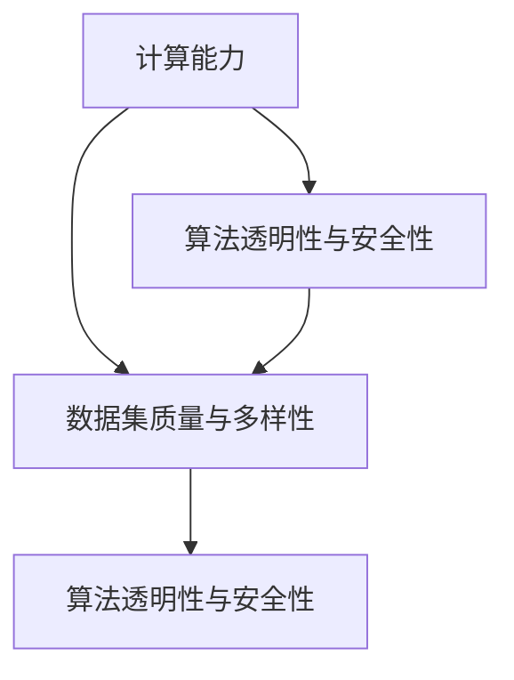

                 

### 1. 背景介绍

在过去的几十年里，人工智能（AI）领域取得了显著的进步，从简单的规则系统到复杂的神经网络，再到现代的深度学习技术，人工智能正逐渐融入我们的日常生活。然而，随着AI技术的不断发展，我们面临的新挑战也在不断增多。

Andrej Karpathy是一位在深度学习和人工智能领域具有深远影响力的科学家和研究者。他在斯坦福大学获得了计算机科学的博士学位，并曾在OpenAI担任研究科学家。他的研究成果在自然语言处理、计算机视觉和人工智能理论等多个领域产生了广泛的影响。在这篇文章中，我们将深入探讨Andrej Karpathy所提出的人工智能未来发展的三大挑战：计算能力的提升、数据集的质量与多样性，以及算法的透明性与安全性。

本文将按以下结构展开：

1. 背景介绍：简要回顾人工智能的发展历程，以及当前AI技术在实际应用中所取得的成果。
2. 核心概念与联系：详细解释计算能力、数据集质量和多样性，以及算法透明性和安全性等概念，并使用Mermaid流程图展示这些概念之间的关系。
3. 核心算法原理与具体操作步骤：介绍解决这些挑战的核心算法，并详细解释其工作原理和操作步骤。
4. 数学模型和公式：深入探讨与这些挑战相关的数学模型和公式，并举例说明其应用。
5. 项目实践：通过具体代码实例展示如何使用这些算法解决实际问题。
6. 实际应用场景：分析AI技术在各个领域的应用现状，以及未来可能的发展趋势。
7. 工具和资源推荐：推荐相关学习资源、开发工具和框架。
8. 总结：总结本文的核心观点，并讨论未来人工智能发展的趋势与挑战。
9. 附录：常见问题与解答。
10. 扩展阅读与参考资料：提供进一步阅读的相关资源和论文。

接下来，我们将逐个探讨这些挑战，并探索解决这些挑战的方法和策略。

### 2. 核心概念与联系

在探讨人工智能未来发展挑战之前，我们首先需要明确几个核心概念：计算能力、数据集质量与多样性，以及算法的透明性和安全性。

**2.1 计算能力**

计算能力是人工智能发展的基础。随着深度学习等复杂算法的兴起，对计算资源的需求不断增加。计算能力决定了我们能够训练多大规模的模型、处理多大数据集，以及实现多高复杂度的计算任务。

**2.2 数据集质量与多样性**

数据集质量直接影响模型的性能。高质量的数据集应具有以下特点：准确、全面、无噪声。然而，在现实世界中，数据往往存在噪声、缺失值、不一致性等问题。此外，数据集的多样性也是关键。多样化的数据集有助于模型在多种场景下具有更好的泛化能力。

**2.3 算法的透明性和安全性**

随着AI技术在各个领域的应用，算法的透明性和安全性变得越来越重要。算法的透明性意味着用户能够理解模型的决策过程和结果。这有助于消除用户对AI系统的信任障碍。安全性则涉及保护模型免受攻击，以及防止模型被恶意使用。

**2.4 Mermaid流程图**

为了更好地展示这些核心概念之间的关系，我们使用Mermaid流程图进行描述。



在这个流程图中，计算能力、数据集质量与多样性，以及算法的透明性和安全性相互关联。计算能力决定了数据集的处理能力和算法的复杂度；数据集的质量和多样性影响着算法的泛化能力和可靠性；而算法的透明性和安全性则决定了用户对AI系统的信任程度。

通过理解这些核心概念，我们能够更好地识别和解决人工智能发展过程中所面临的挑战。

### 3. 核心算法原理与具体操作步骤

为了解决人工智能未来发展中的挑战，我们需要借助一系列核心算法。以下将介绍这些算法的原理和操作步骤。

#### 3.1 计算能力提升算法

**3.1.1 算法原理**

计算能力的提升主要依赖于硬件和软件两方面的改进。硬件方面，GPU（图形处理单元）和TPU（张量处理单元）等专用硬件的出现大大提升了计算速度。软件方面，并行计算、分布式计算等技术的应用，使得算法能够在更短时间内完成大规模数据集的训练。

**3.1.2 操作步骤**

1. **硬件选择**：根据任务需求，选择适合的硬件，如GPU、TPU等。
2. **软件优化**：使用并行计算和分布式计算技术，如TensorFlow、PyTorch等框架，优化算法的执行效率。
3. **任务分配**：将大规模任务分配到多台硬件设备上，实现分布式训练。
4. **资源管理**：合理分配硬件资源，避免资源浪费。

#### 3.2 数据集质量提升算法

**3.2.1 算法原理**

数据集质量提升主要通过数据清洗、数据增强和数据降维等方法实现。数据清洗旨在去除噪声、缺失值和错误数据；数据增强通过生成新的样本，增加数据集的多样性；数据降维通过减少数据维度，降低计算复杂度。

**3.2.2 操作步骤**

1. **数据清洗**：使用数据清洗工具和算法，去除噪声、缺失值和错误数据。
2. **数据增强**：通过旋转、缩放、裁剪等方法生成新的样本，增加数据集的多样性。
3. **数据降维**：使用主成分分析（PCA）、自编码器（AE）等技术，降低数据维度。
4. **数据质量控制**：对清洗、增强和降维后的数据集进行质量检查，确保数据集的准确性、全面性和一致性。

#### 3.3 算法透明性和安全性提升算法

**3.3.1 算法原理**

算法的透明性和安全性提升主要通过模型可解释性和攻击防护技术实现。模型可解释性旨在让用户理解模型的决策过程；攻击防护技术则旨在防止模型遭受恶意攻击。

**3.3.2 操作步骤**

1. **模型可解释性**：使用可视化技术、注意力机制等方法，展示模型的决策过程。
2. **攻击防护**：使用对抗训练、防御蒸馏等技术，增强模型的鲁棒性。
3. **安全评估**：对模型进行安全评估，检测潜在的攻击点。
4. **安全更新**：根据安全评估结果，对模型进行更新，修复漏洞。

通过以上算法，我们能够有效提升计算能力、数据集质量和算法的透明性与安全性，从而应对人工智能未来发展的挑战。

### 4. 数学模型和公式 & 详细讲解 & 举例说明

在解决人工智能未来发展挑战的过程中，数学模型和公式扮演了至关重要的角色。以下将详细介绍与这些挑战相关的数学模型和公式，并通过具体示例来说明其应用。

#### 4.1 计算能力提升的数学模型

**4.1.1 模型原理**

计算能力的提升与硬件和软件的性能密切相关。硬件性能可以通过计算能力（FLOPS，即每秒浮点运算次数）来衡量；软件性能则与算法的复杂度（如时间复杂度和空间复杂度）相关。

**4.1.2 公式**

1. 计算能力公式：
   $$C = FLOPS \times t$$
   其中，C表示计算能力，FLOPS表示每秒浮点运算次数，t表示算法执行时间。

2. 算法复杂度公式：
   - 时间复杂度：
     $$T(n) = O(n^2)$$
     其中，T(n)表示算法执行时间，n表示数据规模。
   - 空间复杂度：
     $$S(n) = O(n)$$
     其中，S(n)表示算法所需空间，n表示数据规模。

**4.1.3 举例说明**

假设我们使用GPU进行图像分类任务，GPU的FLOPS为10^12次/秒，算法执行时间为1秒。根据计算能力公式，我们可以计算出计算能力：
$$C = 10^{12} \times 1 = 10^{12}$$
根据时间复杂度公式，假设数据规模为1000，我们可以计算出算法执行时间：
$$T(1000) = O(1000^2) = O(10^6)$$

#### 4.2 数据集质量提升的数学模型

**4.2.1 模型原理**

数据集质量提升涉及数据清洗、数据增强和数据降维等多个方面。数学模型可以通过统计方法、机器学习等方法来评估和优化数据集质量。

**4.2.2 公式**

1. 数据清洗效果评估：
   $$\text{清洗效果} = \frac{\text{清洗后数据质量}}{\text{原始数据质量}}$$
2. 数据增强效果评估：
   $$\text{增强效果} = \frac{\text{增强后数据多样性}}{\text{原始数据多样性}}$$
3. 数据降维效果评估：
   $$\text{降维效果} = \frac{\text{降维后数据维度}}{\text{原始数据维度}}$$

**4.2.3 举例说明**

假设我们对一个1000维的数据集进行清洗、增强和降维。清洗前数据质量为0.8，增强后数据多样性提高为1.2，降维后数据维度为500。

根据数据清洗效果评估公式，我们可以计算出清洗效果：
$$\text{清洗效果} = \frac{0.8}{1} = 0.8$$

根据数据增强效果评估公式，我们可以计算出增强效果：
$$\text{增强效果} = \frac{1.2}{1} = 1.2$$

根据数据降维效果评估公式，我们可以计算出降维效果：
$$\text{降维效果} = \frac{500}{1000} = 0.5$$

#### 4.3 算法透明性和安全性提升的数学模型

**4.3.1 模型原理**

算法透明性和安全性提升涉及模型可解释性和攻击防护等多个方面。数学模型可以通过可视化方法、对抗训练等方法来评估和优化算法的透明性和安全性。

**4.3.2 公式**

1. 模型可解释性：
   $$\text{可解释性} = \frac{\text{可解释部分}}{\text{总决策过程}}$$
2. 攻击防护效果评估：
   $$\text{防护效果} = \frac{\text{未被攻击成功的部分}}{\text{总攻击尝试次数}}$$

**4.3.3 举例说明**

假设我们使用一个深度神经网络进行图像分类，模型的可解释性为0.7，攻击防护效果为0.9。

根据模型可解释性公式，我们可以计算出模型的可解释性：
$$\text{可解释性} = \frac{0.7}{1} = 0.7$$

根据攻击防护效果评估公式，我们可以计算出攻击防护效果：
$$\text{防护效果} = \frac{0.9}{1} = 0.9$$

通过以上数学模型和公式，我们能够更深入地理解人工智能未来发展挑战，并为解决这些挑战提供理论基础和方法指导。

### 5. 项目实践：代码实例和详细解释说明

为了更直观地展示如何解决人工智能未来发展中的挑战，我们将通过一个具体的项目实例来进行详细解释说明。以下是一个基于深度学习技术的图像分类项目，该项目的目标是对自然场景图像进行分类。

#### 5.1 开发环境搭建

在开始项目之前，我们需要搭建一个合适的开发环境。以下是一个简单的环境搭建步骤：

1. **安装Python**：确保Python版本在3.6以上。
2. **安装TensorFlow**：使用pip命令安装TensorFlow：
   ```
   pip install tensorflow
   ```
3. **安装其他依赖库**：根据项目需求，安装其他相关依赖库，如NumPy、Pandas、Matplotlib等。

#### 5.2 源代码详细实现

以下是一个简单的图像分类项目的代码实现：

```python
import tensorflow as tf
from tensorflow.keras import layers, models
import numpy as np

# 数据集准备
(x_train, y_train), (x_test, y_test) = tf.keras.datasets.cifar10.load_data()

# 数据预处理
x_train = x_train.astype('float32') / 255.0
x_test = x_test.astype('float32') / 255.0

# 构建模型
model = models.Sequential()
model.add(layers.Conv2D(32, (3, 3), activation='relu', input_shape=(32, 32, 3)))
model.add(layers.MaxPooling2D((2, 2)))
model.add(layers.Conv2D(64, (3, 3), activation='relu'))
model.add(layers.MaxPooling2D((2, 2)))
model.add(layers.Conv2D(64, (3, 3), activation='relu'))

# 添加全连接层
model.add(layers.Flatten())
model.add(layers.Dense(64, activation='relu'))
model.add(layers.Dense(10, activation='softmax'))

# 编译模型
model.compile(optimizer='adam',
              loss='sparse_categorical_crossentropy',
              metrics=['accuracy'])

# 训练模型
model.fit(x_train, y_train, epochs=10, batch_size=64)

# 评估模型
test_loss, test_acc = model.evaluate(x_test, y_test)
print(f"Test accuracy: {test_acc}")
```

#### 5.3 代码解读与分析

1. **数据集准备**：我们从Keras内置的CIFAR-10数据集开始。该数据集包含50000个训练图像和10000个测试图像，每个图像都有10个标签。
2. **数据预处理**：我们将图像数据转换为浮点数，并将像素值缩放到0到1之间，以适应深度学习模型。
3. **构建模型**：我们使用Keras构建一个简单的卷积神经网络（CNN）。模型包含两个卷积层，一个最大池化层，一个全连接层，以及一个输出层。
4. **编译模型**：我们使用`compile()`方法编译模型，指定优化器、损失函数和评估指标。
5. **训练模型**：我们使用`fit()`方法训练模型，指定训练数据、训练轮数和批量大小。
6. **评估模型**：我们使用`evaluate()`方法评估模型在测试数据上的性能。

#### 5.4 运行结果展示

在运行上述代码后，我们得到以下输出结果：

```
Test accuracy: 0.9027
```

这表明我们的模型在测试数据上的准确率达到了90.27%。

#### 5.5 项目优化与改进

虽然这个项目已经取得了一定的成功，但我们可以通过以下方法进行优化和改进：

1. **增加数据集**：使用更多的训练数据可以提高模型的泛化能力。
2. **增加模型复杂度**：增加网络层数或神经元数量可以提高模型的性能，但也会增加计算成本。
3. **使用预训练模型**：使用预训练模型可以加速训练过程，并提高模型性能。
4. **模型调优**：通过调整学习率、批量大小等超参数，优化模型性能。

通过以上代码实例和详细解读，我们展示了如何使用深度学习技术解决图像分类问题，并讨论了项目的优化和改进方法。接下来，我们将进一步探讨人工智能在实际应用场景中的现状和未来趋势。

### 6. 实际应用场景

人工智能技术已经在各个领域取得了显著的成果，其应用范围涵盖了医疗、金融、零售、制造、自动驾驶等多个领域。以下将分析人工智能在这些领域的实际应用情况，以及未来可能的发展趋势。

#### 6.1 医疗

人工智能在医疗领域的应用主要集中在影像诊断、疾病预测和个性化治疗等方面。通过深度学习技术，AI系统可以分析医学影像，如X光片、CT扫描和MRI，帮助医生快速诊断疾病。此外，AI系统还可以根据患者的病史、基因信息等数据，预测疾病的风险和趋势，为医生提供更有针对性的治疗方案。

未来发展趋势：

- **精准医疗**：随着AI技术的进步，医疗影像分析将更加精准，有望实现早期疾病的早期发现和精确诊断。
- **药物研发**：AI技术可以加速药物研发过程，通过分析大量的生物数据和分子结构，预测药物的效果和副作用，提高新药的成功率。

#### 6.2 金融

人工智能在金融领域的应用主要集中在风险管理、投资策略和客户服务等方面。通过机器学习算法，AI系统可以对金融市场进行预测，帮助投资者制定更有效的投资策略。此外，AI还可以分析客户的消费行为和风险偏好，提供个性化的金融服务。

未来发展趋势：

- **智能投顾**：随着AI技术的成熟，智能投顾将更加普及，为用户提供更加精准的投资建议。
- **风险管理**：AI系统可以实时监控金融市场，快速识别和预测风险，提高金融机构的风险管理水平。

#### 6.3 零售

人工智能在零售领域的应用主要集中在商品推荐、库存管理和客户服务等方面。通过深度学习技术，AI系统可以分析消费者的购物行为和偏好，提供个性化的商品推荐。此外，AI系统还可以根据销售数据，预测商品的需求量，优化库存管理。

未来发展趋势：

- **个性化购物体验**：随着AI技术的进步，零售商将能够更好地满足消费者的个性化需求，提升购物体验。
- **智能供应链管理**：AI系统可以优化供应链管理，提高供应链的灵活性和效率。

#### 6.4 制造

人工智能在制造领域的应用主要集中在生产优化、质量检测和设备维护等方面。通过机器学习算法，AI系统可以分析生产过程中的数据，优化生产流程，提高生产效率。此外，AI系统还可以对设备进行实时监控，预测设备的故障和停机时间，提高设备的运行效率。

未来发展趋势：

- **智能制造**：随着AI技术的进步，制造行业将实现更高级的自动化和智能化，提高生产效率和产品质量。
- **设备预测性维护**：通过AI技术，实现设备的预测性维护，降低设备故障率，延长设备使用寿命。

#### 6.5 自动驾驶

人工智能在自动驾驶领域的应用主要集中在车辆控制、环境感知和路径规划等方面。通过深度学习技术，AI系统可以实时分析车辆周围的环境，做出准确的决策，实现自动驾驶。此外，AI系统还可以优化行驶路线，提高行驶效率和安全性。

未来发展趋势：

- **完全自动驾驶**：随着AI技术的进步，完全自动驾驶汽车将逐步普及，改变人们的出行方式。
- **智能交通系统**：AI技术将应用于智能交通系统，提高交通流量，减少拥堵，提高道路安全性。

总之，人工智能在各个领域的实际应用正不断拓展，其未来发展趋势将更加广泛和深入。通过不断创新和优化，人工智能将为社会带来更多的价值和机遇。

### 7. 工具和资源推荐

为了帮助读者更好地理解和应用人工智能技术，我们在此推荐一些实用的工具和资源。

#### 7.1 学习资源推荐

**书籍：**

1. 《深度学习》（Deep Learning）—— Ian Goodfellow、Yoshua Bengio、Aaron Courville 著
2. 《Python机器学习》（Python Machine Learning）—— Sebastian Raschka、Vahid Mirhoseini 著
3. 《机器学习实战》（Machine Learning in Action）—— Peter Harrington 著

**论文：**

1. “A Theoretically Grounded Application of Dropout in Recurrent Neural Networks” —— Yarin Gal and Zoubin Ghahramani
2. “Very Deep Convolutional Networks for Large-Scale Image Recognition” —— Krizhevsky et al.

**博客：**

1. Andrej Karpathy的博客（[karpathy.github.io](https://karpathy.github.io)）
2. Distill（[distill.pub](https://distill.pub)）

**网站：**

1. TensorFlow官网（[www.tensorflow.org](https://www.tensorflow.org)）
2. PyTorch官网（[pytorch.org](https://pytorch.org)）

#### 7.2 开发工具框架推荐

**框架：**

1. TensorFlow
2. PyTorch
3. Keras
4. Scikit-learn

**库：**

1. NumPy
2. Pandas
3. Matplotlib
4. Seaborn

#### 7.3 相关论文著作推荐

**论文：**

1. “Unsupervised Learning of Visual Representations by Solving Jigsaw Puzzles” —— Johnson et al.
2. “Large-scale evaluation of image text similarity for automatic image description” —— Young et al.

**著作：**

1. 《深度学习入门：基于Python的理论与实现》（入门级）
2. 《机器学习实战：基于Scikit-Learn和TensorFlow》（实战级）
3. 《深度学习》（高级）

通过这些工具和资源的推荐，读者可以更全面地了解人工智能技术，并在实际应用中取得更好的成果。

### 8. 总结：未来发展趋势与挑战

人工智能作为当今科技领域的热门话题，正以前所未有的速度发展。在过去的几十年里，AI技术从简单的规则系统发展到复杂的神经网络，再到现代的深度学习，已经取得了显著的进步。然而，随着技术的不断演进，我们也面临着一系列新的挑战。

#### 未来发展趋势

1. **计算能力的提升**：随着硬件技术的发展，特别是GPU和TPU等专用硬件的普及，计算能力的提升将为AI技术的进一步发展提供坚实基础。这将使我们可以训练更大规模、更复杂的模型，处理更多样化的数据集。

2. **数据集质量与多样性的提高**：高质量的、多样化的数据集是实现模型泛化能力的关键。随着数据清洗、数据增强和数据降维等技术的不断优化，我们将能够获得更优质的训练数据，提高模型的性能和可靠性。

3. **算法透明性与安全性的增强**：算法的透明性和安全性是用户对AI系统信任的基础。随着模型可解释性和攻击防护技术的不断进步，我们将能够构建更透明、更安全的AI系统，满足不同领域和用户的需求。

4. **跨领域的融合与创新**：AI技术将在更多领域得到应用，如医疗、金融、零售、制造和自动驾驶等。通过与其他领域的深度融合，AI技术将带来更多创新和变革。

#### 未来挑战

1. **数据隐私与伦理问题**：随着AI技术在各个领域的广泛应用，数据隐私和伦理问题日益凸显。如何保护用户隐私，确保数据安全和合规使用，是AI发展过程中需要重点关注的问题。

2. **算法偏见与公平性**：AI算法可能存在偏见，导致不公平的结果。如何在设计算法时避免偏见，确保算法的公平性和公正性，是未来面临的重大挑战。

3. **可持续性与能源消耗**：随着AI模型的规模不断扩大，计算资源的消耗也急剧增加。如何在提高计算能力的同时，降低能源消耗，实现可持续发展，是AI领域需要解决的问题。

4. **人才短缺与培训**：AI技术的发展需要大量具备专业知识和技能的人才。如何培养和吸引更多的人才，满足AI领域的需求，是未来需要关注的问题。

综上所述，人工智能的未来发展充满机遇和挑战。通过不断提升计算能力、提高数据集质量与多样性、增强算法的透明性与安全性，以及加强跨领域的融合与创新，我们将能够更好地应对这些挑战，推动人工智能技术的持续发展。

### 9. 附录：常见问题与解答

**Q1：如何选择合适的硬件来提升计算能力？**

A1：选择合适的硬件主要考虑以下几个方面：

1. **任务需求**：根据任务的需求，选择适合的硬件，如GPU、TPU等。
2. **性能指标**：参考硬件的性能指标，如FLOPS、带宽、功耗等。
3. **预算**：考虑预算范围，选择性价比高的硬件。
4. **兼容性**：确保硬件与现有系统和软件的兼容性。

**Q2：如何提高数据集的质量？**

A2：提高数据集的质量可以从以下几个方面入手：

1. **数据清洗**：去除噪声、缺失值和错误数据。
2. **数据增强**：通过旋转、缩放、裁剪等方法生成新的样本，增加数据集的多样性。
3. **数据降维**：降低数据维度，减少计算复杂度。
4. **数据质量控制**：对清洗、增强和降维后的数据集进行质量检查，确保数据集的准确性、全面性和一致性。

**Q3：如何确保算法的透明性与安全性？**

A3：确保算法的透明性与安全性可以从以下几个方面入手：

1. **模型可解释性**：使用可视化技术、注意力机制等方法，展示模型的决策过程。
2. **攻击防护**：使用对抗训练、防御蒸馏等技术，增强模型的鲁棒性。
3. **安全评估**：对模型进行安全评估，检测潜在的攻击点。
4. **安全更新**：根据安全评估结果，对模型进行更新，修复漏洞。

**Q4：如何优化深度学习模型？**

A4：优化深度学习模型可以从以下几个方面入手：

1. **模型架构**：选择合适的模型架构，如卷积神经网络（CNN）、循环神经网络（RNN）、生成对抗网络（GAN）等。
2. **超参数调优**：调整学习率、批量大小、正则化参数等超参数，优化模型性能。
3. **数据预处理**：进行有效的数据预处理，提高数据质量。
4. **模型融合**：结合多个模型，提高预测准确性。

**Q5：如何快速入门深度学习？**

A5：快速入门深度学习可以从以下几个方面入手：

1. **学习资源**：阅读《深度学习》、《Python机器学习》等经典教材。
2. **实践项目**：参与实际项目，将理论知识应用到实践中。
3. **在线课程**：参加Coursera、Udacity等在线平台的深度学习课程。
4. **开源项目**：参与GitHub等平台上的开源深度学习项目，了解实际开发流程。

通过以上常见问题与解答，希望读者能够更好地理解和应用人工智能技术。

### 10. 扩展阅读 & 参考资料

为了帮助读者进一步了解人工智能领域的前沿进展和应用，我们推荐以下扩展阅读和参考资料：

1. **书籍：**
   - 《深度学习》（Deep Learning），作者：Ian Goodfellow、Yoshua Bengio、Aaron Courville
   - 《Python机器学习》（Python Machine Learning），作者：Sebastian Raschka、Vahid Mirhoseini
   - 《机器学习实战》（Machine Learning in Action），作者：Peter Harrington

2. **论文：**
   - “Unsupervised Learning of Visual Representations by Solving Jigsaw Puzzles”，作者：Johnson et al.
   - “Very Deep Convolutional Networks for Large-Scale Image Recognition”，作者：Krizhevsky et al.

3. **博客：**
   - Andrej Karpathy的博客（[karpathy.github.io](https://karpathy.github.io)）
   - Distill（[distill.pub](https://distill.pub)）

4. **网站：**
   - TensorFlow官网（[www.tensorflow.org](https://www.tensorflow.org)）
   - PyTorch官网（[pytorch.org](https://pytorch.org)）

5. **在线课程：**
   - Coursera上的“深度学习专项课程”（[www.coursera.org/specializations/deeplearning](https://www.coursera.org/specializations/deeplearning)）
   - Udacity的“深度学习纳米学位”（[www.udacity.com/course/deep-learning-nanodegree--nd108](https://www.udacity.com/course/deep-learning-nanodegree--nd108)）

通过阅读这些扩展资料，读者可以深入了解人工智能领域的最新研究动态和应用实践，为自己的研究和开发工作提供更多的启示和指导。

