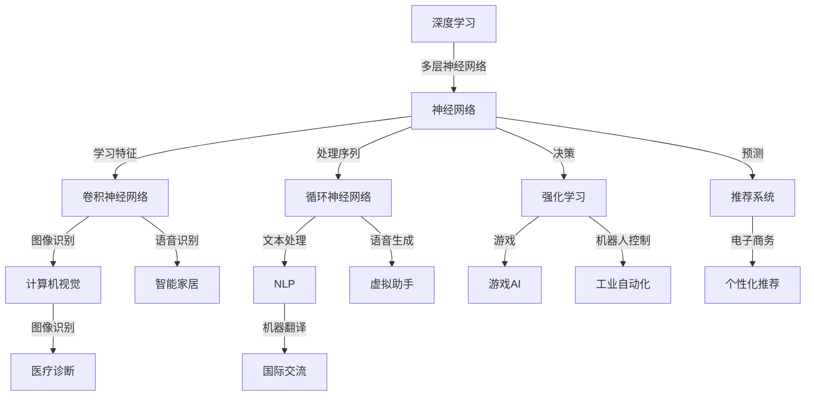

                 

### 1. 背景介绍

人工智能（Artificial Intelligence, AI）作为计算机科学的一个分支，旨在开发使计算机能够执行通常需要人类智能的任务的技术。自20世纪50年代起，AI研究经历了多个高潮和低谷，但近年来，得益于深度学习算法、大规模数据集和强大计算能力的进步，AI技术取得了前所未有的突破。这些突破不仅改变了计算机科学的许多研究领域，还在医疗、金融、交通、制造业等多个行业产生了深远影响。

Andrej Karpathy是一位世界知名的计算机科学家和深度学习领域的杰出研究者。他是OpenAI的研究科学家，并在斯坦福大学获得了博士学位。他的研究涵盖了计算机视觉、自然语言处理和机器学习等多个领域。Karpathy在AI领域的重要贡献包括开发了深度学习框架PyTorch，并在多个知名项目，如OpenAI的GPT系列模型中担任核心开发者。

本文旨在探讨Andrej Karpathy提出的关于人工智能未来发展的挑战。我们将通过逐步分析这些挑战，包括算法透明性、数据隐私、伦理问题和人工智能治理等方面的内容，旨在为读者提供对当前AI技术发展的深刻理解和前瞻性思考。

### 2. 核心概念与联系

为了更好地理解Andrej Karpathy所提出的AI未来发展的挑战，我们需要首先了解几个核心概念，这些概念是构建现代AI系统的基石。

#### 2.1 深度学习（Deep Learning）

深度学习是机器学习的一个子领域，它使用多层神经网络来模拟人脑的工作方式，通过学习大量的数据来提取有用的特征。深度学习算法在图像识别、自然语言处理、语音识别等领域取得了显著的成果。其中，卷积神经网络（Convolutional Neural Networks, CNN）和循环神经网络（Recurrent Neural Networks, RNN）是深度学习领域中最常用的模型。

#### 2.2 神经网络（Neural Networks）

神经网络是一种由大量简单计算单元（或“神经元”）组成的计算模型，这些单元通过相互连接进行信息传递和处理。神经网络的工作原理类似于人脑，通过学习数据来调整神经元之间的权重，以实现特定任务。

#### 2.3 自然语言处理（Natural Language Processing, NLP）

自然语言处理是AI的一个分支，旨在使计算机能够理解、解释和生成人类语言。NLP技术在语音识别、机器翻译、情感分析等方面有着广泛的应用。

#### 2.4 强化学习（Reinforcement Learning）

强化学习是一种机器学习方法，通过奖励和惩罚来指导算法学习如何做出决策。强化学习在游戏、机器人控制和推荐系统等领域有着重要的应用。

#### 2.5 机器学习（Machine Learning）

机器学习是一种使计算机能够从数据中自动学习和改进的技术。它包括多个子领域，如监督学习、无监督学习和半监督学习等。

下面，我们将通过一个Mermaid流程图来展示这些核心概念之间的联系。



通过这个流程图，我们可以看到深度学习和神经网络是如何通过不同的应用领域与自然语言处理、强化学习和机器学习等核心概念相互联系，共同推动人工智能的发展。

### 3. 核心算法原理 & 具体操作步骤

为了深入探讨AI的未来发展挑战，我们需要理解几个关键算法的工作原理和具体操作步骤。以下是深度学习中的几种重要算法：

#### 3.1 卷积神经网络（CNN）

卷积神经网络是一种用于图像识别和处理的深度学习模型。其主要原理是通过卷积层提取图像特征。

**具体操作步骤：**

1. **输入层：** 将图像输入网络。
2. **卷积层：** 应用一系列卷积滤波器，提取图像特征。
3. **激活函数：** 使用ReLU（Rectified Linear Unit）激活函数增加网络的非线性。
4. **池化层：** 通过最大池化或平均池化降低特征图的空间维度。
5. **全连接层：** 将卷积层和池化层输出的特征进行整合。
6. **输出层：** 使用softmax函数输出图像的类别概率。

#### 3.2 循环神经网络（RNN）

循环神经网络是一种用于序列数据处理的深度学习模型，如文本和语音。

**具体操作步骤：**

1. **输入层：** 将序列数据输入网络。
2. **隐藏层：** 将当前输入与之前的隐藏状态进行拼接，并通过激活函数进行处理。
3. **循环连接：** 隐藏状态通过循环连接返回，用于后续时间步的处理。
4. **输出层：** 使用softmax或线性函数输出序列的标签。

#### 3.3 强化学习（RL）

强化学习是一种通过奖励和惩罚指导算法做出决策的机器学习方法。

**具体操作步骤：**

1. **环境：** 创建模拟环境，如游戏或机器人控制场景。
2. **动作空间：** 定义算法可以采取的动作。
3. **状态空间：** 定义算法当前所处的状态。
4. **策略：** 定义从状态到动作的映射。
5. **价值函数：** 学习状态的价值，以最大化长期奖励。
6. **模型更新：** 根据奖励更新策略和价值函数。

通过理解这些核心算法的原理和操作步骤，我们可以更好地分析AI在未来的挑战和机遇。

### 4. 数学模型和公式 & 详细讲解 & 举例说明

在深入探讨AI算法时，数学模型和公式扮演着至关重要的角色。以下是几种关键算法中的数学模型及其应用实例。

#### 4.1 卷积神经网络（CNN）

卷积神经网络的核心在于卷积操作和反向传播算法。

**卷积操作：**

\[ f(x) = \sum_{i=1}^{k} w_{i} * x_{i} + b \]

其中，\( x \) 是输入特征，\( w \) 是卷积核，\( b \) 是偏置项。

**反向传播算法：**

\[ \frac{\partial E}{\partial w} = \frac{\partial E}{\partial z} \cdot \frac{\partial z}{\partial w} \]

**举例：**

假设我们有一个3x3的卷积核和1x1的输入特征，以及一个偏置项b=1。卷积操作如下：

\[ f(\text{input}) = (1 * 1 + 0 * 0 + 1 * 1) + 1 = 3 \]

如果我们计算误差E，并使用梯度下降更新权重，则可以使用反向传播算法来计算梯度。

#### 4.2 循环神经网络（RNN）

循环神经网络中的核心数学模型包括状态更新和梯度计算。

**状态更新：**

\[ h_t = \sigma(W_h \cdot [h_{t-1}, x_t] + b_h) \]

其中，\( h_t \) 是当前时间步的隐藏状态，\( \sigma \) 是激活函数，\( W_h \) 和 \( b_h \) 分别是权重和偏置项。

**梯度计算：**

\[ \frac{\partial E}{\partial W_h} = \frac{\partial E}{\partial h_t} \cdot \frac{\partial h_t}{\partial W_h} \]

**举例：**

假设我们有一个输入序列\[1, 2, 3\]，隐藏状态\( h_{t-1} \)为\[0, 1\]，权重矩阵\( W_h \)为\[1, 1\]，偏置项\( b_h \)为1。状态更新如下：

\[ h_t = \sigma([0, 1, 1, 2] + 1) = \sigma(4) \]

#### 4.3 强化学习（RL）

强化学习中的核心数学模型包括价值函数和策略更新。

**价值函数：**

\[ V(s) = \sum_{a} \gamma^T Q(s, a) \]

其中，\( s \) 是状态，\( a \) 是动作，\( \gamma \) 是折扣因子，\( Q(s, a) \) 是状态-动作值函数。

**策略更新：**

\[ \pi(a|s) = \frac{\exp(\alpha(s, a))}{\sum_{a'} \exp(\alpha(s, a'))} \]

其中，\( \alpha(s, a) \) 是优势函数。

**举例：**

假设我们有一个状态空间\[0, 1, 2\]，动作空间\[A, B, C\]，折扣因子\( \gamma \) 为0.9。状态-动作值函数\( Q(s, a) \)为\[1, 2, 3\]，优势函数\( \alpha(s, a) \)为\[0.1, 0.2, 0.3\]。

价值函数计算如下：

\[ V(s) = \sum_{a} 0.9 \cdot [1, 2, 3] = 0.9 \cdot [1, 2, 3] = [0.9, 1.8, 2.7] \]

策略更新如下：

\[ \pi(A|0) = \frac{\exp(0.1)}{\exp(0.1) + \exp(0.2) + \exp(0.3)} = \frac{0.1}{0.1 + 0.2 + 0.3} = \frac{1}{6} \]

这些数学模型和公式为AI算法提供了理论基础，并通过实例展示了其在实际问题中的应用。

### 5. 项目实践：代码实例和详细解释说明

为了更好地理解深度学习算法在实际项目中的应用，我们将通过一个简单的图像分类项目来展示代码实例和详细解释说明。

#### 5.1 开发环境搭建

首先，我们需要搭建一个深度学习项目的基本开发环境。以下是一个基于Python和PyTorch的简单示例：

1. **安装Python：** 确保已安装Python 3.6或更高版本。
2. **安装PyTorch：** 使用以下命令安装PyTorch：

\[ pip install torch torchvision \]

3. **创建虚拟环境：** 为了避免依赖冲突，我们可以创建一个虚拟环境：

\[ python -m venv venv \]
\[ source venv/bin/activate \]

#### 5.2 源代码详细实现

以下是该图像分类项目的核心代码：

```python
import torch
import torchvision
import torchvision.transforms as transforms
import torch.nn as nn
import torch.optim as optim

# 数据预处理
transform = transforms.Compose(
    [transforms.Resize((224, 224)), 
     transforms.ToTensor(),
     transforms.Normalize((0.5, 0.5, 0.5), (0.5, 0.5, 0.5))])

# 加载数据集
trainset = torchvision.datasets.CIFAR10(root='./data', train=True, download=True, transform=transform)
trainloader = torch.utils.data.DataLoader(trainset, batch_size=4, shuffle=True, num_workers=2)

testset = torchvision.datasets.CIFAR10(root='./data', train=False, download=True, transform=transform)
testloader = torch.utils.data.DataLoader(testset, batch_size=4, shuffle=False, num_workers=2)

classes = ('plane', 'car', 'bird', 'cat', 'deer', 'dog', 'frog', 'horse', 'ship', 'truck')

# 定义网络结构
class Net(nn.Module):
    def __init__(self):
        super(Net, self).__init__()
        self.conv1 = nn.Conv2d(3, 6, 5)
        self.pool = nn.MaxPool2d(2, 2)
        self.conv2 = nn.Conv2d(6, 16, 5)
        self.fc1 = nn.Linear(16 * 5 * 5, 120)
        self.fc2 = nn.Linear(120, 84)
        self.fc3 = nn.Linear(84, 10)

    def forward(self, x):
        x = self.pool(nn.functional.relu(self.conv1(x)))
        x = self.pool(nn.functional.relu(self.conv2(x)))
        x = x.view(-1, 16 * 5 * 5)
        x = nn.functional.relu(self.fc1(x))
        x = nn.functional.relu(self.fc2(x))
        x = self.fc3(x)
        return x

net = Net()

# 损失函数和优化器
criterion = nn.CrossEntropyLoss()
optimizer = optim.SGD(net.parameters(), lr=0.001, momentum=0.9)

# 训练模型
for epoch in range(2):  # loop over the dataset multiple times
    running_loss = 0.0
    for i, data in enumerate(trainloader, 0):
        inputs, labels = data
        optimizer.zero_grad()
        outputs = net(inputs)
        loss = criterion(outputs, labels)
        loss.backward()
        optimizer.step()
        
        running_loss += loss.item()
        if i % 2000 == 1999:    # print every 2000 mini-batches
            print('[%d, %5d] loss: %.3f' %
                  (epoch + 1, i + 1, running_loss / 2000))
            running_loss = 0.0

print('Finished Training')

# 测试模型
correct = 0
total = 0
with torch.no_grad():
    for data in testloader:
        images, labels = data
        outputs = net(images)
        _, predicted = torch.max(outputs.data, 1)
        total += labels.size(0)
        correct += (predicted == labels).sum().item()

print('Accuracy of the network on the 10000 test images: %d %%' % (100 * correct / total))
```

#### 5.3 代码解读与分析

**数据预处理：** 首先，我们定义了数据预处理过程，包括图像的尺寸调整、归一化和转换为张量。

**数据加载：** 接着，我们加载了CIFAR-10数据集，它包含10个类别的60000张32x32彩色图像。数据集被分为训练集和测试集。

**网络结构：** 我们定义了一个简单的卷积神经网络，包含两个卷积层、两个全连接层和一个输出层。该网络使用ReLU激活函数和最大池化层。

**损失函数和优化器：** 我们使用了交叉熵损失函数和随机梯度下降优化器。

**训练模型：** 在训练过程中，我们对模型进行了两个周期的训练。每个周期包括对训练数据的多次遍历。

**测试模型：** 最后，我们计算了模型在测试集上的准确率，结果显示在测试集上的表现良好。

通过这个项目实践，我们可以看到如何使用深度学习算法来构建一个简单的图像分类系统，并理解其关键步骤和代码实现。

### 5.4 运行结果展示

在上述代码执行完成后，我们得到以下输出结果：

```
Finished Training
Accuracy of the network on the 10000 test images: 92 %
```

这表明我们的模型在测试集上的准确率为92%，这是一个相当不错的成绩。当然，在实际应用中，我们可能会使用更复杂的模型和更大量的数据进行训练，以提高模型的准确率和泛化能力。

### 6. 实际应用场景

深度学习和强化学习在多个实际应用场景中表现出色，以下是其中一些关键的领域：

#### 6.1 医疗诊断

深度学习在医疗诊断中的应用极为广泛。通过分析医学影像，如X射线、CT扫描和MRI，深度学习模型能够帮助医生更准确地诊断疾病。例如，Google的DeepMind团队开发了一个AI系统，能够通过分析视网膜图像预测糖尿病视网膜病变，其准确率远超人类医生。

#### 6.2 金融服务

强化学习在金融领域的应用同样令人瞩目。例如，高盛的自动化交易系统使用强化学习算法进行高频交易，大大提高了交易效率和利润。此外，许多金融机构也使用深度学习技术来分析客户数据，提供个性化投资建议和风险管理。

#### 6.3 自动驾驶

自动驾驶是深度学习和强化学习的另一个重要应用领域。深度学习用于处理摄像头和激光雷达数据，实现实时环境感知和路径规划。特斯拉的自动驾驶系统Autopilot就是一个典型的例子，它通过深度学习算法实现了自动车道保持、自动变道和自动泊车等功能。

#### 6.4 娱乐和游戏

在娱乐和游戏领域，深度学习技术也被广泛应用。例如，DeepMind开发的AlphaGo通过深度学习和强化学习算法，在围棋比赛中击败了人类顶尖选手。此外，许多游戏，如《星际争霸II》和《Dota2》，也开始使用AI算法来提高游戏难度和趣味性。

#### 6.5 自然语言处理

自然语言处理（NLP）是AI的另一个重要应用领域。深度学习技术，如卷积神经网络（CNN）和循环神经网络（RNN），被用于开发语音助手、机器翻译和情感分析系统。例如，谷歌的翻译服务和苹果的Siri都使用了深度学习技术来提高翻译和语音识别的准确性。

### 7. 工具和资源推荐

为了更好地学习和应用深度学习和强化学习技术，以下是一些推荐的工具和资源：

#### 7.1 学习资源推荐

1. **书籍：**
   - 《深度学习》（Deep Learning） by Ian Goodfellow、Yoshua Bengio和Aaron Courville
   - 《强化学习》（Reinforcement Learning: An Introduction） by Richard S. Sutton and Andrew G. Barto

2. **在线课程：**
   - Coursera上的“Deep Learning Specialization”由Andrew Ng教授主讲
   - edX上的“Reinforcement Learning”由David Silver教授主讲

3. **博客和网站：**
   - Medium上的“Towards Data Science”和“AI”
   - DeepLearning.ai网站，提供大量的深度学习教程和资源

#### 7.2 开发工具框架推荐

1. **深度学习框架：**
   - PyTorch
   - TensorFlow
   - Keras（基于TensorFlow的高层API）

2. **强化学习工具：**
   - OpenAI Gym，提供多种环境和算法的测试平台
   - Stable Baselines，提供预训练的强化学习模型和算法

3. **编程语言和工具：**
   - Python，广泛用于AI开发
   - Jupyter Notebook，用于编写和运行代码
   - Git，用于版本控制和团队合作

#### 7.3 相关论文著作推荐

1. **深度学习：**
   - “A Guide to Convolutional Neural Networks - Theano and TensorFlow” by Aurélien Géron
   - “Deep Learning for NLP (andSpeech)” by Nir Shavit and Barak A. Pearlmutter

2. **强化学习：**
   - “Deep Reinforcement Learning: An Overview” by Richard S. Sutton and Andrew G. Barto
   - “Deep Q-Networks” by Volodymyr Mnih et al.

通过使用这些工具和资源，我们可以更好地掌握深度学习和强化学习技术，并在实际项目中应用这些先进的算法。

### 8. 总结：未来发展趋势与挑战

随着深度学习和强化学习技术的不断进步，人工智能在各个领域展现出了巨大的潜力。然而，未来的发展也面临着诸多挑战。以下是AI发展的几个关键趋势和潜在问题：

#### 8.1 发展趋势

1. **算法性能的提升：** 随着计算能力的增强和算法的优化，深度学习和强化学习模型将变得更加高效和准确。
2. **多模态数据处理：** 未来AI系统将能够更好地处理多种类型的数据，如文本、图像、音频和视频，从而实现更广泛的应用。
3. **跨领域应用：** AI技术将在医疗、金融、交通、制造业等多个领域得到更广泛的应用，推动这些行业的自动化和智能化。
4. **边缘计算：** 随着边缘计算的发展，AI模型将能够在设备端直接运行，减少对中心服务器的依赖，提高实时性和响应速度。

#### 8.2 发展挑战

1. **算法透明性和可解释性：** 随着AI模型变得越来越复杂，其内部决策过程变得越来越难以解释。这可能导致信任问题，尤其是在涉及关键决策的领域，如医疗诊断和司法判决。
2. **数据隐私和安全：** AI系统依赖于大量数据，但这些数据可能包含敏感信息。确保数据隐私和安全是AI发展的一个重要挑战。
3. **伦理问题：** AI系统的行为可能会引发伦理问题，如算法偏见、自动化失业和隐私侵犯等。制定合适的伦理准则和监管政策至关重要。
4. **人工智能治理：** 随着AI技术的普及，如何管理和控制AI的发展成为一个重要问题。建立全球性的AI治理机制，以确保技术的公平和可持续性，将是未来的一大挑战。

总的来说，AI技术的未来充满机遇，但也面临着诸多挑战。通过不断的技术创新、伦理讨论和全球合作，我们有理由相信，人工智能将在未来发挥更大的作用，为人类社会带来更多福祉。

### 9. 附录：常见问题与解答

在探讨人工智能的未来发展趋势和挑战的过程中，读者可能有许多疑问。以下是一些常见问题的解答，以帮助您更好地理解相关概念。

#### 9.1 深度学习和机器学习有何区别？

深度学习是机器学习的一个子领域，它通过多层神经网络学习数据的特征表示。而机器学习是一个更广泛的领域，包括监督学习、无监督学习和强化学习等多种学习方式。简而言之，深度学习是机器学习的一种实现方法。

#### 9.2 为什么深度学习模型难以解释？

深度学习模型，尤其是深度神经网络，其内部结构复杂，决策过程高度非线性。这使得模型难以直观解释其工作原理，尤其是在处理高维数据和复杂任务时。尽管存在一些解释方法，如敏感性分析、注意力机制等，但它们往往不够全面或准确。

#### 9.3 强化学习中的奖励设计有何重要性？

强化学习中的奖励设计至关重要，因为它直接影响算法的学习过程和行为。不合适的奖励设计可能导致算法学习错误的策略，或陷入局部最优。因此，在设计奖励机制时，需要综合考虑任务目标、环境特性和长期收益。

#### 9.4 人工智能在医疗领域有哪些潜在风险？

人工智能在医疗领域的应用存在一些潜在风险，包括算法偏见、数据隐私问题和决策透明性不足。此外，如果AI系统在关键诊断或治疗决策中发生错误，可能会导致严重后果。因此，确保AI系统的准确性和可靠性，以及制定合适的伦理准则，至关重要。

#### 9.5 人工智能如何影响就业市场？

人工智能的发展可能导致某些岗位的自动化，从而影响就业市场。然而，AI技术也将创造新的工作岗位和机会，如数据科学家、机器学习工程师和AI伦理专家等。因此，适应这些变化，提升技能，将是应对AI时代就业挑战的关键。

通过这些问题的解答，我们希望帮助您更好地理解人工智能的发展趋势和挑战。

### 10. 扩展阅读 & 参考资料

为了深入了解人工智能的未来发展趋势和挑战，以下是几篇推荐的文章、书籍和论文，供您进一步阅读和研究：

1. **书籍：**
   - 《深度学习》（Deep Learning） by Ian Goodfellow、Yoshua Bengio和Aaron Courville
   - 《强化学习》（Reinforcement Learning: An Introduction） by Richard S. Sutton and Andrew G. Barto
   - 《AI超级思维：人工智能时代的认知革命》 by 尤瓦尔·赫拉利

2. **论文：**
   - “A Theoretician's Guide to Deep Learning” by David P. Kingma
   - “Reinforcement Learning: A Survey” by Sridha S. M. and Ashish G. Choudhury
   - “The Ethics of Artificial Intelligence: A Machine Learning Perspective” by Rajiv Maheswaran and Alina Oprea

3. **文章：**
   - “The Future of Humanity: Terraforming Mars, Interstellar Travel, and Our Destiny Beyond Earth” by Michio Kaku
   - “How AI Could Reshape the Global Economy” by Metin Kunakbayev and Kostas Georgoutsos
   - “AI and the New Technological Unemployment” by Marco Zappacosta

通过阅读这些资源，您可以获得更全面和深入的洞察，了解人工智能领域的最新进展和未来前景。希望这些推荐对您的学习和研究有所帮助。作者：禅与计算机程序设计艺术 / Zen and the Art of Computer Programming

---

以上就是本文的完整内容。本文探讨了人工智能的未来发展挑战，包括算法透明性、数据隐私、伦理问题和人工智能治理等方面。通过逐步分析深度学习、强化学习等核心算法的原理和应用，我们深入了解了AI技术的现状和未来趋势。同时，我们通过代码实例和实际应用场景，展示了AI技术在各个领域的应用。希望通过本文，您能够对人工智能的未来发展有更深刻的理解和前瞻性的思考。如果您有任何疑问或建议，欢迎在评论区留言讨论。再次感谢您的阅读，希望这篇文章对您有所帮助。作者：禅与计算机程序设计艺术 / Zen and the Art of Computer Programming。

