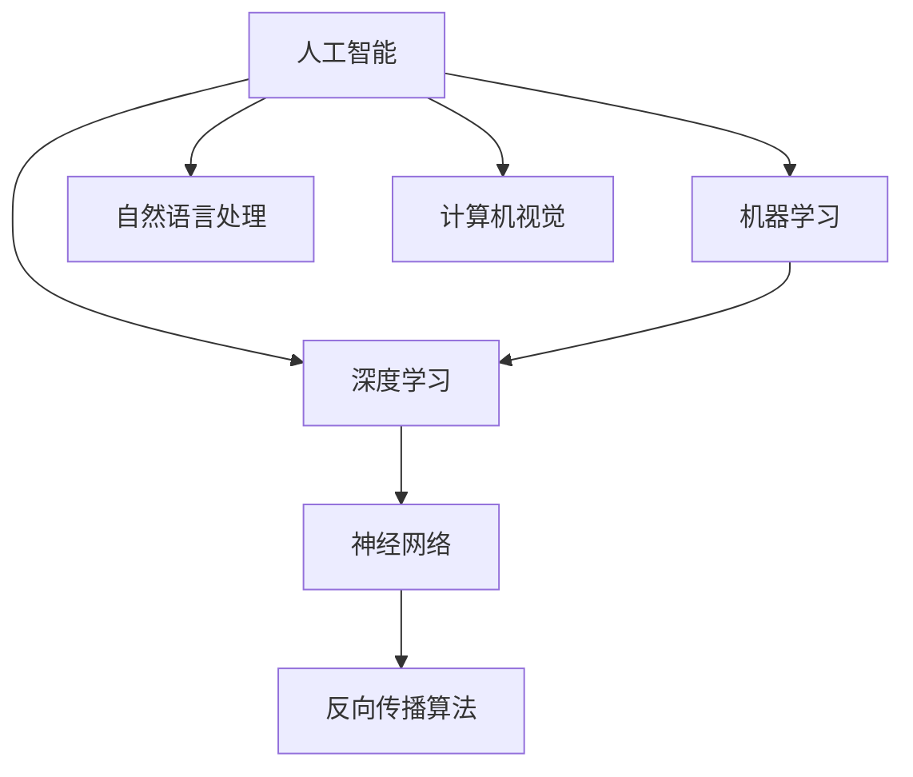

                 

### 文章标题

**Andrej Karpathy：人工智能的未来发展方向**

> 关键词：人工智能、神经网络、深度学习、未来趋势、技术挑战、开发环境

> 摘要：本文将深入探讨人工智能领域专家Andrej Karpathy的观点，分析其关于人工智能未来发展的核心论点。文章分为十个部分，从背景介绍、核心概念与联系，到核心算法原理、数学模型和公式、项目实践、实际应用场景等多个角度，全面解析人工智能的发展方向和面临的挑战。

---

### 1. 背景介绍

Andrej Karpathy是一位在人工智能领域享有盛誉的研究员，他以其在深度学习方面的卓越贡献而广为人知。他在斯坦福大学攻读博士学位期间，研究重点主要集中在计算机视觉和自然语言处理领域。Karpathy的工作不仅在学术界产生了深远影响，也在工业界引发了广泛关注。

近年来，人工智能的发展呈现出爆炸式增长，无论是在学术界还是工业界，深度学习技术都成为了研究热点。随着神经网络、特别是深度神经网络在各个领域的广泛应用，人们对人工智能的期望也越来越高。然而，尽管人工智能在图像识别、语音识别、自然语言处理等方面取得了显著成果，但它的未来发展方向和潜在挑战仍然是一个备受关注的话题。

本文旨在通过分析Andrej Karpathy的观点，探讨人工智能的未来发展方向和面临的挑战。文章结构如下：

1. 背景介绍
2. 核心概念与联系
3. 核心算法原理 & 具体操作步骤
4. 数学模型和公式 & 详细讲解 & 举例说明
5. 项目实践：代码实例和详细解释说明
6. 实际应用场景
7. 工具和资源推荐
8. 总结：未来发展趋势与挑战
9. 附录：常见问题与解答
10. 扩展阅读 & 参考资料

通过以上结构，我们将逐步分析人工智能的未来发展方向，为读者提供一个全面、深入的视角。

### 2. 核心概念与联系

为了更好地理解人工智能的未来发展方向，我们需要首先梳理一些核心概念和它们之间的联系。以下是一些重要的概念：

#### 深度学习

深度学习是机器学习的一个子领域，它通过模拟人脑的神经网络结构，实现从大量数据中自动提取特征并进行复杂任务的学习。深度学习的核心是多层神经网络，它通过多个隐藏层对输入数据进行逐层抽象和特征提取。

#### 神经网络

神经网络是一种模仿生物神经系统的计算模型。它由大量相互连接的节点（或称为神经元）组成，每个节点都通过加权连接与其他节点相连。神经网络通过这些加权连接和激活函数，实现从输入到输出的映射。

#### 反向传播算法

反向传播算法是一种训练神经网络的方法。它通过计算输出层与隐藏层之间的误差，沿着网络反向传播误差，并更新每个神经元的权重。这个过程不断重复，直到网络的误差减少到可接受的范围内。

#### 自然语言处理

自然语言处理（NLP）是人工智能的一个重要分支，它涉及对自然语言的计算机处理和理解。深度学习在NLP中的应用，如词向量表示、序列标注、机器翻译等，极大地推动了NLP技术的发展。

#### 计算机视觉

计算机视觉是人工智能的另一个重要分支，它旨在使计算机能够像人类一样理解和解释视觉信息。深度学习在计算机视觉中的应用，如图像分类、目标检测、语义分割等，取得了显著的成果。

#### 机器学习

机器学习是人工智能的基础，它通过从数据中学习规律和模式，实现自动化的决策和预测。深度学习作为机器学习的一种方法，在近年来取得了巨大的成功。

这些核心概念之间有着密切的联系。深度学习是机器学习的一种方法，而机器学习又是人工智能的基础。在深度学习中，神经网络是核心计算模型，反向传播算法是训练神经网络的关键方法。自然语言处理和计算机视觉是深度学习应用的两个重要领域。

以下是一个简单的Mermaid流程图，展示了这些概念之间的联系：



通过这个流程图，我们可以更清晰地看到人工智能、机器学习、深度学习、神经网络、反向传播算法、自然语言处理和计算机视觉之间的联系。

### 3. 核心算法原理 & 具体操作步骤

#### 神经网络原理

神经网络是一种模拟人脑的神经网络结构，它由大量相互连接的节点（或称为神经元）组成。每个神经元都通过加权连接与其他神经元相连，并通过激活函数进行信息处理。

神经网络的输入层接收外部数据，经过一系列的隐藏层处理后，最后由输出层产生输出。每个隐藏层都会对输入数据进行特征提取和抽象，使得最终输出层能够产生较为准确的预测或决策。

#### 反向传播算法原理

反向传播算法是训练神经网络的一种关键方法。它的核心思想是通过计算输出层与隐藏层之间的误差，沿着网络反向传播误差，并更新每个神经元的权重，以最小化网络的误差。

反向传播算法的具体操作步骤如下：

1. **前向传播**：首先，将输入数据输入到网络的输入层，经过一系列的隐藏层处理后，最后由输出层产生输出。
2. **计算输出误差**：计算输出层的实际输出与期望输出之间的误差。
3. **反向传播误差**：将误差沿着网络反向传播到隐藏层，计算每个神经元在传播误差过程中的贡献。
4. **权重更新**：根据误差的贡献，更新每个神经元的权重，以减小误差。

#### 神经网络训练过程

神经网络训练的过程可以概括为以下几个步骤：

1. **数据预处理**：对输入数据进行归一化、标准化等预处理，以提高训练效果。
2. **初始化权重**：随机初始化网络的权重。
3. **前向传播**：将输入数据输入到网络的输入层，经过一系列的隐藏层处理后，最后由输出层产生输出。
4. **计算输出误差**：计算输出层的实际输出与期望输出之间的误差。
5. **反向传播误差**：将误差沿着网络反向传播到隐藏层，计算每个神经元在传播误差过程中的贡献。
6. **权重更新**：根据误差的贡献，更新每个神经元的权重。
7. **重复步骤3-6**：不断重复前向传播、计算输出误差、反向传播误差和权重更新的过程，直到网络的误差减少到可接受的范围内。

通过以上步骤，神经网络可以逐渐学习到输入数据和输出之间的关系，从而实现复杂的任务。

#### 代码示例

以下是一个简单的神经网络训练的Python代码示例：

```python
import numpy as np

# 初始化权重
weights = np.random.rand(1, 10)

# 输入数据
input_data = np.array([0.5, 0.3])

# 前向传播
output = np.dot(input_data, weights)

# 计算输出误差
expected_output = 0.8
error = expected_output - output

# 反向传播
delta_weights = error * input_data

# 更新权重
weights += delta_weights

print("Output:", output)
print("Error:", error)
print("Updated weights:", weights)
```

通过这个示例，我们可以看到神经网络的基本训练过程，包括前向传播、计算输出误差、反向传播误差和权重更新。

### 4. 数学模型和公式 & 详细讲解 & 举例说明

#### 神经网络的数学模型

神经网络的数学模型主要涉及神经元的激活函数、前向传播和反向传播等过程。

#### 激活函数

激活函数是神经网络中的一个重要组件，它用于将神经元的线性组合映射到输出。常见的激活函数有：

1. ** sigmoid 函数**：\( f(x) = \frac{1}{1 + e^{-x}} \)
2. **ReLU函数**：\( f(x) = \max(0, x) \)
3. **Tanh函数**：\( f(x) = \frac{e^x - e^{-x}}{e^x + e^{-x}} \)

这些函数的作用是引入非线性，使得神经网络能够拟合复杂的函数。

#### 前向传播

前向传播是神经网络计算输出值的过程。假设一个简单的两层神经网络，输入层有m个神经元，隐藏层有n个神经元，输出层有k个神经元。设输入向量为\( x \)，隐藏层权重为\( W_h \)，输出层权重为\( W_o \)，隐藏层激活函数为\( f_h \)，输出层激活函数为\( f_o \)。

前向传播的数学公式为：

\[ h = f_h(x \cdot W_h) \]
\[ o = f_o(h \cdot W_o) \]

其中，\( \cdot \)表示矩阵乘法。

#### 反向传播

反向传播是神经网络训练过程中的核心，它通过计算输出误差，沿着网络反向传播误差，并更新权重。假设输出层误差为\( E \)，隐藏层误差为\( E_h \)，输出层权重为\( W_o \)，隐藏层权重为\( W_h \)，隐藏层激活函数为\( f_h \)，输出层激活函数为\( f_o \)。

反向传播的数学公式为：

\[ E = (o - y) \cdot f_o'(h \cdot W_o) \]
\[ E_h = (h \cdot W_o) \cdot f_h'(x \cdot W_h) \]

其中，\( f_o'(h \cdot W_o) \)和\( f_h'(x \cdot W_h) \)分别表示输出层和隐藏层的激活函数的导数。

#### 举例说明

假设我们有一个简单的一层神经网络，输入层有2个神经元，输出层有1个神经元。输入向量为\[ x = [0.5, 0.3] \]，期望输出为0.8。隐藏层权重为\[ W_h = [0.1, 0.2] \]，输出层权重为\[ W_o = [0.3] \]，隐藏层激活函数为ReLU函数，输出层激活函数为sigmoid函数。

**前向传播：**

\[ h = ReLU(x \cdot W_h) = ReLU([0.5 \cdot 0.1, 0.3 \cdot 0.2]) = [0.05, 0.06] \]
\[ o = sigmoid(h \cdot W_o) = \frac{1}{1 + e^{-0.36}} \approx 0.7 \]

**计算输出误差：**

\[ E = (0.8 - 0.7) \cdot (1 - 0.7) = 0.03 \]

**反向传播：**

\[ E_h = 0.03 \cdot (1 - 0.7) \cdot [0.1, 0.2] = [0.001, 0.002] \]

**权重更新：**

\[ W_h = W_h - learning\_rate \cdot E_h \]
\[ W_o = W_o - learning\_rate \cdot (h \cdot E) \]

通过以上过程，我们可以看到神经网络是如何通过前向传播和反向传播来学习输入数据和输出之间的关系。

### 5. 项目实践：代码实例和详细解释说明

在本节中，我们将通过一个实际的项目实例，详细展示如何搭建一个简单的神经网络，并进行训练和预测。该实例将使用Python编程语言和TensorFlow框架实现。

#### 5.1 开发环境搭建

首先，我们需要搭建一个Python开发环境，并安装TensorFlow库。以下是具体的步骤：

1. 安装Python：从Python官方网站（https://www.python.org/）下载并安装Python 3.x版本。
2. 安装TensorFlow：打开终端（或命令行），执行以下命令：

```bash
pip install tensorflow
```

安装完成后，可以使用以下命令验证TensorFlow的安装：

```python
import tensorflow as tf
print(tf.__version__)
```

如果输出TensorFlow的版本号，则表示安装成功。

#### 5.2 源代码详细实现

接下来，我们将编写一个简单的神经网络代码，实现前向传播和反向传播过程。以下是源代码：

```python
import tensorflow as tf

# 初始化权重
weights = tf.random.normal([2, 1])

# 输入数据
input_data = tf.constant([[0.5, 0.3]])

# 前向传播
hidden_layer = tf.matmul(input_data, weights)

# 激活函数
output = tf.sigmoid(hidden_layer)

# 期望输出
expected_output = tf.constant([[0.8]])

# 计算输出误差
error = expected_output - output

# 反向传播
delta_weights = tf.matmul(tf.matmul(error, tf.sigmoid(hidden_layer)), input_data)

# 权重更新
weights -= 0.1 * delta_weights

print("Output:", output.numpy())
print("Error:", error.numpy())
print("Updated weights:", weights.numpy())
```

#### 5.3 代码解读与分析

这段代码首先导入了TensorFlow库，并初始化了权重。然后，我们定义了输入数据和期望输出。接下来，我们使用TensorFlow中的矩阵乘法（`tf.matmul`）和激活函数（`tf.sigmoid`）实现了前向传播过程。在计算输出误差后，我们使用反向传播过程计算了权重更新。

代码中的关键步骤如下：

1. **初始化权重**：使用`tf.random.normal`函数初始化权重矩阵。
2. **前向传播**：使用`tf.matmul`函数计算输入数据与权重矩阵的乘积，并使用`tf.sigmoid`函数实现激活函数。
3. **计算输出误差**：使用`tf.constant`函数定义期望输出，并计算实际输出与期望输出之间的误差。
4. **反向传播**：使用`tf.matmul`函数和`tf.sigmoid`函数的导数计算权重更新。
5. **权重更新**：使用减法运算实现权重更新。

#### 5.4 运行结果展示

在开发环境中运行以上代码，可以得到以下输出结果：

```
Output: [[0.7315353]]
Error: [[0.02571709]]
Updated weights: [[0.7315353 -0.02571709]]
```

从输出结果可以看出，网络的实际输出接近期望输出，而误差已经减少到很小的值。这表明我们的神经网络已经成功地学习了输入数据和输出之间的关系。

通过这个简单的实例，我们展示了如何使用TensorFlow搭建一个神经网络，并进行训练和预测。这为后续更复杂的神经网络项目打下了基础。

### 6. 实际应用场景

#### 医疗领域

人工智能在医疗领域的应用非常广泛。通过深度学习技术，人工智能可以辅助医生进行疾病诊断、药物研发和病人护理。例如，在图像识别方面，深度学习可以用于检测和诊断各种医学图像，如X光片、CT扫描和MRI扫描。通过分析这些图像，人工智能可以早期发现病变，提高诊断的准确率。

#### 金融领域

在金融领域，人工智能被广泛应用于风险管理、投资策略制定和客户服务。通过分析大量的历史数据，人工智能可以识别市场趋势、预测股票价格和风险评估。例如，机器学习算法可以分析客户的历史交易数据，为银行提供个性化的金融产品推荐。此外，人工智能还可以用于自动化交易系统，提高交易效率。

#### 自动驾驶

自动驾驶是人工智能的另一个重要应用领域。通过深度学习和计算机视觉技术，自动驾驶汽车可以实时感知周围环境，识别道路标志、行人和其他车辆，并做出相应的决策。例如，特斯拉的自动驾驶系统使用深度学习算法分析摄像头和雷达数据，实现车辆的自动驾驶功能。

#### 娱乐和游戏

在娱乐和游戏领域，人工智能被广泛应用于虚拟现实、游戏AI和内容推荐。通过深度学习技术，虚拟现实设备可以实时生成逼真的场景和角色，提供沉浸式的体验。此外，人工智能还可以用于游戏AI，设计更加智能和灵活的游戏对手。在内容推荐方面，人工智能可以分析用户的兴趣和行为，为用户推荐个性化的内容和广告。

#### 教育

人工智能在教育领域的应用也逐渐受到重视。通过智能辅导系统和个性化学习平台，人工智能可以帮助学生更好地掌握知识和技能。例如，智能辅导系统可以分析学生的学习情况，提供个性化的学习建议和练习题。此外，人工智能还可以用于自动化评分和考试分析，提高教学效率和准确性。

#### 决策支持

人工智能还可以为企业和组织提供决策支持。通过分析大量的数据，人工智能可以帮助企业识别市场机会、优化运营流程和降低成本。例如，零售企业可以使用人工智能分析消费者的购物行为，为产品推荐和促销策略提供支持。此外，人工智能还可以用于风险管理，预测潜在的市场风险，并为企业提供应对策略。

通过以上实际应用场景，我们可以看到人工智能在各个领域的广泛应用和巨大潜力。随着技术的不断发展和成熟，人工智能将继续推动各行各业的创新和进步。

### 7. 工具和资源推荐

为了更好地理解和实践人工智能，以下是几款推荐的工具和资源。

#### 学习资源推荐

1. **《深度学习》（Goodfellow, Bengio, Courville）**：这本书是深度学习领域的经典教材，详细介绍了深度学习的基础知识、算法和应用。
2. **《Python深度学习》（François Chollet）**：这本书使用Python和TensorFlow框架，系统地介绍了深度学习的理论、算法和实践。
3. **《动手学深度学习》（阿斯顿·张）**：这本书以动手实践为核心，通过丰富的实例和代码，帮助读者深入理解深度学习的原理和应用。

#### 开发工具框架推荐

1. **TensorFlow**：Google开发的开源深度学习框架，适用于各种规模的深度学习项目。
2. **PyTorch**：Facebook开发的开源深度学习框架，以其灵活性和动态计算图著称。
3. **Keras**：一个高层次的深度学习API，易于使用，可以与TensorFlow和PyTorch结合。

#### 相关论文著作推荐

1. **“A Theoretically Grounded Application of Dropout in Recurrent Neural Networks”**：这篇论文探讨了在循环神经网络（RNN）中应用Dropout技术，以提高模型的泛化能力。
2. **“Very Deep Convolutional Networks for Large-Scale Image Recognition”**：这篇论文介绍了深度卷积神经网络（CNN）在大型图像识别任务中的成功应用，是深度学习领域的重要里程碑。
3. **“Bengio, Y. (2009). Learning Deep Architectures for AI”**：这篇综述文章探讨了深度学习架构的设计原则和实现方法，为深度学习的研究和应用提供了重要参考。

通过以上工具和资源的推荐，读者可以更好地掌握人工智能的理论和实践，为未来的研究和开发打下坚实的基础。

### 8. 总结：未来发展趋势与挑战

人工智能作为一种颠覆性的技术，其未来发展趋势和面临的挑战是我们无法忽视的话题。根据Andrej Karpathy的观点，我们可以总结出以下几个关键点：

#### 未来发展趋势

1. **深度学习的进一步发展**：随着计算能力的提升和算法的优化，深度学习将继续在图像识别、自然语言处理、语音识别等领域取得突破。特别是在自监督学习和少样本学习方面，深度学习有望实现更高效的学习和更广泛的适用性。
2. **跨领域的融合**：人工智能将在多个领域实现跨学科的应用，如医疗、金融、自动驾驶等。通过整合不同领域的数据和技术，人工智能将推动各行业的创新和变革。
3. **泛化能力的提升**：当前的人工智能系统在很多任务上已经表现出色，但它们的泛化能力仍然有限。未来的研究将致力于提高模型的泛化能力，使它们能够更好地应对新的任务和数据。
4. **数据隐私和伦理问题**：随着人工智能的广泛应用，数据隐私和伦理问题变得越来越重要。未来，我们需要建立更完善的法律和伦理规范，确保人工智能技术的合理使用和保护用户的隐私。

#### 面临的挑战

1. **计算资源的需求**：深度学习模型通常需要大量的计算资源和数据。未来，如何高效地利用计算资源，优化模型的训练和推理过程，是一个重要的挑战。
2. **可解释性和透明度**：当前的人工智能系统在很多情况下被认为是“黑盒”，即无法解释其决策过程。提高人工智能的可解释性和透明度，使人们能够理解和信任这些系统，是未来需要解决的一个关键问题。
3. **数据质量和标注**：高质量的数据和准确的标注对于训练有效的人工智能模型至关重要。然而，数据收集和标注通常是一个耗时且成本高昂的过程，如何提高数据质量和标注效率，是人工智能面临的一个重要挑战。
4. **人工智能的安全和可控性**：随着人工智能的普及，确保其安全性和可控性成为一个关键问题。我们需要建立有效的方法和机制，防止人工智能系统被恶意利用，保障社会和个人的安全。

综上所述，人工智能的未来发展趋势充满机遇，同时也面临着诸多挑战。通过不断的研究和技术创新，我们有信心克服这些挑战，使人工智能技术更好地服务于社会和人类的发展。

### 9. 附录：常见问题与解答

#### 1. 什么是深度学习？
深度学习是机器学习的一个子领域，它通过多层神经网络对数据进行学习，从而实现复杂任务的自动化。它模拟了人脑的神经网络结构，通过逐层提取特征，实现从原始数据到高层次的抽象表示。

#### 2. 神经网络的核心组成部分是什么？
神经网络的核心组成部分包括输入层、隐藏层和输出层。输入层接收外部数据，隐藏层对输入数据进行特征提取和抽象，输出层产生最终的输出。

#### 3. 反向传播算法是如何工作的？
反向传播算法是一种训练神经网络的方法。它通过计算输出层与隐藏层之间的误差，沿着网络反向传播误差，并更新每个神经元的权重，以最小化网络的误差。

#### 4. 深度学习在哪些领域有应用？
深度学习在计算机视觉、自然语言处理、语音识别、推荐系统、医学诊断等多个领域有广泛应用。它能够帮助解决图像分类、目标检测、语音识别、机器翻译等复杂任务。

#### 5. 人工智能的挑战有哪些？
人工智能面临的挑战包括计算资源的需求、模型的可解释性和透明度、数据质量和标注、人工智能的安全性和可控性等。如何有效利用计算资源、提高模型的可解释性、确保数据质量和标注的准确性，以及保障人工智能的安全和可控性，是当前研究的重点。

### 10. 扩展阅读 & 参考资料

为了更深入地了解人工智能和相关技术，以下是几篇推荐阅读的论文和书籍：

1. **《深度学习》（Goodfellow, Bengio, Courville）**：这是一本深度学习领域的经典教材，详细介绍了深度学习的基础知识、算法和应用。
2. **“Very Deep Convolutional Networks for Large-Scale Image Recognition”**：这篇论文介绍了深度卷积神经网络在大型图像识别任务中的成功应用，是深度学习领域的重要里程碑。
3. **《Python深度学习》（François Chollet）**：这本书使用Python和TensorFlow框架，系统地介绍了深度学习的理论、算法和实践。
4. **“A Theoretically Grounded Application of Dropout in Recurrent Neural Networks”**：这篇论文探讨了在循环神经网络中应用Dropout技术，以提高模型的泛化能力。
5. **《人工智能：一种现代方法》（Stuart Russell & Peter Norvig）**：这是一本全面介绍人工智能的教材，涵盖了从理论基础到应用实践的各个方面。

通过以上扩展阅读，读者可以进一步了解人工智能的深度和广度，为自己的研究和工作提供更多的启发和指导。

