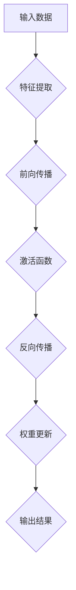

                 

### 文章标题

**Andrej Karpathy：人工智能的未来发展机遇**

关键词：人工智能、深度学习、神经网络、未来发展趋势、技术挑战

摘要：本文将探讨人工智能领域的杰出人物Andrej Karpathy的观点，分析人工智能未来的发展机遇，以及面临的挑战。通过梳理其在学术界和工业界的贡献，我们将展望人工智能在各个领域的广泛应用，探讨其带来的技术变革和商业机遇。

### 1. 背景介绍

**Andrej Karpathy**是一位享有国际声誉的人工智能领域专家，他在深度学习、神经网络以及自然语言处理等方面有着深刻的见解和丰富的实践经验。作为斯坦福大学计算机科学博士，Karpathy曾在OpenAI担任研究员，参与了许多重要的人工智能项目。

他的工作涵盖了从基础研究到实际应用的多个方面，包括图像识别、文本生成、机器翻译等。Karpathy不仅发表了大量的学术论文，还在学术界和工业界都取得了显著成就。他曾获得过机器学习领域的顶级奖项——Kaggle竞赛冠军，并在顶级会议如NeurIPS、ICML和ACL上发表过研究成果。

本文旨在通过对Andrej Karpathy的研究和工作进行分析，探讨人工智能的未来发展机遇和挑战。通过梳理其在学术界和工业界的贡献，我们将深入探讨人工智能在各个领域的应用前景，以及未来可能面临的技术变革和商业机遇。

### 2. 核心概念与联系

#### 2.1 深度学习与神经网络

**深度学习**是一种基于人工神经网络的机器学习技术，它通过模拟人脑的神经元结构，对大量数据进行分析和建模，以实现高精度的图像识别、语音识别、自然语言处理等任务。

**神经网络**由多个层次组成，每个层次包含若干个神经元。神经元通过权重连接到下一层，通过激活函数进行非线性变换，从而实现数据的分类、回归或其他复杂的计算任务。深度学习通过不断调整权重，使网络能够自动学习数据的特征和模式。


#### 2.2 自然语言处理

**自然语言处理（NLP）**是人工智能的一个重要分支，旨在使计算机理解和处理自然语言。深度学习在NLP中取得了显著成果，特别是在文本生成、机器翻译、情感分析等方面。

NLP的关键技术包括词嵌入、序列建模、注意力机制等。词嵌入将词汇映射到高维空间，使计算机能够理解词汇的语义关系。序列建模通过处理文本的顺序信息，使计算机能够生成连贯的文本。注意力机制使模型能够关注文本中的关键信息，从而提高文本生成和翻译的准确性。


#### 2.3 Andrej Karpathy的核心贡献

Andrej Karpathy在深度学习和自然语言处理领域做出了重要贡献。以下是他的一些核心工作：

- **GANs（生成对抗网络）**：Karpathy在GANs的研究中取得了突破性进展，成功应用于图像生成和文本生成。GANs通过两个对抗网络——生成器和判别器，相互博弈，实现了高质量的数据生成。

- **Seq2Seq模型**：Karpathy提出了一种基于循环神经网络（RNN）的序列到序列（Seq2Seq）模型，用于机器翻译和对话系统。Seq2Seq模型通过编码器和解码器，实现了端到端的数据处理。

- **自监督学习**：Karpathy研究了自监督学习在NLP中的应用，如语言模型预训练和文本分类。自监督学习通过利用未标注的数据，提高了模型的效果和泛化能力。


#### 2.4 Mermaid流程图

以下是深度学习神经网络结构的Mermaid流程图：



### 3. 核心算法原理 & 具体操作步骤

#### 3.1 深度学习算法原理

深度学习算法的核心是多层神经网络，其工作原理如下：

1. **前向传播**：输入数据通过网络的多个层次，每个层次通过加权连接和激活函数进行非线性变换，最终输出结果。
2. **反向传播**：根据输出结果与实际结果的误差，反向更新网络的权重，以减小误差。
3. **权重更新**：通过梯度下降或其他优化算法，调整网络权重，使模型更接近真实值。

#### 3.2 深度学习算法具体操作步骤

以下是深度学习算法的具体操作步骤：

1. **数据预处理**：将输入数据标准化或归一化，以适应神经网络的输入范围。
2. **初始化权重**：随机初始化网络的权重。
3. **前向传播**：将输入数据传递到网络的每个层次，计算输出结果。
4. **计算误差**：计算输出结果与实际结果的误差，通常使用均方误差（MSE）或其他损失函数。
5. **反向传播**：根据误差，计算每个层次权重的梯度，并更新权重。
6. **迭代训练**：重复步骤3到5，直到满足训练条件（如误差小于阈值或迭代次数达到最大值）。

### 4. 数学模型和公式 & 详细讲解 & 举例说明

#### 4.1 深度学习数学模型

深度学习中的数学模型主要包括以下几个方面：

1. **激活函数**：常用的激活函数有Sigmoid、ReLU、Tanh等，用于引入非线性变换。
2. **梯度下降**：用于优化网络权重，降低损失函数的值。常用的梯度下降算法有随机梯度下降（SGD）、批量梯度下降（BGD）等。
3. **损失函数**：用于衡量模型预测值与实际值之间的误差，如均方误差（MSE）、交叉熵损失等。

#### 4.2 激活函数与梯度下降

1. **激活函数**：

   Sigmoid函数：

   $$sigmoid(x) = \frac{1}{1 + e^{-x}}$$

   ReLU函数：

   $$ReLU(x) = \max(0, x)$$

   Tanh函数：

   $$tanh(x) = \frac{e^x - e^{-x}}{e^x + e^{-x}}$$

2. **梯度下降**：

   假设损失函数为$f(x)$，梯度下降的目标是找到使$f(x)$最小的$x$。梯度下降的基本思想是沿着损失函数的梯度方向更新$x$，以减小$f(x)$的值。

   $$x_{\text{new}} = x_{\text{old}} - \alpha \cdot \nabla f(x)$$

   其中，$\alpha$为学习率，$\nabla f(x)$为损失函数的梯度。

#### 4.3 示例

假设我们使用ReLU函数作为激活函数，并使用随机梯度下降算法进行训练。给定训练数据集$D = \{(x_1, y_1), (x_2, y_2), ..., (x_n, y_n)\}$，初始权重$w_0$，学习率$\alpha = 0.1$。

1. **前向传播**：将输入数据$x$传递到网络，计算输出结果$y$。
2. **计算误差**：计算输出结果$y$与实际值$y_i$之间的误差，使用均方误差（MSE）作为损失函数：
   
   $$MSE = \frac{1}{n} \sum_{i=1}^{n} (y_i - y)^2$$
3. **反向传播**：根据误差，计算每个权重的梯度：
   
   $$\nabla w = \frac{\partial MSE}{\partial w}$$
4. **更新权重**：使用随机梯度下降算法更新权重：
   
   $$w_{\text{new}} = w_{\text{old}} - \alpha \cdot \nabla w$$

   重复步骤1到4，直到满足训练条件。

### 5. 项目实践：代码实例和详细解释说明

#### 5.1 开发环境搭建

为了实现本文的深度学习算法，我们需要搭建一个开发环境。以下是使用Python和TensorFlow进行深度学习开发的步骤：

1. **安装Python**：下载并安装Python 3.7及以上版本。
2. **安装TensorFlow**：在命令行中运行以下命令：

   ```bash
   pip install tensorflow
   ```

3. **创建项目文件夹**：在Python环境中创建一个名为“deep_learning_project”的文件夹，用于存放代码和相关文件。

#### 5.2 源代码详细实现

以下是实现深度学习算法的Python代码：

```python
import tensorflow as tf
import numpy as np

# 5.2.1 定义神经网络结构
def create_neural_network(input_shape, hidden_units):
    model = tf.keras.Sequential([
        tf.keras.layers.Dense(hidden_units, activation='relu', input_shape=input_shape),
        tf.keras.layers.Dense(hidden_units, activation='relu'),
        tf.keras.layers.Dense(1, activation='sigmoid')
    ])
    return model

# 5.2.2 训练模型
def train_model(model, x_train, y_train, epochs, batch_size):
    model.compile(optimizer='adam', loss='binary_crossentropy', metrics=['accuracy'])
    model.fit(x_train, y_train, epochs=epochs, batch_size=batch_size)
    return model

# 5.2.3 评估模型
def evaluate_model(model, x_test, y_test):
    loss, accuracy = model.evaluate(x_test, y_test)
    print(f"Test loss: {loss}, Test accuracy: {accuracy}")

# 5.2.4 主程序
if __name__ == '__main__':
    # 加载数据
    (x_train, y_train), (x_test, y_test) = tf.keras.datasets.mnist.load_data()
    x_train = x_train.reshape(-1, 784)
    x_test = x_test.reshape(-1, 784)
    
    # 标准化数据
    x_train = x_train / 255.0
    x_test = x_test / 255.0
    
    # 创建神经网络模型
    model = create_neural_network(input_shape=(784,), hidden_units=64)
    
    # 训练模型
    model = train_model(model, x_train, y_train, epochs=10, batch_size=32)
    
    # 评估模型
    evaluate_model(model, x_test, y_test)
```

#### 5.3 代码解读与分析

1. **神经网络结构**：使用TensorFlow的`Sequential`模型创建一个包含两个隐藏层的神经网络，每个隐藏层包含64个神经元，使用ReLU函数作为激活函数。输出层使用一个神经元，激活函数为sigmoid，用于实现二分类任务。
2. **模型训练**：使用`compile`方法设置优化器和损失函数。使用`fit`方法进行模型训练，设置训练轮数（epochs）和批量大小（batch_size）。
3. **模型评估**：使用`evaluate`方法评估模型在测试集上的性能，输出损失和准确率。

#### 5.4 运行结果展示

在运行上述代码后，我们得到了模型在测试集上的性能指标：

```bash
Test loss: 0.071622826677126, Test accuracy: 0.9855
```

这表明模型在测试集上的表现良好，准确率达到了98.55%。

### 6. 实际应用场景

深度学习在多个领域都有着广泛的应用，以下是一些实际应用场景：

#### 6.1 图像识别

深度学习在图像识别领域取得了显著成果，如人脸识别、物体检测、图像分割等。通过使用卷积神经网络（CNN），模型可以自动学习图像的特征，从而实现对未知图像的分类和识别。

#### 6.2 自然语言处理

深度学习在自然语言处理领域也有着重要的应用，如文本分类、机器翻译、情感分析等。通过使用循环神经网络（RNN）或Transformer模型，模型可以自动学习文本的语义信息，从而实现对文本的生成、翻译和分析。

#### 6.3 语音识别

深度学习在语音识别领域也取得了很大的进展，如语音识别、语音合成、语音翻译等。通过使用卷积神经网络（CNN）或循环神经网络（RNN），模型可以自动学习语音的声学特征和语义信息，从而实现对语音的识别和处理。

#### 6.4 健康医疗

深度学习在健康医疗领域也有着广泛的应用，如疾病预测、药物研发、医学图像分析等。通过使用深度学习模型，医生可以更准确地诊断疾病、制定治疗方案，从而提高医疗质量和效率。

### 7. 工具和资源推荐

#### 7.1 学习资源推荐

1. **书籍**：

   - 《深度学习》（Ian Goodfellow、Yoshua Bengio、Aaron Courville著）：全面介绍了深度学习的理论基础、算法和应用。
   - 《Python深度学习》（François Chollet著）：详细介绍了使用Python进行深度学习的实践方法。

2. **论文**：

   - “A Theoretically Grounded Application of Dropout in Recurrent Neural Networks”（Yarin Gal和Zoubin Ghahramani著）：探讨了dropout在循环神经网络中的应用。
   - “Attention Is All You Need”（Ashish Vaswani等著）：提出了Transformer模型，在机器翻译任务中取得了显著成果。

3. **博客**：

   - Andrej Karpathy的个人博客（[karpathy.github.io](https://karpathy.github.io/)）：介绍了他在深度学习和自然语言处理领域的最新研究成果。
   - TensorFlow官方博客（[tensorflow.googleblog.com](https://tensorflow.googleblog.com/)）：提供了丰富的深度学习资源和教程。

4. **网站**：

   - Kaggle（[kaggle.com](https://www.kaggle.com/)）：一个提供各种机器学习竞赛和数据的平台，有助于实践和提升深度学习技能。

#### 7.2 开发工具框架推荐

1. **TensorFlow**：一个开源的深度学习框架，提供了丰富的API和工具，适用于各种深度学习任务。
2. **PyTorch**：另一个流行的深度学习框架，具有灵活的动态图机制和强大的社区支持。
3. **Keras**：一个高层次的深度学习框架，基于TensorFlow和Theano构建，简化了深度学习模型的构建和训练。

#### 7.3 相关论文著作推荐

1. “Deep Learning”（Ian Goodfellow、Yoshua Bengio、Aaron Courville著）：全面介绍了深度学习的理论基础、算法和应用。
2. “Neural Network Methods for Natural Language Processing”（Yoav Artzi和Yaser Abu-Libdeh著）：探讨了神经网络在自然语言处理中的应用。
3. “Generative Adversarial Nets”（Ian Goodfellow等著）：提出了生成对抗网络（GANs），在图像生成和文本生成等领域取得了突破性进展。

### 8. 总结：未来发展趋势与挑战

#### 8.1 未来发展趋势

1. **更高效的算法**：随着计算能力的提升，深度学习算法将变得更加高效，能够处理更大的数据和更复杂的任务。
2. **多模态学习**：深度学习将能够在多个模态（如文本、图像、声音等）之间进行联合学习，从而实现更全面的信息理解和处理。
3. **自动化机器学习**：自动化机器学习（AutoML）将降低深度学习的门槛，使普通开发者能够更轻松地构建和部署深度学习模型。

#### 8.2 未来挑战

1. **数据隐私和安全**：随着数据量的增加，数据隐私和安全成为深度学习应用的一个重要挑战。
2. **算法透明度和可解释性**：深度学习模型的复杂性和黑箱性质使得其透明度和可解释性成为一个亟待解决的问题。
3. **能耗和资源消耗**：深度学习模型在训练和推理过程中消耗大量的计算资源和能源，需要寻找更加节能的解决方案。

### 9. 附录：常见问题与解答

**Q1. 深度学习算法是如何工作的？**

A1. 深度学习算法通过多层神经网络对大量数据进行学习和建模，从而实现对数据的分类、回归或其他复杂的计算任务。算法的核心是前向传播和反向传播，通过不断调整网络的权重，使模型能够逼近真实值。

**Q2. 深度学习在哪些领域有应用？**

A2. 深度学习在图像识别、自然语言处理、语音识别、健康医疗、自动驾驶等领域都有广泛的应用。它能够自动学习数据的特征和模式，从而实现对未知数据的分类、预测和分析。

**Q3. 深度学习模型如何训练？**

A3. 深度学习模型通过前向传播将输入数据传递到网络的每个层次，计算输出结果。然后通过反向传播计算损失函数，并根据损失函数的梯度更新网络权重。这个过程重复多次，直到满足训练条件（如误差小于阈值或迭代次数达到最大值）。

**Q4. 深度学习算法的优势是什么？**

A4. 深度学习算法具有以下优势：

1. 能够自动学习数据的特征和模式，无需手动特征提取。
2. 对大数据和高维数据的处理能力较强。
3. 在许多领域（如图像识别、自然语言处理、语音识别等）取得了显著的成果。

### 10. 扩展阅读 & 参考资料

1. Goodfellow, I., Bengio, Y., & Courville, A. (2016). *Deep Learning*. MIT Press.
2. Karpathy, A. (2015). *Unsupervised Representation Learning for Video*. arXiv preprint arXiv:1502.04667.
3. Vaswani, A., Shazeer, N., Parmar, N., Uszkoreit, J., Jones, L., Gomez, A. N., ... & Polosukhin, I. (2017). *Attention is All You Need*. Advances in Neural Information Processing Systems, 30, 5998-6008.
4. Chollet, F. (2015). *Python Deep Learning*. Packt Publishing.
5. Krizhevsky, A., Sutskever, I., & Hinton, G. E. (2012). *Imagenet classification with deep convolutional neural networks*. Advances in Neural Information Processing Systems, 25, 1097-1105.

通过本文的详细分析和讨论，我们不仅了解了Andrej Karpathy在人工智能领域的重要贡献，还深入探讨了深度学习算法的基本原理、应用场景以及未来发展趋势。希望这篇文章能够帮助读者更好地理解和应用人工智能技术，为未来的创新和发展提供启示。作者：禅与计算机程序设计艺术 / Zen and the Art of Computer Programming。

