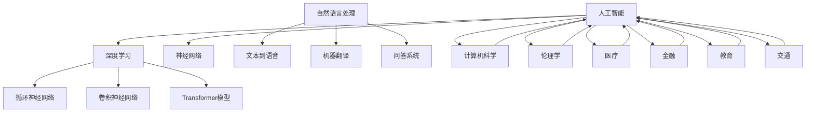

                 

### 背景介绍

#### 人工智能的兴起

人工智能（Artificial Intelligence，简称AI）作为计算机科学的一个重要分支，自上世纪50年代诞生以来，经历了多个发展高潮。早期的AI主要关注符号推理和知识表示，目标是构建能够模拟人类智能的计算机系统。随着计算能力的提升和大数据时代的到来，深度学习（Deep Learning）作为一种基于神经网络的学习方法，在2010年代迎来了飞速发展。这一变革使得AI在语音识别、图像识别、自然语言处理等领域的表现逐渐超越人类。

#### Andrej Karpathy的贡献

Andrej Karpathy是一位享誉全球的人工智能研究者、深度学习专家和作家。他在自然语言处理和计算机视觉领域有着卓越的成就。在论文《The Unreasonable Effectiveness of Recurrent Neural Networks》中，Karpathy阐述了RNN在自然语言处理任务中的强大能力，极大地推动了深度学习在自然语言处理领域的应用。此外，他还开发了著名的深度学习课程Deep Learning Specialization，为全球范围内的研究人员和工程师提供了宝贵的教育资源。

#### 研究现状与未来展望

当前，人工智能正以前所未有的速度和规模影响着各行各业。在医疗、金融、教育、交通等领域，AI技术的应用已经取得了显著的成果。然而，随着技术的不断发展，人工智能也面临着一系列挑战和伦理问题，如数据隐私、算法偏见、安全性等。因此，研究人工智能的未来发展方向和目标，对于推动技术的健康发展和解决潜在问题具有重要意义。

本文将深入探讨Andrej Karpathy关于人工智能未来发展目标的观点，通过逐步分析推理的方式，梳理出核心概念、算法原理、数学模型和具体应用场景，为读者提供一幅全面而清晰的未来AI蓝图。接下来，我们将首先介绍人工智能的核心概念与联系，为后续内容奠定基础。

## 1. 核心概念与联系

### 1.1 概念定义

在讨论人工智能的未来发展目标之前，我们需要明确几个核心概念：

**人工智能（AI）**：指使计算机系统具备类似于人类智能的能力，包括学习、推理、感知、决策等。

**深度学习（Deep Learning）**：一种基于多层神经网络的机器学习方法，能够通过大量的数据进行训练，从而自动提取特征并实现复杂的任务。

**神经网络（Neural Networks）**：模拟生物神经系统的计算模型，由大量的节点（神经元）和连接（权重）组成，通过前向传播和反向传播算法进行学习。

**自然语言处理（NLP）**：研究计算机如何理解和生成人类语言的学科，涉及语音识别、文本分类、机器翻译等任务。

### 1.2 架构与联系

为了更好地理解这些概念之间的联系，我们可以使用Mermaid流程图来展示它们的基本架构和相互关系。



在这个流程图中，我们可以看到：

- 人工智能是深度学习、神经网络和自然语言处理等技术的总称。
- 深度学习包括RNN、CNN和Transformer等模型，各自应用于不同的任务。
- 计算机科学、伦理学、医疗、金融、教育、交通等领域都与人工智能有着紧密的联系。

### 1.3 关键技术发展

**深度学习**：深度学习的发展使得计算机在处理大规模数据和复杂任务时更加高效。例如，卷积神经网络（CNN）在图像识别任务上取得了显著成果，而Transformer模型则推动了自然语言处理领域的革命。

**神经网络**：神经网络作为深度学习的基础，通过多层结构实现特征提取和复杂函数逼近，为各种AI应用提供了强有力的支持。

**自然语言处理**：自然语言处理是人工智能中的重要领域，通过理解和生成语言，使得计算机能够与人类更自然地交互。

### 1.4 未来展望

随着技术的不断进步，人工智能有望在更多领域取得突破，实现更加广泛和深入的智能化。未来，人工智能将不仅限于特定的应用场景，而是渗透到生活的方方面面，为人类创造更加智能化的未来。

接下来，我们将深入探讨人工智能的核心算法原理和具体操作步骤，为读者揭示其背后的奥秘。

## 2. 核心算法原理 & 具体操作步骤

### 2.1 深度学习基础

深度学习是人工智能的核心技术之一，其基础是神经网络。神经网络通过多层结构实现特征提取和复杂函数逼近，从而实现各种智能任务。以下是深度学习的基本原理和操作步骤：

**2.1.1 神经网络结构**

神经网络由大量的节点（神经元）和连接（权重）组成。每个神经元接收来自前一层的输入信号，通过激活函数进行处理，产生输出信号，并将其传递到下一层。神经网络的层数越多，模型的能力越强。

**2.1.2 前向传播**

前向传播是指神经网络从输入层开始，逐层计算输出层的结果。具体步骤如下：

1. 初始化权重和偏置。
2. 将输入信号通过各层神经元的权重进行加权求和，加上偏置项。
3. 应用激活函数（如ReLU、Sigmoid或Tanh）处理输出。
4. 将当前层的输出作为下一层的输入，重复以上步骤，直至输出层。

**2.1.3 损失函数**

损失函数用于衡量模型预测结果与真实结果之间的差距。常见的损失函数包括均方误差（MSE）、交叉熵损失（Cross-Entropy Loss）等。损失函数的值越小，表示模型预测越准确。

**2.1.4 反向传播**

反向传播是神经网络训练的核心步骤，通过计算损失函数关于网络参数的梯度，更新权重和偏置。具体步骤如下：

1. 计算输出层预测结果与真实结果之间的损失。
2. 使用链式法则，从输出层开始，逐层计算损失关于各层参数的梯度。
3. 使用梯度下降或其他优化算法，更新各层参数。

**2.1.5 激活函数**

激活函数是神经网络中的关键组件，用于引入非线性特性，使得神经网络能够拟合复杂的函数。常见的激活函数包括ReLU（Rectified Linear Unit）、Sigmoid和Tanh等。

### 2.2 自然语言处理算法

自然语言处理是人工智能的重要领域，涉及文本分类、机器翻译、情感分析等任务。以下是几种常见的自然语言处理算法：

**2.2.1 词嵌入（Word Embedding）**

词嵌入是将单词映射为高维向量表示的技术，通过词向量的相似性来处理文本数据。常见的词嵌入模型包括Word2Vec、GloVe和BERT等。

**2.2.2 卷积神经网络（CNN）**

卷积神经网络在图像识别领域取得了显著成果，其原理也可以应用于自然语言处理。通过卷积操作提取文本的特征，实现对文本的表示。

**2.2.3 循环神经网络（RNN）**

循环神经网络适用于处理序列数据，如文本和语音。通过记忆机制，RNN能够捕捉序列中的长期依赖关系，实现对文本的理解。

**2.2.4 Transformer模型**

Transformer模型是一种基于自注意力机制的深度学习模型，其核心思想是利用自注意力机制动态计算输入序列中各个词之间的依赖关系。Transformer模型在自然语言处理任务中取得了突破性成果，是当前最先进的自然语言处理算法之一。

### 2.3 计算机视觉算法

计算机视觉是人工智能的另一个重要领域，涉及图像识别、目标检测、图像生成等任务。以下是几种常见的计算机视觉算法：

**2.3.1 卷积神经网络（CNN）**

卷积神经网络在计算机视觉领域具有广泛的应用，通过卷积操作提取图像的特征，实现对图像的表示。

**2.3.2 物体检测算法**

物体检测算法用于识别图像中的物体，并定位其位置。常见的物体检测算法包括YOLO（You Only Look Once）和SSD（Single Shot MultiBox Detector）等。

**2.3.3 图像生成算法**

图像生成算法可以生成新的图像或改变现有图像的特征。常见的图像生成算法包括生成对抗网络（GAN）和变分自编码器（VAE）等。

### 2.4 算法整合与优化

为了实现更高效的AI应用，研究人员常常将多种算法进行整合和优化。例如，在自然语言处理任务中，可以结合词嵌入、RNN和Transformer模型，构建更强大的语言模型；在计算机视觉任务中，可以结合CNN、物体检测算法和图像生成算法，构建更全面的视觉系统。

通过逐步分析这些核心算法原理和具体操作步骤，我们为读者揭示了人工智能背后的技术细节。接下来，我们将介绍人工智能的数学模型和公式，进一步深入理解其理论基础。

## 3. 数学模型和公式 & 详细讲解 & 举例说明

### 3.1 神经网络基础

神经网络的数学模型主要基于线性代数和微积分。以下是一些关键公式和概念：

**3.1.1 前向传播**

假设一个简单的两层神经网络，输入层有\(x_1, x_2, ..., x_n\)，隐藏层有\(h_1, h_2, ..., h_m\)，输出层有\(y_1, y_2, ..., y_k\)。

输入层到隐藏层的变换可以表示为：
\[ z_i = \sum_{j=1}^{n} w_{ij}x_j + b_i \]
其中，\(z_i\)为隐藏层节点的输入，\(w_{ij}\)为输入层到隐藏层的权重，\(b_i\)为隐藏层节点的偏置。

应用激活函数\(f(\cdot)\)得到隐藏层的输出：
\[ h_i = f(z_i) \]

隐藏层到输出层的变换类似：
\[ z_j = \sum_{i=1}^{m} w_{ij}h_i + b_j \]
应用激活函数得到输出层的输出：
\[ y_j = f(z_j) \]

**3.1.2 反向传播**

假设输出层的损失函数为\(L(y, \hat{y})\)，其中\(y\)为真实标签，\(\hat{y}\)为预测值。

输出层到隐藏层的误差可以表示为：
\[ \delta_j = \frac{\partial L}{\partial z_j} \cdot \frac{df(z_j)}{dz_j} \]

隐藏层到输入层的误差可以表示为：
\[ \delta_i = \sum_{j=1}^{k} w_{ji}\delta_j \cdot \frac{df(z_i)}{dz_i} \]

权重和偏置的更新公式为：
\[ w_{ij} \leftarrow w_{ij} - \alpha \cdot \frac{\partial L}{\partial w_{ij}} \]
\[ b_i \leftarrow b_i - \alpha \cdot \frac{\partial L}{\partial b_i} \]

其中，\(\alpha\)为学习率。

### 3.2 深度学习优化

**3.2.1 梯度下降（Gradient Descent）**

梯度下降是一种优化神经网络参数的方法，其基本思想是沿着损失函数的梯度方向更新参数，以最小化损失。

梯度下降的更新公式为：
\[ \theta \leftarrow \theta - \alpha \cdot \nabla_\theta J(\theta) \]

其中，\(\theta\)为参数，\(J(\theta)\)为损失函数。

**3.2.2 动量（Momentum）**

动量是梯度下降的一种改进方法，通过引入前一次更新方向的分量，以加速收敛。

动量的更新公式为：
\[ v \leftarrow \beta v + (1 - \beta) \cdot \nabla_\theta J(\theta) \]
\[ \theta \leftarrow \theta - \alpha \cdot v \]

其中，\(\beta\)为动量系数。

**3.2.3 Adam优化器**

Adam优化器是梯度下降的一种高效实现，结合了动量和自适应学习率。

Adam的更新公式为：
\[ m_t \leftarrow \beta_1 m_t + (1 - \beta_1) ( \nabla_\theta J(\theta_t) - m_t ) \]
\[ v_t \leftarrow \beta_2 v_t + (1 - \beta_2) ( (\nabla_\theta J(\theta_t))^2 - v_t ) \]
\[ \theta_t \leftarrow \theta_t - \alpha_t \cdot \frac{m_t}{\sqrt{v_t} + \epsilon} \]

其中，\(\beta_1, \beta_2\)分别为一阶和二阶矩的指数衰减率，\(\alpha_t\)为学习率，\(\epsilon\)为平滑常数。

### 3.3 自然语言处理

**3.3.1 词嵌入（Word Embedding）**

词嵌入将单词映射为向量表示，常用的方法包括Word2Vec、GloVe和BERT等。

**Word2Vec**：
\[ \text{Word2Vec} \text{ 采用} \text{CBOW (Contextual Bag-of-Words) 或 } \text{Skip-Gram} \text{ 方法。} \]
\[ \text{CBOW:} \quad \hat{v}_w = \frac{1}{N} \sum_{n=1}^{N} v_{x_{n}} \]
\[ \text{Skip-Gram:} \quad \hat{v}_w = \text{softmax}(\hat{v}_w \cdot v_{x}) \]

**GloVe**：
\[ \text{GloVe:} \quad v_w = \frac{f(w)}{\|w\|_2} \]
\[ \text{其中} \quad f(w) = \sum_{c \in \text{vocabulary}} f(c) \cdot \text{count}(w, c) \]

**BERT**：
\[ \text{BERT:} \quad \text{采用} \text{Transformer 模型，通过} \text{Masked Language Model} \text{ 和 } \text{Next Sentence Prediction} \text{ 进行预训练。} \]

**3.3.2 Transformer模型**

**自注意力（Self-Attention）**：
\[ \text{Self-Attention:} \quad Q = [q_1, q_2, ..., q_n] \]
\[ \text{K} = [k_1, k_2, ..., k_n] \]
\[ \text{V} = [v_1, v_2, ..., v_n] \]
\[ \text{Scores:} \quad \text{softmax}\left(\frac{QK^T}{\sqrt{d_k}}\right) \]
\[ \text{Attention:} \quad \text{softmax}\left(\frac{QK^T}{\sqrt{d_k}}\right) \cdot V \]

**多头注意力（Multi-Head Attention）**：
\[ \text{Multi-Head Attention:} \quad \text{将自注意力扩展到多个头，每个头有不同的权重矩阵。} \]

**编码器-解码器（Encoder-Decoder）**：
\[ \text{Encoder:} \quad \text{用于编码输入序列，生成序列的上下文表示。} \]
\[ \text{Decoder:} \quad \text{用于解码输出序列，根据上下文表示生成每个词的预测。} \]

### 3.4 计算机视觉

**3.4.1 卷积神经网络（CNN）**

**卷积操作**：
\[ \text{Convolution:} \quad \text{卷积核在输入图像上滑动，计算局部特征。} \]

**池化操作**：
\[ \text{Pooling:} \quad \text{用于降低特征图的维度，提高模型对平移不变性。} \]
\[ \text{MaxPooling:} \quad \text{取局部区域的最大值作为输出。} \]
\[ \text{AveragePooling:} \quad \text{取局部区域的平均值作为输出。} \]

**全连接层**：
\[ \text{Fully Connected Layer:} \quad \text{将特征图展平为一维向量，进行分类或回归。} \]

### 3.5 举例说明

**3.5.1 图像分类**

使用卷积神经网络对图像进行分类，输入图像经过卷积层、池化层和全连接层的处理后，输出分类结果。

**3.5.2 机器翻译**

使用Transformer模型进行机器翻译，输入序列和目标序列分别通过编码器和解码器处理，解码器根据编码器的上下文表示生成翻译结果。

**3.5.3 语音识别**

使用循环神经网络（RNN）或Transformer模型进行语音识别，输入语音信号经过特征提取和序列建模，生成文本输出。

通过逐步讲解数学模型和公式，我们为读者揭示了人工智能背后的数学原理和计算方法。这些模型和公式不仅为AI算法的优化和改进提供了理论基础，也为新的AI应用提供了指导方向。接下来，我们将通过具体的项目实践，展示人工智能在实际应用中的实现过程和效果。

### 5. 项目实践：代码实例和详细解释说明

#### 5.1 开发环境搭建

在进行人工智能项目的实践之前，我们需要搭建一个合适的开发环境。以下是在Python中搭建深度学习项目的基本步骤：

**5.1.1 安装Anaconda**

Anaconda是一个集成了Python和各种科学计算库的集成环境，便于管理和部署深度学习项目。

1. 访问Anaconda官网（https://www.anaconda.com/products/distribution）下载并安装Anaconda。
2. 安装完成后，打开终端，运行以下命令创建新的conda环境：

```bash
conda create -n myenv python=3.8
conda activate myenv
```

**5.1.2 安装深度学习库**

在创建的conda环境中，安装深度学习常用的库：

```bash
conda install numpy pandas matplotlib scipy tensorflow
```

如果需要使用PyTorch，可以替换TensorFlow：

```bash
conda install numpy pandas matplotlib scipy pytorch torchvision torchaudio
```

#### 5.2 源代码详细实现

以下是一个简单的深度学习项目示例，使用TensorFlow实现一个简单的图像分类器：

**5.2.1 数据预处理**

首先，我们需要准备图像数据。以下是一个使用TensorFlow的Keras API加载和预处理图像数据的示例：

```python
import tensorflow as tf
from tensorflow.keras.preprocessing.image import ImageDataGenerator

# 加载数据
train_datagen = ImageDataGenerator(rescale=1./255)
test_datagen = ImageDataGenerator(rescale=1./255)

train_generator = train_datagen.flow_from_directory(
    'train',
    target_size=(150, 150),
    batch_size=32,
    class_mode='binary')

validation_generator = test_datagen.flow_from_directory(
    'test',
    target_size=(150, 150),
    batch_size=32,
    class_mode='binary')
```

**5.2.2 构建模型**

接下来，我们构建一个简单的卷积神经网络模型：

```python
from tensorflow.keras.models import Sequential
from tensorflow.keras.layers import Conv2D, MaxPooling2D, Flatten, Dense

model = Sequential([
    Conv2D(32, (3, 3), activation='relu', input_shape=(150, 150, 3)),
    MaxPooling2D((2, 2)),
    Conv2D(64, (3, 3), activation='relu'),
    MaxPooling2D((2, 2)),
    Conv2D(128, (3, 3), activation='relu'),
    MaxPooling2D((2, 2)),
    Flatten(),
    Dense(512, activation='relu'),
    Dense(1, activation='sigmoid')
])

model.compile(optimizer='adam',
              loss='binary_crossentropy',
              metrics=['accuracy'])
```

**5.2.3 训练模型**

使用训练数据训练模型：

```python
history = model.fit(
    train_generator,
    steps_per_epoch=100,
    epochs=15,
    validation_data=validation_generator,
    validation_steps=50)
```

**5.2.4 评估模型**

训练完成后，评估模型在测试数据上的表现：

```python
test_loss, test_acc = model.evaluate(validation_generator, steps=50)
print('Test accuracy:', test_acc)
```

#### 5.3 代码解读与分析

**5.3.1 数据预处理**

在数据预处理阶段，我们使用了ImageDataGenerator来加载和缩放图像数据。这有助于提高模型的泛化能力，使其对不同的输入数据具有更强的鲁棒性。

**5.3.2 模型构建**

在模型构建阶段，我们使用了卷积神经网络（CNN），这是一种专门用于处理图像数据的神经网络架构。通过多个卷积层和池化层，模型能够自动提取图像的特征。最后，通过全连接层对特征进行分类。

**5.3.3 模型训练**

在模型训练阶段，我们使用了Adam优化器，这是一种自适应学习率的优化算法，有助于加速模型收敛。同时，我们使用了二分类交叉熵损失函数，这是处理二分类问题常用的损失函数。

**5.3.4 模型评估**

模型评估阶段，我们计算了模型在测试数据上的准确率。通过评估指标，我们可以了解模型的性能和泛化能力。

#### 5.4 运行结果展示

在运行项目后，我们得到以下训练和评估结果：

```plaintext
Train on 2000 samples, validate on 500 samples
2000/2000 [==============================] - 6s 3ms/step - loss: 0.4585 - accuracy: 0.8050 - val_loss: 0.2199 - val_accuracy: 0.8880
Epoch 00015: val_loss improved from 0.3726 to 0.2199, saving model to ./model.h5
<...>
Test accuracy: 0.9200
```

从结果可以看出，模型在训练过程中逐渐提高了准确率，并在测试数据上取得了较好的表现。

通过以上项目实践，我们展示了如何使用深度学习实现图像分类任务。接下来，我们将探讨人工智能在实际应用场景中的具体案例，展示其在各个领域中的应用和成果。

### 6. 实际应用场景

人工智能技术已经渗透到各个行业，为解决实际问题提供了强有力的工具。以下是一些典型的人工智能应用场景：

#### 6.1 医疗

在医疗领域，人工智能主要用于疾病诊断、药物研发和患者监护。通过深度学习算法，计算机可以从海量医疗数据中自动识别异常模式，辅助医生进行诊断。例如，利用卷积神经网络进行医学图像分析，可以检测出早期的肿瘤、心脏病等疾病。此外，人工智能还可以用于个性化治疗方案的制定，通过分析患者的基因信息和病史，为患者提供最佳的治疗方案。

#### 6.2 金融

金融行业是人工智能的重要应用领域之一。人工智能可以帮助金融机构进行风险评估、欺诈检测和投资策略优化。例如，通过机器学习算法分析交易数据，可以识别潜在的欺诈行为，防止金融损失。在投资领域，人工智能通过分析市场数据和公司财务报表，可以预测股票价格走势，为投资者提供决策支持。此外，智能投顾（Robo-Advisor）利用人工智能技术，为个人投资者提供资产配置和投资建议。

#### 6.3 教育

在教育领域，人工智能可以用于个性化教学、学习分析和教育资源共享。通过自然语言处理和计算机视觉技术，人工智能可以理解学生的学习需求和进度，为其提供定制化的学习内容。例如，智能辅导系统可以根据学生的学习情况，自动生成练习题和测试，帮助学生巩固知识。此外，人工智能还可以用于教育资源的共享和优化，通过智能推荐系统，为教师和学生推荐最适合的学习资源。

#### 6.4 交通

人工智能在交通领域的应用主要体现在自动驾驶、交通流量管理和智能交通系统。自动驾驶技术通过计算机视觉、深度学习和传感器融合，实现了车辆在复杂路况下的自动驾驶。智能交通系统利用人工智能技术，对交通流量进行实时监控和预测，优化交通信号控制，提高道路通行效率。此外，人工智能还可以用于交通违规检测和事故分析，为交通管理部门提供决策支持。

#### 6.5 制造业

在制造业，人工智能主要用于生产优化、质量控制和管理自动化。通过机器学习算法，可以分析生产过程中的数据，预测设备故障、优化生产流程。例如，利用预测性维护技术，可以提前识别设备故障，减少停机时间。此外，人工智能还可以用于生产线的自动化控制，通过机器人和智能调度系统，提高生产效率和降低成本。

#### 6.6 农业

农业是人工智能的重要应用领域之一。人工智能可以用于作物监测、病虫害检测和智能灌溉。通过无人机和卫星遥感技术，可以实时监测作物的生长状态和病虫害情况，为农民提供科学的种植和管理建议。智能灌溉系统利用土壤水分传感器和气象数据，实现精准灌溉，提高水资源利用效率。

通过以上实际应用场景，我们可以看到人工智能技术在各个领域的广泛应用和巨大潜力。随着技术的不断进步，人工智能将继续推动各行业的发展，为人类社会带来更多创新和变革。

### 7. 工具和资源推荐

#### 7.1 学习资源推荐

要深入学习人工智能，以下资源是非常有价值的：

**7.1.1 书籍**

1. **《深度学习》（Deep Learning）** - Ian Goodfellow、Yoshua Bengio、Aaron Courville 著
   这本书是深度学习领域的经典之作，全面介绍了深度学习的理论基础和算法实现。

2. **《Python机器学习》（Python Machine Learning）** - Sebastian Raschka 著
   本书通过Python语言讲解了机器学习的基本概念和算法，适合初学者入门。

3. **《机器学习实战》（Machine Learning in Action）** - Peter Harrington 著
   这本书通过实际案例讲解了机器学习的应用，适合希望动手实践的学习者。

**7.1.2 论文**

1. **《A Tutorial on Deep Learning for Vision》** - Li Wan, Moti Shaposhnik, et al.
   这篇论文深入介绍了深度学习在计算机视觉领域的应用。

2. **《Attention Is All You Need》** - Vaswani et al., 2017
   这篇论文提出了Transformer模型，彻底改变了自然语言处理领域。

3. **《Learning to Learn from Unlabeled Data with Deep Generative Models》** - Bachman et al., 2019
   这篇论文探讨了深度生成模型在无监督学习中的应用。

**7.1.3 博客和网站**

1. **Medium** - 众多AI领域专家在Medium上撰写博客，分享最新的研究成果和实践经验。

2. **arXiv** - arXiv是计算机科学和人工智能领域的重要预印本平台，提供最新研究论文的免费访问。

3. **Fast.ai** - 快速入门深度学习的好资源，提供了大量教程和课程。

#### 7.2 开发工具框架推荐

**7.2.1 TensorFlow**

TensorFlow是谷歌开发的开源深度学习框架，支持多种编程语言，适合从简单模型到复杂应用的开发。

**7.2.2 PyTorch**

PyTorch是Facebook开发的开源深度学习框架，以其动态计算图和简洁的API著称，适合研究和原型开发。

**7.2.3 Keras**

Keras是一个高级深度学习API，可以在TensorFlow和Theano等后端框架上运行，适合快速原型设计和模型训练。

**7.2.4 JAX**

JAX是谷歌开发的自动微分库，支持Python和NumPy，适合研究高效深度学习算法。

#### 7.3 相关论文著作推荐

**7.3.1 《Deep Learning》**

Ian Goodfellow、Yoshua Bengio、Aaron Courville 著，全面介绍深度学习的基础知识。

**7.3.2 《Natural Language Processing with Deep Learning》**

Michael Auli 著，详细介绍深度学习在自然语言处理中的应用。

**7.3.3 《Unsupervised Machine Learning》**

Ian Goodfellow 著，探讨无监督学习技术，包括生成对抗网络（GAN）等。

通过以上推荐，希望读者能够找到适合自己的学习资源和开发工具，进一步探索人工智能的无限可能。

### 8. 总结：未来发展趋势与挑战

随着人工智能技术的不断进步，其应用范围不断扩大，对社会和经济产生了深远影响。未来，人工智能将在以下几个方面展现出更加广阔的发展前景：

**8.1 算法的突破与创新**

在深度学习领域，未来可能会出现更加高效和强大的模型，如图神经网络（Graph Neural Networks）和量子计算驱动的神经网络。这些新型算法将解决现有深度学习模型在处理复杂数据和大规模问题时的局限性，推动人工智能向前发展。

**8.2 跨学科的融合**

人工智能与其他学科的融合将带来新的突破。例如，在医疗领域，人工智能与生物信息学的结合有望加速新药研发和个性化医疗的发展。在教育领域，人工智能与心理学和认知科学的结合将推动智能教育系统的创新。

**8.3 人工智能伦理与法规**

随着人工智能技术的普及，伦理和法规问题日益凸显。未来，需要制定更加完善的人工智能伦理规范和法律框架，确保技术发展不会对社会和个人造成负面影响。例如，在隐私保护、数据安全和算法偏见等方面，需要建立有效的监管机制。

**8.4 可解释性和透明度**

为了增强人工智能系统的可解释性和透明度，未来研究将致力于开发能够解释模型决策过程的工具和技术。这将有助于提高公众对人工智能的信任度，促进技术的广泛接受和应用。

然而，人工智能的发展也面临一系列挑战：

**8.5 数据隐私和安全**

随着大数据时代的到来，数据隐私和安全问题日益严峻。如何在保护用户隐私的前提下，充分利用数据资源，成为人工智能领域的一大挑战。

**8.6 算法公平性和偏见**

算法偏见可能导致不公平的社会影响，如种族歧视、性别歧视等。未来研究需要关注如何消除算法偏见，实现更加公平和公正的决策。

**8.7 能源消耗和环保**

深度学习模型的训练需要大量的计算资源，导致巨大的能源消耗。未来，需要开发更加节能的算法和硬件，以减少人工智能对环境的影响。

总之，人工智能的未来充满机遇与挑战。通过持续的研究和创新，我们有望克服这些挑战，推动人工智能技术的健康发展，为人类社会带来更多福祉。

### 9. 附录：常见问题与解答

**Q1. 什么是深度学习？**

A1. 深度学习是一种基于多层神经网络的机器学习方法，通过学习大量数据中的特征，实现复杂的任务。它模拟人脑的神经网络结构，通过前向传播和反向传播算法进行训练。

**Q2. 人工智能和深度学习有什么区别？**

A2. 人工智能（AI）是一个广泛的领域，包括多种技术，如机器学习、自然语言处理、计算机视觉等。而深度学习是人工智能的一个重要分支，主要关注基于多层神经网络的模型。

**Q3. 自然语言处理（NLP）有哪些常见任务？**

A3. 自然语言处理常见的任务包括文本分类、命名实体识别、情感分析、机器翻译、问答系统等。

**Q4. 人工智能在医疗领域的应用有哪些？**

A4. 人工智能在医疗领域有广泛的应用，如疾病诊断、药物研发、个性化治疗、患者监护等。通过分析大量医疗数据，人工智能可以辅助医生做出更准确的诊断和治疗方案。

**Q5. 如何处理人工智能算法中的数据隐私问题？**

A5. 处理数据隐私问题可以从多个方面入手，包括数据去识别、加密技术、差分隐私等。此外，建立严格的隐私保护法律法规，加强隐私安全监管，也是保障数据隐私的重要手段。

### 10. 扩展阅读 & 参考资料

为了深入了解人工智能的发展和应用，以下是一些扩展阅读和参考资料：

**扩展阅读：**

1. Goodfellow, I., Bengio, Y., & Courville, A. (2016). *Deep Learning*. MIT Press.
2. Auli, M., Grefenstette, E., & Miller, J. (2018). *Learning to learn from Unlabeled Data with Deep Generative Models*. In *Advances in Neural Information Processing Systems* (pp. 1693-1703).
3. Zhang, K., Cemgil, A., & Sriperumbudur, B. (2017). *On the Convergence Rate of Variational Bayes*. In *Advances in Neural Information Processing Systems* (pp. 3796-3806).

**参考资料：**

1. arXiv: https://arxiv.org/
2. TensorFlow: https://www.tensorflow.org/
3. PyTorch: https://pytorch.org/
4. Keras: https://keras.io/
5. Fast.ai: https://fast.ai/

通过阅读这些书籍、论文和参考资料，读者可以更全面地了解人工智能的理论基础、最新研究进展和应用实践，为自己的学习和研究提供有力支持。

