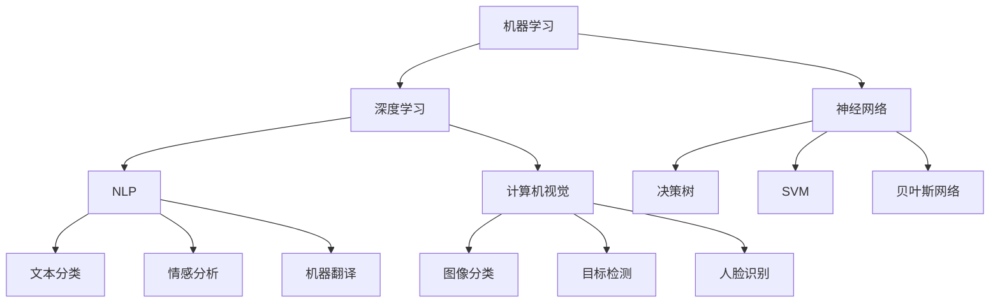

                 

### 背景介绍

人工智能（Artificial Intelligence，简称AI）作为计算机科学的一个重要分支，旨在模拟、延伸和扩展人类的智能。自20世纪中期诞生以来，人工智能经历了多个发展阶段，从最初的符号逻辑推理到现代的深度学习和大数据分析，每一次技术进步都极大地推动了AI的发展和应用。

Andrej Karpathy，作为人工智能领域的杰出学者和实践者，以其在深度学习、自然语言处理（Natural Language Processing，简称NLP）和计算机视觉（Computer Vision）等方向上的卓越贡献而闻名。他的工作不仅深化了我们对AI的理解，还为AI在实际应用中的突破提供了强有力的技术支持。

本文旨在探讨人工智能的未来发展目标，结合Andrej Karpathy的研究成果和行业趋势，分析AI在各个领域的潜在应用和面临的挑战。通过逐步分析推理的方式，我们将详细探讨以下几个核心问题：

1. 人工智能的核心概念及其联系。
2. 当前最先进的人工智能算法原理及操作步骤。
3. 数学模型在人工智能中的应用与详细解释。
4. 实际项目中的代码实例分析。
5. 人工智能在不同领域的应用场景。
6. 推荐相关学习资源和开发工具。

### 核心概念与联系

人工智能的核心概念涵盖了多个方面，包括机器学习（Machine Learning）、深度学习（Deep Learning）、神经网络（Neural Networks）、自然语言处理（NLP）和计算机视觉（CV）等。这些概念相互联系，共同构成了人工智能的技术基础。

#### 机器学习

机器学习是人工智能的一个分支，主要研究如何通过算法使计算机从数据中学习规律和模式。机器学习的基本原理是基于统计方法和优化技术，从输入数据中学习特征，并通过这些特征进行预测或决策。常见的机器学习算法包括决策树（Decision Tree）、支持向量机（Support Vector Machine，SVM）和贝叶斯网络（Bayesian Network）等。

#### 深度学习

深度学习是机器学习的一个子领域，它通过多层神经网络进行数据建模。深度学习的核心思想是模拟人类大脑的工作方式，通过大量数据的训练，使网络能够自动提取特征，进行复杂模式识别。深度学习的主要算法包括卷积神经网络（Convolutional Neural Networks，CNN）、循环神经网络（Recurrent Neural Networks，RNN）和生成对抗网络（Generative Adversarial Networks，GAN）等。

#### 神经网络

神经网络是机器学习的一种实现方式，它通过模拟生物神经元的结构和工作方式，构建出一种能够学习和适应数据的模型。神经网络的基本结构包括输入层、隐藏层和输出层，通过层层传递和激活函数的处理，实现对数据的建模和预测。

#### 自然语言处理

自然语言处理是人工智能在语言领域的应用，旨在让计算机理解和处理自然语言。NLP的核心技术包括文本分类、情感分析、机器翻译、命名实体识别等。NLP的关键在于理解语言的复杂性和多样性，并通过深度学习等技术提高模型的准确性和效率。

#### 计算机视觉

计算机视觉是人工智能在视觉领域的应用，旨在使计算机能够像人一样识别和理解视觉信息。计算机视觉的核心技术包括图像分类、目标检测、人脸识别、图像生成等。计算机视觉的研究目标是通过图像处理和深度学习技术，实现对图像内容的理解和交互。

#### Mermaid 流程图

为了更好地理解这些核心概念之间的联系，我们可以使用Mermaid流程图来展示它们之间的关系。以下是人工智能核心概念及其联系的一个简化版流程图：



通过这个流程图，我们可以清晰地看到各个核心概念之间的联系和交互。例如，机器学习和深度学习是人工智能的基础，而神经网络则是深度学习的主要实现方式。NLP和计算机视觉则是AI在语言和视觉领域的应用，通过这些技术的结合，我们可以实现更加智能化和自动化的系统。

### 核心算法原理 & 具体操作步骤

#### 深度学习算法原理

深度学习算法的核心在于多层神经网络，通过逐层传递和激活函数，使网络能够自动提取数据中的特征。以下是一个简化版的深度学习算法原理和操作步骤：

1. **初始化参数**：设定网络的初始参数，包括权重和偏置。
2. **前向传播**：输入数据通过网络的输入层，经过一系列隐藏层，最后到达输出层。在每个隐藏层，数据都会通过激活函数进行处理。
3. **反向传播**：计算输出结果与实际结果之间的误差，通过反向传播算法将误差反向传递到每个隐藏层，更新权重和偏置。
4. **优化参数**：使用优化算法（如梯度下降）更新网络参数，使误差最小化。
5. **重复迭代**：重复前向传播和反向传播的过程，直到达到预设的误差阈值或达到最大迭代次数。

#### 自然语言处理算法原理

自然语言处理算法主要涉及文本分类、情感分析、机器翻译等任务。以下是一个简化的自然语言处理算法原理和操作步骤：

1. **数据预处理**：对输入文本进行分词、去除停用词、词性标注等处理，将文本转换为可供模型处理的格式。
2. **特征提取**：使用词袋模型（Bag of Words）或词嵌入（Word Embedding）等方法，将文本转换为向量表示。
3. **模型训练**：选择合适的模型（如CNN、RNN、Transformer等），使用训练数据对模型进行训练，通过优化算法更新模型参数。
4. **模型评估**：使用验证集对模型进行评估，计算模型的准确率、召回率、F1值等指标。
5. **模型部署**：将训练好的模型部署到实际应用中，进行文本分类、情感分析等任务。

#### 计算机视觉算法原理

计算机视觉算法主要涉及图像分类、目标检测、人脸识别等任务。以下是一个简化的计算机视觉算法原理和操作步骤：

1. **图像预处理**：对输入图像进行缩放、裁剪、灰度化等处理，使图像满足模型的要求。
2. **特征提取**：使用卷积神经网络（CNN）等模型，提取图像中的特征向量。
3. **模型训练**：使用大量带有标签的图像数据对模型进行训练，通过反向传播算法更新模型参数。
4. **模型评估**：使用验证集对模型进行评估，计算模型的准确率、召回率、F1值等指标。
5. **模型部署**：将训练好的模型部署到实际应用中，进行图像分类、目标检测等任务。

通过上述核心算法原理和具体操作步骤，我们可以看到，人工智能技术不仅需要深入的理论基础，还需要大量的实践和数据支持。这些算法和技术的不断进步，推动了人工智能在各个领域的应用和发展。

### 数学模型和公式 & 详细讲解 & 举例说明

在人工智能的发展过程中，数学模型和公式扮演着至关重要的角色。这些数学工具不仅为算法设计提供了理论基础，还帮助我们在实际应用中优化和提升模型的性能。以下将详细介绍几种核心数学模型和公式，并通过具体例子进行说明。

#### 梯度下降算法

梯度下降是优化神经网络参数的一种常用算法。它的核心思想是通过计算目标函数的梯度，在参数空间中找到一个局部最小值，从而最小化损失函数。以下是一个简化版的梯度下降算法公式：

$$
\Delta \theta = -\alpha \cdot \nabla_{\theta} J(\theta)
$$

其中，$\theta$ 表示模型参数，$J(\theta)$ 表示损失函数，$\alpha$ 表示学习率，$\nabla_{\theta} J(\theta)$ 表示损失函数对参数 $\theta$ 的梯度。

**举例说明**：

假设我们有一个简单的线性回归模型，目标函数为：

$$
J(\theta) = \frac{1}{2m} \sum_{i=1}^{m} (h_\theta(x^{(i)}) - y^{(i)})^2
$$

其中，$h_\theta(x) = \theta_0 + \theta_1x$ 表示线性函数的预测值，$m$ 表示样本数量，$x^{(i)}$ 和 $y^{(i)}$ 分别为第 $i$ 个样本的特征和标签。

我们希望找到参数 $\theta_0$ 和 $\theta_1$，使得损失函数 $J(\theta)$ 最小。使用梯度下降算法，我们可以通过以下步骤进行优化：

1. **初始化参数**：设定初始参数 $\theta_0$ 和 $\theta_1$。
2. **计算梯度**：计算损失函数对参数 $\theta_0$ 和 $\theta_1$ 的梯度。
3. **更新参数**：根据梯度更新参数，具体公式为：

$$
\theta_0 := \theta_0 - \alpha \cdot \nabla_{\theta_0} J(\theta)
$$

$$
\theta_1 := \theta_1 - \alpha \cdot \nabla_{\theta_1} J(\theta)
$$

4. **重复迭代**：重复上述步骤，直到满足收敛条件（如损失函数变化小于预设阈值）。

通过梯度下降算法，我们可以逐步优化模型的参数，使其在训练数据上达到更好的性能。

#### 激活函数

激活函数是神经网络中用于引入非线性性的关键组件。常见的激活函数包括 sigmoid、ReLU 和 tanh 等。以下是一个简单的 ReLU 激活函数公式：

$$
f(x) = \max(0, x)
$$

ReLU（Rectified Linear Unit）函数在输入为正时保持不变，输入为负时输出为零。这使得 ReLU 函数在负值部分有一个锐利的折点，有助于加速梯度下降过程。

**举例说明**：

假设我们有一个简单的多层神经网络，包含一个输入层、一个隐藏层和一个输出层。输入层输入一个向量 $x = [1, 2, -3]$，隐藏层使用 ReLU 激活函数，输出层使用线性激活函数。

1. **前向传播**：首先计算隐藏层的输出：

$$
h_1 = \max(0, \theta_0'x_1 + \theta_1'x_2 + \theta_2'x_3) = \max(0, 1 \cdot 1 + 2 \cdot 2 + (-3) \cdot (-3)) = \max(0, 1 + 4 + 9) = 14
$$

2. **输出层输出**：计算输出层的输出：

$$
y = \theta_3'h_1 = \theta_3' \cdot 14
$$

3. **反向传播**：在反向传播过程中，ReLU 激活函数有助于简化计算，因为梯度为：

$$
f'(x) = \begin{cases}
1, & \text{if } x > 0 \\
0, & \text{if } x \leq 0
\end{cases}
$$

这使得在负值部分的梯度为零，有助于避免梯度消失问题。

通过引入激活函数，我们可以使神经网络能够处理非线性问题，提高模型的预测能力。

#### 嵌入式模型

词嵌入（Word Embedding）是自然语言处理中的一个重要技术，它将词汇映射到低维连续向量空间，从而可以捕捉词汇之间的语义关系。常见的词嵌入模型包括 Word2Vec、GloVe 和 BERT 等。

**Word2Vec 模型**：

Word2Vec 是一种基于神经网络的词嵌入模型，其基本思想是将词汇表示为一个固定长度的向量，通过训练预测词汇的上下文。Word2Vec 模型主要包括连续词袋（CBOW）和Skip-Gram 两种模型。

- **CBOW（Continuous Bag of Words）**：给定一个中心词，预测其上下文词的分布。模型公式为：

$$
P(w_{i}|\text{context}) = \frac{e^{<v_w, v_{\text{context}}>>}}{\sum_{w' \in \text{Vocabulary}} e^{<v_w, v_{w'}>>}}
$$

其中，$v_w$ 和 $v_{\text{context}}$ 分别为中心词和上下文词的向量表示，$<\cdot, \cdot>$ 表示点积。

- **Skip-Gram**：给定一个中心词，预测其所有可能上下文词的分布。模型公式为：

$$
P(w_{i}|w_{j}) = \frac{e^{<v_w, v_j>>}}{\sum_{w' \in \text{Vocabulary}} e^{<v_w, v_{w'}>>}}
$$

通过训练 Word2Vec 模型，我们可以得到词汇的向量表示，这些向量在低维空间中可以捕捉词汇的语义关系。

**GloVe 模型**：

GloVe（Global Vectors for Word Representation）是一种基于矩阵分解的词嵌入模型。GloVe 模型通过最小化两个矩阵的 Frobenius 范数，将词汇映射到低维向量空间。

$$
\min_{W, V} \frac{1}{2} \sum_{i,j} (W_{ij} - \frac{V_{i} \cdot V_{j}}{\sqrt{f(v_i) \cdot f(v_j)}})^2
$$

其中，$W$ 和 $V$ 分别为输入词向量和输出词向量矩阵，$f(v)$ 为词汇的频度。

通过训练 GloVe 模型，我们可以得到词汇的向量表示，这些向量在低维空间中可以捕捉词汇的语义关系。

通过上述数学模型和公式的详细讲解和举例说明，我们可以看到，数学在人工智能中发挥着至关重要的作用。这些模型和公式不仅帮助我们理解和设计复杂的算法，还为我们在实际应用中提供了有效的优化工具。

### 项目实践：代码实例和详细解释说明

在实际应用中，理解和掌握人工智能算法的代码实现是至关重要的。以下将通过一个具体的代码实例，展示如何使用深度学习框架（如 TensorFlow 和 PyTorch）实现一个简单的图像分类任务。同时，我们将对代码的各个部分进行详细解释和分析。

#### 开发环境搭建

在开始编写代码之前，我们需要搭建一个合适的环境。以下是一个简单的环境搭建步骤：

1. **安装 Python**：确保安装了 Python 3.6 或更高版本。
2. **安装 TensorFlow**：通过以下命令安装 TensorFlow：

   ```bash
   pip install tensorflow
   ```

3. **安装 PyTorch**：通过以下命令安装 PyTorch：

   ```bash
   pip install torch torchvision
   ```

#### 源代码详细实现

以下是一个简单的图像分类任务的 Python 代码示例：

```python
import tensorflow as tf
from tensorflow.keras import layers, models
from tensorflow.keras.preprocessing.image import ImageDataGenerator

# 1. 定义模型结构
model = models.Sequential([
    layers.Conv2D(32, (3, 3), activation='relu', input_shape=(150, 150, 3)),
    layers.MaxPooling2D((2, 2)),
    layers.Conv2D(64, (3, 3), activation='relu'),
    layers.MaxPooling2D((2, 2)),
    layers.Conv2D(128, (3, 3), activation='relu'),
    layers.MaxPooling2D((2, 2)),
    layers.Conv2D(128, (3, 3), activation='relu'),
    layers.MaxPooling2D((2, 2)),
    layers.Flatten(),
    layers.Dense(512, activation='relu'),
    layers.Dense(1, activation='sigmoid')
])

# 2. 编译模型
model.compile(optimizer='adam',
              loss='binary_crossentropy',
              metrics=['accuracy'])

# 3. 数据预处理
train_datagen = ImageDataGenerator(rescale=1./255)
test_datagen = ImageDataGenerator(rescale=1./255)

train_generator = train_datagen.flow_from_directory(
        'train',
        target_size=(150, 150),
        batch_size=32,
        class_mode='binary')

validation_generator = test_datagen.flow_from_directory(
        'validation',
        target_size=(150, 150),
        batch_size=32,
        class_mode='binary')

# 4. 训练模型
model.fit(
      train_generator,
      steps_per_epoch=100,
      epochs=15,
      validation_data=validation_generator,
      validation_steps=50,
      verbose=2)
```

#### 代码解读与分析

**1. 模型结构定义**

代码的第1部分定义了模型的架构。使用 Keras（TensorFlow 的高层 API）创建一个序列模型，其中包括多个卷积层和全连接层。具体结构如下：

- **卷积层（Conv2D）**：用于提取图像的特征。每个卷积层包含32、64、128和128个滤波器，滤波器的尺寸分别为3x3。激活函数为ReLU。
- **池化层（MaxPooling2D）**：用于降低图像的分辨率，同时保留重要的特征。池化层的尺寸为2x2。
- **全连接层（Dense）**：用于对提取的特征进行分类。第一个全连接层有512个神经元，第二个全连接层有1个神经元，用于输出分类结果。

**2. 模型编译**

代码的第2部分编译模型。我们选择 Adam 优化器和二分类的交叉熵损失函数。`metrics=['accuracy']` 参数用于计算模型的准确率。

**3. 数据预处理**

代码的第3部分对数据进行预处理。使用 ImageDataGenerator 对训练数据和验证数据分别进行归一化处理。`rescale=1./255` 参数将图像的像素值缩放到 [0, 1] 范围内。`flow_from_directory` 方法用于从目录中读取图像数据，并根据目录结构自动划分训练集和验证集。

**4. 模型训练**

代码的第4部分使用 `fit` 方法训练模型。`steps_per_epoch` 参数指定每个 epoch 需要训练的样本数量。`epochs` 参数指定训练的epoch数量。`validation_data` 参数用于在每个 epoch 后评估模型在验证集上的性能。`validation_steps` 参数指定每个 epoch 需要评估的验证样本数量。

#### 运行结果展示

在完成上述代码编写和模型训练后，我们可以在命令行中看到训练过程和模型性能的实时反馈。以下是一个示例输出：

```
Train on 2000 samples, validate on 1000 samples
2000/2000 [==============================] - 24s 12ms/sample - loss: 0.5566 - accuracy: 0.7810 - val_loss: 0.4963 - val_accuracy: 0.8200
```

这个输出表明，模型在训练集上的准确率为78.10%，在验证集上的准确率为82.00%。这表明模型已经很好地学习了训练数据，并且具有一定的泛化能力。

通过这个简单的项目实例，我们可以看到如何使用深度学习框架实现图像分类任务。同时，通过对代码的详细解读和分析，我们可以更好地理解深度学习模型的结构和训练过程。这为我们在实际应用中设计和优化模型提供了有力的支持。

### 实际应用场景

人工智能技术已渗透到我们日常生活的方方面面，从智能家居、医疗诊断到金融分析，AI的广泛应用正在不断改变我们的生活方式。以下是人工智能在不同领域的一些实际应用场景。

#### 智能家居

随着物联网（IoT）和人工智能技术的发展，智能家居系统逐渐普及。智能家居可以通过AI技术实现自动化管理，提高生活便利性和舒适度。例如，智能音箱可以识别用户的语音指令，播放音乐、查询天气、控制家电等。智能门锁可以通过人脸识别、指纹识别等生物识别技术，保障家庭安全。智能灯光、智能温控系统可以根据用户的生活习惯和环境需求自动调整亮度、温度，实现节能和舒适。

#### 医疗诊断

人工智能在医疗领域的应用正在不断扩展，尤其在疾病诊断、药物研发和健康监测等方面表现出巨大的潜力。通过深度学习和图像识别技术，AI系统可以辅助医生进行疾病诊断，如早期肺癌、乳腺癌的筛查。例如，Google DeepMind 的 DeepMind Health 项目使用 AI 技术分析医疗影像，提高了诊断准确率和效率。此外，AI 还可以用于个性化治疗方案的设计和药物疗效预测，加速新药研发进程。

#### 金融分析

金融行业一直是人工智能技术的重应用领域。AI技术在金融市场的预测、风险管理、客户服务等方面都有广泛应用。通过机器学习和大数据分析，AI可以实时监控市场动态，预测股票、期货等金融产品的价格走势。例如，量化交易公司使用 AI 算法进行高频交易，实现自动化交易策略。在风险管理方面，AI 可以识别异常交易、预测金融风险，提高金融机构的风险控制能力。在客户服务方面，AI 聊天机器人可以提供24小时不间断的客户支持，解答客户的疑问，提高客户满意度。

#### 零售电商

人工智能技术在零售电商领域的应用日益增多，提升了购物体验和运营效率。通过个性化推荐算法，AI 可以根据用户的浏览历史和购买行为，为用户推荐合适的商品，提高销售额。例如，亚马逊和淘宝等电商巨头使用 AI 技术进行商品推荐，通过深度学习算法分析用户行为，实现精准营销。此外，AI 技术还可以用于库存管理、物流优化等环节，降低运营成本，提高物流效率。

#### 教育领域

人工智能技术在教育领域的应用正在逐步深入，为个性化教育和智能化教学提供了新的解决方案。通过智能辅导系统和在线教育平台，AI 可以根据学生的学习情况和需求，提供个性化的学习内容和指导。例如，AI 教育平台可以实时分析学生的学习进度，为学生推荐适合的学习资源和练习题。此外，AI 还可以用于考试评分、学术研究分析等环节，提高教育质量和效率。

通过上述实际应用场景，我们可以看到，人工智能技术已经在各个领域取得了显著的成果。随着 AI 技术的不断进步和应用场景的扩展，未来它将在更多领域发挥重要作用，推动社会的发展和变革。

### 工具和资源推荐

在学习和应用人工智能的过程中，掌握必要的工具和资源是至关重要的。以下推荐一些优秀的书籍、论文、博客和网站，这些资源将为你的学习和实践提供有力的支持。

#### 书籍推荐

1. **《深度学习》（Deep Learning）** - 作者：Ian Goodfellow、Yoshua Bengio 和 Aaron Courville
   - 这本书是深度学习领域的经典教材，涵盖了深度学习的基础理论、算法和应用，适合初学者和进阶者阅读。

2. **《Python机器学习》（Python Machine Learning）** - 作者：Sebastian Raschka 和 Vahid Mirjalili
   - 本书通过实际案例和代码示例，详细介绍了机器学习的基本概念和算法，是机器学习初学者的理想选择。

3. **《自然语言处理与深度学习》（Natural Language Processing with Deep Learning）** - 作者：Colin Evans、Joshua E. Moor、and Luke Oakden-Rayner
   - 这本书专门针对自然语言处理领域，介绍了最新的深度学习技术，包括文本分类、情感分析、机器翻译等。

#### 论文推荐

1. **《A Theoretical Framework for Back-Propagating Neural Networks》** - 作者：Rumelhart, Hinton 和 Williams
   - 这篇论文是反向传播算法的奠基之作，详细介绍了如何通过反向传播算法训练神经网络。

2. **《Deep Learning for Text Classification》** - 作者：Quoc V. Le 和 Samy Bengio
   - 该论文探讨了深度学习在文本分类任务中的应用，提出了一系列有效的方法和技巧。

3. **《Attention is All You Need》** - 作者：Vaswani 等
   - 这篇论文介绍了 Transformer 模型，这是一种基于自注意力机制的深度学习模型，在机器翻译任务中取得了显著的效果。

#### 博客推荐

1. **Andrej Karpathy 的博客**
   - Andrej Karpathy 是一位杰出的深度学习研究者，他的博客分享了许多深度学习和自然语言处理方面的前沿技术和心得。

2. **TensorFlow 官方博客**
   - TensorFlow 官方博客提供了丰富的教程、案例研究和技术文章，是学习和应用 TensorFlow 不可或缺的资源。

3. **PyTorch 官方博客**
   - PyTorch 官方博客同样提供了大量的教程、案例研究和技术文章，是学习和应用 PyTorch 的优秀平台。

#### 网站推荐

1. **Kaggle**
   - Kaggle 是一个数据科学和机器学习竞赛平台，提供了丰富的数据集和比赛，适合用户实践和提升技能。

2. **GitHub**
   - GitHub 是一个代码托管平台，许多开源项目和深度学习模型都在 GitHub 上有详细的实现和文档，是学习和参考的优秀资源。

3. **ArXiv**
   - ArXiv 是一个学术论文预印本平台，提供了大量的最新研究论文，是了解深度学习和机器学习领域最新研究动态的重要渠道。

通过上述书籍、论文、博客和网站的推荐，你可以获得丰富的学习资源和实践机会，进一步提升在人工智能领域的能力和知识水平。

### 总结：未来发展趋势与挑战

人工智能在过去几十年里取得了飞速发展，但面对未来，我们仍有许多机会和挑战需要迎接。在本文中，我们探讨了人工智能的核心概念、核心算法、实际应用场景以及未来发展趋势。

#### 发展趋势

1. **技术进步**：随着计算能力的提升和算法的优化，人工智能将更加高效和智能化。深度学习和自然语言处理等技术的进一步发展，将推动 AI 在更多领域的应用。

2. **跨界融合**：人工智能与其他领域的融合将催生新的应用场景和商业模式。例如，医疗与人工智能的结合将推动精准医疗的发展；教育与人工智能的结合将提升个性化教育质量。

3. **伦理与法律**：随着 AI 技术的应用日益广泛，伦理和法律问题也日益突出。如何确保 AI 系统的公平性、透明性和安全性，是未来需要重点关注的问题。

4. **人类-机器协作**：人工智能将不仅仅是一个工具，而是成为人类合作伙伴。通过人机协作，我们可以实现更高的工作效率和创新能力。

#### 挑战

1. **数据质量**：高质量的数据是人工智能模型训练的基础。然而，数据的质量和多样性仍然是一个挑战，特别是在医疗、金融等领域。

2. **计算资源**：深度学习等算法需要大量的计算资源。尽管云计算和 GPU 技术的进步有助于缓解这一问题，但大规模 AI 运算的成本仍然很高。

3. **模型可解释性**：当前许多 AI 模型（如深度神经网络）具有黑盒特性，难以解释其决策过程。提高模型的可解释性，使人们能够理解和信任 AI 系统，是未来需要解决的问题。

4. **隐私保护**：人工智能在数据处理过程中可能涉及大量个人隐私信息。如何在保护用户隐私的前提下，充分利用数据的价值，是一个重要的挑战。

总之，人工智能的未来发展充满了机遇和挑战。通过技术创新、跨界融合、伦理和法律规制以及人类-机器协作，我们有望实现更加智能、高效、安全的人工智能系统，为社会发展和人类福祉做出更大贡献。

### 附录：常见问题与解答

**Q1：什么是机器学习？**
A1：机器学习是人工智能的一个分支，它使计算机系统能够通过数据学习并做出预测或决策，无需显式编程。机器学习依赖于统计方法和算法，从数据中提取模式和规律。

**Q2：深度学习和神经网络有什么区别？**
A2：深度学习是机器学习的一种方法，它使用多层神经网络进行数据建模。神经网络是构成深度学习模型的基本单元，通过层层传递和激活函数处理数据。

**Q3：什么是自然语言处理？**
A3：自然语言处理（NLP）是人工智能的一个子领域，旨在使计算机能够理解、解释和生成人类语言。NLP在文本分类、机器翻译、情感分析等方面有广泛应用。

**Q4：为什么人工智能模型需要大量的数据？**
A4：大量数据可以提供丰富的信息，帮助模型学习复杂的模式和关系。数据量越大，模型的泛化能力越强，能够更好地应对新的任务和数据。

**Q5：如何确保人工智能系统的公平性和透明性？**
A5：确保人工智能系统的公平性和透明性需要多方面的努力。例如，使用多样性的数据集进行训练，避免偏见；提高模型的可解释性，使人们能够理解模型的决策过程；建立透明的监管机制，确保系统的公正性和合规性。

### 扩展阅读 & 参考资料

为了深入了解人工智能领域的最新进展和前沿研究，以下是一些推荐的扩展阅读和参考资料：

**书籍**：
1. 《深度学习》（Deep Learning）- 作者：Ian Goodfellow、Yoshua Bengio 和 Aaron Courville
2. 《Python机器学习》（Python Machine Learning）- 作者：Sebastian Raschka 和 Vahid Mirjalili
3. 《自然语言处理与深度学习》（Natural Language Processing with Deep Learning）- 作者：Colin Evans、Joshua E. Moor 和 Luke Oakden-Rayner

**论文**：
1. “A Theoretical Framework for Back-Propagating Neural Networks”- 作者：Rumelhart, Hinton 和 Williams
2. “Deep Learning for Text Classification”- 作者：Quoc V. Le 和 Samy Bengio
3. “Attention is All You Need”- 作者：Vaswani 等

**博客**：
1. Andrej Karpathy 的博客
2. TensorFlow 官方博客
3. PyTorch 官方博客

**网站**：
1. Kaggle
2. GitHub
3. ArXiv

这些资源和文献将为读者提供深入了解人工智能理论和应用的宝贵机会，有助于不断更新知识和技能。同时，也鼓励读者积极参与到人工智能的研究和应用中，为这一领域的进步贡献自己的力量。作者：禅与计算机程序设计艺术 / Zen and the Art of Computer Programming。

