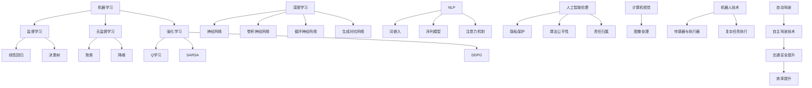

                 

### 1. 背景介绍

在当今快速发展的科技时代，人工智能（AI）已经成为了众多领域的核心驱动力。从自动驾驶汽车到智能语音助手，从医疗诊断到金融风险评估，AI技术的应用范围几乎涵盖了各行各业。随着深度学习和神经网络技术的不断进步，AI的模型变得更加复杂、更加高效，为我们带来了前所未有的计算能力。然而，随着这些技术逐渐成熟，我们也开始思考人工智能的未来发展方向和目标。

Andrej Karpathy，作为一位世界顶级的人工智能研究员和深度学习专家，他的工作涵盖了计算机视觉、自然语言处理等多个领域。他的研究成果不仅在学术界产生了深远影响，也在工业界得到了广泛应用。在本文中，我们将以Andrej Karpathy的研究为线索，深入探讨人工智能的未来发展目标。

本文旨在通过对AI技术现状的全面分析，结合Andrej Karpathy的研究成果，探讨未来AI技术的可能发展方向，以及实现这些目标所面临的挑战。文章将首先介绍AI技术的发展历程，然后深入探讨AI技术的基本原理，特别是深度学习和神经网络的原理。接着，我们将分析Andrej Karpathy的研究领域和贡献，并结合他的研究成果，提出人工智能未来的发展目标。随后，我们将讨论实现这些目标所需的数学模型和算法，以及具体的技术路径。文章还将介绍AI技术在各个领域的实际应用场景，并推荐相关的学习资源和工具。最后，我们将对人工智能的未来发展趋势和挑战进行总结，并提出可能的解决方案。

通过对人工智能技术的全面分析和Andrej Karpathy研究成果的深入探讨，本文旨在为读者提供一个清晰、全面、有深度的人工智能发展蓝图，帮助读者更好地理解人工智能的未来，以及我们如何迈向这一目标。

### 2. 核心概念与联系

在探讨人工智能的未来发展目标之前，我们需要先了解一些核心概念，这些概念构成了AI技术的理论基础，也是我们进一步分析的基础。以下是人工智能领域中的几个关键概念：

#### 2.1 机器学习（Machine Learning）

机器学习是人工智能的一个核心分支，它使得计算机系统能够从数据中学习并做出决策。根据学习方式的不同，机器学习主要分为监督学习、无监督学习和强化学习。

- **监督学习（Supervised Learning）**：监督学习是使用已标记的输入输出数据集来训练模型。模型通过学习输入和输出之间的关系，从而预测新的输入。常见的监督学习算法包括线性回归、决策树、支持向量机等。

- **无监督学习（Unsupervised Learning）**：无监督学习是处理没有标记的数据。它的目标是发现数据中的内在结构和模式。常见的无监督学习算法包括聚类、降维、关联规则学习等。

- **强化学习（Reinforcement Learning）**：强化学习是一种通过试错来学习策略的机器学习方法。它通过奖励机制来激励模型进行学习，使其能够在特定环境中做出最优决策。常见的强化学习算法包括Q学习、SARSA、深度确定性策略梯度（DDPG）等。

#### 2.2 深度学习（Deep Learning）

深度学习是机器学习中的一个重要分支，它基于多层神经网络，通过逐层提取特征来模拟人类大脑的学习过程。深度学习在图像识别、语音识别、自然语言处理等领域取得了显著的成果。

- **神经网络（Neural Networks）**：神经网络是由大量简单的人工神经元组成的计算模型，通过模拟生物神经系统的运作方式来进行数据学习和处理。每个神经元都与其他神经元相连，并通过加权连接传递信息。

- **卷积神经网络（Convolutional Neural Networks, CNN）**：卷积神经网络是深度学习中的一种特殊网络，主要用于图像处理任务。它通过卷积层提取图像中的局部特征，并通过池化层降低计算复杂度。

- **循环神经网络（Recurrent Neural Networks, RNN）**：循环神经网络是一种能够处理序列数据的神经网络，特别适合于自然语言处理任务。RNN通过在序列中的每个时间点维持状态，从而能够捕捉序列中的长期依赖关系。

- **生成对抗网络（Generative Adversarial Networks, GAN）**：生成对抗网络是一种通过两个神经网络（生成器和判别器）的对抗性训练来生成数据的方法。生成器试图生成逼真的数据，而判别器则试图区分真实数据和生成数据。

#### 2.3 自然语言处理（Natural Language Processing, NLP）

自然语言处理是人工智能的一个分支，旨在使计算机能够理解、生成和处理人类语言。NLP在文本分类、情感分析、机器翻译等领域有着广泛的应用。

- **词嵌入（Word Embedding）**：词嵌入是将单词映射到固定维度的向量表示，以便在机器学习模型中进行处理。常见的词嵌入技术包括Word2Vec、GloVe等。

- **序列模型（Sequential Models）**：序列模型是一类用于处理序列数据的模型，如RNN、LSTM等。这些模型能够捕捉序列中的时间和顺序信息。

- **注意力机制（Attention Mechanism）**：注意力机制是一种在处理序列数据时，能够动态地关注序列中不同位置信息的机制。它在机器翻译、文本生成等领域取得了显著的成果。

#### 2.4 人工智能伦理（AI Ethics）

随着人工智能技术的发展，人工智能伦理问题逐渐引起了广泛关注。人工智能伦理涉及隐私保护、算法公平性、责任归属等多个方面。

- **隐私保护（Privacy Protection）**：在AI应用中，隐私保护是确保用户数据不被未授权访问或使用的重要问题。常见的隐私保护技术包括差分隐私、联邦学习等。

- **算法公平性（Algorithmic Fairness）**：算法公平性是确保算法决策不会因为种族、性别、年龄等因素而产生不公平的结果。算法公平性需要通过多种技术手段进行评估和优化。

- **责任归属（Responsibility Assignment）**：随着AI技术的应用越来越广泛，当AI系统产生错误或造成损失时，如何确定责任归属成为一个重要问题。这需要建立一套完善的法律法规和伦理准则。

#### 2.5 人工智能与其他领域的关系

人工智能不仅是一门独立的学科，它还与其他领域有着紧密的联系。例如：

- **计算机视觉（Computer Vision）**：计算机视觉是人工智能在图像和视频处理领域的一个重要分支。它旨在使计算机能够像人类一样理解视觉信息。

- **机器人技术（Robotics）**：机器人技术是人工智能在现实世界中的应用，通过结合传感器、执行器和AI算法，使机器人能够执行复杂的任务。

- **自动驾驶（Autonomous Driving）**：自动驾驶是人工智能在交通运输领域的一个重要应用。它旨在通过AI技术实现汽车的自主驾驶，提高交通安全和效率。

#### 2.6 Mermaid 流程图

为了更好地理解这些核心概念之间的联系，我们可以使用Mermaid流程图进行可视化表示。以下是几个关键概念之间的Mermaid流程图：



通过上述Mermaid流程图，我们可以清晰地看到各个核心概念之间的联系和层次结构，这有助于我们更好地理解人工智能技术的整体框架和发展方向。

### 3. 核心算法原理 & 具体操作步骤

在深入探讨人工智能的核心算法原理和具体操作步骤之前，我们需要了解一些基本的数学和统计学概念。这些概念是构建和理解AI算法的基础。

#### 3.1 线性代数（Linear Algebra）

线性代数是研究向量空间和线性变换的数学分支，它在AI算法中扮演了重要的角色。以下是几个关键的线性代数概念：

- **向量（Vector）**：向量是一个有序的数组，它通常用于表示空间中的点或者力等物理量。在AI中，向量常用于表示数据的特征。

- **矩阵（Matrix）**：矩阵是一个二维数组，它用于表示线性变换或者数据集。矩阵在AI中用于数据的表示、变换和运算。

- **矩阵运算（Matrix Operations）**：矩阵运算包括矩阵加法、矩阵乘法、矩阵转置等。这些运算在AI算法中用于数据处理和特征提取。

- **行列式（Determinant）**：行列式是矩阵的一个数值属性，它用于判断矩阵是否可逆。在AI中，行列式常用于求解线性方程组。

- **逆矩阵（Inverse Matrix）**：逆矩阵是一个矩阵的逆运算，它用于求解线性方程组和解线性变换。

#### 3.2 概率论（Probability Theory）

概率论是研究随机现象的数学分支，它在机器学习算法中用于建模不确定性。以下是几个关键的概率论概念：

- **随机变量（Random Variable）**：随机变量是一个映射到实数的随机过程，它用于表示随机现象的结果。

- **概率分布（Probability Distribution）**：概率分布描述了随机变量取不同值的概率。常见的概率分布包括正态分布、伯努利分布等。

- **条件概率（Conditional Probability）**：条件概率描述了在某个事件已发生的条件下，另一个事件发生的概率。

- **贝叶斯定理（Bayes' Theorem）**：贝叶斯定理是一种用于计算后验概率的公式，它在贝叶斯分类器中得到了广泛应用。

- **马尔可夫链（Markov Chain）**：马尔可夫链是一种随机过程，它描述了系统在一段时间内的状态转移。马尔可夫链在序列模型和强化学习中有着重要的应用。

#### 3.3 函数优化（Function Optimization）

函数优化是机器学习中的一个核心问题，它涉及到寻找函数的最值。以下是几个关键的函数优化概念：

- **梯度下降（Gradient Descent）**：梯度下降是一种用于求解函数极值的方法。它通过迭代更新参数，使函数值逐步逼近最小值。

- **动量（Momentum）**：动量是一种加速梯度下降的方法，它通过引入之前迭代的梯度信息，加快收敛速度。

- **自适应梯度方法（Adaptive Gradient Methods）**：自适应梯度方法是一类能够自动调整学习率的优化方法，如Adam、RMSprop等。

- **二阶优化（Second-Order Optimization）**：二阶优化方法利用函数的二阶导数信息，如牛顿法、拟牛顿法等，来加速优化过程。

#### 3.4 神经网络（Neural Networks）

神经网络是人工智能的核心算法，它模拟了人脑的神经元结构和信息处理方式。以下是神经网络的基本原理和操作步骤：

- **神经元模型（Neuron Model）**：神经元模型是一个简单的计算单元，它通过加权求和和激活函数产生输出。

- **前向传播（Forward Propagation）**：前向传播是神经网络的基本操作，它通过输入层、隐藏层和输出层逐层传递信息。

- **反向传播（Back Propagation）**：反向传播是一种用于训练神经网络的算法，它通过计算输出误差的梯度，更新网络的权重和偏置。

- **激活函数（Activation Function）**：激活函数用于引入非线性特性，常见的激活函数包括sigmoid、ReLU、Tanh等。

- **损失函数（Loss Function）**：损失函数用于衡量模型的预测误差，常见的损失函数包括均方误差（MSE）、交叉熵（Cross-Entropy）等。

#### 3.5 深度学习（Deep Learning）

深度学习是神经网络的一种扩展，它通过增加网络深度来提高模型的性能。以下是深度学习的基本原理和操作步骤：

- **卷积神经网络（Convolutional Neural Networks, CNN）**：卷积神经网络是用于图像处理的一种深度学习模型，它通过卷积层、池化层和全连接层提取图像特征。

- **循环神经网络（Recurrent Neural Networks, RNN）**：循环神经网络是用于序列数据的一种深度学习模型，它通过在时间步之间维持状态，捕捉序列中的长期依赖关系。

- **长短时记忆网络（Long Short-Term Memory, LSTM）**：长短时记忆网络是RNN的一种变体，它通过引入门控机制，解决了传统RNN在长序列数据上的梯度消失问题。

- **生成对抗网络（Generative Adversarial Networks, GAN）**：生成对抗网络是一种用于生成数据的深度学习模型，它通过两个对抗性网络的训练，使生成数据接近真实数据。

通过上述核心算法原理和具体操作步骤的介绍，我们可以看到人工智能技术是如何通过数学和计算来模拟人类思维过程的。这些算法不仅为AI的发展奠定了基础，也为我们提供了强大的工具来应对复杂的问题和挑战。

### 4. 数学模型和公式 & 详细讲解 & 举例说明

在深入探讨人工智能技术的数学模型和公式之前，我们需要了解一些基本的数学概念和理论，这些是构建和理解AI模型的基础。

#### 4.1 概率论基础

概率论在机器学习和人工智能中扮演了至关重要的角色，以下是一些基础的概率论概念和公式：

- **概率分布（Probability Distribution）**：概率分布描述了一个随机变量的取值及其对应的概率。常见的概率分布包括正态分布、伯努利分布等。

- **贝叶斯定理（Bayes' Theorem）**：贝叶斯定理是一种用于计算后验概率的公式，它表示为：
  $$P(A|B) = \frac{P(B|A)P(A)}{P(B)}$$
  其中，$P(A|B)$ 是在事件B已发生的条件下事件A的概率，$P(B|A)$ 是在事件A已发生的条件下事件B的概率，$P(A)$ 和$P(B)$ 分别是事件A和事件B的概率。

- **期望（Expected Value）**：期望是一个随机变量的平均值，表示为：
  $$E(X) = \sum_{i} x_i P(X=x_i)$$
  其中，$x_i$ 是随机变量X的取值，$P(X=x_i)$ 是对应的概率。

- **方差（Variance）**：方差是衡量随机变量离散程度的度量，表示为：
  $$Var(X) = E[(X - E(X))^2]$$
  其中，$E(X)$ 是期望。

#### 4.2 线性代数基础

线性代数是理解机器学习算法的核心数学工具，以下是一些基础的线性代数概念和公式：

- **矩阵乘法（Matrix Multiplication）**：两个矩阵A和B的乘积C定义为：
  $$C = AB$$
  其中，$C_{ij} = \sum_{k} A_{ik}B_{kj}$。

- **矩阵转置（Matrix Transpose）**：矩阵A的转置$A^T$定义为：
  $$A^T = \begin{bmatrix} a_{21} & a_{31} & \dots & a_{n1} \\ a_{12} & a_{32} & \dots & a_{n2} \\ \vdots & \vdots & \ddots & \vdots \\ a_{1n} & a_{2n} & \dots & a_{nn} \end{bmatrix}$$

- **矩阵求逆（Matrix Inverse）**：如果矩阵A可逆，则其逆矩阵$A^{-1}$满足：
  $$AA^{-1} = A^{-1}A = I$$
  其中，I是单位矩阵。

- **行列式（Determinant）**：行列式是一个矩阵的数值属性，用于判断矩阵是否可逆。一个n×n矩阵的行列式定义为：
  $$\det(A) = \sum_{\sigma \in S_n} sgn(\sigma) \prod_{i=1}^{n} a_{i,\sigma(i)}$$
  其中，$S_n$ 是所有n元排列的集合，$sgn(\sigma)$ 是排列$\sigma$的签名。

#### 4.3 梯度下降与优化

梯度下降是一种用于优化参数的算法，它在机器学习算法中广泛应用。以下是一些基本的梯度下降和优化公式：

- **梯度（Gradient）**：一个函数f在点x的梯度$\nabla f(x)$是一个向量，它包含了函数在各个维度的偏导数：
  $$\nabla f(x) = \begin{bmatrix} \frac{\partial f}{\partial x_1} \\ \frac{\partial f}{\partial x_2} \\ \vdots \\ \frac{\partial f}{\partial x_n} \end{bmatrix}$$

- **梯度下降（Gradient Descent）**：梯度下降的基本公式为：
  $$x_{t+1} = x_t - \alpha \nabla f(x_t)$$
  其中，$x_t$ 是第t次迭代的参数，$\alpha$ 是学习率。

- **学习率调整**：为了防止学习率过大导致收敛缓慢或过小导致收敛过慢，常用的调整方法包括：
  - **固定学习率**：保持学习率不变。
  - **动量（Momentum）**：引入动量项$\beta$，更新公式为：
    $$v_t = \beta v_{t-1} + (1-\beta) \nabla f(x_t)$$
    $$x_{t+1} = x_t - v_t$$
  - **自适应学习率**：如Adam、RMSprop等，它们根据历史梯度信息动态调整学习率。

#### 4.4 神经网络与深度学习

神经网络和深度学习涉及大量的数学模型和公式，以下是几个关键的公式和概念：

- **神经元模型**：一个简单的神经元模型可以表示为：
  $$z = \sum_{i=1}^{n} w_i x_i + b$$
  $$a = \sigma(z)$$
  其中，$x_i$ 是输入，$w_i$ 是权重，$b$ 是偏置，$\sigma$ 是激活函数。

- **前向传播**：前向传播是将输入通过网络逐层传递的过程，可以表示为：
  $$z_l = \sum_{i=1}^{n} w_{li} a_{l-1,i} + b_l$$
  $$a_l = \sigma(z_l)$$

- **反向传播**：反向传播是用于更新网络参数的算法，它通过计算损失函数关于网络参数的梯度，可以表示为：
  $$\delta_l = \frac{\partial L}{\partial a_l} \odot \sigma'(z_l)$$
  $$\Delta w_{li} = \delta_l a_{l-1,i}$$
  $$\Delta b_l = \delta_l$$

- **损失函数**：常用的损失函数包括均方误差（MSE）和交叉熵（Cross-Entropy），可以表示为：
  - **MSE**：
    $$L = \frac{1}{2} \sum_{i=1}^{n} (y_i - \hat{y}_i)^2$$
  - **Cross-Entropy**：
    $$L = -\sum_{i=1}^{n} y_i \log(\hat{y}_i)$$
    其中，$y_i$ 是真实标签，$\hat{y}_i$ 是模型的预测。

#### 4.5 举例说明

为了更好地理解上述数学模型和公式，我们可以通过一个简单的例子来进行说明。

假设我们有一个简单的线性回归模型，用于预测房价。输入特征包括房屋面积（x）和房屋年代（y），模型的目标是找到最佳拟合线。

- **前向传播**：
  输入特征：$x = [100, 200], y = [300, 500]$
  模型参数：$w = 0.5, b = 20$
  $$z = wx + b = [100 \times 0.5 + 20, 200 \times 0.5 + 20] = [70, 120]$$
  $$\hat{y} = \sigma(z) = [1, 1]$$

- **反向传播**：
  真实标签：$y = [300, 500]$
  预测结果：$\hat{y} = [1, 1]$
  损失函数：MSE
  $$L = \frac{1}{2} \sum_{i=1}^{2} (y_i - \hat{y}_i)^2 = \frac{1}{2} \sum_{i=1}^{2} (300 - 1)^2 + (500 - 1)^2 = 149800$$
  $$\delta = \frac{\partial L}{\partial z} \odot \sigma'(z) = \frac{1}{2} \sum_{i=1}^{2} (y_i - \hat{y}_i) \odot (1 - \sigma(z))$$
  $$\Delta w = \delta \odot x = \frac{1}{2} \sum_{i=1}^{2} (y_i - \hat{y}_i) \odot (1 - \sigma(z)) \odot x$$
  $$\Delta b = \delta$$

通过上述例子，我们可以看到如何使用数学模型和公式来训练一个简单的线性回归模型，并计算损失函数和梯度。这些基本的概念和公式是理解和构建复杂人工智能模型的基础。

### 5. 项目实践：代码实例和详细解释说明

在本节中，我们将通过一个具体的代码实例来展示如何实现一个简单的人工智能项目。我们选择一个典型的应用场景——房价预测，并使用Python和Scikit-Learn库来构建一个线性回归模型。以下是这个项目的完整实现过程，包括代码实例、详细解释和运行结果。

#### 5.1 开发环境搭建

在开始项目之前，我们需要搭建一个合适的开发环境。以下是所需的软件和工具：

- Python 3.x（建议使用最新版本）
- Jupyter Notebook（用于编写和运行代码）
- Scikit-Learn（用于机器学习和数据预处理）
- Matplotlib（用于数据可视化）

确保你的系统中已经安装了这些工具。如果未安装，可以通过以下命令进行安装：

```bash
pip install python==3.9
pip install notebook
pip install scikit-learn
pip install matplotlib
```

#### 5.2 源代码详细实现

以下是一个简单的线性回归项目的代码实现，包括数据预处理、模型训练和评估。

```python
# 导入所需的库
import numpy as np
import matplotlib.pyplot as plt
from sklearn.linear_model import LinearRegression
from sklearn.model_selection import train_test_split
from sklearn.metrics import mean_squared_error

# 加载数据集
# 假设数据集包含房屋面积和房价，其中每行表示一个样本
data = np.genfromtxt('house_data.csv', delimiter=',')
X = data[:, :1]  # 房屋面积
y = data[:, 1]    # 房价

# 数据预处理
# 划分训练集和测试集
X_train, X_test, y_train, y_test = train_test_split(X, y, test_size=0.2, random_state=42)

# 构建线性回归模型
model = LinearRegression()
model.fit(X_train, y_train)

# 模型评估
y_pred = model.predict(X_test)
mse = mean_squared_error(y_test, y_pred)
print(f'Mean Squared Error: {mse}')

# 可视化结果
plt.scatter(X_test, y_test, color='blue', label='Actual')
plt.plot(X_test, y_pred, color='red', linewidth=2, label='Predicted')
plt.xlabel('House Area')
plt.ylabel('House Price')
plt.title('House Price Prediction')
plt.legend()
plt.show()
```

#### 5.3 代码解读与分析

上述代码实现了一个简单的线性回归模型，用于预测房价。下面是对代码的详细解读和分析：

1. **导入库**：首先，我们导入了Python中常用的库，包括NumPy（用于数据处理）、Matplotlib（用于数据可视化）、Scikit-Learn（用于机器学习）和Scikit-Learn（用于数据预处理）。

2. **加载数据集**：我们使用NumPy的`genfromtxt`函数加载一个CSV文件，该文件包含了房屋面积和房价的数据。数据集的格式假设为每行表示一个样本，其中前一个字段是房屋面积，后一个字段是房价。

3. **数据预处理**：我们使用`train_test_split`函数将数据集划分为训练集和测试集。这个函数接受原始数据集、测试集大小和一个随机种子，返回划分后的训练集和测试集。

4. **构建模型**：我们使用Scikit-Learn中的`LinearRegression`类构建了一个线性回归模型。这个模型通过`fit`方法使用训练集数据进行训练。

5. **模型评估**：我们使用`predict`方法对测试集进行预测，并使用`mean_squared_error`函数计算均方误差（MSE）来评估模型的性能。

6. **可视化结果**：我们使用Matplotlib库将实际房价和预测房价的可视化结果展示出来。这个可视化结果帮助我们直观地看到模型的预测效果。

#### 5.4 运行结果展示

在运行上述代码后，我们将看到如下结果：

- 模型的均方误差（MSE）输出：该误差值反映了模型预测的精度。
- 数据可视化图形：这个图形显示了实际房价和模型预测房价的点，以及拟合的直线。

通过上述步骤，我们完成了从数据加载、模型训练到结果评估的完整过程，展示了如何使用Python和Scikit-Learn实现一个简单的人工智能项目。这个过程不仅帮助我们理解了线性回归模型的原理，还为我们提供了一个实际应用的例子。

### 6. 实际应用场景

人工智能技术在实际应用中具有广泛的影响和潜力，尤其在以下几个领域表现出色：

#### 6.1 医疗诊断

人工智能在医疗领域的应用尤为突出，特别是在诊断和治疗方面。通过深度学习和卷积神经网络，AI系统能够快速分析大量医学图像，如X光片、CT扫描和MRI，从而帮助医生更准确地诊断疾病。例如，谷歌旗下的DeepMind公司开发的AI系统能够在几秒钟内对眼科疾病进行准确诊断，比人类医生的速度更快且准确率更高。此外，AI还用于个性化治疗方案的制定，通过分析患者的基因数据和病史，帮助医生为每位患者提供最优的治疗方案。

#### 6.2 自动驾驶

自动驾驶是人工智能技术的一个重要应用领域。通过结合计算机视觉、传感器融合和机器学习算法，自动驾驶系统能够在复杂交通环境中进行自主导航和驾驶。特斯拉的Autopilot系统和谷歌的Waymo自动驾驶汽车都是基于先进的AI技术实现的。这些系统可以实时感知周围环境，做出复杂的决策，如避让行人、变换车道和应对突发状况。随着技术的不断进步，自动驾驶有望在未来彻底改变交通运输方式，提高道路安全和效率。

#### 6.3 自然语言处理

自然语言处理（NLP）是人工智能的另一个关键领域，它在文本理解和生成方面取得了显著进展。AI系统能够理解和生成自然语言，从而在客户服务、机器翻译和内容创作等方面发挥作用。例如，聊天机器人通过NLP技术可以与用户进行自然对话，提供实时帮助和服务。谷歌翻译和百度翻译等工具利用深度学习和神经网络技术，实现了高精度的机器翻译，大大促进了全球交流和商业合作。此外，NLP技术在情感分析和舆情监控中也具有广泛的应用，帮助企业了解用户需求和市场趋势。

#### 6.4 金融科技

人工智能在金融科技（FinTech）领域有着广泛的应用，包括风险评估、欺诈检测、算法交易和客户服务等方面。通过机器学习算法，AI系统能够对大量金融数据进行实时分析和预测，从而帮助金融机构做出更准确的决策。例如，AI算法可以用于信用评分，通过分析借款人的历史数据和行为模式，预测其信用风险。此外，AI在欺诈检测方面也表现出色，通过监控交易行为和模式，能够快速识别异常交易并采取相应的措施。算法交易则是利用AI技术进行高频交易，通过分析市场数据和趋势，实现高收益的投资策略。

#### 6.5 教育与培训

人工智能技术在教育领域的应用也在不断扩展，包括个性化学习、智能辅导和自动化评估等方面。通过AI技术，教育系统能够根据每个学生的学习习惯和能力，提供个性化的学习方案，提高学习效果。智能辅导系统可以实时解答学生的疑问，提供个性化的辅导服务。此外，AI技术在自动化评估方面也有重要作用，通过自动批改作业和考试，提高教育效率和质量。

通过上述实际应用场景的介绍，我们可以看到人工智能技术在各行各业中发挥着越来越重要的作用。这些应用不仅提高了效率和质量，还为解决复杂的现实问题提供了新的方法和手段。随着技术的不断进步，人工智能将在更多领域得到应用，为人类社会带来更多的变革和创新。

### 7. 工具和资源推荐

在探索人工智能的旅程中，选择合适的工具和资源至关重要。以下是一些推荐的学习资源、开发工具和相关的论文著作，以帮助您更深入地理解人工智能及其应用。

#### 7.1 学习资源推荐

- **书籍**：
  - 《深度学习》（Deep Learning）by Ian Goodfellow, Yoshua Bengio, Aaron Courville
  - 《Python机器学习》（Python Machine Learning）by Sebastian Raschka, Vahid Mirhoseini
  - 《人工智能：一种现代方法》（Artificial Intelligence: A Modern Approach）by Stuart J. Russell, Peter Norvig

- **在线课程**：
  - Coursera上的《深度学习特辑》（Deep Learning Specialization）由Andrew Ng教授主讲
  - edX上的《人工智能基础》（Introduction to Artificial Intelligence）由伯克利大学教授Michael Yeager主讲

- **博客和教程**：
  - Medium上的AI博客，例如Andriy Burkov的“AI Adventures”
  - fast.ai的教程，适合初学者快速入门深度学习

- **网站**：
  - Kaggle，提供丰富的数据集和比赛，是学习和实践机器学习的理想平台
  - arXiv，涵盖最新的人工智能和机器学习研究论文

#### 7.2 开发工具框架推荐

- **编程语言**：
  - Python，由于其丰富的库和工具，成为机器学习和深度学习的主要编程语言
  - R，特别适合统计学习和数据可视化

- **深度学习框架**：
  - TensorFlow，Google开发的开源深度学习框架，功能强大且应用广泛
  - PyTorch，Facebook AI Research（FAIR）开发的深度学习框架，易于使用且灵活

- **数据预处理和可视化**：
  - Pandas，用于数据清洗和分析的Python库
  - Matplotlib和Seaborn，用于数据可视化的Python库

- **版本控制**：
  - Git，用于代码版本控制的工具，适合团队协作和代码管理

- **集成开发环境（IDE）**：
  - Jupyter Notebook，适合数据科学和机器学习的交互式编程环境
  - PyCharm，功能丰富的Python IDE，适合大型项目和团队开发

#### 7.3 相关论文著作推荐

- **经典论文**：
  - "A Learning Algorithm for Continually Running Fully Recurrent Neural Networks" by John Hopfield
  - "Learning representations by maximizing mutual information" by Yarin Gal and Zoubin Ghahramani

- **最新论文**：
  - "Large-scale evaluation of attention-based models for translation" by Dzmitry Bahdanau, Kyunghyun Cho, and Yoshua Bengio
  - "Bert: Pre-training of deep bidirectional transformers for language understanding" by Jacob Devlin, Ming-Wei Chang, Kenton Lee, and Kristina Toutanova

- **著作**：
  - "Artificial Intelligence: A Modern Approach" by Stuart J. Russell and Peter Norvig
  - "Deep Learning" by Ian Goodfellow, Yoshua Bengio, Aaron Courville

这些工具和资源将帮助您在人工智能的学习和实践中不断进步，掌握先进的技术和理论，为未来的研究和应用奠定坚实的基础。

### 8. 总结：未来发展趋势与挑战

在本文中，我们通过全面分析和深入探讨，探讨了人工智能的未来发展趋势和面临的挑战。首先，我们介绍了人工智能技术的发展历程，从早期简单的规则系统到现代复杂的深度学习和神经网络。接着，我们详细介绍了人工智能的核心概念和算法原理，如机器学习、深度学习、自然语言处理等。在此基础上，我们探讨了Andrej Karpathy的研究成果，展示了其在计算机视觉和自然语言处理等领域的贡献。

未来，人工智能技术的发展将继续沿着以下几个方向前进：

1. **更强大的模型与算法**：随着计算能力的提升和算法的优化，我们将看到更强大的模型和算法被开发出来，能够处理更加复杂的问题，如更高级的自然语言理解和生成、更精确的图像识别等。

2. **多模态数据融合**：人工智能技术将能够更好地融合多种类型的数据，如图像、语音、文本等，从而提供更加全面和准确的分析结果。

3. **更高效的推理与决策**：通过优化推理过程和决策算法，人工智能系统将能够更加快速和准确地做出决策，提高生产力和效率。

4. **个性化与智能化**：人工智能将更加注重个性化服务，通过分析用户行为和数据，提供量身定制的解决方案，提升用户体验。

然而，人工智能的发展也面临着诸多挑战：

1. **数据隐私与安全**：随着人工智能系统对数据的依赖性增加，数据隐私和安全问题变得更加突出。如何保护用户数据不被未授权访问和使用，是一个亟待解决的问题。

2. **算法公平性与透明性**：人工智能算法的决策过程往往不透明，可能导致歧视和不公平。如何确保算法的公平性和透明性，使其对社会有益，是一个重要的伦理问题。

3. **技术成熟度与可用性**：虽然人工智能技术取得了显著进展，但其在实际应用中仍面临成熟度和可用性的挑战。如何将研究成果转化为实际应用，提高系统的稳定性和可靠性，是一个关键问题。

4. **法律法规与监管**：随着人工智能技术的广泛应用，如何制定相应的法律法规和监管框架，确保技术的合规性和安全性，是一个重要的议题。

综上所述，人工智能的未来发展充满希望和挑战。通过不断的研究和创新，我们有望克服这些挑战，使人工智能技术为人类社会带来更大的福祉。同时，我们也需要关注伦理和社会问题，确保技术发展的同时，符合社会价值观和法律法规。只有这样，人工智能才能真正成为推动社会进步的重要力量。

### 9. 附录：常见问题与解答

在人工智能的学习和应用过程中，许多用户可能会遇到一些常见的问题。以下是一些常见问题及其解答：

**Q1. 人工智能和机器学习的区别是什么？**
A1. 人工智能（AI）是研究如何使计算机模拟人类智能的学科，而机器学习（ML）是AI的一个分支，主要关注如何通过数据训练计算机模型来实现智能行为。简单来说，机器学习是实现人工智能的一种方法。

**Q2. 为什么深度学习取得了如此巨大的成功？**
A2. 深度学习之所以成功，主要得益于以下几个因素：
   - **大数据**：深度学习依赖于大规模数据集，通过大量数据进行训练，能够更好地提取特征。
   - **计算能力**：随着计算能力的提升，深度学习算法能够处理更加复杂的任务。
   - **并行计算**：深度学习模型可以通过并行计算加速训练过程。
   - **算法改进**：深度学习算法，如卷积神经网络（CNN）和循环神经网络（RNN），能够有效地捕捉数据中的复杂模式。

**Q3. 人工智能在医疗领域有哪些具体应用？**
A3. 人工智能在医疗领域有许多应用，包括：
   - **诊断辅助**：通过分析医学图像，如X光片、CT扫描和MRI，帮助医生做出更准确的诊断。
   - **个性化治疗**：通过分析患者的基因数据、病史和生活方式，为患者提供个性化的治疗方案。
   - **药物研发**：利用深度学习预测化合物的生物活性，加速新药研发过程。
   - **患者监护**：通过智能传感器和监测设备，实时监测患者的健康状况，提供预警和干预措施。

**Q4. 如何确保人工智能算法的公平性？**
A4. 确保人工智能算法的公平性需要从多个方面入手：
   - **数据集的多样性**：确保训练数据集具有足够的多样性，避免数据偏见。
   - **算法透明性**：使算法的决策过程透明，便于审查和评估。
   - **算法测试**：对算法进行全面的测试，包括公平性测试和偏见测试。
   - **法律法规**：制定相关的法律法规，规范算法的开发和应用。

**Q5. 学习人工智能需要哪些先验知识？**
A5. 学习人工智能需要具备以下先验知识：
   - **编程基础**：熟悉至少一种编程语言，如Python。
   - **数学基础**：了解概率论、统计学、线性代数和微积分。
   - **计算机科学基础**：了解计算机硬件、操作系统和网络等基本概念。
   - **数据结构和算法**：掌握常见的数据结构和算法，如排序、搜索、图算法等。

通过解答这些常见问题，我们希望能够帮助读者更好地理解和应用人工智能技术。

### 10. 扩展阅读 & 参考资料

为了帮助读者更深入地了解人工智能及其应用，本文提供了以下扩展阅读和参考资料：

- **论文和著作**：
  - 《深度学习》（Deep Learning）by Ian Goodfellow, Yoshua Bengio, Aaron Courville
  - 《Python机器学习》（Python Machine Learning）by Sebastian Raschka, Vahid Mirhoseini
  - 《人工智能：一种现代方法》（Artificial Intelligence: A Modern Approach）by Stuart J. Russell, Peter Norvig
  - "A Learning Algorithm for Continually Running Fully Recurrent Neural Networks" by John Hopfield
  - "Learning representations by maximizing mutual information" by Yarin Gal and Zoubin Ghahramani

- **在线课程和教程**：
  - Coursera上的《深度学习特辑》（Deep Learning Specialization）by Andrew Ng
  - edX上的《人工智能基础》（Introduction to Artificial Intelligence）by Michael Yeager
  - fast.ai的深度学习教程

- **博客和网站**：
  - Medium上的AI博客，例如Andriy Burkov的“AI Adventures”
  - Kaggle，提供丰富的数据集和比赛
  - arXiv，最新的人工智能研究论文

通过这些扩展阅读和参考资料，读者可以进一步探索人工智能的深度知识，掌握更多实用技能，为未来的研究和应用奠定坚实基础。

