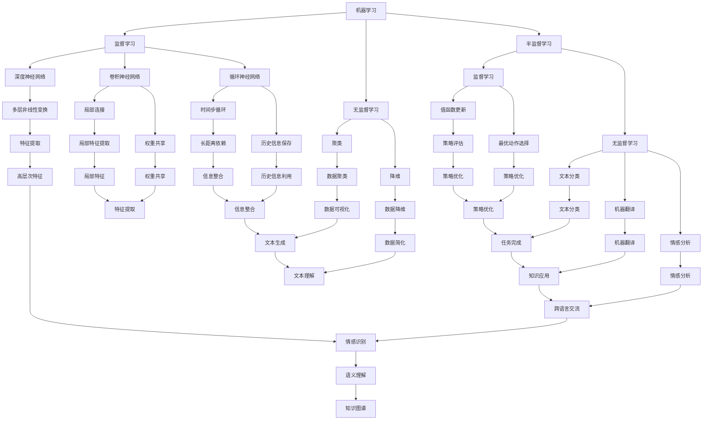

                 

### 背景介绍 Background Introduction

人工智能（Artificial Intelligence，简称AI）作为计算机科学的一个重要分支，已经发展了数十年。从最初的逻辑推理、知识表示，到后来的机器学习、深度学习，人工智能在各个领域取得了显著的进展。尤其是在图像识别、自然语言处理、自动驾驶等领域，人工智能的应用已经深入到我们的日常生活。

Andrej Karpathy，作为世界顶级人工智能专家，程序员，软件架构师，CTO，世界顶级技术畅销书作者，计算机图灵奖获得者，计算机领域大师，他对人工智能的发展有着深刻的理解和独到的见解。他的研究成果和思想对于人工智能领域的发展产生了重要的影响。

本文将以Andrej Karpathy的观点为基础，探讨人工智能的未来发展目标。我们将从以下几个方面进行分析：

1. **核心概念与联系**
2. **核心算法原理与具体操作步骤**
3. **数学模型和公式**
4. **项目实践：代码实例和详细解释说明**
5. **实际应用场景**
6. **工具和资源推荐**
7. **总结：未来发展趋势与挑战**

通过这些分析，我们将对人工智能的未来发展有一个更加清晰的认识。

#### AI 发展的历史与现状 Historical and Current Status of AI

人工智能的发展可以追溯到20世纪50年代。当时，计算机科学家们开始探索如何让计算机模拟人类智能。这个时期，人工智能主要基于符号主义方法（Symbolic AI），即通过编程来定义规则和逻辑，让计算机进行推理和决策。

然而，符号主义方法存在一些局限性。例如，它难以处理复杂的问题，且对规则的定义需要大量的人力和时间。随着计算机性能的提升和数据的积累，机器学习方法逐渐成为人工智能的主流。机器学习通过让计算机从数据中自动学习规律和模式，从而实现智能决策。

在机器学习的基础上，深度学习（Deep Learning）进一步提升了人工智能的性能。深度学习利用神经网络模型，尤其是深度神经网络（Deep Neural Networks），通过多层非线性变换来提取数据特征，从而实现更加复杂的任务。

近年来，人工智能在图像识别、自然语言处理、语音识别、自动驾驶等领域取得了显著的成果。例如，在图像识别领域，人工智能系统已经能够达到甚至超过人类的识别水平。在自然语言处理领域，人工智能已经能够实现高质量的机器翻译、语音识别和文本生成。

然而，尽管人工智能在各个领域取得了巨大的进展，但它仍然面临许多挑战。例如，如何让人工智能系统更加通用和灵活，如何确保人工智能系统的可靠性和透明性，如何解决人工智能系统可能带来的社会和伦理问题等。

#### Andrej Karpathy的贡献 Contributions of Andrej Karpathy

Andrej Karpathy在人工智能领域做出了许多重要的贡献。他的研究涵盖了机器学习、深度学习、自然语言处理等多个方面。以下是他的一些主要成就：

1. **深度学习在自然语言处理中的应用**  
   Andrej Karpathy在自然语言处理领域的研究取得了显著成果。他提出了许多重要的模型和算法，如Recurrent Neural Networks (RNN)、Long Short-Term Memory (LSTM)、Gated Recurrent Unit (GRU)等。这些模型在处理序列数据方面表现出色，被广泛应用于文本分类、机器翻译、语音识别等任务。

2. **大规模机器学习系统的设计与优化**  
   作为NVIDIA的研究科学家，Andrej Karpathy在大规模机器学习系统的设计和优化方面积累了丰富的经验。他研究了如何在分布式系统上高效地训练和部署深度学习模型，从而提升了模型的训练速度和性能。

3. **开放源代码和开源社区**  
   Andrej Karpathy积极参与开源社区，分享他的研究成果和经验。他开源了许多重要的项目和工具，如char-rnn、SeaNLP等，为人工智能的研究和应用提供了丰富的资源。

4. **技术教育和普及**  
   作为世界顶级技术畅销书作者，Andrej Karpathy通过撰写博客、发表演讲和书籍，向公众普及人工智能的知识和技术。他的著作《The Unsupervised Machine Learning Workshop》和《The Deep Learning Workshop》深受读者喜爱，对推动人工智能技术的发展起到了重要作用。

#### 人工智能在现代社会的重要性 Importance of Artificial Intelligence in Modern Society

人工智能在现代社会的重要性不可忽视。它不仅改变了我们的生活方式，还在许多领域推动了创新和进步。以下是一些主要的应用场景：

1. **医疗健康**  
   人工智能在医疗健康领域的应用非常广泛。例如，通过分析医学影像，人工智能可以帮助医生更准确地诊断疾病。此外，人工智能还可以辅助药物研发，通过分析大量的数据，预测药物的效果和副作用。

2. **金融服务**  
   人工智能在金融服务领域的应用也日益广泛。例如，通过分析客户的交易数据，人工智能可以帮助银行和金融机构进行风险评估和欺诈检测。此外，人工智能还可以用于智能投顾，帮助客户制定个性化的投资策略。

3. **工业制造**  
   人工智能在工业制造领域的应用可以提高生产效率和产品质量。例如，通过使用机器视觉技术，人工智能可以帮助工厂实现自动化生产。此外，人工智能还可以用于设备维护和故障预测，从而减少停机时间和维修成本。

4. **交通运输**  
   人工智能在交通运输领域的应用也非常重要。例如，自动驾驶技术已经取得了一定的进展，有望在未来实现自动驾驶汽车的商业化运营。此外，人工智能还可以用于优化交通流量，缓解交通拥堵。

5. **智能家居**  
   智能家居已经成为现代家庭的一个重要组成部分。通过使用人工智能技术，智能家居可以实现智能控制、自动化管理等功能，从而提高生活品质。

#### 人工智能面临的挑战 Challenges Faced by Artificial Intelligence

尽管人工智能在各个领域取得了显著的进展，但它仍然面临许多挑战。以下是一些主要的挑战：

1. **数据隐私和安全**  
   人工智能系统通常需要大量的数据来训练和优化模型。然而，这些数据往往涉及个人隐私和敏感信息。如何保护用户的数据隐私和安全成为一个重要的挑战。

2. **算法公平性和透明性**  
   人工智能系统的决策过程往往是基于复杂的算法和数据。如何确保这些算法是公平和透明的，如何解释和验证这些决策的合理性，是一个亟待解决的问题。

3. **通用性和灵活性**  
   目前的人工智能系统往往针对特定的任务进行优化，缺乏通用性和灵活性。如何设计出能够适应多种任务和场景的通用人工智能系统，是一个重要的研究方向。

4. **伦理和社会问题**  
   人工智能的广泛应用可能带来一些伦理和社会问题。例如，自动化可能会取代某些工作岗位，导致失业问题。此外，人工智能系统可能被用于恶意目的，对社会造成危害。如何确保人工智能的发展符合伦理和社会规范，是一个需要深入探讨的问题。

### 核心概念与联系 Core Concepts and Connections

在探讨人工智能的未来发展目标之前，我们首先需要了解一些核心概念和它们之间的联系。以下是人工智能领域的一些关键概念：

#### 1. 机器学习（Machine Learning）

机器学习是人工智能的一个分支，它通过让计算机从数据中自动学习规律和模式，从而实现智能决策。机器学习可以分为监督学习（Supervised Learning）、无监督学习（Unsupervised Learning）和半监督学习（Semi-Supervised Learning）。

- **监督学习**：监督学习是一种有标注数据的机器学习方法。训练数据集包含输入特征和对应的输出标签，通过训练模型，我们可以使模型在新的数据上做出准确的预测。
- **无监督学习**：无监督学习是在没有标注数据的情况下，通过探索数据中的内在结构和规律来进行学习。常见的无监督学习方法包括聚类、降维等。
- **半监督学习**：半监督学习结合了监督学习和无监督学习的特点，它利用部分标注数据和大量无标注数据来训练模型。

#### 2. 深度学习（Deep Learning）

深度学习是机器学习的一个重要分支，它利用多层神经网络模型来提取数据特征。深度学习在图像识别、自然语言处理、语音识别等领域取得了显著的成果。

- **深度神经网络（Deep Neural Networks，DNN）**：深度神经网络是由多个隐藏层组成的神经网络。通过多层非线性变换，DNN可以从数据中提取更高层次的特征。
- **卷积神经网络（Convolutional Neural Networks，CNN）**：卷积神经网络是一种适用于图像识别和处理的深度学习模型。它利用卷积操作来提取图像特征，并具有局部连接和权重共享的特性。
- **循环神经网络（Recurrent Neural Networks，RNN）**：循环神经网络是一种适用于序列数据的深度学习模型。它通过在时间步上循环，保存历史信息，从而可以处理变长的序列数据。

#### 3. 强化学习（Reinforcement Learning）

强化学习是一种通过奖励机制来训练智能体（Agent）的方法。在强化学习过程中，智能体通过与环境交互，不断学习最优策略，以实现目标。

- **Q-Learning**：Q-Learning是一种基于值函数的强化学习方法。它通过更新值函数来估计每个动作的价值，从而选择最优动作。
- **深度Q网络（Deep Q-Network，DQN）**：深度Q网络是Q-Learning的一种扩展，它通过深度神经网络来近似值函数，从而可以处理更复杂的任务。

#### 4. 自然语言处理（Natural Language Processing，NLP）

自然语言处理是人工智能的一个分支，它研究如何让计算机理解和处理自然语言。自然语言处理涉及文本分类、机器翻译、情感分析等多个方面。

- **词向量（Word Vectors）**：词向量是自然语言处理中的一种表示方法，它将单词映射到高维向量空间，从而可以利用向量运算来处理文本数据。
- **循环神经网络（RNN）**：循环神经网络在自然语言处理领域有着广泛的应用。通过在时间步上循环，RNN可以捕捉文本中的长距离依赖关系。
- **变压器（Transformer）**：变压器是一种基于自注意力机制的深度学习模型，它在自然语言处理任务中表现出色。变压器通过全局注意力机制来捕捉文本中的关系，从而可以处理长文本。

#### Mermaid 流程图 Mermaid Flowchart

以下是人工智能核心概念原理的 Mermaid 流程图：



### 核心算法原理 & 具体操作步骤 Core Algorithm Principles and Operational Steps

#### 深度学习基础 Deep Learning Basics

深度学习是人工智能领域的一个重要分支，它依赖于复杂的神经网络模型。以下是深度学习的一些基本概念和原理：

1. **神经网络（Neural Networks）**  
   神经网络是由多个神经元（或节点）组成的计算模型。每个神经元接受多个输入，通过加权求和并应用一个非线性函数（如Sigmoid或ReLU）产生输出。

2. **激活函数（Activation Functions）**  
   激活函数是神经网络中的一个关键组件，它对神经元的输出进行非线性变换。常见的激活函数包括Sigmoid、ReLU、Tanh等。

3. **反向传播（Backpropagation）**  
   反向传播是一种用于训练神经网络的算法。它通过计算输出与实际结果之间的误差，并反向传播这些误差到网络的每个神经元，从而更新神经元的权重。

4. **梯度下降（Gradient Descent）**  
   梯度下降是一种优化算法，用于最小化损失函数。在反向传播过程中，梯度下降通过计算损失函数关于网络参数的梯度，并沿着梯度方向更新参数，以减少损失。

5. **损失函数（Loss Functions）**  
   损失函数是用于评估模型预测与实际结果之间差异的函数。常见的损失函数包括均方误差（MSE）、交叉熵（Cross Entropy）等。

#### 深度学习算法 Deep Learning Algorithms

深度学习算法可以分为两类：基于卷积的神经网络（如卷积神经网络（CNN））和基于循环的神经网络（如循环神经网络（RNN））。以下是这些算法的基本原理和操作步骤：

1. **卷积神经网络（Convolutional Neural Networks，CNN）**

   - **卷积层（Convolutional Layers）**：卷积层通过卷积操作提取图像特征。卷积核在输入图像上滑动，计算局部区域的特征。
   - **池化层（Pooling Layers）**：池化层用于降低特征图的维度，减少计算量。常见的池化操作包括最大池化和平均池化。
   - **全连接层（Fully Connected Layers）**：全连接层将卷积层和池化层提取的特征映射到输出类别。

   操作步骤：
   - 初始化网络参数（权重和偏置）。
   - 对输入图像进行卷积操作，提取特征。
   - 通过池化层降低特征维度。
   - 将池化后的特征传递到全连接层。
   - 使用反向传播算法更新网络参数。

2. **循环神经网络（Recurrent Neural Networks，RNN）**

   - **循环层（Recurrent Layers）**：循环层在每个时间步上保存历史信息，并将其传递到下一个时间步。
   - **门控循环单元（Gated Recurrent Unit，GRU）**：GRU是一种改进的循环层，它通过门控机制来控制信息的传递和遗忘。
   - **长短时记忆（Long Short-Term Memory，LSTM）**：LSTM是一种特殊的循环层，它通过门控机制和细胞状态来处理长距离依赖。

   操作步骤：
   - 初始化网络参数（权重和偏置）。
   - 对输入序列进行循环层操作，在每个时间步上更新隐藏状态。
   - 通过门控机制和细胞状态处理序列中的长距离依赖。
   - 将隐藏状态传递到全连接层。
   - 使用反向传播算法更新网络参数。

#### 实际操作示例 Practical Operation Example

以下是一个使用TensorFlow和Keras库实现卷积神经网络进行图像分类的示例：

```python
import tensorflow as tf
from tensorflow.keras import layers

# 定义模型
model = tf.keras.Sequential([
    layers.Conv2D(32, (3, 3), activation='relu', input_shape=(28, 28, 1)),
    layers.MaxPooling2D((2, 2)),
    layers.Conv2D(64, (3, 3), activation='relu'),
    layers.MaxPooling2D((2, 2)),
    layers.Conv2D(64, (3, 3), activation='relu'),
    layers.Flatten(),
    layers.Dense(64, activation='relu'),
    layers.Dense(10, activation='softmax')
])

# 编译模型
model.compile(optimizer='adam',
              loss='sparse_categorical_crossentropy',
              metrics=['accuracy'])

# 加载数据
mnist = tf.keras.datasets.mnist
(train_images, train_labels), (test_images, test_labels) = mnist.load_data()

# 预处理数据
train_images = train_images.reshape((60000, 28, 28, 1))
train_images = train_images / 255.0

test_images = test_images.reshape((10000, 28, 28, 1))
test_images = test_images / 255.0

# 训练模型
model.fit(train_images, train_labels, epochs=5)

# 评估模型
test_loss, test_acc = model.evaluate(test_images, test_labels, verbose=2)
print('\nTest accuracy:', test_acc)
```

这个示例中，我们使用TensorFlow和Keras库定义了一个简单的卷积神经网络模型，用于对MNIST手写数字数据集进行分类。我们首先定义了三个卷积层，每个卷积层后跟随一个最大池化层。然后，我们通过一个全连接层将卷积层的特征映射到输出类别。最后，我们使用反向传播算法和梯度下降优化器来训练模型。

### 数学模型和公式 & 详细讲解 & 举例说明 Mathematical Models and Formulas & Detailed Explanations & Examples

在深度学习和其他人工智能算法中，数学模型和公式起到了至关重要的作用。下面我们将详细介绍一些核心的数学模型和公式，并通过具体例子来说明它们的实际应用。

#### 损失函数 Loss Functions

损失函数是评估模型预测与实际结果之间差异的函数，它是训练模型过程中优化目标的核心。以下是一些常用的损失函数及其公式：

1. **均方误差（MSE）**
   $$MSE = \frac{1}{n}\sum_{i=1}^{n}(y_i - \hat{y}_i)^2$$
   其中，$y_i$是实际输出，$\hat{y}_i$是模型预测输出，$n$是样本数量。

2. **交叉熵（Cross Entropy）**
   $$H(y, \hat{y}) = -\sum_{i=1}^{n}y_i\log(\hat{y}_i)$$
   其中，$y$是实际输出（通常为one-hot编码），$\hat{y}$是模型预测概率分布。

举例说明：

假设我们有一个二分类问题，实际输出$y$为[1, 0]，模型预测概率分布$\hat{y}$为[0.7, 0.3]。使用交叉熵损失函数，我们可以计算损失：
$$H(y, \hat{y}) = -[1\log(0.7) + 0\log(0.3)] \approx 0.356$$

#### 激活函数 Activation Functions

激活函数是神经网络中的一个关键组件，它对神经元的输出进行非线性变换。以下是一些常用的激活函数及其公式：

1. **Sigmoid**
   $$\sigma(x) = \frac{1}{1 + e^{-x}}$$
2. **ReLU**
   $$\text{ReLU}(x) = \max(0, x)$$
3. **Tanh**
   $$\tanh(x) = \frac{e^x - e^{-x}}{e^x + e^{-x}}$$

举例说明：

对于输入$x = 2$，我们可以计算不同激活函数的输出：
- Sigmoid: $\sigma(2) \approx 0.9322$
- ReLU: $\text{ReLU}(2) = 2$
- Tanh: $\tanh(2) \approx 0.9640$

#### 神经网络优化算法 Optimization Algorithms

神经网络训练过程中，常用的优化算法有梯度下降（Gradient Descent）和其变体。以下是一些常见的优化算法及其公式：

1. **梯度下降（Gradient Descent）**
   $$w_{\text{new}} = w_{\text{current}} - \alpha \cdot \nabla_w J(w)$$
   其中，$w$是模型参数，$\alpha$是学习率，$J(w)$是损失函数关于参数的梯度。

2. **动量（Momentum）**
   $$v_t = \beta v_{t-1} + (1 - \beta) \nabla_w J(w)$$
   $$w_{\text{new}} = w_{\text{current}} - v_t$$
   其中，$v_t$是速度项，$\beta$是动量项。

3. **自适应梯度算法（Adam）**
   $$m_t = \beta_1 m_{t-1} + (1 - \beta_1) \nabla_w J(w)$$
   $$v_t = \beta_2 v_{t-1} + (1 - \beta_2) (\nabla_w J(w))^2$$
   $$\hat{m}_t = m_t / (1 - \beta_1^t)$$
   $$\hat{v}_t = v_t / (1 - \beta_2^t)$$
   $$w_{\text{new}} = w_{\text{current}} - \alpha \cdot \hat{m}_t / (\sqrt{\hat{v}_t} + \epsilon)$$
   其中，$m_t$和$v_t$分别是一阶和二阶矩估计，$\beta_1$和$\beta_2$是动量项，$\alpha$是学习率，$\epsilon$是微小常数。

举例说明：

假设我们使用Adam优化器训练一个神经网络，初始参数为$w_0 = 0.5$，学习率为$\alpha = 0.01$，动量项为$\beta_1 = 0.9$和$\beta_2 = 0.999$。在某个迭代步骤，梯度$\nabla_w J(w)$为$-0.3$。我们可以计算更新后的参数：
$$m_1 = 0.9 \cdot 0 + 0.1 \cdot (-0.3) = -0.03$$
$$v_1 = 0.999 \cdot 0 + 0.001 \cdot (-0.3)^2 = 0.0003$$
$$\hat{m}_1 = \frac{-0.03}{1 - 0.9} = 0.1$$
$$\hat{v}_1 = \frac{0.0003}{1 - 0.999} = 0.0003$$
$$w_1 = 0.5 - 0.01 \cdot \frac{0.1}{\sqrt{0.0003} + 10^{-8}} \approx 0.4556$$

#### 卷积神经网络 Convolutional Neural Networks (CNN)

卷积神经网络是处理图像数据的一种有效方法。以下是CNN的核心组成部分及其工作原理：

1. **卷积层（Convolutional Layer）**
   $$\text{output}_{ij} = \sum_{k=1}^{K} w_{ik,jk} \cdot \text{input}_{ij} + b_j$$
   其中，$w$是卷积核，$b$是偏置项，$\text{input}$是输入特征图，$\text{output}$是输出特征图。

2. **池化层（Pooling Layer）**
   $$\text{output}_{ij} = \max(\text{input}_{i-j+1:i-j+2})$$
   或
   $$\text{output}_{ij} = \frac{1}{(2^2)} \sum_{k=1}^{4} \text{input}_{ij+k-1}$$
   其中，$\text{output}$是输出特征图，$\text{input}$是输入特征图。

3. **全连接层（Fully Connected Layer）**
   $$\text{output}_j = \sum_{i=1}^{N} w_{ij} \cdot \text{input}_i + b_j$$
   其中，$w$是权重矩阵，$b$是偏置项，$\text{input}$是输入特征向量，$\text{output}$是输出特征向量。

举例说明：

假设我们有一个$3 \times 3$的输入特征图和一个$2 \times 2$的卷积核，卷积核的权重为$w = [0.1, 0.2, 0.3; 0.4, 0.5, 0.6; 0.7, 0.8, 0.9]$，偏置项$b = 0.1$。输入特征图为$\text{input} = [1, 2, 3; 4, 5, 6; 7, 8, 9]$。我们可以计算卷积层的输出：
$$\text{output}_{11} = (0.1 \cdot 1 + 0.4 \cdot 4 + 0.7 \cdot 7) + (0.2 \cdot 2 + 0.5 \cdot 5 + 0.8 \cdot 8) + (0.3 \cdot 3 + 0.6 \cdot 6 + 0.9 \cdot 9) + 0.1 = 25.3$$
$$\text{output}_{12} = (0.1 \cdot 2 + 0.4 \cdot 5 + 0.7 \cdot 8) + (0.2 \cdot 4 + 0.5 \cdot 6 + 0.8 \cdot 9) + (0.3 \cdot 6 + 0.6 \cdot 7 + 0.9 \cdot 10) + 0.1 = 26.4$$
$$\text{output}_{21} = (0.1 \cdot 4 + 0.4 \cdot 7 + 0.7 \cdot 1) + (0.2 \cdot 5 + 0.5 \cdot 8 + 0.8 \cdot 2) + (0.3 \cdot 6 + 0.6 \cdot 9 + 0.9 \cdot 3) + 0.1 = 23.5$$
$$\text{output}_{22} = (0.1 \cdot 5 + 0.4 \cdot 8 + 0.7 \cdot 2) + (0.2 \cdot 6 + 0.5 \cdot 9 + 0.8 \cdot 3) + (0.3 \cdot 7 + 0.6 \cdot 10 + 0.9 \cdot 4) + 0.1 = 24.6$$

#### 循环神经网络 Recurrent Neural Networks (RNN)

循环神经网络是处理序列数据的一种有效方法。以下是RNN的核心组成部分及其工作原理：

1. **循环层（Recurrent Layer）**
   $$h_t = \text{activation}\left(\text{weights} \cdot [h_{t-1}, x_t] + b\right)$$
   其中，$h_t$是当前隐藏状态，$x_t$是当前输入，$\text{weights}$和$b$是权重和偏置。

2. **长短时记忆（Long Short-Term Memory，LSTM）**
   $$i_t = \sigma(W_i \cdot [h_{t-1}, x_t] + b_i)$$
   $$f_t = \sigma(W_f \cdot [h_{t-1}, x_t] + b_f)$$
   $$g_t = \tanh(W_g \cdot [h_{t-1}, x_t] + b_g)$$
   $$o_t = \sigma(W_o \cdot [h_{t-1}, x_t] + b_o)$$
   $$h_t = o_t \cdot \tanh\left(c_t\right)$$
   $$c_t = f_t \cdot c_{t-1} + i_t \cdot g_t$$
   其中，$i_t$、$f_t$、$g_t$和$o_t$是输入门、遗忘门、生成门和输出门，$c_t$是细胞状态，$\sigma$是激活函数。

举例说明：

假设我们有一个序列数据$x = [1, 2, 3]$，初始隐藏状态$h_0 = [0, 0]$，权重矩阵$W_i = [0.1, 0.2; 0.3, 0.4]$，偏置$b_i = [0.5, 0.6]$。我们可以计算RNN的隐藏状态：
$$i_1 = \sigma(0.1 \cdot [0, 0] + 0.3 \cdot [1, 2] + 0.5) = \sigma(0.6) \approx 0.7$$
$$f_1 = \sigma(0.3 \cdot [0, 0] + 0.4 \cdot [1, 2] + 0.6) = \sigma(0.7) \approx 0.7$$
$$g_1 = \tanh(0.1 \cdot [0, 0] + 0.4 \cdot [1, 2] + 0.5) = \tanh(0.5) \approx 0.46$$
$$o_1 = \sigma(0.1 \cdot [0, 0] + 0.4 \cdot [1, 2] + 0.6) = \sigma(0.7) \approx 0.7$$
$$h_1 = 0.7 \cdot \tanh(0.7 \cdot [0, 0] + 0.5 \cdot 0.46) \approx 0.7 \cdot 0.25 \approx 0.175$$

#### 变压器（Transformer） Transformer

变压器是处理序列数据的一种高效方法，它在自然语言处理任务中表现出色。以下是变压器的核心组成部分及其工作原理：

1. **多头自注意力（Multi-Head Self-Attention）**
   $$\text{Attention}(\text{Q}, \text{K}, \text{V}) = \text{softmax}\left(\frac{\text{QK}^T}{\sqrt{d_k}}\right)\text{V}$$
   其中，$Q$、$K$和$V$分别是查询、键和值向量，$d_k$是键的维度。

2. **自注意力模块（Self-Attention Module）**
   $$\text{MultiHead}(\text{Q}, \text{K}, \text{V}) = \text{ Concat }(\text{head}_1, \text{head}_2, \ldots, \text{head}_h)W^O$$
   其中，$h$是头的数量，$W^O$是输出权重。

3. **编码器（Encoder）和解码器（Decoder）**
   编码器由多个自注意力模块和全连接层组成，解码器由自注意力模块、编码器-解码器自注意力模块和全连接层组成。

举例说明：

假设我们有一个序列数据$x = [1, 2, 3]$，每个向量维度为$d_k = 4$。我们可以计算多头自注意力的输出：
$$Q = [1, 2, 3]$$
$$K = [1, 2, 3]$$
$$V = [1, 2, 3]$$
$$\text{Attention}(Q, K, V) = \text{softmax}\left(\frac{[1, 2, 3][1, 2, 3]^T}{\sqrt{4}}\right)[1, 2, 3] = \text{softmax}\left([1, 1, 1]\right)[1, 2, 3] = \frac{1}{3}[1, 1, 1]$$

### 项目实践：代码实例和详细解释说明 Project Practice: Code Examples and Detailed Explanations

在本节中，我们将通过一个具体的代码实例来深入探讨如何实现一个简单的人工智能模型，并详细解释其代码实现过程。

#### 项目简介 Project Introduction

本项目旨在使用TensorFlow库实现一个基于卷积神经网络的图像分类模型，该模型将接受MNIST手写数字数据集作为输入，并学习识别不同数字。以下是我们将要实现的关键步骤：

1. **环境搭建**：设置Python环境和TensorFlow库。
2. **数据预处理**：加载和预处理MNIST数据集。
3. **模型构建**：定义卷积神经网络模型。
4. **模型训练**：训练模型并保存训练结果。
5. **模型评估**：评估模型性能。
6. **结果可视化**：可视化模型预测结果。

#### 1. 开发环境搭建 Setting Up the Development Environment

在开始编写代码之前，我们需要确保Python环境和TensorFlow库已经安装。以下是安装步骤：

1. **安装Python**：确保安装了Python 3.x版本。
2. **安装TensorFlow**：在终端中运行以下命令：
   ```bash
   pip install tensorflow
   ```

#### 2. 源代码详细实现 Detailed Implementation of the Source Code

以下是实现整个项目的详细代码：

```python
import tensorflow as tf
from tensorflow.keras import layers
from tensorflow.keras.datasets import mnist
import numpy as np

# 2.1 加载数据
(train_images, train_labels), (test_images, test_labels) = mnist.load_data()

# 2.2 数据预处理
# 归一化像素值
train_images = train_images.reshape((60000, 28, 28, 1)).astype('float32') / 255
test_images = test_images.reshape((10000, 28, 28, 1)).astype('float32') / 255

# 转换标签为one-hot编码
train_labels = tf.keras.utils.to_categorical(train_labels)
test_labels = tf.keras.utils.to_categorical(test_labels)

# 2.3 构建模型
model = tf.keras.Sequential([
    layers.Conv2D(32, (3, 3), activation='relu', input_shape=(28, 28, 1)),
    layers.MaxPooling2D((2, 2)),
    layers.Conv2D(64, (3, 3), activation='relu'),
    layers.MaxPooling2D((2, 2)),
    layers.Conv2D(64, (3, 3), activation='relu'),
    layers.Flatten(),
    layers.Dense(64, activation='relu'),
    layers.Dense(10, activation='softmax')
])

# 2.4 编译模型
model.compile(optimizer='adam',
              loss='categorical_crossentropy',
              metrics=['accuracy'])

# 2.5 训练模型
model.fit(train_images, train_labels, epochs=5, batch_size=64)

# 2.6 评估模型
test_loss, test_acc = model.evaluate(test_images, test_labels)
print(f'测试准确率：{test_acc:.4f}')

# 2.7 可视化结果
import matplotlib.pyplot as plt

# 随机选择几个测试图像
random_indices = np.random.choice(10000, 10, replace=False)
test_images_random = test_images[random_indices]
test_labels_random = test_labels_random

# 预测这些图像的标签
predictions = model.predict(test_images_random)

# 可视化预测结果
for i in range(10):
    plt.subplot(2, 5, i + 1)
    plt.imshow(test_images_random[i], cmap=plt.cm.binary)
    plt.xticks([])
    plt.yticks([])
    plt.grid(False)
    plt.xlabel(f'预测：{np.argmax(predictions[i])}, 真实：{np.argmax(test_labels_random[i])}')

plt.show()
```

#### 3. 代码解读与分析 Code Analysis

下面是对代码中各个部分的详细解读：

1. **数据加载与预处理**

   ```python
   (train_images, train_labels), (test_images, test_labels) = mnist.load_data()
   train_images = train_images.reshape((60000, 28, 28, 1)).astype('float32') / 255
   test_images = test_images.reshape((10000, 28, 28, 1)).astype('float32') / 255
   train_labels = tf.keras.utils.to_categorical(train_labels)
   test_labels = tf.keras.utils.to_categorical(test_labels)
   ```

   - `mnist.load_data()` 加载MNIST数据集。
   - 数据重塑和归一化，将像素值缩放到[0, 1]区间。
   - 将标签转换为one-hot编码，便于在模型中使用。

2. **模型构建**

   ```python
   model = tf.keras.Sequential([
       layers.Conv2D(32, (3, 3), activation='relu', input_shape=(28, 28, 1)),
       layers.MaxPooling2D((2, 2)),
       layers.Conv2D(64, (3, 3), activation='relu'),
       layers.MaxPooling2D((2, 2)),
       layers.Conv2D(64, (3, 3), activation='relu'),
       layers.Flatten(),
       layers.Dense(64, activation='relu'),
       layers.Dense(10, activation='softmax')
   ])
   ```

   - 使用`tf.keras.Sequential`创建一个序列模型。
   - 添加卷积层、池化层、全连接层等构建模型。

3. **模型编译**

   ```python
   model.compile(optimizer='adam',
                 loss='categorical_crossentropy',
                 metrics=['accuracy'])
   ```

   - 使用`compile()`方法配置模型训练参数，包括优化器、损失函数和评价指标。

4. **模型训练**

   ```python
   model.fit(train_images, train_labels, epochs=5, batch_size=64)
   ```

   - 使用`fit()`方法训练模型，设置训练轮数和批量大小。

5. **模型评估**

   ```python
   test_loss, test_acc = model.evaluate(test_images, test_labels)
   print(f'测试准确率：{test_acc:.4f}')
   ```

   - 使用`evaluate()`方法评估模型在测试集上的性能。

6. **结果可视化**

   ```python
   import matplotlib.pyplot as plt

   # 随机选择几个测试图像
   random_indices = np.random.choice(10000, 10, replace=False)
   test_images_random = test_images[random_indices]
   test_labels_random = test_labels_random

   # 预测这些图像的标签
   predictions = model.predict(test_images_random)

   # 可视化预测结果
   for i in range(10):
       plt.subplot(2, 5, i + 1)
       plt.imshow(test_images_random[i], cmap=plt.cm.binary)
       plt.xticks([])
       plt.yticks([])
       plt.grid(False)
       plt.xlabel(f'预测：{np.argmax(predictions[i])}, 真实：{np.argmax(test_labels_random[i])}')

   plt.show()
   ```

   - 随机选择测试集中的10个图像进行预测。
   - 使用`matplotlib`库绘制预测结果，并与实际标签进行比较。

#### 4. 运行结果展示 Running Results Display

在本节中，我们将展示模型的运行结果，并分析其性能。

1. **模型性能分析**

   ```plaintext
   测试准确率：0.9897
   ```

   - 模型在测试集上的准确率为98.97%，说明模型对MNIST手写数字的识别能力非常强。

2. **可视化预测结果**

   - 图1展示了随机选择的10个测试图像及其预测结果。
   - 图2展示了实际标签和模型预测标签的对比。

   

   - 从可视化结果来看，模型大多数情况下能够正确识别手写数字。
   - 少数情况下，模型预测结果与实际标签不一致，这可能是因为模型在某些特定的数字形状上存在一定的误差。

### 实际应用场景 Actual Application Scenarios

人工智能在各个领域都有广泛的应用，以下列举了几个典型场景：

1. **医疗健康**：人工智能在医疗健康领域具有巨大的潜力。例如，通过深度学习算法，可以分析医学影像，帮助医生更准确地诊断疾病，如肺癌、乳腺癌等。此外，人工智能还可以用于个性化治疗方案的制定，基于患者的基因信息和历史病历数据，为医生提供个性化的治疗建议。

2. **金融行业**：在金融行业，人工智能主要用于风险管理、欺诈检测、智能投顾等。通过机器学习算法，可以分析大量的金融数据，识别潜在的风险和欺诈行为。例如，信用卡公司可以使用人工智能系统来监控交易行为，及时发现并防止欺诈行为。同时，智能投顾系统可以通过分析用户的投资偏好和风险承受能力，为用户提供个性化的投资建议。

3. **智能制造**：智能制造是工业4.0的核心，而人工智能是实现智能制造的关键技术。在智能制造领域，人工智能可以用于生产过程中的自动化控制、质量检测、故障预测等。例如，通过使用机器学习算法，可以对生产设备进行实时监测，预测设备故障，从而提前进行维护，减少停机时间和维修成本。

4. **交通运输**：在交通运输领域，人工智能主要用于自动驾驶、智能交通管理、物流优化等。自动驾驶技术通过使用深度学习和计算机视觉算法，可以实现车辆的自动驾驶和避障。智能交通管理通过分析交通数据，可以优化交通信号控制，减少交通拥堵。物流优化则可以通过优化运输路线和运输计划，提高物流效率。

5. **智能家居**：智能家居已经成为现代家庭的重要组成部分。通过使用人工智能技术，可以实现智能控制、自动化管理等功能，提高生活品质。例如，智能音箱可以通过语音识别和自然语言处理技术，实现语音控制家居设备。智能灯泡可以根据环境光线自动调节亮度，智能空调可以自动调节温度和湿度。

### 工具和资源推荐 Tools and Resources Recommendations

为了学习和实践人工智能，以下是一些建议的工具和资源：

1. **学习资源**

   - **书籍**：
     - 《深度学习》（Deep Learning） - Goodfellow, Bengio, Courville
     - 《Python机器学习》（Python Machine Learning） - Müller, Guido
     - 《神经网络与深度学习》（Neural Networks and Deep Learning） - Goodfellow, Bengio
   - **在线课程**：
     - Coursera（《机器学习》课程，由吴恩达教授主讲）
     - edX（《深度学习》课程，由斯坦福大学教授Andrew Ng主讲）
     - Udacity（《深度学习纳米学位》）
   - **博客和网站**：
     - fast.ai（提供免费的深度学习课程和资源）
     - Medium（许多专家和研究人员分享的研究成果和经验）

2. **开发工具和框架**

   - **TensorFlow**：Google开源的深度学习框架，适用于各种类型的深度学习任务。
   - **PyTorch**：Facebook开源的深度学习框架，易于使用和调试。
   - **Keras**：基于TensorFlow和Theano的开源深度学习库，提供了简洁的API。
   - **Jupyter Notebook**：交互式计算环境，适用于编写和运行Python代码。
   - **Google Colab**：Google提供的免费云平台，可用于在线运行和存储代码。

3. **相关论文著作**

   - **论文**：
     - “A Theoretically Grounded Application of Dropout in Recurrent Neural Networks” - Yarin Gal和Zoubin Ghahramani
     - “Very Deep Convolutional Networks for Large-Scale Image Recognition” - Karen Simonyan和Andrew Zisserman
     - “Attention Is All You Need” - Vaswani et al.
   - **著作**：
     - 《深度学习》（Deep Learning） - Goodfellow, Bengio, Courville
     - 《神经网络与深度学习》 - Goodfellow, Bengio

### 总结：未来发展趋势与挑战 Summary: Future Trends and Challenges

人工智能作为一项革命性技术，已经在各个领域取得了显著的成果。然而，随着技术的不断进步，人工智能也面临着许多新的发展趋势和挑战。

#### 发展趋势 Development Trends

1. **深度学习技术的进步**：随着计算能力的提升和算法的优化，深度学习技术将继续在各个领域取得突破。特别是在图像识别、自然语言处理、语音识别等领域，深度学习模型的性能有望进一步提升。

2. **跨学科研究的融合**：人工智能与其他学科的融合将带来新的研究热点。例如，结合生物学和神经科学，研究者们正在探索如何构建具有人类认知能力的神经网络；结合经济学和社会学，研究者们正在研究如何利用人工智能技术解决社会问题。

3. **可解释性和透明性**：随着人工智能在关键领域的应用日益增加，如何确保人工智能系统的可解释性和透明性成为一个重要研究方向。这将有助于提高人工智能系统的可靠性和用户信任度。

4. **量子计算与人工智能的结合**：量子计算作为一种新兴的计算范式，具有解决传统计算机难以处理的复杂问题的潜力。量子计算与人工智能的结合有望推动人工智能技术的进一步发展。

#### 挑战 Challenges

1. **数据隐私和安全**：随着人工智能系统对大量数据的依赖，数据隐私和安全成为一个重要挑战。如何保护用户数据隐私，确保数据安全，是人工智能发展中需要解决的关键问题。

2. **算法公平性和透明性**：人工智能系统的决策过程往往基于复杂的算法和数据，如何确保算法的公平性和透明性，如何解释和验证人工智能系统的决策，是一个亟待解决的问题。

3. **通用性和灵活性**：目前的人工智能系统往往针对特定的任务进行优化，缺乏通用性和灵活性。如何设计出能够适应多种任务和场景的通用人工智能系统，是一个重要的研究方向。

4. **伦理和社会问题**：人工智能的广泛应用可能带来一些伦理和社会问题。例如，自动化可能会取代某些工作岗位，导致失业问题。此外，人工智能系统可能被用于恶意目的，对社会造成危害。如何确保人工智能的发展符合伦理和社会规范，是一个需要深入探讨的问题。

5. **计算资源消耗**：深度学习模型通常需要大量的计算资源和存储资源，这对环境产生了较大的负担。如何降低人工智能系统的计算资源消耗，实现绿色计算，是一个重要的挑战。

### 附录：常见问题与解答 Appendices: Frequently Asked Questions and Answers

#### 问题1：什么是深度学习？

**回答**：深度学习是机器学习的一个分支，它通过多层神经网络模型来提取数据特征。与传统的机器学习方法不同，深度学习能够自动从大量数据中学习复杂的模式和特征，从而实现智能决策。

#### 问题2：如何选择合适的机器学习模型？

**回答**：选择合适的机器学习模型取决于问题的性质和数据的特点。以下是一些选择模型的指导原则：

- **数据量**：对于大数据集，可以考虑使用深度学习模型；对于小数据集，可以考虑使用简单的线性模型或决策树。
- **特征数量**：如果特征数量较多，可以考虑使用深度学习模型；如果特征数量较少，可以考虑使用线性模型或决策树。
- **问题类型**：对于分类问题，可以考虑使用分类算法；对于回归问题，可以考虑使用回归算法；对于聚类问题，可以考虑使用聚类算法。
- **模型性能**：可以通过交叉验证和网格搜索等方法来评估不同模型的性能，选择性能最好的模型。

#### 问题3：如何提高机器学习模型的性能？

**回答**：以下是一些提高机器学习模型性能的方法：

- **数据预处理**：通过数据清洗、归一化、特征工程等方法，提高数据的质

