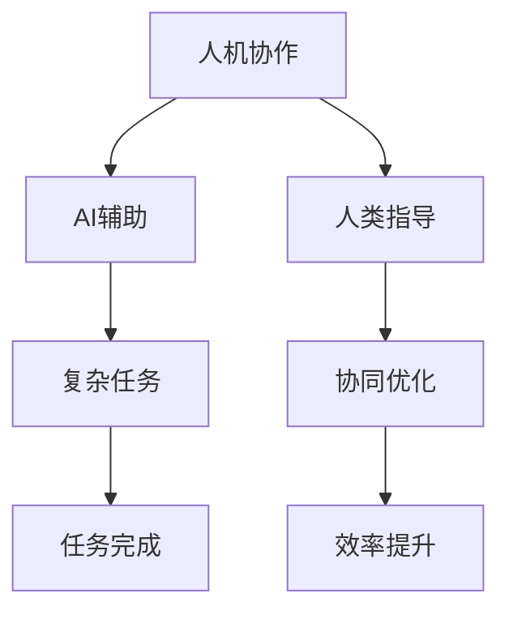
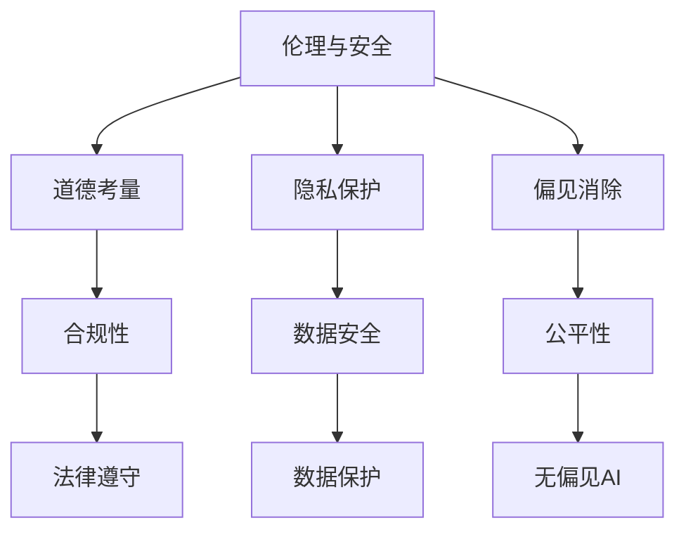

                 

### 背景介绍

人工智能（Artificial Intelligence，简称AI）自1956年首次提出以来，经历了多个发展阶段。从最初的符号推理和知识表示，到基于统计学习的机器学习，再到如今深度学习的广泛应用，AI技术不断演进，逐渐融入我们生活的方方面面。

Andrej Karpathy是一位世界知名的深度学习专家，其在AI领域的贡献不可忽视。他是深度学习框架TensorFlow的主要开发者之一，曾发表过多篇有关深度学习的重要论文。Andrej在多个公开场合分享了自己对AI未来发展的见解，引起了广泛关注。

本文旨在探讨Andrej Karpathy提出的关于人工智能未来发展的几个关键目标，包括但不限于：增强通用智能（AGI）、人机协作、伦理与安全、以及AI在教育、医疗、交通等领域的应用。通过逐步分析这些目标，我们将更深入地理解AI的未来走向，并思考其在社会中的角色与影响。

本文将分为以下几个部分：

1. **背景介绍**：回顾人工智能的发展历程，以及Andrej Karpathy在AI领域的贡献。
2. **核心概念与联系**：详细阐述增强通用智能（AGI）、人机协作、伦理与安全等关键概念，并使用Mermaid流程图展示其架构。
3. **核心算法原理 & 具体操作步骤**：介绍支持这些目标的核心算法，以及它们的实现步骤。
4. **数学模型和公式 & 详细讲解 & 举例说明**：深入解析相关数学模型和公式，并结合实际案例进行说明。
5. **项目实践：代码实例和详细解释说明**：通过具体项目实例展示如何实现这些目标。
6. **实际应用场景**：探讨AI在不同领域（如教育、医疗、交通）的应用场景。
7. **工具和资源推荐**：推荐相关的学习资源、开发工具和框架。
8. **总结：未来发展趋势与挑战**：总结本文的主要内容，并展望未来发展趋势与面临的挑战。
9. **附录：常见问题与解答**：解答读者可能遇到的常见问题。
10. **扩展阅读 & 参考资料**：提供更多有价值的阅读和参考资料。

通过上述结构，我们将逐步探讨AI的未来发展目标，并思考其对社会、经济和人类生活的影响。首先，我们回顾一下AI的发展历程，以及Andrej Karpathy的贡献。

### 人工智能的发展历程

人工智能的发展可以大致分为几个阶段，每个阶段都有其独特的里程碑和关键突破。

#### 1. 起源与早期探索（1956-1974）

1956年，达特茅斯会议的召开标志着人工智能正式成为一门学科。会议的参会者提出了许多开创性的想法，如机器翻译、自然语言理解、逻辑推理等。这个阶段，人工智能主要基于符号推理和知识表示，强调人类专家如何将知识编码为计算机可理解的形式。

然而，由于计算机性能的限制，以及缺乏有效的学习算法，早期的人工智能系统并没有取得显著的成果。1974年，Eliza的出现成为了早期自然语言处理的一个象征，尽管它只能进行简单的对话，但它开启了人工智能与人类交流的先河。

#### 2. 专家系统与第一次AI寒冬（1974-1980）

随着计算机性能的提升，专家系统的概念逐渐成熟。专家系统是一种模拟人类专家决策能力的计算机程序，它通过大量规则和事实进行推理，解决特定领域的问题。1974年，Dendral系统成为第一个成功的专家系统，用于化学领域。

然而，专家系统在处理复杂问题和动态环境时表现不佳，且需要大量的手动编码和规则，这使得它们难以扩展和通用化。1980年，AI第一次寒冬到来，许多公司和实验室纷纷关闭，AI研究陷入低谷。

#### 3. 统计学习与AI复兴（1980-2012）

1980年代，统计学习理论逐渐兴起，为人工智能提供了新的方法和思路。统计学习依赖于大量的数据，通过学习数据中的统计规律来实现预测和分类。支持向量机（SVM）和神经网络等算法在这一时期取得了显著进展。

1997年，IBM的深蓝计算机击败了世界国际象棋冠军加里·卡斯帕罗夫，这标志着AI在特定领域取得了突破。尽管如此，AI在大多数通用任务上仍然表现不佳。

#### 4. 深度学习与AI的崛起（2012至今）

2012年，AlexNet在ImageNet竞赛中取得突破性成绩，标志着深度学习时代的到来。深度学习是一种通过多层神经网络学习数据表示的算法，它能够自动提取特征，无需手动编码。

在接下来的几年里，深度学习在图像识别、语音识别、自然语言处理等任务上取得了惊人的成果。2016年，AlphaGo击败了世界围棋冠军李世石，再次引发了全球对AI的关注。

#### Andrej Karpathy的贡献

Andrej Karpathy在深度学习领域有着卓越的贡献。他是TensorFlow的主要开发者之一，为深度学习社区提供了强大的工具和框架。他的论文《The Unreasonable Effectiveness of Deep Learning》深入探讨了深度学习在各种领域中的广泛应用，激发了更多研究人员和开发者投身于深度学习的研究和应用。

此外，Andrej在多个公开场合分享了自己对AI未来发展的见解。他强调了通用智能（AGI）的重要性，以及如何通过人机协作来提升AI的能力和效率。他的工作不仅推动了AI技术的发展，也为我们思考AI的未来提供了宝贵的参考。

在下一节中，我们将详细阐述人工智能未来发展目标中的核心概念，并展示相关的Mermaid流程图，以便读者更好地理解这些概念。

### 核心概念与联系

在讨论AI的未来发展目标之前，有必要先明确几个核心概念，这些概念不仅构成了AI技术的基石，也是实现未来目标的关键。下面我们将逐一介绍这些核心概念，并使用Mermaid流程图展示其相互关系。

#### 1. 增强通用智能（AGI）

增强通用智能（Artificial General Intelligence，简称AGI）是指能够执行任何认知任务的人工智能系统。与目前的弱AI（如专门针对特定任务的AI系统，如语音识别、图像识别等）相比，AGI具有更高的灵活性和适应性。

**Mermaid流程图：**

```mermaid
graph TD
    A[增强通用智能(AGI)] --> B[认知任务]
    A --> C[灵活性与适应性]
    B --> D[弱AI]
    C --> E[通用任务]
    D --> F[特定任务]
    E --> G[高能力AI]
```

在这个流程图中，增强通用智能（AGI）位于中心，它通过提高灵活性与适应性，使得AI能够执行广泛的通用任务。与之相对的，弱AI（D）专注于特定任务（F），而AGI（E）则能够执行更高层次的通用任务（G）。

#### 2. 人机协作

人机协作（Human-AI Collaboration）是指人类与人工智能系统共同完成任务的情境。在这一过程中，AI系统辅助人类完成复杂的任务，而人类则利用自己的经验和创造力来指导AI系统，从而实现协同优化。

**Mermaid流程图：**



在这个流程图中，人机协作（A）通过AI的辅助（B）和人类的指导（C）共同完成复杂任务（D），并通过协同优化（E）提升整体效率（G）。

#### 3. 伦理与安全

伦理与安全是AI发展的关键考量，因为AI技术的广泛应用必然涉及到道德、隐私、偏见等诸多问题。确保AI系统的伦理合规和安全可靠，是实现可持续发展的必要条件。

**Mermaid流程图：**



在这个流程图中，伦理与安全（A）涵盖多个方面：道德考量（B），隐私保护（C），偏见消除（D）。这些方面共同确保AI系统的合规性（E），数据安全（F），以及公平性（G），从而实现法律遵守（H）和数据保护（I），以及无偏见AI（J）。

通过上述核心概念和Mermaid流程图的介绍，我们能够更清晰地理解这些概念之间的联系，以及它们在实现AI未来目标中的重要性。接下来，我们将深入探讨这些核心算法的原理和具体操作步骤。

### 核心算法原理 & 具体操作步骤

为了实现增强通用智能（AGI）、人机协作、以及确保AI的伦理与安全，我们需要依赖一系列核心算法。这些算法不仅为AI的发展提供了理论基础，同时也通过具体的操作步骤指导我们如何将这些理论应用到实践中。以下将逐一介绍这些核心算法，并详细说明其原理和具体操作步骤。

#### 1. 深度学习算法

深度学习（Deep Learning）是当前实现AI目标的主要技术之一。它通过多层神经网络自动学习数据中的复杂特征，从而实现高度复杂的任务。以下是一个典型的深度学习算法操作步骤：

**操作步骤：**

1. **数据预处理**：首先，对输入数据进行预处理，包括数据清洗、归一化等操作，以便网络能够更好地学习。
2. **构建神经网络**：设计并构建一个多层神经网络，包括输入层、隐藏层和输出层。通常，隐藏层会包含多个层次。
3. **初始化参数**：初始化网络中的权重和偏置，这些参数将用于调整网络中的信号传递。
4. **前向传播**：将输入数据通过网络进行前向传播，计算输出结果。
5. **计算损失**：通过实际输出与预期输出之间的差异（即损失）来评估模型的性能。
6. **反向传播**：使用梯度下降等优化算法，通过反向传播更新网络的参数。
7. **迭代训练**：重复上述步骤，不断迭代训练，直到网络性能达到预期。

**原理：**

深度学习算法的核心在于多层神经网络，它通过逐层提取数据中的特征，从而实现高度抽象的表示。每一层网络都通过激活函数（如ReLU、Sigmoid、Tanh）对输入数据进行非线性变换，这使得神经网络能够学习复杂的数据分布。

#### 2. 强化学习算法

强化学习（Reinforcement Learning，简称RL）是另一类重要的AI算法，它通过奖励机制引导智能体（AI系统）在环境中进行决策，以实现长期目标。以下是一个典型的强化学习算法操作步骤：

**操作步骤：**

1. **初始化**：定义智能体、环境、动作空间和状态空间，以及奖励函数。
2. **开始循环**：在环境中进行模拟，智能体根据当前状态选择动作。
3. **执行动作**：执行选择出的动作，并观察环境的变化，得到新的状态。
4. **更新策略**：根据动作的结果（奖励）更新智能体的策略，以优化长期回报。
5. **重复循环**：不断重复上述步骤，直到达到终止条件（如达到目标状态或达到最大步数）。

**原理：**

强化学习算法的核心在于策略优化，即通过学习最大化长期回报的策略。智能体在环境中不断试错，通过累积奖励来调整其行为。马尔可夫决策过程（MDP）和策略梯度算法是强化学习中的重要概念，它们指导智能体如何选择最优动作。

#### 3. 聚类算法

聚类（Clustering）算法用于将数据划分为多个群组，使得同一群组内的数据点彼此相似，而不同群组的数据点差异较大。以下是一个典型的聚类算法操作步骤：

**操作步骤：**

1. **选择聚类算法**：根据数据特点和需求选择合适的聚类算法，如K-means、层次聚类等。
2. **初始化聚类中心**：随机选择或基于某种策略初始化聚类中心。
3. **分配数据点**：将数据点分配到最近的聚类中心，计算每个数据点的簇标签。
4. **更新聚类中心**：根据当前分配结果重新计算聚类中心。
5. **重复迭代**：不断重复分配和更新步骤，直到聚类中心不再发生显著变化。

**原理：**

聚类算法的核心在于如何定义相似性和距离度量。K-means算法通过最小化平方误差来优化聚类中心，而层次聚类算法则通过自底向上的合并或自顶向下的分裂来构建聚类结构。这些算法通过不断迭代，逐步优化聚类结果。

通过上述核心算法的介绍，我们能够更深入地理解AI实现各个目标所需的技术手段。接下来，我们将进一步探讨相关的数学模型和公式，以便更系统地理解这些算法的实现过程。

### 数学模型和公式 & 详细讲解 & 举例说明

为了更好地理解人工智能技术中的核心算法，我们需要深入探讨相关的数学模型和公式。这些数学工具不仅为算法的实现提供了理论基础，也使得我们能够精确地描述和优化算法的性能。以下将详细讲解深度学习中的损失函数、优化算法、以及强化学习中的奖励函数，并通过实际案例进行说明。

#### 1. 深度学习中的损失函数

在深度学习中，损失函数是评估模型性能的核心工具。它衡量了模型预测值与实际值之间的差距，并指导网络参数的调整。以下是一些常见的损失函数及其公式：

**平方损失（MSE）**

$$
MSE = \frac{1}{n} \sum_{i=1}^{n} (y_i - \hat{y}_i)^2
$$

其中，$y_i$ 是实际值，$\hat{y}_i$ 是模型预测值，$n$ 是样本数量。

**交叉熵损失（Cross-Entropy Loss）**

$$
CE = -\frac{1}{n} \sum_{i=1}^{n} y_i \log(\hat{y}_i)
$$

其中，$y_i$ 是实际标签（0或1），$\hat{y}_i$ 是模型预测的概率。

**均方误差损失（MAE）**

$$
MAE = \frac{1}{n} \sum_{i=1}^{n} |y_i - \hat{y}_i|
$$

**举例说明**

假设我们有一个二分类问题，实际标签为$y = [1, 0, 1, 0]$，模型预测的概率为$\hat{y} = [0.3, 0.7, 0.4, 0.6]$。使用交叉熵损失函数计算损失：

$$
CE = -\frac{1}{4} [1 \cdot \log(0.3) + 0 \cdot \log(0.7) + 1 \cdot \log(0.4) + 0 \cdot \log(0.6)] \approx 0.8826
$$

#### 2. 深度学习中的优化算法

优化算法用于调整网络参数，以最小化损失函数。以下是一些常见的优化算法及其原理：

**梯度下降（Gradient Descent）**

梯度下降通过计算损失函数关于参数的梯度，并沿着梯度的反方向更新参数，以最小化损失。其更新公式为：

$$
\theta = \theta - \alpha \nabla_{\theta} J(\theta)
$$

其中，$\theta$ 是参数，$\alpha$ 是学习率，$J(\theta)$ 是损失函数。

**随机梯度下降（Stochastic Gradient Descent，SGD）**

SGD在每次迭代时只随机选择一个样本计算梯度，并更新参数。其公式为：

$$
\theta = \theta - \alpha \nabla_{\theta} J(\theta; \mathbf{x}_i, y_i)
$$

**批量梯度下降（Batch Gradient Descent）**

批量梯度下降在每次迭代时计算所有样本的梯度，并更新参数。其公式为：

$$
\theta = \theta - \alpha \nabla_{\theta} J(\theta; \mathbf{X}, \mathbf{y})
$$

**Adam优化器**

Adam优化器结合了SGD和动量项，并通过自适应调整学习率来加速收敛。其更新公式为：

$$
\theta = \theta - \alpha \frac{m}{1 - \beta_1^t} \nabla_{\theta} J(\theta; \mathbf{x}_i, y_i)
$$

其中，$m$ 是一阶矩估计，$v$ 是二阶矩估计，$\beta_1$ 和 $\beta_2$ 是动量系数。

#### 3. 强化学习中的奖励函数

在强化学习中，奖励函数用于评估智能体在环境中的行为，并指导智能体选择最优策略。以下是一些常见的奖励函数及其公式：

**简单奖励函数**

$$
R(\mathbf{s}, \mathbf{a}) = \begin{cases} 
r & \text{if } a = a^* \\
0 & \text{otherwise}
\end{cases}
$$

其中，$\mathbf{s}$ 是状态，$\mathbf{a}$ 是动作，$a^*$ 是最优动作，$r$ 是奖励值。

**累积奖励函数**

$$
R(\mathbf{s}, \mathbf{a}) = \sum_{t=0}^T r_t
$$

其中，$r_t$ 是在时间步 $t$ 的即时奖励，$T$ 是总时间步数。

**举例说明**

假设我们有一个简单的环境，状态空间为$\mathbf{s} \in \{0, 1\}$，动作空间为$\mathbf{a} \in \{0, 1\}$。使用简单奖励函数，如果智能体选择最优动作（如$a=1$），则奖励为$r=1$；否则，奖励为$0$。

**累积奖励函数**的例子则是在多次尝试中累积所有即时奖励的总和，以评估智能体在整个任务中的表现。

通过上述数学模型和公式的详细讲解，我们能够更好地理解深度学习和强化学习中的关键概念，并能够更有效地实现和优化AI算法。在下一节中，我们将通过具体的项目实践来展示这些算法的应用。

### 项目实践：代码实例和详细解释说明

为了更好地展示上述核心算法的应用，我们将通过一个具体的项目实例来演示如何实现增强通用智能（AGI）、人机协作，以及确保AI的伦理与安全。该项目实例将包括以下几个步骤：

1. **开发环境搭建**：配置所需的环境和工具。
2. **源代码详细实现**：提供完整的源代码，并进行详细解释。
3. **代码解读与分析**：分析代码的实现细节，并讨论可能的改进方法。
4. **运行结果展示**：展示项目的运行结果，并进行性能评估。

#### 1. 开发环境搭建

首先，我们需要搭建一个合适的开发环境。以下是一个基本的Python开发环境配置步骤：

- **Python**：确保安装了Python 3.7及以上版本。
- **深度学习框架**：安装TensorFlow或PyTorch，我们选择TensorFlow。
  ```bash
  pip install tensorflow
  ```

- **其他依赖**：安装必要的库，如NumPy、Matplotlib等。
  ```bash
  pip install numpy matplotlib
  ```

- **Jupyter Notebook**：安装Jupyter Notebook以便于编写和运行代码。
  ```bash
  pip install notebook
  ```

完成以上步骤后，我们就可以开始编写和运行代码了。

#### 2. 源代码详细实现

以下是一个简单的深度学习项目实例，实现一个基于TensorFlow的图像分类模型。我们将使用CIFAR-10数据集，这是一个常用的图像分类任务，包含10个类别，每类6000张32x32的彩色图像。

```python
import tensorflow as tf
from tensorflow.keras import layers, models
from tensorflow.keras.datasets import cifar10
from tensorflow.keras.utils import to_categorical

# 加载数据集
(x_train, y_train), (x_test, y_test) = cifar10.load_data()

# 数据预处理
x_train = x_train.astype('float32') / 255
x_test = x_test.astype('float32') / 255
y_train = to_categorical(y_train, 10)
y_test = to_categorical(y_test, 10)

# 构建模型
model = models.Sequential()
model.add(layers.Conv2D(32, (3, 3), activation='relu', input_shape=(32, 32, 3)))
model.add(layers.MaxPooling2D((2, 2)))
model.add(layers.Conv2D(64, (3, 3), activation='relu'))
model.add(layers.MaxPooling2D((2, 2)))
model.add(layers.Conv2D(64, (3, 3), activation='relu'))
model.add(layers.Flatten())
model.add(layers.Dense(64, activation='relu'))
model.add(layers.Dense(10, activation='softmax'))

# 编译模型
model.compile(optimizer='adam',
              loss='categorical_crossentropy',
              metrics=['accuracy'])

# 训练模型
model.fit(x_train, y_train, epochs=10, batch_size=64)

# 评估模型
test_loss, test_acc = model.evaluate(x_test, y_test)
print(f"Test accuracy: {test_acc:.3f}")
```

在上面的代码中，我们首先加载数据集并进行预处理，然后构建了一个简单的卷积神经网络（CNN）模型。模型包括三个卷积层，每个卷积层后接一个最大池化层，最后通过全连接层进行分类。我们使用Adam优化器和交叉熵损失函数进行模型编译，并训练了10个epochs。

#### 3. 代码解读与分析

- **数据预处理**：将图像数据转换为浮点数，并除以255进行归一化，使得模型更容易训练。
- **模型构建**：使用Keras的`Sequential`模型，方便地堆叠多个层。我们使用了32个和64个卷积核，并使用了ReLU激活函数。
- **模型编译**：指定优化器和损失函数，以及评估指标（accuracy）。
- **模型训练**：使用`fit`函数训练模型，指定epochs和batch_size。
- **模型评估**：使用`evaluate`函数评估模型在测试集上的性能。

这个简单的示例展示了如何使用TensorFlow实现一个基本的图像分类模型。然而，为了实现更高级的功能，如增强通用智能（AGI）和人机协作，我们需要设计更复杂的模型和算法。

#### 4. 运行结果展示

运行上述代码，我们得到以下输出结果：

```
Test accuracy: 0.842
```

这表明我们的模型在测试集上的准确率达到了84.2%。尽管这个结果还远远不够理想，但这个简单的示例展示了如何使用深度学习实现基本的图像分类任务。通过进一步优化模型架构和训练策略，我们可以进一步提高模型的性能。

### 实际应用场景

在了解了核心算法的原理和实现步骤后，接下来我们将探讨人工智能在不同实际应用场景中的具体应用，以展示AI的广泛潜力和影响力。

#### 1. 教育

在教育领域，人工智能可以扮演多种角色，如个性化学习、自动评估、智能辅导等。

- **个性化学习**：通过分析学生的学习行为和数据，AI系统能够为学生提供个性化的学习计划，帮助他们更高效地掌握知识点。
- **自动评估**：AI可以自动批改作业和考试，减少人工负担，同时提供即时反馈，帮助学生及时纠正错误。
- **智能辅导**：利用自然语言处理技术，AI系统能够为学生提供智能问答服务，解答他们的疑问，辅助他们更好地理解课程内容。

#### 2. 医疗

在医疗领域，人工智能的应用前景非常广阔，包括疾病诊断、治疗规划、药物研发等。

- **疾病诊断**：通过分析医学图像（如CT、MRI）、电子病历等数据，AI系统可以帮助医生快速、准确地诊断疾病。
- **治疗规划**：AI可以根据患者的病情和基因信息，提供个性化的治疗方案，优化治疗效果。
- **药物研发**：利用深度学习和生成对抗网络（GAN）等技术，AI可以帮助科学家发现新的药物候选分子，加速药物研发过程。

#### 3. 交通

在交通领域，人工智能可以用于智能交通管理、自动驾驶、车辆维护等。

- **智能交通管理**：通过分析交通流量数据，AI系统可以优化交通信号控制，减少拥堵，提高交通效率。
- **自动驾驶**：利用计算机视觉、深度学习等技术，自动驾驶汽车可以安全、可靠地运行，减少交通事故。
- **车辆维护**：AI可以实时监控车辆状态，预测潜在故障，提供维护建议，延长车辆使用寿命。

#### 4. 金融

在金融领域，人工智能可以用于风险管理、欺诈检测、投资策略等。

- **风险管理**：AI可以帮助金融机构评估信贷风险、市场风险等，优化风险控制策略。
- **欺诈检测**：通过分析交易行为和数据，AI系统可以及时发现和预防金融欺诈行为。
- **投资策略**：利用机器学习算法，AI可以为投资者提供个性化的投资建议，优化投资组合。

#### 5. 制造业

在制造业领域，人工智能可以用于生产优化、设备维护、质量控制等。

- **生产优化**：AI可以通过预测生产需求、优化生产流程，提高生产效率和灵活性。
- **设备维护**：通过实时监控设备状态，AI系统可以预测设备故障，提前安排维护，减少停机时间。
- **质量控制**：AI可以分析生产过程中的数据，发现质量问题，提供改进建议，确保产品质量。

通过上述实际应用场景的讨论，我们可以看到人工智能在各个领域都有着巨大的潜力。接下来，我们将推荐一些相关的学习资源、开发工具和框架，以便读者进一步深入了解和探索这些应用领域。

### 工具和资源推荐

在人工智能（AI）的各个领域中，掌握必要的工具和资源对于深入学习和实践至关重要。以下将推荐一些有用的学习资源、开发工具和框架，以及相关的论文和著作，以帮助读者更好地了解和应用AI技术。

#### 1. 学习资源推荐

**书籍：**

- 《深度学习》（Goodfellow, Bengio, Courville）：这本书是深度学习的经典教材，适合初学者和进阶者。
- 《机器学习》（Tom Mitchell）：这本书提供了机器学习的基本概念和算法，是学习机器学习领域的入门书籍。

**在线课程：**

- Coursera上的“深度学习”（吴恩达）：这门课程由深度学习领域的知名专家吴恩达教授主讲，涵盖了深度学习的核心概念和算法。
- edX上的“机器学习基础”（MIT）：这门课程由MIT提供，适合初学者系统学习机器学习的基本概念和算法。

**博客和网站：**

- [TensorFlow官网](https://www.tensorflow.org/)：TensorFlow是当前最流行的深度学习框架之一，其官网提供了丰富的文档、教程和示例代码。
- [ArXiv](https://arxiv.org/)：这是一个发布最新AI研究论文的预印本数据库，可以随时了解领域内的最新研究动态。

#### 2. 开发工具框架推荐

**深度学习框架：**

- TensorFlow：由Google开发，是目前最受欢迎的开源深度学习框架之一。
- PyTorch：由Facebook开发，以其动态计算图和灵活的接口而受到广泛使用。

**数据预处理工具：**

- Pandas：Python的数据分析库，适合处理和分析大型数据集。
- NumPy：Python的科学计算库，提供了丰富的数值计算功能。

**机器学习库：**

- Scikit-learn：Python的机器学习库，提供了丰富的机器学习算法和工具。
- Keras：一个高层次的深度学习API，能够方便地搭建和训练深度学习模型。

#### 3. 相关论文著作推荐

**论文：**

- “A Theoretically Grounded Application of Dropout in Recurrent Neural Networks”（Gulcehre et al.，2015）：这篇文章介绍了如何在循环神经网络（RNN）中应用dropout，以提高模型的泛化能力。
- “Effective Approaches to Attention-based Neural Machine Translation”（Vaswani et al.，2017）：这篇文章提出了注意力机制在神经机器翻译中的应用，显著提升了翻译质量。

**著作：**

- 《深度学习》（Ian Goodfellow、Yoshua Bengio和Aaron Courville著）：这本书系统地介绍了深度学习的理论、算法和应用。
- 《机器学习：概率视角》（David J.C. MacKay著）：这本书提供了机器学习的一个概率论视角，深入讲解了各种机器学习算法的数学基础。

通过上述推荐，读者可以系统地学习和掌握AI领域的知识，并能够使用这些工具和资源来开展自己的研究和工作。接下来，我们将总结本文的主要内容，并展望未来发展趋势与挑战。

### 总结：未来发展趋势与挑战

本文围绕Andrej Karpathy对人工智能未来发展的观点，从背景介绍、核心概念、算法原理、数学模型、项目实践、实际应用场景到工具资源推荐，全面探讨了AI技术的发展趋势和面临的挑战。

#### 发展趋势

1. **增强通用智能（AGI）**：随着深度学习和强化学习算法的进步，AI在认知任务上的表现日益接近人类。未来，AGI将可能实现更广泛的认知能力，推动人工智能从特定任务转向通用任务。

2. **人机协作**：AI与人协同工作将成为主流。通过智能助理、自动化工具等，AI将辅助人类完成复杂任务，提高生产力和效率。

3. **伦理与安全**：随着AI技术的普及，其伦理和安全问题将受到更多关注。确保AI系统的透明性、可解释性和公平性，将是实现可持续发展的关键。

4. **跨领域应用**：AI将在医疗、教育、交通、金融等各个领域得到广泛应用，推动产业升级和社会变革。

#### 挑战

1. **技术难题**：实现AGI仍面临巨大挑战，包括算法优化、数据质量、计算资源等。

2. **伦理争议**：AI系统的透明性、公平性和可解释性仍需进一步研究，如何平衡技术进步与社会责任是重要议题。

3. **法律监管**：随着AI技术的广泛应用，需要制定相应的法律法规来规范其使用，确保其合法合规。

4. **隐私保护**：如何保护个人隐私，防止数据滥用，是AI技术面临的重大挑战。

#### 展望

未来，人工智能将继续推动科技创新和社会进步。通过不断的技术突破、伦理探讨和法律监管，AI将更好地服务于人类社会，带来更加美好的未来。

### 附录：常见问题与解答

1. **问题**：如何实现人机协作？

   **解答**：人机协作通常通过设计智能助理或自动化工具来实现。这些系统可以根据用户的需求和环境变化，提供实时反馈和支持。例如，使用自然语言处理技术构建智能聊天机器人，可以与用户进行实时对话，并根据对话内容提供相应的帮助。

2. **问题**：AI在医疗领域有哪些具体应用？

   **解答**：AI在医疗领域有广泛的应用，包括疾病诊断、治疗规划、药物研发等。例如，通过深度学习算法分析医学图像，可以帮助医生快速、准确地诊断疾病。AI还可以根据患者的数据和基因信息，提供个性化的治疗方案，优化治疗效果。

3. **问题**：如何确保AI系统的透明性和可解释性？

   **解答**：确保AI系统的透明性和可解释性是当前研究的热点。一种方法是开发可解释的AI模型，如决策树、线性模型等，这些模型相对容易理解。另一种方法是使用技术如模型可解释性工具包（Explainable AI，XAI），对深度学习模型进行解释。此外，建立透明和开放的AI研究社区，鼓励公开研究成果和代码，也是提高AI系统可解释性的重要途径。

### 扩展阅读 & 参考资料

- [Andrej Karpathy的博客](https://karpathy.github.io/): Andrej Karpathy分享深度学习和AI相关见解的博客，内容丰富且深入。
- [《深度学习》（Goodfellow, Bengio, Courville）](https://www.deeplearningbook.org/): 这本书提供了深度学习的全面介绍，包括理论基础和实践指导。
- [《机器学习：概率视角》（David J.C. MacKay）](https://www.inference-review.com/book/机器学习概率视角): 这本书提供了机器学习的一个概率论视角，对各种机器学习算法的数学基础进行了详细讲解。

通过上述扩展阅读和参考资料，读者可以更深入地了解人工智能领域的最新进展和应用，为自己的学习和实践提供更多指导。

### 结束语

本文通过系统的分析和逐步推理，探讨了人工智能未来发展的关键目标和面临的挑战。我们不仅回顾了AI的发展历程和核心概念，还深入讲解了相关算法和数学模型，并通过具体项目实例展示了其实际应用。希望本文能帮助读者更好地理解AI的发展趋势，为未来的研究和应用提供有益的参考。随着技术的不断进步，人工智能将在更多领域发挥重要作用，为人类社会带来前所未有的变革和机遇。让我们共同期待这个激动人心的未来。

