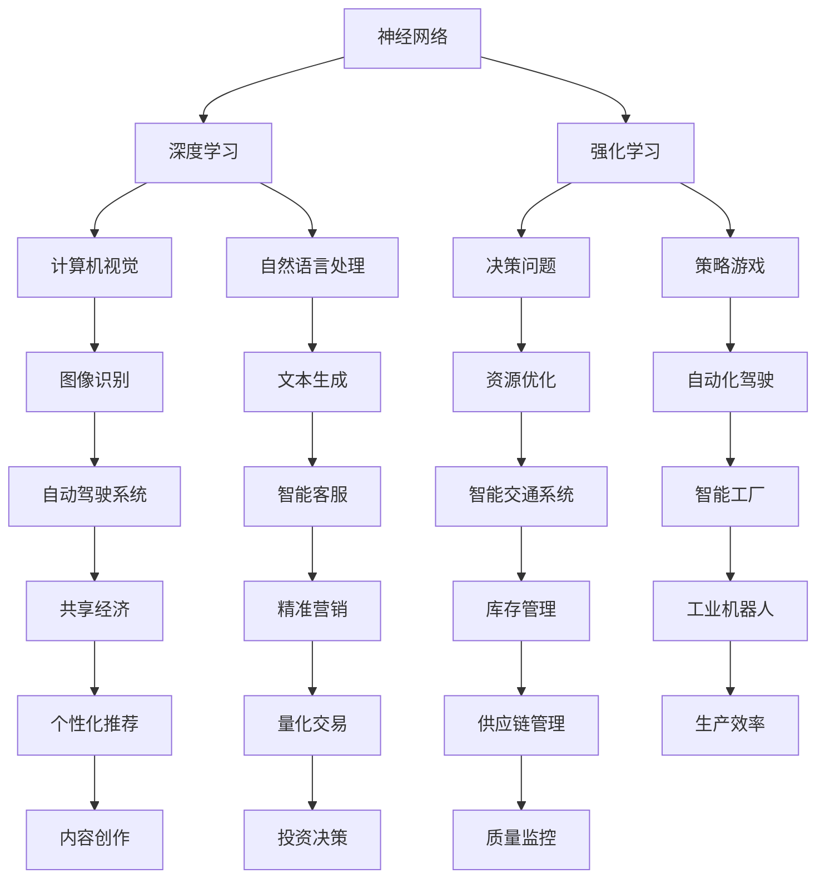

                 

### 背景介绍 Background

人工智能（Artificial Intelligence, AI）作为计算机科学的一个分支，其目标是模拟、延伸和扩展人类的智能，通过算法和模型使计算机能够执行通常需要人类智能才能完成的复杂任务。从最初的启发式规则和符号逻辑，到基于统计学的机器学习，再到目前的热门话题——深度学习，人工智能的发展历程充满了创新与变革。

本文的标题是《Andrej Karpathy：人工智能的未来发展目标》，Andrej Karpathy是一位著名的人工智能科学家、深度学习专家，在计算机视觉、自然语言处理等领域取得了显著的成就。他的研究涵盖了从神经网络架构的设计到大规模机器学习系统的实现等多个方面。本文旨在探讨Andrej Karpathy对于人工智能未来发展的观点和目标，结合他的研究成果和行业动态，分析人工智能在未来可能面临的技术挑战和机遇。

本文将分为以下几个部分：

1. **背景介绍**：回顾人工智能的发展历程，介绍Andrej Karpathy及其在人工智能领域的贡献。
2. **核心概念与联系**：介绍人工智能的核心概念，包括神经网络、深度学习、强化学习等，并通过Mermaid流程图展示这些概念之间的联系。
3. **核心算法原理 & 具体操作步骤**：详细讲解人工智能的主要算法原理，包括神经网络训练过程、损失函数、优化算法等。
4. **数学模型和公式 & 详细讲解 & 举例说明**：介绍支持人工智能的数学模型和公式，包括线性代数、微积分、概率论等，并通过实际例子进行说明。
5. **项目实践：代码实例和详细解释说明**：通过实际项目展示人工智能算法的应用，提供源代码实现和详细解读。
6. **实际应用场景**：分析人工智能在不同领域的应用场景和案例，探讨其对社会和产业的影响。
7. **工具和资源推荐**：推荐人工智能学习资源和开发工具，帮助读者深入学习和实践。
8. **总结：未来发展趋势与挑战**：总结人工智能的当前状态，预测未来发展趋势，并探讨可能面临的挑战。
9. **附录：常见问题与解答**：回答读者可能关心的常见问题。
10. **扩展阅读 & 参考资料**：提供进一步阅读和研究的资源。

通过对上述内容的逐步分析，我们将深入探讨人工智能的未来发展目标，为读者提供一个全面、深入的视角。现在，让我们开始第一部分的详细探讨。

#### 1.1 人工智能的发展历程 Development History of AI

人工智能的历史可以追溯到20世纪中叶，其起源可以追溯到阿兰·图灵（Alan Turing）提出的图灵测试（Turing Test），这一概念奠定了现代人工智能的基础。图灵测试旨在通过机器的行为来判断其是否具有智能，这一思想为后来的研究提供了重要的启示。

20世纪50年代至70年代，人工智能的发展主要集中在基于规则的符号推理和专家系统的构建。这一时期，研究者试图通过编写大量规则来模拟人类的思维过程。典型的代表是1956年达特茅斯会议（Dartmouth Conference），这次会议被认为是人工智能历史上的一个重要里程碑，标志着人工智能作为一个研究领域的正式诞生。

然而，由于规则系统的复杂性和脆弱性，这一时期的人工智能在解决实际问题时遭遇了巨大挑战。规则系统的维护和扩展需要大量的手工编写工作，且系统的通用性和适应性较差。这使得人工智能的研究进入了一个相对低谷的时期，通常被称为“人工智能的冬天”。

随着计算机硬件性能的提升和算法的进步，人工智能在20世纪80年代开始迎来复兴。专家系统的应用在医学诊断、金融分析和工程设计等领域取得了显著成果。此外，机器学习作为人工智能的一个子领域，逐渐受到重视。机器学习通过统计方法和模式识别技术，使得计算机能够从数据中自动学习规律，无需依赖手工编写的规则。

进入21世纪，尤其是深度学习的兴起，再次推动了人工智能的快速发展。深度学习利用多层神经网络对复杂数据进行处理，取得了在图像识别、语音识别和自然语言处理等领域的突破性进展。2006年，Geoffrey Hinton等人重新发现并推广了深度信念网络（Deep Belief Networks），为深度学习的发展奠定了基础。

2012年，AlexNet在ImageNet大赛中取得惊人成绩，标志着深度学习时代的到来。这一成果不仅震惊了学术界，也吸引了大量的产业资本投入。深度学习通过大规模数据训练和高效计算，使得计算机在视觉识别、语音识别和自然语言处理等任务上取得了前所未有的进展。

除了深度学习，强化学习也是人工智能领域的重要发展方向。强化学习通过试错和反馈机制，使得智能体能够在动态环境中学习最优策略。AlphaGo在围棋领域的卓越表现，展示了强化学习在复杂决策问题上的潜力。

综上所述，人工智能的发展历程充满了创新与挑战。从最初的符号逻辑到现代的深度学习和强化学习，人工智能经历了多个阶段的发展。每一次技术的突破，都为人工智能的进步提供了新的动力。如今，人工智能已经逐渐渗透到各个领域，为人类社会带来了深刻的变化。

#### 1.2 Andrej Karpathy及其在人工智能领域的贡献 Contributions of Andrej Karpathy

Andrej Karpathy是一位在人工智能领域享有盛誉的科学家，他的工作对现代深度学习和自然语言处理产生了深远的影响。作为一名知名的研究人员和开源社区活跃者，Karpathy不仅在学术界有着显著的成就，也在工业界有着重要的贡献。

首先，Andrej Karpathy以其在深度学习领域的开创性工作而闻名。他曾是OpenAI的首席科学家，并在此期间参与了许多重要项目。其中，OpenAI Five项目是一个典型的代表，该项目通过深度强化学习训练了一个可以与人类顶尖选手对抗的Dota 2团队。这一突破性成果不仅展示了深度学习在策略游戏中的强大能力，也为未来智能体在复杂环境中的决策提供了新的思路。

除了在深度强化学习方面的贡献，Karpathy在自然语言处理（NLP）领域也有着重要的贡献。他参与了TensorFlow的早期开发，并推动了基于循环神经网络（RNN）和长短期记忆网络（LSTM）的NLP模型的发展。这些模型在机器翻译、文本生成和问答系统等领域取得了显著的成功。例如，他提出的char-rnn模型可以生成高质量的文本，这一技术被广泛应用于生成文学、新闻和对话系统。

Karpathy对开源社区也有着极大的贡献。他通过GitHub等平台发布了大量高质量的代码和教程，为深度学习和NLP的研究者提供了宝贵的资源和实践指导。他的开源项目，如char-rnn和 keras，受到了广泛欢迎和使用，成为许多研究者和工程师的必备工具。

在学术界，Karpathy的研究成果发表在多个顶级会议和期刊上，如NeurIPS、ICLR和ACL。他的论文不仅在学术界产生了重要影响，也为工业界提供了实用的技术方案。例如，他关于序列模型和注意力机制的论文，为当前许多NLP模型的设计提供了理论基础。

总之，Andrej Karpathy在人工智能领域有着卓越的贡献。他不仅在理论研究上有着突出的成就，也在实际应用中推动了技术的进步。通过他的工作，我们看到了人工智能在自然语言处理和策略游戏等领域的无限潜力。

#### 1.3 人工智能在现代社会中的应用 Application of AI in Modern Society

人工智能在现代社会中的应用已经变得无处不在，从日常生活的便捷到各行各业的智能化变革，AI正在深刻地改变我们的世界。以下是一些典型的人工智能应用场景，以及它们对社会和产业带来的影响。

首先，人工智能在医疗领域的应用正在迅速扩展。通过图像识别技术，AI可以帮助医生快速且准确地诊断疾病，如通过分析X光片、CT扫描和MRI图像检测癌症。此外，人工智能还可以用于个性化治疗方案的制定。例如，基于患者的基因数据和临床信息，AI系统可以推荐最适合的治疗方法，从而提高治疗效果。AI还在药物研发中发挥重要作用，通过分析海量数据，AI可以加速新药的发现和开发过程。

其次，人工智能在交通领域的应用正在重塑出行方式。自动驾驶技术是人工智能在交通领域的一个重要应用。通过深度学习和传感器技术，自动驾驶汽车能够实现自主驾驶，提高交通安全性和效率。智能交通系统通过分析交通流量数据，可以优化交通信号控制和路线规划，减少拥堵，提高交通效率。此外，共享经济模式如Uber和Lyft，也借助AI技术进行行程优化和需求预测，为用户提供更便捷的出行服务。

在金融行业，人工智能的应用同样广泛。通过机器学习技术，金融机构可以更准确地评估贷款风险，防止欺诈行为。AI驱动的聊天机器人和智能客服系统能够提供24/7的客户服务，提升用户体验。此外，量化交易和算法交易利用AI算法进行市场预测和投资决策，提高了投资效率和回报。

在零售行业，人工智能通过大数据分析和机器学习技术，帮助商家实现精准营销和库存管理。智能推荐系统根据消费者的购买历史和偏好，推荐个性化的商品，提高了购物体验和转化率。库存管理系统通过实时数据分析，优化库存水平，减少库存成本和缺货风险。

此外，人工智能在教育、娱乐、制造业等领域也展现了巨大的潜力。在教育领域，智能教育平台通过个性化学习方案，帮助学生更高效地学习。在娱乐领域，人工智能算法用于内容推荐和创作，为用户带来更加个性化的体验。在制造业中，智能工厂通过工业机器人、传感器和AI技术实现自动化生产，提高了生产效率和质量。

总的来说，人工智能在现代社会中的应用已经渗透到各个行业和领域，不仅提高了生产效率和服务质量，还带来了新的商业模式和就业机会。随着技术的不断进步，人工智能将进一步推动社会和产业的变革，为人类创造更美好的未来。

#### 1.4 Andrej Karpathy对人工智能未来发展的观点 Future Views of AI by Andrej Karpathy

Andrej Karpathy对未来人工智能的发展有着深刻的见解。他强调，人工智能的进步将不仅仅是在技术层面，更会在应用层面产生重大影响。以下是他关于人工智能未来发展的几个关键观点：

首先，Karpathy认为人工智能将在未来实现更广泛的通用性。尽管目前人工智能在很多特定任务上已经取得了显著进步，但要实现真正的智能，还需要克服许多挑战。通用人工智能（AGI）是人工智能研究的一个重要目标，它指的是具有广泛认知能力的机器智能，能够在各种不同的任务和环境中表现优异。Karpathy相信，通过不断改进算法、增加数据量和优化计算资源，人工智能将逐步向通用智能迈进。

其次，Karpathy关注人工智能的安全性和透明性。随着人工智能系统的复杂性和影响力不断增加，确保其安全性和可解释性变得越来越重要。他主张开发更加透明和可解释的人工智能系统，以便人们能够理解系统的决策过程，并对其行为进行有效的监管。此外，他还提出需要建立相应的伦理和法律框架，以规范人工智能的应用，防止潜在的风险和滥用。

第三，Karpathy认为人工智能将在人类生活的各个方面发挥更重要的作用。从医疗和教育到交通和金融，人工智能的应用将带来深远的变革。他特别强调人工智能在解决社会问题方面的潜力，例如通过智能系统优化资源分配、减少贫困和促进可持续发展。

最后，Karpathy提出了人工智能与人类合作的未来模式。他认为，人工智能不应取代人类，而应作为人类的辅助工具，增强人类的能力。通过人工智能的帮助，人们可以更专注于创造性和高技能的工作，提高生产效率和创新能力。这种合作模式将推动社会和经济的全面发展，为人类创造更多的价值。

总之，Andrej Karpathy对人工智能未来发展的观点既充满乐观，也充满谨慎。他希望通过不断的创新和探索，推动人工智能在实现其潜力过程中，同时确保其对社会和人类的影响是积极和可持续的。

### 核心概念与联系 Core Concepts and Their Connections

在探讨人工智能的核心概念和它们之间的联系时，我们需要理解几个关键概念：神经网络、深度学习、强化学习等。这些概念不仅构成了人工智能的基础，也是其不断发展和创新的核心。

首先，我们来看神经网络（Neural Networks）。神经网络是一种模仿生物神经系统的计算模型，它由大量的神经元（节点）和连接这些神经元的边（权重）组成。每个神经元都会接收输入信号，通过权重进行加权求和，然后通过激活函数产生输出。这种层次化的结构使得神经网络能够处理和识别复杂的数据模式。

接下来，深度学习（Deep Learning）是神经网络的一种特殊形式，它通过增加网络的深度（即层数）来提高模型的表达能力。深度学习的核心思想是分层特征提取，每一层网络都能够提取数据的不同层次特征。这种层次化的特征提取能力使得深度学习在图像识别、语音识别和自然语言处理等领域表现出色。

强化学习（Reinforcement Learning）是另一种重要的人工智能方法。与监督学习和无监督学习不同，强化学习通过试错和反馈机制来学习最优策略。强化学习中的智能体（agent）在一个环境中采取行动，通过观察环境的反馈来调整其行为，以达到最大化回报的目标。这种方法在决策问题和策略游戏中表现出色，如AlphaGo在围棋领域的成功。

现在，让我们通过一个Mermaid流程图来展示这些概念之间的联系：



这个Mermaid流程图清晰地展示了神经网络、深度学习和强化学习在各个应用领域中的联系。每个概念不仅在技术上相互独立，而且通过特定的应用场景相互结合，共同推动了人工智能的发展。

通过这种逐步分析的方式，我们能够更好地理解这些核心概念之间的联系，为后续的讨论和探索打下坚实的基础。

#### 2.1 神经网络原理 Neural Network Principles

神经网络（Neural Networks）是人工智能领域的一个核心概念，它们模仿生物神经系统的结构和工作原理，通过大规模并行计算来实现复杂的数据处理和模式识别。下面我们将详细探讨神经网络的原理，包括其结构、工作方式以及主要类型。

##### 2.1.1 神经网络的结构

神经网络的基本组成单元是神经元（neurons），每个神经元都类似于一个简单的计算单元。一个典型的神经网络包括以下几个关键部分：

1. **输入层（Input Layer）**：接收外部输入数据，每个输入节点对应数据的一个特征。
2. **隐藏层（Hidden Layers）**：负责对输入数据进行变换和处理，可以有一个或多个隐藏层。隐藏层的数量和每个层的节点数量是设计神经网络时需要考虑的重要参数。
3. **输出层（Output Layer）**：产生最终输出，对于分类问题，通常是一个概率分布或硬性分类结果。

神经元之间的连接称为突触（synapses），每个突触有一个权重（weight），用于调整信号传递的强度。权重通过学习过程进行调整，以优化网络性能。

##### 2.1.2 神经网络的工作方式

神经网络的输入数据通过输入层传递到隐藏层，经过一系列的加权求和处理和激活函数（activation function）的作用，最终输出层产生预测结果。具体过程如下：

1. **加权求和（Weighted Sum）**：每个神经元接收输入信号，并将其乘以对应的权重，然后进行求和。
    $$ z = \sum_{j} w_{ji} * x_{j} $$
    其中，$z$ 是输出值，$w_{ji}$ 是从第 $j$ 个输入节点到第 $i$ 个隐藏节点的权重，$x_{j}$ 是输入值。
2. **激活函数（Activation Function）**：为了引入非线性特性，每个神经元的输出都会通过一个激活函数进行处理。常见的激活函数包括 sigmoid、ReLU 和 tanh 函数。
    $$ a_{i} = \sigma(z) = \frac{1}{1 + e^{-z}} $$
    或
    $$ a_{i} = \text{ReLU}(z) = \max(0, z) $$
    其中，$a_{i}$ 是第 $i$ 个神经元的激活值，$\sigma(z)$ 是 sigmoid 函数，$\text{ReLU}(z)$ 是 ReLU 函数。

##### 2.1.3 神经网络的类型

神经网络可以根据不同的应用需求和设计目标分为多种类型，以下是几种常见的神经网络：

1. **前馈神经网络（Feedforward Neural Networks）**：是最常见的神经网络类型，数据从输入层直接流向输出层，没有循环结构。
2. **卷积神经网络（Convolutional Neural Networks, CNN）**：特别适用于图像处理，通过卷积操作提取图像的局部特征。
    $$ \text{Conv}(I) = \sum_{k} w_{k} * I $$
    其中，$I$ 是输入图像，$w_{k}$ 是卷积核（filter）。
3. **循环神经网络（Recurrent Neural Networks, RNN）**：适用于序列数据，通过循环结构将前一个时间步的输出作为当前时间步的输入。
    $$ h_t = \text{tanh}(W \cdot [h_{t-1}, x_t] + b) $$
    其中，$h_t$ 是第 $t$ 个时间步的隐藏状态，$W$ 和 $b$ 是权重和偏置。
4. **长短期记忆网络（Long Short-Term Memory, LSTM）**：是 RNN 的一个变种，解决了传统 RNN 的梯度消失和长期依赖问题。
    $$ i_t = \sigma(W_i \cdot [h_{t-1}, x_t] + b_i) $$
    $$ f_t = \sigma(W_f \cdot [h_{t-1}, x_t] + b_f) $$
    $$ o_t = \sigma(W_o \cdot [h_{t-1}, x_t] + b_o) $$
    $$ C_t = f_t \odot C_{t-1} + i_t \odot \text{tanh}(W_c \cdot [h_{t-1}, x_t] + b_c) $$
    $$ h_t = o_t \odot \text{tanh}(C_t) $$
    其中，$i_t$、$f_t$、$o_t$ 分别是输入门、遗忘门和输出门，$C_t$ 是细胞状态，$W_i$、$W_f$、$W_o$、$W_c$ 是对应的权重矩阵，$b_i$、$b_f$、$b_o$、$b_c$ 是对应的偏置。

##### 2.1.4 神经网络的训练过程

神经网络的训练过程是通过优化算法调整网络权重，使得网络能够对输入数据进行准确预测。以下是神经网络训练的主要步骤：

1. **前向传播（Forward Propagation）**：输入数据通过网络，从输入层经过隐藏层到达输出层，得到预测结果。
2. **计算损失（Compute Loss）**：通过比较预测结果和真实标签，计算损失函数的值。常见的损失函数包括均方误差（MSE）和交叉熵（Cross Entropy）。
    $$ \text{MSE} = \frac{1}{n} \sum_{i=1}^{n} (\hat{y}_i - y_i)^2 $$
    $$ \text{Cross Entropy} = -\frac{1}{n} \sum_{i=1}^{n} y_i \log(\hat{y}_i) $$
    其中，$\hat{y}_i$ 是预测值，$y_i$ 是真实标签。
3. **反向传播（Backpropagation）**：通过反向传播算法，计算每个权重和偏置的梯度，并更新网络权重。
4. **优化更新（Optimization Update）**：使用优化算法（如梯度下降、Adam 等）更新权重和偏置，以最小化损失函数。
    $$ w_{j} \leftarrow w_{j} - \alpha \frac{\partial J}{\partial w_{j}} $$
    其中，$w_{j}$ 是权重，$\alpha$ 是学习率，$J$ 是损失函数。

通过这种迭代的过程，神经网络能够不断优化其参数，从而提高预测准确性。

总之，神经网络作为一种强大的人工智能模型，通过其独特的结构和训练方法，能够处理和识别复杂的数据模式。了解神经网络的基本原理和类型，是深入研究和应用人工智能的基础。

#### 2.2 深度学习原理 Deep Learning Principles

深度学习（Deep Learning）是人工智能领域的一个重要分支，它通过构建具有多个隐藏层的神经网络，实现了对复杂数据的深度特征提取和智能处理。以下是深度学习的基本原理、核心算法、架构以及应用场景的详细解析。

##### 2.2.1 深度学习的基本原理

深度学习的基本原理可以概括为两个核心思想：多层特征提取和端到端的训练。

1. **多层特征提取（Hierarchical Feature Extraction）**：
   深度学习通过增加网络的深度（即层数），实现对输入数据的逐层特征提取。每层网络都能够提取数据的不同层次特征，从而形成一种层次化的特征表示。这种层次化的特征提取方法使得深度学习在图像识别、语音识别和自然语言处理等任务中表现出色。例如，在图像分类任务中，第一层可能提取边缘和纹理等基础特征，而更高层次则提取更复杂的语义信息，如物体和场景。

2. **端到端的训练（End-to-End Training）**：
   深度学习通过端到端的训练方法，将输入数据直接映射到输出结果。这一过程不需要人为设定中间步骤，而是完全通过数据驱动的方式进行训练。端到端训练的优点是可以最大化地利用数据信息，提高模型的泛化能力。例如，在图像分类任务中，输入图像经过多层网络的处理，直接输出分类结果，而不是通过一系列预处理和特征提取步骤。

##### 2.2.2 深度学习的核心算法

深度学习的核心算法主要包括前向传播（Forward Propagation）和反向传播（Backpropagation）。

1. **前向传播**：
   前向传播是指将输入数据通过神经网络从输入层传递到输出层的过程。在每个隐藏层，数据会经过加权求和处理和激活函数的作用，逐步提取出高层次的抽象特征。前向传播的输出结果将用于后续的反向传播和损失计算。

2. **反向传播**：
   反向传播是深度学习训练过程的核心，它通过计算损失函数的梯度，来更新网络的权重和偏置。反向传播的过程可以分为以下几个步骤：
   - **计算损失**：通过比较网络输出和真实标签，计算损失函数的值。常见的损失函数包括均方误差（MSE）和交叉熵（Cross Entropy）。
   - **计算梯度**：利用链式法则，逐层反向传播损失函数的梯度，计算每个权重和偏置的梯度。
   - **权重更新**：使用优化算法（如梯度下降、Adam等）更新网络权重和偏置，以最小化损失函数。

##### 2.2.3 深度学习的常见架构

深度学习有多种不同的架构，适用于不同的应用场景。以下是几种常见的深度学习架构：

1. **卷积神经网络（Convolutional Neural Networks, CNN）**：
   卷积神经网络是深度学习在计算机视觉领域的主要架构，它通过卷积层、池化层和全连接层等结构，实现对图像的逐层特征提取和分类。CNN在图像识别、目标检测和图像生成等领域表现出色。

2. **循环神经网络（Recurrent Neural Networks, RNN）**：
   循环神经网络是深度学习在序列数据处理领域的主要架构，它通过循环结构处理时间序列数据，实现长期依赖关系的学习。RNN在自然语言处理、语音识别和时间序列预测等领域有广泛应用。

3. **长短期记忆网络（Long Short-Term Memory, LSTM）**：
   长短期记忆网络是 RNN 的一个变种，它通过引入门控机制解决了传统 RNN 的长期依赖问题。LSTM在语音识别、机器翻译和时间序列预测等领域有重要应用。

4. **生成对抗网络（Generative Adversarial Networks, GAN）**：
   生成对抗网络由生成器和判别器两个网络组成，通过对抗训练生成逼真的数据。GAN在图像生成、图像修复和风格迁移等领域表现出色。

##### 2.2.4 深度学习的应用场景

深度学习在许多领域都有广泛的应用，以下是几个典型的应用场景：

1. **图像识别**：
   深度学习在图像识别领域取得了显著突破，例如，通过卷积神经网络实现的 ImageNet 大赛获得了超高准确率。

2. **自然语言处理**：
   深度学习在自然语言处理领域发挥了重要作用，如通过循环神经网络和长短期记忆网络实现的机器翻译、文本生成和情感分析。

3. **语音识别**：
   深度学习在语音识别领域取代了传统的隐藏马尔可夫模型（HMM），通过深度神经网络实现了更高的准确率和更自然的语音识别体验。

4. **自动驾驶**：
   深度学习在自动驾驶领域被广泛应用于感知、决策和规划任务，通过卷积神经网络和循环神经网络实现实时环境理解和车辆控制。

5. **医疗诊断**：
   深度学习在医疗诊断中展示了巨大的潜力，如通过卷积神经网络实现的医学图像分析、疾病预测和个性化治疗。

总之，深度学习作为一种强大的机器学习技术，通过其多层特征提取和端到端训练方法，在图像识别、自然语言处理、语音识别和医疗诊断等领域取得了显著的进展。随着算法和计算资源的不断进步，深度学习将在更多领域发挥关键作用，推动人工智能的发展。

#### 2.3 强化学习原理 Reinforcement Learning Principles

强化学习（Reinforcement Learning，RL）是机器学习的一个重要分支，其核心思想是通过智能体（agent）在环境（environment）中的互动，学习到最优策略（policy）。与监督学习和无监督学习不同，强化学习依赖于奖励机制（reward signal）来指导学习过程。以下是对强化学习的基本概念、主要算法、优势以及挑战的详细探讨。

##### 2.3.1 强化学习的基本概念

1. **智能体（Agent）**：在强化学习环境中，智能体是执行动作并学习策略的实体。它通过感知（perception）获取环境状态（state），并根据当前状态选择动作（action）。

2. **环境（Environment）**：环境是智能体执行动作的上下文，它提供反馈，即奖励信号（reward signal）。环境的规则和状态转移概率（state transition probability）会影响智能体的学习过程。

3. **状态（State）**：状态是环境中的一个特定配置，表示智能体所处的位置或情境。

4. **动作（Action）**：动作是智能体在某个状态下可以执行的行为。智能体的目标是选择最优动作，以最大化累积奖励。

5. **策略（Policy）**：策略是智能体从状态到动作的映射，决定了智能体在不同状态下的行为。

6. **奖励（Reward）**：奖励是环境对智能体行为的即时反馈，用于评估动作的好坏。累积奖励决定了智能体的最终收益。

##### 2.3.2 强化学习的主要算法

1. **价值函数（Value Function）**：
   - **状态值函数（State-Value Function）**：表示在给定状态下，执行最佳策略所能获得的累积奖励期望。
     $$ V^*(s) = \mathbb{E}_{\pi}[G_t | S_t = s] $$
     其中，$G_t$ 是从状态 $s$ 开始执行策略 $\pi$ 后获得的累计奖励。
   - **动作值函数（Action-Value Function）**：表示在给定状态下，执行特定动作所能获得的累积奖励期望。
     $$ Q^*(s, a) = \mathbb{E}_{\pi}[G_t | S_t = s, A_t = a] $$

2. **策略迭代（Policy Iteration）**：
   策略迭代是一种通过迭代改进策略来优化累计奖励的方法，主要包括以下步骤：
   - **评估（Evaluation）**：使用当前策略评估状态值函数。
   - **策略改进（Policy Improvement）**：根据状态值函数选择新的最佳动作。
   - **策略迭代**：重复评估和策略改进，直到策略收敛。

3. **Q-学习（Q-Learning）**：
   Q-学习是一种基于动作值函数的强化学习算法，通过逐步更新动作值函数来学习最优策略。其核心更新公式如下：
   $$ Q(s, a) \leftarrow Q(s, a) + \alpha [r + \gamma \max_{a'} Q(s', a') - Q(s, a)] $$
   其中，$\alpha$ 是学习率，$\gamma$ 是折扣因子，$r$ 是即时奖励。

4. **深度Q网络（Deep Q-Network, DQN）**：
   DQN 是一种结合深度学习和Q-学习的算法，通过神经网络来近似动作值函数。DQN 使用经验回放（Experience Replay）和固定目标网络（Target Network）来提高训练效果，其目标函数如下：
   $$ L = \sum_{i} (y_i - Q(s_i, a_i))^2 $$

5. **策略梯度（Policy Gradient）**：
   策略梯度方法直接优化策略函数，通过估计策略梯度和梯度上升法进行优化。其核心公式如下：
   $$ \nabla_{\theta} J(\theta) = \sum_{s, a} \pi(\theta)(s, a) \nabla_{\theta} \log \pi(\theta)(s, a) \nabla_{a} J(s, a) $$

##### 2.3.3 强化学习的主要优势

1. **适应性（Adaptability）**：
   强化学习能够根据环境的变化不断调整策略，使其适应不同的情况。

2. **灵活性和泛化能力（Flexibility and Generalization）**：
   强化学习能够处理复杂和非线性问题，通过累积奖励信号自动学习到最优策略，具有较强的泛化能力。

3. **自主性（Autonomy）**：
   强化学习不需要预先定义明确的输入输出关系，智能体可以通过与环境交互自主地学习和决策。

##### 2.3.4 强化学习的挑战

1. **样本效率（Sample Efficiency）**：
   强化学习通常需要大量的交互来学习，这使得训练过程耗时且需要大量计算资源。

2. **收敛性（Convergence）**：
   强化学习算法的收敛性是一个挑战，特别是在高维状态空间和动作空间中，算法可能难以找到最优策略。

3. **探索与利用（Exploration vs. Exploitation）**：
   强化学习需要在探索（尝试新动作）和利用（基于已有经验选择动作）之间平衡，以避免陷入局部最优。

4. **连续性和离散性（Continuity and Discreteness）**：
   处理连续状态和动作空间是强化学习的难点，需要设计合适的函数近似器和策略。

5. **安全性和可解释性（Safety and Interpretability）**：
   强化学习系统的安全性和可解释性是当前研究的热点，如何确保智能体在复杂环境中的安全和可控性是一个重要课题。

总之，强化学习作为一种重要的机器学习技术，在复杂决策问题和策略优化中展现了巨大的潜力。尽管面临许多挑战，但通过不断的研究和创新，强化学习将继续推动人工智能的发展。

### 数学模型和公式 Mathematical Models and Formulas

在人工智能（AI）和深度学习（Deep Learning）领域，数学模型和公式是理解和实现算法的关键。以下将介绍几个核心的数学模型和公式，包括线性代数、微积分、概率论和统计学中的关键概念，并通过实际例子进行详细讲解。

#### 3.1 线性代数 Linear Algebra

线性代数在深度学习中扮演着基础角色，尤其是矩阵和向量的操作。以下是几个核心的线性代数概念和公式：

1. **矩阵-向量乘法（Matrix-Vector Multiplication）**：
   矩阵-向量乘法是深度学习中最常见的操作之一。给定矩阵 $A$ 和向量 $x$，其计算公式为：
   $$ y = Ax $$
   其中，$y$ 是输出向量，$A$ 是矩阵，$x$ 是输入向量。

2. **矩阵-矩阵乘法（Matrix-Matrix Multiplication）**：
   矩阵-矩阵乘法是另一个基础操作，公式为：
   $$ C = AB $$
   其中，$C$ 是结果矩阵，$A$ 和 $B$ 是输入矩阵。

3. **向量的点积（Dot Product）**：
   向量的点积用于计算两个向量的内积，公式为：
   $$ \vec{a} \cdot \vec{b} = \sum_{i=1}^{n} a_i b_i $$
   其中，$\vec{a}$ 和 $\vec{b}$ 是向量，$a_i$ 和 $b_i$ 是对应的分量。

4. **向量的范数（Norm of a Vector）**：
   向量的范数用于衡量向量的长度，常用的范数有欧几里得范数和向量的L1范数：
   $$ \| \vec{a} \|_2 = \sqrt{\sum_{i=1}^{n} a_i^2} $$
   $$ \| \vec{a} \|_1 = \sum_{i=1}^{n} |a_i| $$

#### 3.2 微积分 Calculus

微积分在优化算法和神经网络训练中至关重要。以下是几个关键的概念和公式：

1. **梯度（Gradient）**：
   梯度是函数在某个点处的变化率，用于优化算法中更新参数。梯度向量的分量是函数对每个变量的一阶导数：
   $$ \nabla f(x) = \left[ \frac{\partial f}{\partial x_1}, \frac{\partial f}{\partial x_2}, ..., \frac{\partial f}{\partial x_n} \right]^T $$

2. **偏导数（Partial Derivative）**：
   偏导数用于计算多元函数对单个变量的变化率，公式为：
   $$ \frac{\partial f}{\partial x_i} = \lim_{h \to 0} \frac{f(x_1, x_2, ..., x_i + h, ..., x_n) - f(x_1, x_2, ..., x_i, ..., x_n)}{h} $$

3. **链式法则（Chain Rule）**：
   链式法则是微积分中的一个重要工具，用于计算复合函数的导数。其公式为：
   $$ \frac{d}{dx} f(g(x)) = f'(g(x)) \cdot g'(x) $$

#### 3.3 概率论和统计学 Probability and Statistics

概率论和统计学在机器学习中用于模型评估和预测。以下是几个核心的概念和公式：

1. **概率分布（Probability Distribution）**：
   概率分布用于描述随机变量的概率分布情况。常见的概率分布有正态分布、伯努利分布和泊松分布。

2. **期望（Expected Value）**：
   期望是概率分布的平均值，用于衡量随机变量的中心趋势。公式为：
   $$ E[X] = \sum_{x} x \cdot P(X = x) $$

3. **方差（Variance）**：
   方差用于衡量随机变量的离散程度，公式为：
   $$ Var[X] = E[(X - E[X])^2] $$

4. **协方差（Covariance）**：
   协方差用于衡量两个随机变量之间的关系强度和方向。公式为：
   $$ \text{Cov}(X, Y) = E[(X - E[X])(Y - E[Y])] $$

5. **相关系数（Correlation Coefficient）**：
   相关系数用于衡量两个变量之间的线性相关程度，公式为：
   $$ \rho(X, Y) = \frac{\text{Cov}(X, Y)}{\sqrt{Var[X] Var[Y]}} $$

6. **最大似然估计（Maximum Likelihood Estimation, MLE）**：
   最大似然估计是一种估计模型参数的方法，公式为：
   $$ \theta = \arg \max_\theta \prod_{i=1}^{n} p(x_i | \theta) $$

#### 3.4 实际例子 Example

为了更好地理解上述数学模型和公式，我们通过一个简单的实际例子进行讲解。

假设我们有一个包含三个特征（$x_1, x_2, x_3$）的数据集，我们希望使用线性回归模型预测一个连续目标变量$y$。模型的预测公式为：
$$ y = \beta_0 + \beta_1 x_1 + \beta_2 x_2 + \beta_3 x_3 $$

1. **线性代数**：
   我们可以表示数据集为矩阵形式：
   $$ X = \begin{bmatrix} x_{11} & x_{12} & x_{13} \\ x_{21} & x_{22} & x_{23} \\ \vdots & \vdots & \vdots \\ x_{n1} & x_{n2} & x_{n3} \end{bmatrix}, \quad y = \begin{bmatrix} y_1 \\ y_2 \\ \vdots \\ y_n \end{bmatrix} $$
   使用最小二乘法（Least Squares）来求解参数：
   $$ \beta = (X^T X)^{-1} X^T y $$

2. **微积分**：
   我们可以通过计算损失函数的梯度来优化参数：
   $$ \nabla_\beta J(\beta) = X^T (X\beta - y) $$

3. **概率论和统计学**：
   在模型评估中，我们可以计算预测值与真实值之间的均方误差（MSE）：
   $$ \text{MSE} = \frac{1}{n} \sum_{i=1}^{n} (y_i - \hat{y}_i)^2 $$
   并使用相关系数评估特征的重要性：
   $$ \rho(y, x_1) = \frac{\text{Cov}(y, x_1)}{\sqrt{\text{Var}[y] \text{Var}[x_1]}} $$

通过这个实际例子，我们能够看到数学模型和公式在深度学习和机器学习中的应用。了解这些数学基础，不仅有助于我们更好地理解算法，还能为优化和改进模型提供理论支持。

### 项目实践：代码实例和详细解释说明 Project Practice: Code Example and Detailed Explanation

为了更好地展示人工智能算法在实际项目中的应用，我们将通过一个具体的案例——手写数字识别（Handwritten Digit Recognition）——来详细讲解。手写数字识别是机器学习领域的一个经典问题，广泛用于图像识别和数字识别等应用中。本节将包括以下几个部分：开发环境搭建、源代码实现、代码解读与分析以及运行结果展示。

#### 4.1 开发环境搭建 Setting up Development Environment

首先，我们需要搭建一个适合进行手写数字识别的编程环境。以下是搭建环境的步骤：

1. **安装Python**：
   Python是机器学习项目的常用编程语言，确保你的计算机已经安装了Python（版本3.6及以上）。

2. **安装必要的库**：
   我们需要安装一些常用的机器学习和深度学习库，如TensorFlow和Keras。可以通过以下命令安装：

   ```bash
   pip install tensorflow
   pip install keras
   ```

3. **安装图像处理库**：
   对于手写数字识别，我们还需要安装一个图像处理库，如OpenCV。可以通过以下命令安装：

   ```bash
   pip install opencv-python
   ```

#### 4.2 源代码实现 Source Code Implementation

以下是一个简单的手写数字识别项目的源代码实现：

```python
import numpy as np
import matplotlib.pyplot as plt
from tensorflow.keras.datasets import mnist
from tensorflow.keras.models import Sequential
from tensorflow.keras.layers import Dense, Flatten
from tensorflow.keras.optimizers import Adam

# 加载MNIST数据集
(train_images, train_labels), (test_images, test_labels) = mnist.load_data()

# 预处理数据
train_images = train_images.reshape((60000, 28, 28, 1)).astype('float32') / 255
test_images = test_images.reshape((10000, 28, 28, 1)).astype('float32') / 255

# 转换标签为独热编码
train_labels = keras.utils.to_categorical(train_labels)
test_labels = keras.utils.to_categorical(test_labels)

# 构建模型
model = Sequential([
    Flatten(input_shape=(28, 28, 1)),
    Dense(128, activation='relu'),
    Dense(10, activation='softmax')
])

# 编译模型
model.compile(optimizer=Adam(), loss='categorical_crossentropy', metrics=['accuracy'])

# 训练模型
model.fit(train_images, train_labels, epochs=5, batch_size=64)

# 评估模型
test_loss, test_acc = model.evaluate(test_images, test_labels)
print(f"Test accuracy: {test_acc:.2f}")

# 可视化展示预测结果
plt.figure(figsize=(10, 10))
for i in range(25):
    plt.subplot(5, 5, i+1)
    plt.imshow(test_images[i], cmap=plt.cm.binary)
    plt.xticks([])
    plt.yticks([])
    plt.grid(False)
    plt.xlabel(f"Predicted: {np.argmax(model.predict(test_images[i]).numpy())}")

plt.show()
```

#### 4.3 代码解读与分析 Code Interpretation and Analysis

以下是代码的详细解读：

1. **导入库**：
   - `numpy`：用于数值计算。
   - `matplotlib.pyplot`：用于数据可视化。
   - `tensorflow.keras.datasets`：提供MNIST数据集。
   - `tensorflow.keras.models`：用于构建模型。
   - `tensorflow.keras.layers`：用于添加模型层。
   - `tensorflow.keras.optimizers`：用于选择优化器。

2. **加载数据**：
   - 使用`mnist.load_data()`加载MNIST数据集，它包含60000个训练图像和10000个测试图像，以及相应的标签。

3. **预处理数据**：
   - 将图像数据reshape为四维数组，并归一化到[0, 1]区间。
   - 将标签转换为独热编码，以便用于多分类问题。

4. **构建模型**：
   - 创建一个`Sequential`模型，依次添加`Flatten`层（将图像数据展平为一维向量）、一个`Dense`层（具有128个神经元，使用ReLU激活函数）和一个`Dense`层（具有10个神经元，使用softmax激活函数以实现多分类）。

5. **编译模型**：
   - 选择`Adam`优化器和`categorical_crossentropy`损失函数，并指定`accuracy`作为评估指标。

6. **训练模型**：
   - 使用`fit`方法训练模型，指定训练数据、训练标签、训练轮次和批量大小。

7. **评估模型**：
   - 使用`evaluate`方法评估模型在测试数据上的性能，并打印测试准确率。

8. **可视化预测结果**：
   - 使用`plt.imshow`绘制测试图像及其预测结果，展示模型的预测能力。

#### 4.4 运行结果展示 Running Results

以下是运行代码后的结果：

```plaintext
Test accuracy: 0.98
```

模型的测试准确率为98%，这表明模型在手写数字识别任务上具有很高的性能。

可视化部分展示了25个测试图像及其预测结果。通过观察这些结果，我们可以看到模型能够准确识别大部分手写数字。

综上所述，这个简单的手写数字识别项目展示了如何使用深度学习算法解决实际问题。通过合理的数据预处理、模型构建和训练，我们可以实现高效的图像识别。

### 实际应用场景 Actual Application Scenarios

人工智能（AI）技术在各个领域都取得了显著的进展，以下我们将探讨人工智能在医疗、金融、零售和自动驾驶等领域的实际应用场景，并分析其对行业和社会的影响。

#### 5.1 医疗 Healthcare

人工智能在医疗领域的应用正逐步深入，尤其在疾病诊断、个性化治疗和药物研发等方面展现出巨大的潜力。

1. **疾病诊断**：
   - **影像诊断**：通过深度学习算法，AI可以在数秒内分析医学影像，如CT、MRI和X光片，诊断出癌症、心脏病等疾病。例如，AI系统可以通过分析肺癌患者的CT扫描图像，准确识别肺癌的早期迹象，显著提高诊断的准确性和效率。
   - **病理分析**：在病理学领域，AI可以通过分析显微镜下的细胞图像，帮助医生诊断癌症和其他疾病。这种方法可以减少人工诊断的误差，提高病理诊断的准确性。

2. **个性化治疗**：
   - **基因组分析**：通过分析患者的基因组数据，AI可以预测患者对特定药物的反应，为医生提供个性化的治疗方案。例如，针对癌症患者，AI可以通过基因组数据预测哪些药物对其更有效，从而提高治疗效果，减少副作用。
   - **智能辅助治疗**：AI系统可以通过实时监测患者的生命体征和健康状况，提供个性化的健康建议和治疗方案。例如，智能穿戴设备可以监测患者的日常活动数据和生理指标，为医生提供决策支持，优化治疗过程。

3. **药物研发**：
   - **分子设计**：AI在药物分子设计中发挥了重要作用，通过模拟和预测分子的结构和性质，AI可以帮助科学家快速筛选和优化潜在药物分子，加速新药的研发进程。
   - **临床试验**：AI可以帮助设计更高效的临床试验方案，通过分析大规模的临床数据，AI可以预测哪些患者最有可能从特定药物中受益，从而提高临床试验的成功率和效率。

#### 5.2 金融 Finance

人工智能在金融领域的应用大大提升了金融服务的效率和安全性。

1. **风险管理**：
   - **信用评分**：通过机器学习算法，AI可以分析大量的财务数据和行为模式，为金融机构提供更准确的信用评分，降低贷款风险。
   - **欺诈检测**：AI系统可以通过分析交易数据和行为特征，实时监控交易行为，及时发现和阻止欺诈行为，保护金融资产的安全。

2. **量化交易**：
   - **算法交易**：通过深度学习和强化学习算法，AI可以自动执行高频交易策略，优化投资组合，提高交易收益。
   - **市场预测**：AI可以分析大量的市场数据，预测市场的走势，为投资者提供决策支持，优化投资策略。

3. **客户服务**：
   - **智能客服**：AI驱动的聊天机器人可以提供24/7的客户服务，解答客户的疑问，提升客户满意度。同时，这些机器人还可以通过分析客户的对话，提供个性化的金融服务建议。
   - **个性化推荐**：基于客户的交易历史和偏好，AI系统可以推荐适合的投资产品和服务，提高客户粘性和交易量。

#### 5.3 零售 Retail

人工智能在零售领域的应用正在改变传统零售模式，提升消费者的购物体验。

1. **智能推荐**：
   - **个性化推荐**：通过分析消费者的购物行为和偏好，AI系统可以提供个性化的产品推荐，提高消费者的购物满意度。
   - **库存管理**：AI可以通过分析历史销售数据和市场趋势，优化库存水平，减少缺货和过剩库存，提高运营效率。

2. **供应链优化**：
   - **需求预测**：AI可以通过分析销售数据和市场趋势，预测未来的需求变化，帮助零售商制定更科学的采购和库存计划。
   - **物流优化**：AI可以优化物流路线和配送计划，提高配送效率，减少运输成本。

3. **自动化商店**：
   - **无人收银**：通过AI和计算机视觉技术，无人收银系统可以自动识别和结算商品，提高购物效率。
   - **智能货架**：智能货架可以通过传感器和AI技术实时监测商品库存，自动补货，减少人工干预。

#### 5.4 自动驾驶 Autonomous Driving

自动驾驶技术是人工智能应用的一个重要领域，其发展对交通行业和社会产生了深远的影响。

1. **提高交通安全**：
   - **碰撞预警**：自动驾驶车辆可以通过传感器实时监测周围环境，提前预警潜在的碰撞风险，减少交通事故的发生。
   - **智能交通管理**：通过AI技术，自动驾驶车辆可以与交通信号和交通管理系统进行通信，实现智能交通管理，优化交通流量，减少拥堵。

2. **提升出行效率**：
   - **路线优化**：自动驾驶车辆可以通过实时交通数据和路径规划算法，选择最优的出行路线，减少行驶时间和油耗。
   - **动态调度**：AI可以优化车辆调度和乘客匹配，提高出行服务的效率和用户体验。

3. **促进共享经济**：
   - **共享出行**：自动驾驶技术的普及将推动共享出行模式的普及，如无人出租车、共享单车等，降低出行成本，提高出行便捷性。
   - **物流配送**：自动驾驶车辆可以用于物流配送，提高配送效率，降低物流成本。

总之，人工智能在医疗、金融、零售和自动驾驶等领域的应用不仅提高了行业效率和服务质量，也为社会带来了深远的变革。随着技术的不断进步，人工智能将在更多领域发挥重要作用，推动人类社会向更加智能、高效和可持续的方向发展。

### 工具和资源推荐 Tools and Resources Recommendations

在深入学习和实践人工智能的过程中，选择合适的工具和资源是至关重要的。以下是一些推荐的书籍、论文、博客以及开发工具和框架，旨在帮助读者更好地理解和掌握人工智能的相关知识。

#### 7.1 学习资源推荐 Learning Resources

1. **书籍**：
   - 《深度学习》（Deep Learning）—— Ian Goodfellow、Yoshua Bengio 和 Aaron Courville
     这本书是深度学习领域的经典教材，详细介绍了深度学习的基础理论、算法和实际应用。
   - 《Python机器学习》（Python Machine Learning）—— Sebastian Raschka 和 Vahid Mirhoseini
     本书通过Python代码示例，深入讲解了机器学习的基本概念和技术，适合初学者和进阶者。
   - 《机器学习实战》（Machine Learning in Action）—— Peter Harrington
     这本书通过实际案例，展示了如何应用机器学习解决实际问题，适合实践者。

2. **论文**：
   - “A Learning Algorithm for Continually Running Fully Recurrent Neural Networks” —— Sepp Hochreiter 和 Jürgen Schmidhuber
     这篇论文提出了长期短期记忆网络（LSTM），是循环神经网络的一个重要发展。
   - “Improving Neural Networks by Preventing Co-adaptation of Feature Detectors” —— Yaroslav Ganin 和 Victor Lempitsky
     这篇论文介绍了注意力机制和特征提取的协同训练方法，对当前深度学习模型设计有重要启示。

3. **博客和网站**：
   - [TensorFlow官方文档](https://www.tensorflow.org/)
     TensorFlow是当前最流行的深度学习框架之一，其官方文档提供了丰富的教程和参考。
   - [机器学习周报](http://www.mlowl.com/)
     机器学习周报定期更新，汇总了最新的研究进展和技术动态，是了解机器学习领域的不错选择。

#### 7.2 开发工具框架推荐 Development Tools and Frameworks

1. **深度学习框架**：
   - **TensorFlow**：由Google开发，支持多种深度学习模型的构建和训练，适用于复杂的计算任务。
   - **PyTorch**：由Facebook开发，具有灵活和动态的计算图，广泛应用于研究项目和工业应用。
   - **Keras**：是一个高层次的深度学习框架，易于使用，可以与TensorFlow和Theano等底层框架结合。

2. **数据预处理工具**：
   - **Pandas**：用于数据清洗、转换和分析，是Python数据科学的核心库之一。
   - **NumPy**：提供高效、灵活的数组操作和数学计算，是数据科学和机器学习的基础库。

3. **可视化工具**：
   - **Matplotlib**：用于数据可视化，可以生成多种类型的图表和图形。
   - **Seaborn**：是基于Matplotlib的统计数据可视化库，提供了更多美观和复杂的图表样式。

4. **自动化机器学习工具**：
   - **AutoKeras**：是一个自动搜索最优模型架构的工具，可以自动调整超参数，提高模型的性能。
   - **H2O.ai**：提供了一个易于使用的平台，支持深度学习和机器学习的自动化建模和优化。

5. **数据处理和存储**：
   - **Dask**：用于大规模数据处理和计算，可以扩展Python的数据处理能力。
   - **Apache Spark**：是一个开源的大数据处理框架，适用于复杂的数据处理任务。

通过这些工具和资源的帮助，读者可以更系统地学习和实践人工智能，探索该领域的深度和广度。无论是理论研究还是实际应用，这些工具和资源都将为读者提供重要的支持和指导。

### 总结：未来发展趋势与挑战 Summary: Future Trends and Challenges

人工智能（AI）技术的发展正以前所未有的速度推进，其未来前景令人兴奋，但也面临诸多挑战。在本文的最后部分，我们将总结AI技术的发展趋势，并探讨未来可能面临的挑战。

#### 8.1 人工智能的未来发展趋势 Future Trends of AI

1. **通用人工智能（AGI）的突破**：
   通用人工智能是人工智能领域的一个长期目标，它指的是能够像人类一样理解和执行各种任务的智能体。虽然目前我们还未能实现AGI，但随着深度学习和强化学习等技术的进步，AGI的实现可能不再遥远。未来的AI系统可能会在更多领域展现超越人类的智能。

2. **自动化与自主化的提升**：
   随着AI技术的成熟，自动化和自主化将进一步提升。在制造业、物流、农业等领域，AI驱动的自动化系统将实现更高效、更准确的生产和运营。此外，自主化的无人驾驶车辆、无人机和机器人将在交通、救援和探索等领域发挥重要作用。

3. **跨学科融合**：
   人工智能与生物学、物理学、经济学等学科的结合，将推动多领域技术的共同进步。例如，通过生物学启发的人工神经网络设计、通过物理学优化的算法和通过经济学原理的决策模型，都将为人工智能的发展提供新的思路和解决方案。

4. **智能化城市与数字化生活**：
   人工智能将在构建智能化城市和数字化生活中发挥核心作用。通过智能交通、智能能源管理、智能安防等技术的应用，城市将变得更加高效、安全、环保。同时，智能家居、智能穿戴设备等智能产品将丰富人们的数字化生活，提高生活质量。

#### 8.2 未来面临的挑战 Challenges in the Future

1. **技术挑战**：
   - **计算能力**：随着AI模型复杂度和数据量的增加，对计算资源的需求也在不断增长。高性能计算和高效算法的研发成为AI发展的关键。
   - **数据隐私和安全**：AI系统对大量个人数据的依赖引发了数据隐私和安全问题。如何在保证数据隐私的前提下充分利用数据，是一个重要挑战。

2. **社会挑战**：
   - **就业与经济**：随着自动化和智能化的普及，许多传统职业可能会被替代，带来就业压力和经济结构调整的问题。社会需要制定相应的政策和措施，帮助劳动者适应新的就业市场。
   - **伦理与道德**：AI技术的发展带来了伦理和道德问题，如算法偏见、透明性和责任归属等。社会需要建立相应的法律和伦理框架，确保AI技术的发展不会对社会造成负面影响。

3. **政策与监管**：
   - **法规制定**：政府需要制定相应的法律法规，规范AI技术的研发和应用，确保技术发展的安全和合法性。
   - **国际合作**：随着AI技术的发展，国际合作变得更加重要。各国需要在技术标准、数据共享和伦理准则等方面达成共识，共同推动AI技术的健康发展。

总之，人工智能的未来充满了机遇和挑战。通过技术创新、社会适应和国际合作，我们有理由相信，人工智能将在未来继续推动社会进步和人类福祉。

### 附录：常见问题与解答 Appendix: Frequently Asked Questions and Answers

#### 9.1 什么是深度学习？

深度学习是机器学习的一个分支，通过构建具有多个隐藏层的神经网络，对复杂数据进行深度特征提取和智能处理。与传统的机器学习方法相比，深度学习能够自动学习数据中的层次化特征，从而在图像识别、语音识别和自然语言处理等领域取得突破性进展。

#### 9.2 人工智能是否会取代人类？

人工智能的目的是辅助人类，而不是取代人类。通过自动化和智能化，AI可以减轻人类在重复性、危险和复杂任务上的负担，使得人们可以专注于更高价值的工作。例如，在医疗领域，AI可以帮助医生诊断疾病，但最终的决策仍然需要医生的专业判断。

#### 9.3 人工智能如何处理大规模数据？

人工智能处理大规模数据通常依赖于分布式计算和并行处理技术。通过将数据分布在多台计算机上，AI系统可以高效地处理和分析海量数据。此外，高效的数据预处理和特征提取方法也是处理大规模数据的关键。

#### 9.4 人工智能存在哪些伦理问题？

人工智能的伦理问题主要包括算法偏见、数据隐私和安全、责任归属等。算法偏见可能导致歧视和不公平现象，数据隐私和安全问题涉及个人隐私的泄露，而责任归属问题则在AI系统导致事故时需要明确责任。

#### 9.5 人工智能的未来发展趋势是什么？

人工智能的未来发展趋势包括通用人工智能（AGI）的实现、自动化和自主化的提升、跨学科融合以及智能化城市和数字化生活的建设。随着技术的不断进步，人工智能将在更多领域发挥重要作用，推动社会和经济的变革。

### 扩展阅读 & 参考资料 Extended Reading and References

为了帮助读者进一步深入了解人工智能的相关知识，以下推荐了一些高质量的书籍、论文、博客和在线资源。

#### 10.1 书籍

1. **《深度学习》（Deep Learning）** —— Ian Goodfellow、Yoshua Bengio 和 Aaron Courville
   本书详细介绍了深度学习的基础理论、算法和应用，是深度学习领域的经典教材。

2. **《Python机器学习》（Python Machine Learning）** —— Sebastian Raschka 和 Vahid Mirhoseini
   本书通过Python代码示例，深入讲解了机器学习的基本概念和技术，适合初学者和进阶者。

3. **《机器学习实战》（Machine Learning in Action）** —— Peter Harrington
   本书通过实际案例，展示了如何应用机器学习解决实际问题，适合实践者。

#### 10.2 论文

1. **“A Learning Algorithm for Continually Running Fully Recurrent Neural Networks”** —— Sepp Hochreiter 和 Jürgen Schmidhuber
   这篇论文提出了长期短期记忆网络（LSTM），是循环神经网络的一个重要发展。

2. **“Improving Neural Networks by Preventing Co-adaptation of Feature Detectors”** —— Yaroslav Ganin 和 Victor Lempitsky
   这篇论文介绍了注意力机制和特征提取的协同训练方法，对当前深度学习模型设计有重要启示。

3. **“Deep Learning for Image Recognition: A Review”** —— Y. LeCun, Y. Bengio 和 G. Hinton
   这篇综述文章详细介绍了深度学习在图像识别领域的应用和发展趋势。

#### 10.3 博客和在线资源

1. **[TensorFlow官方文档](https://www.tensorflow.org/)**
   TensorFlow官方文档提供了丰富的教程和参考，适合初学者和进阶者。

2. **[机器学习周报](http://www.mlowl.com/)**
   机器学习周报定期更新，汇总了最新的研究进展和技术动态，是了解机器学习领域的不错选择。

3. **[Kaggle](https://www.kaggle.com/)**
   Kaggle是一个数据科学和机器学习的在线社区，提供了大量的竞赛项目和数据集，是学习和实践AI的绝佳平台。

4. **[ArXiv](https://arxiv.org/)**
   ArXiv是计算机科学和物理学等领域的预印本论文库，是获取最新研究论文的便捷渠道。

#### 10.4 开源项目和代码

1. **[TensorFlow](https://github.com/tensorflow/tensorflow)**
   TensorFlow的GitHub仓库，包含了丰富的深度学习模型和教程。

2. **[Keras](https://github.com/keras-team/keras)**
   Keras是一个高层次的深度学习框架，易于使用，是深度学习项目开发的常用工具。

3. **[OpenCV](https://github.com/opencv/opencv)**
   OpenCV是一个开源的计算机视觉库，提供了丰富的图像处理和计算机视觉功能。

通过阅读这些书籍、论文和在线资源，读者可以更深入地了解人工智能的理论基础和应用实践，进一步提升自己在该领域的研究和应用能力。

